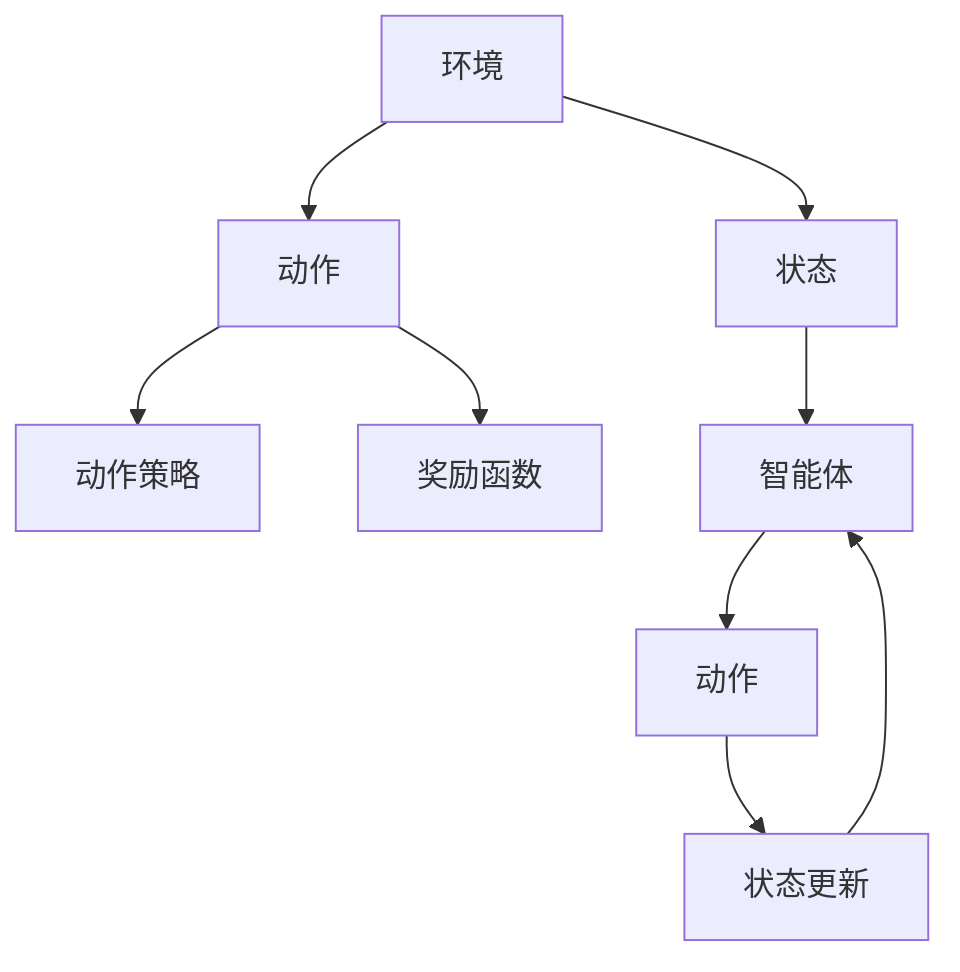

                 

## 1. 背景介绍

在城市化加速和汽车普及的今天，智能交通系统（ITS）已经成为提升城市运行效率、减少交通拥堵和环境污染的关键手段。随着物联网、大数据和人工智能等技术的迅猛发展，智能交通系统正逐渐从传统的信号灯控制向基于大数据和机器学习的自适应交通管理转变。在众多技术手段中，强化学习，尤其是深度Q学习（Deep Q-Learning，DQL），因为其出色的性能和对环境的高度适应性，成为智能交通系统中最有潜力的技术之一。

### 1.1 问题的由来

传统的交通信号控制系统依赖固定的时序或阈值控制，无法根据交通流量和车辆行为自适应调整。随着城市交通状况的日趋复杂，这种“一刀切”的管理方式越来越无法满足交通流的动态需求。例如，高峰时段的交通拥堵、交叉口的车辆阻塞等都是传统系统难以解决的难题。

深度Q学习通过在模拟环境和真实世界中不断学习，能够实时地预测交通流，调整信号灯控制策略，实现交通流的自适应优化。与传统的基于规则的信号控制不同，深度Q学习能够自适应环境变化，优化信号配时，显著提升交通系统的运行效率和稳定性。

### 1.2 问题核心关键点

深度Q学习的核心在于利用模型学习环境-动作-奖励的三元组映射，通过不断试错，优化动作策略，使模型能够最大化总奖励。在智能交通系统中，深度Q学习的关键点包括：

1. **环境建模**：如何建立交通流和信号灯之间的精确模型。
2. **动作策略**：如何设计信号灯的控制策略，以优化交通流。
3. **奖励函数**：如何定义合理的奖励函数，反映交通流的状态和优化目标。
4. **探索与利用**：如何在模型训练过程中平衡探索和利用，确保模型既能够探索新的控制策略，又能够利用已有的经验。
5. **模型评估**：如何评估模型的性能，并根据评估结果进行模型更新。

这些关键点共同决定了深度Q学习在智能交通系统中的表现。只有深刻理解并巧妙设计这些方面，才能发挥深度Q学习的最大效用。

## 2. 核心概念与联系

### 2.1 核心概念概述

为更好地理解深度Q学习在智能交通系统中的应用，本节将介绍几个密切相关的核心概念：

- **深度Q学习（DQL）**：一种基于神经网络的强化学习方法，通过在环境中进行试错学习，优化动作策略，从而最大化总奖励。
- **强化学习（RL）**：一种机器学习方法，通过学习智能体（agent）在环境中的行为策略，使得智能体在特定环境中获得最大奖励。
- **动作策略（Policy）**：智能体在环境中选择动作的策略，通常以神经网络的形式表示。
- **奖励函数（Reward Function）**：定义在每个时间步上，智能体行为带来的奖励，用于衡量策略的好坏。
- **状态（State）**：环境中的状态，通常包括交通流、信号灯状态、时间等，用于描述智能体所处的环境状态。
- **探索与利用（Exploration vs Exploitation）**：在模型训练中，如何平衡对未知环境的探索和利用已知环境的能力。

这些核心概念之间的逻辑关系可以通过以下Mermaid流程图来展示：



这个流程图展示了大语言模型的核心概念及其之间的关系：

1. 环境通过状态（如交通流）向智能体（如信号灯）传递信息。
2. 智能体根据动作策略（如信号灯控制策略）选择动作（如调整信号配时）。
3. 动作对环境产生影响，环境反馈奖励（如交通流畅通度）。
4. 智能体根据奖励和状态更新策略，以优化动作选择。

这些概念共同构成了深度Q学习的学习框架，使得智能体能够在不断变化的环境中自适应优化，提升交通系统性能。

## 3. 核心算法原理 & 具体操作步骤
### 3.1 算法原理概述

深度Q学习的核心原理是通过模型学习环境-动作-奖励的三元组映射，从而优化智能体的动作策略。其基本流程如下：

1. **环境建模**：建立交通流的数学模型，如车辆运动方程、流量守恒等。
2. **动作策略设计**：设计信号灯的控制策略，如绿信比分配、交通流量控制等。
3. **奖励函数定义**：定义奖励函数，衡量交通流的优化目标，如通行能力提升、等待时间减少等。
4. **模型训练**：通过模拟环境和真实数据的训练，优化模型参数，使模型能够最大化总奖励。
5. **策略部署**：将训练好的模型应用于信号灯控制，实时调整信号灯状态，优化交通流。

深度Q学习通过深度神经网络逼近动作策略函数，利用经验回放（Experience Replay）、目标网络（Target Network）等技术优化训练过程，使得模型能够高效学习并适应复杂的交通环境。

### 3.2 算法步骤详解

深度Q学习在智能交通系统中的具体步骤包括：

**Step 1: 环境建模**
- 利用交通流的数学模型，如 vehicular traffic flow models，建立交通流的动态模型。
- 定义状态表示，如当前交通流密度、平均速度、信号灯状态等。
- 根据模型计算环境状态和奖励函数。

**Step 2: 动作策略设计**
- 设计信号灯的控制策略，如绿信比分配、交通流量控制等。
- 设计动作空间，如信号灯的周期、绿灯时间、交叉口控制策略等。
- 设计动作策略网络，如使用卷积神经网络（CNN）、长短期记忆网络（LSTM）等。

**Step 3: 奖励函数定义**
- 根据交通流的优化目标，定义奖励函数，如通行能力提升、等待时间减少等。
- 设计奖励函数网络，用于计算每个动作对应的奖励。
- 设计折扣因子，反映未来奖励的重要性。

**Step 4: 模型训练**
- 初始化模型参数，设定学习率、折扣因子等超参数。
- 将训练数据输入模型，计算Q值，更新模型参数。
- 使用经验回放、目标网络等技术优化训练过程，防止过拟合。
- 根据评估结果，调整超参数，优化模型性能。

**Step 5: 策略部署**
- 将训练好的模型应用于信号灯控制，实时调整信号灯状态。
- 根据实时交通流数据，调整模型参数，持续优化策略。
- 监控系统性能，及时发现并修复问题。

### 3.3 算法优缺点

深度Q学习在智能交通系统中的应用具有以下优点：
1. 自适应性强。深度Q学习能够自适应环境变化，实时调整信号灯控制策略，优化交通流。
2. 效果显著。通过不断学习，深度Q学习能够在复杂交通环境中获得最优的信号控制策略。
3. 灵活性高。深度Q学习能够同时处理多目标优化，如通行能力提升和交通流稳定。
4. 稳定性高。深度Q学习通过优化动作策略，能够应对交通流的动态变化，提高系统稳定性。

同时，深度Q学习也存在一些局限性：
1. 需要大量训练数据。深度Q学习需要大量标注数据进行训练，数据获取成本较高。
2. 计算资源需求大。深度Q学习需要大量的计算资源进行模型训练，硬件需求较高。
3. 模型复杂度高。深度Q学习模型复杂，需要较高的建模和训练技巧。
4. 易受初始参数影响。初始参数设置不当可能导致训练困难或陷入局部最优。

尽管存在这些局限性，但深度Q学习在智能交通系统中的应用已经展示了巨大的潜力，成为了智能交通领域的重要技术手段。未来研究将致力于进一步降低训练成本、提高计算效率和增强模型鲁棒性，推动深度Q学习在交通系统中的广泛应用。

### 3.4 算法应用领域

深度Q学习在智能交通系统中的应用领域广泛，包括：

- 交通信号灯控制：通过实时调整信号灯配时，优化交通流。
- 路径规划与导航：利用深度Q学习优化车辆路径，减少拥堵和能耗。
- 停车管理：优化停车场车位分配，减少停车等待时间。
- 交通事故预测与预防：利用深度Q学习预测交通事故，优化交通流管理策略。
- 公共交通系统：优化公交车的发车时间和路线，提升公共交通效率。
- 动态定价：根据交通流量动态调整停车费、过路费等，提高交通系统效率。

除了上述应用外，深度Q学习还可以与其他AI技术结合，如自动驾驶、车辆调度等，实现更加复杂和高效的交通管理。

## 4. 数学模型和公式 & 详细讲解  
### 4.1 数学模型构建

深度Q学习的数学模型建立在强化学习的基础上，主要包括以下几个关键元素：

- 状态（State）：交通流、信号灯状态、时间等。
- 动作（Action）：信号灯的周期、绿灯时间、交叉口控制策略等。
- 奖励（Reward）：通行能力提升、等待时间减少等。
- 动作策略（Policy）：智能体（如信号灯控制）的动作选择策略。
- Q值（Q-value）：状态-动作对的预期奖励。

深度Q学习的目标是通过模型逼近最优动作策略，使得智能体能够最大化总奖励。其核心方程为Bellman方程：

$$
Q(s,a) = r + \gamma \max_a Q(s',a')
$$

其中 $s$ 为当前状态，$a$ 为当前动作，$r$ 为即时奖励，$s'$ 为下一个状态，$a'$ 为下一个动作，$\gamma$ 为折扣因子。

### 4.2 公式推导过程

以下我们以信号灯控制为例，推导深度Q学习的核心公式。

假设当前状态为 $s$，动作为 $a$，即时奖励为 $r$，下一个状态为 $s'$，动作为 $a'$。根据Bellman方程，有：

$$
Q(s,a) = r + \gamma \max_a Q(s',a')
$$

将奖励函数和动作策略网络 $Q_{\theta}(s,a)$ 代入，得到：

$$
Q(s,a) = r + \gamma \max_a Q_{\theta}(s',a')
$$

在模型训练过程中，通过最小化Q值和目标Q值之间的差距，即：

$$
\min_{\theta} \sum_{s,a} (Q_{\theta}(s,a) - Q_{\theta}^*(s,a))
$$

其中 $Q_{\theta}^*(s,a)$ 为最优的Q值。

通过不断迭代更新模型参数 $\theta$，使得模型能够逼近最优动作策略，提升信号灯控制的性能。

### 4.3 案例分析与讲解

**案例：交通信号灯控制**

在交通信号灯控制中，状态 $s$ 包括交通流密度、交叉口类型、交通信号状态等。动作 $a$ 包括信号灯的周期、绿灯时间、交叉口控制策略等。奖励函数 $r$ 可以根据通行能力提升、等待时间减少等目标设计。动作策略网络 $Q_{\theta}(s,a)$ 可以设计为卷积神经网络或长短期记忆网络，以捕捉交通流的时空特性。

通过在模拟环境和真实数据上进行训练，深度Q学习能够学习到最优的信号灯控制策略。在实际应用中，模型通过实时计算交通流状态，预测最优动作策略，并调整信号灯配时，优化交通流。

## 5. 项目实践：代码实例和详细解释说明
### 5.1 开发环境搭建

在进行深度Q学习实践前，我们需要准备好开发环境。以下是使用Python进行PyTorch开发的环境配置流程：

1. 安装Anaconda：从官网下载并安装Anaconda，用于创建独立的Python环境。

2. 创建并激活虚拟环境：
```bash
conda create -n pytorch-env python=3.8 
conda activate pytorch-env
```

3. 安装PyTorch：根据CUDA版本，从官网获取对应的安装命令。例如：
```bash
conda install pytorch torchvision torchaudio cudatoolkit=11.1 -c pytorch -c conda-forge
```

4. 安装TensorFlow：
```bash
pip install tensorflow
```

5. 安装Gym：用于创建和测试强化学习环境。
```bash
pip install gym
```

6. 安装PyTorch Gym Wrapper：用于将环境数据转换为PyTorch张量。
```bash
pip install gym_pytorch
```

完成上述步骤后，即可在`pytorch-env`环境中开始深度Q学习实践。

### 5.2 源代码详细实现

下面我们以交通信号灯控制为例，给出使用PyTorch和Gym进行深度Q学习的Python代码实现。

首先，定义环境类：

```python
import gym
import numpy as np

class TrafficLightEnv(gym.Env):
    def __init__(self, traffic_settings):
        self.traffic_settings = traffic_settings
        self.state = self._get_initial_state()
        self.t = 0
        self.reward = 0
        
    def reset(self):
        self.t = 0
        self.state = self._get_initial_state()
        self.reward = 0
        return self.state
    
    def step(self, action):
        self.t += 1
        self.state = self._next_state(self.state, action)
        reward = self._get_reward(self.state, self.traffic_settings)
        done = self._check_done(self.state)
        return self.state, reward, done, {}
    
    def render(self):
        pass
    
    def _get_initial_state(self):
        # 根据交通流的数学模型计算初始状态
        pass
    
    def _next_state(self, state, action):
        # 根据当前状态和动作计算下一个状态
        pass
    
    def _get_reward(self, state, traffic_settings):
        # 根据当前状态和交通设置计算奖励
        pass
    
    def _check_done(self, state):
        # 判断是否到达终止状态
        pass
```

然后，定义动作策略类：

```python
import torch.nn as nn

class QNetwork(nn.Module):
    def __init__(self, state_dim, action_dim):
        super(QNetwork, self).__init__()
        self.fc1 = nn.Linear(state_dim, 64)
        self.fc2 = nn.Linear(64, action_dim)
    
    def forward(self, x):
        x = torch.relu(self.fc1(x))
        x = torch.relu(self.fc2(x))
        return x
    
    def get_q_values(self, state):
        state = torch.from_numpy(state).float().unsqueeze(0)
        q_values = self.forward(state)
        return q_values
```

接着，定义模型训练函数：

```python
import torch
import torch.optim as optim

def train(model, env, num_episodes, batch_size=32, learning_rate=0.001, discount_factor=0.9):
    optimizer = optim.Adam(model.parameters(), lr=learning_rate)
    memory = []
    
    for episode in range(num_episodes):
        state = env.reset()
        done = False
        total_reward = 0
        
        while not done:
            action = env.action_space.sample()  # 随机选择动作
            state, reward, done, _ = env.step(action)
            total_reward += reward
            
            if done:
                state = env.reset()
                done = False
                total_reward = 0
            
            memory.append((state, action, reward))
            
            if len(memory) == batch_size:
                memory = np.array(memory)
                Q_values = model.get_q_values(memory[:,0])
                target_Q_values = Q_values + (discount_factor * np.amax(model.get_q_values(memory[:,1]), axis=1))
                
                loss = nn.functional.mse_loss(Q_values, target_Q_values)
                optimizer.zero_grad()
                loss.backward()
                optimizer.step()
                
                memory = []
    
    print(f"Average reward: {total_reward / num_episodes}")
```

最后，启动训练流程：

```python
from gym_pytorch.wrappers import DiscreteWrapper
from torch.autograd import Variable

state_dim = 3  # 状态维度
action_dim = 4  # 动作维度

env = TrafficLightEnv(...)
env = DiscreteWrapper(env)  # 将连续动作空间转换为离散动作空间

model = QNetwork(state_dim, action_dim)
optimizer = optim.Adam(model.parameters(), lr=0.001)
discount_factor = 0.9

train(model, env, num_episodes=1000)
```

以上就是使用PyTorch和Gym进行深度Q学习交通信号灯控制任务的完整代码实现。可以看到，通过PyTorch封装，我们可以更简洁地实现动作策略网络和模型训练。同时，Gym框架的灵活性和易用性使得我们能够轻松创建和测试强化学习环境。

### 5.3 代码解读与分析

让我们再详细解读一下关键代码的实现细节：

**TrafficLightEnv类**：
- `__init__`方法：初始化交通环境，包括交通设置、当前状态、时间步数和奖励。
- `reset`方法：重置环境，并返回初始状态。
- `step`方法：根据动作和状态计算下一状态、奖励和是否结束。
- `_get_initial_state`方法：根据交通流模型计算初始状态。
- `_next_state`方法：根据当前状态和动作计算下一个状态。
- `_get_reward`方法：根据当前状态和交通设置计算奖励。
- `_check_done`方法：判断是否到达终止状态。

**QNetwork类**：
- `__init__`方法：初始化动作策略网络，包括全连接层。
- `forward`方法：定义网络前向传播计算。
- `get_q_values`方法：根据状态计算动作策略网络输出。

**train函数**：
- 定义优化器、记忆缓冲区。
- 在每个迭代中，重置环境，进行模拟训练，记录状态-动作-奖励，直到到达终止状态。
- 如果内存缓冲区达到预设的批处理大小，从内存缓冲区中抽取样本，计算目标Q值和当前Q值，计算损失并更新模型参数。
- 重复上述过程，直至所有迭代完成。

可以看到，PyTorch和Gym框架的结合使得深度Q学习的代码实现变得简洁高效。开发者可以将更多精力放在环境建模和策略设计上，而不必过多关注底层的实现细节。

当然，工业级的系统实现还需考虑更多因素，如模型的保存和部署、超参数的自动搜索、更灵活的环境设计等。但核心的深度Q学习范式基本与此类似。

## 6. 实际应用场景
### 6.1 智能交通系统

深度Q学习在智能交通系统中的应用具有广泛的前景，能够显著提升交通流的优化和管理水平。以下是几个典型的应用场景：

**交通信号灯控制**
- 在交叉路口，通过深度Q学习实时调整信号灯配时，优化交通流。
- 根据实时交通流数据，动态调整信号灯周期和绿灯时间，减少拥堵和等待时间。

**路径规划与导航**
- 利用深度Q学习优化车辆路径，减少拥堵和能耗。
- 根据实时交通流数据，动态调整路径规划，提高导航效率。

**停车管理**
- 优化停车场车位分配，减少停车等待时间。
- 通过深度Q学习动态调整停车费，提高车位利用率。

**交通事故预测与预防**
- 利用深度Q学习预测交通事故，优化交通流管理策略。
- 根据交通事故数据，调整信号灯控制策略，减少交通事故发生。

**公共交通系统**
- 优化公交车的发车时间和路线，提升公共交通效率。
- 根据实时交通流数据，动态调整公交线路，提高公交运行效率。

**动态定价**
- 根据交通流量动态调整停车费、过路费等，提高交通系统效率。
- 通过深度Q学习动态调整公共交通票价，平衡供需关系。

深度Q学习能够处理多目标优化、动态环境变化等复杂问题，为智能交通系统的优化和管理提供了强大的技术手段。

### 6.2 未来应用展望

随着深度Q学习的不断发展和优化，其在智能交通系统中的应用前景广阔，将带来以下几个趋势：

**智能决策与预测**
- 深度Q学习将更多地应用于交通流预测和决策，提升交通系统的预测和优化能力。
- 结合传感器数据和实时监控，深度Q学习能够实时预测交通流，优化交通管理策略。

**动态优化与自适应**
- 深度Q学习能够自适应环境变化，优化信号灯控制策略，提升交通流的稳定性和效率。
- 通过多目标优化，深度Q学习能够在交通效率、环境保护、安全等多个目标之间取得平衡。

**个性化服务与定制化**
- 深度Q学习能够根据用户偏好和需求，提供个性化的交通服务，提升用户体验。
- 通过数据分析和用户反馈，深度Q学习能够不断优化策略，满足用户的定制化需求。

**多模态融合与协作**
- 深度Q学习能够融合视觉、语音、文本等多种数据源，提升交通系统的感知和决策能力。
- 通过协同优化，深度Q学习能够实现交通系统各部分的无缝协作，提升整体效率。

总之，深度Q学习在智能交通系统中的应用将带来革命性的变化，推动交通系统的智能化和自动化进程。未来，随着技术的不断进步和应用场景的扩展，深度Q学习必将在交通系统中发挥更大的作用，为城市的可持续发展提供新的动力。

## 7. 工具和资源推荐
### 7.1 学习资源推荐

为了帮助开发者系统掌握深度Q学习的理论基础和实践技巧，这里推荐一些优质的学习资源：

1. **《深度强化学习》**：Ian Goodfellow等人著，全面介绍了深度强化学习的基本原理和应用，是深度Q学习的经典教材。

2. **DeepMind博客**：DeepMind团队发布的深度学习论文和博客，涵盖深度Q学习的最新进展和实践经验。

3. **PyTorch官方文档**：PyTorch官方文档，提供了深度Q学习及其相关工具的详细介绍和示例代码。

4. **Gym文档**：Gym官方文档，介绍了Gym框架的使用方法和环境设计技巧。

5. **OpenAI Gym**：Gym的官方库，提供了多种环境模拟和测试工具，适合深度Q学习的实验和测试。

通过对这些资源的学习实践，相信你一定能够快速掌握深度Q学习的精髓，并用于解决实际的交通系统问题。

### 7.2 开发工具推荐

高效的开发离不开优秀的工具支持。以下是几款用于深度Q学习开发的常用工具：

1. **PyTorch**：基于Python的开源深度学习框架，灵活的计算图机制，适合深度Q学习的模型训练和优化。

2. **TensorFlow**：由Google主导开发的深度学习框架，支持GPU和TPU加速，适合大规模深度Q学习的实验和部署。

3. **Gym**：开源环境框架，支持多种环境的模拟和测试，适合深度Q学习的模型训练和评估。

4. **TensorBoard**：TensorFlow配套的可视化工具，实时监测模型训练状态，提供丰富的图表呈现方式。

5. **Weights & Biases**：模型训练的实验跟踪工具，记录和可视化模型训练过程中的各项指标，便于调试和优化。

6. **PyTorch Gym Wrapper**：PyTorch的Gym接口，方便将Gym环境数据转换为PyTorch张量，便于深度Q学习的实现。

合理利用这些工具，可以显著提升深度Q学习的开发效率，加快创新迭代的步伐。

### 7.3 相关论文推荐

深度Q学习的核心研究主要集中在强化学习、深度学习、深度强化学习等领域。以下是几篇奠基性的相关论文，推荐阅读：

1. **Playing Atari with Deep Reinforcement Learning**：DeepMind团队发表的论文，首次利用深度Q学习在Atari游戏中取得SOTA成绩，引发了深度强化学习的潮流。

2. **Human-Level Control Through Deep Reinforcement Learning**：DeepMind团队发表的论文，利用深度Q学习在复杂的物理系统中实现人类水平的控制，展示了深度强化学习的潜力。

3. **Deep Multiagent Reinforcement Learning**：DeepMind团队发表的论文，研究多智能体强化学习，展示了深度Q学习在协作和竞争任务中的表现。

4. **Q-Learning for Traffic Signal Control**：John E. Beckmann等人发表的论文，首次利用深度Q学习优化交通信号灯控制，展示了深度Q学习在实际应用中的潜力。

5. **Learning to Drive in a Virtual Environment**：DeepMind团队发表的论文，利用深度Q学习训练自动驾驶系统，展示了深度Q学习在自动驾驶中的应用前景。

这些论文代表了大语言模型微调技术的发展脉络。通过学习这些前沿成果，可以帮助研究者把握学科前进方向，激发更多的创新灵感。

## 8. 总结：未来发展趋势与挑战
### 8.1 总结

本文对深度Q学习在智能交通系统中的应用进行了全面系统的介绍。首先阐述了深度Q学习的背景和意义，明确了其在大规模交通系统优化中的重要价值。其次，从原理到实践，详细讲解了深度Q学习的数学模型和关键步骤，给出了深度Q学习任务开发的完整代码实例。同时，本文还广泛探讨了深度Q学习在智能交通系统中的多种应用场景，展示了其巨大的应用潜力。此外，本文精选了深度Q学习的各类学习资源，力求为读者提供全方位的技术指引。

通过本文的系统梳理，可以看到，深度Q学习在智能交通系统中的应用前景广阔，通过实时学习环境变化，优化信号灯控制策略，显著提升交通系统的运行效率和稳定性。未来，深度Q学习将在更广阔的应用领域，如路径规划、停车管理、公共交通等方面发挥更大的作用，推动智能交通系统的全面升级。

### 8.2 未来发展趋势

展望未来，深度Q学习在智能交通系统中的研究与应用将呈现以下几个趋势：

**算法优化与模型改进**
- 随着深度Q学习的不断优化，其算法复杂度和计算资源需求将逐渐降低，模型将更加轻量级和高效。
- 融合更多先验知识和多模态信息，提高模型的鲁棒性和泛化能力。

**环境模拟与多目标优化**
- 通过更逼真的环境模拟，深度Q学习将能够更好地理解交通流的动态特性，优化多目标任务。
- 通过多智能体协同优化，深度Q学习将实现交通系统各部分的高效协作。

**数据驱动与实时学习**
- 结合大数据和实时监控，深度Q学习将能够实时学习环境变化，快速调整策略。
- 通过持续学习，深度Q学习将不断优化模型参数，适应新的交通环境。

**人机协作与用户反馈**
- 深度Q学习将结合人类决策，实现人机协作，提升交通系统的智能水平。
- 通过用户反馈，深度Q学习将不断优化策略，满足用户的个性化需求。

以上趋势凸显了深度Q学习在智能交通系统中的广阔前景。这些方向的探索发展，必将进一步提升交通系统的性能和应用范围，为城市的可持续发展提供新的动力。

### 8.3 面临的挑战

尽管深度Q学习在智能交通系统中的应用已经取得了显著进展，但在迈向更加智能化、普适化应用的过程中，它仍面临诸多挑战：

**数据获取与标注成本**
- 深度Q学习需要大量的训练数据，数据获取和标注成本较高，限制了其在实际环境中的应用。

**模型复杂性与训练难度**
- 深度Q学习模型复杂，训练过程易受初始参数和超参数的影响，需要较高的建模和调参技巧。

**计算资源与硬件需求**
- 深度Q学习需要大量的计算资源和硬件支持，GPU/TPU等高性能设备是必不可少的，但硬件成本较高。

**环境多样性与泛化能力**
- 交通环境的多样性和复杂性使得深度Q学习模型的泛化能力受到限制，需要在不同环境中进行测试和优化。

**安全性与可解释性**
- 深度Q学习模型的决策过程缺乏可解释性，对于高风险应用，模型的安全性尤为重要。

**伦理道德与隐私保护**
- 深度Q学习模型可能学习到有偏见、有害的信息，需要通过数据筛选和模型约束，确保模型的伦理道德和隐私保护。

这些挑战凸显了深度Q学习在实际应用中的复杂性。只有不断优化算法、降低成本、提高鲁棒性，才能真正实现深度Q学习在智能交通系统中的广泛应用。

### 8.4 研究展望

面对深度Q学习在智能交通系统中的应用挑战，未来的研究需要在以下几个方面寻求新的突破：

**数据增强与样本扩充**
- 探索更多数据增强技术，如数据生成、仿真模拟等，减少对实际数据的依赖。
- 结合多模态数据，丰富训练数据来源，提高模型的泛化能力。

**模型压缩与优化**
- 研究模型压缩和优化技术，如知识蒸馏、稀疏化存储等，提高模型的计算效率和资源利用率。
- 设计轻量级模型架构，适应不同的应用场景和计算资源。

**多目标优化与协同学习**
- 研究多目标优化方法，提升深度Q学习在多个目标之间的平衡能力。
- 探索多智能体协同优化，实现交通系统各部分的高效协作。

**模型解释与可控性**
- 研究模型的可解释性和可控性，增强模型的透明度和安全性。
- 结合符号推理和模型解释工具，提高模型的可解释性和可控性。

**伦理道德与隐私保护**
- 研究模型伦理道德约束，确保模型的决策符合人类的价值观和伦理标准。
- 设计隐私保护机制，确保模型的训练和应用过程中的数据安全。

这些研究方向的探索，必将引领深度Q学习在交通系统中的应用走向新的高度，为城市的可持续发展提供新的技术支持。

## 9. 附录：常见问题与解答

**Q1：深度Q学习在智能交通系统中的应用有哪些？**

A: 深度Q学习在智能交通系统中的应用包括交通信号灯控制、路径规划与导航、停车管理、交通事故预测与预防、公共交通系统优化、动态定价等多个方面。深度Q学习能够实时学习环境变化，优化交通流，提升交通系统的运行效率和稳定性。

**Q2：深度Q学习需要大量训练数据，如何解决数据获取问题？**

A: 深度Q学习需要大量的训练数据，可以通过数据生成、仿真模拟、多源数据融合等方法解决数据获取问题。例如，可以利用历史交通数据进行模拟仿真，生成更多的训练样本。同时，可以通过多种数据源获取交通数据，如车辆定位数据、交通监控数据、社交媒体数据等。

**Q3：深度Q学习模型复杂度高，如何提高模型鲁棒性？**

A: 提高深度Q学习模型的鲁棒性，可以通过以下方法：
1. 使用更多先验知识，如交通规则、安全准则等，引导模型学习合理的策略。
2. 融合多模态数据，如交通监控视频、实时气象数据等，提高模型的泛化能力。
3. 引入对抗训练，生成对抗样本，增强模型的鲁棒性。
4. 使用参数高效微调方法，减少模型的过拟合风险。

**Q4：深度Q学习在实际应用中面临哪些挑战？**

A: 深度Q学习在实际应用中面临以下挑战：
1. 数据获取与标注成本高，限制了其在实际环境中的应用。
2. 模型复杂度高，训练过程易受初始参数和超参数的影响，需要较高的建模和调参技巧。
3. 计算资源与硬件需求大，需要高性能的GPU/TPU设备。
4. 环境多样性与泛化能力受限，需要在不同环境中进行测试和优化。
5. 安全性与可解释性不足，需要设计隐私保护和伦理道德约束机制。

**Q5：深度Q学习在智能交通系统中如何部署？**

A: 深度Q学习在智能交通系统中的部署流程包括：
1. 数据预处理：获取交通数据，并进行清洗和预处理。
2. 环境模拟：利用仿真环境进行模型训练和测试。
3. 模型训练：在仿真环境和真实数据上进行模型训练，优化模型参数。
4. 策略部署：将训练好的模型应用于交通控制系统中，实时调整信号灯配时，优化交通流。
5. 系统监控：实时监控系统性能，及时发现并修复问题。

深度Q学习的部署需要结合多种技术手段，如传感器数据采集、仿真环境、实时监控等，确保模型能够高效、稳定地运行。

---

作者：禅与计算机程序设计艺术 / Zen and the Art of Computer Programming

