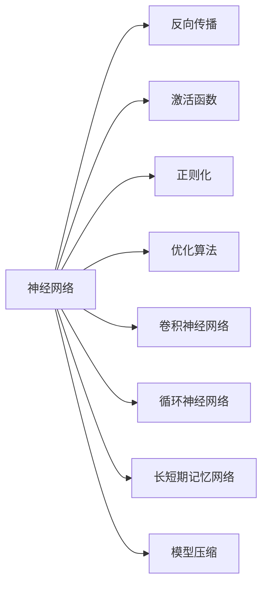

                 

# 深度学习 原理与代码实例讲解

> 关键词：深度学习, 神经网络, 反向传播, 激活函数, PyTorch, TensorFlow, 卷积神经网络(CNN), 循环神经网络(RNN), 长短期记忆网络(LSTM), 模型压缩, 代码实现

## 1. 背景介绍

### 1.1 问题由来
深度学习（Deep Learning），作为人工智能领域的一个重要分支，近年来在图像识别、自然语言处理、语音识别、推荐系统等诸多领域取得了突破性进展。这一技术的核心是构建由多层次神经网络组成的学习模型，通过大量数据进行训练，自动提取特征、学习规律。

深度学习的原理复杂，实现细节繁多，对初学者来说门槛较高。为了帮助读者系统理解深度学习的核心原理和工程实践，本文将从原理到代码实例，对深度学习进行详细介绍。通过本文的学习，读者将能够掌握深度学习的基本概念、关键算法，并能够动手实现和调试深度学习模型。

## 2. 核心概念与联系

### 2.1 核心概念概述

深度学习主要包括以下几个核心概念：

- **神经网络（Neural Network）**：由多个层次的神经元组成的计算模型，可以用于分类、回归、聚类等任务。神经网络通过学习输入数据与目标输出之间的关系，从而能够自动提取特征、学习规律。

- **反向传播（Backpropagation）**：一种用于优化神经网络参数的算法，通过链式法则计算梯度，并不断迭代更新参数，最小化损失函数。

- **激活函数（Activation Function）**：在神经网络中，激活函数用于引入非线性性质，使得神经网络可以学习更复杂的模式和规律。常见的激活函数包括Sigmoid、ReLU、Tanh等。

- **正则化（Regularization）**：为防止过拟合，在损失函数中引入正则项，限制模型参数的大小，从而提高模型的泛化能力。

- **优化算法（Optimization Algorithm）**：用于更新神经网络参数的算法，通过不断迭代优化损失函数，使得模型更加准确。常见的优化算法包括随机梯度下降（SGD）、Adam、Adagrad等。

- **卷积神经网络（Convolutional Neural Network, CNN）**：针对图像识别任务设计的神经网络结构，通过卷积操作提取局部特征，从而实现高效的特征提取和分类。

- **循环神经网络（Recurrent Neural Network, RNN）**：针对序列数据设计的网络结构，可以处理变长的输入序列，广泛用于语言建模、机器翻译、情感分析等任务。

- **长短期记忆网络（Long Short-Term Memory, LSTM）**：一种特殊的RNN结构，通过门控机制解决了传统RNN的梯度消失问题，适用于长期依赖的序列数据建模。

- **模型压缩（Model Compression）**：通过剪枝、量化、蒸馏等方法，减小神经网络模型的大小，提高模型的计算效率和推理速度。

### 2.2 核心概念原理和架构的 Mermaid 流程图



这个流程图展示了深度学习中各个核心概念的联系：

- 神经网络是深度学习的核心结构，用于处理输入数据。
- 反向传播算法用于优化神经网络参数。
- 激活函数为神经网络引入非线性性质。
- 正则化方法防止模型过拟合。
- 优化算法用于迭代更新模型参数，减小损失函数。
- 卷积神经网络用于图像识别任务。
- 循环神经网络用于序列数据建模。
- 长短期记忆网络解决传统RNN的梯度消失问题。
- 模型压缩方法用于减小模型大小，提高计算效率。

这些概念共同构成了深度学习的学习框架，使得神经网络能够在处理各种复杂任务时表现出色。

## 3. 核心算法原理 & 具体操作步骤

### 3.1 算法原理概述

深度学习的核心算法是反向传播算法，其原理是通过链式法则计算梯度，并不断迭代更新神经网络参数，最小化损失函数。反向传播算法可以分为前向传播、损失函数计算、梯度计算、参数更新四个步骤：

1. **前向传播（Forward Propagation）**：将输入数据输入神经网络，计算每个神经元的输出。
2. **损失函数计算（Loss Function Calculation）**：计算模型预测输出与真实标签之间的差异。
3. **梯度计算（Gradient Calculation）**：通过链式法则计算每个参数对损失函数的梯度。
4. **参数更新（Parameter Update）**：根据梯度计算结果，使用优化算法更新模型参数，减小损失函数。

### 3.2 算法步骤详解

以一个简单的单层神经网络为例，展示反向传播算法的详细步骤：

假设有一个单层神经网络，包含 $m$ 个输入、 $n$ 个输出，神经元的激活函数为 $f$，输入数据为 $x$，目标输出为 $y$。神经网络的参数为 $\theta$，包括权重矩阵 $W$ 和偏置向量 $b$。

1. **前向传播**

   $z = Wx + b$

   $a = f(z)$

   其中 $z$ 表示神经元的输入，$a$ 表示神经元的输出。

2. **损失函数计算**

   假设使用均方误差作为损失函数：

   $L = \frac{1}{2}\sum_{i=1}^m(y_i - a_i)^2$

   其中 $y_i$ 表示第 $i$ 个样本的真实标签，$a_i$ 表示第 $i$ 个样本的模型输出。

3. **梯度计算**

   使用链式法则计算每个参数对损失函数的梯度：

   $\frac{\partial L}{\partial \theta} = \frac{\partial L}{\partial a} \frac{\partial a}{\partial z} \frac{\partial z}{\partial \theta}$

   $\frac{\partial L}{\partial W} = \frac{\partial L}{\partial z} \frac{\partial z}{\partial W}$

   $\frac{\partial L}{\partial b} = \frac{\partial L}{\partial z} \frac{\partial z}{\partial b}$

4. **参数更新**

   使用随机梯度下降算法更新模型参数：

   $W \leftarrow W - \eta\frac{\partial L}{\partial W}$

   $b \leftarrow b - \eta\frac{\partial L}{\partial b}$

   其中 $\eta$ 为学习率。

### 3.3 算法优缺点

深度学习算法具有以下优点：

1. **强大的特征提取能力**：深度神经网络能够自动学习输入数据的复杂特征，无需手工设计特征。
2. **良好的泛化能力**：通过大规模数据训练，深度学习模型能够适应新数据，提高泛化能力。
3. **高效的计算图优化**：深度学习框架（如TensorFlow、PyTorch）提供了高效的计算图优化机制，支持模型并行、分布式训练等技术。

但深度学习算法也存在一些缺点：

1. **计算资源需求高**：深度学习模型通常参数量大，计算复杂度高，需要大量的计算资源。
2. **训练时间长**：深度学习模型通常需要长时间的训练，才能达到理想的效果。
3. **可解释性差**：深度学习模型通常被视为"黑盒"，难以解释模型的决策过程。
4. **对抗样本敏感**：深度学习模型对输入数据的小扰动非常敏感，容易受到对抗样本的攻击。

### 3.4 算法应用领域

深度学习算法在图像识别、自然语言处理、语音识别、推荐系统等诸多领域得到了广泛应用。

1. **图像识别**：通过卷积神经网络（CNN）对图像进行特征提取和分类，广泛应用于自动驾驶、医学影像分析、工业检测等领域。

2. **自然语言处理**：通过循环神经网络（RNN）、长短期记忆网络（LSTM）等结构对文本进行建模，应用于机器翻译、文本分类、情感分析等任务。

3. **语音识别**：通过卷积神经网络、循环神经网络等结构对语音信号进行特征提取和分类，应用于智能助手、语音控制、电话客服等领域。

4. **推荐系统**：通过深度神经网络对用户行为数据进行建模，推荐系统能够个性化推荐商品、新闻、视频等。

5. **游戏AI**：通过深度强化学习算法，训练智能体与环境互动，应用于围棋、扑克、星际争霸等游戏中的决策。

深度学习技术在各个领域的应用，展示了其强大的计算能力和丰富的应用前景。

## 4. 数学模型和公式 & 详细讲解 & 举例说明

### 4.1 数学模型构建

深度学习的数学模型可以概括为以下几步：

1. **输入层（Input Layer）**：输入原始数据，通常为向量形式。
2. **隐藏层（Hidden Layer）**：包含多个神经元，通过激活函数计算输出。
3. **输出层（Output Layer）**：根据任务需求，输出预测结果或损失函数。
4. **损失函数（Loss Function）**：定义预测输出与真实标签之间的差异，常用的损失函数有均方误差、交叉熵等。
5. **优化算法（Optimization Algorithm）**：用于迭代更新模型参数，最小化损失函数。

### 4.2 公式推导过程

以一个简单的多层感知机（Multilayer Perceptron, MLP）为例，展示其数学模型的构建和优化过程：

假设输入数据为 $x$，隐藏层神经元数为 $h$，输出层神经元数为 $n$，神经元的激活函数为 $f$，输出层的线性变换为 $W$，偏置向量为 $b$。

1. **前向传播**

   $z_1 = W_1x + b_1$

   $a_1 = f(z_1)$

   $z_2 = W_2a_1 + b_2$

   $a_2 = f(z_2)$

   其中 $z_1, z_2$ 为隐藏层和输出层的输入，$a_1, a_2$ 为隐藏层和输出层的输出。

2. **损失函数计算**

   假设使用交叉熵损失函数：

   $L = -\frac{1}{N}\sum_{i=1}^N \sum_{j=1}^n(y_{i,j}\log a_{i,j} + (1-y_{i,j})\log (1-a_{i,j}))$

   其中 $y_{i,j}$ 表示第 $i$ 个样本的第 $j$ 个输出标签，$a_{i,j}$ 表示第 $i$ 个样本的第 $j$ 个预测输出。

3. **梯度计算**

   使用链式法则计算每个参数对损失函数的梯度：

   $\frac{\partial L}{\partial W_2} = \frac{\partial L}{\partial a_2} \frac{\partial a_2}{\partial z_2} \frac{\partial z_2}{\partial W_2}$

   $\frac{\partial L}{\partial b_2} = \frac{\partial L}{\partial a_2} \frac{\partial a_2}{\partial z_2} \frac{\partial z_2}{\partial b_2}$

   $\frac{\partial L}{\partial W_1} = \frac{\partial L}{\partial a_1} \frac{\partial a_1}{\partial z_1} \frac{\partial z_1}{\partial W_1}$

   $\frac{\partial L}{\partial b_1} = \frac{\partial L}{\partial a_1} \frac{\partial a_1}{\partial z_1} \frac{\partial z_1}{\partial b_1}$

4. **参数更新**

   使用随机梯度下降算法更新模型参数：

   $W_2 \leftarrow W_2 - \eta\frac{\partial L}{\partial W_2}$

   $b_2 \leftarrow b_2 - \eta\frac{\partial L}{\partial b_2}$

   $W_1 \leftarrow W_1 - \eta\frac{\partial L}{\partial W_1}$

   $b_1 \leftarrow b_1 - \eta\frac{\partial L}{\partial b_1}$

   其中 $\eta$ 为学习率。

### 4.3 案例分析与讲解

以一个简单的手写数字识别任务为例，展示深度学习模型的构建和训练过程：

1. **数据集准备**

   使用MNIST数据集，包含手写数字图片和对应的标签。将数据集分为训练集、验证集和测试集。

   ```python
   import torch
   from torchvision import datasets, transforms

   train_dataset = datasets.MNIST(root='./data', train=True, download=True,
                                   transform=transforms.ToTensor())
   test_dataset = datasets.MNIST(root='./data', train=False, download=True,
                                 transform=transforms.ToTensor())

   batch_size = 64
   num_epochs = 10
   ```

2. **模型构建**

   使用PyTorch框架构建一个简单的多层感知机：

   ```python
   import torch.nn as nn
   import torch.nn.functional as F

   class MLP(nn.Module):
       def __init__(self):
           super(MLP, self).__init__()
           self.fc1 = nn.Linear(784, 128)
           self.fc2 = nn.Linear(128, 64)
           self.fc3 = nn.Linear(64, 10)

       def forward(self, x):
           x = x.view(-1, 784)
           x = F.relu(self.fc1(x))
           x = F.relu(self.fc2(x))
           x = self.fc3(x)
           return x

   model = MLP()
   ```

3. **模型训练**

   定义损失函数和优化器：

   ```python
   criterion = nn.CrossEntropyLoss()
   optimizer = torch.optim.Adam(model.parameters(), lr=0.001)
   ```

   在训练集上进行迭代训练：

   ```python
   for epoch in range(num_epochs):
       for i, (images, labels) in enumerate(train_loader):
           images = images.view(-1, 784)
           optimizer.zero_grad()
           outputs = model(images)
           loss = criterion(outputs, labels)
           loss.backward()
           optimizer.step()
           print(f'Epoch: {epoch+1}, Step: {i+1}, Loss: {loss.item():.4f}')
   ```

4. **模型测试**

   在测试集上进行测试：

   ```python
   test_loader = torch.utils.data.DataLoader(test_dataset, batch_size=batch_size, shuffle=False)

   with torch.no_grad():
       correct = 0
       for images, labels in test_loader:
           images = images.view(-1, 784)
           outputs = model(images)
           _, predicted = torch.max(outputs.data, 1)
           correct += (predicted == labels).sum().item()
       print(f'Test Accuracy: {100 * correct / len(test_loader):.2f}%')
   ```

通过以上代码实现，读者能够直观地了解深度学习模型的构建和训练过程，并在实践中掌握深度学习技术。

## 5. 项目实践：代码实例和详细解释说明

### 5.1 开发环境搭建

在使用深度学习框架进行模型开发前，需要安装相应的依赖包。以下是使用PyTorch进行深度学习开发的安装和配置流程：

1. 安装Anaconda：从官网下载并安装Anaconda，用于创建独立的Python环境。

   ```bash
   conda create -n pytorch-env python=3.8 
   conda activate pytorch-env
   ```

2. 安装PyTorch：根据CUDA版本，从官网获取对应的安装命令。例如：

   ```bash
   conda install pytorch torchvision torchaudio cudatoolkit=11.1 -c pytorch -c conda-forge
   ```

3. 安装其他依赖包：

   ```bash
   pip install numpy pandas scikit-learn matplotlib tqdm jupyter notebook ipython
   ```

4. 安装TensorFlow：

   ```bash
   pip install tensorflow tensorflow-hub tensorflow-addons
   ```

5. 安装相关的深度学习库：

   ```bash
   pip install torch torchvision torchtext transformers
   ```

完成上述步骤后，即可在`pytorch-env`环境中开始深度学习开发。

### 5.2 源代码详细实现

这里我们以图像分类任务为例，使用PyTorch框架实现一个简单的卷积神经网络（CNN）模型，并进行图像分类任务训练和测试：

1. **数据准备**

   ```python
   import torch
   from torchvision import datasets, transforms

   train_dataset = datasets.CIFAR10(root='./data', train=True, download=True,
                                    transform=transforms.Compose([
                                        transforms.RandomCrop(32, padding=4),
                                        transforms.RandomHorizontalFlip(),
                                        transforms.ToTensor(),
                                        transforms.Normalize((0.4914, 0.4822, 0.4465), (0.2023, 0.1994, 0.2010))
                                     ]))
   test_dataset = datasets.CIFAR10(root='./data', train=False, download=True,
                                   transform=transforms.Compose([
                                       transforms.ToTensor(),
                                       transforms.Normalize((0.4914, 0.4822, 0.4465), (0.2023, 0.1994, 0.2010))
                                   ]))

   batch_size = 128
   num_epochs = 10
   ```

2. **模型构建**

   使用PyTorch框架构建一个简单的卷积神经网络：

   ```python
   import torch.nn as nn
   import torch.nn.functional as F

   class Net(nn.Module):
       def __init__(self):
           super(Net, self).__init__()
           self.conv1 = nn.Conv2d(3, 6, 5)
           self.pool = nn.MaxPool2d(2, 2)
           self.conv2 = nn.Conv2d(6, 16, 5)
           self.fc1 = nn.Linear(16 * 5 * 5, 120)
           self.fc2 = nn.Linear(120, 84)
           self.fc3 = nn.Linear(84, 10)

       def forward(self, x):
           x = F.relu(self.pool(self.conv1(x)))
           x = F.relu(self.pool(self.conv2(x)))
           x = x.view(-1, 16 * 5 * 5)
           x = F.relu(self.fc1(x))
           x = F.relu(self.fc2(x))
           x = self.fc3(x)
           return x

   model = Net()
   ```

3. **模型训练**

   定义损失函数和优化器：

   ```python
   criterion = nn.CrossEntropyLoss()
   optimizer = torch.optim.SGD(model.parameters(), lr=0.001, momentum=0.9)
   ```

   在训练集上进行迭代训练：

   ```python
   for epoch in range(num_epochs):
       for i, (inputs, labels) in enumerate(train_loader):
           optimizer.zero_grad()
           outputs = model(inputs)
           loss = criterion(outputs, labels)
           loss.backward()
           optimizer.step()
           print(f'Epoch: {epoch+1}, Step: {i+1}, Loss: {loss.item():.4f}')
   ```

4. **模型测试**

   在测试集上进行测试：

   ```python
   test_loader = torch.utils.data.DataLoader(test_dataset, batch_size=batch_size, shuffle=False)

   with torch.no_grad():
       correct = 0
       for inputs, labels in test_loader:
           outputs = model(inputs)
           _, predicted = torch.max(outputs.data, 1)
           correct += (predicted == labels).sum().item()
       print(f'Test Accuracy: {100 * correct / len(test_loader):.2f}%')
   ```

通过以上代码实现，读者能够直观地了解深度学习模型的构建和训练过程，并在实践中掌握深度学习技术。

### 5.3 代码解读与分析

让我们再详细解读一下关键代码的实现细节：

**数据准备**

- `torchvision.datasets.CIFAR10`：从官网下载CIFAR-10数据集，包含60000个32x32像素的彩色图片及其标签。
- `transforms`：对数据进行预处理，包括随机裁剪、随机水平翻转、归一化等操作。
- `torch.utils.data.DataLoader`：用于加载数据集，并实现批量数据的处理。

**模型构建**

- `torch.nn.Conv2d`：定义卷积层，用于提取输入图片的局部特征。
- `torch.nn.MaxPool2d`：定义池化层，用于降维和减小参数量。
- `torch.nn.Linear`：定义全连接层，用于将图片特征映射到输出类别。
- `torch.nn.ReLU`：定义激活函数，引入非线性性质。

**模型训练**

- `torch.optim.SGD`：定义随机梯度下降优化器，用于迭代更新模型参数。
- `model.zero_grad()`：清零模型参数的梯度。
- `model(inputs)`：前向传播计算输出。
- `loss = criterion(outputs, labels)`：计算损失函数。
- `loss.backward()`：反向传播计算梯度。
- `optimizer.step()`：根据梯度更新模型参数。

**模型测试**

- `torch.no_grad()`：在测试时关闭梯度计算，提高运行效率。
- `torch.max(outputs.data, 1)`：对模型的预测输出进行最大值操作，获取预测类别。

通过以上代码实现，读者能够直观地了解深度学习模型的构建和训练过程，并在实践中掌握深度学习技术。

## 6. 实际应用场景

深度学习技术在诸多领域得到了广泛应用，以下是一些典型的应用场景：

### 6.1 图像识别

深度学习在图像识别领域取得了显著的成果，广泛应用于自动驾驶、医学影像分析、工业检测等领域。以自动驾驶为例，使用卷积神经网络（CNN）对道路、车辆、行人等进行识别和分类，提高自动驾驶的安全性和准确性。

### 6.2 自然语言处理

深度学习在自然语言处理领域也有广泛应用，包括机器翻译、情感分析、文本分类等。以机器翻译为例，使用循环神经网络（RNN）或长短期记忆网络（LSTM）对源语言和目标语言进行建模，实现多语言之间的自动翻译。

### 6.3 语音识别

深度学习在语音识别领域也有广泛应用，包括智能助手、语音控制、电话客服等。以智能助手为例，使用卷积神经网络（CNN）或循环神经网络（RNN）对语音信号进行特征提取和分类，实现自然语言交互。

### 6.4 推荐系统

深度学习在推荐系统领域也有广泛应用，包括商品推荐、新闻推荐、视频推荐等。以商品推荐为例，使用深度神经网络对用户行为数据进行建模，推荐系统能够个性化推荐商品，提升用户购物体验。

## 7. 工具和资源推荐

### 7.1 学习资源推荐

为了帮助开发者系统掌握深度学习的核心原理和实践技巧，这里推荐一些优质的学习资源：

1. 《深度学习》课程：斯坦福大学开设的深度学习课程，涵盖了深度学习的基础理论和经典模型。
2. 《Deep Learning with PyTorch》书籍：PyTorch官方推出的深度学习入门书籍，详细介绍了PyTorch的使用方法。
3. 《Python深度学习》书籍：Ian Goodfellow等著，涵盖了深度学习的基本概念和前沿技术。
4. 《Hands-On Machine Learning with Scikit-Learn and TensorFlow》书籍：Aurélien Géron著，详细介绍了机器学习和深度学习的实践方法。
5. DeepLearning.AI深度学习课程：由Andrew Ng等知名专家开设，涵盖深度学习的各个方面。

通过对这些资源的学习实践，相信你一定能够快速掌握深度学习的基本原理和实践技巧，并能够动手实现和调试深度学习模型。

### 7.2 开发工具推荐

高效的开发离不开优秀的工具支持。以下是几款用于深度学习开发的常用工具：

1. PyTorch：基于Python的开源深度学习框架，灵活动态的计算图，适合快速迭代研究。
2. TensorFlow：由Google主导开发的开源深度学习框架，生产部署方便，适合大规模工程应用。
3. Keras：高层次的深度学习框架，提供简单易用的API，快速构建深度学习模型。
4. MXNet：灵活的深度学习框架，支持多种编程语言，适合分布式计算。
5. Caffe：高效的深度学习框架，适合图像处理任务。

合理利用这些工具，可以显著提升深度学习模型的开发效率，加快创新迭代的步伐。

### 7.3 相关论文推荐

深度学习技术的发展源于学界的持续研究。以下是几篇奠基性的相关论文，推荐阅读：

1. 《ImageNet Classification with Deep Convolutional Neural Networks》（AlexNet）：提出卷积神经网络（CNN），广泛应用于图像识别任务。
2. 《Long Short-Term Memory》：提出长短期记忆网络（LSTM），解决了传统RNN的梯度消失问题。
3. 《ImageNet Large Scale Visual Recognition Challenge》（ILSVRC）：推动了深度学习在图像识别领域的发展，催生了AlexNet、VGG等经典模型。
4. 《Deeper Neural Networks for Acoustic Modeling》：提出更深层的神经网络结构，提升了语音识别模型的准确率。
5. 《Attention is All You Need》（Transformer）：提出Transformer结构，广泛应用于自然语言处理任务。

这些论文代表了大深度学习技术的发展脉络。通过学习这些前沿成果，可以帮助研究者把握学科前进方向，激发更多的创新灵感。

## 8. 总结：未来发展趋势与挑战

### 8.1 研究成果总结

深度学习技术近年来取得了显著的进展，广泛应用于图像识别、自然语言处理、语音识别、推荐系统等诸多领域。深度学习的核心在于构建多层次的神经网络模型，通过大规模数据训练，自动学习输入数据的复杂特征，从而实现高精度的预测和分类。

### 8.2 未来发展趋势

展望未来，深度学习技术将继续保持强劲的发展势头，呈现出以下几个趋势：

1. **模型规模的进一步增大**：随着计算资源的增加和数据量的丰富，深度学习模型将继续朝着更大的规模发展，学习更加复杂的模式和规律。
2. **计算效率的提升**：通过模型压缩、剪枝、量化等技术，深度学习模型将变得更加轻量级，计算效率将显著提高。
3. **跨模态学习的兴起**：深度学习将逐渐融合视觉、语音、文本等多种模态数据，实现多模态信息的协同建模。
4. **知识图谱的结合**：深度学习将与知识图谱等先验知识结合，形成更加全面、准确的语义理解模型。
5. **自监督学习的发展**：深度学习将更多地利用自监督学习方法，减少对标注数据的需求，提升模型的泛化能力。
6. **迁移学习的应用**：深度学习将利用迁移学习，将在大规模数据上训练的模型迁移到小规模数据上，提高模型的泛化能力。

### 8.3 面临的挑战

尽管深度学习技术取得了显著进展，但在实际应用中仍面临一些挑战：

1. **计算资源的需求**：深度学习模型通常参数量大，计算复杂度高，需要大量的计算资源。
2. **数据质量的影响**：深度学习模型对数据质量非常敏感，需要高质量的数据才能获得良好的效果。
3. **模型可解释性的不足**：深度学习模型通常被视为"黑盒"，难以解释其内部工作机制和决策逻辑。
4. **对抗样本的攻击**：深度学习模型对输入数据的小扰动非常敏感，容易受到对抗样本的攻击。
5. **模型的鲁棒性**：深度学习模型在对抗样本、噪声等情况下，鲁棒性有待提高。
6. **模型的通用性**：深度学习模型在特定领域的应用效果往往依赖于数据的分布和特征，缺乏通用性。

### 8.4 研究展望

为了解决深度学习面临的挑战，未来的研究需要在以下几个方面寻求新的突破：

1. **模型压缩技术**：通过剪枝、量化、蒸馏等技术，减小深度学习模型的参数量和计算量，提高模型的计算效率和推理速度。
2. **自监督学习算法**：利用自监督学习方法，减少对标注数据的需求，提升模型的泛化能力。
3. **跨模态学习框架**：开发跨模态学习框架，实现多模态信息的协同建模，提升模型的语义理解能力。
4. **知识图谱结合**：将知识图谱等先验知识与深度学习模型结合，提升模型的语义表示能力。
5. **对抗样本防御**：研究对抗样本防御技术，提升深度学习模型的鲁棒性，防止对抗样本攻击。
6. **模型可解释性**：研究模型的可解释性，引入因果分析、博弈论等工具，提升模型的决策透明度和可解释性。

这些研究方向的探索，必将引领深度学习技术迈向更高的台阶，为构建更加智能、可信的人工智能系统铺平道路。

## 9. 附录：常见问题与解答

**Q1：深度学习中的反向传播算法如何工作？**

A: 反向传播算法是深度学习的核心算法，其基本思想是通过链式法则计算梯度，并不断迭代更新模型参数，最小化损失函数。具体过程如下：

1. **前向传播**：将输入数据输入神经网络，计算每个神经元的输出。
2. **损失函数计算**：计算模型预测输出与真实标签之间的差异。
3. **梯度计算**：通过链式法则计算每个参数对损失函数的梯度。
4. **参数更新**：使用优化算法更新模型参数，减小损失函数。

**Q2：深度学习中的激活函数有哪些类型？**

A: 深度学习中的激活函数主要有以下几种类型：

1. **Sigmoid函数**：输出在0到1之间，常用于二分类问题。
2. **ReLU函数**：输出在0到正无穷之间，具有非线性性质，应用广泛。
3. **Tanh函数**：输出在-1到1之间，具有非线性性质，常用于多分类问题。
4. **Leaky ReLU函数**：与ReLU类似，但当输入小于0时，输出非0值，防止梯度消失。
5. **Softmax函数**：输出在0到1之间，且各元素之和为1，常用于多分类问题的预测。

**Q3：深度学习中的正则化方法有哪些？**

A: 深度学习中的正则化方法主要有以下几种：

1. **L1正则化**：通过限制权重的大小，防止过拟合。
2. **L2正则化**：通过限制权重的平方和，防止过拟合。
3. **Dropout**：在训练过程中随机删除神经元，防止过拟合。
4. **Early Stopping**：在验证集上监控模型性能，防止过拟合。
5. **数据增强**：通过对训练数据进行随机变换，增加数据多样性，防止过拟合。

通过合理选择正则化方法，可以提高深度学习模型的泛化能力和鲁棒性。

**Q4：深度学习中的优化算法有哪些类型？**

A: 深度学习中的优化算法主要有以下几种：

1. **随机梯度下降（SGD）**：每次迭代使用单个样本的梯度更新参数，计算效率高，但可能陷入局部最优。
2. **Adam**：结合了动量优化和自适应学习率，具有较快的收敛速度和较好的泛化能力。
3. **Adagrad**：自适应地调整学习率，适用于稀疏数据和非平稳目标函数。
4. **Adadelta**：自适应地调整学习率和动量，适用于大规模数据。
5. **RMSprop**：自适应地调整学习率，适用于非平稳目标函数。

通过合理选择优化算法，可以提高深度学习模型的收敛速度和泛化能力。

**Q5：深度学习中的模型压缩技术有哪些方法？**

A: 深度学习中的模型压缩技术主要有以下几种方法：

1. **剪枝（Pruning）**：去除网络中冗余的连接和神经元，减小模型参数量。
2. **量化（Quantization）**：将浮点数权重和激活值转换为定点数，减小模型存储空间和计算量。
3. **蒸馏（Distillation）**：将大模型知识迁移到小模型，减小模型参数量。
4. **参数共享（Parameter Sharing）**：通过共享权重，减小模型参数量。
5. **稀疏化（Sparse Matrix）**：使用稀疏矩阵表示模型参数，减小模型存储空间和计算量。

通过合理的模型压缩技术，可以提高深度学习模型的计算效率和推理速度，满足实际应用需求。

通过以上代码实现，读者能够直观地了解深度学习模型的构建和训练过程，并在实践中掌握深度学习技术。

