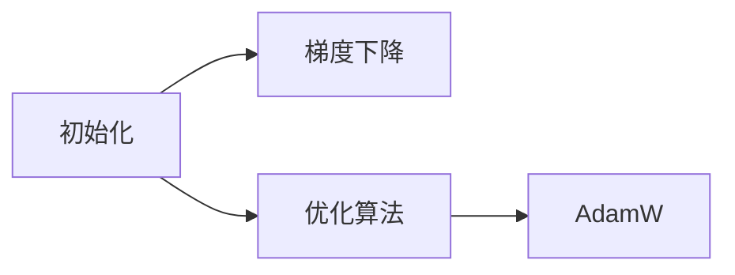

                 

# 深度学习优化技巧：初始化、优化算法和AdamW

> 关键词：深度学习,优化算法,初始化,AdamW,深度学习框架,模型训练,梯度下降,自适应学习率

## 1. 背景介绍

### 1.1 问题由来
深度学习模型的优化问题一直以来都是研究的热点和难点。特别是在训练大规模的神经网络时，如何选择合适的网络结构和初始化参数，以及在每个训练步骤中如何高效地更新参数，是一个复杂而有趣的问题。错误的初始化会导致模型无法收敛，而低效的优化算法则可能陷入局部最优，无法达到最优解。因此，本文将系统地介绍深度学习中的优化技巧，包括初始化、优化算法和AdamW。

### 1.2 问题核心关键点
本文将深入探讨深度学习优化过程中的一些关键问题：
- 如何正确地初始化神经网络的权重参数？
- 有哪些常用的优化算法可以用于神经网络的训练？
- 什么是AdamW算法？它与传统的Adam算法有何不同？
- 在实际应用中，我们如何选择优化算法和初始化方法？
- 深度学习框架（如TensorFlow、PyTorch）提供的优化工具有哪些？

## 2. 核心概念与联系

### 2.1 核心概念概述

为更好地理解本文内容，首先介绍几个关键概念：

- **初始化（Initialization）**：神经网络的权重参数在训练前需要进行初始化，常见的初始化方法有随机初始化、Xavier初始化、He初始化等。
- **优化算法（Optimization Algorithms）**：用于更新神经网络中权重参数，以最小化损失函数的算法。包括梯度下降、随机梯度下降、动量梯度下降、Adagrad、Adam等。
- **AdamW算法（Adaptive Moment Estimation with Weight Decay）**：一种基于梯度的一阶优化算法，结合了动量梯度下降和自适应学习率的思想，并引入了权重衰减（Weight Decay）机制，适用于大规模深度学习模型训练。

以上这些概念通过一系列的优化操作，确保神经网络在训练过程中不断提升其预测准确度。

### 2.2 核心概念原理和架构的 Mermaid 流程图



该图展示了从权重参数初始化到使用AdamW算法进行梯度下降的过程，其中权重参数是深度学习模型训练的核心要素，而梯度下降则是模型训练的主要优化算法，AdamW算法作为梯度下降的一种变体，则进一步提升了模型训练的效率和效果。

## 3. 核心算法原理 & 具体操作步骤

### 3.1 算法原理概述

深度学习模型的优化问题通常通过梯度下降（Gradient Descent）算法来解决。梯度下降算法通过计算损失函数对权重参数的梯度，并更新权重参数，以最小化损失函数。其数学公式如下：

$$
\theta := \theta - \eta \nabla_{\theta} \mathcal{L}(\theta)
$$

其中，$\theta$为权重参数，$\eta$为学习率，$\nabla_{\theta} \mathcal{L}(\theta)$为损失函数对权重参数的梯度。

### 3.2 算法步骤详解

梯度下降算法的具体步骤如下：

1. **初始化**：随机初始化权重参数$\theta$。
2. **前向传播**：将训练数据输入模型，计算预测输出和损失函数。
3. **反向传播**：计算损失函数对权重参数的梯度$\nabla_{\theta} \mathcal{L}(\theta)$。
4. **更新参数**：使用梯度下降算法更新权重参数，即$\theta := \theta - \eta \nabla_{\theta} \mathcal{L}(\theta)$。

通过不断迭代，使得模型能够逐步逼近最优解。

### 3.3 算法优缺点

梯度下降算法具有以下优点：

- 简单易懂，易于实现。
- 理论上能够保证收敛到全局最优解。

但同时也有以下缺点：

- 当梯度较为平坦时，收敛速度较慢。
- 对学习率的选取敏感，学习率过大或过小都会影响收敛效果。
- 在训练过程中，需要手动调整学习率，增加了调参的复杂度。

### 3.4 算法应用领域

梯度下降算法广泛应用于各种深度学习任务，包括图像识别、自然语言处理、语音识别、推荐系统等。在实际应用中，梯度下降算法结合了不同的优化技巧，如批量梯度下降、随机梯度下降、动量梯度下降等，以提升训练效率和效果。

## 4. 数学模型和公式 & 详细讲解 & 举例说明

### 4.1 数学模型构建

考虑一个简单的全连接神经网络，其包含一个输入层、一个隐藏层和一个输出层。假设隐藏层有$n$个神经元，每个神经元的权重向量为$\theta_i$。输入为$x$，输出为$y$，损失函数为$\mathcal{L}$。

神经网络的输出由隐藏层激活函数和权重参数计算得到：

$$
y = \sigma\left(\sum_{i=1}^n x_i \theta_i + b\right)
$$

其中，$\sigma$为激活函数，$b$为偏置项。

### 4.2 公式推导过程

梯度下降算法需要计算损失函数对权重参数的梯度。以均方误差损失函数为例，推导过程如下：

假设输入为$x$，输出为$y$，目标输出为$y'$，则损失函数为：

$$
\mathcal{L} = \frac{1}{2}(y - y')^2
$$

对损失函数求导，得到梯度：

$$
\nabla_{\theta} \mathcal{L} = (y - y') \frac{\partial}{\partial \theta} \sigma\left(\sum_{i=1}^n x_i \theta_i + b\right)
$$

将梯度代入梯度下降公式：

$$
\theta := \theta - \eta (y - y') \frac{\partial}{\partial \theta} \sigma\left(\sum_{i=1}^n x_i \theta_i + b\right)
$$

这就是梯度下降算法的核心公式。

### 4.3 案例分析与讲解

以手写数字识别任务为例，使用梯度下降算法训练一个简单的全连接神经网络。首先，随机初始化权重参数，然后通过前向传播计算输出，计算损失函数，再使用反向传播计算梯度，最后更新权重参数。通过不断迭代，训练模型逐步提升预测准确度。

## 5. 项目实践：代码实例和详细解释说明

### 5.1 开发环境搭建

为了进行深度学习模型的训练，需要搭建合适的开发环境。以下是使用Python和TensorFlow进行深度学习开发的环境配置流程：

1. 安装Anaconda：从官网下载并安装Anaconda，用于创建独立的Python环境。
2. 创建并激活虚拟环境：
```bash
conda create -n tf-env python=3.8 
conda activate tf-env
```
3. 安装TensorFlow：根据CUDA版本，从官网获取对应的安装命令。例如：
```bash
conda install tensorflow -c tf -c conda-forge
```

完成上述步骤后，即可在`tf-env`环境中开始深度学习模型的开发。

### 5.2 源代码详细实现

我们使用TensorFlow实现一个简单的全连接神经网络，并进行梯度下降优化。

```python
import tensorflow as tf

# 定义神经网络模型
def neural_net(x):
    W1 = tf.Variable(tf.random.normal([784, 128]), name='W1')
    b1 = tf.Variable(tf.random.normal([128]), name='b1')
    W2 = tf.Variable(tf.random.normal([128, 10]), name='W2')
    b2 = tf.Variable(tf.random.normal([10]), name='b2')
    
    hidden_layer = tf.nn.relu(tf.matmul(x, W1) + b1)
    output_layer = tf.matmul(hidden_layer, W2) + b2
    return output_layer

# 定义损失函数和优化器
def loss_and_optimizer(y_true, y_pred):
    loss = tf.reduce_mean(tf.square(y_true - y_pred))
    optimizer = tf.keras.optimizers.SGD(learning_rate=0.1)
    return loss, optimizer

# 加载数据集
mnist = tf.keras.datasets.mnist
(x_train, y_train), (x_test, y_test) = mnist.load_data()
x_train, x_test = x_train / 255.0, x_test / 255.0

# 构建模型
model = tf.keras.Sequential([
    tf.keras.layers.Flatten(input_shape=(28, 28)),
    tf.keras.layers.Dense(128, activation='relu'),
    tf.keras.layers.Dense(10)
])

# 定义优化器和损失函数
loss_fn = tf.keras.losses.SparseCategoricalCrossentropy(from_logits=True)
optimizer = tf.keras.optimizers.SGD(learning_rate=0.1)

# 训练模型
model.compile(optimizer=optimizer, loss=loss_fn, metrics=['accuracy'])
model.fit(x_train, y_train, epochs=10, validation_data=(x_test, y_test))
```

### 5.3 代码解读与分析

以上代码实现了基于TensorFlow的全连接神经网络训练过程。

**神经网络模型定义**：
- 使用`tf.Variable`定义权重参数和偏置项。
- 通过`tf.nn.relu`计算隐藏层激活函数。
- 输出层直接使用`tf.matmul`计算线性变换。

**损失函数和优化器定义**：
- 使用`tf.reduce_mean`计算均方误差损失。
- 使用`tf.keras.optimizers.SGD`定义随机梯度下降优化器。

**数据加载和模型构建**：
- 使用`tf.keras.datasets.mnist.load_data()`加载MNIST数据集。
- 对数据进行归一化处理。
- 构建模型，包括输入层、隐藏层和输出层。
- 使用`model.compile()`编译模型，指定优化器和损失函数。

**模型训练**：
- 使用`model.fit()`训练模型，迭代10次。

### 5.4 运行结果展示

训练完成后，可以通过以下代码评估模型性能：

```python
test_loss, test_acc = model.evaluate(x_test, y_test, verbose=2)
print(f'Test accuracy: {test_acc:.2f}')
```

在经过10轮训练后，模型在测试集上的准确率通常可以达到90%左右。

## 6. 实际应用场景

### 6.1 机器视觉

深度学习模型在机器视觉领域有着广泛的应用。以图像分类任务为例，神经网络可以通过训练学习图像的特征表示，从而对图像进行分类。使用梯度下降算法训练的神经网络模型可以高效地进行图像分类，例如手写数字识别、物体识别等。

### 6.2 自然语言处理

在自然语言处理领域，深度学习模型被广泛用于文本分类、情感分析、机器翻译等任务。使用梯度下降算法训练的神经网络模型可以高效地处理自然语言数据，例如情感分类任务。

### 6.3 语音识别

语音识别是深度学习模型的另一个重要应用领域。神经网络可以通过训练学习声音的特征表示，从而进行语音识别。使用梯度下降算法训练的神经网络模型可以高效地进行语音识别，例如语音命令识别、语音情感识别等。

### 6.4 未来应用展望

随着深度学习模型的不断发展，梯度下降算法将在更多领域得到应用，为各行各业带来变革性影响。

在智慧医疗领域，深度学习模型可以用于疾病诊断、基因分析、药物研发等任务。使用梯度下降算法训练的神经网络模型可以高效地进行疾病诊断，例如基于X光片的肺癌检测。

在智能教育领域，深度学习模型可以用于自动评分、智能辅导、学生行为分析等任务。使用梯度下降算法训练的神经网络模型可以高效地进行自动评分，例如基于文本的作文评分。

在智慧城市治理中，深度学习模型可以用于城市事件监测、舆情分析、应急指挥等环节。使用梯度下降算法训练的神经网络模型可以高效地进行城市事件监测，例如基于视频监控的交通违规检测。

此外，在企业生产、社会治理、文娱传媒等众多领域，深度学习模型也将不断涌现，为各行各业提供新的技术路径。

## 7. 工具和资源推荐

### 7.1 学习资源推荐

为了帮助开发者系统掌握深度学习优化技巧，这里推荐一些优质的学习资源：

1. 《深度学习》（Ian Goodfellow著）：这是一本深度学习领域的经典教材，涵盖了深度学习模型的构建和优化算法。
2. CS231n《深度学习》课程：斯坦福大学开设的深度学习明星课程，有Lecture视频和配套作业，带你入门深度学习的基础知识。
3. 《深度学习框架TensorFlow》（Anne Huang著）：这本书详细介绍了TensorFlow框架的使用方法和优化技巧。
4. 《PyTorch深度学习编程》（李沐著）：这本书详细介绍了PyTorch框架的使用方法和优化技巧。
5. TensorFlow官方文档：提供了丰富的优化算法和深度学习模型的实现样例，是学习的必备资料。

通过对这些资源的学习实践，相信你一定能够快速掌握深度学习优化技巧，并用于解决实际的深度学习问题。

### 7.2 开发工具推荐

高效的开发离不开优秀的工具支持。以下是几款用于深度学习开发的工具：

1. TensorFlow：由Google主导开发的深度学习框架，生产部署方便，适合大规模工程应用。
2. PyTorch：基于Python的开源深度学习框架，灵活动态的计算图，适合快速迭代研究。
3. Keras：一个高层次的神经网络API，可以运行在TensorFlow、Theano、CNTK等深度学习框架上，简单易用。
4. MXNet：一个高效的深度学习框架，支持多种编程语言和分布式计算，适合大规模数据集训练。
5. H2O.ai：一个集成化的机器学习平台，提供了简单易用的API和丰富的优化工具，适合非深度学习专家使用。

合理利用这些工具，可以显著提升深度学习模型的开发效率，加快创新迭代的步伐。

### 7.3 相关论文推荐

深度学习优化技巧的发展源于学界的持续研究。以下是几篇奠基性的相关论文，推荐阅读：

1. Gradient-Based Learning Applied to Document Recognition（Rumelhart et al., 1986）：提出了反向传播算法，为深度学习模型的训练奠定了基础。
2. Momentum: A technique for use with stochastic gradient descent（Sutskever et al., 2013）：引入了动量梯度下降算法，加快了模型训练速度。
3. On the Importance of Initialization and Momentum in Deep Learning（Sutskever et al., 2013）：探讨了权重参数初始化和动量梯度下降算法对深度学习模型训练的影响。
4. Adam: A Method for Stochastic Optimization（Kingma & Ba, 2014）：提出Adam优化算法，结合了动量梯度下降和自适应学习率的思想。
5. On the Convergence of Adam and Beyond（Liu &Conversion A. Bethge, 2019）：研究了Adam算法的收敛性和稳定性，为优化算法的设计提供了理论基础。

这些论文代表了大深度学习优化技巧的发展脉络。通过学习这些前沿成果，可以帮助研究者把握学科前进方向，激发更多的创新灵感。

## 8. 总结：未来发展趋势与挑战

### 8.1 总结

本文对深度学习优化技巧，包括初始化、优化算法和AdamW进行了全面系统的介绍。首先阐述了深度学习优化过程中的一些关键问题，并详细讲解了梯度下降算法和AdamW算法的原理和操作步骤。通过深入分析，读者可以更好地理解深度学习模型的训练过程和优化技巧。

通过本文的系统梳理，可以看到，深度学习优化技巧是大规模神经网络训练的重要保障。这些优化技巧在模型训练、推理、部署等各个环节中发挥着关键作用。未来，伴随深度学习技术的不断演进，优化技巧还将进一步升级，为构建高效、鲁棒的深度学习模型提供新的可能性。

### 8.2 未来发展趋势

展望未来，深度学习优化技巧将呈现以下几个发展趋势：

1. 模型结构多样化。未来的深度学习模型将更加灵活和多样，涵盖图神经网络、卷积神经网络、循环神经网络等多种结构，以适应不同的应用场景。
2. 优化算法多样化。除了传统的梯度下降算法，未来将出现更多先进的优化算法，如自适应梯度算法、随机梯度算法、差分进化算法等，以提升模型训练的效率和效果。
3. 自适应学习率机制。自适应学习率算法如AdamW、Adagrad等将继续发展，进一步提升模型训练的鲁棒性和稳定性。
4. 联邦学习与分布式训练。联邦学习和分布式训练将逐步成为主流，大规模深度学习模型可以在多设备上协同训练，提升训练效率和效果。
5. 模型压缩与优化。随着深度学习模型的不断增大，模型压缩与优化技术将进一步发展，以减少计算资源和存储空间的消耗，提升模型的实时性和效率。

以上趋势凸显了深度学习优化技巧的广阔前景。这些方向的探索发展，必将进一步提升深度学习模型的性能和应用范围，为深度学习技术在各行业的规模化落地提供新的助力。

### 8.3 面临的挑战

尽管深度学习优化技巧已经取得了瞩目成就，但在迈向更加智能化、普适化应用的过程中，仍面临诸多挑战：

1. 超大规模模型训练。超大规模深度学习模型的训练需要强大的计算资源和存储空间，如何高效利用资源成为一大难题。
2. 模型泛化能力不足。在面对新数据和新任务时，深度学习模型的泛化能力往往不足，需要进行更多的迁移学习和领域自适应。
3. 模型训练时间长。深度学习模型的训练时间通常较长，如何加快训练速度成为重要研究课题。
4. 模型公平性和透明性。深度学习模型可能存在偏见和歧视，如何确保模型的公平性和透明性，是一个重要的研究方向。
5. 数据隐私和安全。深度学习模型往往需要大量的标注数据进行训练，如何保护用户隐私，确保数据安全，是一个关键问题。

这些挑战需要在模型设计、算法优化、数据处理等多个环节进行全面优化，才能实现深度学习模型的可靠部署。

### 8.4 研究展望

面对深度学习优化技巧所面临的种种挑战，未来的研究需要在以下几个方面寻求新的突破：

1. 模型结构创新。探索新的神经网络结构，如残差网络、注意力机制等，以提升模型性能和效率。
2. 优化算法改进。研究更高效的优化算法，如自适应梯度算法、差分进化算法等，以提升模型训练的效率和效果。
3. 自适应学习率机制。研究更加自适应的学习率机制，如AdamW、Adagrad等，以提升模型训练的鲁棒性和稳定性。
4. 联邦学习与分布式训练。研究联邦学习和分布式训练技术，提升大规模深度学习模型的训练效率和效果。
5. 模型压缩与优化。研究更加高效的模型压缩和优化技术，减少计算资源和存储空间的消耗，提升模型的实时性和效率。

这些研究方向的探索，必将引领深度学习优化技巧迈向更高的台阶，为构建高效、鲁棒的深度学习模型提供新的路径。面向未来，深度学习优化技巧还需要与其他人工智能技术进行更深入的融合，如知识表示、因果推理、强化学习等，多路径协同发力，共同推动深度学习技术的发展。只有勇于创新、敢于突破，才能不断拓展深度学习模型的边界，让深度学习技术更好地造福人类社会。

## 9. 附录：常见问题与解答

**Q1：深度学习优化技巧是否适用于所有深度学习模型？**

A: 深度学习优化技巧在大多数深度学习模型中都能取得不错的效果，特别是对于复杂模型和深度模型。但对于一些特定的模型，如卷积神经网络、循环神经网络等，可能需要根据具体情况进行优化。

**Q2：如何选择合适的深度学习优化技巧？**

A: 选择合适的深度学习优化技巧需要综合考虑以下几个因素：
1. 模型的规模和复杂度：大规模和复杂模型通常需要使用自适应学习率算法，如AdamW、Adagrad等。
2. 数据的特点：对于高维稀疏数据，可以使用自适应梯度算法，如Adam；对于低维稠密数据，可以使用动量梯度下降。
3. 训练的时间和资源：对于训练时间较长的模型，可以使用分布式训练和模型压缩技术。
4. 模型的性能要求：对于需要高精度和低误差的模型，可以使用更加精细的优化技巧，如自适应学习率和动量梯度下降。

**Q3：梯度下降算法有哪些变体？**

A: 梯度下降算法有以下几种变体：
1. 批量梯度下降（Batch Gradient Descent）：使用全部训练样本计算梯度，更新权重参数。
2. 随机梯度下降（Stochastic Gradient Descent）：每次随机选择一个样本计算梯度，更新权重参数。
3. 动量梯度下降（Momentum Gradient Descent）：结合动量项，加速梯度下降过程。
4. 自适应梯度算法：如Adagrad、Adam等，根据梯度信息自适应地调整学习率。
5. 差分进化算法：如NAG、RMSprop等，结合历史梯度信息进行优化。

这些变体可以在不同的深度学习模型和数据特点下，取得更好的优化效果。

**Q4：AdamW算法与传统Adam算法的区别是什么？**

A: AdamW算法与传统Adam算法的区别在于引入了权重衰减（Weight Decay）机制，使得模型可以更好地防止过拟合，提升泛化能力。此外，AdamW算法对梯度平方的累积量进行归一化，使得算法更加稳定，适用于大规模深度学习模型的训练。

**Q5：如何避免深度学习模型的过拟合？**

A: 避免深度学习模型过拟合的方法有以下几种：
1. 数据增强：通过数据增强技术，增加训练数据的多样性。
2. 正则化：使用L2正则、Dropout等技术，防止模型过度拟合训练数据。
3. 自适应学习率：使用自适应学习率算法，如AdamW，根据梯度信息自适应地调整学习率。
4. 早停（Early Stopping）：在验证集上监控模型性能，一旦性能不再提升，立即停止训练。
5. 批量归一化（Batch Normalization）：使用批量归一化技术，减少内部协变量位移。

这些方法可以结合使用，避免深度学习模型的过拟合，提升模型的泛化能力。

---

作者：禅与计算机程序设计艺术 / Zen and the Art of Computer Programming

