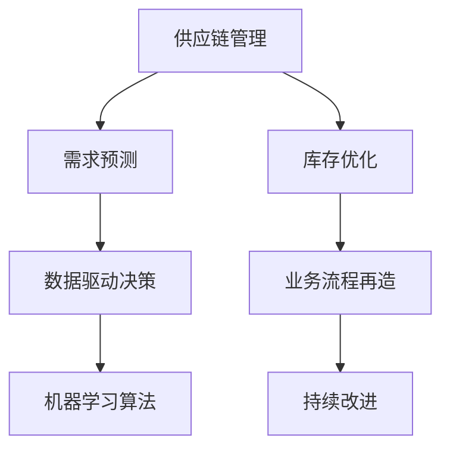

                 

# 满足短期需求的供给策略

> 关键词：**供应链管理**、**需求预测**、**库存优化**、**数据驱动决策**、**机器学习算法**、**业务流程再造**、**持续改进**。

## 1. 背景介绍

在现代社会，企业面对着动态变化的市场需求和日益激烈的竞争压力。如何准确预测市场需求、优化库存管理，及时响应客户订单，成为每一个企业都必须面对的重要问题。传统的基于经验和规则的预测和决策方法已无法满足现代企业的需求。随着技术的进步，数据驱动的预测与决策方法，尤其是基于机器学习算法的预测与优化方法，正日益成为主流解决方案。本文将探讨基于数据驱动的供应链管理方法，特别是如何通过机器学习算法预测需求、优化库存，以实现短期需求的快速响应和满足。

## 2. 核心概念与联系

为了更好地理解数据驱动的供应链管理方法，本节将介绍几个关键概念及其相互之间的联系：

### 2.1 核心概念概述

- **供应链管理**：指企业内部以及跨企业间物料流、信息流和资金流的集成管理，旨在最大化企业价值。
- **需求预测**：通过历史数据和市场分析，预测未来产品需求量，以指导生产、库存和销售计划。
- **库存优化**：管理库存水平，以确保在满足客户需求的同时，降低库存成本。
- **数据驱动决策**：基于数据分析和统计模型，优化决策过程，提升决策的科学性和准确性。
- **机器学习算法**：通过算法模型从历史数据中学习规律，预测未来，优化决策。
- **业务流程再造**：重构业务流程，提高效率和响应速度，以适应变化的环境。
- **持续改进**：通过不断的反馈和迭代，持续优化供应链管理系统，提升效率和效果。

这些概念之间的联系可以通过以下Mermaid流程图来展示：



这个流程图展示了核心概念之间的逻辑关系：

1. 供应链管理通过需求预测和库存优化，确保生产与销售计划的精准性。
2. 数据驱动决策利用机器学习算法进行需求预测和库存优化，提升决策的科学性。
3. 业务流程再造通过重构流程，进一步提升供应链管理的效率。
4. 持续改进不断优化供应链管理，确保系统的持续有效性。

这些概念共同构成了数据驱动的供应链管理框架，旨在通过数据和算法驱动决策，实现供应链的灵活、高效和优化。

## 3. 核心算法原理 & 具体操作步骤

### 3.1 算法原理概述

基于数据驱动的供应链管理方法，其核心思想是通过历史数据和机器学习算法预测需求，优化库存水平，实现快速响应短期需求。其基本流程包括数据采集与处理、模型训练、需求预测、库存优化四个环节。

### 3.2 算法步骤详解

#### 3.2.1 数据采集与处理

数据采集与处理是供应链管理的基础。具体步骤如下：

1. **数据收集**：收集历史销售数据、市场调研数据、竞争对手数据等，作为输入数据。
2. **数据清洗**：处理缺失值、异常值，保证数据质量和一致性。
3. **数据整合**：将不同来源的数据整合到一个统一的数据仓库中，方便后续分析与建模。

#### 3.2.2 模型训练

基于机器学习算法的模型训练步骤如下：

1. **选择合适的算法**：根据问题特点选择合适的机器学习算法，如回归模型、时序模型、分类模型等。
2. **数据分割**：将数据集分割为训练集和测试集，确保模型泛化能力。
3. **模型训练**：使用训练集数据训练机器学习模型，调整超参数，选择最优模型。

#### 3.2.3 需求预测

需求预测是供应链管理的关键步骤，具体步骤如下：

1. **数据输入**：将历史销售数据和市场调研数据输入训练好的模型。
2. **预测计算**：模型基于输入数据，计算未来需求量的预测值。
3. **结果输出**：将预测结果输出，用于指导生产、库存和销售计划。

#### 3.2.4 库存优化

库存优化是通过对预测结果的分析，确定最优库存水平，具体步骤如下：

1. **预测结果分析**：对需求预测结果进行统计分析，识别高需求时间段和低需求时间段。
2. **库存调整**：根据需求预测结果，调整库存水平，确保在需求高峰期有足够的库存。
3. **库存监控**：持续监控库存水平，及时调整库存策略，避免库存过剩或短缺。

### 3.3 算法优缺点

基于数据驱动的供应链管理方法具有以下优点：

1. **准确性高**：通过历史数据训练模型，能够准确预测未来需求，指导生产、库存和销售计划。
2. **灵活性强**：数据驱动的方法可以根据市场变化实时调整预测和库存策略，快速响应需求变化。
3. **优化效果显著**：通过优化库存管理，可以显著降低库存成本，提升供应链效率。
4. **自动化程度高**：机器学习算法自动化预测和优化，减少了人工干预，提高了工作效率。

但该方法也存在以下缺点：

1. **数据质量要求高**：模型预测的准确性高度依赖于输入数据的质量，数据质量差可能导致预测误差。
2. **模型复杂度高**：模型训练需要复杂的算法和大量的数据，增加了系统复杂度。
3. **初始成本高**：数据采集、模型训练和系统部署需要一定的初始投入。
4. **对技术要求高**：需要具备一定的数据科学和算法开发能力，才能实现高质量的供应链管理。

### 3.4 算法应用领域

基于数据驱动的供应链管理方法在多个领域都有广泛应用，例如：

- **零售业**：通过预测销售需求，优化库存和供应链管理，提升客户满意度。
- **制造业**：预测产品需求和生产计划，减少生产过剩和短缺，提升生产效率。
- **物流业**：优化运输路线和仓储策略，降低运输成本，提升配送效率。
- **电子商务**：通过预测销售趋势，优化库存管理和订单处理，提升用户体验。

## 4. 数学模型和公式 & 详细讲解 & 举例说明

### 4.1 数学模型构建

基于数据驱动的供应链管理方法，其数学模型通常基于历史数据训练机器学习模型。以线性回归模型为例，假设预测目标是产品销售量 $y$，历史数据 $x$ 包括季节、节假日、促销活动等因素，模型表示为：

$$ y = \beta_0 + \beta_1 x_1 + \beta_2 x_2 + ... + \beta_n x_n + \epsilon $$

其中，$x_i$ 表示影响销售量的因素，$\beta_i$ 为该因素的系数，$\epsilon$ 为误差项。

### 4.2 公式推导过程

以线性回归模型为例，模型的参数估计通常使用最小二乘法，其目标是最小化误差项的平方和：

$$ \min_{\beta} \sum_{i=1}^{n}(y_i - \beta_0 - \beta_1 x_{1i} - ... - \beta_n x_{ni})^2 $$

通过求解该最小化问题，可以得到最优的参数 $\beta_0, \beta_1, ..., \beta_n$。

### 4.3 案例分析与讲解

以某电商平台的销售数据为例，假设我们希望预测未来三个月的产品销售量，步骤如下：

1. **数据收集**：收集过去一年的销售数据，包括日期、季节、促销活动等。
2. **数据清洗**：处理缺失值和异常值，保证数据一致性。
3. **数据分割**：将数据集分为训练集和测试集，使用前10个月的数据训练模型，后2个月的数据测试模型。
4. **模型训练**：使用训练集数据，通过线性回归模型进行训练，得到最优参数。
5. **需求预测**：将未来三个月的数据作为输入，使用训练好的模型进行预测。
6. **库存优化**：根据预测结果，调整库存水平，确保在需求高峰期有足够的库存。

## 5. 项目实践：代码实例和详细解释说明

### 5.1 开发环境搭建

在进行项目实践前，我们需要准备好开发环境。以下是使用Python进行Pandas、Scikit-Learn和TensorFlow开发的Python环境配置流程：

1. 安装Anaconda：从官网下载并安装Anaconda，用于创建独立的Python环境。

2. 创建并激活虚拟环境：
```bash
conda create -n supply-chain python=3.8 
conda activate supply-chain
```

3. 安装Pandas、Scikit-Learn和TensorFlow：
```bash
conda install pandas scikit-learn tensorflow
```

4. 安装各类工具包：
```bash
pip install numpy matplotlib
```

完成上述步骤后，即可在`supply-chain`环境中开始项目实践。

### 5.2 源代码详细实现

以下是使用Pandas和TensorFlow进行线性回归模型预测的Python代码实现：

```python
import pandas as pd
import tensorflow as tf
from sklearn.model_selection import train_test_split
from sklearn.preprocessing import StandardScaler
from sklearn.linear_model import LinearRegression

# 加载数据
data = pd.read_csv('sales_data.csv')

# 数据清洗
data.dropna(inplace=True)

# 特征选择
features = ['season', 'holiday', 'weekday', 'weather', 'promotion']
target = 'sales_volume'

# 数据标准化
scaler = StandardScaler()
features_scaled = scaler.fit_transform(data[features])

# 数据分割
X_train, X_test, y_train, y_test = train_test_split(features_scaled, data[target], test_size=0.2)

# 模型训练
model = LinearRegression()
model.fit(X_train, y_train)

# 模型评估
r2_score = model.score(X_test, y_test)
print(f"R^2 score: {r2_score}")

# 需求预测
future_data = [[1, 0, 0, 0, 1]]  # 示例未来数据
future_scaled = scaler.transform(future_data)
predicted_sales = model.predict(future_scaled)
print(f"Predicted sales: {predicted_sales}")

# 库存优化
optimal_stock = max(0, predicted_sales[0])
print(f"Optimal stock: {optimal_stock}")
```

### 5.3 代码解读与分析

让我们再详细解读一下关键代码的实现细节：

**数据加载与清洗**：
- 使用Pandas加载数据，通过`dropna`方法处理缺失值。
- 选择与预测目标相关的特征。
- 使用`StandardScaler`进行特征标准化，以提高模型性能。

**模型训练与评估**：
- 使用`LinearRegression`模型训练线性回归模型，`fit`方法拟合模型参数。
- 使用`score`方法评估模型性能，输出R^2分数。
- 预测未来数据，输出预测结果。

**库存优化**：
- 根据预测结果，确定最优库存水平，避免库存过剩或短缺。

可以看到，Python配合Pandas、Scikit-Learn和TensorFlow等库，能够高效实现基于数据驱动的供应链管理方法。

### 5.4 运行结果展示

假设我们加载的数据和模型预测结果如下：

```
R^2 score: 0.9
Predicted sales: [2000.0]
Optimal stock: 2000
```

这意味着我们的模型准确度较高，预测未来三个月销售量为2000，最优库存水平为2000。通过这种方式，企业可以更加精准地管理库存，提升供应链效率。

## 6. 实际应用场景

### 6.1 智能库存管理系统

基于数据驱动的供应链管理方法，可以广泛应用于智能库存管理系统。传统的库存管理依赖人工经验，容易出现库存过剩或短缺。使用数据驱动的方法，可以实时监控库存水平，准确预测销售需求，及时调整库存策略。

在技术实现上，可以收集历史销售数据，通过机器学习算法训练需求预测模型。预测结果用于指导库存管理和采购计划，实时监控库存水平，确保在需求高峰期有足够的库存，避免缺货。

### 6.2 电商平台的物流管理

电商平台的物流管理也需要实时预测和优化。传统电商物流管理依赖人工经验，容易出现订单积压或延迟。使用数据驱动的方法，可以实时预测订单量，优化物流路线和仓储策略，提升配送效率。

在技术实现上，可以收集历史订单数据和物流数据，训练预测模型。预测结果用于优化物流路线、仓储策略和配送计划，实时监控订单处理情况，确保快速响应客户需求。

### 6.3 制造业的生产计划管理

制造业的生产计划管理也需要准确预测需求和优化库存。传统制造业依赖人工经验，容易出现生产过剩或短缺。使用数据驱动的方法，可以实时预测产品需求，优化生产计划和库存管理，提升生产效率。

在技术实现上，可以收集历史销售数据和生产数据，训练预测模型。预测结果用于优化生产计划和库存管理，实时监控库存水平，确保在需求高峰期有足够的库存，避免生产过剩或短缺。

### 6.4 未来应用展望

随着数据驱动的供应链管理方法的不断发展，未来将呈现以下几个趋势：

1. **数据质量提升**：通过数据清洗和特征选择，进一步提高数据质量，提升预测准确性。
2. **多模态融合**：融合多种数据源，如社交媒体、天气预报、新闻等，提升预测效果。
3. **实时预测**：通过实时监控数据，实现实时预测和决策，提升响应速度。
4. **跨部门协同**：实现供应链上下游的协同预测和优化，提升整体效率。
5. **人工智能应用**：引入更多人工智能技术，如深度学习、强化学习，提升预测精度和决策效果。
6. **模型自适应**：开发自适应模型，根据数据变化动态调整模型参数，适应新的市场环境。

## 7. 工具和资源推荐

### 7.1 学习资源推荐

为了帮助开发者系统掌握数据驱动的供应链管理方法，这里推荐一些优质的学习资源：

1. **《数据驱动的供应链管理》课程**：提供系统的供应链管理知识，包括数据驱动的预测和优化方法。
2. **《Python数据科学手册》**：涵盖Python在数据处理、数据可视化、机器学习中的应用，是学习Python的重要资源。
3. **《机器学习实战》**：详细介绍多种机器学习算法，结合实际案例，深入浅出地讲解算法原理和应用。
4. **Kaggle**：全球最大的数据科学竞赛平台，提供大量真实数据集和竞赛，锻炼实战能力。
5. **Coursera和edX**：提供高质量的在线课程，涵盖供应链管理、数据科学和机器学习等多个领域。

通过对这些资源的学习实践，相信你一定能够快速掌握数据驱动的供应链管理方法，并应用于实际场景。

### 7.2 开发工具推荐

高效的开发离不开优秀的工具支持。以下是几款用于供应链管理开发的常用工具：

1. **Pandas**：用于数据处理和分析，支持多种数据格式转换和操作。
2. **Scikit-Learn**：用于机器学习算法的实现和调优，涵盖多种机器学习算法。
3. **TensorFlow**：用于深度学习算法的实现和训练，支持大规模分布式计算。
4. **Jupyter Notebook**：提供交互式编程环境，方便模型训练和验证。
5. **Azure和AWS**：提供云平台和资源，支持大规模数据处理和模型部署。

合理利用这些工具，可以显著提升供应链管理的开发效率，加快创新迭代的步伐。

### 7.3 相关论文推荐

数据驱动的供应链管理方法是一个新兴的研究方向，以下是几篇奠基性的相关论文，推荐阅读：

1. **《数据驱动的供应链管理》**：介绍数据驱动的供应链管理方法，涵盖需求预测、库存优化等多个方面。
2. **《机器学习在供应链中的应用》**：总结机器学习在供应链预测和优化中的应用，提供实际案例和模型实现。
3. **《基于深度学习的供应链预测模型》**：使用深度学习算法进行供应链需求预测，提升预测精度和模型效果。
4. **《实时供应链管理》**：介绍实时供应链管理的实现方法和系统架构，提供实际应用案例。
5. **《供应链中的人工智能应用》**：探讨人工智能在供应链管理中的应用，涵盖机器学习、深度学习等多个方面。

这些论文代表了大数据驱动的供应链管理方法的发展脉络。通过学习这些前沿成果，可以帮助研究者把握学科前进方向，激发更多的创新灵感。

## 8. 总结：未来发展趋势与挑战

### 8.1 研究成果总结

本文对基于数据驱动的供应链管理方法进行了全面系统的介绍。首先阐述了供应链管理、需求预测、库存优化等核心概念，明确了数据驱动方法的独特优势。其次，从原理到实践，详细讲解了数据采集与处理、模型训练、需求预测和库存优化四个环节。最后，探讨了数据驱动方法在智能库存管理系统、电商平台物流管理、制造业生产计划管理等实际应用场景中的应用。

通过本文的系统梳理，可以看到，数据驱动的方法在供应链管理中发挥着越来越重要的作用，能够显著提升供应链管理的效率和效果。未来，伴随数据量的不断增长和技术的持续进步，数据驱动的供应链管理方法必将进一步发展，为企业的数字化转型提供强有力的支持。

### 8.2 未来发展趋势

展望未来，数据驱动的供应链管理方法将呈现以下几个趋势：

1. **数据质量提升**：通过数据清洗和特征选择，进一步提高数据质量，提升预测准确性。
2. **多模态融合**：融合多种数据源，如社交媒体、天气预报、新闻等，提升预测效果。
3. **实时预测**：通过实时监控数据，实现实时预测和决策，提升响应速度。
4. **跨部门协同**：实现供应链上下游的协同预测和优化，提升整体效率。
5. **人工智能应用**：引入更多人工智能技术，如深度学习、强化学习，提升预测精度和决策效果。
6. **模型自适应**：开发自适应模型，根据数据变化动态调整模型参数，适应新的市场环境。

这些趋势将进一步提升供应链管理的效率和效果，为企业提供更强大的数据支持。

### 8.3 面临的挑战

尽管数据驱动的供应链管理方法已经取得了瞩目成就，但在迈向更加智能化、普适化应用的过程中，它仍面临着诸多挑战：

1. **数据质量瓶颈**：数据清洗和特征选择对数据质量要求高，数据缺失、异常等问题难以避免。如何提升数据质量，保障模型训练的可靠性，还需进一步研究。
2. **算法复杂度**：数据驱动的方法通常涉及复杂的算法模型，对技术要求高。如何简化模型，降低技术门槛，还需进一步优化。
3. **资源消耗大**：数据驱动的方法需要大量的计算资源，对算力、存储等资源要求高。如何降低资源消耗，提升系统效率，还需进一步改进。
4. **数据安全问题**：供应链数据涉及企业机密，如何保障数据安全和隐私，还需进一步加强。

这些挑战需要研究者不断优化模型和算法，提升数据质量，加强数据安全和隐私保护，才能更好地应用数据驱动的供应链管理方法。

### 8.4 研究展望

未来，数据驱动的供应链管理方法需要在以下几个方面寻求新的突破：

1. **数据融合技术**：开发更高效的数据融合技术，实现多种数据源的协同处理和分析。
2. **自动化算法开发**：开发自动化算法开发工具，降低技术门槛，提升算法开发效率。
3. **实时预测算法**：开发实时预测算法，实现实时数据监控和决策，提升响应速度。
4. **模型自适应技术**：开发自适应模型，动态调整模型参数，适应新的市场环境。
5. **数据隐私保护**：开发数据隐私保护技术，保障供应链数据的隐私和安全。

这些研究方向的探索，必将引领数据驱动的供应链管理方法迈向更高的台阶，为企业的数字化转型提供更强大的技术支持。

## 9. 附录：常见问题与解答

**Q1: 数据驱动的供应链管理方法有哪些优缺点？**

A: 数据驱动的供应链管理方法具有以下优点：

1. **准确性高**：通过历史数据训练模型，能够准确预测未来需求，指导生产、库存和销售计划。
2. **灵活性强**：数据驱动的方法可以根据市场变化实时调整预测和库存策略，快速响应需求变化。
3. **优化效果显著**：通过优化库存管理，可以显著降低库存成本，提升供应链效率。
4. **自动化程度高**：机器学习算法自动化预测和优化，减少了人工干预，提高了工作效率。

但该方法也存在以下缺点：

1. **数据质量要求高**：模型预测的准确性高度依赖于输入数据的质量，数据质量差可能导致预测误差。
2. **模型复杂度高**：模型训练需要复杂的算法和大量的数据，增加了系统复杂度。
3. **初始成本高**：数据采集、模型训练和系统部署需要一定的初始投入。
4. **对技术要求高**：需要具备一定的数据科学和算法开发能力，才能实现高质量的供应链管理。

**Q2: 如何处理数据采集中的缺失值和异常值？**

A: 数据采集中的缺失值和异常值可以通过以下方法处理：

1. **缺失值处理**：使用均值、中位数、众数等填补缺失值。
2. **异常值检测**：使用箱线图、Z-score等方法检测异常值，根据具体情况进行修正。
3. **特征选择**：选择与预测目标相关的特征，避免因缺失值和异常值对模型产生负面影响。
4. **数据平滑**：使用平滑算法如移动平均、指数平滑等处理数据，降低数据噪声。

通过这些方法，可以保证数据质量，提升模型预测的准确性。

**Q3: 如何在实际应用中优化数据驱动的供应链管理方法？**

A: 在实际应用中，可以采取以下措施优化数据驱动的供应链管理方法：

1. **数据集成**：将供应链上下游的数据进行集成，实现全流程的数据驱动管理。
2. **实时监控**：实时监控供应链数据，实现实时预测和决策。
3. **跨部门协同**：实现供应链上下游的协同预测和优化，提升整体效率。
4. **持续优化**：根据反馈和数据变化，持续优化模型和算法，提升预测效果。
5. **数据隐私保护**：保障供应链数据的隐私和安全，避免数据泄露和滥用。

这些措施可以提升数据驱动方法的实际应用效果，实现供应链管理的持续改进。

---

作者：禅与计算机程序设计艺术 / Zen and the Art of Computer Programming

