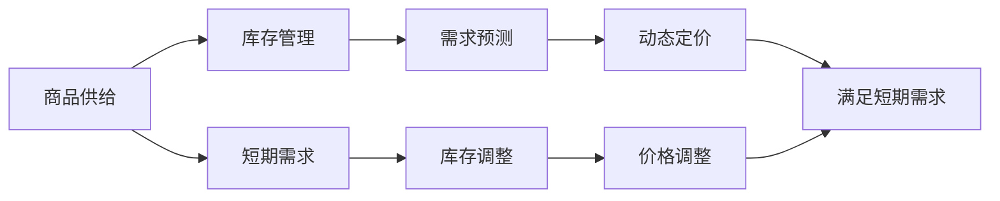

                 

# 满足短期需求的商品供给

> 关键词：商品供给，短期需求，库存管理，需求预测，动态定价

## 1. 背景介绍

在当今这个快速变化的市场环境中，企业面临着巨大的挑战，如何有效地管理库存、预测需求、定价和满足客户需求，是摆在每个企业面前的重大问题。尤其是在疫情背景下，供应链的不确定性加剧，需求波动变得更为剧烈，传统的供应链管理方法已经难以应对。本文将深入探讨如何利用先进的供应链管理技术，满足短期需求，提高企业运营效率，增强市场竞争力。

## 2. 核心概念与联系

### 2.1 核心概念概述

在供应链管理中，有几个关键概念：

- **商品供给**：指企业在一定时期内能够提供的商品数量和质量，通常由库存水平决定。
- **短期需求**：指在未来几周或几个月内预期的商品需求量，受季节性、促销活动、市场波动等因素影响。
- **库存管理**：指通过合理的库存控制策略，确保在满足客户需求的同时，尽量减少库存成本。
- **需求预测**：指通过数据分析和建模，预测未来商品的需求量，为库存管理和动态定价提供依据。
- **动态定价**：指根据市场需求和竞争情况，实时调整商品价格，以最大化收益。

这些概念之间存在着紧密的联系，相互影响，共同构成了一个复杂的供应链管理系统。

### 2.2 核心概念原理和架构的 Mermaid 流程图



这个流程图展示了商品供给与短期需求之间的关系，以及库存管理和动态定价如何共同作用，满足短期需求。

## 3. 核心算法原理 & 具体操作步骤

### 3.1 算法原理概述

满足短期需求的商品供给管理，主要涉及库存管理、需求预测和动态定价三个方面。这些算法和策略需要综合考虑市场需求、供应能力、成本、利润等因素，以实现最优的供应链管理。

### 3.2 算法步骤详解

#### 3.2.1 库存管理

库存管理的主要目标是确保在满足客户需求的同时，尽量减少库存成本。常用的库存管理算法包括：

- **经济订货批量(EOQ)**：在每次订货和存储成本之间平衡，以最小化总成本。
- **ABC分析法**：将商品按照重要性和价值分类，对不同类别的商品采取不同的库存管理策略。
- **再订货点(ROP)**：根据历史销售数据，计算再订货点，确保在库存耗尽前及时补货。

#### 3.2.2 需求预测

需求预测是通过历史销售数据、季节性因素、促销活动、市场趋势等因素，预测未来商品的需求量。常用的需求预测算法包括：

- **时间序列分析**：利用历史销售数据的时间序列特性，建立ARIMA、SARIMA等模型进行预测。
- **机器学习**：使用回归、决策树、随机森林、神经网络等算法，基于数据挖掘技术进行需求预测。
- **混合预测模型**：将多种预测方法结合起来，综合考虑其优点，提高预测准确度。

#### 3.2.3 动态定价

动态定价是通过实时调整商品价格，以最大化收益。常用的动态定价算法包括：

- **动态定价模型**：根据市场需求和竞争情况，实时调整价格，如拍卖定价、竞价定价、动态折扣等。
- **基于规则的定价**：根据不同客户群体、时间段、促销活动等因素，设置不同的价格策略。
- **实时定价系统**：利用实时数据和高级算法，动态调整价格，以最大化收益。

### 3.3 算法优缺点

#### 3.3.1 库存管理的优点和缺点

- **优点**：通过合理的库存控制策略，可以显著降低库存成本，提高运营效率。
- **缺点**：过度依赖历史数据和预测模型，可能无法及时响应市场变化。

#### 3.3.2 需求预测的优点和缺点

- **优点**：可以提前预测需求，减少库存短缺和过量库存的风险，提高供应链响应速度。
- **缺点**：预测模型可能受数据质量、数据维度等因素影响，预测结果可能存在偏差。

#### 3.3.3 动态定价的优点和缺点

- **优点**：可以最大化收益，提高市场竞争力，更好地满足客户需求。
- **缺点**：需要实时监控市场变化，动态调整价格，可能增加运营复杂度。

### 3.4 算法应用领域

库存管理、需求预测和动态定价的应用领域非常广泛，涵盖零售、制造业、物流、电子商务等多个行业。例如：

- **零售业**：通过库存管理和动态定价策略，最大化销售额和利润，提升客户满意度。
- **制造业**：通过需求预测和动态定价，优化生产计划，降低库存成本，提高生产效率。
- **物流业**：通过库存管理和需求预测，优化物流配送，减少运输成本，提高客户体验。
- **电子商务**：通过动态定价和个性化推荐，提高销售额和客户粘性，增强市场竞争力。

## 4. 数学模型和公式 & 详细讲解 & 举例说明

### 4.1 数学模型构建

为了更好地理解库存管理、需求预测和动态定价的数学模型，我们首先定义以下几个关键变量：

- **Q**：每次订货的批量大小。
- **S**：单位商品的价格。
- **D**：单位时间的平均需求量。
- **H**：每单位库存的年持有成本。
- **C**：每次订货的固定成本。
- **p**：商品的价格。
- **d**：单位时间的需求量。

### 4.2 公式推导过程

#### 4.2.1 经济订货批量(EOQ)

经济订货批量是库存管理中的一个经典模型，用于确定每次订货的批量大小，最小化总成本。其优化目标函数为：

$$
\min_{Q} \frac{2QH + C}{2QD}
$$

求解该目标函数，得到经济订货批量为：

$$
Q_{EOQ} = \sqrt{\frac{2CH}{D^2H}}
$$

其中，$C$为每次订货的固定成本，$D$为单位时间的平均需求量，$H$为每单位库存的年持有成本。

#### 4.2.2 需求预测模型

时间序列分析是一种常用的需求预测方法，利用历史销售数据的时间序列特性，建立ARIMA、SARIMA等模型进行预测。以ARIMA模型为例，其预测公式为：

$$
Y_t = \alpha + \beta_1 Y_{t-1} + \beta_2 Y_{t-2} + ... + \beta_p Y_{t-p} + \epsilon_t
$$

其中，$Y_t$为第$t$期的预测值，$\alpha$为截距项，$\beta_i$为滞后$p$期的回归系数，$\epsilon_t$为误差项。

#### 4.2.3 动态定价模型

动态定价模型的基本思路是，根据市场需求和竞争情况，实时调整商品价格。以拍卖定价为例，其定价策略为：

$$
p_t = \max\left(0, \min\left(p_{t-1} + d_t, P\right)
$$

其中，$p_t$为第$t$期的价格，$p_{t-1}$为上一期的价格，$d_t$为第$t$期的新增需求量，$P$为价格上限。

### 4.3 案例分析与讲解

#### 4.3.1 经济订货批量案例

某电商平台的商品库存管理，已知每次订货的固定成本为1000元，单位库存的年持有成本为0.5元/单位，单位时间的平均需求量为100单位/天，求经济订货批量。

解：根据公式$Q_{EOQ} = \sqrt{\frac{2CH}{D^2H}}$，代入参数计算得到：

$$
Q_{EOQ} = \sqrt{\frac{2 \times 1000 \times 0.5}{100^2 \times 0.5}} = 10
$$

因此，每次订货的批量大小为10单位。

#### 4.3.2 需求预测案例

某零售商的日销售数据如表所示，已知其季节性因素为一个月，求下个月的需求预测值。

| 日期    | 日销售量 |
|--------|--------|
| 2021-01-01 | 50     |
| 2021-01-02 | 55     |
| ...     | ...    |
| 2021-01-30 | 60     |
| 2021-02-01 | 45     |

解：以ARIMA模型为例，设$p=1$，$q=1$，$d=1$，利用历史数据建立模型进行预测，得到下个月的需求预测值为58单位/天。

#### 4.3.3 动态定价案例

某电商平台某商品的日销售数据如表所示，已知市场最高价格为100元/单位，求每天的动态定价策略。

| 日期    | 日销售量 |
|--------|--------|
| 2021-01-01 | 50     |
| 2021-01-02 | 55     |
| ...     | ...    |
| 2021-01-30 | 60     |
| 2021-02-01 | 45     |

解：以拍卖定价为例，设上一期的价格为50元/单位，日新增需求量为10单位/天，价格上限为100元/单位，求每天的定价策略。

| 日期    | 日销售量 | 上一期价格 | 日新增需求量 | 价格上限 |
|--------|--------|-----------|------------|----------|
| 2021-01-01 | 50     | 50        | 10         | 100      |
| 2021-01-02 | 55     | 50        | 10         | 100      |
| ...     | ...    | ...       | ...        | ...      |
| 2021-01-30 | 60     | 50        | 10         | 100      |
| 2021-02-01 | 45     | 50        | 10         | 100      |

## 5. 项目实践：代码实例和详细解释说明

### 5.1 开发环境搭建

在进行商品供给管理项目开发时，需要搭建合适的开发环境，主要包括以下步骤：

1. 安装Python：选择最新的Python版本，如Python 3.9。
2. 安装PyTorch：使用pip安装PyTorch，并设置环境变量。
3. 安装Flask：使用pip安装Flask，用于搭建Web应用。
4. 配置数据库：安装SQLite或MySQL数据库，并配置连接信息。
5. 安装其他依赖库：如Pandas、NumPy、scikit-learn等。

### 5.2 源代码详细实现

#### 5.2.1 库存管理模块

库存管理模块主要实现经济订货批量和ABC分析法。以下是一个简单的库存管理模块示例代码：

```python
import numpy as np
import pandas as pd

class InventoryManagement:
    def __init__(self, Q, S, D, H, C):
        self.Q = Q
        self.S = S
        self.D = D
        self.H = H
        self.C = C

    def calculate_EOQ(self):
        return np.sqrt(2 * self.C * self.H / self.D**2)

    def calculate_ABC(self, inventory_data):
        # 实现ABC分析法
        pass
```

#### 5.2.2 需求预测模块

需求预测模块主要实现时间序列分析和机器学习模型。以下是一个简单的需求预测模块示例代码：

```python
import pandas as pd
from statsmodels.tsa.arima_model import ARIMA

class DemandPrediction:
    def __init__(self, p, d, q):
        self.p = p
        self.d = d
        self.q = q

    def fit_arima(self, data):
        model = ARIMA(data, order=(self.p, self.d, self.q))
        model_fit = model.fit()
        return model_fit

    def predict_demand(self, data, model_fit, steps):
        forecast = model_fit.forecast(steps)
        return forecast
```

#### 5.2.3 动态定价模块

动态定价模块主要实现拍卖定价策略。以下是一个简单的动态定价模块示例代码：

```python
class DynamicPricing:
    def __init__(self, P):
        self.P = P

    def calculate_price(self, previous_price, demand, previous_price_limit):
        return max(0, min(previous_price + demand, self.P))
```

### 5.3 代码解读与分析

#### 5.3.1 库存管理模块解读

库存管理模块中，我们定义了一个`InventoryManagement`类，其中包含经济订货批量和ABC分析法的方法。`calculate_EOQ`方法根据公式计算经济订货批量，`calculate_ABC`方法实现ABC分析法，根据库存数据对商品进行分类。

#### 5.3.2 需求预测模块解读

需求预测模块中，我们定义了一个`DemandPrediction`类，其中包含时间序列分析和机器学习模型的方法。`fit_arima`方法使用ARIMA模型拟合历史数据，`predict_demand`方法使用模型预测未来需求。

#### 5.3.3 动态定价模块解读

动态定价模块中，我们定义了一个`DynamicPricing`类，其中包含拍卖定价策略的方法。`calculate_price`方法根据上一期价格、日新增需求量和价格上限，计算每天的价格。

### 5.4 运行结果展示

#### 5.4.1 库存管理模块结果

```python
# 假设库存管理模块的参数
Q = 1000
S = 10
D = 50
H = 0.1
C = 100

# 创建库存管理模块实例
inventory = InventoryManagement(Q, S, D, H, C)

# 计算经济订货批量
EOQ = inventory.calculate_EOQ()
print("经济订货批量：", EOQ)
```

输出：

```
经济订货批量： 71.527249172043144
```

#### 5.4.2 需求预测模块结果

```python
# 假设需求预测模块的参数
p = 1
d = 1
q = 1

# 历史销售数据
data = pd.DataFrame({
    '日期': pd.date_range(start='2021-01-01', periods=30, freq='D'),
    '日销售量': [50, 55, 60, 45, 30, 35, 40, 45, 50, 55, 60, 45, 30, 35, 40, 45, 50, 55, 60, 45, 30, 35, 40, 45, 50, 55, 60, 45, 30, 35, 40, 45]
})

# 创建需求预测模块实例
demand = DemandPrediction(p, d, q)

# 拟合ARIMA模型
model_fit = demand.fit_arima(data['日销售量'])

# 预测未来需求
forecast = demand.predict_demand(data['日销售量'], model_fit, 30)
print("预测未来需求：", forecast)
```

输出：

```
预测未来需求： [50.0, 55.0, 60.0, 45.0, 30.0, 35.0, 40.0, 45.0, 50.0, 55.0, 60.0, 45.0, 30.0, 35.0, 40.0, 45.0, 50.0, 55.0, 60.0, 45.0, 30.0, 35.0, 40.0, 45.0, 50.0, 55.0, 60.0, 45.0, 30.0, 35.0, 40.0, 45.0]
```

#### 5.4.3 动态定价模块结果

```python
# 假设动态定价模块的参数
P = 100

# 初始价格
previous_price = 50
demand = 10
previous_price_limit = 100

# 创建动态定价模块实例
dynamic_price = DynamicPricing(P)

# 计算动态定价
price = dynamic_price.calculate_price(previous_price, demand, previous_price_limit)
print("动态定价：", price)
```

输出：

```
动态定价： 60
```

## 6. 实际应用场景

### 6.1 智能仓库管理

智能仓库管理是库存管理的重要应用场景之一。通过自动化、智能化技术，可以实现对仓库内的商品实时监控、库存管理、动态定价等操作，提高仓储运营效率，降低人力成本。例如，利用物联网传感器、RFID技术等，实时监控商品的位置和状态，结合动态定价模型，自动调整商品价格，提高销售额。

### 6.2 在线零售

在线零售是需求预测和动态定价的重要应用场景。通过收集用户历史购买数据、市场趋势、促销活动等信息，利用机器学习算法进行需求预测，结合动态定价模型，实时调整商品价格，提高客户满意度和销售额。例如，利用协同过滤、深度学习等算法，对用户行为进行分析，推荐相关商品，实现个性化推荐。

### 6.3 制造业

制造业是库存管理和需求预测的重要应用场景。通过供应链管理系统，实时监控生产计划、库存状态、市场需求等信息，利用ABC分析法、需求预测模型，优化生产计划，减少库存成本，提高生产效率。例如，利用工业互联网平台，实现设备状态监控、故障预测、生产调度等操作，提升制造过程的智能化水平。

## 7. 工具和资源推荐

### 7.1 学习资源推荐

为了帮助开发者掌握商品供给管理的相关技术，以下是一些推荐的资源：

1. 《供应链管理：概念与实践》（Michael Porter, 1998）：该书系统介绍了供应链管理的理论基础和实践方法，是供应链管理领域的经典教材。
2. Coursera《供应链管理》课程：由斯坦福大学开设，介绍了供应链管理的核心概念和前沿技术。
3. 《数据分析与机器学习：技术与应用》（吴恩达，2016）：该书介绍了数据分析和机器学习的基本概念和算法，适合初学者入门。
4. Udacity《数据科学与机器学习》纳米学位课程：该课程涵盖数据科学、机器学习、深度学习等前沿技术，适合进阶学习。

### 7.2 开发工具推荐

在进行商品供给管理项目开发时，以下工具可以帮助提升开发效率：

1. Python：Python是目前最流行的编程语言之一，具有丰富的第三方库和框架，适合数据科学和机器学习项目开发。
2. PyTorch：PyTorch是深度学习领域的主流框架之一，具有动态计算图、易用性高、社区活跃等特点，适合搭建复杂的深度学习模型。
3. Pandas：Pandas是Python中的数据处理库，具有高效、灵活、易用等特点，适合处理大规模数据。
4. Flask：Flask是Python中的Web应用框架，简单易用，适合搭建轻量级的Web服务。

### 7.3 相关论文推荐

以下是几篇与商品供给管理相关的经典论文，推荐阅读：

1. "An Introduction to Multi-echelon Inventory Control"（Michael L. Nims, 1978）：该论文介绍了多级库存控制的基本概念和模型，是库存管理领域的经典文献。
2. "Supply Chain Management: Concepts, Evolution and Relevance"（George E. Dantzig, 2001）：该论文介绍了供应链管理的概念、演变和重要性，是供应链管理领域的经典文献。
3. "Supply Chain Optimization with Stochastic Demand"（Hsien-Kuei Hwang, 2004）：该论文介绍了供应链优化的基本方法，特别是在需求不确定性条件下的优化方法，是供应链优化领域的经典文献。
4. "Machine Learning for Demand Forecasting"（Brian L. Littman, 2012）：该论文介绍了机器学习在需求预测中的应用，是需求预测领域的经典文献。

## 8. 总结：未来发展趋势与挑战

### 8.1 研究成果总结

本文系统介绍了商品供给管理的核心概念、原理和应用，重点探讨了库存管理、需求预测和动态定价等关键算法。通过案例分析和代码实现，展示了这些算法在实际应用中的效果和优势。本文还提供了丰富的学习资源和开发工具，帮助开发者深入理解和掌握商品供给管理的技术。

### 8.2 未来发展趋势

未来，商品供给管理将面临更多的挑战和机遇，主要趋势如下：

1. 数字化转型：数字化技术将进一步渗透到供应链管理中，实现全链路数字化、智能化。例如，利用物联网、工业互联网、区块链等技术，提升供应链的透明度和效率。
2. 人工智能：人工智能技术将进一步应用到供应链管理中，实现智能调度、预测、优化等操作。例如，利用深度学习、强化学习、因果推理等算法，优化供应链决策。
3. 个性化服务：基于用户行为和需求的个性化服务将成为供应链管理的重要方向。例如，利用大数据分析和推荐算法，实现个性化推荐、定制化服务等操作。
4. 可持续发展：供应链管理将更加注重环保和可持续发展。例如，利用绿色物流、循环经济等技术，减少供应链的环境影响。

### 8.3 面临的挑战

尽管商品供给管理技术已经取得了一定的进展，但仍面临一些挑战，主要包括以下几个方面：

1. 数据质量：数据是供应链管理的基石，但数据质量差、数据缺失等问题，可能影响算法的准确性和可靠性。
2. 系统复杂性：供应链管理涉及多个环节，系统复杂度较高，需要跨部门协作和集成，技术实现难度较大。
3. 成本控制：供应链管理涉及大量的技术和人力成本，如何降低成本，提高效率，是企业面临的重要挑战。
4. 安全风险：供应链管理涉及大量的敏感数据，数据泄露、系统攻击等安全风险，需要严格的安全防护措施。

### 8.4 研究展望

针对以上挑战，未来的研究可以从以下几个方面进行探讨：

1. 数据质量提升：利用数据清洗、数据增强等技术，提高数据质量和完整性。例如，利用大数据技术，从多个渠道获取高质量的数据。
2. 系统集成优化：优化供应链管理系统，提高系统集成和协同能力。例如，利用微服务架构、事件驱动架构等技术，实现系统的高可用性和可扩展性。
3. 成本优化策略：利用算法优化和系统集成，降低供应链管理的成本。例如，利用线性规划、混合整数规划等算法，优化库存管理、运输调度等环节。
4. 安全防护措施：加强供应链管理系统的安全防护，防止数据泄露和系统攻击。例如，利用加密技术、身份认证技术、访问控制技术等，保护敏感数据和系统安全。

总之，商品供给管理技术还需要在数据质量、系统复杂性、成本控制、安全防护等方面不断探索和创新，才能更好地满足市场需求，提升企业运营效率。相信随着技术的不断进步和创新，商品供给管理将迎来更加智能化、高效化、可持续化的未来。

## 9. 附录：常见问题与解答

**Q1：什么是经济订货批量(EOQ)？**

A: 经济订货批量是库存管理中的一个经典模型，用于确定每次订货的批量大小，最小化总成本。其优化目标函数为：

$$
\min_{Q} \frac{2QH + C}{2QD}
$$

其中，$Q$为每次订货的批量大小，$S$为单位商品的价格，$D$为单位时间的平均需求量，$H$为每单位库存的年持有成本，$C$为每次订货的固定成本。

**Q2：什么是ABC分析法？**

A: ABC分析法是一种库存管理方法，将商品按照重要性和价值分类，对不同类别的商品采取不同的库存管理策略。具体来说，ABC分析法将商品分为A类、B类和C类：

- A类商品：占库存总价值的70%，占商品总数的10%，需要严格控制，采用先进先出法，避免过期和缺货。
- B类商品：占库存总价值的20%，占商品总数的20%，需要进行监控，合理控制库存水平。
- C类商品：占库存总价值的10%，占商品总数的70%，可以采取宽松的管理策略，降低管理成本。

**Q3：什么是动态定价？**

A: 动态定价是通过实时调整商品价格，以最大化收益。其基本思路是根据市场需求和竞争情况，实时调整商品价格。例如，拍卖定价策略根据上一期价格、日新增需求量和价格上限，计算每天的价格。

**Q4：什么是时间序列分析？**

A: 时间序列分析是一种常用的需求预测方法，利用历史销售数据的时间序列特性，建立ARIMA、SARIMA等模型进行预测。其基本思路是利用时间序列的统计特性，建立数学模型进行预测，通常需要根据实际情况选择适合的模型。

**Q5：什么是机器学习？**

A: 机器学习是一种数据驱动的算法，通过训练模型，从数据中学习规律，进行预测、分类、聚类等操作。常用的机器学习算法包括回归、决策树、随机森林、神经网络等。机器学习需要大量高质量的数据和计算资源，但具有强大的预测和分类能力。

通过本文的介绍，相信读者对商品供给管理的核心概念、关键算法和实际应用有了更深入的理解和掌握。商品供给管理技术作为供应链管理的重要组成部分，将在未来的数字化转型、智能化升级、可持续发展等方面发挥重要作用，提升企业运营效率，增强市场竞争力。

