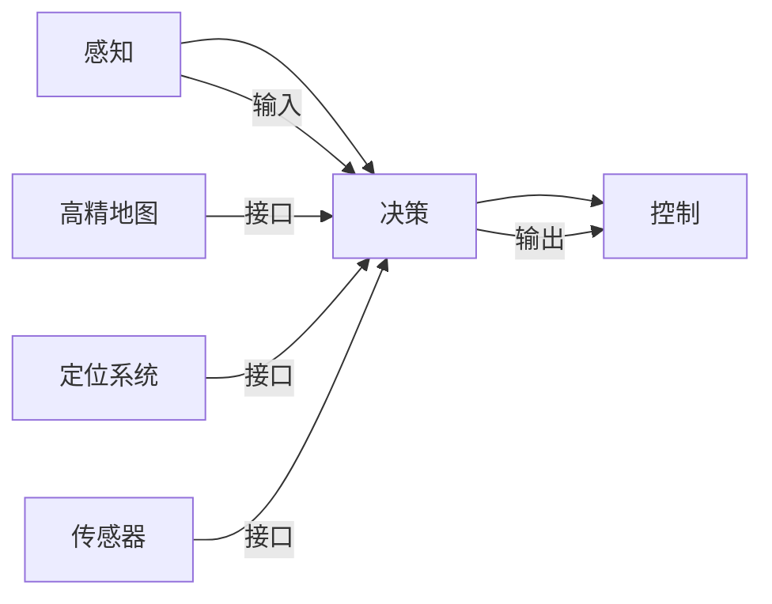

                 

# 特斯拉、华为、小鹏的端到端智驾系统

## 1. 背景介绍

随着自动驾驶技术的逐渐成熟，越来越多的汽车厂商开始将端到端智驾系统（End-to-End Driving System）作为其核心竞争力。特斯拉（Tesla）、华为、小鹏（Xpeng）等企业，在自动驾驶领域纷纷发力，各自推出了一整套端到端系统解决方案，力图抢占市场先机。本文将从自动驾驶的技术架构、算法原理、应用案例等角度，深入剖析特斯拉、华为、小鹏的端到端智驾系统，并探讨其未来发展趋势及面临的挑战。

## 2. 核心概念与联系

### 2.1 核心概念概述

自动驾驶系统是指利用传感器、摄像头、雷达等设备感知车辆周围环境，并通过高精度地图、定位系统、路径规划等技术，使车辆在无需人类干预的情况下，实现自主导航和驾驶。端到端智驾系统则是指从感知、决策到控制的完整自动驾驶流程，直接通过神经网络模型预测车辆行为，从而简化决策流程，提高系统效率和可靠性。

特斯拉、华为、小鹏的端到端智驾系统，均采用了先进的神经网络架构，结合高精地图、定位系统、感知算法等技术，构建了一个闭环的自动驾驶解决方案。这种架构大大简化了系统设计，缩短了迭代周期，提升了整体系统的稳定性与可靠性。

### 2.2 核心概念原理和架构的 Mermaid 流程图



这个流程图展示了特斯拉、华为、小鹏端到端智驾系统的核心架构。从感知层收集到的数据，经决策层处理后，直接传递给控制层，实现车辆的自主导航与驾驶。高精地图和定位系统为决策层提供实时定位信息，传感器则提供环境感知能力。

## 3. 核心算法原理 & 具体操作步骤

### 3.1 算法原理概述

特斯拉、华为、小鹏的端到端智驾系统主要采用了深度学习中的神经网络模型，包括卷积神经网络（CNN）、循环神经网络（RNN）、变换器（Transformer）等。这些模型通过大量标注数据进行训练，学习到车辆的感知、决策和控制逻辑。在端到端架构下，系统不再需要传统的SLAM（Simultaneous Localization and Mapping）和路径规划算法，直接通过神经网络模型预测车辆行为，实现从感知到控制的闭环控制。

### 3.2 算法步骤详解

以特斯拉的自动驾驶系统为例，其端到端智驾系统主要包含以下几个步骤：

1. **数据采集与预处理**：通过摄像头、雷达、激光雷达等传感器收集车辆周围环境数据，并进行数据清洗、归一化等预处理操作。

2. **感知与特征提取**：使用深度神经网络对采集到的数据进行特征提取，包括检测车辆、行人、道路边界、交通标志等。

3. **决策与路径规划**：将感知结果输入决策层，通过神经网络模型进行行为预测，并根据高精地图和定位系统信息进行路径规划。

4. **控制与执行**：根据路径规划结果，输出车辆转向、加减速等控制命令，并通过控制器执行这些命令。

### 3.3 算法优缺点

**优点：**

- 简化系统架构：端到端架构减少了传统自动驾驶系统中复杂的中间组件，提高了系统响应速度和可靠性。
- 数据驱动：深度学习模型能够充分利用大规模标注数据进行训练，提高模型的泛化能力和鲁棒性。
- 动态适应：神经网络模型能够实时学习新数据，适应不断变化的驾驶环境。

**缺点：**

- 数据依赖：端到端系统高度依赖于高精地图、传感器数据等，一旦这些数据出现问题，系统性能会大幅下降。
- 模型复杂度：深度神经网络模型通常较为复杂，训练和推理耗时较长，对计算资源要求较高。
- 黑盒问题：深度学习模型难以解释其内部工作机制，难以进行故障诊断和调试。

### 3.4 算法应用领域

特斯拉、华为、小鹏的端到端智驾系统，广泛应用于以下领域：

- 自动驾驶汽车：特斯拉、华为、小鹏等企业均将其端到端系统应用于其自动驾驶汽车中，提供L2、L3级别的自动驾驶体验。
- 智能交通管理：华为的智能交通管理系统，能够实现交通流监控、交通事故预警等功能。
- 自动驾驶辅助：小鹏汽车推出了智能驾驶辅助系统Xpilot，能够在高速公路、城市道路上提供自动驾驶辅助功能。

## 4. 数学模型和公式 & 详细讲解 & 举例说明

### 4.1 数学模型构建

特斯拉、华为、小鹏的端到端智驾系统主要采用了深度神经网络模型，其中以卷积神经网络（CNN）和变换器（Transformer）为主。这些模型能够从图像、雷达等高维数据中提取特征，并进行行为预测。

以CNN为例，其模型架构可以表示为：

$$
\text{CNN} = \text{Convolutional Layer} + \text{Pooling Layer} + \text{Fully Connected Layer}
$$

其中，卷积层用于提取空间特征，池化层用于降低特征维度，全连接层用于进行分类或回归。

### 4.2 公式推导过程

以特斯拉自动驾驶系统的目标检测任务为例，假设输入图像为 $I$，输出为车辆、行人等目标的边界框和类别标签。目标检测模型的输出可以表示为：

$$
\hat{y} = \text{CNN}(I) = \{(b_{i,j},c_i)\}_{i,j}
$$

其中，$b_{i,j}$ 表示边界框的坐标，$c_i$ 表示边界框对应的类别标签。目标检测模型的损失函数可以表示为交叉熵损失函数：

$$
L = -\sum_{i,j} y_{i,j}\log\hat{y}_{i,j} + (1-y_{i,j})\log(1-\hat{y}_{i,j})
$$

其中，$y_{i,j}$ 表示实际标签，$\hat{y}_{i,j}$ 表示预测标签。

### 4.3 案例分析与讲解

以特斯拉的自动驾驶系统为例，其目标检测模型使用YOLOv5架构，通过单阶段检测器对输入图像进行目标检测。YOLOv5模型通过将特征图划分为多个网格，每个网格预测多个边界框和类别标签，并通过非极大值抑制（NMS）算法进行后处理。这种单阶段检测器不仅提高了检测速度，还提升了检测精度。

## 5. 项目实践：代码实例和详细解释说明

### 5.1 开发环境搭建

开发特斯拉、华为、小鹏的端到端智驾系统，需要搭建以下开发环境：

1. **Python 环境**：安装Python 3.x版本，建议使用Anaconda环境。

2. **深度学习框架**：安装TensorFlow或PyTorch，建议使用GPU版本。

3. **传感器数据采集**：安装摄像头、雷达等传感器接口，并配置相关驱动程序。

4. **数据集准备**：准备大量高精地图、传感器数据等，用于模型训练和测试。

### 5.2 源代码详细实现

以特斯拉的自动驾驶系统为例，其目标检测模型的代码实现可以表示为：

```python
import torch
from torchvision.models.detection import YOLOv5

# 加载预训练模型
model = YOLOv5('yolov5s.pt')

# 定义损失函数
criterion = torch.nn.CrossEntropyLoss()

# 定义优化器
optimizer = torch.optim.Adam(model.parameters(), lr=1e-4)

# 训练模型
for epoch in range(100):
    for batch in train_loader:
        # 前向传播
        inputs, targets = batch
        outputs = model(inputs)
        
        # 计算损失
        loss = criterion(outputs, targets)
        
        # 反向传播
        optimizer.zero_grad()
        loss.backward()
        optimizer.step()
        
    # 评估模型
    with torch.no_grad():
        for batch in val_loader:
            inputs, targets = batch
            outputs = model(inputs)
            loss = criterion(outputs, targets)
            print('Validation Loss:', loss.item())
```

### 5.3 代码解读与分析

以上代码展示了特斯拉自动驾驶系统目标检测模型的训练过程。首先，加载预训练的YOLOv5模型，定义交叉熵损失函数和优化器，并在训练过程中不断迭代优化模型。在每个epoch结束时，使用验证集评估模型性能。

## 6. 实际应用场景

### 6.1 智能交通管理

特斯拉、华为、小鹏的端到端智驾系统在智能交通管理领域也有广泛应用。例如，华为的城市智能交通管理系统，通过高精度地图、传感器数据和神经网络模型，实现了交通流的实时监控和分析，为城市交通管理提供了强有力的支持。

### 6.2 自动驾驶汽车

特斯拉的自动驾驶系统是其端到端智驾系统的主要应用场景。通过传感器数据和神经网络模型，特斯拉的车辆能够在高速公路、城市道路上实现自动驾驶，提供了L2、L3级别的自动驾驶体验。

### 6.3 智能驾驶辅助

小鹏汽车推出的Xpilot系统，融合了特斯拉的端到端智驾技术和其独有的自动驾驶辅助算法，为车主提供了智能驾驶辅助功能，提升了驾驶体验和安全性。

### 6.4 未来应用展望

未来，特斯拉、华为、小鹏的端到端智驾系统将在以下方面取得更多突破：

1. **高精地图融合**：结合高精地图和传感器数据，提高系统的定位精度和环境感知能力。
2. **多模态数据融合**：融合视觉、雷达、激光雷达等多种传感器数据，提升系统的环境感知和决策能力。
3. **安全性和可靠性**：通过冗余设计和安全算法，提高系统的鲁棒性和安全性，避免灾难性故障。
4. **人机交互**：实现更自然的人机交互方式，提高驾驶体验和用户满意度。

## 7. 工具和资源推荐

### 7.1 学习资源推荐

- **Coursera**：提供深度学习、自动驾驶等领域的课程，适合初学者系统学习。
- **arXiv**：最新的深度学习论文库，涵盖端到端自动驾驶系统的最新研究进展。
- **GitHub**：特斯拉、华为、小鹏的自动驾驶项目开源代码，适合学习其架构和算法实现。

### 7.2 开发工具推荐

- **TensorFlow**：强大的深度学习框架，支持多种神经网络模型和训练优化算法。
- **PyTorch**：灵活的深度学习框架，适合快速迭代研究。
- **Visual Studio Code**：轻量级的IDE，支持深度学习开发和调试。

### 7.3 相关论文推荐

- **端到端自动驾驶系统综述**：多篇综述性论文，涵盖端到端自动驾驶系统的最新研究进展。
- **深度学习在自动驾驶中的应用**：多篇学术论文，涵盖深度学习模型在自动驾驶领域的具体应用。

## 8. 总结：未来发展趋势与挑战

### 8.1 研究成果总结

特斯拉、华为、小鹏的端到端智驾系统，通过深度学习技术，实现了自动驾驶的闭环控制和动态适应。这些系统在感知、决策、控制等方面取得了显著进展，提高了驾驶体验和安全性。未来，端到端智驾系统将在智能交通管理、自动驾驶汽车、智能驾驶辅助等领域发挥更大的作用。

### 8.2 未来发展趋势

未来，特斯拉、华为、小鹏的端到端智驾系统将在以下几个方面取得更多突破：

1. **高精地图融合**：结合高精地图和传感器数据，提高系统的定位精度和环境感知能力。
2. **多模态数据融合**：融合视觉、雷达、激光雷达等多种传感器数据，提升系统的环境感知和决策能力。
3. **安全性和可靠性**：通过冗余设计和安全算法，提高系统的鲁棒性和安全性，避免灾难性故障。
4. **人机交互**：实现更自然的人机交互方式，提高驾驶体验和用户满意度。

### 8.3 面临的挑战

特斯拉、华为、小鹏的端到端智驾系统在实际应用中也面临诸多挑战：

1. **数据依赖**：端到端系统高度依赖于高精地图、传感器数据等，一旦这些数据出现问题，系统性能会大幅下降。
2. **模型复杂度**：深度学习模型通常较为复杂，训练和推理耗时较长，对计算资源要求较高。
3. **黑盒问题**：深度学习模型难以解释其内部工作机制，难以进行故障诊断和调试。

### 8.4 研究展望

面对这些挑战，未来的研究需要在以下几个方面寻求新的突破：

1. **数据增强**：通过数据增强技术，提升模型的泛化能力和鲁棒性。
2. **模型优化**：开发更高效、更轻量的深度学习模型，提升训练和推理速度。
3. **可解释性**：开发可解释性强的深度学习模型，提高系统的透明性和可靠性。
4. **跨模态融合**：融合多种传感器数据，提升系统的环境感知和决策能力。

这些研究方向的探索，将引领特斯拉、华为、小鹏的端到端智驾系统迈向更高的台阶，为自动驾驶技术的发展注入新的动力。

## 9. 附录：常见问题与解答

**Q1: 如何评估特斯拉、华为、小鹏的端到端智驾系统性能？**

A: 特斯拉、华为、小鹏的端到端智驾系统性能评估通常通过以下几个指标：

1. **准确率（Accuracy）**：模型预测结果与实际标签的匹配程度。
2. **召回率（Recall）**：模型检测出的目标数量与实际目标数量的比率。
3. **F1分数（F1 Score）**：准确率和召回率的综合评估指标。
4. **平均响应时间（Average Response Time）**：系统对感知数据进行处理并输出结果的时间。

**Q2: 特斯拉、华为、小鹏的端到端智驾系统的主要技术难点是什么？**

A: 特斯拉、华为、小鹏的端到端智驾系统面临的主要技术难点包括：

1. **数据采集与标注**：高精地图和传感器数据的获取和标注需要大量时间和成本。
2. **模型训练与优化**：深度神经网络模型训练和优化需要高性能计算资源。
3. **系统集成与调试**：端到端系统集成涉及多个组件，调试和优化难度较大。

**Q3: 特斯拉、华为、小鹏的端到端智驾系统在实际应用中有哪些挑战？**

A: 特斯拉、华为、小鹏的端到端智驾系统在实际应用中面临的挑战包括：

1. **环境复杂性**：城市道路、高速公路等复杂环境对系统的感知和决策能力提出较高要求。
2. **数据多样性**：不同区域、不同天气条件下的传感器数据存在较大差异。
3. **安全性和可靠性**：系统需要具备高度的鲁棒性和容错能力，避免灾难性故障。

作者：禅与计算机程序设计艺术 / Zen and the Art of Computer Programming

