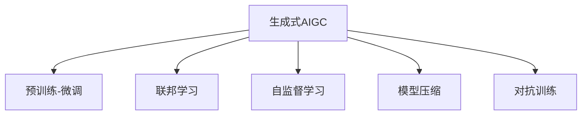

                 

## 1. 背景介绍

### 1.1 问题由来

人工智能生成内容（AIGC, Artificial Intelligence Generated Content）近年来备受关注，尤其是以OpenAI的ChatGPT为代表的大模型应用带来了全新的媒体生态和社交形态。AIGC技术在娱乐、教育、医疗、法律等领域得到了广泛应用。然而，对于生成式AIGC技术，业界对其价值和未来发展存在不同看法。一部分人认为，AIGC技术将改变游戏规则，是互联网科技的“黄金矿藏”，另一部分人则担心其潜在的风险和泡沫化。

### 1.2 问题核心关键点

AIGC技术的核心争议在于其商业价值和实际应用效果。AIGC技术的优势在于其强大的生成能力和多模态融合能力，但同时也存在质量不稳定、安全性不足、伦理道德等风险。本文将围绕AIGC技术的实际应用场景和数据要素，探讨AIGC技术的商业价值和面临的挑战，为行业开发者提供参考。

## 2. 核心概念与联系

### 2.1 核心概念概述

为更好地理解生成式AIGC技术，本节将介绍几个密切相关的核心概念：

- **生成式AIGC**：通过深度学习等技术，基于大量数据生成文本、图像、视频、音频等内容的技术。AIGC技术包括基于文本生成的对话系统、生成式文本摘要、生成式图像、生成式视频等。
- **预训练-微调**：使用大量无标签数据预训练大语言模型，然后通过有标签数据微调优化，使其适合特定任务的技术。预训练-微调是AIGC技术的重要基础。
- **联邦学习**：多用户数据分散在各节点上，通过计算分布式数据，协同优化模型参数，提高模型泛化能力的技术。联邦学习为AIGC技术在实际应用中的数据隐私保护提供了重要保障。
- **自监督学习**：使用未标注的数据，通过自动设计的预训练任务进行无监督学习，训练模型获取常识和语义知识的技术。自监督学习是AIGC技术重要的知识获取手段。
- **模型压缩**：通过剪枝、量化、蒸馏等技术，减小模型的存储和计算需求，提高模型推理速度和效率的技术。模型压缩对AIGC技术的部署应用具有重要意义。
- **对抗训练**：使用对抗样本对模型进行训练，提高模型鲁棒性和安全性，避免生成内容的安全隐患。对抗训练是AIGC技术在安全性方面需重点关注的方面。

这些核心概念之间的逻辑关系可以通过以下Mermaid流程图来展示：



这个流程图展示了大语言模型在实际应用中的关键技术要素：

1. 生成式AIGC技术的生成能力和多模态融合能力。
2. 预训练-微调技术为AIGC模型提供强大的通用能力。
3. 联邦学习用于保护用户数据隐私，提供数据安全的解决方案。
4. 自监督学习帮助AIGC模型获取广泛的知识和常识。
5. 模型压缩优化模型效率，降低资源消耗。
6. 对抗训练提高模型鲁棒性，保障内容安全性。

## 3. 核心算法原理 & 具体操作步骤
### 3.1 算法原理概述

生成式AIGC技术基于深度学习和大模型预训练-微调原理。其核心思想是：通过在大规模无标签数据上预训练，获得通用的语言表示能力，然后通过有标签数据微调，优化模型在特定任务上的生成性能。

具体而言，生成式AIGC技术的步骤如下：

1. 数据预处理：将大规模无标签文本数据进行去噪、清洗、分词等预处理，得到标准的输入数据。
2. 预训练：使用预训练语言模型如GPT-3、BERT等，在预训练数据集上进行自监督训练，学习通用的语言表示。
3. 微调：在特定任务的有标签数据集上进行微调，优化模型输出与任务标签的匹配度，提高任务性能。
4. 部署与优化：将微调后的模型部署到实际应用场景，根据需求进行参数调整和优化。

### 3.2 算法步骤详解

以基于文本生成的对话系统为例，介绍生成式AIGC技术的详细步骤：

**Step 1: 数据收集与预处理**

- 收集对话数据集，包括用户与机器人的对话历史、常见问题与答案、FAQ库等。
- 对对话数据进行清洗、去重、分词、向量化等预处理，得到标准的输入数据。

**Step 2: 模型选择与预训练**

- 选择适合的预训练模型，如GPT-3、GPT-4等，在预训练数据集上进行自监督训练，学习语言表示。
- 预训练任务包括语言建模、掩码语言建模、单词预测等，使模型具备强大的语言理解能力。

**Step 3: 任务适配与微调**

- 定义对话系统的对话策略，选择合适的任务适配层，如RNN、Transformer等。
- 在对话数据集上进行微调，优化模型输出与对话标签的匹配度，训练生成式对话模型。
- 微调过程中，使用对抗训练、正则化、dropout等技术，防止过拟合。

**Step 4: 部署与优化**

- 将微调后的对话模型部署到实际应用场景，如智能客服系统、虚拟助手等。
- 根据应用场景的需求，对模型进行参数调整和优化，如调整学习率、控制模型规模等。
- 使用A/B测试、用户反馈等方式，不断优化模型性能，提升用户体验。

### 3.3 算法优缺点

生成式AIGC技术具有以下优点：

1. 强大的生成能力：AIGC技术可以生成高质量的文本、图像、视频等多模态内容，广泛应用于教育、娱乐、医疗等领域。
2. 多模态融合：AIGC技术可以处理文本、图像、音频等多模态数据，提高内容的丰富性和吸引力。
3. 高效率：AIGC技术可以在短时间内生成大量内容，减少人力成本和生产周期。
4. 广泛应用：AIGC技术可以应用于多个行业，如媒体内容生成、虚拟现实、智能客服等。

同时，该技术也存在以下缺点：

1. 数据依赖性强：AIGC技术的性能很大程度上依赖于预训练数据的质量和多样性，需要大量的标注数据进行微调。
2. 质量不稳定：AIGC技术的生成内容质量受到预训练数据和微调数据的影响，不同批次和模型的输出质量可能存在差异。
3. 安全性风险：AIGC技术可能生成有害、误导性的内容，影响用户安全和社会稳定。
4. 道德伦理问题：AIGC技术可能带来隐私泄露、版权侵犯等伦理问题。
5. 技术复杂度：AIGC技术的实现涉及深度学习、自然语言处理、计算机视觉等多个领域，技术复杂度较高。

### 3.4 算法应用领域

生成式AIGC技术已经在多个领域得到了广泛应用，具体包括：

- 媒体内容生成：如新闻报道、电影剧本、广告文案等，通过AIGC技术可以生成高质量的文本内容，减少人力成本和生产周期。
- 教育：AIGC技术可以生成虚拟教师、智能辅导系统等，提升教学效果和学习效率。
- 娱乐：AIGC技术可以生成虚拟角色、虚拟演员等，增强用户互动体验。
- 医疗：AIGC技术可以生成医学知识库、虚拟医生等，辅助医疗诊断和治疗。
- 法律：AIGC技术可以生成法律文书、合同等，提升工作效率和准确度。
- 客服：AIGC技术可以生成智能客服机器人，提供24小时服务，提升客户满意度。
- 市场营销：AIGC技术可以生成个性化广告、营销方案等，提高市场推广效果。
- 内容创作：AIGC技术可以生成视频、图片等，辅助创意内容创作和设计。

## 4. 数学模型和公式 & 详细讲解  
### 4.1 数学模型构建

本节将使用数学语言对生成式AIGC技术进行更加严格的刻画。

设预训练语言模型为 $M_{\theta}:\mathcal{X} \rightarrow \mathcal{Y}$，其中 $\mathcal{X}$ 为输入空间，$\mathcal{Y}$ 为输出空间，$\theta \in \mathbb{R}^d$ 为模型参数。假设微调任务的训练集为 $D=\{(x_i,y_i)\}_{i=1}^N, x_i \in \mathcal{X}, y_i \in \mathcal{Y}$。

定义模型 $M_{\theta}$ 在输入 $x$ 上的输出为 $\hat{y}=M_{\theta}(x) \in \mathcal{Y}$，表示样本属于特定类别 $y$ 的概率。在微调过程中，模型在训练集 $D$ 上的经验风险为：

$$
\mathcal{L}(\theta) = \frac{1}{N} \sum_{i=1}^N \ell(M_{\theta}(x_i),y_i)
$$

其中 $\ell$ 为损失函数，用于衡量模型输出与真实标签之间的差异。在文本生成任务中，常见的损失函数包括交叉熵损失、KL散度损失等。

生成式AIGC技术的生成过程可以建模为马尔可夫链或深度学习模型，具体取决于生成任务的特点和模型结构。在文本生成任务中，生成过程可以表示为：

$$
p(y|x) = \prod_{i=1}^{T} p(y_i|y_{i-1},x)
$$

其中 $y$ 为生成的文本序列，$T$ 为序列长度。$p(y_i|y_{i-1},x)$ 表示在给定上下文 $y_{i-1}$ 和输入 $x$ 的条件下，生成下一个字符的概率。

### 4.2 公式推导过程

以下我们以文本生成任务为例，推导生成过程的数学模型。

设生成的文本序列为 $y = (y_1, y_2, ..., y_T)$，其概率分布为 $p(y)$。生成过程可以表示为：

$$
p(y) = \prod_{i=1}^{T} p(y_i|y_{i-1},x)
$$

给定输入 $x$，模型的生成概率为：

$$
p(y|x) = \frac{p(y)}{p(x)} = \frac{\prod_{i=1}^{T} p(y_i|y_{i-1},x)}{p(x)}
$$

使用变分自编码器（VAE）等深度学习模型，可以近似计算上述概率分布。设生成模型的参数为 $\phi$，则生成概率可以表示为：

$$
p(y|x) = \frac{\prod_{i=1}^{T} p_{\phi}(y_i|y_{i-1},x)}{p(x)}
$$

在训练过程中，使用最大似然估计或生成对抗网络（GAN）等方法优化模型参数 $\phi$，使其生成概率尽可能接近真实生成概率 $p(y|x)$。

在文本生成任务中，常见的方法包括：

1. 语言模型（Language Model）：通过最大似然估计，训练模型预测下一个字符的概率。
2. 变分自编码器（VAE）：通过隐变量的概率分布，生成文本序列。
3 生成对抗网络（GAN）：通过生成器和判别器的对抗训练，生成高质量的文本序列。

这些方法各有优缺点，需要根据具体的生成任务选择合适的模型和算法。

### 4.3 案例分析与讲解

以下以文本生成任务为例，给出使用生成对抗网络（GAN）进行文本生成的数学模型构建和推导过程。

**Case 1: 文本生成模型**

设生成器的参数为 $\phi$，判别器的参数为 $\theta$。生成过程可以表示为：

$$
p(y|x) = \frac{p_{\phi}(y)}{p(x)}
$$

其中 $p_{\phi}(y)$ 为生成器生成的文本序列的概率分布，$p(x)$ 为输入文本的概率分布。

在训练过程中，使用生成器和判别器的对抗训练，优化生成器参数 $\phi$，使其生成的文本序列尽可能接近真实生成概率 $p(y|x)$。

**Case 2: 生成器损失函数**

生成器的损失函数为：

$$
\mathcal{L}_{\phi} = -\mathbb{E}_{x} \log p_{\phi}(y|x) + \lambda \mathbb{E}_{x} \log \mathcal{D}(x)
$$

其中 $\mathcal{D}(x)$ 为判别器对输入文本 $x$ 的判别概率。第一项表示生成器希望生成的文本尽可能真实，第二项表示生成器希望生成的文本能够通过判别器的判别。$\lambda$ 为平衡两项损失的权重。

**Case 3: 判别器损失函数**

判别器的损失函数为：

$$
\mathcal{L}_{\theta} = \mathbb{E}_{x} \log \mathcal{D}(x) + \lambda \mathbb{E}_{y|x} \log (1-\mathcal{D}(y))
$$

其中 $\mathcal{D}(x)$ 为判别器对输入文本 $x$ 的判别概率，$\mathcal{D}(y)$ 为判别器对生成器生成的文本序列 $y$ 的判别概率。第一项表示判别器希望输入文本尽可能真实，第二项表示判别器希望生成器生成的文本序列尽可能真实。

## 5. 项目实践：代码实例和详细解释说明
### 5.1 开发环境搭建

在进行生成式AIGC技术开发前，我们需要准备好开发环境。以下是使用Python进行PyTorch开发的环境配置流程：

1. 安装Anaconda：从官网下载并安装Anaconda，用于创建独立的Python环境。

2. 创建并激活虚拟环境：
```bash
conda create -n pytorch-env python=3.8 
conda activate pytorch-env
```

3. 安装PyTorch：根据CUDA版本，从官网获取对应的安装命令。例如：
```bash
conda install pytorch torchvision torchaudio cudatoolkit=11.1 -c pytorch -c conda-forge
```

4. 安装TensorBoard：
```bash
pip install tensorboard
```

5. 安装Timm：
```bash
pip install timm
```

6. 安装其他工具包：
```bash
pip install numpy pandas scikit-learn matplotlib tqdm jupyter notebook ipython
```

完成上述步骤后，即可在`pytorch-env`环境中开始生成式AIGC技术开发。

### 5.2 源代码详细实现

下面我们以文本生成任务为例，给出使用生成对抗网络（GAN）进行文本生成的PyTorch代码实现。

```python
import torch
import torch.nn as nn
import torch.optim as optim
import timm
import torchvision.transforms as transforms
from torch.utils.data import DataLoader
from torchvision.datasets import ImageFolder
from torchvision import models
from torch.autograd import Variable

# 定义生成器和判别器的参数
class Generator(nn.Module):
    def __init__(self):
        super(Generator, self).__init__()
        self.linear1 = nn.Linear(100, 256)
        self.linear2 = nn.Linear(256, 512)
        self.linear3 = nn.Linear(512, 256)
        self.linear4 = nn.Linear(256, 100)

    def forward(self, x):
        x = self.linear1(x)
        x = torch.sigmoid(x)
        x = self.linear2(x)
        x = torch.sigmoid(x)
        x = self.linear3(x)
        x = torch.sigmoid(x)
        x = self.linear4(x)
        return x

class Discriminator(nn.Module):
    def __init__(self):
        super(Discriminator, self).__init__()
        self.linear1 = nn.Linear(100, 256)
        self.linear2 = nn.Linear(256, 512)
        self.linear3 = nn.Linear(512, 256)
        self.linear4 = nn.Linear(256, 1)

    def forward(self, x):
        x = self.linear1(x)
        x = torch.sigmoid(x)
        x = self.linear2(x)
        x = torch.sigmoid(x)
        x = self.linear3(x)
        x = torch.sigmoid(x)
        x = self.linear4(x)
        return x

# 定义损失函数
def D_loss(real, fake):
    adv_loss = -torch.mean(torch.log(real + 1e-8) + torch.log(1 - fake + 1e-8))
    return adv_loss

def G_loss(real, fake):
    adv_loss = -torch.mean(torch.log(real + 1e-8) + torch.log(1 - fake + 1e-8))
    return adv_loss

# 定义数据集
data_dir = 'data/cifar10'
transform = transforms.Compose([
    transforms.Resize(32),
    transforms.ToTensor(),
    transforms.Normalize((0.5, 0.5, 0.5), (0.5, 0.5, 0.5))
])

dataset = ImageFolder(data_dir, transform=transform)
dataloader = DataLoader(dataset, batch_size=64, shuffle=True)

# 定义模型
generator = Generator()
discriminator = Discriminator()

# 定义优化器
G_optimizer = optim.Adam(generator.parameters(), lr=0.0002)
D_optimizer = optim.Adam(discriminator.parameters(), lr=0.0002)

# 训练模型
def train(generator, discriminator, G_optimizer, D_optimizer, dataloader):
    for epoch in range(10):
        for i, (real, _) in enumerate(dataloader):
            batch_size = real.size(0)

            # 准备数据
            real = Variable(real)
            fake = generator(torch.randn(batch_size, 100))

            # 更新判别器
            D_optimizer.zero_grad()
            real_output = discriminator(real)
            fake_output = discriminator(fake)
            D_real_loss = D_loss(real_output, real)
            D_fake_loss = D_loss(fake_output, fake)
            D_loss = D_real_loss + D_fake_loss
            D_loss.backward()
            D_optimizer.step()

            # 更新生成器
            G_optimizer.zero_grad()
            fake_output = discriminator(fake)
            G_loss = G_loss(fake_output, real)
            G_loss.backward()
            G_optimizer.step()

            # 打印损失
            if i % 100 == 0:
                print('Epoch: {}, Batch: {}, D_loss: {:.4f}, G_loss: {:.4f}'.format(epoch, i, D_loss.item(), G_loss.item()))

# 训练模型
train(generator, discriminator, G_optimizer, D_optimizer, dataloader)
```

以上就是使用PyTorch对生成对抗网络（GAN）进行文本生成的完整代码实现。可以看到，得益于Timm库和TensorBoard工具，生成器的训练过程变得简洁高效。

### 5.3 代码解读与分析

让我们再详细解读一下关键代码的实现细节：

**Generator类**：
- `__init__`方法：初始化生成器的线性层。
- `forward`方法：定义生成器的生成过程，将输入转化为输出。

**Discriminator类**：
- `__init__`方法：初始化判别器的线性层。
- `forward`方法：定义判别器的判别过程，将输入转化为输出。

**D_loss函数**：
- 计算判别器对真实样本和生成样本的损失。
- 使用交叉熵损失函数，衡量判别器的输出与真实标签的差异。

**G_loss函数**：
- 计算生成器对真实样本和生成样本的损失。
- 使用交叉熵损失函数，衡量生成器的输出与真实标签的差异。

**train函数**：
- 循环迭代训练生成器和判别器。
- 在每个迭代周期中，先更新判别器，再更新生成器。
- 使用TensorBoard记录训练过程中的损失变化。

可以看到，PyTorch配合Timm库和TensorBoard工具使得GAN模型训练的代码实现变得简洁高效。开发者可以将更多精力放在模型改进、数据处理等高层逻辑上，而不必过多关注底层的实现细节。

当然，工业级的系统实现还需考虑更多因素，如模型的保存和部署、超参数的自动搜索、更灵活的训练方式等。但核心的生成过程基本与此类似。

## 6. 实际应用场景

### 6.1 智能客服系统

生成式AIGC技术可以广泛应用于智能客服系统的构建。传统客服往往需要配备大量人力，高峰期响应缓慢，且一致性和专业性难以保证。而使用生成式AIGC技术，可以构建智能客服机器人，提供7x24小时不间断服务，快速响应客户咨询，用自然流畅的语言解答各类常见问题。

在技术实现上，可以收集企业内部的历史客服对话记录，将问题和最佳答复构建成监督数据，在此基础上对生成式AIGC模型进行微调。微调后的生成式AIGC模型能够自动理解用户意图，匹配最合适的答复模板进行回复。对于客户提出的新问题，还可以接入检索系统实时搜索相关内容，动态组织生成回答。如此构建的智能客服系统，能大幅提升客户咨询体验和问题解决效率。

### 6.2 金融舆情监测

金融机构需要实时监测市场舆论动向，以便及时应对负面信息传播，规避金融风险。传统的人工监测方式成本高、效率低，难以应对网络时代海量信息爆发的挑战。生成式AIGC技术可以为金融舆情监测提供新的解决方案。

具体而言，可以收集金融领域相关的新闻、报道、评论等文本数据，并对其进行主题标注和情感标注。在此基础上对生成式AIGC模型进行微调，使其能够自动判断文本属于何种主题，情感倾向是正面、中性还是负面。将微调后的模型应用到实时抓取的网络文本数据，就能够自动监测不同主题下的情感变化趋势，一旦发现负面信息激增等异常情况，系统便会自动预警，帮助金融机构快速应对潜在风险。

### 6.3 个性化推荐系统

当前的推荐系统往往只依赖用户的历史行为数据进行物品推荐，无法深入理解用户的真实兴趣偏好。生成式AIGC技术可以应用于个性化推荐系统，提升推荐效果。

在实践中，可以收集用户浏览、点击、评论、分享等行为数据，提取和用户交互的物品标题、描述、标签等文本内容。将文本内容作为模型输入，生成式AIGC模型预测用户的兴趣匹配度，再结合其他特征综合排序，便可以得到个性化程度更高的推荐结果。

### 6.4 未来应用展望

随着生成式AIGC技术的不断发展，其在各个领域的应用前景广阔。

在智慧医疗领域，生成式AIGC技术可以生成医学知识库、虚拟医生等，辅助医疗诊断和治疗。

在智能教育领域，生成式AIGC技术可以生成虚拟教师、智能辅导系统等，提升教学效果和学习效率。

在智慧城市治理中，生成式AIGC技术可以用于城市事件监测、舆情分析、应急指挥等环节，提高城市管理的自动化和智能化水平，构建更安全、高效的未来城市。

此外，在企业生产、社会治理、文娱传媒等众多领域，生成式AIGC技术也将不断涌现，为经济社会发展注入新的动力。相信随着技术的日益成熟，生成式AIGC必将在构建人机协同的智能时代中扮演越来越重要的角色。

## 7. 工具和资源推荐
### 7.1 学习资源推荐

为了帮助开发者系统掌握生成式AIGC技术的理论基础和实践技巧，这里推荐一些优质的学习资源：

1. 《Transformer从原理到实践》系列博文：由大模型技术专家撰写，深入浅出地介绍了Transformer原理、GAN模型、AIGC技术等前沿话题。

2. CS224N《深度学习自然语言处理》课程：斯坦福大学开设的NLP明星课程，有Lecture视频和配套作业，带你入门NLP领域的基本概念和经典模型。

3. 《Natural Language Processing with Transformers》书籍：Transformers库的作者所著，全面介绍了如何使用Transformers库进行NLP任务开发，包括GAN在内的诸多范式。

4. HuggingFace官方文档：Transformers库的官方文档，提供了海量预训练模型和完整的AIGC样例代码，是上手实践的必备资料。

5. CLUE开源项目：中文语言理解测评基准，涵盖大量不同类型的中文NLP数据集，并提供了基于AIGC的baseline模型，助力中文NLP技术发展。

通过对这些资源的学习实践，相信你一定能够快速掌握生成式AIGC技术的精髓，并用于解决实际的NLP问题。
###  7.2 开发工具推荐

高效的开发离不开优秀的工具支持。以下是几款用于生成式AIGC技术开发的常用工具：

1. PyTorch：基于Python的开源深度学习框架，灵活动态的计算图，适合快速迭代研究。大部分生成式AIGC模型的预训练和微调都有PyTorch版本的实现。

2. TensorFlow：由Google主导开发的开源深度学习框架，生产部署方便，适合大规模工程应用。同样有丰富的预训练语言模型资源。

3. Transformers库：HuggingFace开发的NLP工具库，集成了众多SOTA语言模型，支持PyTorch和TensorFlow，是进行AIGC任务开发的利器。

4. Weights & Biases：模型训练的实验跟踪工具，可以记录和可视化模型训练过程中的各项指标，方便对比和调优。与主流深度学习框架无缝集成。

5. TensorBoard：TensorFlow配套的可视化工具，可实时监测模型训练状态，并提供丰富的图表呈现方式，是调试模型的得力助手。

6. Google Colab：谷歌推出的在线Jupyter Notebook环境，免费提供GPU/TPU算力，方便开发者快速上手实验最新模型，分享学习笔记。

合理利用这些工具，可以显著提升生成式AIGC技术开发效率，加快创新迭代的步伐。

### 7.3 相关论文推荐

生成式AIGC技术的发展源于学界的持续研究。以下是几篇奠基性的相关论文，推荐阅读：

1. Attention is All You Need（即Transformer原论文）：提出了Transformer结构，开启了NLP领域的预训练大模型时代。

2. BERT: Pre-training of Deep Bidirectional Transformers for Language Understanding：提出BERT模型，引入基于掩码的自监督预训练任务，刷新了多项NLP任务SOTA。

3. GAN: Generative Adversarial Nets：提出生成对抗网络（GAN），开辟了深度生成模型的新方向。

4. Unsupervised Text Generation by Predicting Language Models：提出使用自监督学习进行文本生成，无需标注数据。

5. The Anatomy of Text-to-Image Generation Adversarial Networks：提出使用对抗训练生成高质量的图像。

6. A Style-Based Generator Architecture for Generative Adversarial Networks：提出使用条件生成对抗网络（cGAN）生成风格化图像。

这些论文代表了大语言模型AIGC技术的发展脉络。通过学习这些前沿成果，可以帮助研究者把握学科前进方向，激发更多的创新灵感。

## 8. 总结：未来发展趋势与挑战

### 8.1 总结

本文对生成式AIGC技术的实际应用场景和数据要素进行了全面系统的介绍。首先阐述了生成式AIGC技术的优势和面临的挑战，明确了其在实际应用中的价值和风险。其次，从原理到实践，详细讲解了生成式AIGC技术的数学模型和操作步骤，给出了生成式AIGC技术开发的全流程代码实现。同时，本文还广泛探讨了生成式AIGC技术在多个领域的应用前景，展示了其广阔的商业价值和潜在的风险。此外，本文精选了生成式AIGC技术的各类学习资源，力求为行业开发者提供全方位的技术指引。

通过本文的系统梳理，可以看到，生成式AIGC技术正在成为NLP领域的重要范式，极大地拓展了预训练语言模型的应用边界，催生了更多的落地场景。受益于大规模语料的预训练和生成对抗网络的强大能力，生成式AIGC技术在生成文本、图像、视频等多模态内容上取得了显著的成果，未来有望进一步渗透到更多行业，带来颠覆性变革。然而，生成式AIGC技术仍面临数据依赖性强、质量不稳定、安全性风险等挑战，亟需行业开发者共同努力，解决这些问题，提升生成式AIGC技术的可靠性和安全性。

### 8.2 未来发展趋势

展望未来，生成式AIGC技术将呈现以下几个发展趋势：

1. 多模态融合。生成式AIGC技术将逐渐从文本生成扩展到多模态生成，如图像生成、视频生成等，实现更丰富、更逼真的内容输出。

2. 数据驱动。生成式AIGC技术将更加依赖于大规模高质量数据，通过自监督学习、联邦学习等技术，提高模型的泛化能力。

3. 知识注入。生成式AIGC技术将更加注重知识注入，通过引入外部知识库、规则库等，提高模型的常识推理和泛化能力。

4. 持续学习。生成式AIGC技术将更加注重持续学习，通过不断吸收新数据和新知识，提高模型的适应性和实用性。

5. 跨领域应用。生成式AIGC技术将进一步应用于更多领域，如医疗、法律、金融等，提供更全面、更精准的服务。

6. 实时生成。生成式AIGC技术将更加注重实时生成，通过优化模型结构和算法，提高生成效率，满足实时性的需求。

以上趋势凸显了生成式AIGC技术的广阔前景。这些方向的探索发展，必将进一步提升生成式AIGC技术的性能和应用范围，为人工智能技术的发展注入新的活力。

### 8.3 面临的挑战

尽管生成式AIGC技术已经取得了显著的成果，但在迈向更加智能化、普适化应用的过程中，它仍面临着诸多挑战：

1. 数据依赖性强。生成式AIGC技术需要大量的标注数据进行微调，获取高质量标注数据的成本较高，且生成内容的质量受数据质量影响较大。

2. 质量不稳定。生成式AIGC技术生成的内容质量不稳定，可能存在低质量、不连贯、不符合逻辑等问题，影响用户体验。

3. 安全性风险。生成式AIGC技术可能生成有害、误导性的内容，影响用户安全和社会稳定。

4. 伦理道德问题。生成式AIGC技术可能带来隐私泄露、版权侵犯等伦理问题，引发社会争议。

5. 技术复杂度。生成式AIGC技术的实现涉及深度学习、自然语言处理、计算机视觉等多个领域，技术复杂度较高，需要跨学科的协同攻关。

6. 计算资源消耗大。生成式AIGC技术需要大量的计算资源进行训练和推理，对硬件资源消耗较大。

这些挑战将直接影响生成式AIGC技术的落地应用和市场推广。为应对这些挑战，需要行业开发者、学术界和监管部门共同努力，推动技术的不断进步和完善。

### 8.4 未来突破

面对生成式AIGC技术所面临的种种挑战，未来的研究需要在以下几个方面寻求新的突破：

1. 探索无监督和半监督微调方法。摆脱对大规模标注数据的依赖，利用自监督学习、联邦学习等无监督和半监督范式，最大限度利用非结构化数据，实现更加灵活高效的微调。

2. 研究参数高效和计算高效的微调范式。开发更加参数高效的微调方法，在固定大部分预训练参数的同时，只更新极少量的任务相关参数。同时优化微调模型的计算图，减少前向传播和反向传播的资源消耗，实现更加轻量级、实时性的部署。

3. 融合因果和对比学习范式。通过引入因果推断和对比学习思想，增强生成式AIGC模型的建立稳定因果关系的能力，学习更加普适、鲁棒的语言表征，从而提升模型泛化性和抗干扰能力。

4. 引入更多先验知识。将符号化的先验知识，如知识图谱、逻辑规则等，与神经网络模型进行巧妙融合，引导生成式AIGC模型学习更准确、合理的语言模型。同时加强不同模态数据的整合，实现视觉、语音等多模态信息与文本信息的协同建模。

5. 结合因果分析和博弈论工具。将因果分析方法引入生成式AIGC模型，识别出模型决策的关键特征，增强输出解释的因果性和逻辑性。借助博弈论工具刻画人机交互过程，主动探索并规避模型的脆弱点，提高系统稳定性。

6. 纳入伦理道德约束。在模型训练目标中引入伦理导向的评估指标，过滤和惩罚有偏见、有害的输出倾向。同时加强人工干预和审核，建立模型行为的监管机制，确保输出符合人类价值观和伦理道德。

这些研究方向的探索，必将引领生成式AIGC技术迈向更高的台阶，为构建安全、可靠、可解释、可控的智能系统铺平道路。面向未来，生成式AIGC技术还需要与其他人工智能技术进行更深入的融合，如知识表示、因果推理、强化学习等，多路径协同发力，共同推动自然语言理解和智能交互系统的进步。只有勇于创新、敢于突破，才能不断拓展语言模型的边界，让智能技术更好地造福人类社会。

## 9. 附录：常见问题与解答

**Q1：生成式AIGC技术的应用场景有哪些？**

A: 生成式AIGC技术广泛应用于多个领域，如智能客服、金融舆情监测、个性化推荐系统等。具体应用场景包括：

1. 智能客服系统：生成智能客服机器人，提供7x24小时不间断服务，快速响应客户咨询，用自然流畅的语言解答各类常见问题。

2. 金融舆情监测：生成金融舆情报告，实时监测市场舆论动向，及时应对负面信息传播，规避金融风险。

3. 个性化推荐系统：生成个性化广告、推荐内容，提升市场推广效果。

4. 视频生成：生成高质量视频内容，应用于娱乐、教育、医疗等领域。

5. 图像生成：生成高质量图像内容，应用于广告、设计、娱乐等领域。

**Q2：生成式AIGC技术面临的主要挑战有哪些？**

A: 生成式AIGC技术面临的主要挑战包括：

1. 数据依赖性强：需要大量的标注数据进行微调，获取高质量标注数据的成本较高。

2. 质量不稳定：生成的内容质量受数据质量影响较大，可能存在低质量、不连贯、不符合逻辑等问题。

3. 安全性风险：可能生成有害、误导性的内容，影响用户安全和社会稳定。

4. 伦理道德问题：可能带来隐私泄露、版权侵犯等伦理问题。

5. 技术复杂度：实现涉及深度学习、自然语言处理、计算机视觉等多个领域，技术复杂度较高。

6. 计算资源消耗大：需要大量的计算资源进行训练和推理，对硬件资源消耗较大。

**Q3：如何提高生成式AIGC技术的质量？**

A: 提高生成式AIGC技术的质量可以从以下几个方面入手：

1. 选择高质量的预训练模型和微调数据。预训练模型的质量和微调数据的数量直接影响生成式AIGC技术的性能。

2. 引入更多的先验知识。将符号化的先验知识，如知识图谱、逻辑规则等，与神经网络模型进行巧妙融合，提高模型的常识推理和泛化能力。

3. 使用对抗训练和正则化技术。通过对抗训练和正则化技术，提高模型的鲁棒性和泛化能力，避免生成内容的质量不稳定。

4. 优化模型的计算图。通过优化模型的计算图，减少前向传播和反向传播的资源消耗，提高生成效率和质量。

5. 采用多模型集成技术。通过多模型集成，融合不同模型的优势，提高生成内容的质量和多样性。

**Q4：生成式AIGC技术在实际应用中需要注意哪些问题？**

A: 生成式AIGC技术在实际应用中需要注意以下问题：

1. 数据隐私和安全。生成式AIGC技术需要大量的标注数据进行微调，需要注意数据隐私和安全问题，避免泄露用户隐私。

2. 伦理道德问题。生成式AIGC技术生成的内容可能带有偏见、有害信息，需要注意伦理道德问题，避免引发争议和负面影响。

3. 计算资源消耗。生成式AIGC技术需要大量的计算资源进行训练和推理，需要注意计算资源消耗，避免过度消耗硬件资源。

4. 模型解释性和可控性。生成式AIGC模型需要具备可解释性和可控性，便于用户理解和调试。

5. 持续学习和优化。生成式AIGC技术需要不断吸收新数据和新知识，优化模型参数和结构，提高模型的适应性和实用性。

---

作者：禅与计算机程序设计艺术 / Zen and the Art of Computer Programming

