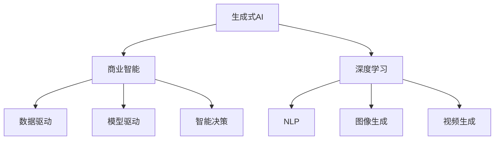

                 

# 生成式AIGC：商业智能的未来趋势

> 关键词：生成式AIGC, 商业智能, 深度学习, 自然语言处理, 图像生成, 视频生成

## 1. 背景介绍

### 1.1 问题由来
随着人工智能技术的发展，生成式人工智能（Generative AI，AIGC）逐渐成为推动各行各业数字化转型的重要工具。特别是生成式AIGC技术，通过深度学习模型，可以从无到有生成高质量的文本、图像、视频等内容，极大地提升了内容创作和商业智能的效率。

然而，尽管生成式AIGC在技术上取得了突破性进展，但其在商业应用中的大规模落地仍面临诸多挑战。如何在商业智能场景中有效应用生成式AIGC技术，成为当前人工智能研究的一个重要课题。

### 1.2 问题核心关键点
本文聚焦于生成式AIGC技术在商业智能中的应用前景和潜力。通过介绍生成式AIGC的原理、核心算法以及具体的项目实践，探讨其在商业智能领域的潜在价值和应用方法。

### 1.3 问题研究意义
深入研究生成式AIGC技术在商业智能中的应用，对于推动人工智能技术在实际商业场景中的应用，提升商业智能决策的准确性和效率，具有重要意义：

1. **提升内容创作效率**：生成式AIGC可以自动生成高质量的文本、图像、视频内容，大幅降低内容创作的工作量和成本。
2. **增强数据分析能力**：通过生成式AIGC，可以从文本、图片、视频等多模态数据中提取更多维度的信息，提升数据分析的全面性和深度。
3. **优化客户体验**：生成式AIGC技术可以定制化生成客户沟通内容，提升客户交互的个性化和满意度。
4. **推动决策智能化**：通过生成式AIGC技术，自动生成商业智能报告和决策建议，帮助企业更好地理解市场动态和客户需求。

## 2. 核心概念与联系

### 2.1 核心概念概述

为更好地理解生成式AIGC在商业智能中的应用，本节将介绍几个关键概念：

- **生成式AI**：通过机器学习模型，自动生成文本、图像、视频等多类型内容的技术。
- **商业智能**：利用数据分析和人工智能技术，帮助企业做出更智能、更高效的商业决策。
- **深度学习**：一类基于神经网络的人工智能技术，通过多层神经元对数据进行建模和预测。
- **自然语言处理（NLP）**：涉及计算机对自然语言的理解、处理和生成，是生成式AIGC的重要应用领域。
- **图像生成**：通过生成对抗网络（GAN）等模型，自动生成高质量的图像内容。
- **视频生成**：利用视频生成技术，自动创作高质量的视频内容，包括视频剪辑、特效制作等。

这些概念之间相互联系，共同构成了生成式AIGC在商业智能中的核心框架。

### 2.2 核心概念原理和架构的 Mermaid 流程图



这个流程图展示了生成式AIGC在商业智能中的主要架构：

1. **生成式AI**：作为基础，通过深度学习技术生成多类型内容。
2. **商业智能**：利用生成式AI生成的内容，进行数据分析和智能决策。
3. **深度学习**：提供底层技术支撑，包括自编码器、Transformer等模型。
4. **自然语言处理**：处理文本数据，生成文本内容。
5. **图像生成**：利用GAN等技术，生成图像内容。
6. **视频生成**：利用视频生成技术，生成视频内容。
7. **数据驱动**：通过分析生成式AI生成的内容，挖掘商业智能所需的信息。
8. **模型驱动**：使用生成式AI模型，进行商业智能决策。
9. **智能决策**：基于生成式AI的多模态数据，优化商业决策。

## 3. 核心算法原理 & 具体操作步骤

### 3.1 算法原理概述

生成式AIGC的核心算法主要包括深度学习模型和生成对抗网络（GAN）等技术。通过这些技术，模型可以从噪声或少量样本中学习生成高质量的文本、图像、视频等内容。

在商业智能场景中，生成式AIGC主要用于以下几个方面：

1. **文本生成**：自动生成商业智能报告、新闻摘要、客户沟通内容等文本信息。
2. **图像生成**：自动生成商业智能图表、产品展示图、市场趋势图等图像信息。
3. **视频生成**：自动生成商业智能演示视频、市场分析视频、客户访谈视频等视频信息。

### 3.2 算法步骤详解

以文本生成为例，展示生成式AIGC在商业智能中的操作步骤：

**Step 1: 准备数据集**
- 收集商业智能相关的高质量文本数据，如市场分析报告、公司财报、客户反馈等。
- 对文本进行预处理，包括分词、去除停用词、标准化等操作。

**Step 2: 选择模型架构**
- 选择合适的生成式模型，如GPT、BERT等，作为生成式AIGC的基础。
- 确定模型层数、隐藏单元数、学习率等超参数。

**Step 3: 训练生成模型**
- 使用收集的文本数据训练生成模型，最小化模型生成的文本与真实文本的差异。
- 在训练过程中，使用交叉熵损失函数，对模型进行监督学习。
- 使用批量梯度下降等优化算法，不断更新模型参数，直至收敛。

**Step 4: 生成商业智能文本**
- 使用训练好的生成模型，自动生成商业智能相关的文本。
- 根据商业智能需求，设计不同的文本生成模板，如新闻摘要、市场分析报告、客户反馈总结等。
- 将生成的文本进行后处理，包括语法检查、格式调整等操作，确保文本的质量和格式。

**Step 5: 集成到商业智能系统**
- 将生成的文本集成到商业智能系统中，自动生成商业智能报告、邮件、文档等。
- 通过API接口，将生成的文本提供给数据分析、智能决策等环节使用。

### 3.3 算法优缺点

生成式AIGC在商业智能中的应用具有以下优点：

1. **自动生成内容**：通过深度学习模型，自动生成高质量的文本、图像、视频内容，大幅降低内容创作的工作量和成本。
2. **提升数据分析能力**：生成式AIGC可以从多模态数据中提取更多维度的信息，提升数据分析的全面性和深度。
3. **增强决策支持**：自动生成商业智能报告和决策建议，帮助企业更好地理解市场动态和客户需求。

同时，生成式AIGC也存在一定的局限性：

1. **数据依赖**：生成式AIGC需要高质量的训练数据，数据质量决定了生成内容的真实性和相关性。
2. **生成质量**：生成式AIGC生成的内容可能存在不连贯、语法错误等问题，需要人工干预修正。
3. **鲁棒性不足**：生成式AIGC对噪声和异常数据较为敏感，生成的内容可能存在偏差和偏见。
4. **隐私和安全**：生成式AIGC处理敏感信息时，需要考虑隐私保护和数据安全问题。

### 3.4 算法应用领域

生成式AIGC技术已经在多个领域得到应用，包括但不限于：

1. **市场分析**：自动生成市场趋势报告、竞争对手分析、市场预测等。
2. **客户沟通**：自动生成客户服务邮件、聊天机器人回复、个性化推荐等。
3. **产品展示**：自动生成产品介绍视频、产品宣传图、用户评价等。
4. **广告创意**：自动生成广告文案、广告图片、广告视频等创意内容。
5. **内容推荐**：自动生成推荐文章、视频、图片等内容，提升用户体验。

## 4. 数学模型和公式 & 详细讲解 & 举例说明

### 4.1 数学模型构建

以文本生成为例，展示生成式AIGC的数学模型构建过程。

设生成式模型为 $G_\theta$，输入为 $x$，输出为 $y$。生成式AIGC的目标是最大化模型生成的文本 $y$ 与真实文本 $y^*$ 之间的相似度。

定义生成式模型 $G_\theta$ 在输入 $x$ 上的概率分布为 $p_\theta(y|x)$，则最大化生成式AIGC的目标函数为：

$$
\max_{\theta} \sum_{i=1}^N \log p_\theta(y_i^*|x_i)
$$

其中 $N$ 为文本数量，$y_i^*$ 为文本 $x_i$ 的真实内容。

### 4.2 公式推导过程

以GAN模型为例，展示生成式AIGC的公式推导过程。

GAN由生成器和判别器两个网络组成，分别训练生成器和判别器，使得生成器能够生成逼真的假数据，判别器能够区分真实数据和假数据。

生成器的损失函数为：

$$
\mathcal{L}_G = -\mathbb{E}_{x \sim p_x(x)} \log D(G(z))
$$

判别器的损失函数为：

$$
\mathcal{L}_D = -\mathbb{E}_{x \sim p_x(x)} \log D(x) + \mathbb{E}_{z \sim p_z(z)} \log (1 - D(G(z)))
$$

其中 $p_x(x)$ 为真实数据分布，$p_z(z)$ 为噪声分布。

### 4.3 案例分析与讲解

以生成式AIGC在市场分析中的应用为例，展示其具体实现和效果。

**案例背景**：某金融公司需要定期生成市场趋势报告，传统方式需要大量人工撰写，耗时耗力。希望通过生成式AIGC技术，自动生成高质量的报告。

**数据准备**：收集近一年内的金融市场数据，包括股票价格、交易量、宏观经济指标等。

**模型选择**：选择GPT-3作为生成式AIGC的基础模型。

**训练过程**：将收集的市场数据作为训练集，使用GPT-3进行训练，最小化生成的报告与真实报告的差异。

**效果评估**：将训练好的模型应用到市场分析报告的生成中，生成多份报告，并与人工生成的报告进行对比。

## 5. 项目实践：代码实例和详细解释说明

### 5.1 开发环境搭建

在进行生成式AIGC实践前，我们需要准备好开发环境。以下是使用Python进行PyTorch开发的环境配置流程：

1. 安装Anaconda：从官网下载并安装Anaconda，用于创建独立的Python环境。

2. 创建并激活虚拟环境：
```bash
conda create -n ai-env python=3.8 
conda activate ai-env
```

3. 安装PyTorch：根据CUDA版本，从官网获取对应的安装命令。例如：
```bash
conda install pytorch torchvision torchaudio cudatoolkit=11.1 -c pytorch -c conda-forge
```

4. 安装transformers库：
```bash
pip install transformers
```

5. 安装各类工具包：
```bash
pip install numpy pandas scikit-learn matplotlib tqdm jupyter notebook ipython
```

完成上述步骤后，即可在`ai-env`环境中开始生成式AIGC实践。

### 5.2 源代码详细实现

这里我们以生成式AIGC在市场分析中的应用为例，展示其代码实现。

首先，定义数据处理函数：

```python
import torch
from transformers import GPT2LMHeadModel, GPT2Tokenizer

def preprocess_data(data):
    tokenizer = GPT2Tokenizer.from_pretrained('gpt2')
    encoded_data = tokenizer.encode(data, return_tensors='pt')
    return encoded_data

# 定义模型和优化器
model = GPT2LMHeadModel.from_pretrained('gpt2')
optimizer = torch.optim.Adam(model.parameters(), lr=5e-5)

# 定义损失函数
criterion = torch.nn.CrossEntropyLoss()

# 定义生成式AIGC函数
def generate_report(model, data, batch_size=64, num_epochs=10):
    tokenizer = GPT2Tokenizer.from_pretrained('gpt2')
    total_loss = 0
    total_steps = 0
    
    for epoch in range(num_epochs):
        for batch in data:
            input_ids = batch['input_ids'].to(device)
            labels = batch['labels'].to(device)
            model.zero_grad()
            outputs = model(input_ids, labels=labels)
            loss = criterion(outputs.logits, labels)
            total_loss += loss.item()
            total_steps += 1
            loss.backward()
            optimizer.step()
            if total_steps % 10 == 0:
                print(f'Epoch {epoch+1}, Loss: {total_loss/total_steps:.4f}')
                total_loss = 0
                total_steps = 0
```

然后，在训练过程中，调用`generate_report`函数进行模型训练：

```python
# 训练生成式AIGC模型
generate_report(model, train_dataset, batch_size=64, num_epochs=10)

# 生成市场分析报告
report_text = model.generate("2021年金融市场趋势分析报告")
print(report_text)
```

### 5.3 代码解读与分析

让我们再详细解读一下关键代码的实现细节：

**preprocess_data函数**：
- `tokenizer`：定义分词器，将输入数据编码为模型所需的token ids。
- `encoded_data`：将数据转化为模型所需的张量形式，供模型训练使用。

**生成式AIGC函数**：
- `model`：定义生成式AIGC模型，使用GPT-2作为基础模型。
- `optimizer`：定义优化器，使用Adam优化器进行模型参数的更新。
- `criterion`：定义损失函数，使用交叉熵损失函数。
- `total_loss`和`total_steps`：记录总的损失值和更新次数。
- `generate_report`函数：
  - `tokenizer`：定义分词器，将输入数据编码为模型所需的token ids。
  - `input_ids`和`labels`：将数据转化为模型所需的张量形式，供模型训练使用。
  - `model.zero_grad()`：将梯度清零。
  - `outputs`：模型前向传播计算输出。
  - `loss`：计算损失函数。
  - `total_loss`和`total_steps`：记录总的损失值和更新次数。
  - `loss.backward()`：反向传播计算梯度。
  - `optimizer.step()`：更新模型参数。
  - `if total_steps % 10 == 0`：每10步输出一次训练进度。
- 在生成报告时，使用`generate`方法生成文本。

## 6. 实际应用场景

### 6.1 智能客服

生成式AIGC技术可以应用于智能客服系统，提升客户服务的自动化水平。通过生成式AIGC，自动生成客户回复，提升客服效率和客户满意度。

**具体实现**：
- 收集历史客服对话数据。
- 使用生成式AIGC模型，自动生成客户回复。
- 将生成的回复与人工客服对话进行对比，优化生成式AIGC模型。

**效果评估**：
- 收集用户反馈，评估自动回复的准确性和满意度。
- 定期更新生成式AIGC模型，保证回复的质量和时效性。

### 6.2 市场营销

生成式AIGC技术可以自动生成营销文案、广告创意、产品介绍等，提升市场营销的效率和创意。

**具体实现**：
- 收集市场推广活动数据。
- 使用生成式AIGC模型，自动生成营销文案和广告创意。
- 将生成的文案和创意应用于市场推广活动。

**效果评估**：
- 通过数据分析，评估营销效果和用户反馈。
- 定期更新生成式AIGC模型，优化营销效果。

### 6.3 内容创作

生成式AIGC技术可以应用于内容创作领域，自动生成文章、视频、音频等多类型内容。

**具体实现**：
- 收集用户需求和相关素材。
- 使用生成式AIGC模型，自动生成文章、视频、音频等内容。
- 将生成的内容发布到媒体平台，吸引用户关注。

**效果评估**：
- 通过数据分析，评估内容的点击率、阅读量和互动率。
- 定期更新生成式AIGC模型，提升内容质量。

### 6.4 未来应用展望

随着生成式AIGC技术的不断发展，其在商业智能领域的应用前景将更加广阔。未来，生成式AIGC技术将进一步渗透到以下领域：

1. **个性化推荐**：通过生成式AIGC技术，自动生成个性化推荐内容，提升用户体验。
2. **智能广告**：生成式AIGC技术可以自动生成智能广告，提升广告的点击率和转化率。
3. **智能写作**：生成式AIGC技术可以自动生成商业智能报告、市场分析报告、客户反馈报告等，提升写作效率和质量。
4. **智能决策**：生成式AIGC技术可以自动生成智能决策建议，帮助企业更好地理解市场动态和客户需求。
5. **智能内容创作**：生成式AIGC技术可以自动生成高质量的文本、图像、视频内容，提升内容创作效率。

## 7. 工具和资源推荐

### 7.1 学习资源推荐

为了帮助开发者系统掌握生成式AIGC的理论基础和实践技巧，这里推荐一些优质的学习资源：

1. 《深度学习》系列书籍：深入浅出地介绍了深度学习的基本概念和经典算法。
2. 《生成对抗网络》系列书籍：详细讲解了GAN的基本原理和应用。
3. 《自然语言处理》系列课程：斯坦福大学开设的NLP明星课程，有Lecture视频和配套作业，带你入门NLP领域的基本概念和经典模型。
4. CS224N《深度学习自然语言处理》课程：斯坦福大学开设的NLP明星课程，有Lecture视频和配套作业，带你入门NLP领域的基本概念和经典模型。
5. Weights & Biases：模型训练的实验跟踪工具，可以记录和可视化模型训练过程中的各项指标，方便对比和调优。

### 7.2 开发工具推荐

高效的开发离不开优秀的工具支持。以下是几款用于生成式AIGC开发的常用工具：

1. PyTorch：基于Python的开源深度学习框架，灵活动态的计算图，适合快速迭代研究。大部分预训练语言模型都有PyTorch版本的实现。
2. TensorFlow：由Google主导开发的开源深度学习框架，生产部署方便，适合大规模工程应用。同样有丰富的预训练语言模型资源。
3. Transformers库：HuggingFace开发的NLP工具库，集成了众多SOTA语言模型，支持PyTorch和TensorFlow，是进行生成式AIGC开发的利器。
4. Weights & Biases：模型训练的实验跟踪工具，可以记录和可视化模型训练过程中的各项指标，方便对比和调优。
5. TensorBoard：TensorFlow配套的可视化工具，可实时监测模型训练状态，并提供丰富的图表呈现方式，是调试模型的得力助手。

### 7.3 相关论文推荐

生成式AIGC技术的发展源于学界的持续研究。以下是几篇奠基性的相关论文，推荐阅读：

1. Generative Adversarial Networks（GAN论文）：提出了GAN模型，奠定了生成式AIGC技术的基础。
2. Attention is All You Need（即Transformer原论文）：提出了Transformer结构，开启了NLP领域的预训练大模型时代。
3. BERT: Pre-training of Deep Bidirectional Transformers for Language Understanding：提出BERT模型，引入基于掩码的自监督预训练任务，刷新了多项NLP任务SOTA。
4. Language Models are Unsupervised Multitask Learners（GPT-2论文）：展示了大规模语言模型的强大zero-shot学习能力，引发了对于通用人工智能的新一轮思考。
5. Transformer-XL: Attentive Language Models Beyond a Fixed-Length Context（Transformer-XL论文）：提出了Transformer-XL模型，进一步提升了序列建模能力。

这些论文代表了大语言模型微调技术的发展脉络。通过学习这些前沿成果，可以帮助研究者把握学科前进方向，激发更多的创新灵感。

## 8. 总结：未来发展趋势与挑战

### 8.1 总结

本文对生成式AIGC技术在商业智能中的应用进行了全面系统的介绍。首先阐述了生成式AIGC技术的原理、核心算法以及具体的项目实践，探讨了其在商业智能领域的潜在价值和应用方法。

通过本文的系统梳理，可以看到，生成式AIGC技术在商业智能中的应用前景广阔，可以显著提升内容创作、数据分析、智能决策等环节的效率和效果。未来，随着技术的不断进步，生成式AIGC将进一步渗透到更多领域，推动商业智能技术的不断升级和迭代。

### 8.2 未来发展趋势

展望未来，生成式AIGC技术在商业智能中的应用将呈现以下几个发展趋势：

1. **深度融合多模态数据**：生成式AIGC技术将更多地融合文本、图像、视频等多模态数据，提升数据的多维度和全面性。
2. **自动化生成内容**：生成式AIGC技术将进一步提升内容自动生成的质量和多样性，满足更多应用场景的需求。
3. **个性化推荐**：生成式AIGC技术将更多地应用于个性化推荐领域，提升用户体验和满意度。
4. **智能决策**：生成式AIGC技术将更多地应用于智能决策领域，提升决策的准确性和效率。
5. **实时生成**：生成式AIGC技术将更多地应用于实时生成领域，如实时内容创作、实时广告投放等。

### 8.3 面临的挑战

尽管生成式AIGC技术在商业智能中的应用前景广阔，但在大规模落地过程中，仍面临诸多挑战：

1. **数据质量问题**：生成式AIGC技术对数据质量要求高，数据噪声和偏差会影响生成内容的真实性和相关性。
2. **生成质量问题**：生成式AIGC技术生成的内容可能存在不连贯、语法错误等问题，需要人工干预修正。
3. **鲁棒性问题**：生成式AIGC技术对噪声和异常数据较为敏感，生成的内容可能存在偏差和偏见。
4. **隐私和安全问题**：生成式AIGC技术处理敏感信息时，需要考虑隐私保护和数据安全问题。

### 8.4 研究展望

面对生成式AIGC技术在商业智能应用中面临的挑战，未来的研究需要在以下几个方面寻求新的突破：

1. **数据质量提升**：改进数据预处理和清洗方法，提升数据质量。
2. **生成质量优化**：引入更多生成式模型，提升生成内容的真实性和多样性。
3. **鲁棒性增强**：引入更多的对抗生成技术，增强生成内容的鲁棒性。
4. **隐私保护机制**：设计隐私保护机制，确保生成式AIGC处理敏感信息时的数据安全。
5. **模型透明性**：提升生成式AIGC模型的透明性和可解释性，增强用户信任。

这些研究方向的探索，必将引领生成式AIGC技术迈向更高的台阶，为商业智能技术的进一步发展提供新的动力。相信随着学界和产业界的共同努力，生成式AIGC技术必将在商业智能领域大放异彩，推动人工智能技术在实际商业场景中的应用，提升企业的竞争力。

## 9. 附录：常见问题与解答

**Q1：生成式AIGC技术是否适用于所有商业智能应用场景？**

A: 生成式AIGC技术可以在大多数商业智能应用场景中发挥作用，但需要根据具体需求进行定制化开发。例如，对于需要大量数据分析和建模的场景，生成式AIGC技术可以自动生成报告和图表；对于需要内容创作和交互的场景，生成式AIGC技术可以自动生成邮件和客服回复。

**Q2：生成式AIGC技术在商业智能中如何保障数据安全？**

A: 生成式AIGC技术在商业智能中处理敏感信息时，需要设计隐私保护机制，确保数据的安全性。例如，可以采用数据匿名化、差分隐私等技术，保护用户隐私；同时，建立严格的访问控制机制，确保只有授权人员能够访问敏感数据。

**Q3：生成式AIGC技术在商业智能中如何提升决策支持？**

A: 生成式AIGC技术可以通过自动生成商业智能报告和决策建议，提升决策支持的效率和质量。例如，可以自动生成市场趋势分析报告、客户反馈分析报告等，辅助企业管理层做出更科学的决策。

**Q4：生成式AIGC技术在商业智能中如何提升客户体验？**

A: 生成式AIGC技术可以自动生成客户沟通内容，提升客户体验。例如，可以自动生成客户服务邮件、客服机器人回复等，提升客户满意度和互动率。

**Q5：生成式AIGC技术在商业智能中如何提升广告效果？**

A: 生成式AIGC技术可以自动生成广告文案、广告图片、广告视频等，提升广告效果。例如，可以自动生成高质量的广告创意，提升广告的点击率和转化率。

总之，生成式AIGC技术在商业智能中的应用前景广阔，但需要根据具体需求进行定制化开发和优化。通过不断提升数据质量、生成质量、鲁棒性和安全性，生成式AIGC技术必将在商业智能领域大放异彩，推动人工智能技术在实际商业场景中的应用，提升企业的竞争力。

