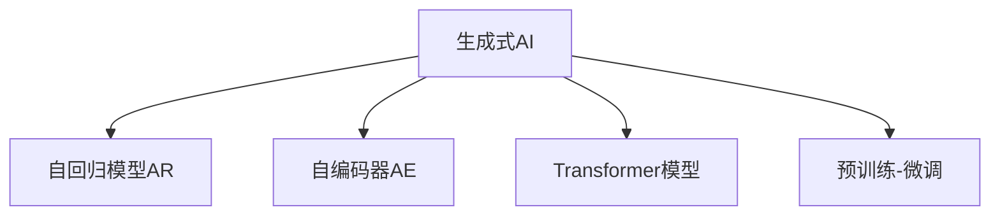

                 

# 生成式AI：金矿还是泡沫？第二部分：AI不是万能药

## 1. 背景介绍

### 1.1 问题由来

生成式人工智能（Generative AI）近年来迅猛发展，从GPT-3到GPT-4，再到ChatGPT，这些大模型的涌现引发了人们对于生成式AI的无限想象。生成式AI被认为是继深度学习之后的下一个技术浪潮，被寄予解决大量实际问题的希望。然而，随着技术的快速发展，也逐渐暴露出一些问题，这使得人们对生成式AI的未来充满了争议。

生成式AI的核心在于利用机器学习算法生成具有自然语言能力的内容，从文本生成到图像生成，再到音频生成，生成式AI正在全面渗透到各个领域。它不仅可以用于内容创作、文本翻译、智能推荐等传统任务，还尝试应用于更具挑战性的任务，如文学创作、绘画、音乐创作等。然而，生成式AI在实际应用中也暴露出了诸如内容质量、可解释性、偏见与公平性等问题，引发了公众对于其可靠性和实用性的广泛讨论。

生成式AI是否真的像人们预期的那样，能够解决所有的现实问题？AI技术是否应该被视为万能药？本文将深入探讨生成式AI的潜力与局限，分析其在实际应用中的现状与挑战，为读者提供一个全面且客观的视角。

### 1.2 问题核心关键点

- **生成式AI的潜力与局限**：生成式AI在文本生成、图像生成、音频生成等方面的应用潜力，以及其面临的挑战和局限性。
- **实际应用中的表现与问题**：生成式AI在实际场景中的应用效果、常见问题与解决方案。
- **未来发展趋势与挑战**：生成式AI技术的最新进展、可能的发展方向以及面临的主要挑战。
- **技术与社会影响**：生成式AI对社会、伦理与法律的影响，以及如何平衡技术发展与社会责任。

## 2. 核心概念与联系

### 2.1 核心概念概述

为了更好地理解生成式AI，我们需要对其核心概念有一个清晰的认识。以下是几个关键概念及其相互关系：

- **生成式AI**：指能够生成具有真实感、可理解性的内容的技术。主要包括文本生成、图像生成、音频生成等。
- **自回归模型（AR）**：一种依赖过去生成的序列信息来预测下一个序列元素的模型，如RNN、LSTM等。
- **自编码器（AE）**：一种通过学习数据的潜在表示来进行数据压缩和重构的模型，如变分自编码器（VAE）、生成对抗网络（GAN）等。
- **Transformer模型**：一种基于自注意力机制的深度学习模型，用于处理序列数据，如BERT、GPT等。
- **预训练-微调（Pre-training & Fine-tuning）**：通过在大规模无标签数据上进行预训练，再在特定任务上通过少量标注数据进行微调，提升模型性能。

这些概念之间的联系通过以下Mermaid流程图进行展示：



这个流程图展示了生成式AI与不同类型的模型之间的关系。生成式AI通过这些不同的模型架构，实现了从文本、图像到音频等多种数据的生成。

## 3. 核心算法原理 & 具体操作步骤

### 3.1 算法原理概述

生成式AI的原理可以概括为以下几个步骤：

1. **数据预处理**：对输入数据进行清洗、标注，将其转化为模型可以处理的格式。
2. **模型选择与训练**：选择合适的生成模型，并在大量无标签数据上进行预训练。
3. **微调与优化**：在特定任务上，通过少量标注数据进行微调，优化模型以适应具体任务。
4. **生成与评估**：使用微调后的模型生成新内容，并通过评估指标评估生成内容的自然性和质量。

### 3.2 算法步骤详解

以文本生成为例，以下是生成式AI的详细步骤：

**Step 1: 数据预处理**

- 收集并清洗大规模无标签文本数据，如维基百科、新闻文章、小说等。
- 将文本数据分词、去停用词、构建词汇表，转换为模型可以处理的格式。

**Step 2: 模型选择与训练**

- 选择自回归模型（如GPT）或自编码器（如VAE）进行预训练。
- 在大规模无标签数据上训练模型，学习通用的语言表示。

**Step 3: 微调与优化**

- 在特定任务上，使用少量标注数据进行微调。
- 设置合适的学习率、批量大小、迭代轮数等超参数，使用AdamW等优化器进行优化。

**Step 4: 生成与评估**

- 使用微调后的模型生成新文本。
- 通过BLEU、ROUGE等指标评估生成文本的质量和自然性。

### 3.3 算法优缺点

生成式AI的优势主要在于其灵活性和多样性，能够快速生成多样化且具有一定质量的内容。然而，其缺点也不容忽视：

- **数据依赖性强**：生成式AI需要大量数据进行预训练，对于小规模数据可能效果不佳。
- **偏见与公平性问题**：模型可能会学习并复制数据中的偏见，导致不公平的输出。
- **可解释性不足**：生成式AI模型的决策过程难以解释，缺乏透明度。
- **效率问题**：大规模生成任务可能耗费大量计算资源和时间。

### 3.4 算法应用领域

生成式AI的应用范围非常广泛，涉及文本生成、图像生成、音频生成、视频生成等多个领域。具体应用包括：

- **内容创作**：自动化写作、新闻报道、博客文章、故事创作等。
- **文本翻译**：机器翻译、摘要生成、文本修复等。
- **智能推荐**：个性化推荐、广告推荐、搜索结果优化等。
- **图像生成**：人脸生成、图像修复、艺术创作等。
- **音频生成**：音乐创作、语音合成、语音翻译等。

## 4. 数学模型和公式 & 详细讲解 & 举例说明

### 4.1 数学模型构建

以文本生成为例，我们可以使用基于Transformer的模型来构建生成式AI的数学模型。

假设生成模型为 $M_{\theta}$，输入为 $x$，输出为 $y$。生成过程可以表示为：

$$
y = M_{\theta}(x)
$$

其中，$x$ 为输入文本，$y$ 为生成的文本。

### 4.2 公式推导过程

以Transformer为例，生成过程可以分解为以下几个步骤：

1. **编码器**：将输入文本 $x$ 编码成一组向量表示。
2. **解码器**：根据编码器输出的向量表示生成目标文本 $y$。
3. **注意力机制**：在生成过程中，根据当前已生成的文本动态调整注意力权重，提高生成质量。

生成模型的损失函数通常为交叉熵损失，用于衡量生成文本与真实文本的差异。

### 4.3 案例分析与讲解

假设我们有一组标注好的文本数据集 $D=\{(x_i, y_i)\}_{i=1}^N$，其中 $x_i$ 为输入文本，$y_i$ 为对应的生成文本。我们的目标是在这个数据集上进行微调，优化模型参数 $\theta$，使得生成的文本 $y$ 尽可能接近真实的文本 $y_i$。

优化目标可以表示为：

$$
\hat{\theta} = \mathop{\arg\min}_{\theta} \mathcal{L}(M_{\theta}, D)
$$

其中，$\mathcal{L}$ 为交叉熵损失函数，$M_{\theta}$ 为微调后的生成模型。

## 5. 项目实践：代码实例和详细解释说明

### 5.1 开发环境搭建

为了进行生成式AI的实践，我们需要准备以下环境：

1. 安装Python 3.8及以上版本。
2. 安装PyTorch 1.9及以上版本。
3. 安装Transformers库。

### 5.2 源代码详细实现

以下是一个简单的文本生成示例代码：

```python
import torch
import torch.nn as nn
import torch.optim as optim
from transformers import GPT2LMHeadModel, GPT2Tokenizer

# 加载预训练模型和分词器
model = GPT2LMHeadModel.from_pretrained('gpt2')
tokenizer = GPT2Tokenizer.from_pretrained('gpt2')

# 定义输入序列长度和生成文本长度
max_seq_len = 512
min_seq_len = 128

# 定义超参数
learning_rate = 5e-5
num_epochs = 5

# 加载训练数据
with open('train.txt', 'r', encoding='utf-8') as f:
    train_data = f.read()

# 定义训练函数
def train():
    # 将训练数据转化为输入序列
    train_text = ' '.join(train_data.split('\n'))
    inputs = tokenizer.encode(train_text, max_length=max_seq_len, padding='max_length', truncation=True, return_tensors='pt')

    # 定义优化器
    optimizer = optim.AdamW(model.parameters(), lr=learning_rate)

    # 定义训练循环
    for epoch in range(num_epochs):
        # 前向传播
        outputs = model.generate(inputs, max_length=min_seq_len, top_k=50, top_p=0.9, num_return_sequences=1)

        # 计算损失
        loss = torch.nn.functional.cross_entropy(outputs.logits.view(-1), inputs[:, 1:].view(-1))

        # 反向传播和优化
        optimizer.zero_grad()
        loss.backward()
        optimizer.step()

    # 输出微调后的模型
    print(model)

# 调用训练函数
train()
```

### 5.3 代码解读与分析

在上述代码中，我们使用了GPT-2模型和预训练分词器进行文本生成。训练过程中，我们首先对训练数据进行编码，然后使用AdamW优化器进行模型优化，最后输出微调后的模型。

需要注意的是，由于模型预训练的目标和微调的目标可能不同，因此在微调时可能需要对模型参数进行调整，如减少部分参数的更新量，以提高微调效率。

### 5.4 运行结果展示

运行上述代码，可以在控制台输出微调后的GPT-2模型，用于生成新的文本。

## 6. 实际应用场景

### 6.1 内容创作

生成式AI在内容创作中的应用非常广泛，包括自动写作、文本摘要、故事创作等。例如，OpenAI的GPT系列模型已经被广泛应用于小说创作、游戏脚本生成等领域，展示了其强大的文本生成能力。

### 6.2 文本翻译

生成式AI在文本翻译中的应用也非常广泛。例如，Google的BERT模型已经被广泛应用于机器翻译任务中，提升了翻译质量和效率。

### 6.3 智能推荐

生成式AI在智能推荐中的应用主要体现在个性化推荐系统上。例如，Amazon和Netflix等公司已经使用生成式AI进行商品推荐和内容推荐，提高了用户体验和平台转化率。

## 7. 工具和资源推荐

### 7.1 学习资源推荐

为了帮助读者更好地掌握生成式AI的原理和技术，以下是一些推荐的学习资源：

1. **《生成式AI：从理论到实践》**：这是一本详细介绍生成式AI技术的书籍，涵盖了文本生成、图像生成、音频生成等多个方面。
2. **Coursera上的《深度学习与生成模型》课程**：由斯坦福大学提供的深度学习课程，涵盖了生成模型的理论和实践。
3. **Arxiv上的最新论文**：通过阅读最新研究论文，了解生成式AI的最新进展和技术细节。

### 7.2 开发工具推荐

以下是一些常用的生成式AI开发工具：

1. **PyTorch**：深度学习框架，支持生成式AI模型的训练和推理。
2. **TensorFlow**：另一个深度学习框架，支持生成式AI模型的训练和推理。
3. **Transformers库**：专门用于自然语言处理的开源库，支持多种生成模型。

### 7.3 相关论文推荐

以下是一些推荐的相关论文，帮助读者深入了解生成式AI的研究进展：

1. **Attention is All You Need**：Transformer模型的原论文，奠定了生成式AI的基础。
2. **The Unreasonable Effectiveness of Transfer Learning**：研究了预训练-微调方法对生成式AI的影响。
3. **GPT-3: Language Models are Unsupervised Multitask Learners**：介绍了GPT-3的预训练和微调过程。

## 8. 总结：未来发展趋势与挑战

### 8.1 研究成果总结

生成式AI已经在文本生成、图像生成、音频生成等多个领域取得了显著进展，推动了内容创作、翻译、推荐等多个应用的进步。然而，其面临的挑战也不容忽视，如数据依赖性、偏见与公平性问题、可解释性不足等。

### 8.2 未来发展趋势

未来，生成式AI将在以下几个方面继续发展：

- **多模态生成**：生成式AI将逐渐融合视觉、音频等多种模态数据，实现更丰富的内容生成。
- **交互式生成**：生成式AI将更多地应用于交互式应用，如聊天机器人、虚拟助手等。
- **可解释生成**：生成式AI将更加注重模型的可解释性，帮助用户理解生成内容的过程和逻辑。

### 8.3 面临的挑战

生成式AI仍面临诸多挑战：

- **数据依赖性**：生成式AI需要大量数据进行预训练和微调，对于小规模数据可能效果不佳。
- **偏见与公平性**：模型可能会学习并复制数据中的偏见，导致不公平的输出。
- **可解释性不足**：生成式AI模型的决策过程难以解释，缺乏透明度。
- **效率问题**：大规模生成任务可能耗费大量计算资源和时间。

### 8.4 研究展望

未来，生成式AI的研究将更加注重以下几个方面：

- **多模态融合**：将视觉、音频等多模态数据与文本数据进行融合，实现更丰富的生成内容。
- **交互式生成**：开发更加智能的交互式生成系统，提升用户体验。
- **可解释生成**：增强生成式AI的可解释性，帮助用户理解生成内容的过程和逻辑。

## 9. 附录：常见问题与解答

### 9.1 常见问题

1. **生成式AI是否真的能解决所有问题？**

   答：生成式AI在许多领域展现了强大的潜力，但并不能解决所有问题。生成式AI的性能和效果受到数据质量、模型架构、训练策略等多种因素的影响，对于特定任务可能存在一定的局限性。

2. **生成式AI的生成内容质量如何保证？**

   答：生成式AI的生成内容质量主要取决于模型的训练数据和模型架构。通过选择合适的训练数据和模型架构，并进行适当的微调，可以显著提高生成内容的质量。

3. **生成式AI的偏见和公平性问题如何解决？**

   答：生成式AI的偏见和公平性问题可以通过以下方法解决：
   - 数据预处理：清洗、标注训练数据，减少数据中的偏见。
   - 模型设计：选择公平、无偏的模型架构，如公平生成对抗网络（FGAN）。
   - 评估指标：设计公平性评估指标，如平等机会指数（EOI）。

4. **生成式AI的可解释性不足如何解决？**

   答：生成式AI的可解释性不足可以通过以下方法解决：
   - 可解释性模型：选择可解释性更强的模型，如LIME、SHAP等。
   - 模型可视化：通过可视化生成过程，帮助用户理解模型决策的逻辑。
   - 用户反馈：收集用户反馈，优化生成模型的输出。

5. **生成式AI的效率问题如何解决？**

   答：生成式AI的效率问题可以通过以下方法解决：
   - 模型优化：通过模型压缩、稀疏化存储等方法优化模型结构，提高推理速度。
   - 并行计算：利用分布式计算和GPU加速等技术提高计算效率。
   - 数据优化：通过数据增强、对抗训练等方法减少模型过拟合，提高模型泛化能力。

---

作者：禅与计算机程序设计艺术 / Zen and the Art of Computer Programming

