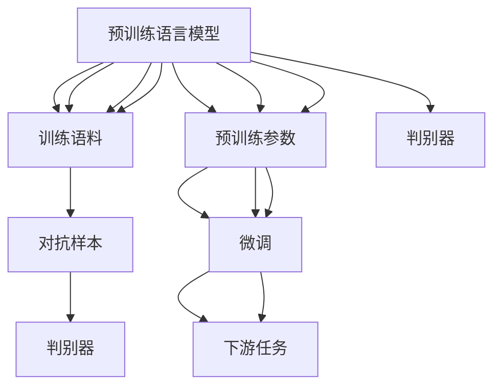

                 

# 生成式AI：金矿还是泡沫？第四部分：“让人尖叫”的用户体验

## 1. 背景介绍

### 1.1 问题由来
生成式人工智能（Generative AI）近年来在各个领域中的应用如火如荼，从图像生成、音乐创作到自然语言生成，都在展示其惊人的能力。这些技术不仅让人们体验到了前所未有的创作自由，也使得各种应用场景得以革新。但随之而来的问题也不容忽视，尤其是在用户体验方面，生成式AI是否真的能够让用户“尖叫”，抑或只是一时的“泡沫”？本文将通过探讨生成式AI在用户体验方面的应用和挑战，试图解答这一疑问。

## 2. 核心概念与联系

### 2.1 核心概念概述

生成式AI是指使用机器学习模型，能够根据输入数据生成新的、之前不存在的数据的AI技术。常见的生成式AI技术包括变分自编码器（VAE）、生成对抗网络（GAN）、自回归模型（如LSTM、Transformer）以及基于预训练的语言模型（如GPT、BERT）。这些技术能够模拟复杂的数据分布，从而生成逼真的图像、音频、文本等内容。

### 2.2 核心概念原理和架构的 Mermaid 流程图



### 2.3 核心概念之间的关系

上述概念之间的联系主要体现在：
- 数据生成：生成式AI通过学习输入数据的分布，能够生成新的数据。
- 对抗训练：GAN中的生成器和判别器通过对抗训练，提升生成数据的逼真度。
- 上下文建模：自回归模型能够基于上下文信息生成连贯的序列数据。
- 任务适配：预训练语言模型通过微调，可以适应各种下游任务。

## 3. 核心算法原理 & 具体操作步骤

### 3.1 算法原理概述

生成式AI的核心算法原理主要包括数据生成、对抗训练、上下文建模和任务适配等。以生成对抗网络（GAN）为例，其算法原理可以概述为：

1. **生成器**：使用神经网络模型，接收随机噪声作为输入，生成逼真的数据样本。
2. **判别器**：同样使用神经网络模型，接收数据样本作为输入，判断其是否真实。
3. **对抗训练**：通过交替训练生成器和判别器，使生成器能够生成更逼真的数据，而判别器能够更准确地识别真实数据。

### 3.2 算法步骤详解

以GAN为例，其详细步骤可以描述为：
1. **数据准备**：收集或生成数据集，分为训练集和测试集。
2. **模型初始化**：生成器和判别器模型初始化，权重随机设定。
3. **对抗训练**：交替进行生成器和判别器的训练，不断优化模型参数。
4. **评估测试**：使用测试集评估模型的生成效果。
5. **应用部署**：将训练好的模型部署到实际应用中，进行数据生成。

### 3.3 算法优缺点

生成式AI的主要优点包括：
- 能够生成逼真的新数据，广泛应用于各个领域。
- 使用深度学习模型，具有较高的准确性和灵活性。
- 可以应用于大数据集，减少人工标注成本。

然而，也存在一些缺点：
- 生成数据的真实性和多样性难以保证。
- 模型的训练过程复杂，计算资源需求大。
- 生成结果可能包含不合理的或不适宜的内容，需要额外的筛选和过滤。

### 3.4 算法应用领域

生成式AI技术已经在多个领域得到广泛应用，包括：
- 图像生成：如DeepArt、DALL-E等，能够生成逼真的艺术作品和图像。
- 音乐创作：如Jukedeck、Amper Music等，能够生成具有情感的原创音乐。
- 自然语言生成：如GPT-3、Synthetic Unreal等，能够生成高质量的文章、对话和代码。
- 视频制作：如DeepMotion、SnapTool等，能够生成逼真的动画和视频。

## 4. 数学模型和公式 & 详细讲解 & 举例说明

### 4.1 数学模型构建

以GAN为例，其数学模型可以描述为：
- **生成器**：$G(z)$，将随机噪声$z$映射到生成数据$x$。
- **判别器**：$D(x)$，判断输入数据$x$是否真实。

### 4.2 公式推导过程

对于GAN，其目标函数可以表示为：
- **生成器目标函数**：$L_G = -E_{z \sim p(z)}[\log D(G(z))]$
- **判别器目标函数**：$L_D = -E_{x \sim p(x)}[\log D(x)] - E_{z \sim p(z)}[\log (1 - D(G(z)))]$

其中，$p(z)$为随机噪声$z$的分布，$p(x)$为真实数据$x$的分布。

### 4.3 案例分析与讲解

以GAN生成手写数字为例，其训练过程如下：
1. **数据准备**：收集手写数字数据集。
2. **模型初始化**：生成器和判别器模型初始化，权重随机设定。
3. **对抗训练**：交替进行生成器和判别器的训练，不断优化模型参数。
4. **评估测试**：使用测试集评估模型的生成效果。
5. **应用部署**：将训练好的模型部署到实际应用中，进行数据生成。

## 5. 项目实践：代码实例和详细解释说明

### 5.1 开发环境搭建

为了实现GAN模型，需要安装TensorFlow或PyTorch等深度学习框架。具体步骤如下：
1. 安装TensorFlow或PyTorch。
2. 安装相应的依赖包，如Tensorboard、numpy、matplotlib等。
3. 设置虚拟环境，进行Python代码编写。

### 5.2 源代码详细实现

以下是一个使用TensorFlow实现GAN的示例代码：

```python
import tensorflow as tf
from tensorflow.keras import layers

# 定义生成器模型
def make_generator_model():
    model = tf.keras.Sequential()
    model.add(layers.Dense(256, use_bias=False, input_shape=(100,)))
    model.add(layers.BatchNormalization())
    model.add(layers.LeakyReLU())
    model.add(layers.Dense(512))
    model.add(layers.BatchNormalization())
    model.add(layers.LeakyReLU())
    model.add(layers.Dense(784, activation='tanh'))
    return model

# 定义判别器模型
def make_discriminator_model():
    model = tf.keras.Sequential()
    model.add(layers.Flatten(input_shape=[28, 28]))
    model.add(layers.Dense(256, use_bias=False))
    model.add(layers.BatchNormalization())
    model.add(layers.LeakyReLU())
    model.add(layers.Dropout(0.3))
    model.add(layers.Dense(1, activation='sigmoid'))
    return model
```

### 5.3 代码解读与分析

上述代码中，使用了TensorFlow和Keras API构建了生成器和判别器模型。生成器模型使用LeakyReLU激活函数，判别器模型使用sigmoid激活函数。通过交替训练这两个模型，可以实现生成器的优化。

### 5.4 运行结果展示

运行上述代码后，可以使用Tensorboard可视化训练过程中的损失函数和生成图像。

## 6. 实际应用场景

### 6.1 智能内容创作

生成式AI在智能内容创作方面具有巨大潜力。如使用GPT-3等语言模型，可以自动生成高质量的文章、新闻稿、广告文案等，大幅提高内容创作的效率和质量。

### 6.2 个性化推荐

生成式AI可以应用于个性化推荐系统，通过分析用户行为数据，生成个性化的推荐内容。例如，Amazon使用生成式AI为每个用户生成个性化的产品推荐，显著提升了用户体验和销售转化率。

### 6.3 游戏开发

生成式AI在游戏开发中也有广泛应用。如使用GAN生成逼真的游戏场景和角色，或者使用自回归模型生成对话，使游戏内容更加丰富和生动。

### 6.4 未来应用展望

未来，生成式AI技术将进一步提升用户体验，主要体现在以下几个方面：
- 自动化创作：生成式AI将广泛应用于创意产业，如电影、音乐、艺术等领域，提升创作效率和质量。
- 个性化服务：通过分析用户行为数据，生成个性化的内容推荐、广告投放等，提升用户体验。
- 增强现实和虚拟现实：生成式AI可以应用于AR/VR内容创作，增强现实体验。

## 7. 工具和资源推荐

### 7.1 学习资源推荐

1. **TensorFlow官方文档**：提供了详细的TensorFlow教程和API文档，适合初学者学习。
2. **Keras官方文档**：提供了Keras的教程和API文档，适合快速上手生成式AI项目。
3. **GAN论文**：如Ian Goodfellow等人发表的《Generative Adversarial Nets》，详细介绍了GAN的原理和应用。
4. **NIPS 2016上的GAN论文**：Ian Goodfellow等人发表的《Generative Adversarial Nets》，是GAN领域的经典论文。

### 7.2 开发工具推荐

1. **TensorFlow**：适用于深度学习模型的开发和训练。
2. **Keras**：基于TensorFlow和Theano，提供了简单易用的API，适合快速迭代开发。
3. **Jupyter Notebook**：用于数据可视化、模型调试和结果展示，是Python开发的常用工具。

### 7.3 相关论文推荐

1. **GAN论文**：Ian Goodfellow等人发表的《Generative Adversarial Nets》，详细介绍了GAN的原理和应用。
2. **VAE论文**：Kingma和Welling发表的《Auto-Encoding Variational Bayes》，详细介绍了VAE的原理和应用。
3. **自回归模型论文**：Bahdanau等人发表的《Neural Machine Translation by Jointly Learning to Align and Translate》，详细介绍了自回归模型在机器翻译中的应用。

## 8. 总结：未来发展趋势与挑战

### 8.1 研究成果总结

生成式AI在用户体验方面具有巨大的潜力，但同时也面临诸多挑战。未来，需要进一步提升生成数据的真实性和多样性，优化模型的计算效率，增强内容的可控性和安全性。

### 8.2 未来发展趋势

未来，生成式AI将在以下方面发展：
- 深度模型：使用更深的神经网络结构，提升生成数据的逼真性和多样性。
- 多模态生成：结合图像、音频、视频等多种数据源，提升生成内容的丰富性。
- 实时生成：优化生成模型，实现实时生成，提升用户体验。

### 8.3 面临的挑战

生成式AI面临的主要挑战包括：
- 生成数据质量：生成数据的真实性和多样性难以保证，需要更多的训练数据和更好的生成策略。
- 模型计算资源：生成式AI需要大量的计算资源，如何优化模型，降低计算成本，是亟待解决的问题。
- 内容安全性：生成的内容可能包含不合理的或不适宜的内容，需要额外的筛选和过滤。

### 8.4 研究展望

未来，生成式AI的研究方向包括：
- 生成内容的多样性和可控性：通过引入更多的约束和优化策略，提升生成内容的可控性和多样性。
- 实时生成和交互式体验：结合AI生成技术和用户反馈，实现实时生成和交互式体验。
- 跨模态生成：将生成式AI扩展到多种模态，提升生成内容的丰富性和多样性。

## 9. 附录：常见问题与解答

**Q1: 生成式AI生成的数据是否真实？**

A: 生成式AI生成的数据可以逼真到一定程度，但完全真实的概率较低。可以通过引入更多的训练数据和优化策略，提升生成数据的真实性。

**Q2: 生成式AI如何应用于实际场景？**

A: 生成式AI可以应用于内容创作、个性化推荐、游戏开发等多个场景。需要根据具体场景，进行数据收集、模型训练和优化。

**Q3: 生成式AI是否会带来风险？**

A: 生成式AI可能生成不适宜的内容，如虚假信息、有害内容等，需要引入筛选和过滤机制，确保内容的真实性和安全性。

**Q4: 生成式AI如何提升用户体验？**

A: 生成式AI可以提升内容的创作效率和质量，个性化推荐内容，增强虚拟现实和增强现实的体验。需要根据具体场景进行优化和改进。

**Q5: 生成式AI未来的发展方向是什么？**

A: 未来，生成式AI将进一步提升内容的真实性和多样性，优化模型的计算效率，增强内容的可控性和安全性。研究方向包括深度模型、多模态生成和实时生成等。

---

作者：禅与计算机程序设计艺术 / Zen and the Art of Computer Programming

