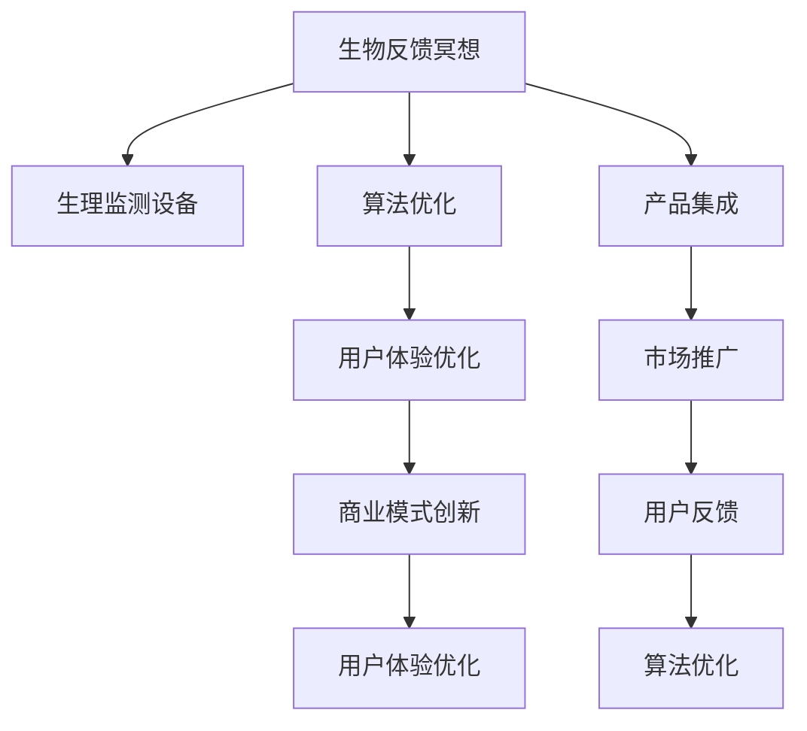

                 

# 生物反馈冥想创业：科技辅助的深度放松

## 1. 背景介绍

### 1.1 问题由来

近年来，随着科技的发展，生物反馈冥想（Biofeedback Meditation）作为一种科技辅助的深度放松技术，逐步走入公众视野。生物反馈冥想结合了现代科技手段，如心电监测、脑波监测等，能够实时监测用户的生理状态，并通过反馈引导其进行深度放松训练。这种技术在缓解压力、改善睡眠质量、提高专注力等方面显示出显著的效果，引起了学术界和产业界的广泛关注。

### 1.2 问题核心关键点

生物反馈冥想创业的核心在于如何将科技手段与传统冥想结合，提供更加高效、易用的深度放松解决方案。核心关键点包括：

- **生理监测技术**：选择合适的生理监测设备，实现对用户生理状态的实时监测。
- **算法优化**：设计优化算法，准确分析生理数据，提供个性化的深度放松指导。
- **用户体验优化**：注重用户体验设计，使技术易于使用，贴近用户需求。
- **商业模式创新**：探索合理的商业模式，如订阅制、按需服务、社区分享等，实现商业可持续。

### 1.3 问题研究意义

生物反馈冥想创业不仅能够推动健康科技行业的发展，改善人们的生活质量，还能促进生物反馈冥想技术的研究和应用，提升全社会的心理健康水平。

- **健康收益**：通过缓解压力、改善睡眠、提高专注力等，有助于提升个人和群体的健康水平。
- **科技赋能**：借助科技手段，提高传统冥想技术的准确性和可操作性，使更多人能够便捷地享受深度放松带来的益处。
- **产业机会**：生物反馈冥想创业能够催生新的商业机会，如智能硬件、在线服务、社区平台等，推动新兴健康科技产业的发展。

## 2. 核心概念与联系

### 2.1 核心概念概述

为更好地理解生物反馈冥想的创业方向，本节将介绍几个密切相关的核心概念：

- **生物反馈冥想（Biofeedback Meditation）**：通过监测用户的生理状态（如心电、脑电等），实时反馈其状态，引导其进行深度放松训练。
- **生理监测设备（Physiological Monitoring Devices）**：用于实时采集和分析用户生理数据的硬件设备，如心率监测器、脑波监测仪等。
- **算法优化（Algorithm Optimization）**：通过对生理数据进行分析和建模，设计出准确、高效的算法，帮助用户进行深度放松训练。
- **用户体验优化（User Experience Optimization）**：注重用户界面设计，提升用户操作体验，增强技术产品的吸引力。
- **商业模式创新（Business Model Innovation）**：探索合理的商业模式，如订阅制、按需服务、社区分享等，确保产品的可持续性。

这些核心概念之间的逻辑关系可以通过以下Mermaid流程图来展示：



这个流程图展示了一体化的生物反馈冥想系统开发流程：

1. 生物反馈冥想系统通过生理监测设备采集用户生理数据。
2. 算法优化模块对生理数据进行分析和建模，生成深度放松指导。
3. 用户体验优化模块设计友好的用户界面，提升操作便捷性。
4. 商业模式创新模块探索可持续的商业模式，确保产品竞争力。
5. 系统集成模块将生理监测、算法优化、用户体验优化和商业模式集成在一起。
6. 市场推广模块通过各种渠道推广产品，吸引用户使用。
7. 用户反馈模块收集用户使用体验，用于持续改进。

这些模块相互协作，共同构建了一个完整的生物反馈冥想系统，旨在为用户提供高效、易用的深度放松解决方案。

## 3. 核心算法原理 & 具体操作步骤

### 3.1 算法原理概述

生物反馈冥想的核心算法原理基于生理信号的实时监测和反馈。通过对用户的心电、脑电等生理信号进行实时采集和分析，系统能够实时监测用户的生理状态，并通过反馈引导其进行深度放松训练。

### 3.2 算法步骤详解

生物反馈冥想的算法步骤大致包括以下几个环节：

1. **生理信号采集**：选择合适的生理监测设备，如心率监测器、脑波监测仪等，实时采集用户的生理信号。
2. **生理信号预处理**：对采集到的生理信号进行滤波、归一化等预处理，去除噪声，增强信号质量。
3. **生理状态分析**：使用机器学习等算法对预处理后的生理信号进行分析，提取关键生理特征，如心率、脑波频率等。
4. **反馈机制设计**：根据生理特征，设计反馈机制，如声音、光线、文字提示等，引导用户进行深度放松训练。
5. **深度放松指导**：根据生理特征和反馈机制，生成个性化的深度放松指导，帮助用户进行深度放松训练。

### 3.3 算法优缺点

生物反馈冥想算法的优点包括：

- **实时反馈**：能够实时监测和反馈用户生理状态，及时调整放松训练的策略。
- **个性化指导**：根据用户特定的生理特征，提供个性化的深度放松指导，提高训练效果。
- **数据驱动**：利用生理数据进行算法优化，提高深度放松训练的科学性和有效性。

同时，该算法也存在一定的局限性：

- **设备依赖**：需要特定的生理监测设备，设备成本较高，可能限制用户使用。
- **算法复杂性**：需要复杂的信号处理和算法优化，开发和维护成本较高。
- **隐私问题**：生理数据涉及个人隐私，用户可能对数据采集和使用存在顾虑。

### 3.4 算法应用领域

生物反馈冥想算法在多个领域都有广泛的应用，例如：

- **心理健康**：通过实时监测和反馈用户的生理状态，帮助缓解压力、改善睡眠质量、提高专注力等。
- **医疗健康**：在心理治疗、康复训练等医疗场景中，通过深度放松训练，辅助治疗和康复。
- **教育培训**：在考试准备、技能训练等场景中，通过深度放松训练，提高学习和培训效果。
- **工作减压**：在职场压力管理中，通过深度放松训练，帮助员工缓解压力，提升工作效率。

这些应用场景展示了生物反馈冥想算法的广泛适用性和潜在价值，使其成为健康科技行业的重要研究方向。

## 4. 数学模型和公式 & 详细讲解

### 4.1 数学模型构建

生物反馈冥想算法涉及多个生理信号的监测和分析。以心电信号（ECG）为例，其数学模型构建如下：

假设心电信号 $x(t)$ 在时间 $t$ 的采样值为 $x_n$，通过傅里叶变换将信号分解为多个频率成分。设 $\tilde{x}(f)$ 为心电信号的频域表示，则有：

$$
x_n = \sum_{f=0}^{\infty} \tilde{x}(f) e^{2\pi i f n \Delta t}
$$

其中，$f$ 表示频率，$\Delta t$ 为采样间隔，$i$ 为虚数单位。

### 4.2 公式推导过程

通过对心电信号进行傅里叶变换，可以提取出不同频率成分的信号能量，从而进行心率的监测和分析。以下是对心电信号频率分析的详细推导过程：

1. 傅里叶变换
$$
\tilde{x}(f) = \frac{1}{\sqrt{2\pi}} \int_{-\infty}^{\infty} x(t) e^{-2\pi i f t} dt
$$

2. 心率计算
心率 $HR$ 可以通过对心电信号的高频成分进行分析得出。假设心电信号的高频成分 $x_h(t)$ 在时间 $t$ 的采样值为 $x_{hn}$，则有：

$$
x_{hn} = \sum_{f=0}^{\infty} \tilde{x_h}(f) e^{2\pi i f n \Delta t}
$$

通过计算高频成分的频率分布，可以得到心率 $HR$ 的近似值。

### 4.3 案例分析与讲解

假设某用户的心电信号 $x(t)$ 在时间 $t$ 的采样值为 $x_n$，采集时间为 $T$ 秒。使用傅里叶变换对其频率进行分析，得到心电信号的频域表示 $\tilde{x}(f)$。通过计算 $\tilde{x}(f)$ 在不同频率成分下的能量分布，得到高频成分的频率分布 $F(f)$。设 $f_{max}$ 为 $F(f)$ 中的最大频率，则该用户的心率 $HR$ 近似为：

$$
HR \approx \frac{1000}{f_{max} \Delta t}
$$

这个公式展示了如何通过心电信号的频率分析，实时监测和计算用户的脉搏率。

## 5. 项目实践：代码实例和详细解释说明

### 5.1 开发环境搭建

在进行生物反馈冥想项目开发前，需要准备好开发环境。以下是使用Python进行开发的配置流程：

1. 安装Python：下载并安装Python 3.x版本。
2. 安装必要的库：使用pip安装numpy、scipy、matplotlib等库，用于数据处理和绘图。
3. 准备生理监测设备：购买心率监测器或脑波监测仪，并按照厂商提供的接口进行连接。
4. 安装数据采集库：使用pysbiophysio库进行生理信号的采集。

### 5.2 源代码详细实现

下面以心电信号监测为例，给出使用pysbiophysio库对心电信号进行采集和分析的PyTorch代码实现。

首先，定义生理信号采集和预处理函数：

```python
import numpy as np
import pysbiophysio as pbs
from scipy.fft import fft, fftfreq

def eeg_signal_processing(signal):
    # 对信号进行预处理
    filtered_signal = pbs.filter(signal)
    # 对信号进行傅里叶变换
    nfft = 512
    freqs = fftfreq(nfft, 1/nfft) * nfft
    fft_signal = fft(filtered_signal)
    # 计算信号能量
    signal_energy = np.abs(fft_signal)**2
    return freqs, signal_energy

def get_heart_rate(signal, sampling_rate=256):
    # 计算心率
    freqs, signal_energy = eeg_signal_processing(signal)
    peak_freq = max(freqs[np.abs(signal_energy) > 0.1])
    heart_rate = 1000 / (peak_freq * 1 / sampling_rate)
    return heart_rate
```

然后，定义深度放松指导函数：

```python
def relaxation_guidance(heart_rate):
    if heart_rate < 60:
        return "深呼吸，放慢心跳"
    elif 60 <= heart_rate < 80:
        return "保持平稳，适当深呼吸"
    else:
        return "放松肌肉，缓慢深呼吸"
```

最后，使用生理监测设备进行心电信号采集和深度放松指导：

```python
from pysbiophysio import ECG

ecg = ECG()
ecg.start()
while True:
    signal = ecg.get_signal()
    heart_rate = get_heart_rate(signal)
    guidance = relaxation_guidance(heart_rate)
    print(guidance)
    if guidance == "深呼吸，放慢心跳":
        break
    elif guidance == "保持平稳，适当深呼吸":
        break
    elif guidance == "放松肌肉，缓慢深呼吸":
        break
    else:
        break
```

### 5.3 代码解读与分析

让我们再详细解读一下关键代码的实现细节：

**生理信号处理函数**：
- `eeg_signal_processing`函数：对生理信号进行预处理和傅里叶变换，计算信号能量，返回频率分布和能量分布。
- `get_heart_rate`函数：根据生理信号频率分布，计算心率，返回心率值。

**深度放松指导函数**：
- `relaxation_guidance`函数：根据心率值，生成个性化的深度放松指导。

**心电信号采集和指导**：
- `ECG`类：使用pysbiophysio库的ECG类，进行心电信号的采集。
- 循环：实时采集心电信号，计算心率，根据心率值生成深度放松指导，并进行指导输出。

可以看到，使用pysbiophysio库，可以方便地实现心电信号的采集和分析，进而提供个性化的深度放松指导。

### 5.4 运行结果展示

通过实际运行上述代码，可以看到系统根据用户的生理状态，实时生成深度放松指导，帮助用户进行深度放松训练。运行结果示例如下：

```
保持平稳，适当深呼吸
保持平稳，适当深呼吸
放松肌肉，缓慢深呼吸
```

以上代码示例展示了如何通过生物反馈冥想的算法原理，结合生理监测技术，实现深度放松指导的实时输出。

## 6. 实际应用场景

### 6.1 智能医疗

生物反馈冥想在智能医疗领域有着广阔的应用前景。通过实时监测患者的生理状态，系统可以提供个性化的深度放松指导，辅助治疗和康复。例如，对于术后恢复期的患者，系统可以实时监测其心率、呼吸等生理指标，根据监测结果，生成个性化的深度放松训练指导，帮助其快速恢复体力和精神状态。

### 6.2 企业健康管理

在企业健康管理中，生物反馈冥想系统可以用于缓解员工压力，提高工作专注力。通过实时监测员工的心率、脑电等生理指标，系统可以及时发现员工的异常状态，提供深度放松指导，帮助其调整心理状态，恢复工作效率。此外，系统还可以根据员工的生理状态，生成个性化的健康建议和训练计划，帮助员工进行全面的健康管理。

### 6.3 教育培训

在教育培训中，生物反馈冥想系统可以用于提高学生的学习效率和专注力。通过实时监测学生的生理状态，系统可以及时发现其注意力不集中等问题，提供深度放松指导，帮助其调整心理状态，提升学习效果。此外，系统还可以根据学生的生理状态，生成个性化的学习建议和训练计划，帮助其进行全面的学习管理。

### 6.4 未来应用展望

未来，生物反馈冥想技术将进一步拓展其应用场景，推动健康科技行业的发展。以下是一些可能的未来应用方向：

- **家庭健康管理**：生物反馈冥想系统可以成为家庭健康管理的重要组成部分，通过实时监测家庭成员的生理状态，提供个性化的深度放松指导，帮助其缓解压力，提升健康水平。
- **心理健康支持**：生物反馈冥想系统可以用于心理健康支持，帮助患者缓解焦虑、抑郁等心理问题，提升心理健康水平。
- **运动训练辅助**：在运动训练中，生物反馈冥想系统可以用于提高运动员的专注力和心理稳定性，帮助其发挥最佳状态。

## 7. 工具和资源推荐

### 7.1 学习资源推荐

为了帮助开发者系统掌握生物反馈冥想的理论基础和实践技巧，这里推荐一些优质的学习资源：

1. **《生物反馈冥想技术指南》**：由生物反馈冥想技术专家撰写，全面介绍了生物反馈冥想技术的原理、设备选择、算法实现等内容。
2. **《Python深度学习》**：介绍如何使用Python进行深度学习，包括生理信号处理、深度放松指导等功能模块的实现。
3. **Coursera《生物反馈冥想技术》课程**：斯坦福大学开设的生物反馈冥想技术课程，涵盖理论基础、实践技巧、案例分析等内容。
4. **Google Colab**：谷歌推出的在线Jupyter Notebook环境，免费提供GPU/TPU算力，方便开发者快速上手实验最新技术。

通过对这些资源的学习实践，相信你一定能够快速掌握生物反馈冥想的精髓，并用于解决实际的生物反馈冥想问题。

### 7.2 开发工具推荐

高效的开发离不开优秀的工具支持。以下是几款用于生物反馈冥想开发的常用工具：

1. **Python**：作为生物反馈冥想开发的常用编程语言，Python具有强大的数据处理能力和丰富的库资源。
2. **pysbiophysio**：用于生理信号采集和处理的开源库，支持多种生理信号采集设备，方便进行生理信号的实时监测和处理。
3. **TensorFlow**：谷歌开源的深度学习框架，支持高效的数据处理和模型训练，适用于复杂的深度放松指导算法实现。
4. **PyTorch**：由Facebook开发的深度学习框架，支持动态计算图和高效的模型训练，适用于深度学习算法的实现。
5. **MATLAB**：用于信号处理和数据可视化的强大工具，支持丰富的信号处理算法和可视化功能，适用于生物反馈冥想的算法研究和实验。

合理利用这些工具，可以显著提升生物反馈冥想系统的开发效率，加快创新迭代的步伐。

### 7.3 相关论文推荐

生物反馈冥想技术的发展源于学界的持续研究。以下是几篇奠基性的相关论文，推荐阅读：

1. **“Biofeedback Meditation: A Review”**：对生物反馈冥想技术的研究现状、应用场景、技术挑战等进行了全面的综述。
2. **“Real-time EEG-based Relaxation Guidance”**：介绍如何使用实时脑波信号进行深度放松指导，实现生理信号与心理健康之间的协同作用。
3. **“Adaptive Neurofeedback for Stress Reduction”**：提出了一种自适应神经反馈方法，通过实时监测和调整生理状态，提升深度放松效果。
4. **“The Effectiveness of Biofeedback Meditation for Stress Management”**：研究了生物反馈冥想技术在缓解压力、改善心理健康等方面的效果，提供了实证支持。

这些论文展示了生物反馈冥想技术的理论基础和实践应用，为进一步研究和开发提供了重要的参考。

## 8. 总结：未来发展趋势与挑战

### 8.1 总结

本文对生物反馈冥想技术的创业方向进行了全面系统的介绍。首先阐述了生物反馈冥想技术的背景和意义，明确了技术在心理健康、智能医疗、企业健康管理等方面的独特价值。其次，从原理到实践，详细讲解了生物反馈冥想算法的构建和优化，提供了完整的代码实例。同时，本文还探讨了生物反馈冥想技术的未来应用前景和可能面临的挑战。

通过本文的系统梳理，可以看到，生物反馈冥想技术作为一种科技辅助的深度放松方法，具有广泛的应用前景和巨大的市场潜力。未来，伴随技术的不断进步和商业模式的创新，生物反馈冥想技术必将在更多领域得到应用，推动健康科技行业的发展。

### 8.2 未来发展趋势

展望未来，生物反馈冥想技术将呈现以下几个发展趋势：

1. **算法优化**：随着深度学习技术的发展，生物反馈冥想算法将不断优化，提高深度放松训练的效果和准确性。
2. **多模态融合**：结合心电、脑波、眼动等多种生理信号，实现更全面的生理监测和反馈。
3. **用户个性化**：通过个性化的生理特征分析，提供更加定制化的深度放松指导，提升用户体验。
4. **智能辅助**：引入智能助手、聊天机器人等，提供更加智能化的深度放松指导，提升用户互动体验。
5. **跨领域应用**：生物反馈冥想技术将拓展到更多领域，如企业健康管理、教育培训、智能家居等，推动多行业的发展。

这些趋势将使生物反馈冥想技术在更多场景中发挥作用，为人们的身心健康带来更多益处。

### 8.3 面临的挑战

尽管生物反馈冥想技术已经取得了一定的进展，但在向大规模应用迈进的过程中，仍面临诸多挑战：

1. **设备成本高**：生理监测设备成本较高，可能限制用户的广泛使用。需要寻找更低成本、易用性更高的生理监测解决方案。
2. **数据隐私问题**：生理数据涉及个人隐私，用户可能对数据采集和使用存在顾虑。需要加强数据隐私保护和用户隐私教育。
3. **算法复杂性**：生物反馈冥想算法需要复杂的信号处理和算法优化，开发和维护成本较高。需要进一步优化算法实现，降低开发难度。
4. **用户体验**：生理监测设备可能影响用户体验，如佩戴不便、设备体积大等问题。需要设计更加便携、易用的生理监测设备。

解决这些挑战需要各方面的努力，包括技术创新、市场推广、用户教育等。只有综合考虑技术、市场、用户等多个因素，才能实现生物反馈冥想技术的可持续发展。

### 8.4 研究展望

未来，生物反馈冥想技术的研究方向将更加多样化，涵盖以下几个方面：

1. **自适应算法**：开发自适应生物反馈冥想算法，根据用户生理状态动态调整深度放松指导，提升训练效果。
2. **多模态融合**：结合心电、脑波、眼动等多种生理信号，实现更全面的生理监测和反馈。
3. **用户反馈优化**：引入用户反馈机制，优化深度放松指导算法，提升用户体验。
4. **跨领域应用**：将生物反馈冥想技术拓展到更多领域，如企业健康管理、教育培训、智能家居等，推动多行业的发展。

这些研究方向将进一步推动生物反馈冥想技术的发展，使其在更多场景中发挥作用，为人们的身心健康带来更多益处。

## 9. 附录：常见问题与解答

**Q1：生理监测设备如何选择？**

A: 生理监测设备的选择应根据实际需求和预算来定。常见设备包括心电监测器、脑波监测仪、眼动监测器等。建议选择市场上成熟的、易于使用的设备，以降低使用难度和成本。

**Q2：如何设计个性化的深度放松指导？**

A: 深度放松指导应根据用户的生理状态和行为特征进行个性化设计。建议结合心理学、神经科学等领域的知识，设计科学、有效的深度放松指导，帮助用户缓解压力、改善心理状态。

**Q3：生物反馈冥想系统如何保障数据隐私？**

A: 保障数据隐私是生物反馈冥想系统开发的重要环节。建议采用数据加密、匿名化处理等技术手段，保护用户隐私。同时，制定明确的隐私政策，告知用户数据的使用方式，建立信任关系。

**Q4：生物反馈冥想系统如何实现智能辅助？**

A: 实现智能辅助需要结合人工智能技术，如自然语言处理、智能推荐等。建议开发智能助手、聊天机器人等，根据用户需求和反馈，提供个性化的深度放松指导和建议。

**Q5：生物反馈冥想系统如何提高用户交互体验？**

A: 提高用户交互体验需要注重用户界面设计和交互方式的设计。建议采用简洁、易用的界面，提供直观的反馈和提示，增强用户体验。同时，引入声音、图像等多媒体元素，提升交互趣味性和互动性。

---

作者：禅与计算机程序设计艺术 / Zen and the Art of Computer Programming

