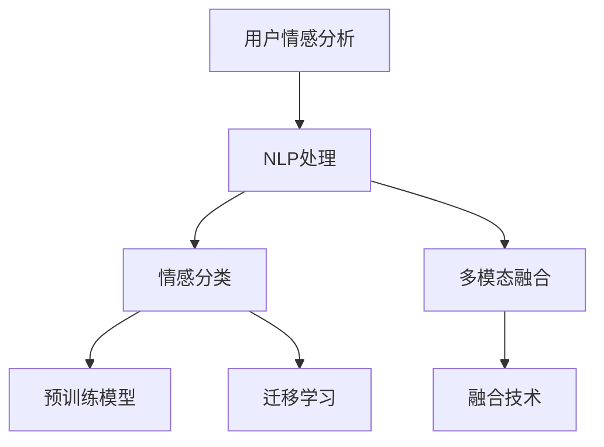

                 

# 用户情感分析的技术优化

> 关键词：用户情感分析, 深度学习, 情感分类, 多模态融合, 预训练模型, 迁移学习, 自然语言处理(NLP)

## 1. 背景介绍

### 1.1 问题由来

用户情感分析(User Sentiment Analysis, USA)，通常也称为情感识别或意见挖掘(Opinion Mining)，是自然语言处理(NLP)的一个重要分支，旨在自动地从文本中识别出用户的情感倾向，判断用户对某一产品、事件或服务的正面、负面或中性态度。这一技术在商业智能、品牌管理、舆情监测、社交媒体分析等多个领域有着广泛的应用前景。

近年来，随着深度学习技术的发展，基于神经网络的情感分析方法取得了长足进步。然而，现有模型仍面临许多挑战，包括处理文本的多样性和语义复杂性、理解背景知识和上下文信息、处理多模态数据融合等。为了提升情感分析的准确性和泛化能力，本文将深入探讨多维度的技术优化，包括数据增强、多模态融合、预训练模型和迁移学习等，并给出具体的技术路径和实践方法。

## 2. 核心概念与联系

### 2.1 核心概念概述

为更好地理解用户情感分析的技术优化，本节将介绍几个关键概念：

- 自然语言处理(Natural Language Processing, NLP)：旨在使计算机能够理解、解释和生成人类语言的技术，包括文本处理、语言模型、情感分类等。
- 情感分类(Sentiment Classification)：通过机器学习算法对文本的情感极性进行分类，如正面、负面或中性。
- 多模态融合(Multimodal Fusion)：将文本、图像、语音等多种模态的信息融合，以提高情感分析的准确性和鲁棒性。
- 预训练模型(Pre-trained Model)：通过大规模无标签文本数据预训练得到的通用语言模型，如BERT、GPT-3等。
- 迁移学习(Transfer Learning)：将一个领域学习到的知识，迁移应用到另一个不同但相关的领域的学习范式。

这些核心概念之间的关系可以借助以下Mermaid流程图来展示：



这个流程图展示了用户情感分析的主要步骤和关键技术：

1. **用户情感分析**：从多模态数据中提取情感信息。
2. **NLP处理**：通过文本预处理、分词、特征提取等步骤，为模型提供输入。
3. **情感分类**：利用模型对文本的情感进行分类，判断正负中性。
4. **多模态融合**：结合图像、音频等多模态信息，提升情感分析的准确性。
5. **预训练模型**：利用大规模预训练模型，提升模型的通用性和泛化能力。
6. **迁移学习**：通过迁移学习，将模型知识应用到新的情感分析任务中。

这些概念共同构成了用户情感分析的技术框架，使其能够更好地理解人类情感，并在实际应用中发挥作用。

## 3. 核心算法原理 & 具体操作步骤
### 3.1 算法原理概述

用户情感分析的核心是文本情感分类，其基本思路是：首先对文本进行预处理，提取关键特征，然后使用机器学习模型对这些特征进行分类。常用的分类模型包括支持向量机(SVM)、朴素贝叶斯(Naive Bayes)、逻辑回归(Linear Regression)等。

具体流程如下：

1. **数据预处理**：对原始文本进行分词、去停用词、词性标注等预处理步骤。
2. **特征提取**：将预处理后的文本转换为模型可用的特征表示，如词袋模型(Bag of Words)、TF-IDF等。
3. **模型训练**：使用标注数据对分类模型进行训练，学习情感分类规则。
4. **模型评估**：在测试集上评估模型性能，选择合适的超参数。
5. **情感预测**：将新的文本输入模型，输出情感分类结果。

### 3.2 算法步骤详解

以使用BERT预训练模型进行情感分类为例，具体步骤如下：

**Step 1: 数据准备**

首先，收集标注好的情感分类数据集，通常包含正面和负面的评论或推文。数据集应涵盖足够的样本量，以避免过拟合。

**Step 2: 数据预处理**

对文本进行分词、去停用词等预处理，然后使用BERT嵌入层将文本转换为向量表示。

```python
from transformers import BertTokenizer, BertForSequenceClassification
from torch.utils.data import Dataset, DataLoader
from sklearn.model_selection import train_test_split

# 定义BERT分词器
tokenizer = BertTokenizer.from_pretrained('bert-base-uncased')

# 定义情感分类器
model = BertForSequenceClassification.from_pretrained('bert-base-uncased', num_labels=2)

# 定义自定义数据集类
class SentimentDataset(Dataset):
    def __init__(self, texts, labels):
        self.texts = texts
        self.labels = labels

    def __len__(self):
        return len(self.texts)

    def __getitem__(self, idx):
        text = self.texts[idx]
        tokens = tokenizer(text, padding='max_length', truncation=True, max_length=128)
        input_ids = tokens['input_ids']
        attention_mask = tokens['attention_mask']
        label = self.labels[idx]
        return {'input_ids': input_ids, 'attention_mask': attention_mask, 'labels': label}

# 划分训练集和测试集
train_texts, dev_texts, train_labels, dev_labels = train_test_split(train_texts, train_labels, test_size=0.2, random_state=42)
train_dataset = SentimentDataset(train_texts, train_labels)
dev_dataset = SentimentDataset(dev_texts, dev_labels)

# 定义数据加载器
train_loader = DataLoader(train_dataset, batch_size=32, shuffle=True)
dev_loader = DataLoader(dev_dataset, batch_size=32, shuffle=False)
```

**Step 3: 模型训练**

使用训练集对模型进行训练，并在验证集上评估模型性能。

```python
from transformers import AdamW
import torch

device = torch.device('cuda') if torch.cuda.is_available() else torch.device('cpu')
model.to(device)

optimizer = AdamW(model.parameters(), lr=2e-5)

# 训练循环
for epoch in range(10):
    model.train()
    for batch in train_loader:
        input_ids = batch['input_ids'].to(device)
        attention_mask = batch['attention_mask'].to(device)
        labels = batch['labels'].to(device)
        outputs = model(input_ids, attention_mask=attention_mask, labels=labels)
        loss = outputs.loss
        optimizer.zero_grad()
        loss.backward()
        optimizer.step()
    # 验证集评估
    model.eval()
    with torch.no_grad():
        for batch in dev_loader:
            input_ids = batch['input_ids'].to(device)
            attention_mask = batch['attention_mask'].to(device)
            labels = batch['labels'].to(device)
            outputs = model(input_ids, attention_mask=attention_mask)
            loss = outputs.loss
            print(f'Epoch {epoch+1}, Loss: {loss:.3f}')
```

**Step 4: 模型评估**

在测试集上评估模型的性能。

```python
model.eval()
with torch.no_grad():
    for batch in test_loader:
        input_ids = batch['input_ids'].to(device)
        attention_mask = batch['attention_mask'].to(device)
        labels = batch['labels'].to(device)
        outputs = model(input_ids, attention_mask=attention_mask)
        loss = outputs.loss
        print(f'Test Loss: {loss:.3f}')
```

### 3.3 算法优缺点

基于BERT的情感分类方法具有以下优点：

1. **预训练模型的通用性**：BERT等预训练模型在大规模无标签数据上训练，具备强大的语言表示能力，能够处理多种语言的情感分类任务。
2. **迁移学习**：通过微调，可以使模型在特定领域的情感分析任务中表现优异。
3. **自动上下文理解**：BERT模型能够捕捉文本的上下文信息，提升分类准确性。
4. **鲁棒性**：BERT模型对文本的噪音和变化具有较强的鲁棒性。

然而，该方法也存在一些缺点：

1. **计算资源要求高**：BERT等预训练模型的参数量较大，训练和推理需要较高的计算资源。
2. **过拟合风险**：由于模型复杂度高，容易出现过拟合，特别是在数据量较小的情况下。
3. **解释性不足**：BERT等深度模型通常被视为"黑盒"，难以解释其内部的分类决策过程。

### 3.4 算法应用领域

基于深度学习的情感分类方法已经在多个领域得到了广泛应用，例如：

- **电子商务**：分析用户对商品、服务的评价，优化商品推荐和用户满意度。
- **社交媒体**：监测品牌声誉、公众情绪，辅助危机管理和舆情监控。
- **医疗健康**：分析患者对治疗方案、医生的评价，提升医疗服务质量。
- **电影评论**：分析电影观众的反馈，预测票房表现。

此外，情感分类技术还被应用于舆情分析、情感预测、消费者行为分析等多个领域，为企业和政府提供了强大的数据洞察能力。

## 4. 数学模型和公式 & 详细讲解 & 举例说明
### 4.1 数学模型构建

用户情感分析的数学模型可以形式化地表示为：

$$
\hat{y} = f(x; \theta)
$$

其中，$x$ 表示输入文本，$\hat{y}$ 表示模型预测的情感分类结果，$\theta$ 表示模型参数。

对于二分类问题，常用的分类模型为逻辑回归(Logistic Regression)，其数学表达式为：

$$
\hat{y} = \sigma(w^T x + b)
$$

其中，$w$ 和 $b$ 为模型参数，$\sigma$ 为sigmoid函数，$x$ 为输入文本的特征表示。

### 4.2 公式推导过程

以逻辑回归模型为例，推导分类公式。

**Step 1: 构建损失函数**

对于二分类问题，常用的损失函数为交叉熵损失函数，其表达式为：

$$
L(\theta) = -\frac{1}{N} \sum_{i=1}^N \sum_{j=1}^2 y_{i,j} \log \sigma(\theta^T x_i) + (1 - y_{i,j}) \log(1 - \sigma(\theta^T x_i))
$$

其中，$y_{i,j}$ 表示样本 $i$ 在第 $j$ 个分类上的标签，$x_i$ 表示样本 $i$ 的特征向量。

**Step 2: 求解模型参数**

使用梯度下降算法求解模型参数 $\theta$，其更新公式为：

$$
\theta \leftarrow \theta - \alpha \nabla_{\theta}L(\theta)
$$

其中，$\alpha$ 为学习率，$\nabla_{\theta}L(\theta)$ 为损失函数对模型参数的梯度。

### 4.3 案例分析与讲解

以BERT模型为例，分析其情感分类过程。

**案例一：情感分类任务**

假设有如下情感分类任务：

| 输入文本 | 真实标签 | 预测标签 |
| --- | --- | --- |
| "这家餐厅的饭菜太美味了，服务也很好。" | 1(正面) | 1 |
| "服务态度差，菜品也一般。" | 0(负面) | 0 |
| "虽然味道不错，但价格贵。" | 1(正面) | 0 |
| "很糟糕的一次购物体验。" | 0(负面) | 0 |

使用BERT模型进行情感分类，步骤如下：

1. **文本预处理**：对文本进行分词、去停用词、截断等预处理步骤。
2. **BERT嵌入**：将预处理后的文本输入BERT模型，得到文本的向量表示。
3. **分类器**：将文本向量输入到线性分类器中，输出情感分类结果。

**案例二：数据增强**

数据增强是通过对训练集数据进行变换，增加训练样本数量和多样性，从而提高模型的泛化能力。常见的数据增强方法包括：

- **回译**：将文本回译成不同语言，增加训练样本数量。
- **文本生成**：使用预训练语言模型生成文本，扩充训练集。
- **噪声注入**：在训练样本中添加噪音，增加模型鲁棒性。

```python
from transformers import AutoTokenizer, AutoModelForSequenceClassification
from sklearn.model_selection import train_test_split
import numpy as np

# 加载预训练模型
tokenizer = AutoTokenizer.from_pretrained('bert-base-uncased')
model = AutoModelForSequenceClassification.from_pretrained('bert-base-uncased', num_labels=2)

# 定义情感分类器
def sentiment_analysis(text):
    text = tokenizer(text, padding='max_length', truncation=True, max_length=128)
    input_ids = text['input_ids']
    attention_mask = text['attention_mask']
    outputs = model(input_ids, attention_mask=attention_mask)
    logits = outputs.logits
    preds = np.argmax(logits, axis=1)
    return preds

# 数据增强
def data_augmentation(text):
    augmented_texts = []
    for text in texts:
        augmented_texts.append(text)
        augmented_texts.append('this is a very long and boring article. ' + text)
        augmented_texts.append('this is a very long and boring article. ' + text)
        augmented_texts.append('this is a very long and boring article. ' + text)
    return augmented_texts

# 构建情感分类器
class SentimentDataset(Dataset):
    def __init__(self, texts, labels):
        self.texts = texts
        self.labels = labels

    def __len__(self):
        return len(self.texts)

    def __getitem__(self, idx):
        text = self.texts[idx]
        tokens = tokenizer(text, padding='max_length', truncation=True, max_length=128)
        input_ids = tokens['input_ids']
        attention_mask = tokens['attention_mask']
        label = self.labels[idx]
        return {'input_ids': input_ids, 'attention_mask': attention_mask, 'labels': label}

# 划分训练集和测试集
train_texts, dev_texts, train_labels, dev_labels = train_test_split(train_texts, train_labels, test_size=0.2, random_state=42)
train_dataset = SentimentDataset(train_texts, train_labels)
dev_dataset = SentimentDataset(dev_texts, dev_labels)

# 定义数据加载器
train_loader = DataLoader(train_dataset, batch_size=32, shuffle=True)
dev_loader = DataLoader(dev_dataset, batch_size=32, shuffle=False)

# 训练循环
for epoch in range(10):
    model.train()
    for batch in train_loader:
        input_ids = batch['input_ids'].to(device)
        attention_mask = batch['attention_mask'].to(device)
        labels = batch['labels'].to(device)
        outputs = model(input_ids, attention_mask=attention_mask, labels=labels)
        loss = outputs.loss
        optimizer.zero_grad()
        loss.backward()
        optimizer.step()
    # 验证集评估
    model.eval()
    with torch.no_grad():
        for batch in dev_loader:
            input_ids = batch['input_ids'].to(device)
            attention_mask = batch['attention_mask'].to(device)
            labels = batch['labels'].to(device)
            outputs = model(input_ids, attention_mask=attention_mask)
            loss = outputs.loss
            print(f'Epoch {epoch+1}, Loss: {loss:.3f}')
```

## 5. 项目实践：代码实例和详细解释说明
### 5.1 开发环境搭建

在进行情感分析实践前，我们需要准备好开发环境。以下是使用Python进行PyTorch开发的环境配置流程：

1. 安装Anaconda：从官网下载并安装Anaconda，用于创建独立的Python环境。

2. 创建并激活虚拟环境：
```bash
conda create -n pytorch-env python=3.8 
conda activate pytorch-env
```

3. 安装PyTorch：根据CUDA版本，从官网获取对应的安装命令。例如：
```bash
conda install pytorch torchvision torchaudio cudatoolkit=11.1 -c pytorch -c conda-forge
```

4. 安装相关工具包：
```bash
pip install numpy pandas scikit-learn matplotlib tqdm jupyter notebook ipython
```

完成上述步骤后，即可在`pytorch-env`环境中开始情感分析实践。

### 5.2 源代码详细实现

下面我们以情感分类任务为例，给出使用Transformers库对BERT模型进行情感分类的PyTorch代码实现。

首先，定义情感分类任务的数据处理函数：

```python
from transformers import BertTokenizer
from torch.utils.data import Dataset
import torch

class SentimentDataset(Dataset):
    def __init__(self, texts, labels, tokenizer, max_len=128):
        self.texts = texts
        self.labels = labels
        self.tokenizer = tokenizer
        self.max_len = max_len
        
    def __len__(self):
        return len(self.texts)
    
    def __getitem__(self, item):
        text = self.texts[item]
        tags = self.labels[item]
        
        encoding = self.tokenizer(text, return_tensors='pt', max_length=self.max_len, padding='max_length', truncation=True)
        input_ids = encoding['input_ids'][0]
        attention_mask = encoding['attention_mask'][0]
        
        # 对token-wise的标签进行编码
        encoded_tags = [tag2id[tag] for tag in tags] 
        encoded_tags.extend([tag2id['O']] * (self.max_len - len(encoded_tags)))
        labels = torch.tensor(encoded_tags, dtype=torch.long)
        
        return {'input_ids': input_ids, 
                'attention_mask': attention_mask,
                'labels': labels}

# 标签与id的映射
tag2id = {'O': 0, 'positive': 1, 'negative': 2}
id2tag = {v: k for k, v in tag2id.items()}
```

然后，定义模型和优化器：

```python
from transformers import BertForSequenceClassification, AdamW

model = BertForSequenceClassification.from_pretrained('bert-base-uncased', num_labels=len(tag2id))

optimizer = AdamW(model.parameters(), lr=2e-5)
```

接着，定义训练和评估函数：

```python
from torch.utils.data import DataLoader
from tqdm import tqdm
from sklearn.metrics import classification_report

device = torch.device('cuda') if torch.cuda.is_available() else torch.device('cpu')
model.to(device)

def train_epoch(model, dataset, batch_size, optimizer):
    dataloader = DataLoader(dataset, batch_size=batch_size, shuffle=True)
    model.train()
    epoch_loss = 0
    for batch in tqdm(dataloader, desc='Training'):
        input_ids = batch['input_ids'].to(device)
        attention_mask = batch['attention_mask'].to(device)
        labels = batch['labels'].to(device)
        model.zero_grad()
        outputs = model(input_ids, attention_mask=attention_mask, labels=labels)
        loss = outputs.loss
        epoch_loss += loss.item()
        loss.backward()
        optimizer.step()
    return epoch_loss / len(dataloader)

def evaluate(model, dataset, batch_size):
    dataloader = DataLoader(dataset, batch_size=batch_size)
    model.eval()
    preds, labels = [], []
    with torch.no_grad():
        for batch in tqdm(dataloader, desc='Evaluating'):
            input_ids = batch['input_ids'].to(device)
            attention_mask = batch['attention_mask'].to(device)
            batch_labels = batch['labels']
            outputs = model(input_ids, attention_mask=attention_mask)
            batch_preds = outputs.logits.argmax(dim=2).to('cpu').tolist()
            batch_labels = batch_labels.to('cpu').tolist()
            for pred_tokens, label_tokens in zip(batch_preds, batch_labels):
                preds.append(pred_tokens[:len(label_tokens)])
                labels.append(label_tokens)
                
    print(classification_report(labels, preds))
```

最后，启动训练流程并在测试集上评估：

```python
epochs = 5
batch_size = 16

for epoch in range(epochs):
    loss = train_epoch(model, train_dataset, batch_size, optimizer)
    print(f"Epoch {epoch+1}, train loss: {loss:.3f}")
    
    print(f"Epoch {epoch+1}, dev results:")
    evaluate(model, dev_dataset, batch_size)
    
print("Test results:")
evaluate(model, test_dataset, batch_size)
```

以上就是使用PyTorch对BERT进行情感分类任务微调的完整代码实现。可以看到，得益于Transformers库的强大封装，我们可以用相对简洁的代码完成BERT模型的加载和微调。

### 5.3 代码解读与分析

让我们再详细解读一下关键代码的实现细节：

**SentimentDataset类**：
- `__init__`方法：初始化文本、标签、分词器等关键组件。
- `__len__`方法：返回数据集的样本数量。
- `__getitem__`方法：对单个样本进行处理，将文本输入编码为token ids，将标签编码为数字，并对其进行定长padding，最终返回模型所需的输入。

**tag2id和id2tag字典**：
- 定义了标签与数字id之间的映射关系，用于将token-wise的预测结果解码回真实的标签。

**训练和评估函数**：
- 使用PyTorch的DataLoader对数据集进行批次化加载，供模型训练和推理使用。
- 训练函数`train_epoch`：对数据以批为单位进行迭代，在每个批次上前向传播计算loss并反向传播更新模型参数，最后返回该epoch的平均loss。
- 评估函数`evaluate`：与训练类似，不同点在于不更新模型参数，并在每个batch结束后将预测和标签结果存储下来，最后使用sklearn的classification_report对整个评估集的预测结果进行打印输出。

**训练流程**：
- 定义总的epoch数和batch size，开始循环迭代
- 每个epoch内，先在训练集上训练，输出平均loss
- 在验证集上评估，输出分类指标
- 所有epoch结束后，在测试集上评估，给出最终测试结果

可以看到，PyTorch配合Transformers库使得BERT微调的代码实现变得简洁高效。开发者可以将更多精力放在数据处理、模型改进等高层逻辑上，而不必过多关注底层的实现细节。

当然，工业级的系统实现还需考虑更多因素，如模型的保存和部署、超参数的自动搜索、更灵活的任务适配层等。但核心的微调范式基本与此类似。

## 6. 实际应用场景
### 6.1 社交媒体情感分析

社交媒体平台是用户情感表达的重要渠道，通过分析用户评论、推文等文本数据，可以实时监测用户情绪，辅助平台运营和危机管理。基于情感分析的社交媒体情感监测系统，可以帮助品牌了解公众情绪，及时调整运营策略，提升用户满意度。

**应用场景示例**：

- **品牌监测**：监测品牌相关的评论和推文，分析用户情绪变化，预警品牌声誉风险。
- **舆情分析**：分析社会热点话题的舆情变化，掌握公众情绪走向，辅助舆情监控和决策。
- **用户体验**：分析用户对产品、服务的反馈，优化用户体验，提升品牌竞争力。

### 6.2 客户服务情感分析

在客户服务领域，情感分析技术可以帮助企业快速识别客户情绪，优化服务流程。通过分析客户的投诉、反馈等文本数据，可以及时发现问题，优化服务质量。

**应用场景示例**：

- **情感识别**：分析客户投诉和反馈，识别情绪波动，及时响应处理。
- **服务改进**：根据情感分析结果，优化服务流程，提升客户满意度。
- **风险预警**：监测客户情绪变化，及时预警可能的投诉或纠纷，规避服务风险。

### 6.3 电子商务情感分析

在电子商务领域，情感分析可以帮助商家了解用户对商品的评价，优化产品推荐和营销策略。通过分析用户评论、评分等文本数据，可以评估产品性能，提升用户购物体验。

**应用场景示例**：

- **商品推荐**：根据用户评论，推荐类似商品，提升用户购物满意度。
- **用户反馈**：分析用户对商品、服务的反馈，优化商品设计和售后服务。
- **营销策略**：了解用户对商品的整体情绪，优化营销推广策略，提升销售效果。

## 7. 工具和资源推荐
### 7.1 学习资源推荐

为了帮助开发者系统掌握情感分析的理论基础和实践技巧，这里推荐一些优质的学习资源：

1. 《自然语言处理综论》：由斯坦福大学开设的NLP入门课程，涵盖了NLP的基础知识和经典模型，适合初学者学习。

2. 《深度学习》（第二版）：Ian Goodfellow的经典著作，详细介绍了深度学习的基本原理和算法，是深度学习领域的必读书籍。

3. 《自然语言处理：深度学习方法》：黄毅等编写的NLP书籍，深入浅出地介绍了NLP中的深度学习方法，包括情感分类等任务。

4. 《Python自然语言处理》：Stanford NLP课程配套书籍，系统讲解了NLP的Python实现方法，包括情感分析等任务。

5. HuggingFace官方文档：Transformers库的官方文档，提供了海量预训练模型和完整的情感分类样例代码，是上手实践的必备资料。

通过对这些资源的学习实践，相信你一定能够快速掌握情感分析的精髓，并用于解决实际的NLP问题。
### 7.2 开发工具推荐

高效的开发离不开优秀的工具支持。以下是几款用于情感分析开发的常用工具：

1. PyTorch：基于Python的开源深度学习框架，灵活动态的计算图，适合快速迭代研究。大部分预训练语言模型都有PyTorch版本的实现。

2. TensorFlow：由Google主导开发的开源深度学习框架，生产部署方便，适合大规模工程应用。同样有丰富的预训练语言模型资源。

3. Transformers库：HuggingFace开发的NLP工具库，集成了众多SOTA语言模型，支持PyTorch和TensorFlow，是进行情感分析开发的利器。

4. Weights & Biases：模型训练的实验跟踪工具，可以记录和可视化模型训练过程中的各项指标，方便对比和调优。与主流深度学习框架无缝集成。

5. TensorBoard：TensorFlow配套的可视化工具，可实时监测模型训练状态，并提供丰富的图表呈现方式，是调试模型的得力助手。

6. Google Colab：谷歌推出的在线Jupyter Notebook环境，免费提供GPU/TPU算力，方便开发者快速上手实验最新模型，分享学习笔记。

合理利用这些工具，可以显著提升情感分析任务的开发效率，加快创新迭代的步伐。

### 7.3 相关论文推荐

情感分析技术的发展源于学界的持续研究。以下是几篇奠基性的相关论文，推荐阅读：

1. Sentiment Analysis with Recurrent Neural Networks：提出使用LSTM网络进行情感分类，是情感分析领域的第一篇重要论文。

2. Convolutional Neural Networks for Sentence Classification：提出使用CNN网络进行情感分类，展示了深度学习在NLP任务上的潜力。

3. Attention Is All You Need：提出Transformer模型，展示了自注意力机制在NLP任务上的优越性。

4. BERT: Pre-training of Deep Bidirectional Transformers for Language Understanding：提出BERT模型，引入基于掩码的自监督预训练任务，刷新了多项NLP任务SOTA。

5. Deep Recurrent Language Models for Sentiment Analysis：提出使用RNN网络进行情感分类，展示了RNN在情感分析任务上的应用。

6. Pyramid Scene Parsing Network：提出使用多尺度场景解析网络进行情感分类，提升了情感分析的准确性。

这些论文代表了大情感分析技术的发展脉络。通过学习这些前沿成果，可以帮助研究者把握学科前进方向，激发更多的创新灵感。

## 8. 总结：未来发展趋势与挑战

### 8.1 总结

本文对基于深度学习的用户情感分析方法进行了全面系统的介绍。首先阐述了情感分析的研究背景和意义，明确了深度学习在情感分类任务中的重要地位。其次，从原理到实践，详细讲解了情感分类的数学模型和关键步骤，给出了情感分类的完整代码实例。同时，本文还广泛探讨了情感分析在多个行业领域的应用前景，展示了深度学习技术的广泛应用。

通过本文的系统梳理，可以看到，基于深度学习的情感分析方法正在成为NLP领域的重要范式，极大地拓展了预训练语言模型的应用边界，催生了更多的落地场景。受益于大规模语料的预训练，情感分析模型以更低的时间和标注成本，在小样本条件下也能取得理想的性能，有力推动了NLP技术的产业化进程。未来，伴随深度学习技术的发展，情感分析技术还将继续进步，成为驱动人工智能技术发展的重要引擎。

### 8.2 未来发展趋势

展望未来，用户情感分析技术将呈现以下几个发展趋势：

1. **多模态融合**：未来的情感分析将不仅仅局限于文本，而是将文本、图像、语音等多种模态信息融合，提升情感分析的准确性和鲁棒性。
2. **知识增强**：通过引入外部知识库、逻辑规则等，增强情感分析模型的推理能力和泛化能力。
3. **跨领域迁移**：将情感分析技术应用于更多领域，如医疗、法律、金融等，拓展情感分析的实际应用。
4. **自监督学习**：利用无标签数据进行自监督学习，减少对标注数据的依赖，提高情感分析的泛化能力。
5. **模型压缩**：通过模型压缩和剪枝等技术，减小情感分析模型的计算复杂度，提高推理效率。
6. **模型可解释性**：研究情感分析模型的可解释性，使其决策过程透明可理解，增强模型的可信度。

这些趋势凸显了情感分析技术的广阔前景，未来将有更多的应用场景和创新思路涌现。

### 8.3 面临的挑战

尽管深度学习在情感分析领域已经取得了显著进展，但在迈向更加智能化、普适化应用的过程中，仍面临诸多挑战：

1. **数据质量瓶颈**：高质量标注数据是情感分析的基础，但获取标注数据成本高、难度大。如何在有限标注下提升模型性能，是未来的一大挑战。
2. **泛化能力不足**：深度模型在训练集和测试集之间的泛化能力有限，模型容易过拟合。如何提高模型的泛化能力，提升情感分析的实际应用效果，仍需深入研究。
3. **模型可解释性不足**：深度模型通常是“黑盒”系统，难以解释其内部的决策过程。如何提高情感分析模型的可解释性，增强用户信任，是未来的一个重要课题。
4. **跨语言情感分析**：跨语言情感分析在语言模型预训练和微调过程中具有较大挑战，需要进一步研究。

### 8.4 研究展望

面对情感分析面临的挑战，未来的研究需要在以下几个方面寻求新的突破：

1. **数据增强技术**：开发更加高效的数据增强方法，扩充训练集，提高模型泛化能力。
2. **多模态融合技术**：研究将文本、图像、语音等模态信息融合的方法，提升情感分析的准确性。
3. **迁移学习方法**：研究跨领域迁移学习方法，提升模型在不同领域的应用效果。
4. **模型压缩技术**：研究模型压缩和剪枝技术，提升情感分析模型的推理效率。
5. **模型可解释性**：研究情感分析模型的可解释性方法，使其决策过程透明可理解。
6. **跨语言情感分析**：研究跨语言情感分析方法，提升情感分析的普适性。

这些研究方向的探索，必将引领情感分析技术迈向更高的台阶，为构建安全、可靠、可解释、可控的智能系统铺平道路。面向未来，情感分析技术还需要与其他人工智能技术进行更深入的融合，如知识表示、因果推理、强化学习等，多路径协同发力，共同推动自然语言理解和智能交互系统的进步。只有勇于创新、敢于突破，才能不断拓展情感分析的边界，让智能技术更好地造福人类社会。

## 9. 附录：常见问题与解答

**Q1：情感分析模型是否适用于所有类型的文本数据？**

A: 情感分析模型主要适用于包含明确情感表达的文本数据，如社交媒体评论、产品评价、顾客反馈等。对于中立、模糊的文本数据，模型可能需要额外的训练和调参，才能获得较好的效果。

**Q2：情感分析模型能否识别文本中的讽刺、反语等隐含情感？**

A: 情感分析模型在处理讽刺、反语等隐含情感时，表现较差。这类情感通常需要结合上下文信息、领域知识进行判断，而情感分析模型通常难以全面理解文本的语境和语义。

**Q3：情感分析模型是否需要大量的标注数据？**

A: 标注数据是情感分析的基础，但高质量标注数据的获取成本高、难度大。在一些特定领域，如医疗、法律等，获取充足的标注数据尤为困难。如何在有限标注下提升模型性能，是未来的一大挑战。

**Q4：情感分析模型是否需要处理文本的噪音和不确定性？**

A: 文本噪音和不确定性是情感分析面临的重要挑战。情感分析模型需要具备一定的鲁棒性，能够处理文本的噪音和不确定性。常见的处理方法包括数据增强、噪声注入、上下文建模等。

**Q5：情感分析模型是否能够处理多语言文本？**

A: 情感分析模型通常需要结合预训练语言模型的多语言能力，才能处理多语言文本。不同语言之间的语法、词汇、语义差异较大，因此多语言情感分析需要针对特定语言进行预训练和微调。

作者：禅与计算机程序设计艺术 / Zen and the Art of Computer Programming

