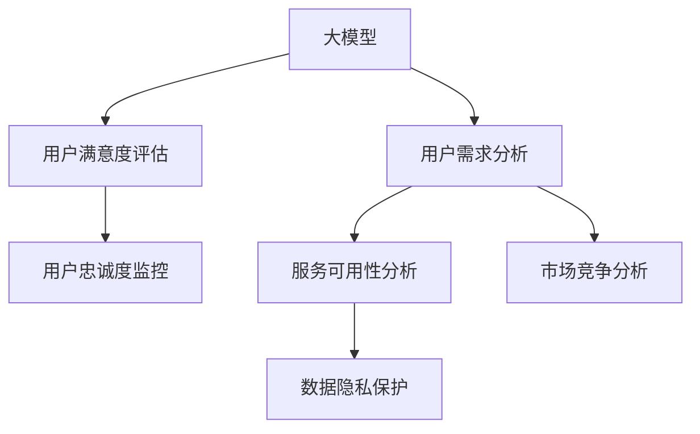

                 

## 1. 背景介绍

### 1.1 问题由来

在当今互联网和人工智能技术迅猛发展的时代，各类基于大模型的创业公司如雨后春笋般涌现。这些公司通过大模型驱动，提供了丰富的自然语言处理（NLP）服务，包括但不限于智能客服、自动翻译、文本摘要、知识图谱构建等。然而，尽管这些服务在技术上已经相当先进，但其核心目标始终是满足用户的实际需求。无论是创业公司还是大企业，用户的需求满足始终是其业务发展的根本驱动力。

### 1.2 问题核心关键点

大模型创业公司需明确几个关键点：

1. **理解用户需求**：准确识别和理解用户需求是创业成功的第一步。
2. **提供优质服务**：高效、准确、安全的模型和算法是满足用户需求的基础。
3. **客户体验至上**：建立稳定可靠的服务，并持续提升用户体验。
4. **技术创新与持续进步**：不断探索新技术、新算法，以适应变化多端的市场需求。

## 2. 核心概念与联系

### 2.1 核心概念概述

为更好地理解用户需求满足，本节将介绍几个关键概念：

- **大模型**：以自回归或自编码模型为代表的大规模预训练语言模型，如GPT系列、BERT等。
- **用户需求分析**：通过调查问卷、用户反馈等方式，识别用户具体需求。
- **用户满意度和忠诚度**：评估用户对服务满意度的关键指标。
- **服务可用性**：系统稳定性、响应速度、安全性等关键性能指标。
- **数据隐私与伦理**：用户数据的安全保护，避免数据滥用。
- **市场竞争**：分析竞争对手，寻找差异化优势。

这些概念之间的逻辑关系可以通过以下Mermaid流程图来展示：



这个流程图展示了大模型创业公司需要关注的关键概念及其之间的联系：

1. 大模型通过大规模预训练获得丰富的语言知识。
2. 用户需求分析帮助识别和满足用户的具体需求。
3. 用户满意度和忠诚度评估，指导服务优化和用户留存策略。
4. 服务可用性分析确保系统稳定性和响应速度。
5. 数据隐私保护确保用户数据安全。
6. 市场竞争分析寻找市场差异化优势。

## 3. 核心算法原理 & 具体操作步骤

### 3.1 算法原理概述

大模型创业公司实现用户需求满足的核心算法和操作步骤包括：

1. **用户需求识别**：通过自然语言处理技术分析用户反馈、搜索查询等数据，识别用户需求。
2. **模型适配**：根据用户需求，适配和微调大模型，使其能够执行特定的NLP任务。
3. **服务提供**：将微调后的模型部署到云端或本地系统，提供高效、准确的NLP服务。
4. **反馈循环**：收集用户使用反馈，持续优化模型和服务。

### 3.2 算法步骤详解

大模型创业公司实现用户需求满足的主要算法步骤如下：

1. **数据收集**：通过API接口、应用日志、用户反馈等方式收集用户数据。
2. **需求识别**：利用自然语言处理技术分析用户输入，识别需求。
3. **模型适配**：根据用户需求，选择或训练预训练模型，进行参数微调。
4. **模型部署**：将微调后的模型部署到服务器，确保可用性和性能。
5. **服务监控**：实时监控服务性能和稳定性，确保用户满意度。
6. **用户反馈**：收集用户反馈，不断优化模型和服务。

### 3.3 算法优缺点

大模型创业公司实现用户需求满足的算法具有以下优点：

1. **高效准确**：大规模预训练模型的通用性和泛化能力使得服务高效、准确。
2. **灵活性高**：模型可快速适配不同任务，满足多样化的用户需求。
3. **数据驱动**：通过大量标注数据训练模型，提升服务质量。
4. **易扩展**：模型可部署到云端，实现快速扩展和资源共享。

同时，这些算法也存在一些局限：

1. **资源需求高**：大规模预训练模型和微调需要大量计算资源。
2. **数据质量依赖**：模型性能取决于标注数据的质量。
3. **隐私风险**：用户数据的使用可能带来隐私泄露风险。
4. **反馈延迟**：用户反馈可能需要时间才能收集并转化为优化措施。

### 3.4 算法应用领域

大模型创业公司实现用户需求满足的算法在多个领域均有应用，例如：

- **智能客服**：基于自然语言处理和大模型，提供智能化的客户服务。
- **智能翻译**：实现高效准确的跨语言翻译，帮助用户解决语言障碍。
- **内容推荐**：根据用户兴趣推荐相关内容，提升用户体验。
- **情感分析**：分析用户反馈和社交媒体，进行舆情监控和情感识别。
- **知识图谱构建**：构建语义知识图谱，提供结构化的知识查询服务。

## 4. 数学模型和公式 & 详细讲解 & 举例说明

### 4.1 数学模型构建

以智能客服系统为例，构建数学模型如下：

1. **用户需求识别**：使用情感分析模型识别用户情绪，从而判断用户需求。
2. **模型适配**：通过微调BERT等大模型，适配用户需求识别任务。
3. **服务提供**：使用适配后的模型，提供智能客服服务。
4. **用户反馈收集**：通过收集用户反馈，更新模型。

### 4.2 公式推导过程

1. **情感分析模型**：
$$ P(y|x) = \frac{e^{\log P(y|x) + \log P(x|y)}}{P(x)} $$

2. **模型微调**：
$$ \theta = \theta - \eta \nabla_{\theta}\mathcal{L}(\theta) $$

3. **服务响应**：
$$ y = f(x; \theta) $$

4. **用户反馈更新**：
$$ \theta = \theta + \alpha \sum_{i=1}^N \nabla_{\theta}\mathcal{L}(x_i, y_i) $$

其中 $x$ 为输入，$y$ 为输出，$\theta$ 为模型参数，$\eta$ 为学习率，$\alpha$ 为反馈更新权重。

### 4.3 案例分析与讲解

以智能客服系统为例，分析其需求识别和模型适配的案例：

1. **需求识别**：通过用户输入的文本，情感分析模型识别其情绪，如愤怒、沮丧等。
2. **模型适配**：微调BERT等大模型，使其能够快速准确地识别和分类用户情绪。
3. **服务提供**：适配后的模型作为智能客服系统的核心组件，处理用户的咨询请求。
4. **用户反馈收集**：用户反馈系统收集用户对客服服务质量的评价，用于模型微调。

## 5. 项目实践：代码实例和详细解释说明

### 5.1 开发环境搭建

以下是使用Python进行PyTorch开发的环境配置流程：

1. 安装Anaconda：从官网下载并安装Anaconda，用于创建独立的Python环境。

2. 创建并激活虚拟环境：
```bash
conda create -n pytorch-env python=3.8 
conda activate pytorch-env
```

3. 安装PyTorch：根据CUDA版本，从官网获取对应的安装命令。例如：
```bash
conda install pytorch torchvision torchaudio cudatoolkit=11.1 -c pytorch -c conda-forge
```

4. 安装Transformers库：
```bash
pip install transformers
```

5. 安装各类工具包：
```bash
pip install numpy pandas scikit-learn matplotlib tqdm jupyter notebook ipython
```

完成上述步骤后，即可在`pytorch-env`环境中开始微调实践。

### 5.2 源代码详细实现

以下是使用PyTorch和Transformers库进行情感分析模型的代码实现：

```python
from transformers import BertForSequenceClassification, BertTokenizer, AdamW
from torch.utils.data import Dataset, DataLoader
from torch.nn import CrossEntropyLoss
import torch

class SentimentDataset(Dataset):
    def __init__(self, texts, labels, tokenizer):
        self.texts = texts
        self.labels = labels
        self.tokenizer = tokenizer

    def __len__(self):
        return len(self.texts)

    def __getitem__(self, item):
        text = self.texts[item]
        label = self.labels[item]

        encoding = self.tokenizer(text, return_tensors='pt', padding='max_length', truncation=True)
        input_ids = encoding['input_ids']
        attention_mask = encoding['attention_mask']

        return {'input_ids': input_ids, 'attention_mask': attention_mask, 'labels': torch.tensor(label)}

model = BertForSequenceClassification.from_pretrained('bert-base-uncased', num_labels=2)

tokenizer = BertTokenizer.from_pretrained('bert-base-uncased')

# 加载数据集
train_dataset = SentimentDataset(train_texts, train_labels, tokenizer)
test_dataset = SentimentDataset(test_texts, test_labels, tokenizer)

# 设置超参数
optimizer = AdamW(model.parameters(), lr=2e-5)
loss_fn = CrossEntropyLoss()

# 训练模型
device = torch.device('cuda') if torch.cuda.is_available() else torch.device('cpu')
model.to(device)

for epoch in range(3):
    model.train()
    for batch in DataLoader(train_dataset, batch_size=32, shuffle=True):
        input_ids = batch['input_ids'].to(device)
        attention_mask = batch['attention_mask'].to(device)
        labels = batch['labels'].to(device)

        optimizer.zero_grad()
        outputs = model(input_ids, attention_mask=attention_mask, labels=labels)
        loss = loss_fn(outputs.logits, labels)
        loss.backward()
        optimizer.step()

    model.eval()
    with torch.no_grad():
        eval_loss = 0
        for batch in DataLoader(test_dataset, batch_size=32, shuffle=False):
            input_ids = batch['input_ids'].to(device)
            attention_mask = batch['attention_mask'].to(device)
            labels = batch['labels'].to(device)

            outputs = model(input_ids, attention_mask=attention_mask, labels=labels)
            eval_loss += loss_fn(outputs.logits, labels).item()

        print(f'Epoch {epoch+1}, train loss: {train_loss:.4f}, test loss: {eval_loss:.4f}')
```

### 5.3 代码解读与分析

让我们再详细解读一下关键代码的实现细节：

**SentimentDataset类**：
- `__init__`方法：初始化文本、标签和分词器。
- `__len__`方法：返回数据集的样本数量。
- `__getitem__`方法：对单个样本进行处理，将文本输入编码为token ids，并添加标签。

**模型适配**：
- 使用BertForSequenceClassification和BertTokenizer，加载预训练模型和分词器。
- 使用AdamW优化器和CrossEntropyLoss损失函数，进行模型训练。

**训练流程**：
- 循环迭代多个epoch，每个epoch内，对训练集进行前向传播和反向传播，更新模型参数。
- 对验证集进行测试，评估模型性能。

## 6. 实际应用场景

### 6.1 智能客服系统

智能客服系统通过大模型驱动，实现了7x24小时不间断服务。用户可以实时获得自然流畅的语音和文字回复，解决了传统客服高峰期响应缓慢、服务质量难以保证的问题。系统能够高效处理大量咨询请求，显著提升客户咨询体验和问题解决效率。

### 6.2 智能翻译

智能翻译系统基于大规模预训练模型和微调技术，实现高效准确的跨语言翻译。用户在输入源语言文本后，系统即时生成目标语言翻译，帮助用户跨越语言障碍。该系统在商业、旅游、学术等多个领域得到广泛应用，提升了用户的工作和沟通效率。

### 6.3 内容推荐

内容推荐系统通过大模型微调，精准推荐用户感兴趣的内容。用户输入搜索查询后，系统根据查询结果和用户历史行为数据，生成个性化的推荐内容。系统能够实时动态更新推荐列表，提升用户满意度和平台留存率。

### 6.4 未来应用展望

未来，随着技术的进步和应用场景的扩展，大模型在更多领域将得到应用。例如：

- **医疗咨询**：基于大模型的医疗问答系统，帮助用户快速获取健康咨询和用药建议。
- **法律咨询**：智能法律问答系统，提供法律咨询和案件分析服务，提升法律服务的可及性和效率。
- **教育培训**：个性化教育推荐系统，根据学生的学习行为和偏好，推荐相应的学习资源。

## 7. 工具和资源推荐

### 7.1 学习资源推荐

为了帮助开发者系统掌握大模型创业的关键技术，这里推荐一些优质的学习资源：

1. 《自然语言处理与深度学习》（第二版）书籍：涵盖了自然语言处理的理论基础和实用技术，适合初学者和进阶者。
2. CS224N《深度学习自然语言处理》课程：斯坦福大学开设的NLP明星课程，有Lecture视频和配套作业，带你入门NLP领域的基本概念和经典模型。
3. 《Transformers from Understanding to Implementation》书籍：详细介绍了Transformer模型的原理、优化技巧和微调方法。
4. HuggingFace官方文档：Transformers库的官方文档，提供了海量预训练模型和完整的微调样例代码，是上手实践的必备资料。
5. Weights & Biases：模型训练的实验跟踪工具，可以记录和可视化模型训练过程中的各项指标，方便对比和调优。

### 7.2 开发工具推荐

高效的开发离不开优秀的工具支持。以下是几款用于大模型创业开发的常用工具：

1. PyTorch：基于Python的开源深度学习框架，灵活动态的计算图，适合快速迭代研究。大部分预训练语言模型都有PyTorch版本的实现。
2. TensorFlow：由Google主导开发的开源深度学习框架，生产部署方便，适合大规模工程应用。同样有丰富的预训练语言模型资源。
3. Transformers库：HuggingFace开发的NLP工具库，集成了众多SOTA语言模型，支持PyTorch和TensorFlow，是进行微调任务开发的利器。
4. Weights & Biases：模型训练的实验跟踪工具，可以记录和可视化模型训练过程中的各项指标，方便对比和调优。与主流深度学习框架无缝集成。
5. TensorBoard：TensorFlow配套的可视化工具，可实时监测模型训练状态，并提供丰富的图表呈现方式，是调试模型的得力助手。

### 7.3 相关论文推荐

大模型创业公司实现用户需求满足的研究源于学界的持续研究。以下是几篇奠基性的相关论文，推荐阅读：

1. Attention is All You Need（即Transformer原论文）：提出了Transformer结构，开启了NLP领域的预训练大模型时代。
2. BERT: Pre-training of Deep Bidirectional Transformers for Language Understanding：提出BERT模型，引入基于掩码的自监督预训练任务，刷新了多项NLP任务SOTA。
3. Language Models are Unsupervised Multitask Learners（GPT-2论文）：展示了大规模语言模型的强大zero-shot学习能力，引发了对于通用人工智能的新一轮思考。
4. Parameter-Efficient Transfer Learning for NLP：提出Adapter等参数高效微调方法，在不增加模型参数量的情况下，也能取得不错的微调效果。
5. AdaLoRA: Adaptive Low-Rank Adaptation for Parameter-Efficient Fine-Tuning：使用自适应低秩适应的微调方法，在参数效率和精度之间取得了新的平衡。

这些论文代表了大模型创业公司实现用户需求满足的发展脉络。通过学习这些前沿成果，可以帮助研究者把握学科前进方向，激发更多的创新灵感。

## 8. 总结：未来发展趋势与挑战

### 8.1 总结

本文对大模型创业公司实现用户需求满足的方法进行了全面系统的介绍。首先阐述了用户需求满足在大模型创业中的重要性，明确了需求识别、模型适配、服务提供和反馈循环等关键步骤。其次，从原理到实践，详细讲解了用户需求满足的数学模型和关键算法，给出了具体代码实现。同时，本文还广泛探讨了智能客服、智能翻译、内容推荐等多个实际应用场景，展示了微调范式的强大生命力。此外，本文精选了微调技术的各类学习资源，力求为读者提供全方位的技术指引。

通过本文的系统梳理，可以看到，大模型微调技术在大模型创业公司中得到了广泛应用，并在多个领域取得了显著效果。未来，伴随预训练语言模型和微调方法的持续演进，相信NLP技术将在更广阔的应用领域大放异彩。

### 8.2 未来发展趋势

展望未来，大模型微调技术将呈现以下几个发展趋势：

1. **技术创新**：随着深度学习技术的发展，大模型微调方法将不断创新，提升模型的精度和效率。
2. **应用扩展**：大模型微调技术将在更多领域得到应用，如医疗、法律、金融等，为各行业带来变革性影响。
3. **跨领域融合**：大模型微调技术将与其他AI技术进行更深入的融合，如因果推理、知识图谱等，提升系统的综合能力。
4. **数据驱动**：未来的微调方法将更加依赖数据驱动，利用数据标注、主动学习等技术，提升模型的泛化能力和鲁棒性。
5. **智能化**：大模型微调技术将逐步实现自动化、智能化，通过智能决策和优化算法，进一步提升服务效果。
6. **伦理性**：随着技术的应用范围扩大，如何避免模型偏见和有害输出，保护用户隐私和数据安全，将成为重要的研究方向。

以上趋势凸显了大模型微调技术的广阔前景。这些方向的探索发展，必将进一步提升NLP系统的性能和应用范围，为人类认知智能的进化带来深远影响。

### 8.3 面临的挑战

尽管大模型微调技术已经取得了瞩目成就，但在迈向更加智能化、普适化应用的过程中，它仍面临着诸多挑战：

1. **标注数据成本高**：大模型微调依赖标注数据，但高质量标注数据的获取成本较高。如何降低对标注数据的依赖，利用更多非结构化数据进行微调，将是一大难题。
2. **模型鲁棒性不足**：当前微调模型面对域外数据时，泛化性能往往大打折扣。如何提高模型的鲁棒性和泛化能力，避免过拟合，是重要的研究方向。
3. **用户隐私保护**：用户数据的使用可能带来隐私泄露风险。如何保护用户隐私，避免数据滥用，是必须解决的难题。
4. **技术复杂性**：大模型微调技术复杂，需要大量数据、计算资源和专业知识，如何降低技术门槛，提高易用性，也是未来的挑战之一。
5. **跨领域适用性**：虽然大模型微调在多个领域得到了应用，但如何在不同领域中实现最佳性能，仍然需要更多探索。
6. **伦理道德问题**：模型可能学习到有害的偏见和信息，如何避免模型偏见和有害输出，确保输出符合人类价值观和伦理道德，是一个重要课题。

### 8.4 研究展望

面对大模型微调面临的挑战，未来的研究需要在以下几个方面寻求新的突破：

1. **数据增强**：探索更多的数据增强技术，利用多源数据、生成数据等手段，提高模型的泛化能力和鲁棒性。
2. **模型压缩**：开发更高效的数据压缩和模型压缩技术，降低计算资源和存储成本。
3. **多模态融合**：探索多模态数据的融合技术，提升模型的感知能力和泛化能力。
4. **知识图谱**：将知识图谱与大模型微调技术结合，提升模型的解释能力和推理能力。
5. **模型伦理**：在模型训练和优化过程中引入伦理导向的评估指标，过滤和惩罚有害的输出倾向。
6. **用户交互**：探索更多的用户交互方式，如自然语言生成、推荐系统等，提升用户体验。

这些研究方向的探索，必将引领大模型微调技术迈向更高的台阶，为构建安全、可靠、可解释、可控的智能系统铺平道路。面向未来，大模型微调技术还需要与其他人工智能技术进行更深入的融合，如因果推理、知识图谱、强化学习等，多路径协同发力，共同推动自然语言理解和智能交互系统的进步。只有勇于创新、敢于突破，才能不断拓展语言模型的边界，让智能技术更好地造福人类社会。

## 9. 附录：常见问题与解答

**Q1：大模型微调是否适用于所有NLP任务？**

A: 大模型微调在大多数NLP任务上都能取得不错的效果，特别是对于数据量较小的任务。但对于一些特定领域的任务，如医学、法律等，仅仅依靠通用语料预训练的模型可能难以很好地适应。此时需要在特定领域语料上进一步预训练，再进行微调，才能获得理想效果。此外，对于一些需要时效性、个性化很强的任务，如对话、推荐等，微调方法也需要针对性的改进优化。

**Q2：微调过程中如何选择合适的学习率？**

A: 微调的学习率一般要比预训练时小1-2个数量级，如果使用过大的学习率，容易破坏预训练权重，导致过拟合。一般建议从1e-5开始调参，逐步减小学习率，直至收敛。也可以使用warmup策略，在开始阶段使用较小的学习率，再逐渐过渡到预设值。需要注意的是，不同的优化器(如AdamW、Adafactor等)以及不同的学习率调度策略，可能需要设置不同的学习率阈值。

**Q3：采用大模型微调时会面临哪些资源瓶颈？**

A: 目前主流的预训练大模型动辄以亿计的参数规模，对算力、内存、存储都提出了很高的要求。GPU/TPU等高性能设备是必不可少的，但即便如此，超大批次的训练和推理也可能遇到显存不足的问题。因此需要采用一些资源优化技术，如梯度积累、混合精度训练、模型并行等，来突破硬件瓶颈。同时，模型的存储和读取也可能占用大量时间和空间，需要采用模型压缩、稀疏化存储等方法进行优化。

**Q4：如何缓解微调过程中的过拟合问题？**

A: 过拟合是微调面临的主要挑战，尤其是在标注数据不足的情况下。常见的缓解策略包括：
1. 数据增强：通过回译、近义替换等方式扩充训练集
2. 正则化：使用L2正则、Dropout、Early Stopping等避免过拟合
3. 对抗训练：引入对抗样本，提高模型鲁棒性
4. 参数高效微调：只调整少量参数(如Adapter、Prefix等)，减小过拟合风险
5. 多模型集成：训练多个微调模型，取平均输出，抑制过拟合

这些策略往往需要根据具体任务和数据特点进行灵活组合。只有在数据、模型、训练、推理等各环节进行全面优化，才能最大限度地发挥大模型微调的威力。

**Q5：微调模型在落地部署时需要注意哪些问题？**

A: 将微调模型转化为实际应用，还需要考虑以下因素：
1. 模型裁剪：去除不必要的层和参数，减小模型尺寸，加快推理速度
2. 量化加速：将浮点模型转为定点模型，压缩存储空间，提高计算效率
3. 服务化封装：将模型封装为标准化服务接口，便于集成调用
4. 弹性伸缩：根据请求流量动态调整资源配置，平衡服务质量和成本
5. 监控告警：实时采集系统指标，设置异常告警阈值，确保服务稳定性
6. 安全防护：采用访问鉴权、数据脱敏等措施，保障数据和模型安全

大模型微调为NLP应用开启了广阔的想象空间，但如何将强大的性能转化为稳定、高效、安全的业务价值，还需要工程实践的不断打磨。唯有从数据、算法、工程、业务等多个维度协同发力，才能真正实现人工智能技术在垂直行业的规模化落地。总之，微调需要开发者根据具体任务，不断迭代和优化模型、数据和算法，方能得到理想的效果。

---

作者：禅与计算机程序设计艺术 / Zen and the Art of Computer Programming

