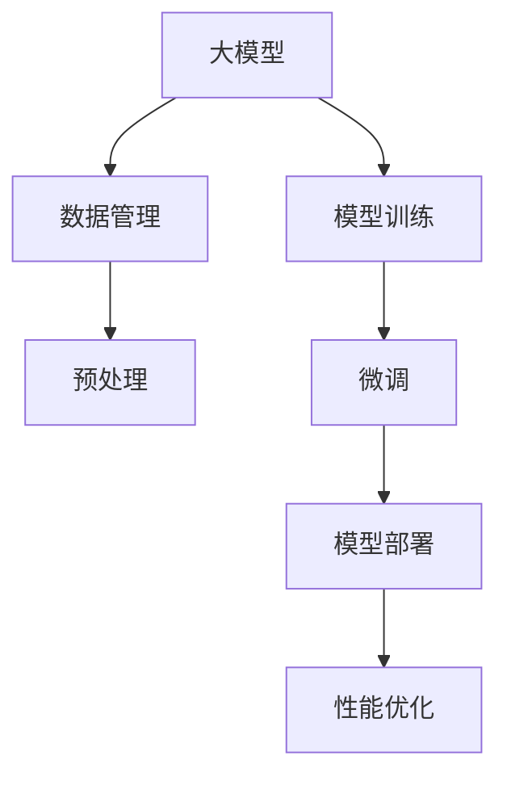

                 

# 用户需求：大模型创业的指南针

> 关键词：人工智能创业,大模型技术,用户需求,创业指南,技术栈

## 1. 背景介绍

### 1.1 问题由来

随着人工智能技术的飞速发展，尤其是深度学习在各领域的应用，人工智能创业公司如雨后春笋般涌现。然而，人工智能创业并非易事，特别是当企业基于大模型技术进行创新时，需要考虑更多的技术挑战和市场风险。本文旨在提供一份大模型创业的指南，通过梳理核心概念和关键技术，帮助创业团队在快速变化的市场环境中取得成功。

### 1.2 问题核心关键点

大模型创业涉及多个环节，包括模型选择、数据获取、训练与部署、市场推广等。本文将围绕这些核心关键点进行详细探讨，帮助创业团队全面了解大模型创业的技术要求和市场机会。

## 2. 核心概念与联系

### 2.1 核心概念概述

在大模型创业过程中，涉及多个核心概念，包括大模型技术、模型训练与微调、数据管理与预处理、模型部署与性能优化等。这些概念相互关联，共同构成了大模型创业的完整技术栈。

1. **大模型技术**：指基于大规模数据集进行训练的深度学习模型，如BERT、GPT-3、T5等。这些模型在自然语言处理、计算机视觉、语音识别等领域展现出卓越的性能。

2. **模型训练与微调**：指利用标注数据对预训练模型进行进一步的训练和优化，以适应特定的任务需求。微调可以显著提升模型的性能，减少对标注数据的需求。

3. **数据管理与预处理**：包括数据收集、清洗、标注和增强等步骤。数据的质量和多样性直接决定了模型训练的效果。

4. **模型部署与性能优化**：将训练好的模型部署到生产环境中，并通过优化算法、模型压缩等技术，确保模型的高性能和低延迟。

### 2.2 核心概念原理和架构的 Mermaid 流程图



这个流程图展示了大模型创业的技术流程：

1. **大模型**：是整个流程的起点，提供初始的模型基础。
2. **数据管理**：确保数据的质量和多样性，为模型训练提供支持。
3. **预处理**：对原始数据进行清洗、标注和增强，以提升模型训练效果。
4. **模型训练**：利用标注数据对大模型进行训练，以获得初步的性能提升。
5. **微调**：进一步优化模型，使其适应特定任务需求。
6. **模型部署**：将训练好的模型部署到生产环境中，提供服务。
7. **性能优化**：通过优化算法和模型压缩等技术，确保模型的高性能和低延迟。

## 3. 核心算法原理 & 具体操作步骤

### 3.1 算法原理概述

大模型创业的核心在于选择合适的算法和技术，确保模型的高效训练和部署。这涉及到模型的选择、数据预处理、模型训练与微调、模型压缩与优化等多个环节。

### 3.2 算法步骤详解

#### 3.2.1 模型选择

选择合适的预训练模型是创业成功的第一步。常用的预训练模型包括BERT、GPT-3、T5等，需要根据具体任务和数据特点进行选择。

- **BERT**：适用于文本分类、命名实体识别、问答系统等任务。
- **GPT-3**：适用于文本生成、对话系统等任务。
- **T5**：适用于文本摘要、生成等任务。

#### 3.2.2 数据管理

数据管理在大模型创业中至关重要。

- **数据收集**：收集与任务相关的数据，确保数据的多样性和质量。
- **数据清洗**：去除噪声和异常数据，提升数据质量。
- **数据标注**：为模型训练提供标注数据，建议采用众包标注以降低成本。

#### 3.2.3 模型训练与微调

- **模型训练**：选择合适的优化算法（如Adam、SGD等），设定合适的学习率、批大小等超参数。
- **微调**：在预训练模型的基础上，利用少量标注数据进行微调，以适应特定任务。微调可以显著提升模型性能。

#### 3.2.4 模型压缩与优化

模型压缩和优化是大模型创业中的重要环节。

- **模型压缩**：通过剪枝、量化等技术，减少模型参数量，提升模型推理速度。
- **优化算法**：选择合适的优化算法和调度策略，如Adafactor、Shampoo等，提升训练效率。

### 3.3 算法优缺点

#### 3.3.1 优点

- **高效训练**：大模型可以在少量标注数据上通过微调快速提升性能。
- **广泛应用**：大模型适用于多种NLP任务，如文本分类、命名实体识别、问答系统等。
- **参数高效**：采用参数高效微调技术，可以减少模型更新量，提升训练效率。

#### 3.3.2 缺点

- **数据依赖**：大模型依赖于标注数据，数据获取和标注成本较高。
- **模型复杂**：大规模模型的参数量较大，训练和推理需要较高的计算资源。
- **可解释性不足**：大模型通常被视为"黑盒"系统，缺乏可解释性。

### 3.4 算法应用领域

大模型创业在多个领域都有广泛的应用，例如：

- **自然语言处理**：包括文本分类、命名实体识别、问答系统、文本摘要等。
- **计算机视觉**：如图像分类、目标检测、图像生成等。
- **语音识别**：如语音转文本、文本转语音等。

## 4. 数学模型和公式 & 详细讲解

### 4.1 数学模型构建

大模型创业涉及多个数学模型，包括模型训练、微调和优化等。以BERT为例，其训练过程可以表示为：

- **输入**：原始文本 $X$，标记 $Y$。
- **预训练**：通过自监督任务训练初始模型。
- **微调**：利用标注数据 $D$ 对预训练模型进行微调，公式为：

$$
\theta^* = \mathop{\arg\min}_{\theta} \mathcal{L}(M_{\theta},D)
$$

其中，$\theta$ 为模型参数，$M_{\theta}$ 为模型，$D$ 为标注数据集，$\mathcal{L}$ 为损失函数。

### 4.2 公式推导过程

- **输入层**：将文本 $X$ 转化为嵌入向量 $X'$。
- **隐藏层**：通过多个Transformer层，对 $X'$ 进行编码，输出隐藏状态 $H$。
- **输出层**：利用 $H$ 计算分类概率，得到预测结果 $\hat{Y}$。

### 4.3 案例分析与讲解

以BERT为例，其微调过程可以表示为：

- **输入**：原始文本 $X$，标记 $Y$。
- **预训练**：通过掩码语言模型、下一句预测等任务训练初始模型。
- **微调**：利用标注数据 $D$ 对预训练模型进行微调，公式为：

$$
\theta^* = \mathop{\arg\min}_{\theta} \mathcal{L}(M_{\theta},D)
$$

其中，$\theta$ 为模型参数，$M_{\theta}$ 为模型，$D$ 为标注数据集，$\mathcal{L}$ 为损失函数。

## 5. 项目实践：代码实例和详细解释说明

### 5.1 开发环境搭建

为了进行大模型创业，我们需要搭建一个完整的开发环境。以下是一个基本的搭建流程：

1. **环境安装**：
   - 安装Python、CUDA、cuDNN等依赖库。
   - 安装TensorFlow、PyTorch等深度学习框架。

2. **模型下载**：
   - 从Hugging Face等平台下载预训练模型，如BERT、GPT-3等。

3. **数据准备**：
   - 收集与任务相关的数据，进行清洗、标注和增强。

### 5.2 源代码详细实现

以下是一个使用PyTorch进行BERT微调的代码实现：

```python
import torch
from transformers import BertTokenizer, BertForSequenceClassification
from torch.utils.data import DataLoader, Dataset

# 定义数据集
class MyDataset(Dataset):
    def __init__(self, texts, labels):
        self.tokenizer = BertTokenizer.from_pretrained('bert-base-uncased')
        self.texts = texts
        self.labels = labels
        
    def __len__(self):
        return len(self.texts)
    
    def __getitem__(self, item):
        text = self.texts[item]
        label = self.labels[item]
        
        encoding = self.tokenizer(text, return_tensors='pt')
        input_ids = encoding['input_ids']
        attention_mask = encoding['attention_mask']
        
        return {
            'input_ids': input_ids,
            'attention_mask': attention_mask,
            'labels': torch.tensor(label, dtype=torch.long)
        }

# 定义模型和优化器
model = BertForSequenceClassification.from_pretrained('bert-base-uncased', num_labels=2)
optimizer = AdamW(model.parameters(), lr=2e-5)

# 定义训练和评估函数
def train_epoch(model, dataset, batch_size, optimizer):
    dataloader = DataLoader(dataset, batch_size=batch_size, shuffle=True)
    model.train()
    epoch_loss = 0
    for batch in dataloader:
        input_ids = batch['input_ids'].to(device)
        attention_mask = batch['attention_mask'].to(device)
        labels = batch['labels'].to(device)
        model.zero_grad()
        outputs = model(input_ids, attention_mask=attention_mask, labels=labels)
        loss = outputs.loss
        epoch_loss += loss.item()
        loss.backward()
        optimizer.step()
    return epoch_loss / len(dataloader)

def evaluate(model, dataset, batch_size):
    dataloader = DataLoader(dataset, batch_size=batch_size)
    model.eval()
    preds, labels = [], []
    with torch.no_grad():
        for batch in dataloader:
            input_ids = batch['input_ids'].to(device)
            attention_mask = batch['attention_mask'].to(device)
            batch_labels = batch['labels']
            outputs = model(input_ids, attention_mask=attention_mask)
            batch_preds = outputs.logits.argmax(dim=1).to('cpu').tolist()
            batch_labels = batch_labels.to('cpu').tolist()
            for pred, label in zip(batch_preds, batch_labels):
                preds.append(pred.item())
                labels.append(label.item())
    return preds, labels

# 启动训练流程
device = torch.device('cuda' if torch.cuda.is_available() else 'cpu')
model.to(device)

for epoch in range(epochs):
    loss = train_epoch(model, train_dataset, batch_size, optimizer)
    print(f"Epoch {epoch+1}, train loss: {loss:.3f}")
    
    preds, labels = evaluate(model, dev_dataset, batch_size)
    print(classification_report(labels, preds))

```

### 5.3 代码解读与分析

以上代码实现了使用PyTorch进行BERT微调的过程。关键步骤如下：

1. **数据集定义**：定义数据集类，将文本和标签转化为模型可以处理的格式。
2. **模型和优化器**：使用Hugging Face提供的BERT模型和AdamW优化器。
3. **训练和评估函数**：定义训练和评估函数，在每个epoch中计算损失和准确率。
4. **训练流程**：在训练集中进行模型训练，在验证集上进行评估。

## 6. 实际应用场景

### 6.1 智能客服系统

智能客服系统是大模型创业中的一个典型应用场景。

- **数据获取**：收集历史客服对话记录。
- **模型训练**：在对话数据上训练大模型，进行微调以适应客服场景。
- **模型部署**：将微调后的模型部署到生产环境中，提供实时客服服务。

### 6.2 金融舆情监测

金融舆情监测是大模型创业的另一个重要应用领域。

- **数据获取**：收集金融领域的各种新闻、报告、评论等数据。
- **模型训练**：在金融数据上训练大模型，进行情感分析和主题分类。
- **模型部署**：将微调后的模型部署到生产环境中，实时监测舆情变化。

### 6.3 个性化推荐系统

个性化推荐系统是大模型创业中的热门应用。

- **数据获取**：收集用户的行为数据和物品信息。
- **模型训练**：在用户行为数据和物品信息上训练大模型，进行个性化推荐。
- **模型部署**：将微调后的模型部署到生产环境中，提供个性化的推荐服务。

### 6.4 未来应用展望

未来，大模型创业将在更多领域得到应用，如智慧医疗、智能教育、智慧城市等。

- **智慧医疗**：在医疗问答、病历分析、药物研发等方面，大模型可以提供高效准确的解决方案。
- **智能教育**：在作业批改、学情分析、知识推荐等方面，大模型可以提升教学效果。
- **智慧城市**：在事件监测、舆情分析、应急指挥等方面，大模型可以提升城市管理的自动化和智能化水平。

## 7. 工具和资源推荐

### 7.1 学习资源推荐

为了帮助创业团队快速掌握大模型创业所需的技术，推荐以下学习资源：

1. **《深度学习入门》书籍**：入门级深度学习书籍，涵盖基础的数学知识和深度学习算法。
2. **《自然语言处理入门》书籍**：介绍自然语言处理的基础知识和常见任务，包括文本分类、命名实体识别等。
3. **在线课程**：如Coursera、Udacity等平台提供的深度学习课程，涵盖机器学习、深度学习等内容。
4. **开源项目**：如Hugging Face、TensorFlow等，提供了大量预训练模型和样例代码。

### 7.2 开发工具推荐

为了提高大模型创业的效率，推荐以下开发工具：

1. **PyTorch**：深度学习框架，提供了丰富的预训练模型和样例代码。
2. **TensorFlow**：深度学习框架，支持分布式训练和模型部署。
3. **Jupyter Notebook**：交互式开发环境，便于快速迭代开发和调试。
4. **Weights & Biases**：模型训练实验跟踪工具，帮助记录和分析模型训练过程。

### 7.3 相关论文推荐

为了了解大模型创业的前沿研究，推荐以下论文：

1. **Attention is All You Need**：Transformer论文，介绍了Transformer模型和自注意力机制。
2. **BERT: Pre-training of Deep Bidirectional Transformers for Language Understanding**：BERT论文，介绍了BERT模型的预训练和微调过程。
3. **Parameter-Efficient Transfer Learning for NLP**：介绍 Adapter等参数高效微调方法，减少了微调所需的参数量。
4. **AdaLoRA: Adaptive Low-Rank Adaptation for Parameter-Efficient Fine-Tuning**：介绍 AdaLoRA 方法，进一步提高了参数效率。
5. **Prompt-Based Learning**：介绍 Prompt Learning 方法，通过精巧的输入模板引导模型生成高质量输出。

## 8. 总结：未来发展趋势与挑战

### 8.1 总结

大模型创业以其高效、灵活、可扩展性受到广泛关注。本文从核心概念、算法原理、操作步骤等多个方面，详细介绍了大模型创业的技术栈。通过梳理核心概念和关键技术，为创业团队提供了全面的技术指引。

### 8.2 未来发展趋势

未来大模型创业将呈现以下几个发展趋势：

1. **模型规模扩大**：随着算力成本的下降，大模型参数量将进一步增大，模型性能将显著提升。
2. **微调方法优化**：更多参数高效和计算高效的微调方法将被开发，提升微调效率。
3. **跨领域迁移**：大模型将具备更强的跨领域迁移能力，应用于更多垂直领域。
4. **多模态融合**：视觉、语音、文本等多模态信息将进一步融合，提升模型的理解和表达能力。
5. **持续学习**：大模型将具备持续学习的能力，不断适应新的数据和任务。

### 8.3 面临的挑战

尽管大模型创业前景广阔，但仍面临以下挑战：

1. **数据获取**：大规模标注数据获取和标注成本较高，成为制约大模型创业的重要瓶颈。
2. **模型鲁棒性**：大模型在面对域外数据时，泛化性能可能不足。
3. **推理效率**：大模型推理速度较慢，内存占用较大，需要优化资源利用。
4. **可解释性**：大模型缺乏可解释性，难以满足高风险应用的需求。
5. **安全性**：大模型可能学习到有害信息，输出存在安全风险。
6. **知识整合**：大模型难以灵活吸收和应用外部知识库和规则库。

### 8.4 研究展望

未来研究应在以下方面进行突破：

1. **无监督学习**：开发无监督和半监督学习算法，减少对标注数据的依赖。
2. **参数高效**：开发更多参数高效和计算高效的微调方法。
3. **知识融合**：将知识图谱、逻辑规则等与大模型结合，提升模型的理解和推理能力。
4. **伦理道德**：在大模型训练和应用过程中，引入伦理导向的评估指标，确保模型输出的安全性。

## 9. 附录：常见问题与解答

**Q1：大模型创业需要多少标注数据？**

A：大模型创业对标注数据的需求取决于任务的复杂度和数据的多样性。一般来说，至少需要几百个标注样本，但在某些特定任务上，可能只需要几十个样本即可。

**Q2：如何选择预训练模型？**

A：选择预训练模型应考虑以下几个因素：任务类型、数据量和资源限制。BERT、GPT-3、T5等模型适用于不同的任务，根据具体需求选择。

**Q3：微调过程中如何避免过拟合？**

A：避免过拟合的方法包括数据增强、正则化、dropout、early stopping等。选择合适的学习率和优化器，防止模型过度适应训练数据。

**Q4：模型压缩和优化有哪些技术？**

A：模型压缩和优化技术包括剪枝、量化、参数共享、分布式训练等。使用TensorFlow、PyTorch等框架提供的工具，可以有效提升模型推理速度。

**Q5：如何确保模型输出的安全性？**

A：在大模型训练和应用过程中，引入伦理导向的评估指标，过滤和惩罚有害输出。同时，加强人工干预和审核，确保输出符合人类价值观和伦理道德。

---

作者：禅与计算机程序设计艺术 / Zen and the Art of Computer Programming

