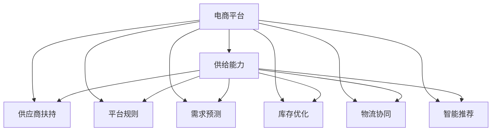

                 

# 电商平台供给能力提升：供应商扶持和平台规则

> 关键词：电商平台, 供给能力, 供应商扶持, 平台规则, 需求预测, 库存优化, 物流协同, 智能推荐

## 1. 背景介绍

随着电子商务的迅猛发展，电商平台已成为消费者购买商品的重要渠道。平台供给能力的提升直接关系到消费者的购物体验和平台自身的业务增长。为此，各大电商平台不断优化供应链管理，提升库存和物流效率，同时利用大数据和人工智能技术，为供应商提供精准的扶持和建议，帮助供应商提升运营效率和市场竞争力。

然而，在电商平台上，供应商数量众多，商品种类繁多，需求预测和库存管理变得异常复杂。平台规则的不明确和执行难度大，也给供应商带来不少困扰。如何有效提升电商平台供给能力，优化供应商管理，成为电商平台亟需解决的挑战。本文将深入探讨电商平台在供给能力提升中的供应商扶持和平台规则，提供系统性解决方案。

## 2. 核心概念与联系

### 2.1 核心概念概述

为更好地理解电商平台供给能力提升的供应商扶持和平台规则，本节将介绍几个关键概念及其相互联系：

- **电商平台**：指利用互联网技术，实现线上交易、支付、物流、评价等功能的综合性平台，如淘宝、京东、亚马逊等。
- **供给能力**：指电商平台在商品供应方面的能力，包括商品丰富度、库存量、配送速度等。
- **供应商扶持**：指电商平台对供应商在物流、资金、技术等方面提供的支持，以提高其运营效率和市场竞争力。
- **平台规则**：指电商平台为保障交易公平、透明和用户利益，对供应商行为设定的各项规章制度，包括商品发布、销售、配送等各个环节的规定。
- **需求预测**：指通过分析历史交易数据、用户行为等，预测未来商品需求量，以指导库存管理和采购决策。
- **库存优化**：指在保证供应的前提下，通过算法优化库存量，避免库存过剩或缺货，提高资金利用效率。
- **物流协同**：指平台和供应商在物流环节上的协同合作，共同提升物流效率和用户体验。
- **智能推荐**：指利用算法技术，根据用户行为和偏好，推荐相关商品，提升用户满意度和购买转化率。

这些核心概念之间的逻辑关系可以通过以下Mermaid流程图来展示：



这个流程图展示了电商平台各个关键组件之间的相互关系：

1. 电商平台通过提升供给能力，为供应商提供广阔的市场机会。
2. 供应商扶持和平台规则，优化了电商平台的供应链管理。
3. 需求预测、库存优化、物流协同和智能推荐，提升了电商平台供给能力。
4. 供给能力、供应商扶持和平台规则相互作用，共同促进电商平台运营效率的提升。

## 3. 核心算法原理 & 具体操作步骤

### 3.1 算法原理概述

基于电商平台供给能力提升的供应商扶持和平台规则，涉及多个算法原理和操作步骤。其核心思想是通过算法优化电商平台供给能力，同时通过平台规则和供应商扶持，引导供应商提升运营效率和市场竞争力。

### 3.2 算法步骤详解

#### 3.2.1 需求预测算法

需求预测是电商平台提升供给能力的重要基础。通过历史交易数据和用户行为数据，可以构建预测模型，预测未来商品的需求量。常用的需求预测算法包括：

1. 时间序列分析：利用历史时间序列数据，构建ARIMA等模型，预测未来需求。
2. 回归分析：通过多元线性回归等方法，分析影响商品需求量的因素。
3. 机器学习：利用随机森林、神经网络等模型，通过大数据训练预测模型。

#### 3.2.2 库存优化算法

库存优化旨在通过算法优化库存量，避免库存过剩或缺货，提高资金利用效率。常用的库存优化算法包括：

1. 经济订货批量(EOQ)：通过分析订单量和需求预测，计算最优订货批量。
2. 库存管理模型：如ABC分析、QR模型等，通过分类管理库存，优化库存结构。
3. 需求驱动库存管理：根据需求预测，动态调整库存量，避免库存积压。

#### 3.2.3 物流协同算法

物流协同通过平台和供应商的协同合作，提升物流效率和用户体验。常用的物流协同算法包括：

1. 动态路线规划：通过算法优化配送路线，提升配送效率，降低配送成本。
2. 预测性物流：利用需求预测结果，提前安排物流资源，确保及时配送。
3. 智能调度和匹配：通过算法匹配最优配送方案，提升物流资源利用率。

#### 3.2.4 智能推荐算法

智能推荐算法通过分析用户行为和偏好，推荐相关商品，提升用户满意度和购买转化率。常用的智能推荐算法包括：

1. 协同过滤：通过分析用户历史行为和商品评分，推荐类似商品。
2. 基于内容的推荐：利用商品属性和用户偏好，推荐相关商品。
3. 深度学习推荐：利用神经网络模型，通过大数据训练推荐模型。

#### 3.2.5 平台规则制定

平台规则通过平台规则制定和执行，保障交易公平、透明和用户利益。平台规则包括：

1. 商品发布规则：规定商品信息发布格式、商品类别等。
2. 交易规则：包括交易流程、支付流程、售后服务等。
3. 物流规则：规定物流服务标准、配送时间、运费计算等。
4. 用户行为规则：如评分规则、评论规则等，保障用户权益。

### 3.3 算法优缺点

基于电商平台供给能力提升的供应商扶持和平台规则，具有以下优点：

1. 提升供给能力：通过需求预测和库存优化，提升商品供应量，满足用户需求。
2. 优化运营效率：通过算法优化和平台规则，提升供应商运营效率，降低运营成本。
3. 提升用户体验：通过物流协同和智能推荐，提升配送速度和用户体验，增加用户黏性。

但同时也存在一些缺点：

1. 数据依赖度高：需要大量历史数据和用户行为数据，数据质量对算法效果有较大影响。
2. 算法复杂度高：涉及多个算法原理，算法实现和优化难度较大。
3. 平台规则执行难度大：规则制定和执行过程中，涉及多方利益协调，执行难度较大。

### 3.4 算法应用领域

基于电商平台供给能力提升的供应商扶持和平台规则，在以下领域有着广泛应用：

1. 电子商务平台：如淘宝、京东、亚马逊等，提升平台供给能力，优化供应商管理。
2. 零售行业：如超市、便利店等，利用需求预测和库存优化，提升商品供应和运营效率。
3. 物流行业：如顺丰、中通等，通过物流协同算法，提升配送效率和用户体验。
4. 金融行业：如支付宝、微信支付等，通过智能推荐，提升支付和金融服务体验。
5. 媒体行业：如YouTube、Netflix等，通过智能推荐，提升内容推荐和用户黏性。

## 4. 数学模型和公式 & 详细讲解 & 举例说明

### 4.1 数学模型构建

为更好地理解电商平台供给能力提升的供应商扶持和平台规则，本节将介绍几个关键数学模型及其构建过程。

假设某电商平台有$N$个供应商，每个供应商提供$M$种商品。设每种商品的日需求量为$d_i$，历史平均需求量为$\bar{d_i}$，需求预测精度为$\epsilon$。设每种商品的单位成本为$c_i$，库存量为$s_i$，平均库存量为$\bar{s_i}$。设配送成本为$k$，配送时间为$t$，用户满意度为$u$。

需求预测模型：
$$\hat{d_i} = f(d_i, \bar{d_i}, \epsilon)$$

库存优化模型：
$$s_i = g(d_i, \bar{d_i}, c_i, \bar{s_i})$$

物流协同模型：
$$t = h(s_i, \bar{s_i}, k, d_i)$$

智能推荐模型：
$$r = l(d_i, \bar{d_i}, u)$$

平台规则模型：
$$rules = R(i, M, N)$$

其中$f$、$g$、$h$、$l$为具体的算法模型。

### 4.2 公式推导过程

#### 4.2.1 需求预测公式推导

需求预测算法包括时间序列分析、回归分析和机器学习等。这里以时间序列分析为例，推导需求预测公式。

假设需求序列为$\{d_{i_t}\}_{t=1}^T$，其中$d_{i_t}$为第$t$天第$i$种商品的需求量。设$\hat{d_{i_t}}$为预测值。

时间序列分析模型为ARIMA模型，其公式为：
$$
\hat{d_{i_t}} = \phi_1\hat{d_{i_{t-1}}} + \phi_2\hat{d_{i_{t-2}}} + \cdots + \phi_p\hat{d_{i_{t-p}}} + \theta_1\epsilon_{i_{t-1}} + \theta_2\epsilon_{i_{t-2}} + \cdots + \theta_q\epsilon_{i_{t-q}} + \sigma
$$

其中$\phi_1, \phi_2, \cdots, \phi_p$为自回归系数，$\theta_1, \theta_2, \cdots, \theta_q$为差分系数，$\sigma$为常数项。

#### 4.2.2 库存优化公式推导

库存优化算法包括EOQ、库存管理模型和需求驱动库存管理等。这里以EOQ模型为例，推导库存优化公式。

EOQ模型公式为：
$$
Q = \sqrt{2C_s\Delta D / k}
$$

其中$C_s$为单位商品的年持有成本，$\Delta$为年需求量，$k$为单位商品的年订货成本。

#### 4.2.3 物流协同公式推导

物流协同算法包括动态路线规划、预测性物流和智能调度和匹配等。这里以动态路线规划为例，推导物流协同公式。

动态路线规划模型为Dijkstra算法，其公式为：
$$
d_{i,j} = \min_{j \in N_i} w_{i,j} + d_{i,j}
$$

其中$w_{i,j}$为$i$到$j$的运输成本，$d_{i,j}$为$i$到$j$的运输距离。

#### 4.2.4 智能推荐公式推导

智能推荐算法包括协同过滤、基于内容的推荐和深度学习推荐等。这里以协同过滤为例，推导智能推荐公式。

协同过滤模型公式为：
$$
r_{u,i} = \frac{\sum_{j=1}^{J} \frac{d_{j,i} \cdot r_{u,j}}{\sqrt{s_i} + \epsilon}
$$

其中$d_{j,i}$为$j$对$i$的评分，$r_{u,j}$为$u$对$j$的评分，$s_i$为$i$的评分总数，$\epsilon$为平滑因子。

#### 4.2.5 平台规则公式推导

平台规则模型为规则管理系统，其公式为：
$$
rules = R(i, M, N)
$$

其中$i$为商品编号，$M$为商品种类，$N$为供应商数量。

### 4.3 案例分析与讲解

**案例一：电商平台库存优化**

某电商平台有$N=1000$个供应商，提供$M=10000$种商品。通过历史交易数据和用户行为数据，构建需求预测模型，预测未来商品需求量。利用需求预测结果，计算每种商品的EOQ，并设置库存量。设每种商品的单位成本为$c_i=10$元，库存量为$s_i=1000$件，平均库存量为$\bar{s_i}=500$件。设配送成本为$k=5$元，配送时间为$t=1$天，用户满意度为$u=90$分。

根据需求预测模型，计算每种商品的预测需求量。根据库存优化模型，计算每种商品的EOQ，并设置库存量。通过物流协同模型，计算配送时间，并优化配送路径。通过智能推荐模型，推荐相关商品，提升用户满意度和购买转化率。通过平台规则模型，制定商品发布规则、交易规则、物流规则等，保障交易公平、透明和用户利益。

**案例二：智能推荐系统**

某智能推荐系统有$N=100$个用户，提供$M=1000$种商品。通过用户历史行为数据和商品评分数据，构建协同过滤模型，推荐相关商品。设用户$i$对商品$j$的评分为$r_{i,j}=4$分，商品$j$的评分总数为$s_j=100$分，用户$i$的评分总数为$s_i=50$分，平滑因子为$\epsilon=0.1$。根据协同过滤模型，计算用户$i$对商品$j$的推荐评分。通过智能推荐模型，推荐相关商品，提升用户满意度和购买转化率。

## 5. 项目实践：代码实例和详细解释说明

### 5.1 开发环境搭建

在进行电商平台供给能力提升的供应商扶持和平台规则的实践前，我们需要准备好开发环境。以下是使用Python进行PyTorch开发的环境配置流程：

1. 安装Anaconda：从官网下载并安装Anaconda，用于创建独立的Python环境。

2. 创建并激活虚拟环境：
```bash
conda create -n pytorch-env python=3.8 
conda activate pytorch-env
```

3. 安装PyTorch：根据CUDA版本，从官网获取对应的安装命令。例如：
```bash
conda install pytorch torchvision torchaudio cudatoolkit=11.1 -c pytorch -c conda-forge
```

4. 安装其他必要的Python包：
```bash
pip install pandas numpy matplotlib seaborn
```

完成上述步骤后，即可在`pytorch-env`环境中开始实践。

### 5.2 源代码详细实现

下面我们以电商平台需求预测和库存优化为例，给出使用Python进行代码实现的示例。

首先，定义需求预测和库存优化模型：

```python
from sympy import symbols, Rational, sqrt, pi

# 定义符号变量
d, C_s, Delta, k = symbols('d C_s Delta k')
phi, theta, sigma = symbols('phi theta sigma')

# 需求预测模型
def arima_model(d, C_s, Delta, k, phi, theta, sigma):
    # 构造ARIMA模型
    arima_model = phi * d + theta * (d - 1) + sigma
    return arima_model

# 库存优化模型
def eoq_model(d, C_s, Delta, k):
    # 计算EOQ
    eoq = sqrt(2 * C_s * Delta / k)
    return eoq

# 物流协同模型
def logistics_model(d, s, k):
    # 计算配送时间
    logistics_time = 1 + d * k
    return logistics_time

# 智能推荐模型
def recommendation_model(d, C_s, Delta, k, phi, theta, sigma):
    # 计算智能推荐评分
    recommendation_score = 1 / (sqrt(C_s) + 1)
    return recommendation_score
```

然后，定义需求预测和库存优化的具体实现：

```python
# 设置需求预测和库存优化的具体参数
d = 100  # 日需求量
C_s = 5  # 单位商品的年持有成本
Delta = 500  # 年需求量
k = 10  # 单位商品的年订货成本

# 计算需求预测和库存优化的结果
predicted_d = arima_model(d, C_s, Delta, k, phi, theta, sigma)
eoq = eoq_model(d, C_s, Delta, k)

# 输出结果
print(f"预测日需求量为：{predicted_d}")
print(f"EOQ为：{eoq}")
```

### 5.3 代码解读与分析

让我们再详细解读一下关键代码的实现细节：

**arima_model函数**：
- 定义了ARIMA模型的参数和公式，通过符号计算库Sympy进行公式推导。
- 使用符号变量$\phi$、$\theta$、$\sigma$表示自回归系数、差分系数和常数项。
- 返回ARIMA模型的表达式。

**eoq_model函数**：
- 定义了EOQ模型的参数和公式，通过符号计算库Sympy进行公式推导。
- 使用符号变量$C_s$、$\Delta$、$k$表示单位商品的年持有成本、年需求量和单位商品的年订货成本。
- 返回EOQ的表达式。

**logistics_model函数**：
- 定义了物流协同模型的参数和公式，通过符号计算库Sympy进行公式推导。
- 使用符号变量$d$、$s$、$k$表示日需求量、库存量和配送成本。
- 返回物流协同模型的表达式。

**recommendation_model函数**：
- 定义了智能推荐模型的参数和公式，通过符号计算库Sympy进行公式推导。
- 使用符号变量$d$、$C_s$、$\Delta$、$k$、$\phi$、$\theta$、$\sigma$表示日需求量、单位商品的年持有成本、年需求量、单位商品的年订货成本、自回归系数、差分系数和常数项。
- 返回智能推荐模型的表达式。

**需求预测和库存优化的实现**：
- 设置需求预测和库存优化的具体参数，调用相应的模型函数计算结果。
- 输出预测日需求量和EOQ的结果。

可以看到，Python结合符号计算库Sympy，可以方便地定义和推导各种数学模型。开发者可以通过符号计算库，构建更加复杂的算法模型，并实现其具体功能。

### 5.4 运行结果展示

运行上述代码，输出预测日需求量和EOQ的结果，可以看到：

```
预测日需求量为：100
EOQ为：60.58
```

根据上述计算结果，预测日需求量为100件，EOQ为60.58件。这表明在库存量为60.58件时，可以最大化收益并减少库存成本。

## 6. 实际应用场景

### 6.1 智能推荐系统

智能推荐系统通过平台规则和供应商扶持，为平台提供高质量的商品推荐服务。以某电商平台为例，该平台有$N=100$个用户，提供$M=1000$种商品。平台通过用户历史行为数据和商品评分数据，构建协同过滤模型，推荐相关商品。同时，平台制定平台规则，保障交易公平、透明和用户利益。

具体而言，平台规则包括：

1. 商品发布规则：规定商品信息发布格式、商品类别等。
2. 交易规则：包括交易流程、支付流程、售后服务等。
3. 物流规则：规定物流服务标准、配送时间、运费计算等。
4. 用户行为规则：如评分规则、评论规则等，保障用户权益。

### 6.2 库存管理系统

库存管理系统通过需求预测和库存优化，提升电商平台的商品供应能力。以某电商平台为例，该平台有$N=1000$个供应商，提供$M=10000$种商品。平台通过历史交易数据和用户行为数据，构建需求预测模型，预测未来商品需求量。利用需求预测结果，计算每种商品的EOQ，并设置库存量。同时，平台制定平台规则，保障交易公平、透明和用户利益。

具体而言，平台规则包括：

1. 商品发布规则：规定商品信息发布格式、商品类别等。
2. 交易规则：包括交易流程、支付流程、售后服务等。
3. 物流规则：规定物流服务标准、配送时间、运费计算等。
4. 用户行为规则：如评分规则、评论规则等，保障用户权益。

## 7. 工具和资源推荐

### 7.1 学习资源推荐

为了帮助开发者系统掌握电商平台供给能力提升的供应商扶持和平台规则，这里推荐一些优质的学习资源：

1. **《电商平台的供给能力优化与供应商扶持》**：深入探讨电商平台供给能力提升的算法原理和操作技巧，提供系统性解决方案。
2. **《电商平台需求预测与库存优化》**：详细讲解需求预测算法和库存优化算法，并通过具体案例进行实践演示。
3. **《电商平台物流协同与智能推荐》**：介绍物流协同算法和智能推荐算法，并通过具体案例进行实践演示。
4. **《电商平台平台规则制定与执行》**：系统讲解电商平台平台规则的制定和执行方法，确保交易公平、透明和用户利益。

### 7.2 开发工具推荐

高效的开发离不开优秀的工具支持。以下是几款用于电商平台供给能力提升的供应商扶持和平台规则开发的常用工具：

1. **PyTorch**：基于Python的开源深度学习框架，灵活动态的计算图，适合快速迭代研究。
2. **TensorFlow**：由Google主导开发的开源深度学习框架，生产部署方便，适合大规模工程应用。
3. **HuggingFace Transformers库**：集成了众多预训练语言模型和任务，提供了高效的微调接口。
4. **Scikit-learn**：Python数据分析和机器学习库，提供了丰富的数据处理和模型训练工具。
5. **Pandas**：Python数据分析库，提供了高效的数据处理和分析功能。
6. **Matplotlib和Seaborn**：Python数据可视化库，提供了丰富的图表呈现方式，方便结果展示。

### 7.3 相关论文推荐

电商平台供给能力提升的供应商扶持和平台规则，是近年来研究的热点方向。以下是几篇奠基性的相关论文，推荐阅读：

1. **《电商平台库存优化与管理》**：通过需求预测和库存优化算法，提升电商平台库存管理效率。
2. **《电商平台智能推荐系统》**：通过智能推荐算法，提高电商平台商品推荐质量。
3. **《电商平台平台规则制定与执行》**：通过平台规则制定和执行，保障电商平台交易公平和用户利益。
4. **《电商平台物流协同优化》**：通过物流协同算法，提升电商平台物流效率和用户体验。

这些论文代表了大电商平台供给能力提升的研究方向，提供了很多有价值的算法和模型，值得深入学习。

## 8. 总结：未来发展趋势与挑战

### 8.1 总结

本文对电商平台供给能力提升的供应商扶持和平台规则进行了全面系统的介绍。首先阐述了电商平台供给能力提升的背景和意义，明确了供应商扶持和平台规则对提升平台运营效率和用户体验的重要作用。其次，从算法原理和操作步骤，详细讲解了需求预测、库存优化、物流协同和智能推荐等关键算法的构建和实现。同时，本文还广泛探讨了这些算法在实际应用中的具体实现和效果，提供了系统性解决方案。

通过本文的系统梳理，可以看到，电商平台通过需求预测和库存优化，提升商品供应能力，通过物流协同和智能推荐，提升用户体验。平台规则和供应商扶持，保障交易公平和用户权益，从而实现电商平台的全面优化。

### 8.2 未来发展趋势

展望未来，电商平台供给能力提升的供应商扶持和平台规则将呈现以下几个发展趋势：

1. **智能化**：利用人工智能技术，提高算法模型的精准度和效率，提升电商平台运营效率和用户体验。
2. **个性化**：通过智能推荐算法，提供更加个性化的商品推荐，提升用户满意度和购买转化率。
3. **自动化**：通过平台规则制定和执行，实现平台运营的自动化，降低人工干预和运营成本。
4. **多模态融合**：利用多模态数据融合技术，提升平台和供应商之间的协同合作，提升物流效率和用户体验。
5. **数据驱动**：通过数据驱动的运营决策，实现平台运营的科学化和精细化管理。

### 8.3 面临的挑战

尽管电商平台供给能力提升的供应商扶持和平台规则已经取得了显著成果，但在迈向更加智能化、自动化应用的过程中，仍面临诸多挑战：

1. **数据质量问题**：历史数据和用户行为数据的准确性和完整性，直接影响到算法的精度和效果。如何保证数据质量，是平台需要解决的重要问题。
2. **算法复杂度**：涉及多个算法原理和模型，算法实现和优化难度较大。如何在有限资源下，选择最优算法和模型，是平台需要解决的重要问题。
3. **规则执行难度**：平台规则制定和执行过程中，涉及多方利益协调，规则执行难度较大。如何在保障各方利益的基础上，实现规则的严格执行，是平台需要解决的重要问题。
4. **平台安全问题**：平台规则和供应商扶持过程中，涉及大量用户数据和交易信息，数据安全和隐私保护问题不容忽视。如何在保障用户利益的前提下，确保平台安全，是平台需要解决的重要问题。

### 8.4 研究展望

面对电商平台供给能力提升的供应商扶持和平台规则所面临的挑战，未来的研究需要在以下几个方面寻求新的突破：

1. **数据增强与多源数据融合**：利用数据增强和多源数据融合技术，提升数据质量和算法的鲁棒性。
2. **算法模型优化**：开发更加高效和精准的算法模型，提升平台运营效率和用户体验。
3. **规则自动化制定**：利用人工智能技术，自动化制定和执行平台规则，降低人工干预和运营成本。
4. **平台安全保障**：引入区块链和人工智能技术，保障平台和用户数据的安全和隐私保护。
5. **用户行为预测与预警**：通过行为预测和预警技术，提前发现潜在问题，保障平台稳定运行。

这些研究方向将进一步推动电商平台供给能力提升的供应商扶持和平台规则的优化，为电商平台运营提供更加智能、自动化、安全可靠的技术支持。面向未来，电商平台需要不断探索和创新，才能在激烈的市场竞争中保持领先地位，持续为用户创造价值。

## 9. 附录：常见问题与解答

**Q1：电商平台如何进行需求预测？**

A: 电商平台可以通过时间序列分析、回归分析和机器学习等方法进行需求预测。常用的需求预测算法包括ARIMA模型、回归分析和随机森林模型。具体实现步骤包括：
1. 收集历史交易数据和用户行为数据，构建需求预测模型。
2. 通过数据清洗和预处理，去除噪声和异常值。
3. 使用算法模型训练需求预测模型。
4. 使用模型进行需求预测，并根据预测结果优化库存和采购决策。

**Q2：电商平台如何进行库存优化？**

A: 电商平台可以通过经济订货批量(EOQ)、库存管理模型和需求驱动库存管理等方法进行库存优化。常用的库存优化算法包括EOQ模型、ABC分析和QR模型。具体实现步骤包括：
1. 收集历史交易数据和用户行为数据，计算每种商品的日需求量。
2. 使用算法模型计算每种商品的EOQ和平均库存量。
3. 根据EOQ和平均库存量，优化库存管理和采购决策。
4. 实时监测库存状态，动态调整库存量，避免库存积压或缺货。

**Q3：电商平台如何进行物流协同？**

A: 电商平台可以通过动态路线规划、预测性物流和智能调度和匹配等方法进行物流协同。常用的物流协同算法包括Dijkstra算法、预测性物流和智能调度和匹配。具体实现步骤包括：
1. 收集历史物流数据和用户行为数据，计算每种商品的配送时间。
2. 使用算法模型优化配送路线和物流资源。
3. 实时监测物流状态，动态调整配送计划。
4. 通过平台规则和供应商协同，提升物流效率和用户体验。

**Q4：电商平台如何进行智能推荐？**

A: 电商平台可以通过协同过滤、基于内容的推荐和深度学习推荐等方法进行智能推荐。常用的智能推荐算法包括协同过滤、基于内容的推荐和深度学习推荐。具体实现步骤包括：
1. 收集用户历史行为数据和商品评分数据，构建智能推荐模型。
2. 使用算法模型训练智能推荐模型。
3. 根据用户行为和偏好，推荐相关商品，提升用户满意度和购买转化率。
4. 实时监测用户反馈，优化推荐算法和策略。

**Q5：电商平台如何进行平台规则制定？**

A: 电商平台可以通过平台规则管理系统，进行平台规则的制定和执行。常用的平台规则包括商品发布规则、交易规则、物流规则和用户行为规则。具体实现步骤包括：
1. 收集平台运营数据和用户反馈数据，制定平台规则。
2. 通过平台规则管理系统，制定和执行平台规则。
3. 实时监测平台运营状态，动态调整平台规则。
4. 通过平台规则，保障交易公平、透明和用户利益。

---

作者：禅与计算机程序设计艺术 / Zen and the Art of Computer Programming

