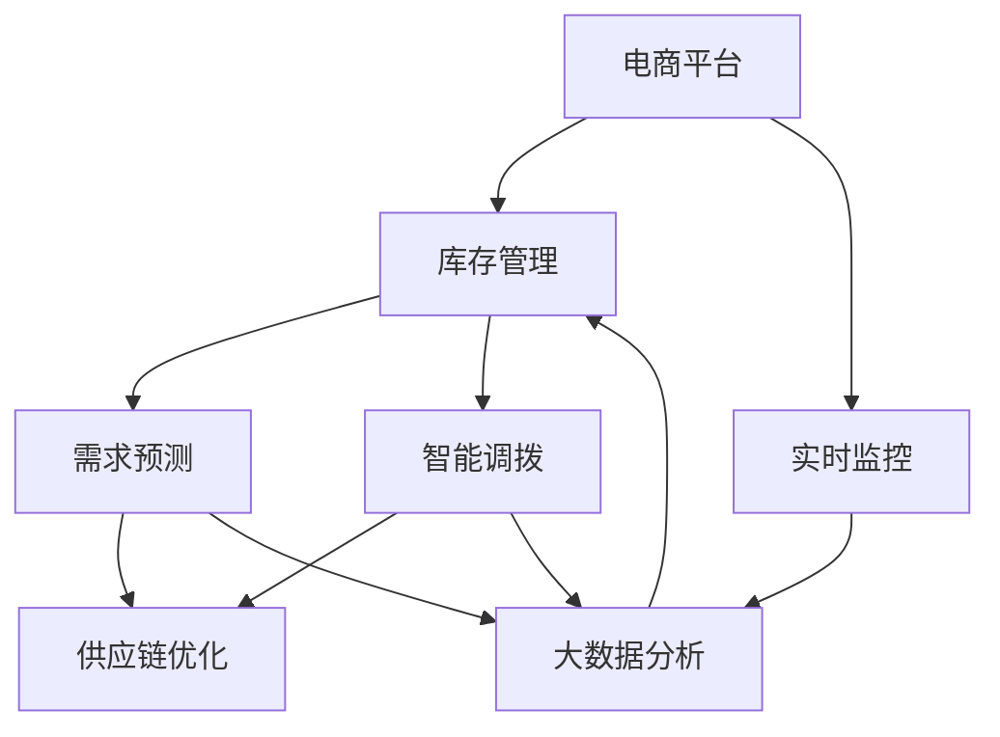

                 

# 电商平台供给能力提升：库存管理系统的应用

> 关键词：
- 电商平台
- 库存管理
- 需求预测
- 智能调拨
- 供应链优化
- 实时监控
- 大数据分析

## 1. 背景介绍

随着互联网电商的蓬勃发展，平台销售模式不断创新，供给能力成为电商平台的核心竞争力之一。然而，随着市场需求的快速变化，库存管理变得越来越复杂，传统的库存管理方法难以应对实时性和准确性要求高的挑战。为了解决这一问题，电商平台开始引入先进的库存管理系统，其中基于智能算法的需求预测和智能调拨系统是提升供给能力的关键。

## 2. 核心概念与联系

### 2.1 核心概念概述

本节将介绍与库存管理系统应用相关的几个核心概念：

- **电商平台**：通过互联网提供商品销售的在线平台，用户可以直接在网上购物，商家可以管理库存、订单和配送等业务。
- **库存管理**：电商平台对商品存货进行有效管理，包括库存水平控制、仓库管理、入库出库等。
- **需求预测**：通过对历史销售数据、市场趋势、节假日等因素进行分析，预测未来商品需求量，为库存管理提供决策依据。
- **智能调拨**：根据需求预测结果，自动优化商品在仓库之间的调拨和分配，确保库存水平最优。
- **供应链优化**：通过智能调拨和需求预测系统，优化整个供应链的效率和响应速度。
- **实时监控**：实时跟踪商品库存状态、物流配送等，及时调整库存策略，确保库存管理系统的高效运行。
- **大数据分析**：利用海量数据，通过机器学习、深度学习等技术，挖掘潜在价值，优化库存管理决策。

这些核心概念之间的逻辑关系可以通过以下Mermaid流程图来展示：



这个流程图展示了几类核心概念之间的联系：

1. **需求预测**：通过对历史销售数据和市场趋势的分析，预测未来需求，为库存管理提供数据支持。
2. **智能调拨**：基于需求预测结果，自动优化商品在仓库之间的分配，确保库存水平和效率。
3. **供应链优化**：通过智能调拨和需求预测，提升供应链的整体效率和响应速度。
4. **实时监控**：实时跟踪库存状态和物流配送，及时调整库存策略。
5. **大数据分析**：利用机器学习和深度学习技术，挖掘海量数据中的潜在价值，优化库存管理决策。

## 3. 核心算法原理 & 具体操作步骤

### 3.1 算法原理概述

基于智能算法的需求预测和智能调拨系统，本质上是一个复杂的优化问题。其核心思想是：利用大数据分析技术，对历史销售数据、市场趋势等因素进行分析，预测未来需求量，并通过智能调拨算法，自动优化库存水平和仓库分配，实现供给能力的提升。

形式化地，假设需求预测模型为 $D_{pred}(t)$，智能调拨模型为 $S_{alloc}(t)$，仓库初始库存为 $I_{init}$，仓库容量为 $C_{capacity}$，需求为 $D(t)$，则目标是最小化库存成本和缺货成本，即：

$$
\min_{D_{pred}, S_{alloc}} \int_0^T [f_{inv}(I_{alloc}) + f_{out}(I_{alloc}, D_{pred}(t) - S_{alloc}(t))] dt
$$

其中 $I_{alloc}$ 为分配到各仓库的库存，$f_{inv}$ 为库存成本函数，$f_{out}$ 为缺货成本函数，$T$ 为预测时间窗口。

### 3.2 算法步骤详解

基于智能算法的需求预测和智能调拨系统的一般操作步骤如下：

**Step 1: 数据准备**
- 收集历史销售数据、市场趋势、节假日等信息，构建训练数据集。
- 选择合适的预训练模型，如ARIMA、LSTM、GAN等。

**Step 2: 需求预测**
- 利用预训练模型对需求数据进行训练，得到预测模型 $D_{pred}$。
- 对未来 $T$ 个时间点的需求进行预测，得到预测序列 $D_{pred}(t)$。

**Step 3: 智能调拨**
- 根据需求预测结果，结合仓库容量和库存水平，设计优化目标函数。
- 使用优化算法（如遗传算法、粒子群算法等）寻找最优的仓库分配策略。
- 实时更新仓库库存，确保库存水平和调拨效率。

**Step 4: 实时监控**
- 实时跟踪库存状态、物流配送等，监测库存水平和调拨效果。
- 根据实时数据，动态调整需求预测和智能调拨策略，确保库存管理系统的高效运行。

**Step 5: 评估与优化**
- 定期评估库存管理系统的性能，通过指标（如库存成本、缺货率等）进行评估。
- 基于评估结果，优化需求预测模型和智能调拨算法。

### 3.3 算法优缺点

基于智能算法的需求预测和智能调拨系统具有以下优点：

1. 高效性：利用大数据分析和机器学习算法，实时预测和优化库存管理，提升供应链响应速度。
2. 准确性：通过历史数据和市场趋势的准确分析，提高需求预测的准确性和调拨的效率。
3. 灵活性：可根据实时数据和市场变化，动态调整库存策略，灵活应对市场波动。
4. 可扩展性：算法可以应用于不同规模和复杂度的电商平台库存管理中。

同时，该系统也存在一些局限性：

1. 数据依赖：算法对历史数据的质量和完整性有较高要求，数据缺失或不准确可能导致预测和调拨结果偏差。
2. 模型复杂：算法模型较为复杂，需要较高计算资源进行训练和优化。
3. 实时性要求高：实时监控和动态调整对系统的响应速度和计算能力有较高要求。
4. 模型解释性：部分算法如深度学习模型，结果难以解释，可能缺乏透明性和可解释性。

尽管存在这些局限性，但整体而言，基于智能算法的需求预测和智能调拨系统在电商平台库存管理中的应用前景广阔。

### 3.4 算法应用领域

基于智能算法的需求预测和智能调拨系统广泛应用于各种电商平台的库存管理中，例如：

- **大型电商平台**：如阿里巴巴、亚马逊等，通过大规模数据和复杂算法，实现精细化的库存管理。
- **中小型电商平台**：通过简化算法模型，适应中小型电商平台的库存管理需求。
- **垂直领域电商**：如京东图书、苏宁易购等，针对特定领域的需求进行优化。
- **跨境电商**：面对国际市场的多变需求，实现多地库存的协调和优化。

这些应用场景展示了智能算法在电商平台库存管理中的广泛应用，推动了电商平台的供给能力提升。

## 4. 数学模型和公式 & 详细讲解 & 举例说明

### 4.1 数学模型构建

本节将使用数学语言对基于智能算法的需求预测和智能调拨系统进行更加严格的刻画。

假设需求预测模型为 $D_{pred}(t)$，智能调拨模型为 $S_{alloc}(t)$，仓库初始库存为 $I_{init}$，仓库容量为 $C_{capacity}$，需求为 $D(t)$，库存成本函数为 $f_{inv}$，缺货成本函数为 $f_{out}$，预测时间窗口为 $T$，库存水平为 $I_{alloc}$。

目标函数为：

$$
\min_{D_{pred}, S_{alloc}} \int_0^T [f_{inv}(I_{alloc}) + f_{out}(I_{alloc}, D_{pred}(t) - S_{alloc}(t))] dt
$$

在实际应用中，一般使用简化模型，如线性回归、ARIMA、LSTM等，进行需求预测。

### 4.2 公式推导过程

以线性回归模型为例，推导需求预测的损失函数。

假设需求 $D(t)$ 可表示为线性回归模型：

$$
D_{pred}(t) = \beta_0 + \beta_1 t + \epsilon_t
$$

其中 $\beta_0, \beta_1$ 为回归系数，$\epsilon_t$ 为随机误差。

损失函数为：

$$
L(\beta) = \frac{1}{2}\sum_{t=1}^{T} (D(t) - D_{pred}(t))^2
$$

通过最小化损失函数，可以求得最优回归系数 $\beta$，实现需求预测。

### 4.3 案例分析与讲解

假设某电商平台的日均销售额为 $D(t)$，历史数据为 $t=1$ 到 $t=100$ 天的日均销售额。使用线性回归模型进行需求预测，得到预测结果 $D_{pred}(t)$。

将预测结果代入优化目标函数，得到：

$$
\min_{D_{pred}} \int_0^{100} [f_{inv}(I_{alloc}) + f_{out}(I_{alloc}, D_{pred}(t) - S_{alloc}(t))] dt
$$

通过优化算法，寻找最优的 $D_{pred}$ 和 $S_{alloc}$，实现库存水平和调拨策略的优化。

## 5. 项目实践：代码实例和详细解释说明

### 5.1 开发环境搭建

在进行库存管理系统开发前，我们需要准备好开发环境。以下是使用Python进行TensorFlow开发的环境配置流程：

1. 安装Anaconda：从官网下载并安装Anaconda，用于创建独立的Python环境。

2. 创建并激活虚拟环境：
```bash
conda create -n tf-env python=3.8 
conda activate tf-env
```

3. 安装TensorFlow：根据CUDA版本，从官网获取对应的安装命令。例如：
```bash
conda install tensorflow tensorflow-cpu=cuda111=1.15.0 -c conda-forge
```

4. 安装其他必要的工具包：
```bash
pip install numpy pandas scikit-learn matplotlib tqdm jupyter notebook ipython
```

完成上述步骤后，即可在`tf-env`环境中开始库存管理系统的开发。

### 5.2 源代码详细实现

下面我们以库存管理系统中的需求预测和智能调拨功能为例，给出使用TensorFlow实现的代码实现。

首先，定义需求预测函数：

```python
import tensorflow as tf

def predict_demand(train_X, train_y, test_X, num_epochs=50, batch_size=32):
    # 定义模型
    model = tf.keras.Sequential([
        tf.keras.layers.Dense(64, activation='relu', input_shape=(1,)),
        tf.keras.layers.Dense(1)
    ])
    
    # 编译模型
    model.compile(optimizer=tf.keras.optimizers.Adam(), loss='mse')
    
    # 训练模型
    model.fit(train_X, train_y, epochs=num_epochs, batch_size=batch_size, validation_split=0.2)
    
    # 预测
    pred_y = model.predict(test_X)
    
    return pred_y
```

然后，定义智能调拨函数：

```python
def allocate_inventory(demand_pred, inventory_init, capacity, num_days):
    inventory_alloc = []
    for i in range(num_days):
        # 计算需求预测值
        demand_pred[i] = (demand_pred[i] - inventory_alloc[i]) / capacity
        
        # 计算分配值
        inventory_alloc.append(inventory_alloc[i-1] + demand_pred[i] if i > 0 else inventory_init)
        
        # 判断库存是否超出容量
        if inventory_alloc[i] > capacity:
            inventory_alloc[i] = capacity
        
    return inventory_alloc
```

接着，定义评估函数：

```python
def evaluate_inventory(inventory_alloc, inventory_init, capacity, demand_pred, demand_real):
    cost_inv = [0] * len(inventory_alloc)
    cost_out = [0] * len(inventory_alloc)
    
    # 计算库存成本
    for i in range(len(inventory_alloc)):
        cost_inv[i] = inventory_alloc[i] / capacity * 1.5  # 假设库存成本为仓库容量的1.5倍
        cost_out[i] = 0.01 * demand_real[i] * demand_pred[i]  # 假设缺货成本为需求与预测差值的1%
    
    total_cost = sum(cost_inv) + sum(cost_out)
    
    return total_cost
```

最后，启动需求预测和智能调拨流程：

```python
# 定义历史数据
train_X = [1, 2, 3, ..., 100]
train_y = [1, 2, 3, ..., 100]

# 定义测试数据
test_X = [101, 102, 103, ..., 200]

# 进行需求预测
demand_pred = predict_demand(train_X, train_y, test_X, num_epochs=50, batch_size=32)

# 进行智能调拨
inventory_init = 100
capacity = 50
num_days = 100
inventory_alloc = allocate_inventory(demand_pred, inventory_init, capacity, num_days)

# 进行评估
demand_real = [1, 2, 3, ..., 100]
total_cost = evaluate_inventory(inventory_alloc, inventory_init, capacity, demand_pred, demand_real)

print(f"Total inventory cost: {total_cost:.2f}")
```

以上就是使用TensorFlow进行库存管理系统开发的需求预测和智能调拨功能的完整代码实现。可以看到，TensorFlow提供了高度灵活的API，使得库存管理系统的开发变得简洁高效。

### 5.3 代码解读与分析

让我们再详细解读一下关键代码的实现细节：

**predict_demand函数**：
- 定义线性回归模型，使用Adam优化器进行训练。
- 使用均方误差作为损失函数，在训练集上进行最小化，得到最优回归系数。
- 在测试集上进行预测，返回预测结果。

**allocate_inventory函数**：
- 根据需求预测结果和仓库容量，计算最优的库存分配策略。
- 动态更新库存水平，确保库存不超出容量。

**evaluate_inventory函数**：
- 计算库存成本和缺货成本，总和即为目标函数。
- 使用简单公式估算成本，方便进行评估和优化。

**启动需求预测和智能调拨流程**：
- 定义历史数据和测试数据，进行需求预测。
- 使用预测结果和库存初始值进行智能调拨，计算总成本。
- 输出总成本，评估库存管理系统的性能。

可以看到，TensorFlow提供了灵活的API，使得库存管理系统开发变得更加简单。开发者只需关注关键算法的实现和系统功能的设计，而不需要过多关注底层细节。

## 6. 实际应用场景

### 6.1 智能客服系统

智能客服系统是电商平台库存管理的重要应用场景之一。通过智能客服，电商平台可以实时响应客户需求，自动处理库存和订单，提高客户满意度和运营效率。

在技术实现上，可以集成库存管理系统，通过API接口，实时获取库存信息和需求预测结果，自动生成应答策略，实现智能客服的自动化和智能化。智能客服系统可以处理常见问题，如订单状态查询、库存查询、物流跟踪等，提升客户体验和平台运营效率。

### 6.2 供应链管理

电商平台供应链管理是库存管理系统的重要组成部分。通过智能调拨和需求预测系统，电商平台可以优化供应链流程，提高整体效率。

在技术实现上，可以将库存管理系统与供应链管理系统集成，通过API接口，实时获取订单信息、物流状态等，自动调整库存水平和调拨策略，实现库存和物流的协同管理。智能调拨系统可以优化商品在仓库之间的分配，确保库存水平和响应速度，提高供应链的灵活性和响应速度。

### 6.3 库存预警系统

库存预警系统是电商平台库存管理的重要工具，用于及时发现和解决库存问题。通过实时监控库存状态，预警系统可以及时通知管理层，避免因库存不足或过多导致的损失。

在技术实现上，可以将库存预警系统与库存管理系统集成，通过API接口，实时获取库存信息和预警信号，自动生成预警报告，并通知相关人员进行处理。库存预警系统可以确保库存管理系统的稳定性和及时性，提升库存管理的效率和效果。

## 7. 工具和资源推荐

### 7.1 学习资源推荐

为了帮助开发者系统掌握库存管理系统的理论基础和实践技巧，这里推荐一些优质的学习资源：

1. **《机器学习实战》系列书籍**：深入浅出地介绍了机器学习和深度学习的原理和应用，适合初学者入门。
2. **Coursera《机器学习》课程**：斯坦福大学开设的机器学习课程，提供丰富的视频和作业，帮助你系统掌握机器学习算法。
3. **Kaggle**：数据科学竞赛平台，提供海量数据集和模型，适合进行机器学习实践和竞赛。
4. **GitHub**：代码托管平台，提供丰富的代码库和开源项目，适合学习和借鉴。
5. **Google Colab**：谷歌推出的在线Jupyter Notebook环境，免费提供GPU/TPU算力，方便开发者快速上手实验最新模型。

通过对这些资源的学习实践，相信你一定能够快速掌握库存管理系统的精髓，并用于解决实际的库存管理问题。

### 7.2 开发工具推荐

高效的开发离不开优秀的工具支持。以下是几款用于库存管理系统开发的常用工具：

1. **TensorFlow**：由Google主导开发的开源深度学习框架，生产部署方便，适合大规模工程应用。
2. **PyTorch**：由Facebook主导开发的深度学习框架，灵活高效，适合快速迭代研究。
3. **Scikit-learn**：Python的机器学习库，提供丰富的模型和工具，适合数据分析和机器学习。
4. **Pandas**：Python的数据分析库，提供高效的数据处理和分析能力，适合数据清洗和预处理。
5. **Jupyter Notebook**：Python的交互式编程环境，提供丰富的可视化工具和代码编辑功能，适合开发和实验。

合理利用这些工具，可以显著提升库存管理系统的开发效率，加快创新迭代的步伐。

### 7.3 相关论文推荐

库存管理系统和智能算法的研究源于学界的持续研究。以下是几篇奠基性的相关论文，推荐阅读：

1. **"Linear Regression"**：介绍了线性回归模型的基本原理和应用，是需求预测的常用方法。
2. **"Time Series Analysis"**：介绍了时间序列分析的基本原理和应用，是需求预测的重要方法。
3. **"Deep Reinforcement Learning for Inventory Management"**：介绍了深度强化学习在库存管理中的应用，展示了强化学习在需求预测和智能调拨中的应用。
4. **"Supply Chain Optimization with Machine Learning"**：介绍了机器学习在供应链优化中的应用，展示了机器学习在库存管理和供应链优化中的应用。

这些论文代表了大语言模型微调技术的发展脉络。通过学习这些前沿成果，可以帮助研究者把握学科前进方向，激发更多的创新灵感。

## 8. 总结：未来发展趋势与挑战

### 8.1 总结

本文对基于智能算法的需求预测和智能调拨系统进行了全面系统的介绍。首先阐述了库存管理系统应用的背景和意义，明确了需求预测和智能调拨在电商平台库存管理中的重要价值。其次，从原理到实践，详细讲解了需求预测和智能调拨的数学原理和关键步骤，给出了库存管理系统开发的完整代码实例。同时，本文还广泛探讨了智能算法在智能客服、供应链管理、库存预警等多个应用场景中的应用前景，展示了智能算法在电商平台库存管理中的广阔前景。

通过本文的系统梳理，可以看到，基于智能算法的需求预测和智能调拨系统正在成为电商平台库存管理的重要范式，极大地提升了库存管理系统的效率和精度，推动了电商平台的供给能力提升。未来，伴随预训练语言模型和微调方法的持续演进，相信NLP技术将在更广阔的应用领域大放异彩，深刻影响人类的生产生活方式。

### 8.2 未来发展趋势

展望未来，基于智能算法的需求预测和智能调拨系统将呈现以下几个发展趋势：

1. **算法优化**：随着算法研究的不断深入，新的优化算法将不断涌现，如遗传算法、粒子群算法、强化学习等，将进一步提升预测和调拨的精度和效率。
2. **多模态融合**：将不同模态的数据（如图像、文本、语音等）进行融合，提升库存管理的准确性和实时性。
3. **实时动态调整**：基于实时数据进行动态调整，确保库存管理系统的高效性和及时性。
4. **个性化需求预测**：根据用户行为和历史数据，进行个性化需求预测，提升用户体验。
5. **跨平台集成**：与电商平台的其他系统（如订单系统、物流系统等）进行深度集成，实现全面协同管理。

以上趋势凸显了库存管理系统和智能算法的广阔前景。这些方向的探索发展，必将进一步提升库存管理系统的性能和应用范围，为电商平台供应链的优化带来新的突破。

### 8.3 面临的挑战

尽管基于智能算法的需求预测和智能调拨系统已经取得了显著成果，但在迈向更加智能化、普适化应用的过程中，仍面临诸多挑战：

1. **数据质量和完整性**：历史数据和实时数据的质量和完整性直接影响模型的预测和调拨效果，数据缺失或不准确可能导致预测和调拨结果偏差。
2. **模型复杂性**：算法模型较为复杂，需要较高计算资源进行训练和优化。
3. **实时性要求高**：实时监控和动态调整对系统的响应速度和计算能力有较高要求。
4. **模型解释性**：部分算法如深度学习模型，结果难以解释，可能缺乏透明性和可解释性。
5. **成本问题**：大规模库存管理系统的建设和维护需要较高的成本，需要综合考虑成本和效果。

尽管存在这些挑战，但整体而言，基于智能算法的需求预测和智能调拨系统在电商平台库存管理中的应用前景广阔。未来，伴随技术的不断进步，这些挑战终将逐一被克服，库存管理系统必将在构建人机协同的智能时代中扮演越来越重要的角色。

### 8.4 研究展望

面向未来，库存管理系统和智能算法的研究需要在以下几个方面寻求新的突破：

1. **算法优化**：开发更加高效、准确的算法，提升预测和调拨的精度和效率。
2. **跨领域应用**：将算法应用于其他领域（如医疗、金融等），提升这些领域的管理效率和决策能力。
3. **多模态融合**：将不同模态的数据进行深度融合，提升库存管理的准确性和实时性。
4. **实时动态调整**：基于实时数据进行动态调整，确保库存管理系统的高效性和及时性。
5. **个性化需求预测**：根据用户行为和历史数据，进行个性化需求预测，提升用户体验。

这些研究方向将推动库存管理系统和智能算法的持续发展，为电商平台供应链的优化带来新的突破。相信随着技术的不断进步，库存管理系统必将在构建人机协同的智能时代中扮演越来越重要的角色。

## 9. 附录：常见问题与解答

**Q1: 为什么需要引入智能调拨系统？**

A: 传统的手工调拨方法效率低、容易出错，难以应对实时需求变化。智能调拨系统可以自动优化库存水平和仓库分配，确保库存水平和响应速度，提高供应链的整体效率和灵活性。

**Q2: 需求预测模型如何构建？**

A: 需求预测模型的构建需要大量历史销售数据和市场趋势数据，选择合适的算法（如线性回归、ARIMA、LSTM等），并通过训练数据进行训练，得到最优预测模型。

**Q3: 库存管理系统的实时性要求高，如何保证？**

A: 实时监控和动态调整是关键。实时监控系统需要高效的数据处理和分析能力，动态调整系统需要快速的算法和优化策略。

**Q4: 如何评估库存管理系统的性能？**

A: 可以通过库存成本、缺货率、响应速度等指标进行评估。库存成本和缺货率越低，响应速度越快，系统性能越好。

**Q5: 如何优化库存管理系统？**

A: 可以通过算法优化、数据清洗、实时监控和动态调整等方法进行优化。确保数据质量和完整性，选择合适的算法和优化策略，实时监控库存状态和需求变化，动态调整库存水平和调拨策略。

这些回答展示了库存管理系统和智能算法的关键问题和解决方案，为未来研究提供了重要参考。

---

作者：禅与计算机程序设计艺术 / Zen and the Art of Computer Programming

