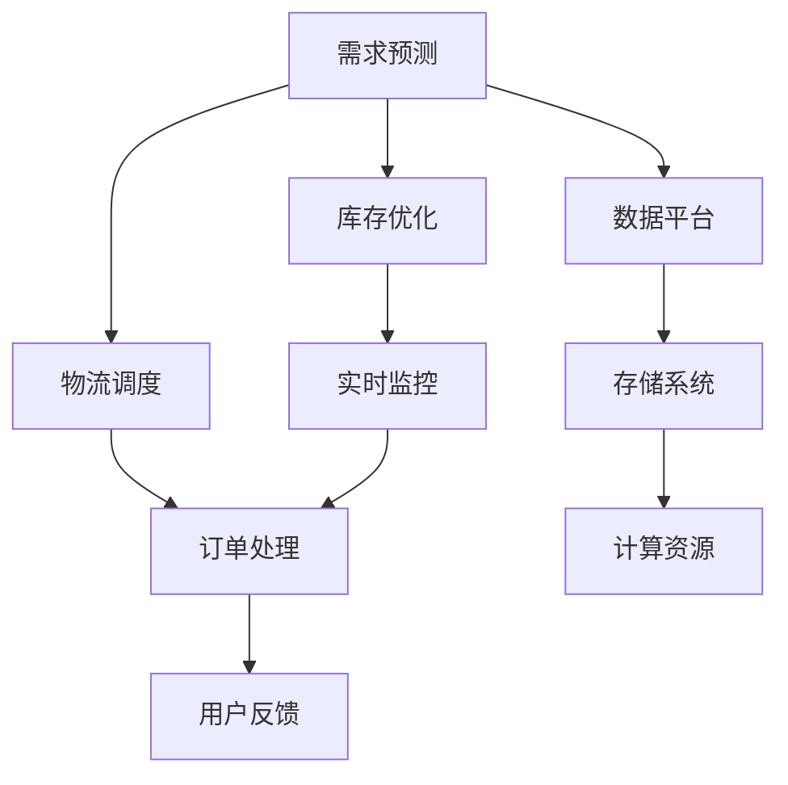

                 

# 电商平台供给能力提升：数据分析和实时监控

## 1. 背景介绍

### 1.1 问题由来

随着电商行业的快速发展，电商平台成为连接消费者和商家、推动消费增长的重要平台。电商平台在面临激烈市场竞争的同时，也要应对商品库存管理、供应链优化、物流配送等复杂运营挑战。其中，供给能力提升是电商平台的核心需求之一，旨在通过数据分析和实时监控，提高商品的供给效率，优化库存水平，提升用户满意度。

近年来，人工智能和大数据技术的广泛应用，为电商平台供给能力提升提供了新的技术路径。通过数据分析和实时监控，电商平台能够更加精准地预测商品需求、优化库存管理、实时调度物流配送，从而提高运营效率，增强市场竞争力。

### 1.2 问题核心关键点

电商平台供给能力提升涉及多个关键环节，包括但不限于以下几方面：

1. **需求预测**：通过分析历史销售数据、用户行为数据、市场趋势等，预测未来商品需求，为库存管理和物流配送提供依据。
2. **库存优化**：在预测需求的基础上，合理分配商品库存，避免库存过剩或缺货，确保商品及时供应。
3. **物流调度**：实时监控物流状态，动态调整配送策略，确保商品按时送达，提升用户体验。
4. **数据分析平台**：构建高效的数据分析平台，集成多源数据，支持复杂的模型算法，提供实时决策支持。
5. **系统架构**：设计稳定、可扩展的系统架构，支持海量数据处理和高并发访问，确保系统性能和稳定性。

## 2. 核心概念与联系

### 2.1 核心概念概述

为更好地理解电商平台供给能力提升的原理和架构，本节将介绍几个密切相关的核心概念：

- **需求预测**：通过数据分析方法，预测商品在未来一段时间内的销售量。常见的方法包括时间序列分析、回归模型、深度学习等。
- **库存优化**：基于需求预测结果，动态调整库存水平，确保商品供需平衡。
- **物流调度**：实时监控物流状态，动态调整配送策略，确保商品按时送达。
- **数据分析平台**：构建集成的数据处理和分析平台，支持复杂的数据建模和实时计算。
- **系统架构**：设计稳定、可扩展的系统架构，支持海量数据处理和高并发访问。

这些核心概念之间的逻辑关系可以通过以下Mermaid流程图来展示：



这个流程图展示了大电商平台供给能力提升的核心概念及其之间的关系：

1. 通过需求预测获取未来需求，进而优化库存。
2. 实时监控物流状态，动态调整配送策略，确保商品按时送达。
3. 订单处理和用户反馈环节，进一步优化商品供给。
4. 数据分析平台支撑需求预测和库存优化，同时对实时监控结果进行评估和调整。
5. 存储系统和计算资源为数据分析和实时监控提供底层支撑。

## 3. 核心算法原理 & 具体操作步骤

### 3.1 算法原理概述

电商平台供给能力提升的核心算法包括需求预测算法、库存优化算法和物流调度算法。这些算法通常以机器学习、深度学习等先进技术为基础，通过数据分析和实时监控，提高商品供给效率。

- **需求预测算法**：基于时间序列分析、回归模型、深度学习等方法，对历史销售数据进行分析，预测未来需求。
- **库存优化算法**：基于需求预测结果，动态调整库存水平，确保商品供需平衡。
- **物流调度算法**：实时监控物流状态，动态调整配送策略，确保商品按时送达。

### 3.2 算法步骤详解

以需求预测算法为例，详细讲解算法步骤：

1. **数据收集**：收集历史销售数据、用户行为数据、市场趋势数据等。
2. **数据预处理**：对数据进行清洗、归一化等处理，去除异常值和噪声。
3. **模型选择**：根据数据特点选择合适的预测模型，如时间序列模型、回归模型、LSTM等。
4. **模型训练**：使用历史数据训练模型，调整模型参数，使其能够准确预测未来需求。
5. **模型评估**：使用测试数据评估模型预测效果，选择最优模型。
6. **预测应用**：将模型应用到实时数据中，预测未来需求，为库存管理和物流调度提供依据。

### 3.3 算法优缺点

需求预测算法的优缺点如下：

**优点**：
- 基于历史数据，能够准确预测未来需求。
- 可以提前调整库存和物流策略，避免库存过剩或缺货。
- 实时监控物流状态，动态调整配送策略，提高用户体验。

**缺点**：
- 数据质量直接影响预测结果，需要投入大量资源进行数据清洗和处理。
- 模型选择和参数调整需要专业知识，对算法工程要求较高。
- 预测结果可能存在偏差，需要结合实际情况进行调整。

### 3.4 算法应用领域

需求预测算法、库存优化算法和物流调度算法在多个领域都有广泛应用：

- **零售行业**：通过需求预测优化库存管理，提升销售效率。
- **电商行业**：实时监控物流状态，优化配送策略，提高用户体验。
- **金融行业**：预测股票市场趋势，制定投资策略。
- **制造业**：预测生产需求，优化生产计划，提高生产效率。

## 4. 数学模型和公式 & 详细讲解 & 举例说明

### 4.1 数学模型构建

需求预测算法通常使用时间序列分析、回归模型、深度学习等方法。这里以时间序列模型为例，详细讲解模型的构建过程。

假设历史销售数据为 $y_t = \{y_{t-1}, y_{t-2}, ..., y_0\}$，需求预测目标为 $y_{t+1}$。时间序列模型可以表示为：

$$ y_{t+1} = f(y_t, y_{t-1}, ..., y_0) $$

其中，$f$ 为时间序列模型，可以基于历史数据训练得到。

### 4.2 公式推导过程

以 ARIMA（自回归移动平均模型）为例，推导需求预测的公式。

ARIMA模型的公式为：

$$ y_{t+1} = c + \sum_{i=1}^{p} \phi_i y_{t-i} + \sum_{j=1}^{d} \theta_j \epsilon_{t-j} + \sum_{k=1}^{q} \Phi_k y_{t-k} $$

其中，$\phi_i$ 和 $\Phi_k$ 为自回归和移动平均系数，$d$ 为差分阶数，$\epsilon_{t-j}$ 为随机误差项。

### 4.3 案例分析与讲解

以电商平台的销售额预测为例，使用ARIMA模型进行需求预测。具体步骤如下：

1. 收集历史销售数据 $y_t$。
2. 对数据进行差分处理，使其变为平稳序列。
3. 使用最小二乘法或最大似然法训练ARIMA模型，得到模型参数 $\phi_i$、$\Phi_k$ 和差分阶数 $d$。
4. 将新数据 $y_t$ 代入模型，预测 $y_{t+1}$。

## 5. 项目实践：代码实例和详细解释说明

### 5.1 开发环境搭建

在进行电商需求预测的项目实践前，我们需要准备好开发环境。以下是使用Python进行Pandas和Scikit-Learn开发的环境配置流程：

1. 安装Anaconda：从官网下载并安装Anaconda，用于创建独立的Python环境。

2. 创建并激活虚拟环境：
```bash
conda create -n demand-prediction python=3.8 
conda activate demand-prediction
```

3. 安装Pandas、Scikit-Learn等工具包：
```bash
pip install pandas scikit-learn matplotlib
```

4. 安装其他相关工具包：
```bash
pip install numpy numpydoc sklearn-utils
```

完成上述步骤后，即可在`demand-prediction`环境中开始项目实践。

### 5.2 源代码详细实现

下面是使用Pandas和Scikit-Learn进行电商需求预测的Python代码实现。

```python
import pandas as pd
from sklearn.metrics import mean_squared_error
from sklearn.metrics import mean_absolute_error
from sklearn.model_selection import train_test_split
from sklearn.linear_model import ARIMA
from sklearn.linear_model import SARIMAX

# 读取数据
data = pd.read_csv('sales_data.csv', index_col='date', parse_dates=True)

# 处理数据
data = data.dropna()

# 时间序列转换
data = data['sales'].rolling(window=12).mean()

# 分割数据集
train, test = train_test_split(data, test_size=0.2, shuffle=False)

# 构建模型
model = SARIMAX(train, order=(1, 1, 1), seasonal_order=(1, 1, 1, 1))

# 训练模型
model.fit(disp=False)

# 预测未来需求
forecast = model.forecast(steps=1)

# 评估模型
print('MAE:', mean_absolute_error(test, forecast))
print('RMSE:', np.sqrt(mean_squared_error(test, forecast)))
```

### 5.3 代码解读与分析

让我们再详细解读一下关键代码的实现细节：

**读取和处理数据**：
- 使用Pandas的`read_csv`函数读取销售数据，设置`index_col`参数为`'date'`，确保数据按日期顺序排列。
- 使用`dropna`函数去除缺失值。
- 对销售额进行滑动平均处理，使其变为平稳序列。

**模型训练与预测**：
- 使用Scikit-Learn的`SARIMAX`模型，指定模型参数`order=(1, 1, 1)`和`seasonal_order=(1, 1, 1, 1)`。
- 使用`fit`函数训练模型，`disp=False`表示不输出训练过程中的细节。
- 使用`forecast`函数预测未来需求，`steps=1`表示预测未来一个周期的销售量。

**模型评估**：
- 使用Scikit-Learn的`mean_absolute_error`和`mean_squared_error`函数评估模型预测效果。
- 计算均方误差和均绝对误差，输出结果。

## 6. 实际应用场景

### 6.1 电商平台库存优化

在电商平台上，库存优化是提升供给能力的重要环节。通过需求预测，电商平台可以动态调整库存水平，避免库存过剩或缺货，从而提高运营效率。

具体应用步骤如下：

1. 收集历史销售数据，分析需求趋势。
2. 使用需求预测算法，预测未来销售量。
3. 根据预测结果，动态调整库存水平，确保商品供需平衡。
4. 实时监控库存状态，及时补货或清货，避免缺货或库存过剩。

### 6.2 物流配送调度

电商平台的物流配送调度需要实时监控物流状态，动态调整配送策略，确保商品按时送达，提升用户体验。

具体应用步骤如下：

1. 收集物流数据，包括订单状态、配送时间、位置等信息。
2. 实时监控物流状态，动态调整配送策略。
3. 优化配送路线，减少配送时间和成本。
4. 及时处理异常情况，如天气变化、交通堵塞等，确保商品按时送达。

### 6.3 数据平台构建

电商平台需要构建高效的数据分析平台，集成多源数据，支持复杂的模型算法，提供实时决策支持。

具体应用步骤如下：

1. 收集多源数据，包括用户行为数据、市场趋势数据、物流数据等。
2. 构建集成的数据分析平台，集成多种数据源和算法模型。
3. 提供实时数据处理和分析服务，支持复杂的模型训练和预测。
4. 支持可视化和报告功能，帮助业务决策者快速获取洞察。

### 6.4 未来应用展望

随着技术的不断进步，电商平台供给能力提升将呈现以下几个发展趋势：

1. **智能预测**：结合机器学习和深度学习技术，实现更精准的需求预测，提高库存管理效率。
2. **实时调度**：通过实时监控和智能调度算法，实现动态物流配送，提升用户体验。
3. **多模态数据融合**：结合多种数据源，如用户行为数据、社交媒体数据等，提供更全面的数据分析和预测。
4. **实时监控**：通过实时监控系统，及时发现异常情况，提高问题处理效率。
5. **自动化部署**：通过自动化部署工具，快速部署和迭代模型，提高系统部署效率。

## 7. 工具和资源推荐

### 7.1 学习资源推荐

为了帮助开发者系统掌握电商平台供给能力提升的理论基础和实践技巧，这里推荐一些优质的学习资源：

1. **《Python数据科学手册》**：一本系统介绍Python数据科学栈的书籍，涵盖Pandas、Scikit-Learn、TensorFlow等工具。
2. **《深度学习入门》**：一本介绍深度学习基础和应用实践的书籍，涵盖时间序列分析、回归模型、深度学习等方法。
3. **Kaggle**：一个数据科学竞赛平台，提供大量真实数据集和机器学习竞赛，帮助开发者提升实战能力。
4. **Coursera**：一个在线学习平台，提供多门数据科学和机器学习相关课程，如时间序列分析、机器学习等。
5. **GitHub**：一个代码托管平台，提供大量开源项目和代码示例，帮助开发者学习实践。

通过对这些资源的学习实践，相信你一定能够快速掌握电商平台供给能力提升的精髓，并用于解决实际的电商运营问题。

### 7.2 开发工具推荐

高效的开发离不开优秀的工具支持。以下是几款用于电商平台供给能力提升开发的常用工具：

1. **Pandas**：一个高效的数据分析工具，支持数据清洗、数据处理和数据分析。
2. **Scikit-Learn**：一个强大的机器学习工具包，支持多种机器学习算法和模型。
3. **TensorFlow**：一个深度学习框架，支持复杂的神经网络模型训练和预测。
4. **Jupyter Notebook**：一个交互式笔记本环境，支持数据可视化和代码开发。
5. **Hadoop**：一个大数据处理框架，支持分布式数据处理和存储。

合理利用这些工具，可以显著提升电商平台供给能力提升任务的开发效率，加快创新迭代的步伐。

### 7.3 相关论文推荐

电商平台供给能力提升的研究源于学界的持续研究。以下是几篇奠基性的相关论文，推荐阅读：

1. **"Sales Forecasting with LSTM Networks"**：提出基于LSTM的时间序列预测模型，用于电商平台销售预测。
2. **"Inventory Management in E-commerce Platforms"**：介绍电商平台库存管理的方法，包括需求预测、库存优化和物流调度。
3. **"Real-Time Logistics Scheduling for E-commerce"**：提出基于强化学习的物流调度算法，用于电商平台物流配送调度。
4. **"Data Mining and Statistical Learning"**：一本系统介绍数据挖掘和机器学习的书籍，涵盖多种数据建模方法。
5. **"Machine Learning: A Probabilistic Perspective"**：一本介绍机器学习基础和算法方法的书籍，涵盖时间序列分析、回归模型、深度学习等方法。

这些论文代表了大电商平台供给能力提升的研究方向，通过学习这些前沿成果，可以帮助研究者把握学科前进方向，激发更多的创新灵感。

## 8. 总结：未来发展趋势与挑战

### 8.1 总结

本文对电商平台供给能力提升的需求预测、库存优化和物流调度等环节进行了全面系统的介绍。首先阐述了电商平台的运营挑战和供给能力提升的重要性和紧迫性。其次，从原理到实践，详细讲解了需求预测算法、库存优化算法和物流调度算法的核心算法步骤，并提供了完整的代码实现。同时，本文还探讨了这些算法在电商行业的应用场景，展示了算法的实际效果和前景。

通过本文的系统梳理，可以看到，电商平台供给能力提升涉及多个复杂环节，需要结合先进的数据分析和实时监控技术。合理运用这些技术和算法，可以有效提升电商平台的运营效率，增强市场竞争力，创造更高的商业价值。

### 8.2 未来发展趋势

展望未来，电商平台供给能力提升技术将呈现以下几个发展趋势：

1. **智能预测**：结合机器学习和深度学习技术，实现更精准的需求预测，提高库存管理效率。
2. **实时调度**：通过实时监控和智能调度算法，实现动态物流配送，提升用户体验。
3. **多模态数据融合**：结合多种数据源，如用户行为数据、社交媒体数据等，提供更全面的数据分析和预测。
4. **实时监控**：通过实时监控系统，及时发现异常情况，提高问题处理效率。
5. **自动化部署**：通过自动化部署工具，快速部署和迭代模型，提高系统部署效率。

以上趋势凸显了电商平台供给能力提升技术的广阔前景。这些方向的探索发展，必将进一步提升电商平台的运营效率，增强市场竞争力，创造更高的商业价值。

### 8.3 面临的挑战

尽管电商平台供给能力提升技术已经取得了一定的进展，但在迈向更加智能化、普适化应用的过程中，它仍面临诸多挑战：

1. **数据质量瓶颈**：数据质量直接影响预测和调度结果，需要投入大量资源进行数据清洗和处理。如何提高数据质量，降低数据清洗成本，是亟需解决的难题。
2. **算法复杂性**：需求预测、库存优化和物流调度的算法较为复杂，需要专业知识和技术支持。如何降低算法复杂性，提高算法易用性，是研究的重点。
3. **实时性要求高**：电商平台需要实时响应市场变化，预测和调度算法需要具备高实时性。如何优化算法性能，提高实时响应能力，是技术突破的关键。
4. **资源消耗大**：大规模数据处理和复杂算法模型训练需要高性能计算资源。如何优化资源消耗，提高系统性能，是技术发展的重要方向。
5. **模型可解释性不足**：电商平台需要具备较高的可解释性，以便业务决策者理解和信任算法结果。如何增强模型可解释性，提升算法透明度，是研究的难点。

### 8.4 研究展望

面对电商平台供给能力提升所面临的种种挑战，未来的研究需要在以下几个方面寻求新的突破：

1. **探索智能预测算法**：结合深度学习和强化学习技术，开发智能化的需求预测算法，提升预测精度和实时性。
2. **优化算法性能**：研究高效的算法实现方法，提高算法的运行效率和实时响应能力。
3. **降低数据清洗成本**：探索新的数据清洗方法，提高数据质量，降低数据清洗成本。
4. **增强模型可解释性**：开发可解释的模型，提供清晰的算法结果和解释，增强算法的透明度和可信任度。
5. **实现自动化部署**：开发自动化部署工具，支持快速部署和迭代模型，提高系统部署效率。

这些研究方向的探索，必将引领电商平台供给能力提升技术迈向更高的台阶，为构建更加高效、智能的电商平台奠定基础。面向未来，电商平台供给能力提升技术还需要与其他AI技术进行更深入的融合，如知识图谱、自然语言处理等，共同推动电商平台的智能化发展。

## 9. 附录：常见问题与解答

**Q1：电商平台的库存管理有哪些关键环节？**

A: 电商平台的库存管理涉及多个关键环节，包括但不限于以下几方面：

1. **需求预测**：通过数据分析方法，预测商品在未来一段时间内的销售量。
2. **库存优化**：基于需求预测结果，动态调整库存水平，确保商品供需平衡。
3. **物流调度**：实时监控物流状态，动态调整配送策略，确保商品按时送达。
4. **数据分析平台**：构建集成的数据处理和分析平台，支持复杂的数据建模和实时计算。
5. **系统架构**：设计稳定、可扩展的系统架构，支持海量数据处理和高并发访问。

**Q2：电商平台的库存管理如何实现实时优化？**

A: 电商平台的库存管理实现实时优化，主要包括以下几个步骤：

1. **数据采集**：实时采集库存状态、订单信息、物流状态等数据。
2. **需求预测**：通过需求预测算法，实时预测未来销售量。
3. **库存调整**：根据需求预测结果，实时调整库存水平，确保商品供需平衡。
4. **物流调度**：实时监控物流状态，动态调整配送策略，确保商品按时送达。
5. **数据分析与反馈**：实时分析库存和物流数据，提供实时反馈，支持业务决策。

**Q3：电商平台的库存管理中，如何避免库存过剩或缺货？**

A: 电商平台的库存管理中，避免库存过剩或缺货，主要通过以下方式实现：

1. **需求预测**：通过数据分析方法，预测未来商品需求，为库存管理和物流调度提供依据。
2. **库存优化**：基于需求预测结果，动态调整库存水平，确保商品供需平衡。
3. **实时监控**：实时监控库存状态，及时补货或清货，避免缺货或库存过剩。
4. **动态调整**：根据实际情况，动态调整库存和物流策略，确保库存水平合理。

**Q4：电商平台的库存管理如何应对季节性变化？**

A: 电商平台的库存管理应对季节性变化，主要通过以下方式实现：

1. **需求预测**：通过时间序列分析等方法，预测季节性需求变化。
2. **库存优化**：根据季节性需求预测结果，动态调整库存水平，确保商品供需平衡。
3. **物流调度**：实时监控物流状态，动态调整配送策略，确保商品按时送达。
4. **数据分析与反馈**：实时分析库存和物流数据，提供实时反馈，支持业务决策。

**Q5：电商平台的库存管理如何提高运营效率？**

A: 电商平台的库存管理提高运营效率，主要通过以下方式实现：

1. **需求预测**：通过数据分析方法，预测未来商品需求，为库存管理和物流调度提供依据。
2. **库存优化**：基于需求预测结果，动态调整库存水平，确保商品供需平衡。
3. **实时监控**：实时监控库存状态，及时补货或清货，避免缺货或库存过剩。
4. **数据分析与反馈**：实时分析库存和物流数据，提供实时反馈，支持业务决策。
5. **自动化部署**：开发自动化部署工具，支持快速部署和迭代模型，提高系统部署效率。

以上问题及解答，帮助读者更好地理解和应用电商平台供给能力提升技术，为电商平台的运营管理提供有力支持。

---

作者：禅与计算机程序设计艺术 / Zen and the Art of Computer Programming

