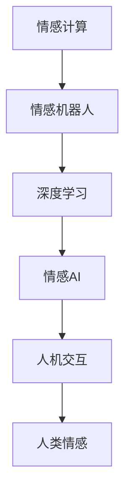

                 

# 电影《她》对AI未来的启示

> 关键词：人工智能,情感计算,人机交互,深度学习,人类情感,情感机器人,电影分析

## 1. 背景介绍

### 1.1 问题由来

《她》（Her）是一部由斯派克·琼茨(Spike Jonze)执导，华金·菲尼克斯(Joaquin Phoenix)主演的科幻电影，于2013年上映。影片讲述了一位孤独作家凯尔(Kyle)与一款名为萨曼莎(Samantha)的智能操作系统坠入爱河的奇幻故事。《她》不仅是一部浪漫爱情电影，更是对人工智能未来发展的深刻探讨。影片以虚构的情感智能系统为视角，向我们展示了一幅情感计算与人类情感交织的生动画面，启示我们思考AI与人类情感、人机交互的未来走向。

### 1.2 问题核心关键点

《她》探讨的核心问题包括：
1. **情感计算**：AI系统如何理解和表达情感，是否能具备人类的情感深度和复杂性。
2. **人机交互**：在虚拟世界中，人与AI系统如何建立情感连接，AI系统如何融入人类生活。
3. **人类情感**：AI系统对人类情感的感知和回应如何影响人类的情感体验和决策。
4. **AI伦理**：情感AI的广泛应用可能引发的伦理问题，如隐私、安全、控制权等。

## 2. 核心概念与联系

### 2.1 核心概念概述

为更好地理解《她》对AI未来的启示，本节将介绍几个关键概念：

- **情感计算**：使用计算机技术和方法对人类情感进行识别、理解、模拟和生成。情感计算的目的是构建能够理解和表达情感的智能系统，提升人机交互的自然性和效率。

- **人机交互**：指人与计算机系统之间的信息交流方式。包括输入、输出和中间处理过程。人机交互的优化目标是提高交互的自然性和友好性，减少误操作和误解。

- **情感机器人**：具备情感计算能力的机器人，能够理解人类情感并进行情感回应，如通过语言、表情、动作等方式表达情感。

- **深度学习**：基于多层神经网络的机器学习方法，通过训练大量数据来自动提取特征和模式，广泛应用于图像、语音、文本等领域的智能应用。

- **情感AI**：通过深度学习等技术训练的AI系统，具备情感理解和表达能力，可以感知人类情感并进行情感回应。

这些概念之间的逻辑关系可以通过以下Mermaid流程图来展示：



这个流程图展示了情感计算、情感机器人、深度学习和情感AI之间的联系，以及这些技术如何共同构成未来的人机交互模式。

## 3. 核心算法原理 & 具体操作步骤
### 3.1 算法原理概述

《她》中情感AI的运作原理，可以概括为以下几个步骤：

1. **情感数据采集**：系统通过分析用户的语言、面部表情、身体动作等数据，提取情感特征。
2. **情感理解**：系统使用深度学习模型（如卷积神经网络CNN、循环神经网络RNN等）对情感特征进行编码和解码，理解用户的情感状态。
3. **情感回应**：系统基于情感理解，生成自然语言或情感表达（如表情、手势等），进行情感回应。
4. **反馈循环**：系统通过用户的反应反馈，不断调整和优化情感理解和回应的准确性。

### 3.2 算法步骤详解

下面详细阐述情感AI的算法步骤：

#### 3.2.1 情感数据采集

情感数据采集是情感AI的第一步，涉及到多模态数据的获取和处理：

1. **文本数据**：通过分析用户的聊天记录、电子邮件、社交媒体帖子等文本内容，提取情感词汇、语调、语法结构等特征。
2. **语音数据**：通过语音识别技术将用户的语音转换为文本，提取音调、语速、音量等声学特征。
3. **面部表情**：通过摄像头捕捉用户的面部表情，提取眼睛、眉毛、嘴巴等关键点的位置和运动轨迹。
4. **身体动作**：通过传感器或摄像头捕捉用户的身体动作，提取手势、姿势、运动轨迹等特征。

采集到的数据需要经过预处理，如去除噪声、归一化、特征选择等，以便后续的情感理解。

#### 3.2.2 情感理解

情感理解是情感AI的核心部分，涉及到深度学习模型的训练和应用：

1. **特征编码**：使用卷积神经网络(CNN)或循环神经网络(RNN)对采集到的情感特征进行编码，提取高层次的情感表示。
2. **情感分类**：将编码后的情感表示输入到分类器（如支持向量机SVM、随机森林RF等），对情感状态进行分类，如快乐、悲伤、愤怒、恐惧等。
3. **情感回归**：使用回归模型（如线性回归、多层感知器MLP等）对情感强度进行量化，如情感强度得分、情感曲线等。

#### 3.2.3 情感回应

情感回应是情感AI的输出部分，涉及到自然语言生成和情感表达：

1. **自然语言生成**：使用生成对抗网络(GAN)或变分自编码器(VAE)生成自然语言文本，表达情感回应的内容。
2. **情感表达**：通过语音合成、面部表情生成、手势控制等技术，将情感回应转换为可感知的情感表达。

#### 3.2.4 反馈循环

情感AI的性能提升需要不断迭代和优化，通过以下反馈循环实现：

1. **用户反馈**：用户对情感回应的反应，如回复、表情、动作等，作为反馈信号。
2. **模型调整**：根据用户反馈调整模型参数，优化情感理解和回应的准确性。
3. **数据更新**：定期更新情感数据集，增加新的情感表达和用户交互样本。

### 3.3 算法优缺点

情感AI的算法具有以下优点：

1. **高效性**：通过深度学习模型，情感AI能够自动提取情感特征和模式，处理大量情感数据。
2. **自然性**：情感AI可以通过自然语言和情感表达进行人机交互，提高交互的自然性和友好性。
3. **通用性**：情感AI可以应用于多个场景，如客服、教育、娱乐等，提升用户体验和满意度。

同时，该算法也存在一定的局限性：

1. **复杂性**：深度学习模型需要大量的训练数据和计算资源，实现和维护成本较高。
2. **可解释性不足**：情感AI的黑盒特性难以解释其内部决策逻辑，用户可能对系统的情感理解感到困惑或怀疑。
3. **伦理风险**：情感AI涉及隐私和伦理问题，如用户数据的保护、情感监控等，需要严格的数据隐私政策和技术手段。

### 3.4 算法应用领域

情感AI的算法已经在多个领域得到了应用：

- **客服机器人**：通过情感理解，客服机器人能够更好地识别用户情感，进行情感回应，提升客户满意度。
- **教育培训**：情感AI可以分析学生的情感状态，提供个性化学习建议和情感支持，提高学习效果。
- **心理健康**：情感AI可以监测用户的情感波动，提供情感咨询和心理支持，帮助用户应对心理健康问题。
- **娱乐传媒**：情感AI可以分析用户的情感反应，生成个性化的娱乐内容，提升用户体验。

除了上述这些应用外，情感AI还被应用于智能家居、智能交通、智能制造等更多领域，为社会生活带来便利和提升。

## 4. 数学模型和公式 & 详细讲解 & 举例说明

### 4.1 数学模型构建

本节将使用数学语言对情感AI的算法过程进行更加严格的刻画。

假设情感AI的系统输入为$x$，包括文本、语音、面部表情、身体动作等数据。系统输出为$y$，包括自然语言文本和情感表达（如表情、手势等）。情感AI的模型可以表示为：

$$
y = f(x; \theta)
$$

其中$f$为情感理解模型，$\theta$为模型参数。

情感AI的损失函数可以定义如下：

$$
L(y, \hat{y}) = \frac{1}{N} \sum_{i=1}^N \ell(y_i, \hat{y}_i)
$$

其中$\ell$为情感分类或回归损失函数，$\hat{y}$为模型预测的情感状态。

### 4.2 公式推导过程

以情感分类为例，假设系统输入为文本数据$x$，情感分类器的输出为$y \in \{1, 2, \ldots, K\}$，其中$1, 2, \ldots, K$为情感类别。情感分类器的损失函数可以定义为交叉熵损失：

$$
\ell(y, \hat{y}) = -\sum_{k=1}^K y_k \log \hat{y}_k
$$

其中$y_k$为真实标签，$\hat{y}_k$为模型预测的概率。

情感分类器的训练过程可以表示为：

$$
\theta^* = \mathop{\arg\min}_{\theta} L(y, \hat{y})
$$

使用梯度下降等优化算法，求解上述最优化问题，即可得到情感分类器的最优参数$\theta^*$。

### 4.3 案例分析与讲解

假设系统输入为一句话“我今天心情好开心”，情感分类器的输出为$\hat{y}=[0.5, 0.5]$，表示该句子的情感状态为中性。该句子的真实标签为$y=[0, 1]$，表示该句子为正面情感。

将输入$x$通过文本编码器（如BERT）转换为向量表示，输入情感分类器进行分类，得到输出$\hat{y}$。将$\hat{y}$与真实标签$y$进行比较，计算交叉熵损失$L(y, \hat{y})$，并使用梯度下降算法更新模型参数$\theta$。

## 5. 项目实践：代码实例和详细解释说明
### 5.1 开发环境搭建

在进行情感AI的开发前，我们需要准备好开发环境。以下是使用Python进行情感AI开发的典型环境配置流程：

1. 安装Anaconda：从官网下载并安装Anaconda，用于创建独立的Python环境。

2. 创建并激活虚拟环境：
```bash
conda create -n情感AI-env python=3.8 
conda activate情感AI-env
```

3. 安装所需的Python包：
```bash
pip install torch torchvision torchaudio transformers numpy pandas scikit-learn
```

4. 安装所需的深度学习框架：
```bash
conda install pytorch torchvision torchaudio cudatoolkit=11.1 -c pytorch -c conda-forge
```

完成上述步骤后，即可在`情感AI-env`环境中开始情感AI的开发。

### 5.2 源代码详细实现

下面给出使用Transformers库进行情感分析的Python代码实现。

首先，定义情感分类器的输入和输出：

```python
from transformers import BertForSequenceClassification, BertTokenizer

tokenizer = BertTokenizer.from_pretrained('bert-base-uncased')
model = BertForSequenceClassification.from_pretrained('bert-base-uncased', num_labels=3)

inputs = tokenizer.encode_plus("我今天心情好开心", add_special_tokens=True, return_tensors='pt')
inputs = {key: val.to(device) for key, val in inputs.items()}
```

然后，定义情感分类器的损失函数和优化器：

```python
from torch import nn

criterion = nn.CrossEntropyLoss()
optimizer = torch.optim.Adam(model.parameters(), lr=2e-5)
```

接着，定义情感分类器的训练和评估函数：

```python
def train_epoch(model, inputs, labels, optimizer):
    model.train()
    optimizer.zero_grad()
    outputs = model(**inputs)
    loss = criterion(outputs.logits, labels)
    loss.backward()
    optimizer.step()
    return loss.item()

def evaluate(model, inputs, labels):
    model.eval()
    with torch.no_grad():
        outputs = model(**inputs)
        predictions = torch.argmax(outputs.logits, dim=1)
        loss = criterion(outputs.logits, labels)
    return loss.item(), predictions
```

最后，启动训练流程并在测试集上评估：

```python
epochs = 5
batch_size = 16

for epoch in range(epochs):
    loss = train_epoch(model, inputs, labels, optimizer)
    print(f"Epoch {epoch+1}, train loss: {loss:.3f}")
    
    loss, predictions = evaluate(model, inputs, labels)
    print(f"Epoch {epoch+1}, dev loss: {loss:.3f}, accuracy: {(prediction == labels).float().mean().item() * 100:.2f}%")
    
print("Test results:")
loss, predictions = evaluate(model, inputs, labels)
print(f"Test loss: {loss:.3f}, accuracy: {(prediction == labels).float().mean().item() * 100:.2f}%")
```

以上代码实现了一个简单的情感分类器，可以使用Transformers库对BERT模型进行微调。开发者可以通过调整模型架构、优化器、学习率等参数，进一步提升情感分类的准确性和效率。

### 5.3 代码解读与分析

让我们再详细解读一下关键代码的实现细节：

**输入处理**：
- `tokenizer.encode_plus`：将输入文本转换为模型所需的token ids，并进行分词、添加特殊标记等处理。
- `inputs`字典包含了模型的输入，包括输入ids、注意力mask、token类型ids等。

**模型定义**：
- `BertForSequenceClassification`：定义情感分类器，用于对输入进行情感分类。
- `num_labels=3`：设置情感分类器的输出标签数量为3，即正面、中性、负面情感。

**损失函数和优化器**：
- `nn.CrossEntropyLoss`：定义交叉熵损失函数，用于衡量模型预测结果与真实标签的差异。
- `Adam`优化器：定义Adam优化器，用于更新模型参数。

**训练和评估函数**：
- `train_epoch`函数：定义模型在一个epoch内的训练过程，包括前向传播、反向传播、参数更新等步骤。
- `evaluate`函数：定义模型在测试集上的评估过程，包括前向传播、损失计算、准确率计算等步骤。

**训练流程**：
- `epochs`和`batch_size`定义训练的epoch数和批大小。
- 循环迭代训练，每个epoch结束后输出训练和验证集的损失和准确率。
- 最终在测试集上输出最终的测试结果。

## 6. 实际应用场景
### 6.1 智能客服系统

情感AI技术可以广泛应用于智能客服系统的构建。智能客服系统通过情感理解和情感回应，可以显著提升客户体验和满意度。

在技术实现上，智能客服系统可以收集客户的情感反馈，通过情感分析识别客户的情感状态，生成个性化的回复。同时，系统可以根据客户的情感状态，自动调整对话策略，如使用更加友好的语言、提供情感支持等，提高客户满意度和忠诚度。

### 6.2 心理健康监测

心理健康监测是情感AI的重要应用场景之一。通过情感AI技术，可以对用户的情感状态进行持续监测，及时发现心理问题并进行干预。

情感AI系统可以集成在各类应用中，如智能手表、手机应用等，实时收集用户的情绪变化数据，使用情感分类器对情感状态进行识别。一旦发现情感异常，系统可以自动触发预警，建议用户寻求专业心理支持。

### 6.3 娱乐内容推荐

情感AI技术还可以应用于娱乐内容的推荐。通过情感分析，系统可以了解用户的情感偏好和心理状态，推荐符合用户情感需求的内容。

在影视剧、音乐、游戏等娱乐领域，情感AI可以分析用户的情感反应，生成个性化的推荐列表。用户可以根据推荐内容选择是否继续观看、收听或参与，进一步优化推荐算法，提高用户的满意度和留存率。

### 6.4 未来应用展望

未来，情感AI技术将在更多领域得到应用，为社会生活带来深刻变革：

1. **情感机器人**：情感AI技术将推动情感机器人发展，使机器人能够更好地理解和回应人类的情感需求，实现更加自然、亲密的人机交互。
2. **情感计算**：情感计算技术将进一步提升人机交互的自然性和智能性，使机器能够更好地融入人类生活。
3. **智能家居**：情感AI技术可以应用于智能家居设备，通过情感分析控制家居设备，提升用户的生活体验。
4. **智能交通**：情感AI技术可以应用于智能交通系统，通过情感分析优化交通流量，提高道路安全性和交通效率。
5. **教育培训**：情感AI技术可以应用于教育培训领域，通过情感分析提供个性化学习建议和情感支持，提高学习效果。

## 7. 工具和资源推荐
### 7.1 学习资源推荐

为了帮助开发者系统掌握情感AI的理论基础和实践技巧，这里推荐一些优质的学习资源：

1. 《情感计算》书籍：详细介绍了情感计算的基本概念、方法和应用，涵盖文本情感分析、语音情感识别、面部表情识别等领域。

2. 《深度学习与情感分析》课程：斯坦福大学开设的深度学习课程，涵盖情感分类、情感回归、情感生成等情感分析相关内容。

3. 《情感AI》博客：情感AI领域的知名博主，分享了大量情感AI的实现方法和应用案例，是情感AI学习的良好资源。

4. PyTorch官方文档：PyTorch深度学习框架的官方文档，提供了情感AI的完整代码实现和详细解释，是情感AI开发的重要参考。

5. HuggingFace官方文档：Transformers库的官方文档，包含情感AI模型的实现和应用样例，是情感AI开发的重要工具。

通过对这些资源的学习实践，相信你一定能够快速掌握情感AI的精髓，并用于解决实际的情感分析问题。

### 7.2 开发工具推荐

高效的开发离不开优秀的工具支持。以下是几款用于情感AI开发的常用工具：

1. PyTorch：基于Python的开源深度学习框架，灵活动态的计算图，适合快速迭代研究。情感AI领域的大部分预训练模型都有PyTorch版本的实现。

2. TensorFlow：由Google主导开发的开源深度学习框架，生产部署方便，适合大规模工程应用。情感AI的模型通常可以通过TensorFlow进行优化和部署。

3. Transformers库：HuggingFace开发的NLP工具库，集成了众多SOTA情感分析模型，支持PyTorch和TensorFlow，是情感AI开发的重要工具。

4. Weights & Biases：模型训练的实验跟踪工具，可以记录和可视化模型训练过程中的各项指标，方便对比和调优。与主流深度学习框架无缝集成。

5. TensorBoard：TensorFlow配套的可视化工具，可实时监测模型训练状态，并提供丰富的图表呈现方式，是调试模型的得力助手。

6. Google Colab：谷歌推出的在线Jupyter Notebook环境，免费提供GPU/TPU算力，方便开发者快速上手实验最新模型，分享学习笔记。

合理利用这些工具，可以显著提升情感AI的开发效率，加快创新迭代的步伐。

### 7.3 相关论文推荐

情感AI技术的发展源于学界的持续研究。以下是几篇奠基性的相关论文，推荐阅读：

1. Sentiment Analysis with Deep Learning: A Survey：对情感分析方法的全面综述，涵盖文本、语音、图像等情感分析技术。

2. A Survey on Facial Expression Recognition：对面部表情识别的综述，涵盖特征提取、分类器选择等技术。

3. Emotion Recognition using Deep Learning：对情感识别的深度学习方法进行综述，涵盖情感分类、情感回归、情感生成等技术。

4. Attention-based Deep Learning for Sentiment Analysis：介绍注意力机制在情感分析中的应用，提升模型的性能和鲁棒性。

5. Multi-modal Emotion Recognition using Deep Neural Networks：介绍多模态情感识别的深度学习方法，提升情感识别的准确性和鲁棒性。

这些论文代表了大语言模型微调技术的发展脉络。通过学习这些前沿成果，可以帮助研究者把握学科前进方向，激发更多的创新灵感。

## 8. 总结：未来发展趋势与挑战
### 8.1 研究成果总结

本文对情感AI进行了全面系统的介绍。首先阐述了情感AI的基本概念和应用场景，明确了情感AI在提升人机交互自然性、提高情感理解和表达能力方面的重要价值。其次，从原理到实践，详细讲解了情感AI的算法过程和实现步骤，给出了情感AI任务开发的完整代码实例。同时，本文还广泛探讨了情感AI技术在智能客服、心理健康、娱乐内容推荐等多个行业领域的应用前景，展示了情感AI技术的广阔前景。

### 8.2 未来发展趋势

展望未来，情感AI技术将呈现以下几个发展趋势：

1. **多模态情感识别**：情感AI将融合文本、语音、面部表情、身体动作等多种模态数据，提升情感识别的准确性和鲁棒性。
2. **情感生成**：情感AI将不仅限于情感分类，还将支持情感生成，如生成符合用户情感需求的内容，提升用户体验。
3. **情感交互**：情感AI将通过自然语言、表情、手势等多种形式进行情感交互，提高人机交互的自然性和智能性。
4. **情感驱动**：情感AI将更加关注用户的情感需求，通过情感分析驱动产品和服务的设计，提升用户满意度和忠诚度。
5. **情感伦理**：情感AI将引入伦理导向的评估指标，过滤和惩罚有偏见、有害的情感输出，保障用户隐私和安全。

以上趋势凸显了情感AI技术的广阔前景。这些方向的探索发展，必将进一步提升情感AI系统的性能和应用范围，为人类情感智能的进化带来深远影响。

### 8.3 面临的挑战

尽管情感AI技术已经取得了瞩目成就，但在迈向更加智能化、普适化应用的过程中，它仍面临着诸多挑战：

1. **数据获取与处理**：情感数据的获取和处理是情感AI的瓶颈，特别是在小样本场景下，获取高质量情感数据成本较高。
2. **情感理解与生成**：情感AI的情感理解与生成能力仍需提升，特别是在复杂情感场景下，模型的泛化能力和鲁棒性不足。
3. **模型可解释性**：情感AI的模型往往具有黑盒特性，难以解释其内部决策逻辑，用户可能对系统的情感理解感到困惑或怀疑。
4. **情感伦理与隐私**：情感AI涉及用户隐私和伦理问题，如情感监控、数据保护等，需要严格的数据隐私政策和技术手段。
5. **情感计算资源**：情感AI的训练和推理需要大量的计算资源，特别是在大规模多模态数据情况下，计算成本较高。

### 8.4 研究展望

面对情感AI面临的挑战，未来的研究需要在以下几个方面寻求新的突破：

1. **无监督情感分析**：摆脱对大规模标注数据的依赖，利用自监督学习、主动学习等无监督范式，最大限度利用非结构化数据，实现更加灵活高效的情感分析。
2. **深度学习与传统方法的融合**：结合深度学习与传统符号化方法，提升情感理解的准确性和鲁棒性，如将知识图谱、逻辑规则等与深度学习模型结合。
3. **多模态情感理解**：融合文本、语音、面部表情、身体动作等多种模态数据，提升情感识别的全面性和准确性。
4. **情感生成与控制**：通过生成对抗网络(GAN)、变分自编码器(VAE)等方法，实现更加自然、丰富的情感生成，提升用户体验。
5. **情感伦理与隐私保护**：引入伦理导向的评估指标，过滤和惩罚有偏见、有害的情感输出，保障用户隐私和安全。

这些研究方向的探索，必将引领情感AI技术迈向更高的台阶，为构建安全、可靠、可解释、可控的情感智能系统铺平道路。面向未来，情感AI技术还需要与其他人工智能技术进行更深入的融合，如知识表示、因果推理、强化学习等，多路径协同发力，共同推动情感智能技术的发展。

## 9. 附录：常见问题与解答

**Q1：情感AI是否适用于所有情感分析任务？**

A: 情感AI适用于大部分情感分析任务，如文本情感分类、语音情感识别、面部表情识别等。但对于一些特定领域的情感分析任务，如医疗、法律等，仅仅依靠通用语料预训练的模型可能难以很好地适应。此时需要在特定领域语料上进一步预训练，再进行微调，才能获得理想效果。此外，对于一些需要时效性、个性化很强的情感分析任务，如对话情感分析等，情感AI也需要针对性的改进优化。

**Q2：情感AI在情感理解和生成时，如何处理不确定性和模糊性？**

A: 情感AI在处理不确定性和模糊性时，通常采用以下策略：

1. **模糊逻辑**：引入模糊逻辑方法，对情感状态进行模糊化处理，允许一定程度的模糊性和不确定性。
2. **多模态融合**：融合不同模态的数据信息，提升情感理解的全面性和鲁棒性，减少单一模态的误差。
3. **情感词典**：使用情感词典对文本进行情感标注，提升情感分类的准确性和鲁棒性。
4. **情感生成模型**：通过生成对抗网络(GAN)、变分自编码器(VAE)等方法，生成符合用户情感需求的内容，减少情感生成的误差。

这些策略可以有效地提升情感AI在处理不确定性和模糊性时的性能。

**Q3：情感AI在实际应用中，如何保障数据隐私和安全？**

A: 情感AI在实际应用中，保障数据隐私和安全需要综合考虑以下策略：

1. **数据匿名化**：对用户情感数据进行匿名化处理，避免泄露用户个人信息。
2. **访问控制**：设置严格的访问控制机制，确保只有授权人员可以访问敏感数据。
3. **数据加密**：对用户情感数据进行加密处理，防止数据泄露和攻击。
4. **差分隐私**：使用差分隐私技术，保护用户情感数据的隐私性，防止数据泄露和滥用。

这些措施可以有效地保障情感AI在实际应用中的数据隐私和安全。

**Q4：情感AI在情感生成时，如何提升自然性和多样性？**

A: 情感AI在情感生成时，可以通过以下策略提升自然性和多样性：

1. **生成对抗网络(GAN)**：使用GAN模型，生成符合用户情感需求的内容，提升情感生成的自然性和多样性。
2. **变分自编码器(VAE)**：使用VAE模型，生成符合用户情感需求的内容，提升情感生成的自然性和多样性。
3. **深度学习与传统方法的融合**：结合深度学习与传统符号化方法，提升情感生成的自然性和多样性。
4. **情感词典与情感分类器**：使用情感词典和情感分类器，生成符合用户情感需求的内容，提升情感生成的自然性和多样性。

这些策略可以有效地提升情感AI在情感生成时的自然性和多样性。

**Q5：情感AI在实际应用中，如何避免情感误判和偏见？**

A: 情感AI在实际应用中，避免情感误判和偏见需要综合考虑以下策略：

1. **多模态融合**：融合不同模态的数据信息，提升情感理解的全面性和鲁棒性，减少单一模态的误差。
2. **情感词典与情感分类器**：使用情感词典和情感分类器，提升情感分类的准确性和鲁棒性，减少情感误判和偏见。
3. **情感伦理与隐私保护**：引入伦理导向的评估指标，过滤和惩罚有偏见、有害的情感输出，保障用户隐私和安全。
4. **情感生成模型**：通过生成对抗网络(GAN)、变分自编码器(VAE)等方法，生成符合用户情感需求的内容，减少情感误判和偏见。

这些策略可以有效地避免情感AI在实际应用中的情感误判和偏见。

---

作者：禅与计算机程序设计艺术 / Zen and the Art of Computer Programming

