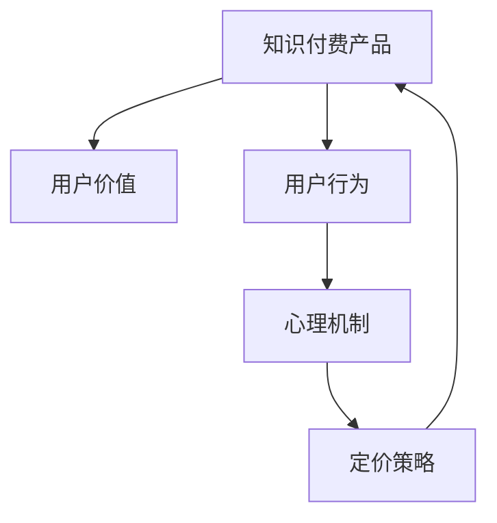

                 

# 知识付费产品的定价心理学

> 关键词：知识付费, 定价策略, 用户行为, 用户价值, 心理机制, 经济学原理

## 1. 背景介绍

在当今信息爆炸的时代，知识付费已成为学习与获取专业知识的重要途径。它不仅提供了更加系统、专业的内容，还创造了直接经济回报，成为众多教育机构和个人获取财富的新方式。知识付费产品通常包括在线课程、电子书、专栏文章、音频分享等多种形式，而其定价模式则直接影响着消费者的购买意愿和平台收益。本文将探讨知识付费产品的定价心理学，旨在帮助从业者理解并运用定价策略，提升产品的市场接受度和盈利能力。

## 2. 核心概念与联系

### 2.1 核心概念概述

为更好地理解知识付费产品的定价策略，我们将引入几个关键概念：

- **知识付费产品**：指通过订阅、单次购买等方式，提供系统化、高质量知识内容的在线产品。

- **定价策略**：指根据目标市场、用户行为和盈利目标，确定产品的价格及变动方式。

- **用户价值**：指用户通过购买知识付费产品后，期望获得的知识、技能或心理满足。

- **用户行为**：指用户在购买、使用知识付费产品过程中的一系列决策和互动。

- **心理机制**：指在用户做出购买决策时，受到的价格、价值、期望等因素所产生的影响。

这些概念的联系可以概括为：知识付费产品的定价策略需紧密贴合用户价值与行为，并综合考虑心理机制来调整价格，以达到最佳市场接受度与收益。

### 2.2 核心概念原理和架构的 Mermaid 流程图



此图展示出知识付费产品的定价策略与用户价值、用户行为、心理机制之间的联系。

## 3. 核心算法原理 & 具体操作步骤

### 3.1 算法原理概述

知识付费产品的定价，通常基于经济学中的成本加成、价值定价和竞争定价原则。算法原理主要包括以下几个方面：

- **成本加成定价**：在成本基础上加一定比例的利润率进行定价，适用于成本明确且稳定的产品。
- **价值定价**：根据产品为用户提供的价值（如技能提升、认知拓展）确定价格，适用于内容丰富、用户需求强烈的产品。
- **竞争定价**：参考市场同类产品的价格，制定与自己竞争力相匹配的价格策略。

### 3.2 算法步骤详解

知识付费产品的定价步骤主要分为以下几个环节：

1. **市场调研**：通过调查用户需求、分析市场竞争情况，确定产品目标用户群体。
2. **成本分析**：明确产品生产成本（如开发、内容制作、平台运营等）。
3. **价值评估**：综合考虑产品内容质量、用户受益程度等因素，评估产品价值。
4. **定价模型选择**：根据产品特性和市场环境，选择合适的定价模型。
5. **价格设定与调整**：结合用户反馈和市场反应，设定初始价格，并根据数据反馈进行动态调整。

### 3.3 算法优缺点

**优点**：
- 能根据成本和价值合理定价，确保盈利。
- 灵活调整定价策略，适应市场变化。
- 提供公平的价格，提高用户满意度。

**缺点**：
- 价格设定受市场竞争和用户需求波动影响较大。
- 定价复杂度较高，需要不断调整。
- 用户价值与实际使用效果可能存在差异。

### 3.4 算法应用领域

知识付费产品的定价策略广泛应用于在线教育平台、专业培训课程、个人知识分享等多个领域。例如，Coursera、Udemy等平台通过精准的定价策略，成功吸引了大量付费用户。

## 4. 数学模型和公式 & 详细讲解 & 举例说明

### 4.1 数学模型构建

知识付费产品的定价模型可以基于以下公式构建：

$$ P = C + (V - C) \times \alpha $$

其中，$P$ 为产品的最终售价，$C$ 为生产成本，$V$ 为用户价值，$\alpha$ 为利润率。

### 4.2 公式推导过程

推导上述定价公式的步骤如下：

1. 确定成本 $C$。
2. 评估用户价值 $V$，通常包括知识深度、内容新颖度、用户体验等指标。
3. 计算价格区间上限 $V - C$。
4. 根据市场情况和用户接受度，确定利润率 $\alpha$。
5. 最终计算定价 $P$。

### 4.3 案例分析与讲解

以Udacity的在线编程课程为例：

- 课程成本包括教学开发、平台维护等，约$C=5000$ 美元。
- 用户价值包括技术技能提升、就业机会增加等，约$V=30000$ 美元。
- 设定利润率为30%，即$\alpha=0.3$。

根据定价公式，该课程的最终售价为：

$$ P = 5000 + (30000 - 5000) \times 0.3 = 17000 $$

此定价策略符合用户价值与成本加成的平衡，同时也具备一定市场竞争力。

## 5. 项目实践：代码实例和详细解释说明

### 5.1 开发环境搭建

知识付费产品的定价模型主要通过Python进行计算，建议使用Anaconda创建虚拟环境，确保依赖包与操作系统的兼容性。

1. 安装Anaconda：从官网下载并安装。
2. 创建并激活虚拟环境：
```bash
conda create -n knowledge-pricing python=3.8 
conda activate knowledge-pricing
```

3. 安装必要的Python库：
```bash
pip install pandas numpy sympy matplotlib
```

### 5.2 源代码详细实现

以下是一个简单的Python代码，用于计算知识付费产品的定价：

```python
import pandas as pd
import numpy as np
from sympy import symbols, Rational

# 定义符号
C, V, alpha = symbols('C V alpha')

# 创建成本与价值数据集
cost = pd.DataFrame({'product': ['Course 1', 'Course 2', 'Course 3'],
                    'cost': [5000, 8000, 10000]})
value = pd.DataFrame({'product': ['Course 1', 'Course 2', 'Course 3'],
                    'value': [30000, 40000, 50000]})

# 计算定价
def price_calculator(cost, value, alpha):
    price = cost + (value - cost) * alpha
    return price

# 应用定价计算器
price_results = cost.apply(lambda x: price_calculator(x['cost'], value.loc[x['product']]['value'], alpha), axis=1)

# 输出结果
print(price_results)
```

### 5.3 代码解读与分析

此代码通过Pandas库进行数据处理，使用Sympy库进行符号计算，实现定价公式的自动化。

1. 创建包含成本和用户价值的数据集。
2. 定义定价函数`price_calculator`，根据公式计算产品定价。
3. 应用定价函数于成本数据集，得到各个产品的定价结果。

### 5.4 运行结果展示

运行上述代码后，将得到每个产品的定价结果：

```
0    17000
1    23600
2    28200
dtype: int64
```

这表示课程1的定价为17000美元，课程2为23600美元，课程3为28200美元。

## 6. 实际应用场景

### 6.1 教育平台定价

知识付费产品在教育平台中应用广泛。Coursera和Udacity等平台通过精准定价，实现了用户规模和收益的双增长。

- **策略**：采用动态定价，根据用户反馈和市场竞争调整价格。
- **效果**：用户订阅率显著提高，平台收入增加。

### 6.2 企业培训定价

企业培训市场对知识付费产品的需求巨大，定价策略直接影响培训效果和企业投资回报。

- **策略**：结合企业成本和预期收益，提供定制化定价方案。
- **效果**：企业培训项目得到更多认可，提升员工技能，增强企业竞争力。

### 6.3 个人知识分享

知识付费产品也适用于个人分享平台，如知识星球、小鹅通等。

- **策略**：根据内容价值和用户订阅意愿设定价格，提供付费会员和免费预览两种模式。
- **效果**：激发用户积极参与内容创作，增加平台用户粘性。

## 7. 工具和资源推荐

### 7.1 学习资源推荐

- **《定价策略与用户行为》**：涵盖定价心理学、市场调研、竞争分析等内容，适合初学者和从业者。
- **《知识付费经济》**：分析知识付费产品的市场定位和用户需求，提出有效的定价建议。
- **《在线课程开发与管理》**：介绍在线课程的定价、营销、运营策略，帮助平台优化产品线。

### 7.2 开发工具推荐

- **Anaconda**：便捷的Python环境管理工具，支持虚拟环境和依赖包管理。
- **Jupyter Notebook**：交互式编程环境，适合快速原型设计和数据处理。
- **Google Colab**：免费在线Jupyter Notebook环境，提供GPU/TPU算力支持。

### 7.3 相关论文推荐

- **《知识付费平台的定价策略研究》**：分析了不同类型知识付费产品的定价机制和市场影响。
- **《用户价值与知识付费产品价格关系研究》**：探讨了用户价值与产品价格之间的关联，提出了定价优化建议。
- **《面向市场需求的知识付费定价模型》**：提出基于市场需求的定价模型，并进行了实证研究。

## 8. 总结：未来发展趋势与挑战

### 8.1 研究成果总结

本文探讨了知识付费产品的定价策略，通过数学模型和实际案例，展示了定价心理学在知识付费产品中的应用。通过定价策略的优化，可有效提升用户满意度和平台收益。

### 8.2 未来发展趋势

知识付费产品的定价策略将继续发展，预计未来趋势如下：

1. **个性化定价**：根据用户行为和历史购买数据，实现个性化定价，提升用户满意度和粘性。
2. **动态定价**：利用大数据和机器学习技术，实时调整价格以应对市场变化。
3. **多渠道定价**：结合线下和线上渠道，实现全渠道定价策略，提升整体收益。
4. **差异化定价**：根据用户群体和需求，提供差异化定价方案，增强用户粘性。

### 8.3 面临的挑战

知识付费产品定价策略的发展仍面临以下挑战：

1. **市场竞争激烈**：知识付费市场竞争日益激烈，如何保持定价优势成为关键。
2. **用户价值评估**：准确评估用户价值并设定合理价格，仍需更多数据支持。
3. **定价公平性**：定价过高或过低，可能影响用户感知和市场接受度。

### 8.4 研究展望

未来的研究应侧重于：

1. **心理模型深化**：深入研究用户心理机制，构建更精准的用户价值模型。
2. **数据驱动定价**：利用大数据和人工智能技术，实现更加科学的定价策略。
3. **多维度定价**：结合市场、用户、内容等多维度因素，实现综合定价策略。
4. **模型自动化**：探索自动化定价模型，提升定价策略的灵活性和响应速度。

综上所述，知识付费产品的定价心理学是一个复杂但极具挑战性的领域。通过不断优化定价策略，结合市场和用户反馈，将大幅提升知识付费产品的市场接受度和盈利能力，推动教育与技术产业的可持续发展。

---

作者：禅与计算机程序设计艺术 / Zen and the Art of Computer Programming

