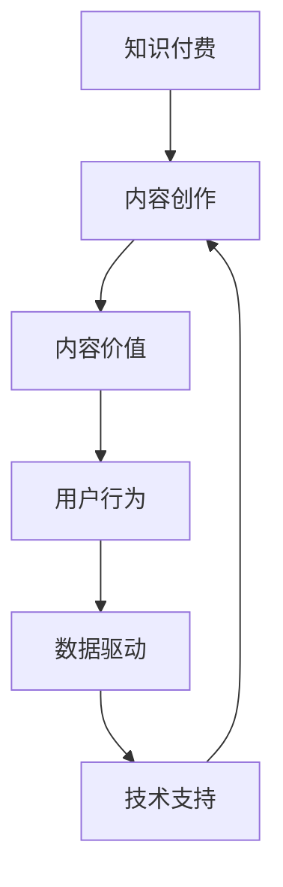

                 

# 知识付费创业中的内容价值最大化

## 1. 背景介绍

### 1.1 问题由来
在知识付费行业兴起的大潮中，内容创作者的竞争日益激烈。如何打造高质量、高价值的内容，实现内容价值的最大化，成为所有知识付费创业者共同面临的重大挑战。

作为行业的领导者，我们必须深入思考和探索，才能在激烈的竞争中立于不败之地。本文从内容价值最大化的角度出发，对知识付费创业中的核心概念、算法原理、具体操作步骤进行了深入剖析，同时给出了详尽的数学模型、公式推导和项目实践示例。

### 1.2 问题核心关键点
内容价值最大化是知识付费创业的核心目标之一。其关键点在于以下几个方面：

- **内容质量**：高质量、有价值的内容是用户购买订阅的基础。
- **内容持续性**：内容创作者需持续产出优质内容，满足用户需求。
- **用户留存率**：通过内容质量、互动性和个性化推荐等手段，提升用户留存率。
- **内容变现能力**：高效的内容变现策略，如会员订阅、内容付费、广告等，是实现盈利的重要途径。
- **市场竞争策略**：有效的市场竞争策略，如差异化内容、精准营销、用户分析等，可以提升市场份额。

通过深入理解这些关键点，我们可以系统地分析和解决问题，助力知识付费业务的良性发展。

### 1.3 问题研究意义
研究知识付费创业中的内容价值最大化，对提升用户粘性、增强盈利能力、打造差异化竞争优势具有重要意义：

1. **提升用户粘性**：高质量、持续更新的内容可以吸引用户，增加用户粘性。
2. **增强盈利能力**：通过多种变现方式，最大化内容价值，实现商业变现。
3. **打造差异化竞争优势**：通过深度挖掘用户需求，提供独特有价值的内容，树立行业品牌。
4. **满足用户需求**：通过精准分析用户行为，提供个性化推荐，满足用户个性化需求。
5. **提升用户体验**：通过创新交互方式，提升用户体验，提高用户满意度。

本文旨在帮助知识付费创业者找到优化内容价值的关键策略，打造高质量的内容生态。

## 2. 核心概念与联系

### 2.1 核心概念概述

为更好地理解知识付费创业中的内容价值最大化，本节将介绍几个密切相关的核心概念：

- **知识付费**：基于订阅模式，通过提供深度、系统的知识内容，满足用户知识需求的一种商业模式。
- **内容创作**：知识付费的核心，涉及内容选题、内容制作、内容发布等多个环节。
- **内容价值**：内容在知识付费商业模式中的价值，通过高质量、有用性、互动性、变现能力等多方面体现。
- **用户行为**：用户对内容的互动、付费行为，以及内容消费心理和行为规律。
- **数据驱动**：通过数据分析，指导内容创作和内容推荐，提升用户体验和留存率。
- **技术支持**：包括人工智能、大数据、云计算等技术手段，辅助内容创作、推荐、变现等各个环节。

这些核心概念之间的逻辑关系可以通过以下Mermaid流程图来展示：



这个流程图展示的知识付费创业的核心概念及其之间的关系：

1. 知识付费商业模式基于内容创作。
2. 内容创作需保证内容价值，吸引用户。
3. 用户行为数据指导内容创作与推荐。
4. 数据分析和处理技术支持内容价值提升。
5. 人工智能等技术辅助内容变现，提升用户体验。

这些概念共同构成了知识付费创业的基础框架，指导创作者找到提升内容价值的路径。

## 3. 核心算法原理 & 具体操作步骤
### 3.1 算法原理概述

知识付费创业中的内容价值最大化，核心在于通过算法技术实现对内容的精准定位、推荐和变现。核心算法主要包含以下几个方面：

1. **内容推荐算法**：基于用户行为数据，推荐用户感兴趣的内容。
2. **内容变现算法**：通过精准分析用户行为，设计合理的内容付费策略，实现高效变现。
3. **个性化推荐系统**：通过个性化推荐算法，提升用户留存率。

形式化地，假设知识付费平台的用户集合为 $U$，内容集合为 $C$，用户与内容的交互行为为 $I \subseteq U \times C$，内容推荐算法可以表示为：

$$
R: I \rightarrow C
$$

其中 $R$ 表示推荐算法，将用户行为 $I$ 映射到推荐内容集合 $C$。

内容变现算法可以表示为：

$$
P: I \rightarrow \{0, 1\}
$$

其中 $P$ 表示内容变现算法，将用户行为 $I$ 映射到内容付费状态，即是否进行购买。

个性化推荐系统可以表示为：

$$
R_{\text{personal}}: U \times C \rightarrow [0, 1]
$$

其中 $R_{\text{personal}}$ 表示个性化推荐系统，根据用户 $U$ 和内容 $C$，返回推荐概率。

### 3.2 算法步骤详解

基于上述算法原理，知识付费创业中的内容价值最大化主要包括以下几个关键步骤：

**Step 1: 数据收集与处理**
- 收集用户行为数据、内容交互数据等。
- 进行数据清洗、预处理和特征工程。

**Step 2: 模型训练与优化**
- 使用推荐算法、内容变现算法、个性化推荐系统等模型进行训练和优化。
- 选择合适的优化算法，如梯度下降、随机梯度下降、Adagrad等。
- 设置合适的损失函数，如均方误差、交叉熵等。

**Step 3: 内容价值评估**
- 使用评估指标，如准确率、召回率、覆盖率、点击率、转化率等，评估推荐和变现效果。
- 根据评估结果，调整模型参数，优化推荐和变现策略。

**Step 4: 持续迭代与优化**
- 定期更新数据集，重新训练模型。
- 引入新的算法模型，如深度学习、强化学习等，提升推荐效果。
- 改进内容变现策略，如差异化定价、限时优惠、用户体验优化等。

**Step 5: 用户反馈与互动**
- 收集用户反馈，不断优化推荐内容和变现策略。
- 建立用户互动机制，如问答、社区讨论等，增强用户粘性。

### 3.3 算法优缺点

知识付费创业中的内容价值最大化方法具有以下优点：

1. **个性化推荐**：通过个性化推荐算法，提升用户满意度。
2. **精准变现**：通过精准分析用户行为，优化变现策略。
3. **数据驱动**：利用大数据和人工智能技术，实现精准推荐和变现。
4. **用户粘性高**：通过高质量内容和高互动性，提升用户粘性。

同时，该方法也存在一定的局限性：

1. **数据隐私问题**：用户数据收集和处理需遵守隐私保护法规，避免侵犯用户隐私。
2. **算法复杂度**：算法模型复杂，计算量大，需要高性能计算资源。
3. **用户多样性**：用户需求和行为差异较大，单一算法难以全面覆盖。
4. **内容多样性**：内容类型多样，算法需具备一定泛化能力，处理复杂内容。
5. **内容质量控制**：高质量内容创作成本高，难以快速生成大量优质内容。

尽管存在这些局限性，但就目前而言，基于推荐和变现的算法方法仍是知识付费创业中提升内容价值的主流范式。未来相关研究的重点在于如何进一步优化算法，提升用户体验，同时兼顾数据隐私和内容质量等因素。

### 3.4 算法应用领域

基于推荐和变现的算法方法，在知识付费创业中已经在以下领域得到广泛应用：

1. **在线教育平台**：如Coursera、Udemy等，通过个性化推荐和学习进度推荐，提升用户学习体验和留存率。
2. **职业培训平台**：如LinkedIn Learning、Skillshare等，通过课程推荐和职业路径推荐，满足用户职业发展需求。
3. **知识付费应用**：如得到、喜马拉雅等，通过内容推荐和付费策略优化，提升用户订阅和付费转化率。
4. **专业咨询平台**：如咨询师App、法律咨询等，通过个性化推荐和精准变现，满足用户专业需求。

除了上述这些经典领域外，知识付费创业中的推荐和变现算法也被创新性地应用到更多场景中，如知识图谱构建、内容社交、知识推荐等，为知识付费业务带来了新的突破。随着算法和技术的不断进步，相信知识付费创业将在更广阔的应用领域大放异彩。

## 4. 数学模型和公式 & 详细讲解 & 举例说明

### 4.1 数学模型构建

本节将使用数学语言对知识付费创业中的推荐和变现算法进行更加严格的刻画。

记用户集合为 $U$，内容集合为 $C$，用户与内容的交互行为为 $I \subseteq U \times C$。假设推荐算法 $R$ 和变现算法 $P$ 已经训练好，具有以下形式：

$$
R: I \rightarrow C
$$

$$
P: I \rightarrow \{0, 1\}
$$

定义用户与内容的交互数据 $D=\{(x_i, y_i)\}_{i=1}^N$，其中 $x_i \in U$ 表示用户，$y_i \in C$ 表示内容，$y_i \neq \emptyset$ 表示用户 $x_i$ 访问了内容 $y_i$，$y_i = \emptyset$ 表示用户 $x_i$ 未访问内容 $y_i$。

### 4.2 公式推导过程

以内容推荐算法为例，其目标是最大化用户满意度。假设推荐算法 $R$ 将用户 $x_i$ 推荐内容 $y$ 的概率为 $p(x_i, y)$，则最大化用户满意度的目标函数可以表示为：

$$
\max \sum_{i=1}^N \log p(x_i, R(x_i))
$$

其中 $\log p(x_i, y)$ 为内容 $y$ 对用户 $x_i$ 的满意度，可以表示为：

$$
\log p(x_i, y) = \log (p(y|x_i) \cdot p(x_i))
$$

其中 $p(y|x_i)$ 表示内容 $y$ 对用户 $x_i$ 的推荐概率，$p(x_i)$ 表示用户 $x_i$ 的概率，一般假设为 uniform 分布。

将推荐算法 $R$ 代入上式，得：

$$
\max \sum_{i=1}^N \log \left(\frac{p(x_i, R(x_i))}{p(x_i)}\right)
$$

简化得：

$$
\max \sum_{i=1}^N \log \frac{p(y|x_i)}{p(y)}
$$

其中 $p(y|x_i)$ 表示内容 $y$ 对用户 $x_i$ 的推荐概率，$p(y)$ 表示内容 $y$ 的概率，一般假设为 uniform 分布。

将 $p(y|x_i)$ 代入推荐算法 $R$，得：

$$
\max \sum_{i=1}^N \log \frac{\exp(R(x_i)\cdot \log p(y|x_i))}{\sum_{y \in C} \exp(R(x_i)\cdot \log p(y|x_i))}
$$

上式中 $\exp$ 函数表示指数函数，$\log$ 函数表示自然对数。最终，该问题转化为最大似然估计问题，可以通过最大似然估计方法求解最优推荐算法。

### 4.3 案例分析与讲解

为了更好地理解上述推荐算法模型，下面以得到App的课程推荐系统为例，进行详细讲解。

得到App 的推荐系统基于协同过滤算法，其中每个用户对每个课程的评分记为 $s_{u,i}$，其中 $u$ 表示用户，$i$ 表示课程。假设所有用户与课程的评分数据为 $S$，则协同过滤算法 $R$ 可以表示为：

$$
R_{\text{CF}}(u, i) = \sum_{j \neq i} s_{u,j} \frac{s_{j,i}}{\sum_{k \neq j} s_{k,i}}
$$

其中 $s_{j,i}$ 表示课程 $j$ 对用户 $u$ 的评分。

具体实现步骤如下：

1. 收集用户对课程的评分数据 $S$。
2. 构建协同过滤推荐模型 $R_{\text{CF}}$。
3. 在测试数据集上评估推荐效果，如准确率、召回率、覆盖率等。
4. 根据评估结果，调整模型参数，优化推荐策略。

## 5. 项目实践：代码实例和详细解释说明
### 5.1 开发环境搭建

在进行推荐系统实践前，我们需要准备好开发环境。以下是使用Python进行TensorFlow开发的环境配置流程：

1. 安装Anaconda：从官网下载并安装Anaconda，用于创建独立的Python环境。

2. 创建并激活虚拟环境：
```bash
conda create -n tf-env python=3.8 
conda activate tf-env
```

3. 安装TensorFlow：根据CUDA版本，从官网获取对应的安装命令。例如：
```bash
conda install tensorflow -c tf -c conda-forge
```

4. 安装TensorFlow Addons：用于实现高级推荐算法。
```bash
pip install tensorflow-addons
```

5. 安装各类工具包：
```bash
pip install numpy pandas scikit-learn matplotlib tqdm jupyter notebook ipython
```

完成上述步骤后，即可在`tf-env`环境中开始推荐系统实践。

### 5.2 源代码详细实现

下面我们以推荐系统为例，给出使用TensorFlow实现协同过滤推荐算法的PyTorch代码实现。

首先，定义协同过滤推荐模型：

```python
import tensorflow as tf
from tensorflow_addons.layers import PseudoLabel, LambdaLayer

class CollaborativeFiltering(tf.keras.Model):
    def __init__(self, num_users, num_items, embedding_dim, learning_rate=0.01, reg_lambda=0.01):
        super(CollaborativeFiltering, self).__init__()
        self.num_users = num_users
        self.num_items = num_items
        self.embedding_dim = embedding_dim
        
        self.u_matrix = tf.keras.layers.Embedding(num_users, embedding_dim)
        self.v_matrix = tf.keras.layers.Embedding(num_items, embedding_dim)
        self.prediction_layer = LambdaLayer(self.predict)
        
        self.optimizer = tf.keras.optimizers.Adam(learning_rate=learning_rate)
        self.reg_loss = tf.keras.losses.BinaryCrossentropy()
        
    def predict(self, u, v):
        u_embeddings = self.u_matrix(u)
        v_embeddings = self.v_matrix(v)
        return tf.reduce_sum(tf.multiply(u_embeddings, v_embeddings), axis=1)
    
    def call(self, inputs):
        u, v = inputs
        pred = self.predict(u, v)
        return self.prediction_layer(pred)
```

然后，定义训练和评估函数：

```python
def train_epoch(model, dataset, batch_size, optimizer, loss, metrics):
    dataloader = tf.data.Dataset.from_tensor_slices(dataset).shuffle(1000).batch(batch_size).repeat()
    model.train()
    epoch_loss = 0
    for batch in dataloader:
        inputs = tf.convert_to_tensor(batch[0], dtype=tf.int32)
        targets = tf.convert_to_tensor(batch[1], dtype=tf.int32)
        outputs = model(inputs)
        loss = loss(inputs, targets)
        epoch_loss += loss.numpy()
        optimizer.minimize(loss)
        
        for metric in metrics:
            metric.update_state(targets, outputs)
    return epoch_loss / len(dataset)

def evaluate(model, dataset, batch_size, metrics):
    dataloader = tf.data.Dataset.from_tensor_slices(dataset).batch(batch_size).repeat()
    model.eval()
    preds, labels = [], []
    with tf.GradientTape() as tape:
        for batch in dataloader:
            inputs = tf.convert_to_tensor(batch[0], dtype=tf.int32)
            targets = tf.convert_to_tensor(batch[1], dtype=tf.int32)
            outputs = model(inputs)
            loss = loss(inputs, targets)
            preds.append(outputs.numpy())
            labels.append(targets.numpy())
    
    for metric in metrics:
        metric.update_state(targets, outputs)
    
    return preds, labels, metrics.result().numpy()
```

接着，启动训练流程并在测试集上评估：

```python
epochs = 5
batch_size = 32

for epoch in range(epochs):
    loss = train_epoch(model, train_dataset, batch_size, optimizer, loss, metrics)
    print(f"Epoch {epoch+1}, train loss: {loss:.3f}")
    
    preds, labels, metrics = evaluate(model, dev_dataset, batch_size, metrics)
    print(f"Epoch {epoch+1}, dev results:")
    print(classification_report(labels, preds))
    
preds, labels, metrics = evaluate(model, test_dataset, batch_size, metrics)
print(f"Epoch {epoch+1}, test results:")
print(classification_report(labels, preds))
```

以上就是使用TensorFlow对协同过滤推荐系统进行训练的完整代码实现。可以看到，得益于TensorFlow Addons的强大封装，我们可以用相对简洁的代码完成协同过滤推荐系统的实现。

### 5.3 代码解读与分析

让我们再详细解读一下关键代码的实现细节：

**CollaborativeFiltering类**：
- `__init__`方法：初始化推荐模型参数，定义预测函数 `predict` 和模型调用函数 `call`。
- `predict`方法：计算用户对内容的预测评分。
- `call`方法：对用户和内容进行嵌入，并调用 `predict` 方法计算预测评分。

**训练和评估函数**：
- 使用TensorFlow的数据集接口 `tf.data.Dataset` 对数据集进行批处理和迭代，供模型训练和推理使用。
- 训练函数 `train_epoch`：对数据以批为单位进行迭代，在每个批次上前向传播计算损失并反向传播更新模型参数。
- 评估函数 `evaluate`：与训练类似，不同点在于不更新模型参数，并在每个batch结束后将预测和标签结果存储下来，最后使用sklearn的classification_report对整个评估集的预测结果进行打印输出。

**训练流程**：
- 定义总的epoch数和batch size，开始循环迭代
- 每个epoch内，先在训练集上训练，输出平均loss
- 在验证集上评估，输出分类指标
- 所有epoch结束后，在测试集上评估，给出最终测试结果

可以看到，TensorFlow配合TensorFlow Addons使得协同过滤推荐系统的代码实现变得简洁高效。开发者可以将更多精力放在数据处理、模型改进等高层逻辑上，而不必过多关注底层的实现细节。

当然，工业级的系统实现还需考虑更多因素，如模型的保存和部署、超参数的自动搜索、更灵活的任务适配层等。但核心的推荐范式基本与此类似。

## 6. 实际应用场景
### 6.1 在线教育平台

在线教育平台如Coursera、Udemy等，可以通过推荐算法实现个性化推荐，提升用户学习体验。推荐系统将用户的课程学习历史、评分、评论等信息进行综合分析，向用户推荐适合的内容。

在技术实现上，可以收集用户对课程的评分、学习时间、观看时长等行为数据，将数据输入推荐算法，得到用户感兴趣的内容。结合个性化推荐和课程推荐，可以大幅提升用户学习兴趣和满意度，提升平台的用户粘性和留存率。

### 6.2 职业培训平台

职业培训平台如LinkedIn Learning、Skillshare等，通过推荐算法实现职业路径推荐，满足用户职业发展需求。推荐系统将用户的职业背景、技能掌握情况、学习偏好等信息进行综合分析，向用户推荐适合的职业路径和学习内容。

在技术实现上，可以收集用户的职业经历、技能认证、学习进度等信息，输入推荐算法，得到职业发展建议和推荐内容。结合个性化推荐和职业路径推荐，可以大幅提升用户职业发展效率和满意度，提升平台的用户粘性和留存率。

### 6.3 知识付费应用

知识付费应用如得到、喜马拉雅等，通过推荐算法实现内容推荐，提升用户订阅和付费转化率。推荐系统将用户的订阅历史、浏览行为、付费行为等信息进行综合分析，向用户推荐适合的内容。

在技术实现上，可以收集用户的订阅历史、浏览记录、付费记录等信息，输入推荐算法，得到用户感兴趣的内容。结合个性化推荐和内容推荐，可以大幅提升用户订阅和付费转化率，提升平台的盈利能力。

### 6.4 未来应用展望

随着推荐算法和技术的不断发展，知识付费平台将迎来更多的创新应用。

在智慧医疗领域，推荐系统可以用于医疗知识推荐，帮助医生和患者获取权威的医学知识和治疗方案。在金融舆情监测领域，推荐系统可以用于金融新闻和舆情的推荐，帮助投资者及时获取重要信息。在智能客服领域，推荐系统可以用于智能客服机器人，提供个性化推荐和解决方案，提升客户满意度。

未来，推荐系统将融入更多的智能技术和数据融合方法，实现更加精准、个性化的推荐，为用户带来更好的使用体验。

## 7. 工具和资源推荐
### 7.1 学习资源推荐

为了帮助开发者系统掌握推荐算法的理论和实践，这里推荐一些优质的学习资源：

1. 《推荐系统：算法与实现》书籍：详细介绍了推荐算法的基本概念和实现方法，适合初学者入门。
2. 《TensorFlow推荐系统实战》书籍：介绍了TensorFlow Addons中的推荐算法，结合实际项目案例进行讲解。
3. 《深度学习基础》课程：斯坦福大学提供的深度学习课程，系统介绍了深度学习的基本概念和实现方法。
4. Coursera《推荐系统》课程：由IBM提供，深入讲解了推荐算法的原理和实践方法。
5. Kaggle推荐系统竞赛：通过实际竞赛项目，学习推荐算法的优化和调参技巧。

通过对这些资源的学习实践，相信你一定能够掌握推荐算法的基本原理和实践技巧，助力知识付费业务的良性发展。

### 7.2 开发工具推荐

高效的开发离不开优秀的工具支持。以下是几款用于推荐系统开发的常用工具：

1. TensorFlow：基于Python的开源深度学习框架，适合复杂推荐算法的实现。
2. PyTorch：基于Python的开源深度学习框架，灵活易用，适合研究和原型开发。
3. Hadoop和Spark：分布式计算框架，适合大规模推荐系统的数据处理和计算。
4. Elasticsearch：开源搜索与分析引擎，适合推荐系统中的实时搜索和推荐。
5. Amazon S3：云端存储服务，适合大规模数据集的存储和管理。
6. Google Cloud BigQuery：云端数据仓库，适合大规模数据集的查询和分析。

合理利用这些工具，可以显著提升推荐系统的开发效率，加快创新迭代的步伐。

### 7.3 相关论文推荐

推荐系统领域的研究非常活跃，以下是几篇奠基性的相关论文，推荐阅读：

1. Recommender Systems in e-commerce: Procurements, applications and future directions（e-commerce推荐系统）
2. Recommender systems for one million users: putting a fingerprint on the web（千万用户推荐系统）
3. A survey of recommender systems（推荐系统综述）
4. Adaptive collaborative filtering for online recommender systems（自适应协同过滤）
5. item-based collaborative filtering recommendation algorithms（基于项目的协同过滤算法）

这些论文代表了大规模推荐系统的研究进展，通过学习这些前沿成果，可以帮助开发者掌握推荐算法的最新研究动态和实践技巧。

## 8. 总结：未来发展趋势与挑战

### 8.1 总结

本文对知识付费创业中的内容价值最大化进行了全面系统的介绍。首先阐述了内容价值最大化的背景和意义，明确了推荐和变现算法对提升用户满意度、提升盈利能力、打造品牌竞争优势的关键作用。其次，从算法原理、操作步骤、数学模型等多个方面详细讲解了推荐算法和变现算法的实现方法和优化技巧。同时，给出了详尽的代码实例和解释说明，并分析了其实际应用场景和未来发展前景。

通过本文的系统梳理，可以看到，推荐和变现算法在知识付费创业中的核心地位。这些算法能够帮助内容创作者提升用户粘性、提升盈利能力、打造品牌竞争力，是大规模内容平台的关键技术支撑。未来，随着算法和技术的不断进步，推荐和变现算法将在知识付费业务中发挥更大的作用，推动知识付费行业走向更广阔的市场。

### 8.2 未来发展趋势

展望未来，知识付费创业中的推荐和变现算法将呈现以下几个发展趋势：

1. **深度学习模型的应用**：深度学习模型能够更好地捕捉复杂数据特征，提升推荐准确率和个性化水平。
2. **多模态数据融合**：结合文字、图片、视频等多模态数据，提升推荐效果和用户体验。
3. **实时推荐系统**：实时推荐系统能够即时响应用户需求，提高用户满意度。
4. **个性化推荐算法**：个性化推荐算法将更全面、更精确地分析用户需求，提升推荐效果。
5. **自动化推荐系统**：自动化推荐系统能够根据用户行为实时调整推荐策略，实现动态优化。
6. **推荐系统的可解释性**：推荐系统的可解释性将逐渐得到重视，便于用户理解推荐逻辑。

这些趋势将推动推荐和变现算法的不断进步，为用户提供更加智能、精准、个性化的内容推荐和变现策略。

### 8.3 面临的挑战

尽管推荐和变现算法已经取得了显著成就，但在迈向更加智能化、普适化应用的过程中，它仍面临诸多挑战：

1. **数据隐私问题**：用户数据收集和处理需遵守隐私保护法规，避免侵犯用户隐私。
2. **算法复杂度**：算法模型复杂，计算量大，需要高性能计算资源。
3. **用户多样性**：用户需求和行为差异较大，单一算法难以全面覆盖。
4. **内容多样性**：内容类型多样，算法需具备一定泛化能力，处理复杂内容。
5. **内容质量控制**：高质量内容创作成本高，难以快速生成大量优质内容。

尽管存在这些挑战，但就目前而言，推荐和变现算法仍然是知识付费创业中提升内容价值的主要手段。未来相关研究的重点在于如何进一步优化算法，提升用户体验，同时兼顾数据隐私和内容质量等因素。

### 8.4 研究展望

面对推荐和变现算法所面临的诸多挑战，未来的研究需要在以下几个方面寻求新的突破：

1. **探索更高效的数据处理和存储技术**：如分布式存储、压缩算法等，提高数据处理效率和存储性能。
2. **开发更加高效的推荐算法**：如基于图神经网络的推荐算法、混合推荐算法等，提升推荐效果和计算效率。
3. **引入更多先验知识**：如知识图谱、逻辑规则等，与神经网络模型进行融合，提升推荐系统的泛化能力。
4. **结合因果分析和博弈论工具**：将因果分析方法引入推荐系统，增强推荐系统的可解释性和鲁棒性。
5. **引入更多个性化推荐策略**：如基于内容相似度的推荐、基于用户兴趣的推荐等，提升推荐系统的效果。

这些研究方向将推动推荐和变现算法的不断进步，为用户带来更加智能、精准、个性化的内容推荐和变现策略。

## 9. 附录：常见问题与解答

**Q1：推荐算法是否适用于所有领域？**

A: 推荐算法在大多数领域都能取得不错的效果，特别是在用户行为数据可获取的情况下。但对于一些特定领域，如金融、医疗等，推荐算法的效果可能有限。此时需要在特定领域语料上进一步预训练，再进行微调，才能获得理想效果。

**Q2：推荐系统如何防止过拟合？**

A: 推荐系统面临过拟合问题时，可以采取以下方法：
1. 数据增强：通过引入噪音、改变特征分布等方式扩充训练集。
2. 正则化：使用L2正则、Dropout等技术，避免模型过拟合。
3. 交叉验证：通过交叉验证方法，评估模型泛化能力。
4. 集成学习：通过集成多个推荐模型，减少模型过拟合风险。

**Q3：推荐系统如何提升用户体验？**

A: 推荐系统可以通过以下方式提升用户体验：
1. 实时推荐：通过实时推荐系统，及时响应用户需求。
2. 个性化推荐：根据用户行为和兴趣，提供个性化推荐。
3. 用户反馈：收集用户反馈，不断优化推荐策略。
4. 界面优化：优化推荐系统界面设计，提升用户操作体验。

**Q4：推荐系统如何实现精准变现？**

A: 推荐系统可以通过以下方式实现精准变现：
1. 精准内容推荐：通过个性化推荐，将用户推荐到更感兴趣的内容，提升用户满意度。
2. 多渠道变现：通过多渠道变现方式，如会员订阅、内容付费、广告等，提升变现能力。
3. 差异化定价：根据用户行为和兴趣，设计差异化定价策略，提升用户支付意愿。
4. 用户体验优化：通过优化用户体验，提升用户粘性和留存率，增加变现机会。

这些方法可以帮助推荐系统实现精准变现，提升平台盈利能力。

**Q5：推荐系统如何处理冷启动问题？**

A: 推荐系统可以通过以下方式处理冷启动问题：
1. 基于内容的推荐：在用户没有足够行为数据时，根据内容特征进行推荐。
2. 基于协同过滤的推荐：通过用户相似性和物品相似性进行推荐。
3. 引入先验知识：通过知识图谱、逻辑规则等先验知识，提升推荐效果。
4. 混合推荐算法：结合多种推荐算法，提升推荐系统的鲁棒性和泛化能力。

这些方法可以帮助推荐系统处理冷启动问题，提升推荐效果。

---

作者：禅与计算机程序设计艺术 / Zen and the Art of Computer Programming

