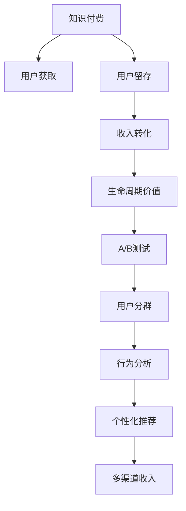

                 

# 知识付费创业的增长黑客技巧

## 1. 背景介绍

### 1.1 问题由来

在互联网高度发达的今天，知识和信息已经成为了推动个人成长和企业发展的关键资源。知识付费创业，正是在这种背景下应运而生的新业务模式。通过将知识以付费的方式提供给用户，不仅能够帮助用户解决实际问题，还能为创业者带来可观的经济收益。然而，随着市场竞争的加剧，如何有效提升知识付费产品的用户粘性和商业价值，成为摆在创业者面前的重要课题。

### 1.2 问题核心关键点

知识付费创业的核心问题在于如何通过增长黑客(Growth Hacking)技巧，实现用户增长、提高用户留存、优化收入转化等目标。增长黑客是一种通过数据分析、技术手段和创新策略来驱动产品增长的方法论，被广泛应用于产品市场推广、用户行为分析、营销自动化等领域。

在知识付费领域，增长黑客技巧的应用可以概括为以下几个方面：

- 用户获取：通过优化内容质量、设计有吸引力的营销活动、使用SEO/SEM等手段，吸引更多用户注册和使用知识付费产品。
- 用户留存：通过个性化推荐、课程提醒、社群互动等策略，提高用户对知识付费产品的满意度和忠诚度，减少流失。
- 收入转化：通过多渠道收入来源、灵活的付费方案、客户细分策略等方法，最大化收入转化率。
- 生命周期价值提升：通过细分用户、精准营销、长期内容更新等手段，不断挖掘用户的生命周期价值，实现业务增长。

### 1.3 问题研究意义

掌握知识付费创业的增长黑客技巧，对于提升知识付费产品的市场竞争力、提升用户粘性、提高收益转化率，具有重要意义：

1. 加速用户增长：通过科学的市场推广和内容创新，快速吸引用户，扩大用户规模。
2. 提升用户留存：通过个性化推荐和社区互动，提高用户满意度和忠诚度，降低流失率。
3. 优化收入转化：通过多元化的收入模式和精准的营销策略，最大化用户价值。
4. 挖掘生命周期价值：通过深入的用户分析和长期的内容维护，最大化用户生命周期价值。

通过学习和应用增长黑客技巧，知识付费创业者可以更好地应对市场变化，提升产品竞争力，实现可持续的业务增长。

## 2. 核心概念与联系

### 2.1 核心概念概述

为更好地理解知识付费创业中的增长黑客技巧，本节将介绍几个关键概念：

- **知识付费**：指将高价值的知识内容以付费的形式提供给用户，帮助用户获取知识和技能。常见的知识付费形式包括在线课程、电子书、直播讲座等。
- **增长黑客**：指利用数据驱动的创新方法，优化产品体验，加速用户增长和收入转化。增长黑客通过A/B测试、用户分群、行为分析等手段，不断优化产品策略。
- **用户生命周期价值(Customer Lifetime Value, CLV)**：指单个用户在产品生命周期内为产品带来的总价值，是衡量用户价值的重要指标。
- **个性化推荐系统**：通过分析用户行为和偏好，为每个用户推荐最适合其需求的内容，提高用户满意度和粘性。
- **多渠道收入模型**：通过不同的付费方式（如单次购买、月卡订阅、年度会员等），提供灵活的付费选择，增加用户粘性，提升收入转化率。

这些概念之间的逻辑关系可以通过以下Mermaid流程图来展示：



这个流程图展示了知识付费产品从用户获取到生命周期价值提升的各个环节，以及增长黑客技巧在这些环节中的应用。

## 3. 核心算法原理 & 具体操作步骤
### 3.1 算法原理概述

知识付费创业中的增长黑客技巧，本质上是利用数据和算法来优化用户行为，实现产品的快速增长和收入提升。核心算法原理包括以下几个方面：

- **用户行为分析**：通过数据分析，了解用户的行为模式和需求偏好，指导产品优化和营销策略。
- **个性化推荐算法**：基于用户的兴趣和历史行为，推荐最适合的内容，提升用户满意度和粘性。
- **A/B测试**：通过同时运行多个版本的产品或营销策略，对比其效果，找到最优方案。
- **用户分群策略**：将用户根据不同的特征（如地理位置、付费意愿、学习习惯等）进行分群，针对性地制定营销策略。
- **多渠道收入模型**：通过灵活的付费模式，提供多种选择，最大化用户生命周期价值。

### 3.2 算法步骤详解

以下详细讲解知识付费创业中增长黑客技巧的核心算法步骤：

**Step 1: 用户行为数据分析**

- 收集用户行为数据，包括但不限于浏览记录、点击次数、购买行为、课程完成度等。
- 使用统计分析工具（如Google Analytics、Mixpanel）对数据进行初步分析，找出用户的关键行为和偏好。
- 利用机器学习算法（如K-means聚类、协同过滤等）对用户进行细分，识别出高价值用户群体。

**Step 2: 个性化推荐算法**

- 设计个性化推荐算法，基于用户行为和历史偏好，生成推荐列表。
- 使用模型如协同过滤、矩阵分解、深度学习等，优化推荐效果。
- 定期更新推荐算法，确保推荐的实时性和准确性。

**Step 3: A/B测试**

- 设计多个版本的产品或营销策略，如页面布局、广告文案、优惠方案等。
- 随机分配用户群体到不同版本中，使用A/B测试工具（如Optimizely、VWO）收集用户反馈和行为数据。
- 对比不同版本的表现，选择最优方案进行推广。

**Step 4: 用户分群策略**

- 利用用户行为数据和机器学习算法，将用户进行细分。
- 针对不同的用户群体，设计个性化的营销策略，如定向推送广告、个性化课程推荐等。
- 定期评估分群策略的效果，不断优化用户分类和策略制定。

**Step 5: 多渠道收入模型**

- 设计多元化的付费方案，如单次购买、月卡订阅、年度会员等。
- 根据用户行为和付费意愿，推荐适合的付费模式。
- 使用数据分析工具（如Cohort Analysis）评估不同付费模式的效果，优化收入转化策略。

### 3.3 算法优缺点

知识付费创业中的增长黑客技巧具有以下优点：

1. **快速见效**：通过科学的市场推广和用户分析，可以快速吸引用户，提升产品影响力。
2. **精准营销**：通过个性化推荐和多渠道收入模型，提高用户粘性和收入转化率。
3. **数据驱动**：基于数据和算法优化策略，减少主观判断，提高营销效果。
4. **灵活调整**：通过A/B测试和用户分群策略，可以快速调整产品策略，适应市场变化。

同时，这些技巧也存在一些局限性：

1. **数据依赖**：增长黑客技巧依赖于高质量的数据，数据质量差或数据量不足可能影响策略效果。
2. **模型复杂**：个性化推荐和多渠道收入模型涉及复杂算法，需要一定的技术和资源投入。
3. **短期行为**：一些增长策略可能更多关注短期效果，忽视长期用户价值。
4. **隐私问题**：收集和分析用户数据可能涉及隐私问题，需要合理处理用户隐私保护。

## 4. 数学模型和公式 & 详细讲解  
### 4.1 数学模型构建

在知识付费创业中，增长黑客技巧的应用可以通过数学模型来进一步抽象和量化。以下给出几个核心数学模型的构建：

**用户留存率模型**

用户留存率（User Retention Rate, URR）是指用户在不同时间间隔内继续使用产品的概率，是衡量产品粘性的重要指标。其计算公式为：

$$
URR = \frac{N_t}{N_0} \times 100\%
$$

其中，$N_t$ 是在时间 $t$ 内继续使用的用户数，$N_0$ 是初始用户数。

**生命周期价值模型**

用户生命周期价值（Customer Lifetime Value, CLV）是指用户在其生命周期内为产品带来的总价值。其计算公式为：

$$
CLV = \sum_{t=1}^{T} P_t / (1 + r)^t
$$

其中，$P_t$ 是在第 $t$ 期用户带来的收入，$r$ 是折现率，$T$ 是用户生命周期。

**个性化推荐算法**

协同过滤（Collaborative Filtering）是常用的个性化推荐算法之一，其基本思想是通过用户间的相似性，推荐与用户偏好相似的商品。协同过滤可以基于用户-物品评分矩阵 $R$ 进行计算，具体公式如下：

$$
\hat{r}_{ui} = \frac{\sum_{v \in V}r_{uv} \times \frac{a_u}{\sqrt{\sum_{v \in V}r_{uv}^2}} \times \frac{a_v}{\sqrt{\sum_{u \in U}a_u^2}}}
$$

其中，$u$ 是用户，$v$ 是物品，$a$ 是用户物品评分矩阵 $R$ 的标准化因子。

**A/B测试**

A/B测试（也称为随机对照试验）是一种常用的测试方法，用于比较不同版本的效果。其核心思想是将用户随机分配到两个版本中，收集用户反馈和行为数据，评估不同版本的表现。A/B测试的数学模型可以通过假设检验来实现，具体公式如下：

$$
p_{treatment} = \frac{\sum_{i \in A}y_i + \sum_{j \in B}y_j}{N}
$$

其中，$y_i$ 是在版本 $i$ 中用户成功转化的次数，$N$ 是总用户数。

### 4.2 公式推导过程

以下对以上数学模型进行推导和解释：

**用户留存率模型**

用户留存率模型反映了用户在一定时间内的持续使用情况，是衡量产品粘性的重要指标。留存率高的产品往往更能吸引用户长期使用，提高用户价值。

**生命周期价值模型**

生命周期价值模型通过将用户的长期收入折现，计算其在产品生命周期内的总价值。这一模型不仅考虑了用户的即时价值，还考虑了用户未来的价值增长潜力。

**个性化推荐算法**

协同过滤算法基于用户间的相似性，推荐与用户偏好相似的商品。协同过滤通过计算用户-物品评分矩阵 $R$ 的相似度，预测用户对未评分物品的评分，从而生成推荐列表。

**A/B测试**

A/B测试通过对比不同版本的表现，评估版本优劣。在A/B测试中，通常使用t检验来验证两个版本的表现是否具有显著差异。通过A/B测试，可以快速找出最优版本，优化产品策略。

### 4.3 案例分析与讲解

以下通过一个具体的案例，来讲解知识付费创业中增长黑客技巧的应用：

**案例：某在线课程平台的用户留存与收入优化**

某在线课程平台希望通过增长黑客技巧，提升用户留存率和收入转化率。该平台收集了用户的浏览记录、购买行为、课程完成度等数据，并基于这些数据进行了用户细分和个性化推荐。

**Step 1: 用户行为数据分析**

- 使用统计分析工具，分析用户在不同时间内的行为模式，找出高价值用户群体。
- 使用协同过滤算法，对高价值用户群体进行个性化推荐，提升用户粘性。

**Step 2: A/B测试**

- 设计不同版本的课程页面，包括课程介绍、课程评价、课程推荐等。
- 随机分配用户到不同版本中，收集用户反馈和行为数据。
- 通过A/B测试工具，对比不同版本的表现，选择最优版本。

**Step 3: 用户分群策略**

- 将用户分为付费用户、试听用户、无兴趣用户等不同群体。
- 针对不同用户群体，设计不同的营销策略，如定向推送广告、个性化课程推荐等。
- 定期评估分群策略的效果，优化用户分类和策略制定。

通过以上步骤，该平台不仅提高了用户留存率，还优化了收入转化率，实现了用户生命周期价值的最大化。

## 5. 项目实践：代码实例和详细解释说明
### 5.1 开发环境搭建

在进行知识付费创业的增长黑客实践前，我们需要准备好开发环境。以下是使用Python进行Pandas和NumPy开发的Python环境配置流程：

1. 安装Anaconda：从官网下载并安装Anaconda，用于创建独立的Python环境。

2. 创建并激活虚拟环境：
```bash
conda create -n pythontest python=3.8 
conda activate pythontest
```

3. 安装Pandas和NumPy：
```bash
pip install pandas numpy
```

4. 安装其他工具包：
```bash
pip install matplotlib scikit-learn
```

完成上述步骤后，即可在`pythontest`环境中开始增长黑客技巧的实践。

### 5.2 源代码详细实现

这里我们以个性化推荐系统为例，给出使用Pandas和NumPy对用户行为数据进行分析和推荐的具体代码实现。

首先，定义数据处理函数：

```python
import pandas as pd
import numpy as np

def load_data(file_path):
    data = pd.read_csv(file_path)
    return data

def preprocess_data(data):
    # 删除缺失值
    data.dropna(inplace=True)
    # 数据归一化
    data['user_b BrowseTime'] = (data['user_b BrowseTime'] - np.min(data['user_b BrowseTime'])) / (np.max(data['user_b BrowseTime']) - np.min(data['user_b BrowseTime']))
    data['user_b PurchaseTime'] = (data['user_b PurchaseTime'] - np.min(data['user_b PurchaseTime'])) / (np.max(data['user_b PurchaseTime']) - np.min(data['user_b PurchaseTime']))
    return data

def save_data(data, file_path):
    data.to_csv(file_path, index=False)
```

然后，定义推荐函数：

```python
from scipy.sparse import coo_matrix
from scipy.sparse.linalg import svds

def collaborative_filtering(data, top_n=5):
    # 构建用户-物品评分矩阵
    user_item_matrix = coo_matrix((data['user_b PurchaseTime'].values, (data['user_id'].values, data['item_id'].values)))
    # 矩阵分解，求出用户相似度矩阵
    U, S, Vt = svds(user_item_matrix, k=10)
    # 计算用户推荐列表
    user_similarity = (U * Vt.T).toarray()
    user_index = np.argsort(user_similarity)[::-1]
    top_items = np.argsort(user_similarity[user_index, :])[:top_n]
    return top_items
```

最后，启动推荐流程：

```python
# 加载数据
data = load_data('data.csv')
# 数据预处理
data = preprocess_data(data)
# 用户推荐
top_items = collaborative_filtering(data)
print(top_items)
```

以上就是使用Pandas和NumPy对用户行为数据进行分析和推荐的具体代码实现。可以看到，Pandas和NumPy的强大数据处理能力，使得个性化推荐系统的实现变得简洁高效。

### 5.3 代码解读与分析

让我们再详细解读一下关键代码的实现细节：

**load_data函数**：
- 加载数据文件，返回Pandas数据框。

**preprocess_data函数**：
- 数据预处理：删除缺失值，对用户行为数据进行归一化处理。

**collaborative_filtering函数**：
- 构建用户-物品评分矩阵，进行矩阵分解，求出用户相似度矩阵。
- 根据用户相似度矩阵，计算推荐列表。

通过以上代码实现，我们能够基于用户行为数据进行个性化推荐，提升用户满意度，实现知识付费产品的增长。

## 6. 实际应用场景
### 6.1 智能客服系统

基于增长黑客技巧的知识付费平台可以构建智能客服系统，帮助用户解决实际问题。智能客服系统通过分析用户问题，推荐最适合的课程或视频，提供即时解答，提升用户体验。

在技术实现上，可以收集用户提问记录，使用NLP技术进行问题分类，并结合个性化推荐算法，生成推荐列表。推荐列表不仅包括课程，还可以包括相关的论坛帖子、FAQ等内容，帮助用户更好地理解问题。智能客服系统还可以通过实时数据分析，优化推荐策略，提高用户满意度。

### 6.2 金融理财工具

知识付费平台可以为金融理财工具提供知识支持，帮助用户进行财务规划和管理。智能理财工具通过分析用户财务数据，生成个性化理财建议，并通过课程推荐，帮助用户掌握更多理财知识。

在技术实现上，可以收集用户的理财行为数据，使用数据挖掘技术分析用户的理财需求和风险偏好，生成个性化的理财建议。同时，通过课程推荐，提升用户理财知识和技能。智能理财工具还可以实时监测用户财务状态，提醒用户注意风险。

### 6.3 学习辅导平台

基于增长黑客技巧的学习辅导平台，可以提供个性化的学习资源和辅导服务，帮助用户更好地掌握知识。学习辅导平台通过分析用户学习行为，推荐最适合的学习资料和辅导课程，提升学习效果。

在技术实现上，可以收集用户学习记录，使用数据挖掘技术分析用户的知识需求和学习进度，生成个性化的学习资源推荐。同时，通过辅导课程推荐，提升用户学习效果。学习辅导平台还可以实时分析用户学习情况，提供针对性辅导服务。

### 6.4 未来应用展望

随着知识付费创业的不断发展和数据技术的应用普及，增长黑客技巧将在更多领域得到应用，为知识服务行业带来新的变革。

在智慧医疗领域，基于增长黑客技巧的智慧诊疗平台，可以通过个性化推荐和智能诊断，提升医疗服务质量，帮助医生更好地服务患者。

在智能教育领域，基于增长黑客技巧的个性化学习平台，可以通过数据分析和推荐算法，提升教学效果，帮助学生更好地掌握知识。

在智慧城市治理中，基于增长黑客技巧的城市服务平台，可以通过数据分析和智能推荐，提升公共服务效率，提高城市治理水平。

此外，在电商、旅游、娱乐等众多领域，基于增长黑客技巧的知识服务产品也将不断涌现，为各行各业提供新的技术解决方案。相信随着增长黑客技巧的不断应用和优化，知识付费创业必将迎来更加广阔的发展空间。

## 7. 工具和资源推荐
### 7.1 学习资源推荐

为了帮助开发者系统掌握知识付费创业中的增长黑客技巧，这里推荐一些优质的学习资源：

1. 《增长黑客》系列博文：由增长黑客领域的知名专家撰写，深入浅出地介绍了增长黑客的基本概念、方法和案例。

2. 《数据科学导论》课程：斯坦福大学开设的在线课程，介绍了数据科学的基本概念和分析方法，是了解数据分析和数据挖掘的基础课程。

3. 《推荐系统》书籍：该书详细介绍了推荐系统的工作原理、算法设计和应用案例，是推荐系统领域的经典读物。

4. 《Python数据科学手册》书籍：该书介绍了Python在数据科学领域的应用，涵盖了数据处理、数据分析、机器学习等方面。

5. 《增长黑客秘籍》书籍：该书从实战角度，介绍了增长黑客的技巧和方法，帮助读者在实际工作中快速上手。

通过对这些资源的学习实践，相信你一定能够掌握知识付费创业中增长黑客技巧的精髓，并用于解决实际问题。

### 7.2 开发工具推荐

高效的开发离不开优秀的工具支持。以下是几款用于知识付费创业中的增长黑客技巧开发的常用工具：

1. Python：Python是一种广泛使用的编程语言，具有简洁易读、功能强大等特点，是数据分析和机器学习领域的最佳选择。

2. Jupyter Notebook：Jupyter Notebook是一种交互式开发环境，适合进行数据分析、模型训练和代码调试。

3. TensorFlow：TensorFlow是由Google主导开发的深度学习框架，支持GPU加速，适合复杂模型的训练和推理。

4. PyTorch：PyTorch是一种动态计算图深度学习框架，具有灵活性和易用性，适合快速原型设计和模型迭代。

5. Elasticsearch：Elasticsearch是一种高性能的搜索引擎，支持复杂的查询和分析，适合存储和检索海量数据。

6. Apache Kafka：Apache Kafka是一种高吞吐量的消息队列系统，适合处理实时数据流，支持分布式部署。

合理利用这些工具，可以显著提升知识付费创业中增长黑客技巧的开发效率，加快创新迭代的步伐。

### 7.3 相关论文推荐

知识付费创业中的增长黑客技巧的研究源于学界的持续研究。以下是几篇奠基性的相关论文，推荐阅读：

1. "The Viral Phenomenon: Consumer-Driven Marketing and Products That Become Mega-Hits"：详细分析了病毒营销的机制和策略，为增长黑客技巧提供了理论基础。

2. "Growth Hacking"：系统介绍了增长黑客的基本概念、方法和实践案例，是增长黑客领域的经典文章。

3. "User-Centric Marketing in a Big Data World"：探讨了大数据时代下的用户中心营销策略，强调了数据驱动的重要性。

4. "Collaborative Filtering for Recommender Systems"：介绍了协同过滤算法的原理和应用，是推荐系统领域的经典论文。

5. "A/B Testing: The Most Effective Way to Run Experiments on the Web"：介绍了A/B测试的基本概念和实施方法，是增长黑客技巧中的重要工具。

这些论文代表了大数据时代下增长黑客技巧的发展脉络。通过学习这些前沿成果，可以帮助研究者把握学科前进方向，激发更多的创新灵感。

## 8. 总结：未来发展趋势与挑战

### 8.1 总结

本文对知识付费创业中的增长黑客技巧进行了全面系统的介绍。首先阐述了知识付费创业的背景和意义，明确了增长黑客技巧在用户获取、用户留存、收入转化等方面的重要性。其次，从原理到实践，详细讲解了增长黑客技巧的核心步骤，给出了具体的代码实现和案例分析。同时，本文还探讨了增长黑客技巧在智能客服、金融理财、学习辅导等多个领域的实际应用，展示了其广阔的适用范围。此外，本文精选了增长黑客技巧的学习资源和开发工具，力求为读者提供全方位的技术指引。

通过本文的系统梳理，可以看到，增长黑客技巧在知识付费创业中具有重要的应用价值，通过科学的市场推广和数据分析，可以实现用户快速增长、收入优化、用户留存等目标。未来，随着数据技术和算法方法的不断进步，增长黑客技巧也将不断优化和升级，为知识付费创业提供更强大的工具和支持。

### 8.2 未来发展趋势

展望未来，知识付费创业中的增长黑客技巧将呈现以下几个发展趋势：

1. **数据驱动的增长**：数据将成为增长黑客技巧的核心驱动力，通过大数据分析和机器学习算法，优化产品策略，提升用户价值。

2. **个性化推荐技术的提升**：个性化推荐算法将不断优化和升级，通过深度学习和自然语言处理技术，提升推荐效果，增强用户粘性。

3. **多渠道收入模式的创新**：随着支付手段的不断丰富，多渠道收入模式将更加灵活多样，满足不同用户需求，提升收入转化率。

4. **智能客服和辅导系统的普及**：智能客服和辅导系统将成为知识付费创业的重要组成部分，通过数据分析和智能推荐，提升用户体验和满意度。

5. **用户行为分析的深化**：用户行为分析将更加深入和细致，通过用户行为预测和用户细分，实现更加精准的营销策略。

6. **隐私保护和安全保障**：在数据驱动的增长黑客技巧中，隐私保护和安全保障将越来越受到重视，保护用户隐私，确保数据安全。

这些趋势凸显了增长黑客技巧在知识付费创业中的重要价值，通过数据驱动和智能化手段，实现业务增长和用户价值最大化。

### 8.3 面临的挑战

尽管增长黑客技巧在知识付费创业中已经取得了显著成效，但在迈向更加智能化、普适化应用的过程中，仍面临诸多挑战：

1. **数据质量和隐私保护**：数据质量和隐私保护是增长黑客技巧的重要前提，如何高效收集和处理数据，同时保护用户隐私，是面临的主要挑战。

2. **技术复杂性和资源投入**：增长黑客技巧涉及复杂的数据分析和算法模型，需要一定的技术和资源投入，对于一些中小型创业公司，可能存在资源瓶颈。

3. **用户行为复杂性**：用户行为和需求具有复杂性和不确定性，如何通过数据分析和算法模型，准确把握用户行为，优化推荐策略，仍然是一个难题。

4. **多渠道融合与集成**：多渠道收入模式和智能客服系统需要高效的集成和数据同步，如何实现不同渠道的数据统一和实时更新，是另一个重要挑战。

5. **模型鲁棒性和泛化能力**：推荐系统和智能客服系统需要具有较高的鲁棒性和泛化能力，如何在不同场景下保持高效，避免过拟合，是研究者需要不断探索的问题。

6. **合规与伦理**：在数据驱动的增长黑客技巧中，合规和伦理问题也需引起重视，如何合理使用数据，确保用户隐私保护，是企业需要遵守的法律和道德要求。

### 8.4 研究展望

面对增长黑客技巧在知识付费创业中面临的挑战，未来的研究需要在以下几个方面寻求新的突破：

1. **多模态数据融合**：将不同来源的数据（如社交媒体、搜索记录、行为数据等）进行融合，构建更全面的用户画像，提升推荐效果。

2. **强化学习在增长黑客中的应用**：引入强化学习思想，优化推荐策略和营销策略，实现更加动态和自适应的增长模型。

3. **联邦学习的应用**：通过联邦学习技术，保护用户隐私的同时，实现模型在多个数据源上的联合训练和优化。

4. **基于深度学习的推荐系统**：利用深度学习技术，提升推荐系统的准确性和鲁棒性，实现更加个性化和智能化的推荐。

5. **隐私保护与合规性研究**：研究隐私保护和合规性问题，提出更加安全、可靠的增长黑客技巧，确保用户数据的安全和隐私保护。

这些研究方向的探索，必将引领增长黑客技巧在知识付费创业中的不断发展，为构建更加智能化、普适化的知识服务系统铺平道路。面向未来，增长黑客技巧需要与其他人工智能技术进行更深入的融合，如自然语言处理、深度学习等，多路径协同发力，共同推动知识付费创业技术的进步。

## 9. 附录：常见问题与解答

**Q1：增长黑客技巧是否适用于所有知识付费产品？**

A: 增长黑客技巧在大多数知识付费产品上都能取得不错的效果，特别是对于数据量较小的产品。但对于一些特定领域的知识付费产品，如医学、法律等，仅仅依靠通用数据集可能难以很好地适应。此时需要在特定领域语料上进一步预训练，再进行微调，才能获得理想效果。此外，对于一些需要时效性、个性化很强的产品，如对话、推荐等，增长黑客技巧也需要针对性的改进优化。

**Q2：如何选择合适的学习率？**

A: 学习率的选择需要根据具体情况进行调整。一般情况下，建议从0.01开始调参，逐步减小学习率，直至收敛。同时，可以通过交叉验证等方法，确定最优的学习率。需要注意的是，不同的优化器(如Adam、SGD等)以及不同的学习率调度策略，可能需要设置不同的学习率阈值。

**Q3：数据质量和数据量对增长黑客技巧的影响？**

A: 数据质量和数据量是增长黑客技巧的基础，高质量的数据和足够的数据量可以显著提升模型的预测准确性和推荐效果。数据质量差或数据量不足，容易导致模型过拟合或欠拟合，影响推荐效果。因此，在数据收集和处理过程中，需要注重数据的质量和完整性，确保数据能够真实反映用户行为和偏好。

**Q4：用户分群策略如何实施？**

A: 用户分群策略的实施需要基于用户行为数据和机器学习算法。具体步骤如下：
1. 收集用户行为数据，包括但不限于浏览记录、点击次数、购买行为等。
2. 使用统计分析工具，对数据进行初步分析，找出高价值用户群体。
3. 使用机器学习算法（如K-means聚类、协同过滤等）对用户进行细分，识别出高价值用户群体。
4. 针对不同用户群体，设计个性化的营销策略，如定向推送广告、个性化推荐等。
5. 定期评估分群策略的效果，不断优化用户分类和策略制定。

通过以上步骤，可以有效地实施用户分群策略，提升产品营销效果。

**Q5：增长黑客技巧是否适用于B2B知识付费产品？**

A: 增长黑客技巧同样适用于B2B知识付费产品。通过数据分析和用户行为分析，可以提升B2B产品的用户获取和留存率，优化收入转化率。针对B2B用户，需要考虑其企业属性和需求，制定相应的个性化推荐策略和营销方案。同时，可以通过客户细分和行为预测，实现更加精准的客户管理。

通过学习和应用增长黑客技巧，知识付费创业者可以更好地应对市场变化，提升产品竞争力，实现可持续的业务增长。未来，随着数据技术和算法方法的不断进步，增长黑客技巧也将不断优化和升级，为知识付费创业提供更强大的工具和支持。

