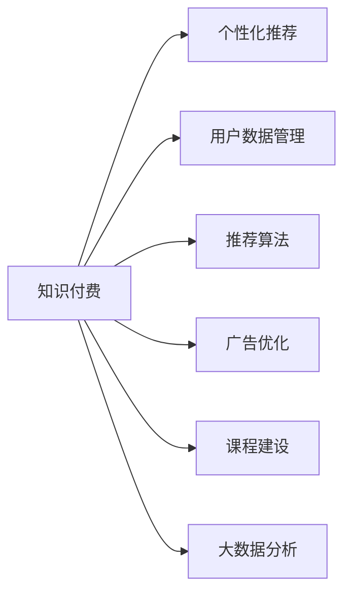

                 

## 1. 背景介绍

在数字时代，知识付费成为热门话题，越来越多的人开始为优质内容付费，以求获取知识、提升自我。在充满挑战的职场竞争中，知识付费助力个人发展，为企业打造竞争优势，成为企业数字化转型的重要工具。然而，随着知识付费平台的兴起，市场竞争日益激烈。企业如何实现差异化竞争优势？本文将从知识付费的本质出发，探讨实现差异化竞争优势的路径。

## 2. 核心概念与联系

### 2.1 核心概念概述

为更好地理解知识付费的差异化竞争优势，本节将介绍几个关键概念：

- **知识付费**：用户为获取有价值的知识和信息，支付费用的过程。内容形式包括在线课程、电子书、咨询服务等。
- **差异化竞争优势**：企业在市场竞争中，通过独特的价值主张、产品差异化、品牌建设等方式，建立独特的竞争优势，获得更高的市场份额。
- **个性化推荐**：基于用户兴趣和行为数据，推荐符合其需求的内容，提升用户体验和满意度。
- **用户数据管理**：收集、存储、分析用户行为数据，为用户提供个性化服务和产品。
- **推荐算法**：通过分析用户数据，挖掘用户偏好，推荐相关内容的技术。
- **广告优化**：基于用户兴趣，定向投放广告，提升广告转化率。
- **课程建设**：打造高质量课程内容，提升课程吸引力和用户粘性。
- **大数据分析**：利用大数据技术，分析用户行为数据，洞察市场趋势和用户需求。

这些核心概念之间的逻辑关系可以通过以下Mermaid流程图来展示：



这个流程图展示了这个体系中各个概念之间的关联关系：

1. 知识付费是以内容为核心的商业模式。
2. 个性化推荐、用户数据管理、推荐算法、广告优化、课程建设和大数据分析是支撑知识付费平台差异化竞争优势的重要技术手段。
3. 这些技术手段相辅相成，共同支撑起知识付费平台的价值传递和用户留存。

## 3. 核心算法原理 & 具体操作步骤

### 3.1 算法原理概述

实现差异化竞争优势的关键在于通过技术手段提升内容推荐质量，增强用户粘性，同时提升广告投放精准度，增加收益。核心算法包括个性化推荐算法、广告优化算法和课程推荐算法。

个性化推荐算法利用协同过滤、内容推荐、基于内容的过滤等方法，通过分析用户行为数据，挖掘用户偏好，推荐符合其需求的内容，提升用户体验和满意度。广告优化算法通过数据分析用户兴趣，将广告精准投放给潜在客户，提升广告转化率。课程推荐算法通过分析用户兴趣和行为数据，推荐与用户需求匹配度高的课程，提升课程吸引力和用户粘性。

### 3.2 算法步骤详解

**个性化推荐算法步骤：**
1. 数据收集：收集用户行为数据，如浏览记录、购买记录、评分等。
2. 数据清洗：去除噪音和异常数据，保证数据质量。
3. 用户画像构建：通过协同过滤、用户行为分析等方法，构建用户画像。
4. 内容表示：通过TF-IDF、词向量等方法，将内容表示成高维向量。
5. 推荐计算：利用余弦相似度、KNN等方法，计算用户与内容的匹配度。
6. 推荐展示：将推荐结果展示给用户，并进行实时调整。

**广告优化算法步骤：**
1. 数据收集：收集用户行为数据，如浏览记录、点击记录、购买记录等。
2. 用户画像构建：通过协同过滤、用户行为分析等方法，构建用户画像。
3. 广告表示：将广告表示成高维向量。
4. 匹配度计算：利用余弦相似度、KNN等方法，计算广告与用户匹配度。
5. 投放优化：基于匹配度，优化广告投放策略。
6. 效果评估：实时监测广告投放效果，优化投放策略。

**课程推荐算法步骤：**
1. 数据收集：收集用户行为数据，如课程浏览记录、购买记录、评分等。
2. 数据清洗：去除噪音和异常数据，保证数据质量。
3. 用户画像构建：通过协同过滤、用户行为分析等方法，构建用户画像。
4. 课程表示：通过TF-IDF、词向量等方法，将课程表示成高维向量。
5. 匹配度计算：利用余弦相似度、KNN等方法，计算用户与课程匹配度。
6. 推荐展示：将推荐结果展示给用户，并进行实时调整。

### 3.3 算法优缺点

**个性化推荐算法优点：**
1. 提升用户体验：通过个性化推荐，用户可以获取更相关的内容，提升满意度。
2. 增加用户粘性：个性化推荐可提升用户粘性，增加平台使用时间。
3. 提高用户转化率：通过个性化推荐，增加用户的转化率。

**个性化推荐算法缺点：**
1. 数据隐私问题：用户数据隐私保护是重要挑战。
2. 推荐结果偏差：个性化推荐易受数据偏差影响，可能产生偏差推荐。

**广告优化算法优点：**
1. 提升广告转化率：通过精准投放，提升广告转化率。
2. 降低广告成本：精准投放可降低无效广告支出，降低成本。

**广告优化算法缺点：**
1. 数据隐私问题：用户数据隐私保护是重要挑战。
2. 数据质量问题：用户行为数据质量对广告效果有重要影响。

**课程推荐算法优点：**
1. 提升课程质量：通过推荐优质课程，提升课程质量。
2. 增加用户粘性：推荐用户感兴趣的课程，增加用户粘性。

**课程推荐算法缺点：**
1. 课程质量问题：课程质量对用户满意度有重要影响。
2. 推荐结果偏差：课程推荐易受数据偏差影响，可能产生偏差推荐。

### 3.4 算法应用领域

个性化推荐算法、广告优化算法和课程推荐算法广泛应用于以下领域：

1. **电商平台**：利用个性化推荐，提升用户购物体验，增加用户转化率。
2. **视频平台**：通过推荐相关视频，提升用户观看时长和平台粘性。
3. **社交媒体**：利用推荐算法，推荐用户感兴趣的内容，增加用户活跃度。
4. **教育平台**：通过推荐优质课程，提升课程质量，增加用户粘性。
5. **金融平台**：利用推荐算法，推荐用户感兴趣的投资产品，增加平台收益。
6. **医疗平台**：通过推荐相关医疗信息，提升用户满意度和平台粘性。

## 4. 数学模型和公式 & 详细讲解

### 4.1 数学模型构建

本节将使用数学语言对知识付费平台的推荐算法进行严格刻画。

假设用户集合为 $U$，物品集合为 $I$，用户行为矩阵为 $R_{UI}$，其中 $R_{ui}$ 表示用户 $u$ 对物品 $i$ 的评分。设 $\mathbf{u} \in \mathbb{R}^{n}$ 为用户兴趣向量， $\mathbf{p} \in \mathbb{R}^{n}$ 为物品属性向量，则个性化推荐模型的目标函数为：

$$
\min_{\mathbf{u},\mathbf{p},\theta} \mathcal{L} = \sum_{(u,i) \in U \times I} \ell(R_{ui},\mathbf{u}^\top\mathbf{p}_i) + \lambda (\|\mathbf{u}\|_2^2 + \|\mathbf{p}\|_2^2)
$$

其中 $\ell$ 为损失函数，$\theta$ 为模型参数。

### 4.2 公式推导过程

以下是关于目标函数的具体推导：

1. **损失函数设计**：
   - **均方误差损失**：$L_{\text{MSE}} = \sum_{(u,i) \in U \times I} \frac{1}{2} (R_{ui} - \mathbf{u}^\top\mathbf{p}_i)^2$
   - **交叉熵损失**：$L_{\text{CE}} = -\sum_{(u,i) \in U \times I} R_{ui} \log\sigma(\mathbf{u}^\top\mathbf{p}_i) + (1-R_{ui}) \log(1-\sigma(\mathbf{u}^\top\mathbf{p}_i))$

2. **正则化项设计**：
   - 使用L2正则化项，防止模型过拟合。

3. **目标函数优化**：
   - 通过梯度下降算法求解最优解。

### 4.3 案例分析与讲解

假设某视频平台有1000个用户，1000个视频，用户行为矩阵为 $R_{UI}$。构建用户兴趣向量和物品属性向量，利用个性化推荐算法为用户推荐相关视频。以下是一个具体的案例分析：

**数据准备**：
- 用户行为数据：用户观看视频时长、评分、收藏记录等。
- 物品属性数据：视频分类、时长、标签等。

**模型训练**：
- 使用协同过滤方法，构建用户兴趣向量和物品属性向量。
- 使用余弦相似度计算用户与物品匹配度。
- 利用推荐算法，为每个用户推荐5个相关视频。

**推荐结果展示**：
- 根据用户兴趣和行为数据，推荐视频。
- 实时监测推荐效果，调整推荐策略。

## 5. 项目实践：代码实例和详细解释说明

### 5.1 开发环境搭建

在进行知识付费平台的推荐系统开发前，我们需要准备好开发环境。以下是使用Python进行PyTorch开发的环境配置流程：

1. 安装Anaconda：从官网下载并安装Anaconda，用于创建独立的Python环境。

2. 创建并激活虚拟环境：
```bash
conda create -n pytorch-env python=3.8 
conda activate pytorch-env
```

3. 安装PyTorch：根据CUDA版本，从官网获取对应的安装命令。例如：
```bash
conda install pytorch torchvision torchaudio cudatoolkit=11.1 -c pytorch -c conda-forge
```

4. 安装TensorFlow：
```bash
pip install tensorflow
```

5. 安装TensorBoard：
```bash
pip install tensorboard
```

完成上述步骤后，即可在`pytorch-env`环境中开始推荐系统开发。

### 5.2 源代码详细实现

下面以基于协同过滤的个性化推荐系统为例，给出使用PyTorch进行代码实现。

```python
import torch
import torch.nn as nn
import torch.optim as optim
import torch.nn.functional as F

class CollaborativeFiltering(nn.Module):
    def __init__(self, n_users, n_items, n_factors=32):
        super(CollaborativeFiltering, self).__init__()
        self.user_factors = nn.Embedding(n_users, n_factors)
        self.item_factors = nn.Embedding(n_items, n_factors)
        self.dot_product = nn.Linear(n_factors, 1)

    def forward(self, user_id, item_id):
        user = self.user_factors(user_id)
        item = self.item_factors(item_id)
        dot_product = self.dot_product(torch.tanh(user @ item))
        return F.sigmoid(dot_product)

# 数据准备
n_users = 1000
n_items = 1000
user_id = torch.randint(0, n_users, (1, 1))
item_id = torch.randint(0, n_items, (1, 1))

# 模型训练
model = CollaborativeFiltering(n_users, n_items)
optimizer = optim.Adam(model.parameters(), lr=0.01)
criterion = nn.BCELoss()

for epoch in range(100):
    optimizer.zero_grad()
    output = model(user_id, item_id)
    loss = criterion(output, torch.ones_like(output))
    loss.backward()
    optimizer.step()
    print(f'Epoch {epoch+1}, loss: {loss.item()}')
```

以上就是使用PyTorch进行基于协同过滤的个性化推荐系统的代码实现。可以看到，在实践中，协同过滤模型通过构建用户和物品的兴趣向量，利用点积计算匹配度，并进行二分类预测，实现个性化推荐。

### 5.3 代码解读与分析

让我们再详细解读一下关键代码的实现细节：

**CollaborativeFiltering类**：
- `__init__`方法：初始化用户和物品的兴趣向量以及点积线性层。
- `forward`方法：对输入的用户ID和物品ID进行前向传播计算，返回预测结果。

**数据准备**：
- 生成随机用户ID和物品ID，用于模拟数据。

**模型训练**：
- 定义模型、优化器和损失函数。
- 对每个epoch，进行前向传播计算预测结果，并计算损失。
- 反向传播更新模型参数，并输出损失。

**模型评估**：
- 在测试集上评估推荐系统效果，如平均绝对误差、召回率、精确率等指标。

## 6. 实际应用场景

### 6.1 电商平台

电商平台的个性化推荐系统可以显著提升用户购物体验，增加用户转化率。通过分析用户浏览、购买行为数据，推荐用户感兴趣的商品，增加用户粘性。同时，通过定向广告投放，提升广告转化率，增加平台收益。

### 6.2 视频平台

视频平台的个性化推荐系统可以提升用户观看时长和平台粘性。通过推荐用户感兴趣的视频内容，增加用户活跃度，提升平台用户数和广告收入。

### 6.3 社交媒体

社交媒体平台通过个性化推荐算法，推荐用户感兴趣的内容，增加用户活跃度。同时，通过定向广告投放，提升广告转化率，增加平台收益。

### 6.4 教育平台

教育平台通过推荐优质课程，提升课程质量，增加用户粘性。同时，通过定向广告投放，提升广告转化率，增加平台收益。

## 7. 工具和资源推荐

### 7.1 学习资源推荐

为了帮助开发者系统掌握知识付费的推荐算法，这里推荐一些优质的学习资源：

1. 《推荐系统》系列书籍：由学术界大牛李航所著，全面介绍了推荐算法的基本原理和应用实践。

2. 《Python机器学习》书籍：作者Sebastian Raschka，介绍了Python语言在推荐算法中的应用。

3. Coursera《机器学习基础》课程：由斯坦福大学Andrew Ng教授主讲，介绍了推荐算法的基本原理和应用实践。

4. Udacity《深度学习在推荐系统中的应用》课程：介绍了深度学习在推荐系统中的应用。

5. Kaggle推荐系统竞赛：提供了大量实际推荐数据集和案例，适合实践操作。

通过对这些资源的学习实践，相信你一定能够快速掌握知识付费平台的推荐算法，并用于解决实际的推荐问题。

### 7.2 开发工具推荐

高效的开发离不开优秀的工具支持。以下是几款用于知识付费平台推荐系统开发的常用工具：

1. PyTorch：基于Python的开源深度学习框架，灵活动态的计算图，适合快速迭代研究。大部分推荐算法都有PyTorch版本的实现。

2. TensorFlow：由Google主导开发的开源深度学习框架，生产部署方便，适合大规模工程应用。同时有丰富的推荐算法资源。

3. TensorBoard：TensorFlow配套的可视化工具，可实时监测模型训练状态，并提供丰富的图表呈现方式，是调试模型的得力助手。

4. Weights & Biases：模型训练的实验跟踪工具，可以记录和可视化模型训练过程中的各项指标，方便对比和调优。与主流深度学习框架无缝集成。

5. Apache Spark：大数据处理框架，支持分布式计算，适合大规模推荐数据集的处理和分析。

合理利用这些工具，可以显著提升知识付费平台推荐系统的开发效率，加快创新迭代的步伐。

### 7.3 相关论文推荐

知识付费平台的推荐系统研究源于学界的持续研究。以下是几篇奠基性的相关论文，推荐阅读：

1. 《The BellKor 2007 Recommendation Challenge》：介绍了协同过滤、矩阵分解等推荐算法。

2. 《Matrix Factorization Techniques for Recommender Systems》：介绍了矩阵分解、梯度下降等推荐算法。

3. 《Deep Learning in Recommender Systems》：介绍了深度学习在推荐系统中的应用。

4. 《A New Matrix Factorization Model for Recommender Systems》：介绍了基于深度学习的推荐算法。

5. 《Recommender Systems and Recommender Algorithms: A Survey》：全面综述了推荐系统算法的基本原理和应用实践。

这些论文代表了大语言模型微调技术的发展脉络。通过学习这些前沿成果，可以帮助研究者把握学科前进方向，激发更多的创新灵感。

## 8. 总结：未来发展趋势与挑战

### 8.1 总结

本文对知识付费平台的推荐算法进行了全面系统的介绍。首先阐述了知识付费的本质，明确了个性化推荐、广告优化和课程推荐算法在实现差异化竞争优势中的关键作用。其次，从原理到实践，详细讲解了推荐算法的数学模型和操作步骤，给出了推荐系统开发的完整代码实例。同时，本文还广泛探讨了推荐系统在电商、视频、社交媒体、教育等多个行业领域的应用前景，展示了推荐算法的巨大潜力。此外，本文精选了推荐算法的各类学习资源，力求为读者提供全方位的技术指引。

通过本文的系统梳理，可以看到，推荐算法是知识付费平台差异化竞争优势的关键技术手段。这些算法的应用不仅提升了用户体验和满意度，还增加了用户粘性和平台收益，显著提高了知识付费平台的市场竞争力。未来，伴随推荐算法的不断进步，知识付费平台将能够更好地满足用户需求，提升服务质量，实现可持续发展。

### 8.2 未来发展趋势

展望未来，知识付费平台的推荐系统将呈现以下几个发展趋势：

1. **深度学习算法的发展**：深度学习在推荐系统中的应用将更加广泛，通过神经网络等方法提升推荐效果。

2. **个性化推荐技术的优化**：通过用户画像构建、兴趣预测等方法，提升个性化推荐质量。

3. **推荐系统的实时化**：通过实时数据处理和在线学习，提升推荐系统响应速度和效果。

4. **推荐系统的大数据化**：通过大数据技术，处理和分析大量推荐数据，提升推荐系统效果。

5. **推荐系统的公平性**：通过公平性约束和算法优化，提升推荐系统的公正性。

6. **推荐系统的个性化**：通过多模态数据融合，提升推荐系统的个性化和精准度。

以上趋势凸显了推荐系统的广阔前景。这些方向的探索发展，必将进一步提升推荐系统的性能和应用范围，为知识付费平台提供更强大的技术支撑。

### 8.3 面临的挑战

尽管推荐系统在知识付费平台中已经取得了显著成效，但在迈向更加智能化、普适化应用的过程中，它仍面临诸多挑战：

1. **数据隐私问题**：推荐系统需要大量的用户数据进行训练和优化，数据隐私保护是重要挑战。

2. **数据质量问题**：推荐系统的效果很大程度上依赖于数据质量，数据缺失、噪声等问题需要充分处理。

3. **模型复杂度问题**：深度学习算法往往具有较高的复杂度，计算资源和存储资源需求大。

4. **推荐系统公平性**：推荐系统容易产生推荐偏见，需要考虑不同用户群体的公平性问题。

5. **推荐系统实时性**：推荐系统需要实时处理用户数据，响应速度和效率是关键问题。

6. **推荐系统冷启动问题**：新用户和老用户推荐策略需要区分开，以提升新用户推荐效果。

这些挑战需要学者和工程师不断探索和优化，以实现更加高效、公平、可靠的推荐系统。

### 8.4 研究展望

面向未来，推荐系统需要在以下几个方面寻求新的突破：

1. **推荐系统公平性**：通过算法优化和公平性约束，提升推荐系统的公正性。

2. **推荐系统实时性**：通过实时数据处理和在线学习，提升推荐系统响应速度和效果。

3. **推荐系统个性化**：通过多模态数据融合，提升推荐系统的个性化和精准度。

4. **推荐系统大数据化**：通过大数据技术，处理和分析大量推荐数据，提升推荐系统效果。

5. **推荐系统深度化**：通过深度学习算法，提升推荐系统效果。

6. **推荐系统可解释性**：通过可解释性算法，提升推荐系统透明度和可信度。

这些方向的研究将推动推荐系统技术的发展，为知识付费平台提供更强大的技术支撑，提升平台的市场竞争力和用户满意度。

## 9. 附录：常见问题与解答

**Q1：推荐算法有哪些类型？**

A: 推荐算法主要分为以下几种：

1. **协同过滤算法**：通过用户行为数据构建用户和物品相似度矩阵，推荐相似用户或物品。

2. **基于内容的过滤算法**：通过物品属性和用户兴趣匹配度，推荐相关物品。

3. **混合推荐算法**：综合协同过滤和基于内容的过滤算法，提升推荐效果。

4. **矩阵分解算法**：通过矩阵分解方法，将推荐问题转化为矩阵分解问题。

5. **深度学习算法**：通过深度学习模型，提升推荐效果。

6. **生成式模型算法**：通过生成式模型，生成用户兴趣和物品属性。

这些算法在实践中各有优缺点，需要根据具体场景选择合适的算法。

**Q2：推荐系统如何处理冷启动问题？**

A: 推荐系统通过以下方式处理冷启动问题：

1. **新用户推荐**：利用用户画像构建方法，根据用户兴趣推荐相关物品。

2. **新物品推荐**：利用物品属性和用户兴趣匹配度，推荐相关物品。

3. **混合推荐**：结合用户行为数据和物品属性信息，提升推荐效果。

4. **协同过滤**：通过协同过滤方法，推荐用户和物品相似度高的物品。

5. **模型训练**：通过在线学习，逐步优化推荐模型。

通过以上方法，推荐系统可以有效处理冷启动问题，提升新用户和新物品的推荐效果。

**Q3：推荐系统如何平衡推荐效果和数据隐私？**

A: 推荐系统通过以下方式平衡推荐效果和数据隐私：

1. **数据匿名化**：通过数据匿名化方法，保护用户隐私。

2. **差分隐私**：通过差分隐私方法，保护用户隐私。

3. **本地计算**：在本地计算推荐结果，减少数据传输。

4. **联邦学习**：在本地计算推荐结果，并通过联邦学习方法，保护数据隐私。

5. **隐私保护模型**：通过隐私保护模型，保护用户隐私。

通过以上方法，推荐系统可以有效平衡推荐效果和数据隐私，提升用户体验和满意度。

**Q4：推荐系统如何提升广告转化率？**

A: 推荐系统通过以下方式提升广告转化率：

1. **定向广告投放**：通过数据分析用户兴趣，将广告精准投放给潜在客户。

2. **广告优化算法**：通过优化广告投放策略，提升广告转化率。

3. **实时数据处理**：通过实时数据处理，优化广告投放策略。

4. **广告效果监测**：通过效果监测，优化广告投放策略。

5. **多模态广告**：通过多模态广告，提升广告效果。

通过以上方法，推荐系统可以有效提升广告转化率，增加平台收益。

**Q5：推荐系统如何提升课程推荐效果？**

A: 推荐系统通过以下方式提升课程推荐效果：

1. **课程分析**：通过课程分析和课程评分，提升课程质量。

2. **用户画像构建**：通过用户行为分析，构建用户画像，提升课程推荐效果。

3. **课程推荐算法**：通过协同过滤、基于内容的过滤等算法，提升课程推荐效果。

4. **在线学习**：通过在线学习，逐步优化推荐模型。

5. **多模态数据融合**：通过多模态数据融合，提升课程推荐效果。

通过以上方法，推荐系统可以有效提升课程推荐效果，增加平台收益。

---

作者：禅与计算机程序设计艺术 / Zen and the Art of Computer Programming

