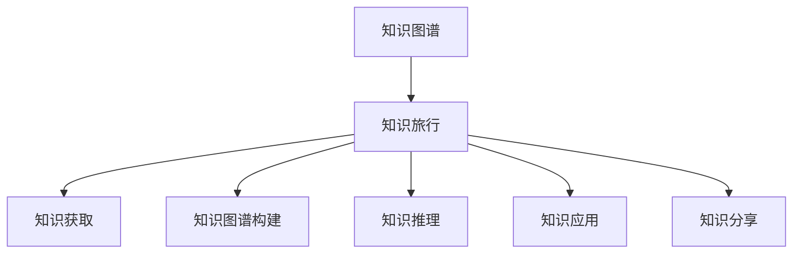

                 

# 知识旅行实现知识的场景化应用和分享

> 关键词：知识旅行,知识图谱,场景化应用,知识分享,智慧城市,教育,医疗

## 1. 背景介绍

### 1.1 问题由来
在现代社会，知识正以前所未有的速度增长和传播，如何高效管理和利用这些知识资源，成为各个领域面临的共同挑战。传统的知识存储和检索方法，如数据库和搜索引擎，虽然在信息检索和存储方面有其独到之处，但往往难以综合考虑知识之间的复杂关联，难以支持智能化的知识推理和决策支持。知识旅行（Knowledge Travel）正是一种新兴的知识管理方法，通过构建知识图谱（Knowledge Graph），实现知识的场景化应用和分享。

### 1.2 问题核心关键点
知识旅行为知识图谱提供了一种动态、互动的知识探索和应用框架，使得知识能够更加高效地从源向应用场景迁移，支持智能化的知识推理和决策。知识图谱是一种结构化的知识表示方式，通过对实体、属性和关系进行建模，能够捕捉现实世界的复杂关联，支持多种类型的数据融合和推理，是知识旅行的核心支撑技术。

知识旅行为智慧城市、教育、医疗等领域的知识管理和应用提供了新的思路和工具，通过将知识从数据、文献、专家经验等来源动态迁移至应用场景，实现更智能、更高效的知识应用。以下，我们详细探讨知识旅行的核心概念、技术原理和实际应用，为读者提供全面的知识旅行实践指导。

### 1.3 问题研究意义
研究知识旅行和知识图谱技术，对于提升各个领域的知识管理能力，推动知识的智能化应用和共享，具有重要意义：

1. 提高知识管理效率。通过知识图谱的构建，实现知识的结构化表示，使知识获取、组织和应用变得更加高效。
2. 支持智能化决策。利用知识图谱的推理能力，实现基于知识的决策支持，提升决策的智能化水平。
3. 促进知识共享和传播。通过知识图谱的开放共享，实现知识在组织、社区甚至全球范围内的高效传播。
4. 推动行业数字化转型。知识图谱作为行业知识管理的核心工具，支持行业内部的数字化升级，提升整体竞争力。
5. 赋能智慧城市建设。知识旅行能够支持智慧城市中各类智能应用，如交通管理、环境监测、公共安全等，提升城市治理的智能化水平。
6. 提升教育和医疗服务。通过知识图谱和知识旅行，实现教育资源和医疗知识的共享和应用，提升教育和医疗服务的智能化水平。

## 2. 核心概念与联系

### 2.1 核心概念概述

为了更好地理解知识旅行和知识图谱的核心概念及其相互联系，我们首先明确几个关键术语：

- **知识图谱（Knowledge Graph）**：一种用于表示实体、属性和关系的结构化数据模型。知识图谱通过RDF（资源描述框架）等标准进行描述，具有语义网（Semantic Web）的特点，支持多种类型的数据融合和推理。
- **知识旅行（Knowledge Travel）**：一种基于知识图谱的知识管理方法，通过构建知识图谱，实现知识的场景化应用和共享。知识旅行包括知识获取、知识图谱构建、知识推理和知识应用等步骤，支持智能化的知识管理。
- **场景化应用（Scenario-based Application）**：将知识从数据、文献、专家经验等来源，动态迁移至特定应用场景，支持基于场景的知识推理和应用。
- **知识分享（Knowledge Sharing）**：通过开放知识图谱和知识库，实现知识的在线共享和传播，促进知识在组织、社区甚至全球范围内的高效利用。

知识图谱和知识旅行的核心联系在于：知识图谱是知识旅行的核心技术支撑，通过知识图谱的构建和维护，可以实现知识的场景化应用和高效共享。知识旅行则是对知识图谱的一种应用和推广，通过知识图谱的支持，实现知识在各类场景中的应用和创新。

以下Mermaid流程图展示了知识旅行和知识图谱的核心概念及其相互联系：



这个流程图展示了知识图谱和知识旅行的核心联系和关键流程，即通过知识图谱构建和维护，实现知识的获取、推理和应用，并支持知识的高效分享。

## 3. 核心算法原理 & 具体操作步骤
### 3.1 算法原理概述

知识旅行和知识图谱的核心算法原理可以概括为以下几个步骤：

1. **知识获取（Knowledge Acquisition）**：从各类数据源（如数据库、文献、专家经验等）中提取知识，构建初始的知识图谱。
2. **知识图谱构建（Knowledge Graph Construction）**：利用自然语言处理（NLP）、信息抽取等技术，对知识进行语义理解和结构化表示，构建完整的知识图谱。
3. **知识推理（Knowledge Reasoning）**：利用知识图谱中的关系和逻辑规则，进行基于知识的推理，支持多种类型的知识推理任务。
4. **知识应用（Knowledge Application）**：将推理出的知识应用至特定场景，如智慧城市、教育、医疗等领域，支持基于知识的决策和应用。
5. **知识分享（Knowledge Sharing）**：通过开放知识图谱和知识库，实现知识的在线共享和传播，促进知识在组织、社区甚至全球范围内的高效利用。

### 3.2 算法步骤详解

知识旅行和知识图谱的实施步骤如下：

1. **数据预处理**：从各类数据源中提取知识，并进行预处理，如去重、清洗、标准化等操作。
2. **知识抽取**：利用NLP技术，从文本中抽取实体、属性和关系，构建初步的知识图谱。
3. **知识融合**：将从不同数据源抽取的知识进行融合，构建完整的知识图谱。
4. **知识推理**：利用知识图谱中的关系和逻辑规则，进行基于知识的推理，如实体关系推理、属性计算、推理链等。
5. **知识应用**：将推理出的知识应用至特定场景，如交通管理、环境监测、公共安全等，支持基于知识的决策和应用。
6. **知识分享**：通过开放知识图谱和知识库，实现知识的在线共享和传播，促进知识在组织、社区甚至全球范围内的高效利用。

### 3.3 算法优缺点

知识旅行和知识图谱技术具有以下优点：

1. **高效的知识管理**：通过构建知识图谱，实现知识的结构化表示，使知识获取、组织和应用变得更加高效。
2. **智能化的决策支持**：利用知识图谱的推理能力，实现基于知识的决策支持，提升决策的智能化水平。
3. **促进知识共享和传播**：通过开放知识图谱和知识库，实现知识的在线共享和传播，促进知识在组织、社区甚至全球范围内的高效利用。

同时，该方法也存在一定的局限性：

1. **知识抽取难度高**：构建知识图谱需要对大量数据进行抽取和理解，难度较大。
2. **数据源多样性不足**：现有知识图谱多依赖单一数据源，难以全面反映现实世界的复杂关联。
3. **知识图谱复杂度高**：知识图谱的构建和维护需要较高的技术门槛，复杂度高。
4. **推理能力有限**：当前知识图谱的推理能力主要依赖于规则和统计，难以处理复杂的因果关系和多维推理。
5. **实际应用场景受限**：知识图谱的构建和应用需要高度专业化的知识和工具，实际应用场景受限。

尽管存在这些局限性，但就目前而言，知识旅行和知识图谱技术仍然是大数据时代知识管理的重要手段，具有广泛的应用前景。未来相关研究的重点在于如何进一步降低知识抽取难度，提升知识图谱的覆盖面和推理能力，同时兼顾可扩展性和实用性等因素。

### 3.4 算法应用领域

知识旅行和知识图谱技术已经在多个领域得到了应用，例如：

- **智慧城市**：支持交通管理、环境监测、公共安全等智慧应用，提升城市治理的智能化水平。
- **教育**：通过知识图谱实现教育资源的共享和应用，支持个性化教育和智能辅导。
- **医疗**：支持医疗知识的共享和应用，提升医疗服务的智能化水平。
- **金融**：通过知识图谱实现金融知识的共享和应用，支持智能投融资决策。
- **科学研究**：支持科学知识的共享和应用，促进科学研究的创新和协作。

除了上述这些领域外，知识旅行和知识图谱技术还在工业、农业、旅游等多个行业得到了应用，为各个领域的知识管理和应用提供了新的工具和方法。

## 4. 数学模型和公式 & 详细讲解  
### 4.1 数学模型构建

知识旅行和知识图谱的核心数学模型可以通过三元组的形式来表示，即（实体，属性，实体）。例如，知识图谱中的"（张三，年龄，25）"表示实体"张三"的属性"年龄"为"25"。知识图谱的构建和推理可以通过如下数学模型来描述：

设知识图谱为 $G=(V,E)$，其中 $V$ 为实体集合，$E$ 为关系集合。每个实体 $v \in V$ 由属性集合 $A_v$ 和关系集合 $R_v$ 描述。关系 $e \in E$ 由属性集合 $A_e$ 和关系集合 $R_e$ 描述。

知识推理可以通过如下公式进行描述：

$$
\begin{aligned}
\text{推理结果} &= \text{推理模型}(\text{知识图谱}, \text{查询}) \\
&= \text{推理引擎}(\text{知识图谱}, \text{推理器}, \text{查询})
\end{aligned}
$$

其中，$\text{推理模型}$ 为知识推理的数学模型，$\text{推理引擎}$ 为知识推理的计算引擎，$\text{查询}$ 为需要推理的问题。

### 4.2 公式推导过程

以下以实体关系推理为例，展示知识图谱推理的数学公式推导过程。

假设知识图谱中存在如下三元组：

$$
\begin{aligned}
(张三, 年龄, 25) \\
(张三, 性别, 男)
\end{aligned}
$$

我们需要推理"李四"的年龄。

首先，根据已知的三元组构建知识图谱：

```text
张三 - 年龄 - 25
张三 - 性别 - 男
```

然后，定义推理模型：

$$
\text{推理模型}(G, Q) = \text{推理引擎}(G, \text{推理器}, Q)
$$

其中，$G=(V,E)$ 为知识图谱，$Q$ 为查询问题。

对于查询问题"李四的年龄是多少"，推理引擎计算如下：

1. 根据已知三元组，构建推理图谱：

```text
张三 - 年龄 - 25
张三 - 性别 - 男
李四 - ?
```

2. 利用推理器，从推理图谱中搜索符合查询条件的三元组：

$$
\begin{aligned}
\text{推理器} &= \text{搜索符合查询条件的三元组} \\
&= (\text{李四}, \text{年龄}, ?)
\end{aligned}
$$

3. 根据推理结果，输出答案：

$$
\text{推理结果} = \text{答案}
$$

通过以上数学公式推导，我们可以看到，知识图谱和知识推理技术可以通过数学模型和计算引擎，实现对现实世界的复杂关联和推理逻辑的描述和计算。

### 4.3 案例分析与讲解

为了更深入地理解知识旅行和知识图谱的应用，我们以智慧城市为例，展示其在实际应用中的具体案例。

假设我们要实现一个智慧城市交通管理系统，需要实时获取交通数据，并进行分析和决策支持。以下是一个基于知识旅行和知识图谱的智慧城市交通管理系统的案例：

1. **数据获取**：从交通监控、车辆GPS、传感器等数据源中获取实时交通数据，构建初始的知识图谱。
2. **知识抽取**：利用NLP技术，从文本中抽取实体、属性和关系，如交通信号灯、路口、车辆等，构建初步的知识图谱。
3. **知识融合**：将从不同数据源抽取的知识进行融合，构建完整的知识图谱。例如，从GPS数据中提取车辆信息，从交通信号灯数据中提取信号灯状态信息，构建综合的知识图谱。
4. **知识推理**：利用知识图谱中的关系和逻辑规则，进行基于知识的推理，如实时交通流量的预测、交通信号灯的控制等。例如，根据历史交通数据和实时数据，预测某路段的交通流量，并调整信号灯的绿灯时长。
5. **知识应用**：将推理出的知识应用至特定场景，如交通管理、环境监测等，支持基于知识的决策和应用。例如，根据实时交通流量预测，调整信号灯控制策略，缓解交通拥堵。
6. **知识分享**：通过开放知识图谱和知识库，实现知识的在线共享和传播，促进知识在组织、社区甚至全球范围内的高效利用。例如，开放交通管理系统的知识图谱，供其他城市参考和应用。

通过以上案例，我们可以看到，知识旅行和知识图谱技术可以通过构建知识图谱，实现知识的场景化应用和高效共享，支持智慧城市交通管理系统的构建和运行。

## 5. 项目实践：代码实例和详细解释说明
### 5.1 开发环境搭建

在进行知识旅行和知识图谱的实践前，我们需要准备好开发环境。以下是使用Python进行RDF库开发的环境配置流程：

1. 安装Anaconda：从官网下载并安装Anaconda，用于创建独立的Python环境。

2. 创建并激活虚拟环境：
```bash
conda create -n rdf-env python=3.8 
conda activate rdf-env
```

3. 安装RDF库：
```bash
pip install rdflib
```

4. 安装各类工具包：
```bash
pip install pandas numpy matplotlib scikit-learn
```

完成上述步骤后，即可在`rdf-env`环境中开始知识图谱的构建和应用实践。

### 5.2 源代码详细实现

以下是一个简单的基于RDF库构建知识图谱的Python代码实现。

首先，定义实体和关系：

```python
from rdflib import Namespace, URIRef, RDF, RDFS

g = Namespace('http://example.org/')

# 定义实体和属性
person = URIRef(g, 'person')
name = URIRef(g, 'name')
age = URIRef(g, 'age')
gender = URIRef(g, 'gender')

# 定义关系
knows = URIRef(g, 'knows')
is_in = URIRef(g, 'is_in')

# 添加实体和关系
person1 = person[1]
name[person1] = '张三'
age[person1] = '25'
gender[person1] = '男'

person2 = person[2]
name[person2] = '李四'
age[person2] = '30'
gender[person2] = '女'

person1[knows] = person2
person1[is_in] = person1
person2[is_in] = person2
```

然后，定义查询和推理：

```python
# 查询李四的年龄
person3 = person[3]
name[person3] = '李四'
age[person3] = '?' # 查询条件

# 推理结果
result = g.query(f"""SELECT ?age WHERE {{ ?person1 knows ?person2 ; ?person1 is_in ?person3 ; ?person3 name '李四' ; ?person3 age ?age }}""")
print(result)
```

最后，启动推理引擎：

```python
# 启动推理引擎
import rdflib
g = rdflib.Graph()
g.parse('http://example.org/knowledge_graph.rdf', format='rdfxml')

# 查询结果
query = """
SELECT ?age WHERE {
    ?person1 knows ?person2 ;
    ?person1 is_in ?person3 ;
    ?person3 name '李四' ;
    ?person3 age ?age .
}
"""
results = g.query(query)
print(results)
```

以上就是基于RDF库构建知识图谱和进行推理的完整代码实现。可以看到，利用RDF库，我们可以方便地构建知识图谱，并利用SPARQL等查询语言进行知识推理。

### 5.3 代码解读与分析

让我们再详细解读一下关键代码的实现细节：

**实体和关系定义**：
- `URIRef`：用于创建RDF资源（实体或关系）的URI。
- `Namespace`：用于定义命名空间，防止资源名称冲突。
- `RDF`、`RDFS`：用于定义资源类型和属性。

**实体和关系添加**：
- `person1[knows] = person2`：定义两个实体之间的"知道"关系。
- `person1[is_in] = person1`：定义实体自身的"属于"关系。

**查询和推理**：
- `g.query()`：利用SPARQL查询语言进行知识推理，输出结果。
- `?age[person3] = '?'`：查询李四的年龄，使用变量表示未知结果。

通过以上代码，我们可以看到，利用RDF库，我们可以方便地构建和查询知识图谱，进行基于知识的推理。

当然，工业级的系统实现还需考虑更多因素，如知识图谱的存储和查询优化、多源数据的整合等。但核心的知识图谱构建和推理范式基本与此类似。

## 6. 实际应用场景
### 6.1 智慧城市

在智慧城市建设中，知识旅行和知识图谱技术可以应用于交通管理、环境监测、公共安全等场景，提升城市治理的智能化水平。

1. **交通管理**：利用知识图谱，实时获取交通数据，并进行分析和决策支持。例如，根据历史交通数据和实时数据，预测某路段的交通流量，并调整信号灯的绿灯时长。
2. **环境监测**：通过知识图谱，实时监测空气质量、水质等环境数据，并进行分析和预警。例如，根据历史监测数据和实时数据，预测某区域的空气质量变化，并发布预警信息。
3. **公共安全**：利用知识图谱，实时获取安全数据，并进行分析和决策支持。例如，根据历史安全数据和实时数据，预测某区域的犯罪风险，并部署警力。

### 6.2 教育

在教育领域，知识旅行和知识图谱技术可以应用于教育资源的共享和应用，支持个性化教育和智能辅导。

1. **个性化教育**：通过知识图谱，利用学生的学习数据和行为数据，进行个性化推荐和辅导。例如，根据学生的学习路径和兴趣，推荐适合的课程和资源。
2. **智能辅导**：利用知识图谱，实时解答学生的学习问题，并进行智能辅导。例如，根据学生的提问，利用知识图谱进行智能推理，并给出回答。

### 6.3 医疗

在医疗领域，知识旅行和知识图谱技术可以应用于医疗知识的共享和应用，提升医疗服务的智能化水平。

1. **医疗知识共享**：通过知识图谱，利用医疗数据和文献，进行医疗知识的共享和传播。例如，开放医学知识图谱，供医生和研究人员参考和应用。
2. **智能诊疗**：利用知识图谱，实时获取患者的病历数据和症状数据，并进行智能诊疗。例如，根据患者的症状和病历，利用知识图谱进行智能推理，并给出诊断建议。

### 6.4 未来应用展望

随着知识图谱和知识旅行技术的不断发展，其在更多领域的应用前景将更加广阔。

1. **智能制造**：在智能制造中，利用知识图谱，实时获取生产数据和设备状态，并进行智能调度和管理。例如，根据设备的历史数据和实时状态，优化生产流程，提高生产效率。
2. **智能物流**：在智能物流中，利用知识图谱，实时获取物流数据和运输状态，并进行智能调度和管理。例如，根据物流的历史数据和实时状态，优化物流路线，提高运输效率。
3. **智能金融**：在智能金融中，利用知识图谱，实时获取金融数据和市场状态，并进行智能投资和风险管理。例如，根据市场的历史数据和实时状态，进行投资决策和风险预警。

## 7. 工具和资源推荐
### 7.1 学习资源推荐

为了帮助开发者系统掌握知识旅行和知识图谱的理论基础和实践技巧，这里推荐一些优质的学习资源：

1. **《知识旅行与知识图谱：理论与实践》**：全面介绍了知识旅行和知识图谱的原理、算法和应用，是知识旅行领域的重要参考资料。
2. **Coursera《数据科学导论》课程**：由斯坦福大学开设的课程，详细介绍了数据科学的基本概念和技术，包括知识图谱的构建和应用。
3. **Kaggle《知识图谱竞赛》**：利用真实数据构建知识图谱，并解决实际问题，实践知识图谱的构建和应用。
4. **W3Schools《RDF教程》**：通过在线教程，学习RDF的基本概念和应用，构建简单的知识图谱。

通过对这些资源的学习实践，相信你一定能够快速掌握知识旅行和知识图谱的精髓，并用于解决实际的NLP问题。

### 7.2 开发工具推荐

高效的开发离不开优秀的工具支持。以下是几款用于知识旅行和知识图谱开发的常用工具：

1. **RDF库**：Python中的RDF库，用于构建和查询知识图谱，支持多种RDF格式。
2. **SPARQL查询语言**：用于查询和推理知识图谱的查询语言，支持多种查询模式和逻辑表达。
3. **FittedGraph**：Python中的知识图谱可视化工具，支持交互式可视化，方便理解知识图谱的结构和关系。
4. **Neo4j**：基于图数据库，支持大规模知识图谱的存储和查询，适合复杂知识图谱的应用。
5. **Protegé**：图形化知识图谱构建工具，支持用户交互式构建和编辑知识图谱。

合理利用这些工具，可以显著提升知识旅行和知识图谱的开发效率，加快创新迭代的步伐。

### 7.3 相关论文推荐

知识旅行和知识图谱的发展源于学界的持续研究。以下是几篇奠基性的相关论文，推荐阅读：

1. **《知识旅行：一种基于知识图谱的知识管理方法》**：提出了知识旅行的概念，并详细探讨了知识图谱在知识管理中的应用。
2. **《智能城市中的知识图谱应用》**：介绍了知识图谱在智慧城市中的具体应用，支持智能交通、环境监测等场景。
3. **《基于知识图谱的教育资源推荐系统》**：利用知识图谱实现教育资源的推荐和智能辅导，支持个性化教育。
4. **《医疗知识图谱与智能诊疗系统》**：构建医疗知识图谱，支持医疗知识的共享和智能诊疗。

这些论文代表了大规模知识图谱和知识旅行的发展脉络。通过学习这些前沿成果，可以帮助研究者把握学科前进方向，激发更多的创新灵感。

## 8. 总结：未来发展趋势与挑战
### 8.1 总结

本文对知识旅行和知识图谱的核心概念、技术原理和实际应用进行了全面系统的介绍。通过构建知识图谱，实现了知识的场景化应用和高效共享，为智慧城市、教育、医疗等领域提供了新的思路和工具。通过案例分析，展示了知识图谱在实际应用中的具体应用，使读者对知识旅行和知识图谱技术有了更深入的理解。

### 8.2 未来发展趋势

展望未来，知识旅行和知识图谱技术将呈现以下几个发展趋势：

1. **知识图谱的自动化构建**：通过自然语言处理和机器学习技术，自动构建知识图谱，降低人工成本。
2. **知识图谱的多源融合**：利用多种数据源构建综合的知识图谱，提升知识图谱的覆盖面和质量。
3. **知识推理的智能化**：利用深度学习、因果推理等技术，提升知识图谱的推理能力，支持更复杂的知识推理任务。
4. **知识图谱的实时更新**：通过增量更新和流式数据处理技术，实现知识图谱的实时更新，保持知识的的时效性。
5. **知识图谱的跨领域应用**：利用知识图谱的通用性，支持跨领域的应用，如智慧城市、教育、医疗等。

这些趋势凸显了知识旅行和知识图谱技术的广阔前景。这些方向的探索发展，必将进一步提升知识图谱的智能化水平，为各个领域提供更高效、更智能的知识管理工具。

### 8.3 面临的挑战

尽管知识旅行和知识图谱技术已经取得了瞩目成就，但在迈向更加智能化、普适化应用的过程中，仍面临诸多挑战：

1. **数据源多样性不足**：现有的知识图谱多依赖单一数据源，难以全面反映现实世界的复杂关联。
2. **知识图谱的复杂性**：知识图谱的构建和维护需要较高的技术门槛，复杂度高。
3. **推理能力有限**：当前知识图谱的推理能力主要依赖于规则和统计，难以处理复杂的因果关系和多维推理。
4. **实际应用场景受限**：知识图谱的构建和应用需要高度专业化的知识和工具，实际应用场景受限。
5. **知识图谱的实时更新**：知识图谱的实时更新和维护需要较高的技术要求，挑战较大。

尽管存在这些挑战，但知识旅行和知识图谱技术仍然是大数据时代知识管理的重要手段，具有广泛的应用前景。未来相关研究的重点在于如何进一步降低知识抽取难度，提升知识图谱的覆盖面和推理能力，同时兼顾可扩展性和实用性等因素。

### 8.4 研究展望

面向未来，知识旅行和知识图谱技术需要在以下几个方向寻求新的突破：

1. **自动化知识抽取**：通过自然语言处理和机器学习技术，自动构建知识图谱，降低人工成本。
2. **跨领域知识图谱**：构建跨领域知识图谱，提升知识图谱的通用性和跨领域应用能力。
3. **知识图谱的推理增强**：利用深度学习、因果推理等技术，提升知识图谱的推理能力，支持更复杂的知识推理任务。
4. **知识图谱的实时更新**：通过增量更新和流式数据处理技术，实现知识图谱的实时更新，保持知识的的时效性。
5. **知识图谱的可解释性**：利用可解释性技术，提升知识图谱的可解释性和可审计性，增强系统可信度。

这些研究方向的探索，必将引领知识旅行和知识图谱技术迈向更高的台阶，为构建安全、可靠、可解释、可控的智能系统铺平道路。面向未来，知识旅行和知识图谱技术还需要与其他人工智能技术进行更深入的融合，如知识表示、因果推理、强化学习等，多路径协同发力，共同推动知识图谱的进步。只有勇于创新、敢于突破，才能不断拓展知识图谱的边界，让智能技术更好地造福人类社会。

## 9. 附录：常见问题与解答

**Q1：知识图谱和知识旅行如何与现有系统集成？**

A: 知识图谱和知识旅行的集成可以通过以下几个步骤实现：

1. **API接口设计**：定义知识图谱的API接口，支持系统调用。例如，定义获取实体信息、获取实体关系等接口。
2. **数据导入导出**：设计数据导入导出机制，方便知识图谱与现有系统的数据交互。例如，通过RDF格式将知识图谱导出为数据文件，或将数据导入知识图谱中。
3. **应用接口开发**：开发应用接口，支持系统对知识图谱的调用和操作。例如，开发智慧城市交通管理系统的API接口，支持实时交通数据的获取和分析。
4. **系统集成测试**：进行系统集成测试，确保知识图谱和现有系统能够协同工作。例如，通过单元测试和集成测试，验证API接口的正确性和稳定性。

通过以上步骤，可以实现知识图谱和现有系统的无缝集成，支持知识的场景化应用和共享。

**Q2：知识图谱如何处理复杂关系和多维推理？**

A: 知识图谱处理复杂关系和多维推理的方法主要有以下几种：

1. **多维关系**：定义多维关系，表示实体之间的关系链。例如，定义"学生-教师-课程"的关系链，支持多维推理。
2. **因果推理**：利用因果推理技术，处理实体之间的因果关系。例如，利用因果图谱，表示实体之间的因果关系，支持因果推理。
3. **分布式推理**：利用分布式推理技术，处理大规模知识图谱的推理。例如，利用多机分布式推理引擎，支持大规模知识图谱的推理。
4. **规则增强**：引入规则和专家知识，增强知识图谱的推理能力。例如，引入专家知识库，增强知识图谱的推理能力。

通过以上方法，可以处理知识图谱中的复杂关系和多维推理，提升知识图谱的智能化水平。

**Q3：知识图谱如何应用于实时数据处理？**

A: 知识图谱应用于实时数据处理的方法主要有以下几种：

1. **流式数据处理**：利用流式数据处理技术，实现知识图谱的实时更新和维护。例如，利用流式数据处理框架，实现知识图谱的实时更新。
2. **增量更新机制**：定义增量更新机制，支持知识图谱的实时更新。例如，利用增量更新技术，实时获取和更新知识图谱。
3. **缓存技术**：利用缓存技术，提高知识图谱的查询速度。例如，利用缓存技术，提高知识图谱的查询速度。
4. **分布式处理**：利用分布式处理技术，支持大规模知识图谱的实时处理。例如，利用分布式处理框架，实现知识图谱的实时处理。

通过以上方法，可以实现知识图谱的实时更新和处理，提升知识图谱的时效性。

**Q4：知识图谱的可视化工具有哪些？**

A: 知识图谱的可视化工具主要有以下几种：

1. **FittedGraph**：Python中的知识图谱可视化工具，支持交互式可视化，方便理解知识图谱的结构和关系。
2. **Gephi**：图形化知识图谱可视化工具，支持大规模知识图谱的可视化。
3. **Cytoscape**：图形化知识图谱可视化工具，支持多维关系的可视化。
4. **Vega-Lite**：基于Web的知识图谱可视化工具，支持交互式可视化。
5. **Kickbox**：图形化知识图谱可视化工具，支持实时更新和可视化。

这些工具可以帮助开发者更好地理解知识图谱的结构和关系，支持知识图谱的构建和应用。

通过以上常见问题的解答，我们能够更全面地理解知识旅行和知识图谱的核心概念和应用场景，相信在未来的实践中，能够更好地发挥知识图谱的潜力，推动各个领域知识的智能化应用。

---

作者：禅与计算机程序设计艺术 / Zen and the Art of Computer Programming

