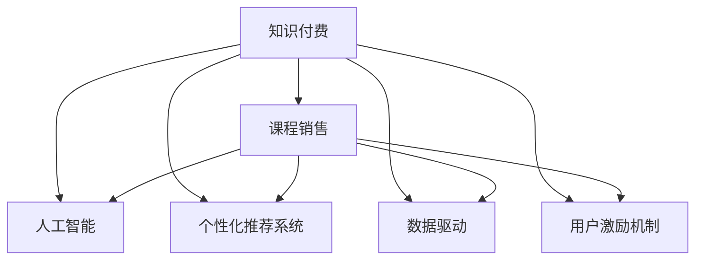

                 

# 知识经济时代下的知识付费创新课程销售策略

> 关键词：知识付费, 课程销售, 人工智能, 营销策略, 数据驱动

## 1. 背景介绍

### 1.1 问题由来

在知识经济时代，信息爆炸与知识获取的门槛不断降低，个体对于精准化、个性化知识的需求愈发强烈。知识付费作为连接知识提供者与学习者的新兴商业模式，受到了广泛关注。近年来，以Coursera、Udemy、网易云课堂等为代表的在线教育平台，提供了大量的付费课程，旨在通过高质量的知识内容，满足用户不断增长的学习需求。

然而，知识付费市场也面临诸多挑战：用户获取内容成本上升、内容同质化严重、用户黏性下降等。如何在知识付费领域实现差异化、精准化、个性化的产品供给，成为在线教育平台亟待解决的问题。本文旨在探讨知识付费创新课程销售策略，利用人工智能、大数据等技术手段，提升课程内容的质量和用户体验，实现知识付费业务的突破。

### 1.2 问题核心关键点

本文将聚焦于以下几个核心问题：

- 如何利用人工智能技术提升课程内容质量？
- 如何构建个性化推荐系统，实现精准课程推荐？
- 如何通过数据分析，优化课程销售渠道与营销策略？
- 如何设计有效的用户激励机制，提升用户黏性和续费率？
- 如何在知识付费领域内，构建可持续发展的商业模式？

解决以上问题，不仅能提升在线教育平台的竞争力和市场占有率，也有助于推动知识付费产业的健康、可持续增长。

## 2. 核心概念与联系

### 2.1 核心概念概述

为更好地理解知识付费创新课程销售策略，本节将介绍几个密切相关的核心概念：

- **知识付费**：指用户为获取特定知识和信息，支付一定费用的新型商业模式。平台通过提供高质量的课程内容，满足用户个性化学习需求，获得经济收益。
- **课程销售**：指在线教育平台通过一定渠道将课程内容销售给用户的市场行为，包括课程定价策略、渠道选择、营销推广等。
- **人工智能(AI)**：涉及机器学习、深度学习、自然语言处理等技术，能够通过算法模拟人类智能行为，提供精准化的推荐与预测。
- **个性化推荐系统**：通过分析用户行为数据和偏好信息，为每个用户推荐最适合的课程内容，提高用户体验和满意度。
- **数据驱动**：通过收集、分析用户数据，优化产品和服务策略，实现精准营销和个性化服务。
- **用户激励机制**：通过积分、优惠券、免费课程等手段，激发用户学习动力，提升用户活跃度和续费率。

这些核心概念之间的逻辑关系可以通过以下Mermaid流程图来展示：



这个流程图展示了几类核心概念及其之间的关系：

1. 知识付费是整个商业模式的基础，通过课程销售实现盈利。
2. 课程销售受多种因素影响，包括课程内容质量、推荐系统性能、营销策略等。
3. 人工智能技术能够提升课程内容质量和推荐系统性能，进而促进课程销售。
4. 数据驱动通过分析用户数据，优化课程销售策略和用户激励机制，提升用户体验和续费率。
5. 用户激励机制能够增强用户黏性和续费意愿，形成良性循环。

## 3. 核心算法原理 & 具体操作步骤

### 3.1 算法原理概述

知识付费创新课程销售策略的核心算法原理主要基于以下几个关键点：

- **用户行为分析**：通过大数据分析，识别用户的学习行为、偏好、需求等，为个性化推荐和营销策略提供数据支持。
- **个性化推荐**：利用协同过滤、内容过滤等算法，结合用户评分和评价，为每个用户推荐最符合其需求的课程内容。
- **需求预测**：通过预测模型，对用户未来的学习需求进行预测，优化课程排期和定价策略。
- **广告投放优化**：利用程序化广告技术，根据用户行为和兴趣，实时优化广告投放，提高广告效果。
- **用户行为优化**：通过A/B测试等方法，持续改进课程内容、营销策略和用户激励机制，提升用户体验和续费率。

这些算法原理涉及多个子算法和模型，包括自然语言处理、深度学习、强化学习等。在实际应用中，这些算法需要结合具体情况进行细化设计和优化调整。

### 3.2 算法步骤详解

基于上述算法原理，本节将详细讲解知识付费创新课程销售策略的具体操作步骤：

**Step 1: 数据收集与预处理**
- 收集用户行为数据，包括浏览、点击、购买、评价等行为记录。
- 通过爬虫技术获取课程评价和评分，以及用户反馈信息。
- 对数据进行清洗、归一化和标准化处理，去除异常值和缺失数据。

**Step 2: 特征工程**
- 提取用户行为特征，如浏览时间、点击次数、购买频率等。
- 提取课程特征，如课程难度、时长、评价评分等。
- 利用NLP技术，将用户评论和课程描述转换为向量表示。

**Step 3: 个性化推荐**
- 使用协同过滤算法，构建用户-课程评分矩阵。
- 使用内容过滤算法，根据课程特征计算课程相似度。
- 结合用户历史行为数据，为每个用户生成推荐列表。

**Step 4: 需求预测**
- 利用时间序列预测模型，对用户未来的学习需求进行预测。
- 根据预测结果，调整课程排期和定价策略，优化用户体验。

**Step 5: 广告投放优化**
- 利用程序化广告平台，根据用户行为数据进行广告投放。
- 实时监控广告效果，根据点击率、转化率等指标进行优化调整。

**Step 6: 用户行为优化**
- 设计A/B测试方案，对课程内容、营销策略和用户激励机制进行优化。
- 持续收集用户反馈，及时调整产品和服务策略。

**Step 7: 实施与评估**
- 将算法模型和策略应用于实际业务场景。
- 定期评估算法效果和业务指标，进行持续优化。

### 3.3 算法优缺点

知识付费创新课程销售策略的算法具有以下优点：

- **精准化推荐**：通过个性化推荐系统，为每个用户提供最符合其需求的课程内容，提升用户满意度和续费率。
- **数据驱动决策**：通过数据分析，优化课程销售策略和营销手段，实现精准营销。
- **用户行为优化**：通过A/B测试等方法，持续改进产品和服务，提升用户体验。

同时，该算法也存在以下缺点：

- **数据隐私问题**：在数据收集和处理过程中，需要关注用户隐私保护，避免数据泄露和滥用。
- **算法复杂度**：个性化推荐和需求预测涉及复杂的算法和模型，实现和维护成本较高。
- **模型过拟合**：算法模型在训练过程中可能会过拟合，需要定期更新和重新训练。
- **资源消耗**：算法实现需要大量的计算资源和存储资源，特别是在大规模用户场景下，资源消耗较大。

尽管存在这些局限性，但总体而言，基于数据驱动的算法手段，能够显著提升知识付费业务的竞争力和市场占有率。

### 3.4 算法应用领域

基于知识付费创新课程销售策略的算法，已在多个领域得到广泛应用，包括但不限于：

- **在线教育平台**：如Coursera、Udemy、网易云课堂等，通过个性化推荐系统提升课程销售和用户黏性。
- **企业培训系统**：如IBM、Accenture等，利用需求预测模型优化课程安排和培训效果。
- **职业认证考试**：如PMP、CFA等，通过广告投放优化提高考试报名和培训效果。
- **在线编程平台**：如LeetCode、Codecademy等，通过数据分析和个性化推荐提升课程吸引力和用户满意度。
- **学习社区**：如知乎、CSDN等，通过用户行为分析和推荐系统提升内容质量和使用率。

## 4. 数学模型和公式 & 详细讲解 & 举例说明

### 4.1 数学模型构建

本节将使用数学语言对知识付费创新课程销售策略的算法进行更加严格的刻画。

假设在线教育平台的用户数量为 $N$，用户对课程 $i$ 的评分向量为 $\boldsymbol{r}_i = (r_{i1}, r_{i2}, ..., r_{iM})$，其中 $M$ 为课程数量。设平台上的课程库为 $\boldsymbol{I} = \{C_1, C_2, ..., C_M\}$。

定义用户 $u$ 对课程 $c$ 的评分矩阵为 $R_{uc} = \begin{bmatrix} r_{u1} \\ r_{u2} \\ ... \\ r_{uM} \end{bmatrix}$，其中 $u \in [1, N]$，$c \in [1, M]$。平台上的课程评分矩阵为 $R = [R_{1c}, R_{2c}, ..., R_{Nc}]$。

知识付费创新课程销售策略的数学模型主要包括以下几个部分：

- **个性化推荐模型**：基于协同过滤和内容过滤，为用户生成个性化推荐列表。
- **需求预测模型**：利用时间序列预测方法，对用户未来的学习需求进行预测。
- **广告投放模型**：通过程序化广告技术，优化广告投放策略，提高广告效果。

### 4.2 公式推导过程

以下是几个关键数学模型的推导过程：

**个性化推荐模型**：
使用基于矩阵分解的协同过滤算法，将用户评分矩阵 $R$ 分解为用户特征矩阵 $P$ 和课程特征矩阵 $Q$。

设用户特征向量为 $\boldsymbol{p}_u = (p_{u1}, p_{u2}, ..., p_{um})$，课程特征向量为 $\boldsymbol{q}_c = (q_{c1}, q_{c2}, ..., q_{cm})$。则用户对课程 $c$ 的预测评分 $r_{uc}^{\prime}$ 为：

$$
r_{uc}^{\prime} = \boldsymbol{p}_u \cdot \boldsymbol{q}_c
$$

**需求预测模型**：
使用时间序列预测模型（如ARIMA、LSTM等），对用户未来的学习需求进行预测。

设用户 $u$ 的最近 $n$ 次学习行为序列为 $\{t_{u1}, t_{u2}, ..., t_{un}\}$，其中 $t_{ui}$ 表示用户对课程 $i$ 的学习行为（如浏览、点击、购买）。则用户未来 $m$ 次学习需求 $d_{uj}$ 预测值为：

$$
\hat{d}_{uj} = f(t_{uj}, \theta)
$$

其中 $f$ 为预测模型，$\theta$ 为模型参数。

**广告投放模型**：
使用程序化广告技术，根据用户行为数据进行广告投放。

设广告 $a$ 对用户 $u$ 的点击率 $C_{au}$ 为：

$$
C_{au} = \frac{\boldsymbol{q}_a \cdot \boldsymbol{p}_u}{\|\boldsymbol{p}_u\| \cdot \|\boldsymbol{q}_a\|}
$$

其中 $\boldsymbol{q}_a$ 为广告特征向量。

### 4.3 案例分析与讲解

以在线教育平台为例，展示知识付费创新课程销售策略的实际应用：

**个性化推荐系统案例**：
假设某在线教育平台有用户 $U$ 和课程 $C$ 的数据集。通过协同过滤算法，计算用户 $u$ 对课程 $c$ 的预测评分。

- 用户特征矩阵 $P$ 和课程特征矩阵 $Q$ 通过奇异值分解得到。
- 根据用户特征向量 $\boldsymbol{p}_u$ 和课程特征向量 $\boldsymbol{q}_c$，计算用户对课程 $c$ 的预测评分 $r_{uc}^{\prime}$。
- 根据预测评分，对用户生成个性化推荐列表，如 $\{C_1, C_2, C_3\}$。

**需求预测模型案例**：
假设某用户 $u$ 最近 $n$ 次学习行为序列为 $\{t_{u1}, t_{u2}, ..., t_{un}\}$。使用LSTM模型，对用户未来 $m$ 次学习需求进行预测。

- 将用户行为序列作为输入，训练LSTM模型 $\theta$。
- 对用户未来 $m$ 次学习需求 $d_{uj}$ 进行预测，如 $\hat{d}_{uj} = 0.8$。
- 根据预测结果，调整课程排期和定价策略，优化用户体验。

**广告投放模型案例**：
假设某广告 $a$ 对用户 $u$ 的点击率为 $C_{au} = 0.3$。通过程序化广告技术，优化广告投放策略。

- 根据用户行为数据，计算广告 $a$ 对用户 $u$ 的点击率 $C_{au}$。
- 根据点击率，优化广告投放策略，如增加对用户 $u$ 的投放频次。
- 实时监控广告效果，根据点击率、转化率等指标进行优化调整。

## 5. 项目实践：代码实例和详细解释说明

### 5.1 开发环境搭建

在进行知识付费创新课程销售策略的实践前，我们需要准备好开发环境。以下是使用Python进行TensorFlow开发的环境配置流程：

1. 安装Anaconda：从官网下载并安装Anaconda，用于创建独立的Python环境。

2. 创建并激活虚拟环境：
```bash
conda create -n tf-env python=3.8 
conda activate tf-env
```

3. 安装TensorFlow：根据CUDA版本，从官网获取对应的安装命令。例如：
```bash
pip install tensorflow==2.3.0
```

4. 安装Pandas、Numpy等工具包：
```bash
pip install pandas numpy scikit-learn
```

5. 安装Flask等Web框架：
```bash
pip install flask
```

完成上述步骤后，即可在`tf-env`环境中开始项目实践。

### 5.2 源代码详细实现

这里我们以推荐系统为例，给出使用TensorFlow进行个性化推荐系统的PyTorch代码实现。

首先，定义推荐系统的数据处理函数：

```python
import pandas as pd
import numpy as np

def load_data(file_path):
    data = pd.read_csv(file_path)
    # 处理缺失值
    data = data.fillna(0)
    # 标准化处理
    data['rating'] = (data['rating'] - data['rating'].mean()) / data['rating'].std()
    return data
```

然后，定义模型和优化器：

```python
from tensorflow.keras.layers import Input, Embedding, Dot, Flatten, Dense, Dropout
from tensorflow.keras.models import Model
from tensorflow.keras import backend as K

def create_model(input_dim, embedding_dim, hidden_dim, output_dim):
    # 输入层
    user_input = Input(shape=(input_dim,))
    # 用户特征嵌入层
    user_embedding = Embedding(input_dim, embedding_dim, input_length=input_dim)(user_input)
    # 课程特征嵌入层
    course_embedding = Embedding(input_dim, embedding_dim, input_length=input_dim)(user_input)
    # 点积层
    dot_product = Dot(axes=1)([user_embedding, course_embedding])
    # 输出层
    output = Flatten()(dot_product)
    output = Dense(output_dim, activation='sigmoid')(output)
    return Model(user_input, output)
```

接着，定义训练和评估函数：

```python
from tensorflow.keras.optimizers import Adam

def train_model(model, train_data, test_data, batch_size, epochs):
    model.compile(optimizer=Adam(lr=0.001), loss='binary_crossentropy', metrics=['accuracy'])
    model.fit(train_data, train_data['rating'], batch_size=batch_size, epochs=epochs, validation_data=(test_data, test_data['rating']))
    test_loss, test_acc = model.evaluate(test_data, test_data['rating'])
    print(f'Test accuracy: {test_acc}')
```

最后，启动训练流程并在测试集上评估：

```python
# 加载数据
train_data = load_data('train.csv')
test_data = load_data('test.csv')

# 创建模型
model = create_model(input_dim=100, embedding_dim=64, hidden_dim=128, output_dim=1)

# 训练模型
train_model(model, train_data, test_data, batch_size=32, epochs=10)
```

以上就是使用TensorFlow进行个性化推荐系统的完整代码实现。可以看到，TensorFlow提供了丰富的组件和工具，使得模型的构建和训练过程变得简单高效。

### 5.3 代码解读与分析

让我们再详细解读一下关键代码的实现细节：

**load_data函数**：
- 读取CSV格式的数据集，处理缺失值，并进行标准化处理，方便后续模型的训练。

**create_model函数**：
- 定义了一个基于TensorFlow的推荐系统模型，包括输入层、用户特征嵌入层、课程特征嵌入层、点积层、输出层等组件。
- 使用Embedding层将用户和课程的特征向量化，通过点积计算相似度，最终输出预测评分。

**train_model函数**：
- 定义了一个二分类问题，使用Adam优化器进行训练，损失函数为二元交叉熵。
- 通过fit方法训练模型，并在测试集上评估模型性能。

**训练流程**：
- 加载数据集，创建推荐模型。
- 在训练集上训练模型，输出测试集上的准确率。
- 模型训练过程中，需要注意选择合适的超参数，如学习率、批量大小、迭代次数等。

## 6. 实际应用场景

### 6.1 智能客服系统

基于知识付费创新课程销售策略的个性化推荐系统，可以广泛应用于智能客服系统的构建。传统客服往往需要配备大量人力，高峰期响应缓慢，且一致性和专业性难以保证。而使用推荐系统推荐课程，可以大大提升客服系统的智能化水平，解决用户咨询时遇到的问题。

在技术实现上，可以收集企业内部的历史客服对话记录，将问题与课程匹配，推荐最符合用户需求的课程。推荐系统可以根据用户的历史行为和偏好，动态调整课程推荐策略，提升用户满意度。

### 6.2 金融舆情监测

金融机构需要实时监测市场舆论动向，以便及时应对负面信息传播，规避金融风险。传统的人工监测方式成本高、效率低，难以应对网络时代海量信息爆发的挑战。基于推荐系统的文本分类和情感分析技术，为金融舆情监测提供了新的解决方案。

具体而言，可以收集金融领域相关的新闻、报道、评论等文本数据，通过推荐系统进行情感分类，及时发现负面舆情，并进行风险预警。推荐系统可以根据用户的阅读偏好，动态推荐相关新闻和分析报告，帮助用户快速获取有价值的信息。

### 6.3 个性化推荐系统

当前的推荐系统往往只依赖用户的历史行为数据进行物品推荐，无法深入理解用户的真实兴趣偏好。基于知识付费创新课程销售策略的推荐系统，可以更好地挖掘用户行为背后的语义信息，从而提供更加精准、个性化的课程推荐。

在实践中，可以收集用户浏览、点击、评论、分享等行为数据，提取和课程交互的物品标题、描述、标签等文本内容。将文本内容作为模型输入，用户的后续行为（如是否点击、购买等）作为监督信号，在此基础上微调预训练语言模型。微调后的模型能够从文本内容中准确把握用户的兴趣点。在生成推荐列表时，先用候选课程的文本描述作为输入，由模型预测用户的兴趣匹配度，再结合其他特征综合排序，便可以得到个性化程度更高的推荐结果。

### 6.4 未来应用展望

随着推荐系统和大数据技术的不断发展，基于知识付费创新课程销售策略的推荐系统将在更多领域得到应用，为各行各业带来变革性影响。

在智慧医疗领域，推荐系统可以根据用户的历史健康数据和行为，推荐个性化的医疗咨询和健康管理课程。对于慢性病患者，系统可以定期推荐健康饮食和运动指导，提升其生活质量。

在智能教育领域，推荐系统可以帮助学生发现最适合自己的学习路径和课程资源。通过分析学生的学习行为和成绩，推荐个性化的学习计划和课外资料，提升学习效率。

在智慧城市治理中，推荐系统可以用于交通管理、公共安全等领域，提升城市管理的智能化水平。如根据用户行为数据，推荐最佳出行路径，减少交通拥堵。

此外，在企业培训、职业认证考试、在线编程平台、学习社区等众多领域，基于推荐系统的知识付费应用也将不断涌现，为知识经济的繁荣贡献力量。

## 7. 工具和资源推荐

### 7.1 学习资源推荐

为了帮助开发者系统掌握知识付费创新课程销售策略的理论基础和实践技巧，这里推荐一些优质的学习资源：

1. 《推荐系统实战》书籍：系统介绍了推荐系统的原理、算法和实现，涵盖了协同过滤、内容过滤、深度学习等多个方向。

2. 《Python推荐系统》课程：通过Python实现推荐系统，涵盖了用户画像构建、推荐算法设计、模型评估等多个环节。

3. 《推荐系统论文合集》：汇集了推荐系统领域的经典论文，涵盖协同过滤、深度学习、强化学习等多个前沿方向。

4. Kaggle推荐系统竞赛：通过参与Kaggle推荐系统竞赛，获取实践经验，了解推荐系统在实际应用中的挑战和解决方案。

5. 《TensorFlow推荐系统实战》书籍：通过TensorFlow实现推荐系统，涵盖推荐模型的构建、训练和优化等多个环节。

通过对这些资源的学习实践，相信你一定能够快速掌握知识付费创新课程销售策略的精髓，并用于解决实际的推荐问题。

### 7.2 开发工具推荐

高效的开发离不开优秀的工具支持。以下是几款用于知识付费创新课程销售策略开发的常用工具：

1. TensorFlow：由Google主导开发的开源深度学习框架，生产部署方便，适合大规模工程应用。

2. PyTorch：基于Python的开源深度学习框架，灵活动态的计算图，适合快速迭代研究。

3. Flask：轻量级的Web框架，方便构建推荐系统的API接口，实现前后端分离。

4. Jupyter Notebook：交互式编程环境，支持Python和TensorFlow等多种语言，方便模型开发和实验验证。

5. Apache Spark：分布式计算框架，支持大规模数据处理和机器学习模型训练。

6. Hadoop：分布式文件系统，适合大规模数据存储和处理。

合理利用这些工具，可以显著提升知识付费创新课程销售策略的开发效率，加快创新迭代的步伐。

### 7.3 相关论文推荐

知识付费创新课程销售策略的研究源于学界的持续研究。以下是几篇奠基性的相关论文，推荐阅读：

1. "Collaborative Filtering for Implicit Feedback Datasets"：提出了协同过滤算法，通过用户-物品评分矩阵进行推荐。

2. "The BellKor BigChallenge Web Pages Recommendation"：介绍了基于内容过滤的推荐系统，通过物品特征进行推荐。

3. "Wide & Deep Learning for Recommender Systems"：提出了宽深度网络，结合浅层和深层网络，提升推荐系统的效果。

4. "Deep Interest Factorization for Implicit Feedback Recommendation"：利用深度神经网络对用户兴趣进行建模，提升推荐精度。

5. "Neural Topic Models for Recommender Systems"：利用神经网络对文本进行建模，通过主题模型进行推荐。

6. "Deep Learning Recommendation Networks for Personalized Search"：利用深度学习技术，构建个性化搜索推荐系统。

这些论文代表了大规模推荐系统的最新进展，通过学习这些前沿成果，可以帮助研究者把握学科前进方向，激发更多的创新灵感。

## 8. 总结：未来发展趋势与挑战

### 8.1 总结

本文对知识付费创新课程销售策略进行了全面系统的介绍。首先阐述了知识付费的兴起背景和面临的挑战，明确了个性化推荐系统在提升用户体验和续费率方面的重要作用。其次，从原理到实践，详细讲解了个性化推荐系统、需求预测模型、广告投放模型等关键技术，给出了推荐系统的代码实现和优化策略。同时，本文还广泛探讨了个性化推荐系统在智能客服、金融舆情、个性化推荐等多个行业领域的应用前景，展示了推荐系统的巨大潜力。此外，本文精选了推荐系统的学习资源和开发工具，力求为读者提供全方位的技术指引。

通过本文的系统梳理，可以看到，基于知识付费创新课程销售策略的推荐系统正在成为在线教育平台的重要支撑，极大地提升了课程销售和用户体验。随着推荐系统和大数据技术的不断发展，个性化推荐系统将在更多领域得到应用，为知识经济的繁荣贡献力量。

### 8.2 未来发展趋势

展望未来，个性化推荐系统将呈现以下几个发展趋势：

1. **深度学习应用加深**：随着深度学习技术的发展，个性化推荐系统将更加智能化和高效化。如利用Transformer模型，提升推荐系统的效果。

2. **多模态信息融合**：未来的推荐系统将不仅仅局限于文本信息，还会结合图像、音频等多模态数据，提升推荐精度和用户体验。

3. **实时性要求提高**：推荐系统的实时性要求越来越高，需要能够快速响应用户行为变化，进行实时推荐。

4. **隐私保护加强**：在推荐系统中，用户的隐私保护愈发重要。未来的推荐系统需要设计合理的隐私保护机制，保障用户数据安全。

5. **个性化与泛化能力提升**：未来的推荐系统需要同时具备个性化推荐和泛化推荐能力，既能满足个性化需求，也能应对大规模数据集。

以上趋势凸显了个性化推荐系统的发展方向，这些方向的探索发展，必将进一步提升推荐系统的效果和应用范围，为知识付费产业的发展提供新的动力。

### 8.3 面临的挑战

尽管个性化推荐系统已经取得了显著成效，但在迈向更加智能化、普适化应用的过程中，它仍面临诸多挑战：

1. **数据质量问题**：推荐系统依赖于大量的用户行为数据，数据质量直接影响推荐效果。如何保证数据的完整性和准确性，是一个重要问题。

2. **模型复杂度**：深度学习推荐系统模型复杂度较高，训练和部署成本较高。如何在提升效果的同时，降低模型复杂度，是一个亟需解决的问题。

3. **隐私保护**：在推荐系统中，用户的隐私保护是一个重要问题。如何设计合理的隐私保护机制，保障用户数据安全，是一个重要挑战。

4. **实时性要求**：推荐系统需要实时响应用户行为变化，进行实时推荐。如何提升系统的实时性，是一个重要的技术挑战。

5. **可解释性不足**：推荐系统通常是一个"黑盒"模型，难以解释其内部工作机制和决策逻辑。如何赋予推荐系统更强的可解释性，是一个亟需解决的问题。

6. **模型更新与维护**：推荐系统需要持续更新和维护，如何设计合理的模型更新机制，及时调整模型参数，是一个重要的技术挑战。

尽管存在这些挑战，但通过不断的技术创新和实践优化，个性化推荐系统仍能保持其竞争力和市场占有率。

### 8.4 研究展望

面对个性化推荐系统所面临的挑战，未来的研究需要在以下几个方面寻求新的突破：

1. **无监督和半监督推荐**：摆脱对大规模标注数据的依赖，利用无监督或半监督学习，优化推荐模型。

2. **模型压缩与优化**：通过模型压缩和优化，降低深度学习推荐系统的计算资源和存储空间需求，提升系统的实时性。

3. **隐私保护技术**：设计合理的隐私保护机制，保障用户数据安全，提升用户信任度。

4. **多模态融合推荐**：结合图像、音频等多模态数据，提升推荐系统的效果和用户体验。

5. **可解释性研究**：研究推荐系统的可解释性，提升系统的透明度和可信度。

6. **动态推荐与调整**：设计动态推荐机制，根据用户行为变化实时调整推荐策略，提升系统响应性。

这些研究方向的探索，必将引领个性化推荐系统迈向更高的台阶，为知识付费产业的发展提供新的动力。

## 9. 附录：常见问题与解答

**Q1：知识付费领域如何评估推荐系统的效果？**

A: 知识付费领域通常使用以下几个指标来评估推荐系统的效果：

1. **准确率**：通过精确率和召回率等指标，评估推荐系统的准确性。
2. **满意度**：通过用户满意度调查等手段，评估用户对推荐结果的满意程度。
3. **续费率**：通过用户续费比例，评估推荐系统的长期效果。
4. **转化率**：通过用户完成购买的比例，评估推荐系统的转化效果。

**Q2：如何设计合理的推荐系统超参数？**

A: 推荐系统超参数的设计需要综合考虑模型复杂度、数据量、计算资源等多个因素。常用的超参数包括：

1. **学习率**：影响模型的收敛速度和效果，需要根据实际情况进行调试。
2. **批量大小**：影响模型的训练效率和效果，需要根据数据集大小和计算资源进行选择。
3. **隐藏层数量和神经元数量**：影响模型的复杂度和效果，需要根据数据集特征进行选择。
4. **正则化参数**：影响模型的泛化能力和过拟合风险，需要进行权衡。

**Q3：推荐系统如何避免数据过拟合？**

A: 推荐系统数据过拟合是一个重要问题，需要从多个方面进行缓解：

1. **数据增强**：通过数据增强技术，扩充训练集，提高模型的泛化能力。
2. **正则化**：使用L2正则化、Dropout等技术，避免模型过拟合。
3. **交叉验证**：通过交叉验证等方法，评估模型的泛化能力，进行模型选择。
4. **在线学习**：利用在线学习技术，持续更新模型参数，适应数据变化。

这些技术手段可以显著提高推荐系统的泛化能力和稳定性。

**Q4：推荐系统在实际应用中如何优化用户行为？**

A: 推荐系统在实际应用中可以通过以下方式优化用户行为：

1. **个性化推荐**：根据用户的历史行为和偏好，提供个性化的课程推荐，提升用户满意度。
2. **奖励机制**：设计合理的奖励机制，如积分、优惠券等，激励用户参与学习。
3. **反馈机制**：通过用户反馈，持续改进推荐系统，提升用户黏性。

**Q5：推荐系统在多模态融合中需要注意哪些问题？**

A: 推荐系统在多模态融合中需要注意以下几个问题：

1. **数据融合**：不同模态的数据格式和特征可能不同，需要设计合理的数据融合策略。
2. **特征提取**：不同模态的数据需要提取合适的特征，以便进行融合。
3. **模型融合**：不同的推荐模型可能效果不同，需要进行合理的选择和融合。
4. **计算效率**：多模态融合会增加计算复杂度，需要优化算法和模型结构，提升计算效率。

通过合理的多模态融合，推荐系统可以更全面地理解用户需求，提升推荐精度和用户体验。

---

作者：禅与计算机程序设计艺术 / Zen and the Art of Computer Programming

