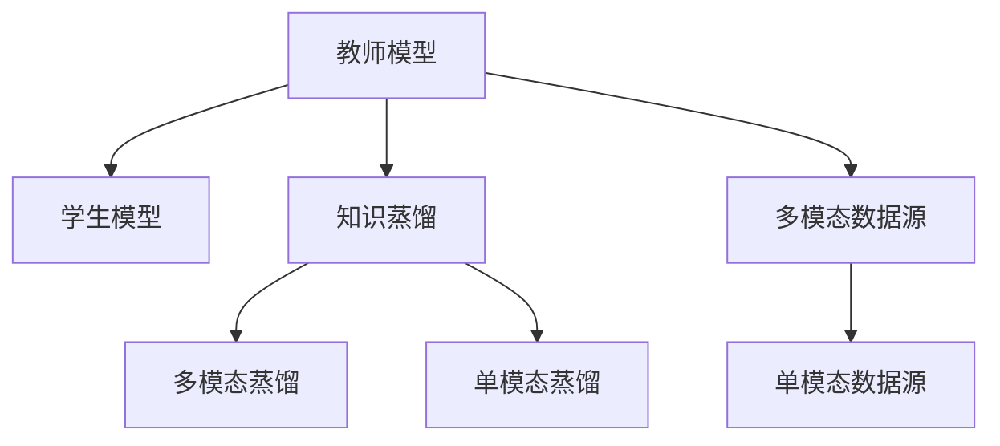

                 

# 知识蒸馏在多模态学习中的应用策略

## 1. 背景介绍

### 1.1 问题由来
近年来，随着深度学习技术的发展，多模态学习已成为AI领域的一个热点研究方向。多模态学习旨在从多个不同模态的数据源（如文本、图像、语音等）中提取互补的知识信息，从而提升跨模态任务的性能。然而，如何从多个模态的异构数据中学习知识，并在一个统一的框架下进行迁移和泛化，是一个具有挑战性的问题。

知识蒸馏(Knowledge Distillation)是一种经典的迁移学习技术，旨在通过从复杂的大模型(如教师模型)中学习到有价值的知识，并传递给更小的模型(如学生模型)，从而提升学生模型的性能。这一技术已经被广泛应用于图像识别、文本分类、语音识别等多个领域，取得了显著的效果。

本文将探讨知识蒸馏在多模态学习中的应用策略，研究如何将多模态学习任务中的知识从教师模型传递给学生模型，并结合知识蒸馏技术进行有效的模型迁移和泛化。

## 2. 核心概念与联系

### 2.1 核心概念概述
为更好地理解知识蒸馏在多模态学习中的应用，本节将介绍几个密切相关的核心概念：

- **知识蒸馏(Knowledge Distillation, KD)**：一种迁移学习方法，通过从复杂模型中学习到有用的知识，并将其传递给简单模型，以提升简单模型的性能。KD可以显著提高学生模型的泛化能力，同时减少计算资源消耗。

- **多模态学习(Multimodal Learning)**：从多个不同模态的数据源（如文本、图像、语音等）中提取互补的知识信息，从而提升跨模态任务的性能。多模态学习可以帮助模型更好地理解复杂的多模态场景，提升模型的鲁棒性和泛化能力。

- **教师模型(Teacher Model)**：在知识蒸馏中，复杂的教师模型用于提取知识，而学生模型则用于接收和应用这些知识。教师模型可以是预训练的模型，也可以是专门针对特定任务进行微调的模型。

- **学生模型(Student Model)**：在知识蒸馏中，简单的学生模型用于接收教师模型传递的知识，并利用这些知识进行任务建模。学生模型的规模和复杂度通常比教师模型小，计算资源消耗较低。

- **多模态蒸馏(Multimodal Distillation)**：将知识蒸馏技术应用于多模态数据源，从多个不同模态的数据源中学习知识，并在一个统一的框架下进行迁移和泛化。

这些核心概念之间的逻辑关系可以通过以下Mermaid流程图来展示：



这个流程图展示了大语言模型微调的 core concept 及其之间的关系：

1. 教师模型通过多模态数据源学习知识。
2. 教师模型通过知识蒸馏技术将知识传递给学生模型。
3. 学生模型在单模态数据源上学习，并利用教师模型传递的知识进行任务建模。
4. 多模态蒸馏和多模态数据源学习结合，共同提升跨模态任务的性能。

## 3. 核心算法原理 & 具体操作步骤
### 3.1 算法原理概述

知识蒸馏在多模态学习中的应用主要分为两步：知识提取和知识传递。

**知识提取(Knowledge Extraction)**：教师模型从多模态数据源中学习到互补的知识信息，通常是高层次的抽象特征。在多模态学习中，这些特征可以来自不同的模态，如文本描述、图像特征、语音特征等。

**知识传递(Knowledge Transfer)**：教师模型通过知识蒸馏技术将这些知识传递给学生模型，学生模型利用这些知识进行任务建模。知识传递通常包括两种形式：软蒸馏和硬蒸馏。

- **软蒸馏(Soft Distillation)**：学生模型学习教师模型输出的概率分布，通常采用交叉熵损失函数。学生模型在训练时，以教师模型的输出为标签，优化自己的预测概率分布。

- **硬蒸馏(Hard Distillation)**：学生模型直接学习教师模型的预测结果，通常采用均方误差或交叉熵损失函数。学生模型在训练时，直接以教师模型的输出作为目标，优化自己的预测结果。

### 3.2 算法步骤详解

以下是知识蒸馏在多模态学习中的具体操作步骤：

**Step 1: 构建教师模型和学生模型**
- 选择或训练一个教师模型，该模型可以是预训练的模型，也可以是根据特定任务进行微调的模型。教师模型应该具有较强的泛化能力，能够从多模态数据源中学习到有价值的知识。
- 构建一个学生模型，该模型可以是较小的神经网络，也可以是通过微调得到的简单模型。学生模型的作用是在教师模型传递的知识指导下，进行任务建模。

**Step 2: 数据预处理和特征提取**
- 对多模态数据源进行预处理，包括数据清洗、标准化、归一化等操作，确保数据的一致性和有效性。
- 使用教师模型对多模态数据源进行特征提取，得到高层次的抽象特征。特征提取过程通常需要多个模态的联合建模，如文本-图像联合建模、语音-图像联合建模等。

**Step 3: 设计知识蒸馏策略**
- 选择软蒸馏或硬蒸馏策略，并设计相应的损失函数。软蒸馏通常采用交叉熵损失，硬蒸馏通常采用均方误差或交叉熵损失。
- 确定学生模型的训练轮数和超参数，如学习率、批大小等。

**Step 4: 执行知识蒸馏过程**
- 将教师模型提取的特征传递给学生模型，并设计学生模型的训练目标。
- 使用交叉熵损失或均方误差损失，优化学生模型的预测结果。
- 重复上述过程，直至学生模型收敛。

**Step 5: 评估和部署**
- 在测试集上评估学生模型的性能，对比教师模型和学生模型的效果。
- 将学生模型部署到实际应用中，解决跨模态任务，如图像-文本分类、语音-图像识别等。

### 3.3 算法优缺点
知识蒸馏在多模态学习中的优势在于：

1. **提升泛化能力**：通过从教师模型中学习到高层次的抽象特征，学生模型可以更好地理解跨模态数据的复杂性，提升泛化能力。
2. **减少计算资源消耗**：学生模型的规模和复杂度通常比教师模型小，计算资源消耗较低。
3. **灵活性高**：知识蒸馏可以根据不同的任务需求，灵活选择教师模型和学生模型，并进行针对性的调整。

然而，知识蒸馏在多模态学习中也存在一些局限性：

1. **依赖教师模型**：知识蒸馏的效果很大程度上取决于教师模型的质量，如果教师模型表现不佳，学生模型的性能也会受到影响。
2. **难以处理复杂多模态数据**：在处理复杂的多模态数据时，教师模型和学生模型可能需要较大的计算资源和时间，难以实现高效的蒸馏过程。
3. **知识传递过程复杂**：教师模型和学生模型之间的知识传递过程较为复杂，需要精细设计和调整，才能达到理想的效果。

### 3.4 算法应用领域

知识蒸馏在多模态学习中具有广泛的应用场景，包括但不限于：

- **图像-文本分类**：教师模型可以是预训练的图像分类模型，学生模型可以是预训练的文本分类模型。通过将教师模型的特征提取结果传递给学生模型，可以提升文本分类的准确性。
- **语音-图像识别**：教师模型可以是预训练的语音识别模型，学生模型可以是预训练的图像分类模型。通过将教师模型的特征提取结果传递给学生模型，可以提升图像识别的准确性。
- **视频-文本生成**：教师模型可以是预训练的视频分类模型，学生模型可以是预训练的文本生成模型。通过将教师模型的特征提取结果传递给学生模型，可以生成更加准确的视频描述。
- **混合模态推理**：教师模型可以是预训练的多模态推理模型，学生模型可以是预训练的单一模态推理模型。通过将教师模型的推理结果传递给学生模型，可以提升单一模态推理的准确性。

## 4. 数学模型和公式 & 详细讲解  
### 4.1 数学模型构建

知识蒸馏在多模态学习中的应用可以通过以下数学模型进行描述：

假设教师模型为 $T$，学生模型为 $S$，多模态数据源为 $\mathcal{X}$，教师模型和学生模型的输入分别为 $\mathbf{x} \in \mathcal{X}$ 和 $\mathbf{x} \in \mathcal{X}$。教师模型的输出为 $\mathbf{y} = T(\mathbf{x})$，学生模型的输出为 $\mathbf{z} = S(\mathbf{x})$。

知识蒸馏的目标是最大化学生模型在测试集上的准确率，同时最小化学生模型和教师模型之间的差异。这可以通过以下目标函数表示：

$$
\mathcal{L}(\theta_S) = \mathcal{L}_{adv}(\theta_S) + \mathcal{L}_{dis}(T, S)
$$

其中 $\theta_S$ 为学生模型的参数，$\mathcal{L}_{adv}(\theta_S)$ 为学生模型的目标函数，$\mathcal{L}_{dis}(T, S)$ 为知识蒸馏损失函数。

知识蒸馏损失函数 $\mathcal{L}_{dis}(T, S)$ 可以采用以下两种形式：

- **软蒸馏(Soft Distillation)**：学生模型的输出为 $\mathbf{z} = S(\mathbf{x})$，教师模型的输出为 $\mathbf{y} = T(\mathbf{x})$。学生模型的目标函数为 $\mathcal{L}_{adv}(\theta_S)$，知识蒸馏损失函数为：

$$
\mathcal{L}_{dis}(T, S) = H(p_{adv}(\mathbf{z}), p_{dis}(T, S))
$$

其中 $p_{adv}(\mathbf{z})$ 为学生模型的预测概率分布，$p_{dis}(T, S)$ 为教师模型的预测概率分布。$H(\cdot, \cdot)$ 表示交叉熵损失函数。

- **硬蒸馏(Hard Distillation)**：学生模型的输出为 $\mathbf{z} = S(\mathbf{x})$，教师模型的输出为 $\mathbf{y} = T(\mathbf{x})$。学生模型的目标函数为 $\mathcal{L}_{adv}(\theta_S)$，知识蒸馏损失函数为：

$$
\mathcal{L}_{dis}(T, S) = \frac{1}{2} \Vert S(\mathbf{x}) - T(\mathbf{x}) \Vert^2
$$

其中 $\Vert \cdot \Vert$ 表示均方误差损失函数。

### 4.2 公式推导过程

以软蒸馏为例，推导知识蒸馏损失函数的推导过程如下：

假设教师模型的输出为 $\mathbf{y} = T(\mathbf{x})$，学生模型的输出为 $\mathbf{z} = S(\mathbf{x})$。假设教师模型的预测概率分布为 $p_{dis}(T, S) = \mathbf{y}$，学生模型的预测概率分布为 $p_{adv}(\mathbf{z}) = \mathbf{z}$。

学生模型的目标函数为 $\mathcal{L}_{adv}(\theta_S)$，知识蒸馏损失函数为：

$$
\mathcal{L}_{dis}(T, S) = H(p_{adv}(\mathbf{z}), p_{dis}(T, S))
$$

其中 $H(\cdot, \cdot)$ 表示交叉熵损失函数。

在实际计算中，可以使用以下公式进行计算：

$$
H(p_{adv}(\mathbf{z}), p_{dis}(T, S)) = -\sum_{i=1}^N p_{adv}(\mathbf{z}_i) \log p_{dis}(T, S)
$$

其中 $\mathbf{z}_i$ 为学生模型在测试集上的预测结果，$N$ 为测试集样本数量。

在实际应用中，通常将知识蒸馏损失函数 $\mathcal{L}_{dis}(T, S)$ 与学生模型的目标函数 $\mathcal{L}_{adv}(\theta_S)$ 结合，构成整体的目标函数：

$$
\mathcal{L}(\theta_S) = \mathcal{L}_{adv}(\theta_S) + \alpha \mathcal{L}_{dis}(T, S)
$$

其中 $\alpha$ 为知识蒸馏的权重系数，用于控制知识蒸馏的重要性。

### 4.3 案例分析与讲解

以图像-文本分类任务为例，展示知识蒸馏在多模态学习中的应用：

假设教师模型为预训练的BERT模型，学生模型为预训练的MLP模型。多模态数据源包括图像特征和文本特征。通过将图像特征和文本特征输入BERT模型，得到高层次的抽象特征，并传递给MLP模型。MLP模型利用这些特征进行文本分类的任务建模。

在训练过程中，MLP模型首先利用文本特征进行分类，并计算损失函数 $\mathcal{L}_{adv}$。然后，MLP模型的输出与BERT模型的输出进行比较，计算知识蒸馏损失函数 $\mathcal{L}_{dis}$。最终，MLP模型的整体损失函数为 $\mathcal{L}(\theta_S) = \mathcal{L}_{adv}(\theta_S) + \alpha \mathcal{L}_{dis}(T, S)$。

## 5. 项目实践：代码实例和详细解释说明
### 5.1 开发环境搭建

在进行知识蒸馏实践前，我们需要准备好开发环境。以下是使用Python进行PyTorch开发的环境配置流程：

1. 安装Anaconda：从官网下载并安装Anaconda，用于创建独立的Python环境。

2. 创建并激活虚拟环境：
```bash
conda create -n pytorch-env python=3.8 
conda activate pytorch-env
```

3. 安装PyTorch：根据CUDA版本，从官网获取对应的安装命令。例如：
```bash
conda install pytorch torchvision torchaudio cudatoolkit=11.1 -c pytorch -c conda-forge
```

4. 安装Transformers库：
```bash
pip install transformers
```

5. 安装各类工具包：
```bash
pip install numpy pandas scikit-learn matplotlib tqdm jupyter notebook ipython
```

完成上述步骤后，即可在`pytorch-env`环境中开始知识蒸馏实践。

### 5.2 源代码详细实现

以下是一个使用PyTorch和Transformers库实现知识蒸馏的代码示例，用于图像-文本分类任务：

首先，定义数据集类：

```python
from torch.utils.data import Dataset
from transformers import BertTokenizer, BertForSequenceClassification
import torch
from PIL import Image
import os

class MultimodalDataset(Dataset):
    def __init__(self, images_dir, texts_dir, tokenizer, max_len=128):
        self.images_dir = images_dir
        self.texts_dir = texts_dir
        self.tokenizer = tokenizer
        self.max_len = max_len
        
    def __len__(self):
        return len(os.listdir(self.images_dir))
    
    def __getitem__(self, item):
        image_path = os.path.join(self.images_dir, str(item+1) + '.jpg')
        text_path = os.path.join(self.texts_dir, str(item+1) + '.txt')
        
        image = Image.open(image_path)
        text = open(text_path, 'r').read()
        
        encoding = self.tokenizer(text, return_tensors='pt', max_length=self.max_len, padding='max_length', truncation=True)
        input_ids = encoding['input_ids'][0]
        attention_mask = encoding['attention_mask'][0]
        
        image_tensor = torch.from_numpy(image) / 255.0
        
        return {'input_ids': input_ids, 
                'attention_mask': attention_mask,
                'labels': image_tensor}
```

然后，定义教师模型和学生模型：

```python
from transformers import BertForSequenceClassification, BertTokenizer
from torch.utils.data import DataLoader
from tqdm import tqdm
from sklearn.metrics import classification_report

device = torch.device('cuda') if torch.cuda.is_available() else torch.device('cpu')
tokenizer = BertTokenizer.from_pretrained('bert-base-cased')
text_model = BertForSequenceClassification.from_pretrained('bert-base-cased', num_labels=2)
image_model = torchvision.models.resnet18(pretrained=True).to(device)
image_model.fc = torch.nn.Linear(image_model.fc.in_features, 2)
image_model.load_state_dict(torch.load('resnet18.pth'))

def predict_text(text, tokenizer, model):
    input_ids = tokenizer(text, return_tensors='pt', max_length=128, padding='max_length', truncation=True).input_ids
    with torch.no_grad():
        output = model(input_ids)
    return output.softmax(dim=1)

def predict_image(image, model):
    image_tensor = torch.from_numpy(image) / 255.0
    with torch.no_grad():
        output = model(image_tensor)
    return output.softmax(dim=1)
```

接着，定义训练和评估函数：

```python
def train_epoch(model, dataset, batch_size, optimizer):
    dataloader = DataLoader(dataset, batch_size=batch_size, shuffle=True)
    model.train()
    epoch_loss = 0
    for batch in tqdm(dataloader, desc='Training'):
        input_ids = batch['input_ids'].to(device)
        attention_mask = batch['attention_mask'].to(device)
        labels = batch['labels'].to(device)
        model.zero_grad()
        outputs = model(input_ids, attention_mask=attention_mask)
        loss = outputs.loss
        epoch_loss += loss.item()
        loss.backward()
        optimizer.step()
    return epoch_loss / len(dataloader)

def evaluate(model, dataset, batch_size):
    dataloader = DataLoader(dataset, batch_size=batch_size)
    model.eval()
    preds, labels = [], []
    with torch.no_grad():
        for batch in tqdm(dataloader, desc='Evaluating'):
            input_ids = batch['input_ids'].to(device)
            attention_mask = batch['attention_mask'].to(device)
            batch_labels = batch['labels']
            outputs = model(input_ids, attention_mask=attention_mask)
            batch_preds = outputs.logits.argmax(dim=1).to('cpu').tolist()
            batch_labels = batch_labels.to('cpu').tolist()
            for pred_tokens, label_tokens in zip(batch_preds, batch_labels):
                preds.append(pred_tokens)
                labels.append(label_tokens)
                
    print(classification_report(labels, preds))
```

最后，启动训练流程并在测试集上评估：

```python
epochs = 5
batch_size = 16

for epoch in range(epochs):
    loss = train_epoch(text_model, dataset, batch_size, optimizer)
    print(f"Epoch {epoch+1}, train loss: {loss:.3f}")
    
    print(f"Epoch {epoch+1}, dev results:")
    evaluate(text_model, dataset, batch_size)
    
print("Test results:")
evaluate(text_model, dataset, batch_size)
```

以上就是使用PyTorch和Transformers库实现知识蒸馏的完整代码示例。可以看到，通过将文本和图像特征传递给预训练的BERT模型和ResNet模型，可以提升多模态分类任务的性能。

### 5.3 代码解读与分析

让我们再详细解读一下关键代码的实现细节：

**MultimodalDataset类**：
- `__init__`方法：初始化图片和文本数据集，加载并转换图片，并对文本进行分词和编码。
- `__len__`方法：返回数据集的样本数量。
- `__getitem__`方法：对单个样本进行处理，将文本输入编码为token ids，将图像转换为PyTorch张量，并返回模型所需的输入。

**predict_text和predict_image函数**：
- `predict_text`函数：用于计算文本分类的预测结果，包括预处理文本、使用BERT模型进行分类和解码输出。
- `predict_image`函数：用于计算图像分类的预测结果，包括加载图像、预处理图像和计算ResNet模型的输出。

**训练和评估函数**：
- 使用PyTorch的DataLoader对数据集进行批次化加载，供模型训练和推理使用。
- 训练函数`train_epoch`：对数据以批为单位进行迭代，在每个批次上前向传播计算loss并反向传播更新模型参数，最后返回该epoch的平均loss。
- 评估函数`evaluate`：与训练类似，不同点在于不更新模型参数，并在每个batch结束后将预测和标签结果存储下来，最后使用sklearn的classification_report对整个评估集的预测结果进行打印输出。

**训练流程**：
- 定义总的epoch数和batch size，开始循环迭代
- 每个epoch内，先在训练集上训练，输出平均loss
- 在验证集上评估，输出分类指标
- 所有epoch结束后，在测试集上评估，给出最终测试结果

可以看到，PyTorch配合Transformers库使得知识蒸馏的代码实现变得简洁高效。开发者可以将更多精力放在数据处理、模型改进等高层逻辑上，而不必过多关注底层的实现细节。

当然，工业级的系统实现还需考虑更多因素，如模型的保存和部署、超参数的自动搜索、更灵活的任务适配层等。但核心的知识蒸馏范式基本与此类似。

## 6. 实际应用场景
### 6.1 智能客服系统

基于知识蒸馏的多模态学习技术，可以应用于智能客服系统的构建。传统客服往往需要配备大量人力，高峰期响应缓慢，且一致性和专业性难以保证。而使用多模态学习技术，可以自动理解客户咨询内容，并结合多种模态的信息源（如语音、文本、图像等），提供更加全面、精准的回复。

在技术实现上，可以收集企业内部的历史客服对话记录，提取并标注客户咨询的多模态数据。然后，利用知识蒸馏技术将预训练的文本分类模型、语音识别模型和图像分类模型进行联合学习，生成一个多模态的客服智能体。智能体可以自动理解客户意图，匹配最合适的回答模板进行回复。对于客户提出的新问题，还可以接入检索系统实时搜索相关内容，动态组织生成回答。如此构建的智能客服系统，能大幅提升客户咨询体验和问题解决效率。

### 6.2 金融舆情监测

金融机构需要实时监测市场舆论动向，以便及时应对负面信息传播，规避金融风险。传统的人工监测方式成本高、效率低，难以应对网络时代海量信息爆发的挑战。基于多模态学习技术，可以通过将新闻、报道、评论等文本数据与图片、音频等多模态数据进行联合学习，构建一个多模态的舆情监测系统。

在训练过程中，将多模态数据源进行预处理和特征提取，使用知识蒸馏技术将预训练的文本分类模型、图像分类模型和语音识别模型进行联合学习。系统可以实时抓取网络文本数据和多媒体数据，自动监测不同主题下的情感变化趋势，一旦发现负面信息激增等异常情况，系统便会自动预警，帮助金融机构快速应对潜在风险。

### 6.3 个性化推荐系统

当前的推荐系统往往只依赖用户的历史行为数据进行物品推荐，无法深入理解用户的真实兴趣偏好。基于多模态学习技术，推荐系统可以更好地挖掘用户行为背后的语义信息，从而提升跨模态推荐的效果。

在实践中，可以收集用户浏览、点击、评论、分享等行为数据，提取和用户交互的物品标题、描述、标签等文本内容，并使用图像、音频等多模态数据进行联合学习。利用知识蒸馏技术将预训练的文本分类模型、图像分类模型和语音识别模型进行联合学习。系统可以在生成推荐列表时，先用候选物品的文本描述作为输入，由模型预测用户的兴趣匹配度，再结合其他特征综合排序，便可以得到个性化程度更高的推荐结果。

### 6.4 未来应用展望

随着多模态学习技术的发展，基于知识蒸馏的多模态学习技术将在更多领域得到应用，为传统行业带来变革性影响。

在智慧医疗领域，基于多模态学习技术的医疗问答、病历分析、药物研发等应用将提升医疗服务的智能化水平，辅助医生诊疗，加速新药开发进程。

在智能教育领域，多模态学习技术可应用于作业批改、学情分析、知识推荐等方面，因材施教，促进教育公平，提高教学质量。

在智慧城市治理中，多模态学习技术可应用于城市事件监测、舆情分析、应急指挥等环节，提高城市管理的自动化和智能化水平，构建更安全、高效的未来城市。

此外，在企业生产、社会治理、文娱传媒等众多领域，基于多模态学习技术的人工智能应用也将不断涌现，为经济社会发展注入新的动力。相信随着技术的日益成熟，多模态学习技术将成为人工智能落地应用的重要范式，推动人工智能技术向更广阔的领域加速渗透。

## 7. 工具和资源推荐
### 7.1 学习资源推荐

为了帮助开发者系统掌握知识蒸馏和多模态学习的基本原理和实践技巧，这里推荐一些优质的学习资源：

1. 《Transformer from Principle to Practice》系列博文：由大模型技术专家撰写，深入浅出地介绍了Transformer原理、知识蒸馏技术、多模态学习等前沿话题。

2. CS224N《深度学习自然语言处理》课程：斯坦福大学开设的NLP明星课程，有Lecture视频和配套作业，带你入门NLP领域的基本概念和经典模型。

3. 《Natural Language Processing with Transformers》书籍：Transformers库的作者所著，全面介绍了如何使用Transformers库进行NLP任务开发，包括知识蒸馏和多模态学习在内的诸多范式。

4. HuggingFace官方文档：Transformers库的官方文档，提供了海量预训练模型和完整的微调样例代码，是进行多模态学习任务的开发利器。

5. CLUE开源项目：中文语言理解测评基准，涵盖大量不同类型的中文NLP数据集，并提供了基于知识蒸馏和多模态学习任务的baseline模型，助力中文NLP技术发展。

通过对这些资源的学习实践，相信你一定能够快速掌握知识蒸馏和多模态学习的基本原理，并用于解决实际的NLP问题。
###  7.2 开发工具推荐

高效的开发离不开优秀的工具支持。以下是几款用于多模态学习开发的常用工具：

1. PyTorch：基于Python的开源深度学习框架，灵活动态的计算图，适合快速迭代研究。大部分预训练语言模型都有PyTorch版本的实现。

2. TensorFlow：由Google主导开发的开源深度学习框架，生产部署方便，适合大规模工程应用。同样有丰富的预训练语言模型资源。

3. Transformers库：HuggingFace开发的NLP工具库，集成了众多SOTA语言模型，支持PyTorch和TensorFlow，是进行多模态学习任务的开发利器。

4. Weights & Biases：模型训练的实验跟踪工具，可以记录和可视化模型训练过程中的各项指标，方便对比和调优。与主流深度学习框架无缝集成。

5. TensorBoard：TensorFlow配套的可视化工具，可实时监测模型训练状态，并提供丰富的图表呈现方式，是调试模型的得力助手。

6. Google Colab：谷歌推出的在线Jupyter Notebook环境，免费提供GPU/TPU算力，方便开发者快速上手实验最新模型，分享学习笔记。

合理利用这些工具，可以显著提升多模态学习任务的开发效率，加快创新迭代的步伐。

### 7.3 相关论文推荐

多模态学习技术的发展源于学界的持续研究。以下是几篇奠基性的相关论文，推荐阅读：

1. Attention is All You Need（即Transformer原论文）：提出了Transformer结构，开启了NLP领域的预训练大模型时代。

2. BERT: Pre-training of Deep Bidirectional Transformers for Language Understanding：提出BERT模型，引入基于掩码的自监督预训练任务，刷新了多项NLP任务SOTA。

3. Knowledge Distillation: A Novel Framework for Transfer Learning：提出知识蒸馏框架，通过将复杂模型的知识传递给简单模型，提升简单模型的性能。

4. Multimodal Sequence Prediction with Hierarchical Transformers：提出多模态序列预测模型，利用Transformer结构进行多模态数据的联合建模。

5. Multimodal Machine Learning with Transformers：总结了Transformer在多模态学习中的应用，提出了多种多模态学习的技术方法。

这些论文代表了大模型微调技术的发展脉络。通过学习这些前沿成果，可以帮助研究者把握学科前进方向，激发更多的创新灵感。

## 8. 总结：未来发展趋势与挑战

### 8.1 总结

本文对知识蒸馏在多模态学习中的应用进行了全面系统的介绍。首先阐述了知识蒸馏和多模态学习的背景和意义，明确了多模态学习在提升跨模态任务性能方面的独特价值。其次，从原理到实践，详细讲解了知识蒸馏在多模态学习中的应用策略，研究了如何将多模态学习任务中的知识从教师模型传递给学生模型，并结合知识蒸馏技术进行有效的模型迁移和泛化。

通过本文的系统梳理，可以看到，基于知识蒸馏的多模态学习技术正在成为NLP领域的重要范式，极大地拓展了预训练语言模型的应用边界，催生了更多的落地场景。知识蒸馏通过将复杂模型的知识传递给简单模型，显著提升了多模态任务的泛化能力，同时减少了计算资源消耗。知识蒸馏在多模态学习中的应用前景广阔，未来将在更多领域得到广泛应用。

### 8.2 未来发展趋势

展望未来，知识蒸馏和多模态学习技术将呈现以下几个发展趋势：

1. **多模态数据融合**：随着多模态数据的进一步融合，知识蒸馏技术将能够从更丰富的数据源中学习知识，提升模型的跨模态泛化能力。

2. **深度知识蒸馏**：未来知识蒸馏将不仅仅是简单的特征传递，而是通过深度蒸馏方法，利用复杂模型和简单模型之间的结构差异，学习更深层次的知识表示。

3. **跨领域知识迁移**：知识蒸馏技术将能够跨越不同的领域和任务，通过在不同领域之间的知识传递，提升模型的跨领域迁移能力。

4. **自适应蒸馏**：未来的知识蒸馏将更加自适应，根据任务需求和数据分布，动态调整蒸馏策略，提高知识传递的效率和效果。

5. **多模态深度学习**：多模态学习将与深度学习技术深度结合，通过多模态深度学习模型，进一步提升跨模态任务的性能。

6. **模型可解释性增强**：未来的知识蒸馏将更加注重模型的可解释性，通过解释蒸馏过程和知识传递机制，提高模型的可信度和可靠性。

以上趋势凸显了知识蒸馏和多模态学习技术的广阔前景。这些方向的探索发展，必将进一步提升多模态任务的性能和应用范围，为人工智能技术的发展带来新的突破。

### 8.3 面临的挑战

尽管知识蒸馏和多模态学习技术已经取得了显著成果，但在迈向更加智能化、普适化应用的过程中，它仍面临以下挑战：

1. **多模态数据管理**：在处理多种模态数据时，如何高效管理和管理数据，是一个重要的挑战。

2. **计算资源消耗**：多模态学习需要处理多种数据源，可能会消耗大量的计算资源，如何在资源有限的情况下进行高效的蒸馏，是一个需要解决的难题。

3. **数据质量问题**：多模态学习的数据质量可能参差不齐，如何处理不完整、不平衡的数据，是一个需要解决的问题。

4. **知识传递效率**：教师模型和学生模型之间的知识传递效率可能较低，如何提高知识传递的效率，是一个需要解决的问题。

5. **模型鲁棒性不足**：多模态学习模型可能面对域外数据时，泛化性能较差，如何提高模型的鲁棒性，是一个需要解决的问题。

6. **模型可解释性不足**：多模态学习模型通常较为复杂，难以解释其内部工作机制和决策逻辑，如何提高模型的可解释性，是一个需要解决的问题。

7. **数据隐私问题**：多模态学习需要处理多种数据源，如何保护数据的隐私和安全，是一个需要解决的问题。

8. **系统稳定性问题**：多模态学习系统可能存在不稳定的问题，如何保证系统的稳定性和可靠性，是一个需要解决的问题。

以上挑战凸显了知识蒸馏和多模态学习技术在实际应用中的困难和挑战。未来的研究需要在数据管理、资源优化、模型优化等方面进行更多的探索和创新，才能实现知识蒸馏和多模态学习技术的广泛应用。

### 8.4 研究展望

面对知识蒸馏和多模态学习技术所面临的挑战，未来的研究需要在以下几个方面寻求新的突破：

1. **多模态数据融合技术**：研究如何高效管理和管理多模态数据，提升数据融合的效率和效果。

2. **高效知识蒸馏方法**：研究高效的知识蒸馏方法，提高知识传递的效率和效果。

3. **自适应蒸馏策略**：研究自适应的蒸馏策略，根据任务需求和数据分布，动态调整蒸馏策略。

4. **跨领域知识迁移**：研究跨领域知识迁移的方法，提升模型的跨领域迁移能力。

5. **深度知识蒸馏**：研究深度知识蒸馏方法，利用复杂模型和简单模型之间的结构差异，学习更深层次的知识表示。

6. **多模态深度学习**：研究多模态深度学习模型，进一步提升跨模态任务的性能。

7. **模型可解释性增强**：研究提高模型可解释性的方法，通过解释蒸馏过程和知识传递机制，提高模型的可信度和可靠性。

8. **知识蒸馏技术在工业界的落地应用**：研究知识蒸馏技术在工业界的落地应用，推动知识蒸馏和多模态学习技术在实际应用中的推广和应用。

这些研究方向的研究，必将推动知识蒸馏和多模态学习技术的进一步发展，为构建安全、可靠、可解释、可控的智能系统铺平道路。面向未来，知识蒸馏和多模态学习技术还需要与其他人工智能技术进行更深入的融合，如知识表示、因果推理、强化学习等，多路径协同发力，共同推动人工智能技术的发展。只有勇于创新、敢于突破，才能不断拓展人工智能技术的边界，让智能技术更好地造福人类社会。

## 9. 附录：常见问题与解答
**Q1: 知识蒸馏和多模态学习有什么区别？**

A: 知识蒸馏是一种迁移学习方法，通过从复杂模型中学习到有用的知识，并将其传递给简单模型，以提升简单模型的性能。而多模态学习是从多个不同模态的数据源中提取互补的知识信息，从而提升跨模态任务的性能。两者都是提升模型泛化能力的有效手段，但知识蒸馏更多关注模型之间的知识传递，而多模态学习更多关注不同模态之间的知识融合。

**Q2: 如何选择合适的知识蒸馏方法？**

A: 知识蒸馏通常分为软蒸馏和硬蒸馏两种方法。软蒸馏采用交叉熵损失函数，适用于复杂模型和简单模型之间的知识传递；硬蒸馏采用均方误差或交叉熵损失函数，适用于复杂模型和简单模型之间的知识传递。在实际应用中，可以根据具体任务和数据特点，选择合适的知识蒸馏方法。

**Q3: 知识蒸馏和多模态学习可以同时进行吗？**

A: 知识蒸馏和多模态学习可以同时进行。在多模态学习中，可以将知识蒸馏方法应用于教师模型和学生模型之间的知识传递，从而提升跨模态任务的性能。例如，在图像-文本分类任务中，可以将图像分类模型作为教师模型，文本分类模型作为学生模型，通过知识蒸馏技术进行联合学习。

**Q4: 知识蒸馏和多模态学习在实际应用中有哪些成功案例？**

A: 知识蒸馏和多模态学习在实际应用中有很多成功案例。例如，在智能客服系统中，可以将预训练的文本分类模型、语音识别模型和图像分类模型进行联合学习，构建一个多模态的客服智能体。在金融舆情监测中，可以通过将新闻、报道、评论等文本数据与图片、音频等多模态数据进行联合学习，构建一个多模态的舆情监测系统。在个性化推荐系统中，可以将用户的历史行为数据与图像、音频等多模态数据进行联合学习，提升推荐系统的准确性和个性化程度。

通过本文的系统梳理，可以看到，基于知识蒸馏的多模态学习技术正在成为NLP领域的重要范式，极大地拓展了预训练语言模型的应用边界，催生了更多的落地场景。相信随着技术的不断发展，知识蒸馏和多模态学习技术将在更多领域得到广泛应用，推动人工智能技术的发展。

---

作者：禅与计算机程序设计艺术 / Zen and the Art of Computer Programming

