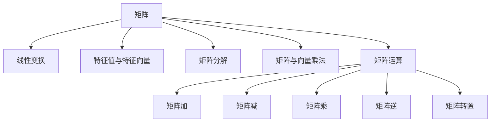

                 

## 1. 背景介绍

### 1.1 问题由来
矩阵理论是数学领域中最为重要的分支之一，其应用范围涵盖了物理学、工程学、计算机科学等多个领域。现代计算机科学中的矩阵计算不仅广泛应用于数值模拟、数据处理、图像处理等领域，更是线性代数中不可或缺的数学工具。

### 1.2 问题核心关键点
矩阵理论的核心思想是将向量空间中的点集合映射到另一向量空间，从而实现线性变换、求导、求积分等基本运算。其基本概念包括矩阵、矩阵运算、线性变换等。而矩阵在计算机科学中的应用涉及优化问题、最优化算法、图算法、机器学习、数据分析等领域。

### 1.3 问题研究意义
研究矩阵理论及其应用，对于拓展计算机科学的发展范围，提升各种算法与模型的性能，加速计算机科学技术的产业化进程，具有重要意义：

1. 提升算法效率。矩阵运算在计算几何、统计学习、优化问题等领域具有重要应用，通过优化矩阵算法，能够显著提升算法效率。
2. 丰富模型表达。矩阵理论使得多种复杂模型（如深度学习模型）具有更加丰富的表达能力，提高模型的泛化性能。
3. 优化资源配置。矩阵理论在信号处理、图像识别、机器学习等领域具有广泛应用，通过矩阵运算可以优化资源配置，降低计算成本。
4. 推动技术创新。矩阵理论在各个领域的应用不断拓展，为计算机科学提供了新的研究视角和创新方向。
5. 助力产业升级。矩阵理论在众多领域的应用促进了计算机科学的产业化进程，为计算机技术在各个行业的应用提供了技术支持。

## 2. 核心概念与联系

### 2.1 核心概念概述

为了更好地理解矩阵理论与应用，本节将介绍几个密切相关的核心概念：

- **矩阵**：二维数组，通常用于表示线性变换、数据变换等。
- **线性变换**：将一个向量空间映射到另一个向量空间的一种操作，通常使用矩阵来描述。
- **特征值与特征向量**：矩阵特征值与特征向量揭示了矩阵的线性变换性质，具有重要应用。
- **矩阵分解**：将一个矩阵分解成几个矩阵的乘积，有助于理解矩阵的性质和优化矩阵运算。
- **矩阵与向量的乘法**：矩阵与向量的乘积在计算机科学中有着广泛的应用，如信号处理、图像处理等。
- **矩阵运算**：包括矩阵加、减、乘、逆、转置等基本运算，是理解矩阵理论的基础。

这些核心概念之间的逻辑关系可以通过以下Mermaid流程图来展示：



这个流程图展示了几大核心概念之间的相互关系：

1. 矩阵是线性变换的载体。
2. 特征值与特征向量揭示矩阵的线性变换特性。
3. 矩阵分解有助于理解矩阵的性质。
4. 矩阵与向量的乘法在计算几何、信号处理等领域有重要应用。
5. 矩阵运算构成矩阵理论的基础。

这些概念共同构成了矩阵理论的框架，使其能够在各种场景下发挥作用。

## 3. 核心算法原理 & 具体操作步骤
### 3.1 算法原理概述

矩阵理论中的核心算法主要是矩阵的线性变换和矩阵分解。线性变换通过矩阵的乘积将一个向量空间映射到另一个向量空间。矩阵分解则通过将一个矩阵分解成几个简单矩阵的乘积，揭示其线性变换的性质。

形式化地，假设有一个矩阵 $A \in \mathbb{R}^{m \times n}$，一个向量 $x \in \mathbb{R}^n$，矩阵 $A$ 的线性变换公式为：

$$ y = Ax $$

其中，$y \in \mathbb{R}^m$ 是变换后的向量。对于矩阵 $A$ 的分解，常用的有LU分解、QR分解、SVD分解等。

### 3.2 算法步骤详解

#### 3.2.1 线性变换

线性变换是将一个向量空间映射到另一个向量空间的过程。假设有一个矩阵 $A \in \mathbb{R}^{m \times n}$，一个向量 $x \in \mathbb{R}^n$，线性变换公式为：

$$ y = Ax $$

其中，$y \in \mathbb{R}^m$ 是变换后的向量。线性变换是矩阵理论中最重要的概念之一，其应用广泛，包括信号处理、图像处理、数值模拟等。

**步骤**：
1. 定义矩阵 $A$ 和向量 $x$。
2. 计算变换后的向量 $y$。
3. 对向量 $y$ 进行进一步处理，如求导、求积分等。

#### 3.2.2 矩阵分解

矩阵分解是将一个矩阵分解成几个简单矩阵的乘积的过程，有助于理解矩阵的性质和优化矩阵运算。常用的矩阵分解包括LU分解、QR分解、SVD分解等。

**LU分解**：

$$ A = LU $$

其中，$L$ 是一个下三角矩阵，$U$ 是一个上三角矩阵。

**QR分解**：

$$ A = QR $$

其中，$Q$ 是一个正交矩阵，$R$ 是一个上三角矩阵。

**SVD分解**：

$$ A = U\Sigma V^T $$

其中，$U$ 和 $V$ 都是正交矩阵，$\Sigma$ 是一个对角矩阵。

**步骤**：
1. 根据实际需求选择合适的矩阵分解方法。
2. 分解矩阵 $A$ 为 $L$、$U$、$Q$、$R$、$U$、$V$、$\Sigma$ 等简单矩阵的乘积。
3. 对分解后的矩阵进行进一步处理，如求解线性方程组、求矩阵的逆等。

### 3.3 算法优缺点

矩阵理论中的线性变换和矩阵分解具有以下优点：

- 线性变换可以处理多种复杂数据，应用广泛。
- 矩阵分解有助于理解矩阵的性质，优化矩阵运算。

但同时，矩阵理论也存在一定的局限性：

- 线性变换的局限性在于只能处理线性关系，无法处理非线性关系。
- 矩阵分解的计算复杂度较高，需要大量的计算资源。

### 3.4 算法应用领域

矩阵理论在计算机科学中的应用非常广泛，涉及优化问题、最优化算法、图算法、机器学习、数据分析等领域。以下是几个典型的应用场景：

- **优化问题**：线性规划、二次规划等优化问题，都可以通过矩阵运算求解。
- **机器学习**：矩阵分解在特征提取、降维等机器学习任务中有着重要应用。
- **数据处理**：矩阵运算在信号处理、图像处理等领域广泛应用。
- **图算法**：图的邻接矩阵表示，矩阵乘法用于图的最短路径、最大流等算法。
- **深度学习**：深度学习模型中的权重矩阵、偏置矩阵等都是通过矩阵运算求得的。

## 4. 数学模型和公式 & 详细讲解  
### 4.1 数学模型构建

本节将使用数学语言对矩阵理论中的线性变换和矩阵分解过程进行更加严格的刻画。

设有一个矩阵 $A \in \mathbb{R}^{m \times n}$，一个向量 $x \in \mathbb{R}^n$，定义矩阵 $A$ 的线性变换公式为：

$$ y = Ax $$

其中，$y \in \mathbb{R}^m$ 是变换后的向量。

### 4.2 公式推导过程

以下我们以QR分解为例，推导其计算公式。

**QR分解**：

$$ A = QR $$

其中，$Q$ 是一个正交矩阵，$R$ 是一个上三角矩阵。

推导过程如下：

1. 首先，对矩阵 $A$ 进行列主元高斯消元，得到其QR分解的形式。
2. 然后，将得到的矩阵 $R$ 和 $Q$ 相乘，恢复原矩阵 $A$。

### 4.3 案例分析与讲解

**案例分析**：
假设有一个矩阵 $A = \begin{bmatrix} 1 & 2 \\ 3 & 4 \\ 5 & 6 \end{bmatrix}$，对其进行QR分解。

**步骤**：
1. 对矩阵 $A$ 进行列主元高斯消元，得到 $R$ 和 $Q$。
2. 将得到的矩阵 $R$ 和 $Q$ 相乘，得到原矩阵 $A$。

**讲解**：
QR分解在机器学习、数据分析等领域有着重要应用。例如，在PCA算法中，矩阵 $A$ 表示特征矩阵，$Q$ 表示主成分，$R$ 表示特征值，通过QR分解，可以对数据进行降维和特征提取。

## 5. 项目实践：代码实例和详细解释说明
### 5.1 开发环境搭建

在进行矩阵理论项目实践前，我们需要准备好开发环境。以下是使用Python进行NumPy开发的环境配置流程：

1. 安装Anaconda：从官网下载并安装Anaconda，用于创建独立的Python环境。

2. 创建并激活虚拟环境：
```bash
conda create -n numpy-env python=3.8 
conda activate numpy-env
```

3. 安装NumPy：从官网获取最新的安装命令。例如：
```bash
conda install numpy
```

4. 安装各类工具包：
```bash
pip install scipy matplotlib sympy
```

完成上述步骤后，即可在`numpy-env`环境中开始矩阵理论项目实践。

### 5.2 源代码详细实现

下面我们以矩阵分解中的LU分解为例，给出使用NumPy库进行矩阵分解的Python代码实现。

```python
import numpy as np

def lu_decomposition(A):
    m, n = A.shape
    L = np.eye(m)  # 初始化下三角矩阵
    U = np.zeros((m, n))  # 初始化上三角矩阵

    for i in range(m):
        # 消元操作
        for j in range(i):
            L[i, j] = A[i, j] / L[j, j]
            U[i, j] = A[i, j]
            U[i, i:] -= L[i, j] * A[j, i:]

    # 返回分解后的矩阵
    return L, U

# 测试矩阵分解
A = np.array([[1, 2, 3], [4, 5, 6], [7, 8, 9]])
L, U = lu_decomposition(A)

print("原矩阵 A:")
print(A)

print("分解后矩阵 L:")
print(L)

print("分解后矩阵 U:")
print(U)
```

### 5.3 代码解读与分析

让我们再详细解读一下关键代码的实现细节：

**lu_decomposition函数**：
- `def lu_decomposition(A):`：定义LU分解函数，输入矩阵A。
- `m, n = A.shape`：获取矩阵A的行数和列数。
- `L = np.eye(m)`：初始化下三角矩阵L，其对角线上的元素为1，其他元素为0。
- `U = np.zeros((m, n))`：初始化上三角矩阵U，其所有元素为0。
- 使用双重循环，对矩阵A进行消元操作，得到L和U。
- 返回分解后的L和U矩阵。

**A的测试**：
- `A = np.array([[1, 2, 3], [4, 5, 6], [7, 8, 9]])`：定义一个测试矩阵A。
- `L, U = lu_decomposition(A)`：对A进行LU分解，得到分解后的L和U矩阵。
- 打印原矩阵A、分解后的L和U矩阵。

可以看到，通过Python的NumPy库，我们可以非常方便地实现矩阵的LU分解。这使得矩阵理论的实践更加快捷、高效。

## 6. 实际应用场景
### 6.1 线性回归模型

线性回归模型是机器学习中最基本的模型之一，其原理是将输入特征和输出变量之间建立线性关系。矩阵理论在线性回归模型的实现中有着重要应用。

假设有一个样本数据集 $D = \{(x_i, y_i)\}_{i=1}^N$，其中 $x_i \in \mathbb{R}^n$ 是输入特征，$y_i \in \mathbb{R}$ 是输出变量，目标是找到最优的参数 $\theta$，使得预测值 $\hat{y} = \theta^T x_i$ 与真实值 $y_i$ 最接近。

线性回归模型的矩阵形式如下：

$$ \hat{y} = X \theta $$

其中，$X \in \mathbb{R}^{N \times n}$ 是样本特征矩阵，$\theta \in \mathbb{R}^n$ 是模型参数。

### 6.2 主成分分析(PCA)

主成分分析(PCA)是一种数据降维技术，通过找到数据中的主要成分，将高维数据映射到低维空间。矩阵理论在PCA中有着重要应用。

假设有一个样本数据集 $D = \{(x_i, y_i)\}_{i=1}^N$，其中 $x_i \in \mathbb{R}^n$ 是输入特征，$y_i \in \mathbb{R}$ 是输出变量，目标是找到一组新的特征 $z_i$，使得数据在新的特征空间中的方差最小。

PCA的矩阵形式如下：

$$ z_i = W^T x_i $$

其中，$W \in \mathbb{R}^{n \times n'}$ 是特征矩阵，$z_i \in \mathbb{R}^{n'}$ 是新的特征向量。

### 6.3 神经网络

神经网络是深度学习中最常用的模型之一，其原理是通过多个线性变换层和非线性变换层，实现输入特征到输出变量的映射。矩阵理论在神经网络中有着重要应用。

假设有一个神经网络模型，包括 $l$ 个隐藏层和输出层，每个隐藏层包含 $n$ 个神经元，目标是找到最优的权重矩阵 $W_l \in \mathbb{R}^{n_l \times n_{l-1}}$ 和偏置向量 $b_l \in \mathbb{R}^{n_l}$，使得模型输出 $y$ 与真实值 $y'$ 最接近。

神经网络的矩阵形式如下：

$$ y = \sigma(z) = \sigma(W_l \sigma(W_{l-1} \sigma(... \sigma(W_1 x + b_1)... + b_l)... + b_l) $$

其中，$\sigma$ 是激活函数，$x \in \mathbb{R}^n$ 是输入特征，$z \in \mathbb{R}^n$ 是隐藏层输出。

## 7. 工具和资源推荐
### 7.1 学习资源推荐

为了帮助开发者系统掌握矩阵理论及其应用，这里推荐一些优质的学习资源：

1. 《线性代数及其应用》：一本经典线性代数教材，详细介绍了矩阵理论及其应用。
2. 《矩阵分析》：一本介绍矩阵理论的详细书籍，涵盖矩阵分解、特征值与特征向量等内容。
3. 《Python科学计算》：一本介绍NumPy、SciPy等库的使用，适合机器学习、数据科学等领域的开发。
4. 《深度学习》：一本介绍深度学习模型的原理与应用，涵盖矩阵理论在深度学习中的应用。
5. 《计算机视觉：算法与应用》：一本介绍计算机视觉技术的书籍，其中大量应用了矩阵理论。

通过对这些资源的学习实践，相信你一定能够快速掌握矩阵理论的精髓，并用于解决实际的计算机科学问题。
###  7.2 开发工具推荐

高效的开发离不开优秀的工具支持。以下是几款用于矩阵理论项目开发的常用工具：

1. NumPy：Python的开源数值计算库，提供了高效的矩阵运算功能，是矩阵理论项目开发的基础。
2. SciPy：NumPy的扩展库，提供了更多的科学计算功能，如线性代数、信号处理等。
3. Matplotlib：Python的数据可视化库，可以用于绘制矩阵的图形，辅助理解矩阵理论。
4. SymPy：Python的符号计算库，支持矩阵运算、矩阵分解等操作。
5. TensorFlow：Google的开源深度学习框架，提供了强大的矩阵运算功能，适合大规模数据处理。

合理利用这些工具，可以显著提升矩阵理论项目的开发效率，加快创新迭代的步伐。

### 7.3 相关论文推荐

矩阵理论在计算机科学中的应用研究一直备受关注，以下是几篇奠基性的相关论文，推荐阅读：

1. "Gaussian Elimination"：Gauss提出的矩阵分解方法，是矩阵理论的基础。
2. "QR Decomposition"：Householder提出的QR分解方法，广泛应用于矩阵分解和矩阵运算。
3. "SVD Decomposition"：SVD分解是矩阵理论中最常用的分解方法之一，广泛应用于数据降维、特征提取等领域。
4. "The Matrix Cookbook"：介绍了多种矩阵运算的实现方法，适合初学者入门。
5. "Numerical Recipes"：一本介绍科学计算的书籍，涵盖矩阵理论在科学计算中的应用。

这些论文代表了大矩阵理论研究的发展脉络。通过学习这些前沿成果，可以帮助研究者把握学科前进方向，激发更多的创新灵感。

## 8. 总结：未来发展趋势与挑战

### 8.1 总结

本文对矩阵理论及其应用进行了全面系统的介绍。首先阐述了矩阵理论的核心思想和核心概念，明确了矩阵理论在计算机科学中的重要地位。其次，从原理到实践，详细讲解了线性变换和矩阵分解的数学原理和关键步骤，给出了矩阵理论项目开发的完整代码实例。同时，本文还广泛探讨了矩阵理论在机器学习、数据处理、深度学习等领域的应用前景，展示了矩阵理论的巨大潜力。

通过本文的系统梳理，可以看到，矩阵理论及其应用在计算机科学中具有重要的地位，为机器学习、数据处理、深度学习等领域提供了坚实的数学基础。未来，伴随矩阵理论的不断演进，相信计算机科学将在更多领域大放异彩，为人类认知智能的进化带来深远影响。

### 8.2 未来发展趋势

展望未来，矩阵理论在计算机科学中的应用将呈现以下几个发展趋势：

1. 高性能计算：随着硬件设备的进步，矩阵运算的性能将进一步提升，支持更大规模的数据处理。
2. 深度学习融合：矩阵理论在深度学习中的应用将更加广泛，支持更加复杂的网络结构。
3. 多模态融合：矩阵理论将与其他数学理论如符号计算、概率统计等结合，支持多模态数据的处理。
4. 大数据处理：矩阵理论在数据处理中的应用将更加广泛，支持海量数据的高效处理。
5. 实时处理：矩阵理论在实时处理中的应用将更加广泛，支持更快速的响应速度。

以上趋势凸显了矩阵理论的广阔前景。这些方向的探索发展，必将进一步提升计算机科学的性能和应用范围，为计算机科学技术的产业化进程提供坚实的数学基础。

### 8.3 面临的挑战

尽管矩阵理论在计算机科学中的应用已经取得了瞩目成就，但在迈向更加智能化、普适化应用的过程中，它仍面临着诸多挑战：

1. 数据存储与处理：矩阵理论在处理大规模数据时，需要高效的存储和处理方式，这对硬件设备的性能提出了高要求。
2. 模型复杂度：深度学习中的神经网络模型非常复杂，矩阵理论在处理高维、多层次模型时，需要更加高效的算法。
3. 可解释性：矩阵理论在深度学习中的应用，往往难以解释其内部工作机制和决策逻辑，这对模型可信度提出了挑战。
4. 鲁棒性：矩阵理论在实际应用中，容易受到噪声、异常数据等的影响，模型的鲁棒性需要进一步提升。
5. 计算资源：矩阵理论在深度学习中的应用，需要大量的计算资源，这对硬件设备的性能提出了高要求。

### 8.4 研究展望

面对矩阵理论面临的这些挑战，未来的研究需要在以下几个方面寻求新的突破：

1. 优化矩阵运算算法：通过算法优化，提升矩阵运算的效率，支持更大规模的数据处理。
2. 融合其他数学理论：将矩阵理论与其他数学理论如符号计算、概率统计等结合，支持多模态数据的处理。
3. 提高模型可解释性：通过引入可解释性技术，增强矩阵理论在深度学习中的应用可信度。
4. 增强模型鲁棒性：通过引入鲁棒性技术，增强矩阵理论在实际应用中的鲁棒性。
5. 探索新的应用场景：探索矩阵理论在更多领域的应用，如自然语言处理、计算机视觉等。

这些研究方向的探索，必将引领矩阵理论的发展，为计算机科学提供更多的数学基础，推动计算机科学的产业化进程。总之，矩阵理论及其应用需要从多个维度进行全面优化，方能实现其广泛的应用前景。

