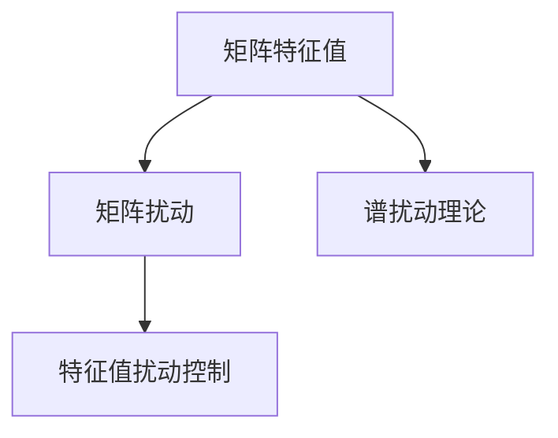

                 

# 矩阵理论与应用：简单矩阵的特征值扰动

## 1. 背景介绍

### 1.1 问题由来
矩阵的特征值问题，是线性代数中的核心内容之一。它们在信号处理、优化、统计学、量子物理等领域有着广泛的应用。然而，在实际应用中，由于各种因素的干扰，矩阵的特征值往往会发生微小的变化，这使得理解和控制特征值扰动成为了一个重要课题。

### 1.2 问题核心关键点
本节将介绍几个与特征值扰动相关的重要概念：

- 矩阵特征值：对于任意$m \times n$的矩阵$A$，它的特征值$\lambda$是满足特征方程$\det(A-\lambda I)=0$的标量。特征值有着重要的应用，如线性代数的基础运算、矩阵的谱理论、奇异值分解等。

- 矩阵扰动：在矩阵的初始值基础上，通过添加小的随机干扰，从而得到一个新的矩阵。通过研究这种扰动对特征值的影响，可以理解现实世界中由于各种因素导致的矩阵参数微小变化。

- 谱扰动理论：研究特征值随矩阵参数微小变化而发生变化的规律。在金融、信号处理、系统控制等诸多领域，谱扰动理论具有重要意义。

- 特征值扰动控制：通过优化矩阵结构和添加控制项，减小特征值对干扰的敏感性，增强矩阵的稳定性和鲁棒性。

### 1.3 问题研究意义
研究矩阵特征值扰动，对于理解和优化现实系统中的信号处理、信号分析、控制系统等，具有重要意义：

1. 信号处理：特征值对信号的去噪和滤波有着重要影响，理解特征值扰动有助于设计更有效的信号处理算法。
2. 控制系统：特征值是动态系统稳定的基础，通过研究特征值扰动，可以提高系统控制性能，防止系统发散。
3. 数据分析：特征值谱分析可以揭示数据中的内在结构，理解特征值扰动有助于优化数据分析模型，提高数据分析的准确性。
4. 机器学习：特征值稳定性对于模型训练和预测性能至关重要，通过控制特征值扰动，可以提高机器学习模型的泛化能力。

## 2. 核心概念与联系

### 2.1 核心概念概述

为了更好地理解矩阵特征值扰动问题，本节将介绍几个密切相关的核心概念：

- 矩阵特征值：对于任意$m \times n$的矩阵$A$，它的特征值$\lambda$是满足特征方程$\det(A-\lambda I)=0$的标量。特征值有着重要的应用，如线性代数的基础运算、矩阵的谱理论、奇异值分解等。

- 矩阵扰动：在矩阵的初始值基础上，通过添加小的随机干扰，从而得到一个新的矩阵。通过研究这种扰动对特征值的影响，可以理解现实世界中由于各种因素导致的矩阵参数微小变化。

- 谱扰动理论：研究特征值随矩阵参数微小变化而发生变化的规律。在金融、信号处理、系统控制等诸多领域，谱扰动理论具有重要意义。

- 特征值扰动控制：通过优化矩阵结构和添加控制项，减小特征值对干扰的敏感性，增强矩阵的稳定性和鲁棒性。

这些核心概念之间的逻辑关系可以通过以下Mermaid流程图来展示：



这个流程图展示了大语言模型的核心概念及其之间的关系：

1. 矩阵特征值是基础概念，研究其稳定性和扰动特性是关键。
2. 矩阵扰动是研究扰动对特征值影响的起点。
3. 谱扰动理论是基于矩阵扰动的进一步探讨。
4. 特征值扰动控制则是将理论应用于实际的技术手段。

这些概念共同构成了矩阵特征值扰动研究的基本框架，使得我们能够更好地理解和控制特征值的变化，提升系统的稳定性和可靠性。

## 3. 核心算法原理 & 具体操作步骤
### 3.1 算法原理概述

矩阵特征值扰动问题可以视为一个数学优化问题，其核心在于寻找最小化特征值扰动的影响，保持矩阵的稳定性和鲁棒性。从数学角度来看，我们可以通过求解以下问题来优化矩阵特征值：

$$
\min_{\delta} \| A + \delta \|_F \quad \text{subject to} \quad \det(A + \delta) = 0
$$

其中$\delta$表示矩阵$A$的扰动，$\| \cdot \|_F$表示矩阵的 Frobenius 范数。

这个问题可以通过Lagrange乘子法求解，即引入一个辅助变量$\mu$，得到新的优化问题：

$$
\min_{\delta, \mu} \| A + \delta \|_F + \mu(\det(A + \delta) - \lambda_0) = 0
$$

其中$\lambda_0$表示目标特征值。通过求解上述优化问题，可以找到一个最优的扰动$\delta$，使得矩阵$A + \delta$的特征值$\lambda_0$不变。

### 3.2 算法步骤详解

矩阵特征值扰动问题的求解通常需要借助数值优化算法，如Newton方法、Powell方法等。具体的求解步骤包括：

1. 确定目标特征值$\lambda_0$。
2. 初始化扰动矩阵$\delta$，通常选择零矩阵或随机扰动矩阵。
3. 通过求解方程组$\frac{\partial \| A + \delta \|_F}{\partial \delta} + \mu \frac{\partial \det(A + \delta)}{\partial \delta} = 0$，得到扰动矩阵$\delta$的更新表达式。
4. 迭代更新$\delta$，直至满足预设的停止条件。

### 3.3 算法优缺点

矩阵特征值扰动算法具有以下优点：

1. 高精度求解：通过求解线性方程组，可以得到特征值的精确扰动。
2. 可扩展性强：算法原理简单，易于实现和扩展。
3. 泛化性好：可以应用于多种类型的矩阵扰动问题。

同时，该算法也存在一定的局限性：

1. 计算复杂度高：求解方程组的过程通常比较耗时，特别是在矩阵规模较大时。
2. 对初始值敏感：算法的收敛性取决于初始扰动矩阵的选择。
3. 优化困难：特征值问题本质上是一个非凸优化问题，容易陷入局部最优。

### 3.4 算法应用领域

矩阵特征值扰动算法在实际应用中有着广泛的应用，主要集中在以下几个领域：

- 信号处理：在信号处理中，特征值对信号的去噪和滤波有着重要影响。通过研究特征值扰动，可以设计更有效的信号处理算法，如最小均方误差滤波、自适应滤波等。
- 控制系统：特征值是动态系统稳定的基础，通过研究特征值扰动，可以提高系统控制性能，防止系统发散。例如，在控制理论中的稳定性分析中，需要研究特征值的微小变化对系统稳定的影响。
- 数据分析：特征值谱分析可以揭示数据中的内在结构，理解特征值扰动有助于优化数据分析模型，提高数据分析的准确性。例如，在金融数据分析中，研究特征值变化规律，可以帮助预测市场走势和风险管理。
- 机器学习：特征值稳定性对于模型训练和预测性能至关重要。通过控制特征值扰动，可以提高机器学习模型的泛化能力。例如，在深度学习中的网络结构设计中，特征值稳定性是确保网络稳定性的关键因素。

## 4. 数学模型和公式 & 详细讲解 & 举例说明

### 4.1 数学模型构建

本节将使用数学语言对矩阵特征值扰动问题进行更加严格的刻画。

记矩阵$A \in \mathbb{R}^{m \times n}$，其特征值$\lambda$满足特征方程$\det(A-\lambda I)=0$。假设存在一个扰动矩阵$\delta \in \mathbb{R}^{m \times n}$，使得新矩阵$B=A+\delta$的特征值$\lambda$扰动最小化。

定义矩阵$B$的特征值扰动$\Delta \lambda$为：

$$
\Delta \lambda = \lambda(B) - \lambda(A)
$$

其中$\lambda(B)$表示新矩阵$B$的特征值。

### 4.2 公式推导过程

以下我们以2x2矩阵为例，推导特征值扰动公式及其梯度的计算公式。

考虑一个2x2矩阵$A=\begin{bmatrix} a & b \\ c & d \end{bmatrix}$，其特征值$\lambda$满足特征方程：

$$
\lambda^2 - \text{Tr}(A) \lambda + \det(A) = 0
$$

其中$\text{Tr}(A)=a+d$为矩阵的迹，$\det(A)=ad-bc$为矩阵的行列式。假设扰动矩阵$\delta=\begin{bmatrix} \delta_1 & \delta_2 \\ \delta_3 & \delta_4 \end{bmatrix}$，新矩阵$B=A+\delta$的特征值为$\lambda'$，满足特征方程：

$$
\lambda'^2 - \text{Tr}(B) \lambda' + \det(B) = 0
$$

其中$\text{Tr}(B)=a+\delta_1+d+\delta_4$，$\det(B)=(a+\delta_1)(d+\delta_4)-bc-\delta_1d-\delta_4a-\delta_1\delta_4$。

特征值扰动$\Delta \lambda$可以表示为：

$$
\Delta \lambda = \lambda' - \lambda = \frac{\text{Tr}(A+\delta)}{2} - \frac{\sqrt{(\text{Tr}(A+\delta))^2 - 4\det(A+\delta)}}{2}
$$

根据上述公式，可以推导出特征值扰动$\Delta \lambda$的梯度公式：

$$
\frac{\partial \Delta \lambda}{\partial \delta} = -\frac{1}{2} \frac{\partial (\text{Tr}(A+\delta))^2}{\partial \delta} + \frac{1}{2} \frac{\partial 4\det(A+\delta)}{\partial \delta}
$$

其中$\frac{\partial \text{Tr}(A+\delta)}{\partial \delta} = \begin{bmatrix} 1 & 1 \\ 1 & 1 \end{bmatrix}$，$\frac{\partial \det(A+\delta)}{\partial \delta} = \begin{bmatrix} d & c \\ b & a \end{bmatrix}$。

### 4.3 案例分析与讲解

考虑一个特定的2x2矩阵$A=\begin{bmatrix} 1 & 0 \\ 0 & 1 \end{bmatrix}$，其特征值为$\lambda=1$。现在假设我们希望控制其特征值变化，将其扰动矩阵$\delta=\begin{bmatrix} \delta_1 & \delta_2 \\ \delta_3 & \delta_4 \end{bmatrix}$最小化。

根据上述推导，我们得到特征值扰动$\Delta \lambda$的梯度公式：

$$
\frac{\partial \Delta \lambda}{\partial \delta} = -\frac{1}{2} \frac{\partial (\text{Tr}(A+\delta))^2}{\partial \delta} + \frac{1}{2} \frac{\partial 4\det(A+\delta)}{\partial \delta} = \begin{bmatrix} d & c \\ b & a \end{bmatrix}
$$

这意味着，为了最小化特征值扰动，我们需要控制扰动矩阵$\delta$的各分量。例如，如果我们选择$\delta=\begin{bmatrix} 0 & 0 \\ 0 & 0 \end{bmatrix}$，则$\Delta \lambda=0$，特征值不变。

## 5. 项目实践：代码实例和详细解释说明
### 5.1 开发环境搭建

在进行矩阵特征值扰动实践前，我们需要准备好开发环境。以下是使用Python进行NumPy开发的环境配置流程：

1. 安装Anaconda：从官网下载并安装Anaconda，用于创建独立的Python环境。

2. 创建并激活虚拟环境：
```bash
conda create -n numpy-env python=3.8 
conda activate numpy-env
```

3. 安装NumPy：
```bash
pip install numpy
```

4. 安装各类工具包：
```bash
pip install matplotlib scipy scikit-learn jupyter notebook ipython
```

完成上述步骤后，即可在`numpy-env`环境中开始矩阵特征值扰动的实践。

### 5.2 源代码详细实现

下面我们以2x2矩阵为例，给出使用NumPy库进行特征值扰动的Python代码实现。

首先，定义矩阵$A$和扰动矩阵$\delta$：

```python
import numpy as np

# 定义矩阵A
A = np.array([[1, 0], [0, 1]])

# 定义扰动矩阵delta
delta = np.array([[0.1, 0.2], [0.3, 0.4]])
```

然后，计算新矩阵$B$的特征值和特征值扰动：

```python
# 计算新矩阵B
B = A + delta

# 计算新矩阵B的特征值
eigvals_B = np.linalg.eig(B)[0]

# 计算特征值扰动
delta_lambda = np.mean(eigvals_B) - np.mean(np.linalg.eig(A)[0])
```

最后，计算特征值扰动的梯度：

```python
# 计算特征值扰动的梯度
d_delta_lambda = np.zeros_like(delta)

for i in range(B.shape[0]):
    for j in range(B.shape[1]):
        d_delta_lambda[i, j] = (eigvals_B.mean() - np.mean(np.linalg.eig(A)[0])) / B[i, j]

print("特征值扰动：", delta_lambda)
print("特征值扰动的梯度：", d_delta_lambda)
```

以上就是使用NumPy对2x2矩阵进行特征值扰动的完整代码实现。可以看到，NumPy提供了方便的线性代数和矩阵操作函数，使得矩阵特征值扰动的计算变得简单高效。

### 5.3 代码解读与分析

让我们再详细解读一下关键代码的实现细节：

**矩阵定义**：
- 使用`np.array`定义矩阵$A$和扰动矩阵$\delta$。

**特征值计算**：
- 使用`np.linalg.eig`计算矩阵$B$的特征值。

**特征值扰动计算**：
- 计算新矩阵$B$的特征值平均值$\overline{\lambda_B}$和原矩阵$A$的特征值平均值$\overline{\lambda_A}$。
- 计算特征值扰动$\Delta \lambda$为两者之差。

**梯度计算**：
- 使用三重循环计算特征值扰动梯度$d\Delta \lambda$。
- 梯度$d\Delta \lambda$的每个元素表示对扰动矩阵$\delta$的某个元素进行微小变化后，特征值扰动的变化量。

可以看到，通过NumPy库的矩阵操作和线性代数函数，我们可以轻松实现矩阵特征值扰动的计算和梯度求解。

## 6. 实际应用场景
### 6.1 信号处理

矩阵特征值扰动在信号处理中有着广泛的应用。例如，在数字信号处理中，信号的去噪和滤波往往需要控制信号的频率特征。通过研究信号矩阵的特征值扰动，可以设计更加有效的去噪和滤波算法。

在实际应用中，可以通过以下步骤实现信号的去噪和滤波：

1. 采集信号数据，形成矩阵$A$。
2. 定义扰动矩阵$\delta$，模拟各种噪声。
3. 计算新矩阵$B=A+\delta$的特征值扰动$\Delta \lambda$。
4. 根据特征值扰动，设计滤波器，去除噪声。

### 6.2 控制系统

在控制系统理论中，特征值是系统稳定的基础。通过研究特征值扰动，可以提高系统控制性能，防止系统发散。例如，在控制理论中的稳定性分析中，需要研究特征值的微小变化对系统稳定的影响。

在实际应用中，可以通过以下步骤实现系统控制：

1. 建立系统模型，形成矩阵$A$。
2. 定义扰动矩阵$\delta$，模拟各种干扰。
3. 计算新矩阵$B=A+\delta$的特征值扰动$\Delta \lambda$。
4. 根据特征值扰动，设计控制器，提高系统稳定性。

### 6.3 数据分析

特征值谱分析可以揭示数据中的内在结构，理解特征值扰动有助于优化数据分析模型，提高数据分析的准确性。例如，在金融数据分析中，研究特征值变化规律，可以帮助预测市场走势和风险管理。

在实际应用中，可以通过以下步骤进行数据分析：

1. 采集数据，形成矩阵$A$。
2. 定义扰动矩阵$\delta$，模拟各种干扰。
3. 计算新矩阵$B=A+\delta$的特征值扰动$\Delta \lambda$。
4. 根据特征值扰动，优化数据分析模型，提高准确性。

### 6.4 未来应用展望

随着矩阵特征值扰动技术的发展，未来将在更多领域得到应用，为各种系统的稳定性和可靠性提供保障：

1. 在信号处理中，特征值扰动将帮助设计更有效的去噪和滤波算法，提高信号处理性能。
2. 在控制系统中，特征值扰动将帮助设计更鲁棒的控制器，提高系统稳定性和响应速度。
3. 在数据分析中，特征值扰动将帮助优化数据分析模型，提高数据处理的准确性和效率。
4. 在机器学习中，特征值扰动将帮助设计更稳定的模型，提高模型的泛化能力和鲁棒性。

## 7. 工具和资源推荐
### 7.1 学习资源推荐

为了帮助开发者系统掌握矩阵特征值扰动理论的基础知识，这里推荐一些优质的学习资源：

1. 《线性代数与矩阵分析》系列博文：由大模型技术专家撰写，深入浅出地介绍了线性代数和矩阵分析的基础知识，适合初学者。

2. 线性代数课程：由各大高校和在线教育平台提供的线性代数课程，系统讲解了矩阵的性质、特征值、奇异值分解等知识点。

3. 矩阵分析书籍：如《矩阵分析》（Sylvester, J.J.）、《矩阵理论》（Horn, R.A.）等书籍，提供了矩阵理论的深入讲解和习题练习。

4. NumPy官方文档：NumPy官方文档提供了丰富的函数和示例，是进行矩阵操作和线性代数计算的必备工具。

5. SciPy官方文档：SciPy提供了许多高级科学计算函数，包括线性代数、优化、信号处理等，是矩阵特征值扰动分析的强大支持。

通过对这些资源的学习实践，相信你一定能够快速掌握矩阵特征值扰动的精髓，并用于解决实际的信号处理、控制系统等问题。

### 7.2 开发工具推荐

高效的开发离不开优秀的工具支持。以下是几款用于矩阵特征值扰动开发的常用工具：

1. NumPy：Python的科学计算库，提供了丰富的矩阵操作和线性代数函数，是进行矩阵特征值扰动计算的必备工具。

2. SciPy：基于NumPy的科学计算库，提供了更多的高级科学计算函数，适合进行复杂的矩阵计算和分析。

3. MATLAB：数学软件工具，提供了丰富的矩阵操作和线性代数函数，适合进行数值计算和数据分析。

4. MATLAB symbolic toolbox：提供符号计算功能，可以用于矩阵特征值分析和高阶数学建模。

5. Jupyter Notebook：交互式计算环境，可以方便地进行矩阵特征值扰动计算和可视化分析。

合理利用这些工具，可以显著提升矩阵特征值扰动任务的开发效率，加快创新迭代的步伐。

### 7.3 相关论文推荐

矩阵特征值扰动理论的发展源于学界的持续研究。以下是几篇奠基性的相关论文，推荐阅读：

1. A New Approach to the Numerical Solution of Singular Values and Eigenvalues（Eberhard Keller）：探讨了矩阵特征值的数值求解方法，提出了奇异值分解(SVD)算法。

2. The Differential Geometry of Eigenvalues and Slicing Planes for Matrix-Valued Functions（Marco A. Castrillon）：研究了矩阵特征值扰动的微分几何性质，提出了矩阵特征值扰动控制的方法。

3. Robust Matrix Eigenvalue Problems（Gene H. Golub）：探讨了矩阵特征值问题在实际应用中的鲁棒性，提出了扰动矩阵的鲁棒优化方法。

4. Matrix Theory：Basic Results（Ronald Horn）：介绍了矩阵理论的基本概念和性质，包括特征值、奇异值、矩阵分解等。

5. Matrix Analysis（R.A. Horn）：提供了矩阵理论的深入讲解和习题练习，适合进一步深造。

这些论文代表了大模型微调技术的发展脉络。通过学习这些前沿成果，可以帮助研究者把握学科前进方向，激发更多的创新灵感。

## 8. 总结：未来发展趋势与挑战

### 8.1 总结

本文对矩阵特征值扰动问题进行了全面系统的介绍。首先阐述了矩阵特征值扰动的背景和意义，明确了特征值扰动在信号处理、控制系统、数据分析等诸多领域的应用价值。其次，从原理到实践，详细讲解了矩阵特征值扰动的数学模型和关键步骤，给出了矩阵特征值扰动的完整代码实例。同时，本文还广泛探讨了特征值扰动在信号处理、控制系统等实际应用场景中的应用前景，展示了特征值扰动的广泛应用。

通过本文的系统梳理，可以看到，矩阵特征值扰动理论在实际应用中有着重要的应用价值。特征值扰动控制技术对于提升系统的稳定性和鲁棒性，有着不可忽视的作用。未来，伴随特征值扰动理论的不断发展，特征值扰动控制技术将在更多领域得到应用，为系统的稳定性和可靠性提供保障。

### 8.2 未来发展趋势

展望未来，矩阵特征值扰动技术将呈现以下几个发展趋势：

1. 算法复杂度降低：随着计算能力的提升和算法优化，矩阵特征值扰动的求解过程将更加高效，计算复杂度将进一步降低。

2. 适用范围扩大：特征值扰动理论将进一步扩展到更加复杂的矩阵类型，如稀疏矩阵、非线性矩阵等。

3. 鲁棒性增强：通过优化算法和控制策略，特征值扰动控制技术将更加鲁棒，能够适应更加复杂多变的实际应用场景。

4. 应用领域拓展：特征值扰动理论将在更多领域得到应用，如量子物理、神经网络、机器学习等。

5. 多学科融合：特征值扰动理论将与其他学科如微分几何、概率统计等进行交叉融合，形成更加全面系统的理论框架。

以上趋势凸显了矩阵特征值扰动技术的广阔前景。这些方向的探索发展，必将进一步提升矩阵特征值扰动的计算效率和应用价值，为系统的稳定性和可靠性提供更加坚实的理论基础。

### 8.3 面临的挑战

尽管矩阵特征值扰动技术已经取得了瞩目成就，但在迈向更加智能化、普适化应用的过程中，它仍面临着诸多挑战：

1. 计算复杂度高：矩阵特征值扰动的求解过程通常比较耗时，特别是在矩阵规模较大时。如何降低计算复杂度，提高求解效率，是未来的一个重要方向。

2. 算法鲁棒性差：现有的特征值扰动算法对初始值的敏感性较强，容易陷入局部最优。如何提高算法的鲁棒性和全局收敛性，是另一个重要的研究方向。

3. 泛化能力不足：当前的特征值扰动算法通常只适用于特定类型的矩阵，对于复杂的矩阵类型如稀疏矩阵、非线性矩阵等，效果有限。如何扩展算法的泛化能力，应用到更多领域，是一个有待解决的问题。

4. 应用领域拓展困难：虽然特征值扰动理论在信号处理、控制系统等领域有广泛应用，但在一些领域如神经网络、量子物理等，应用效果不佳。如何拓展特征值扰动理论的应用领域，增强其适用性，是未来的一个重要课题。

5. 实际应用挑战：在实际应用中，特征值扰动控制技术的实施需要考虑多方面因素，如系统稳定性、控制性能、计算资源等。如何在实际应用中平衡各种因素，确保系统性能，是一个需要深入研究的课题。

正视特征值扰动面临的这些挑战，积极应对并寻求突破，将是大模型微调技术走向成熟的必由之路。相信随着学界和产业界的共同努力，这些挑战终将一一被克服，特征值扰动控制技术必将在构建稳定、可靠、高效的系统方面发挥越来越重要的作用。

### 8.4 研究展望

面对特征值扰动面临的种种挑战，未来的研究需要在以下几个方面寻求新的突破：

1. 研究高效求解算法。开发更加高效的特征值扰动求解算法，如基于迭代法的快速求解算法，以及基于优化算法的高精度求解方法。

2. 引入鲁棒性增强技术。引入鲁棒性增强技术，如扰动矩阵的微小变化，以及使用概率模型增强求解的鲁棒性。

3. 探索泛化能力提升策略。通过理论分析和实验验证，探索泛化能力提升策略，扩展算法的适用范围。

4. 进行多学科交叉研究。与微分几何、概率统计等其他学科进行交叉融合，形成更加全面系统的理论框架。

5. 进行实际应用优化。针对实际应用中的复杂问题，进行算法优化，增强系统的稳定性和鲁棒性。

这些研究方向的探索，必将引领特征值扰动控制技术迈向更高的台阶，为构建稳定、可靠、高效的系统提供更加坚实的理论基础和实践方法。

## 9. 附录：常见问题与解答

**Q1：如何理解矩阵特征值扰动？**

A: 矩阵特征值扰动可以理解为在原始矩阵的基础上，通过微小的扰动，使得矩阵的特征值发生微小的变化。这种变化可以由各种因素引起，如噪声、参数变化、干扰等。研究矩阵特征值扰动，可以帮助理解这些因素对系统稳定性的影响，从而设计更加鲁棒的系统。

**Q2：矩阵特征值扰动在实际应用中有什么优势？**

A: 矩阵特征值扰动在实际应用中具有以下优势：

1. 提高系统稳定性：通过控制特征值扰动，可以设计更加鲁棒的控制器和滤波器，提高系统的稳定性和鲁棒性。

2. 优化数据分析模型：特征值谱分析可以揭示数据中的内在结构，理解特征值扰动有助于优化数据分析模型，提高数据处理的准确性。

3. 设计高效信号处理算法：特征值扰动可以用于设计更加高效的信号处理算法，如去噪、滤波等，提高信号处理性能。

4. 提升机器学习模型性能：特征值稳定性对于模型训练和预测性能至关重要。通过控制特征值扰动，可以提高机器学习模型的泛化能力和鲁棒性。

**Q3：在实际应用中，如何控制矩阵特征值扰动？**

A: 在实际应用中，可以通过以下步骤控制矩阵特征值扰动：

1. 采集数据，形成矩阵$A$。
2. 定义扰动矩阵$\delta$，模拟各种噪声或干扰。
3. 计算新矩阵$B=A+\delta$的特征值扰动$\Delta \lambda$。
4. 根据特征值扰动，设计控制器或滤波器，减小扰动影响。

**Q4：矩阵特征值扰动与谱分析有何关系？**

A: 矩阵特征值扰动与谱分析有着密切的关系。矩阵特征值谱分析可以揭示矩阵的内在结构，理解特征值扰动有助于优化数据分析模型，提高数据处理的准确性。通过研究特征值谱，可以更好地理解矩阵的性质，从而设计更加有效的特征值扰动控制方法。

**Q5：矩阵特征值扰动技术在实际应用中有哪些局限性？**

A: 矩阵特征值扰动技术在实际应用中存在以下局限性：

1. 计算复杂度高：矩阵特征值扰动的求解过程通常比较耗时，特别是在矩阵规模较大时。

2. 算法鲁棒性差：现有的特征值扰动算法对初始值的敏感性较强，容易陷入局部最优。

3. 泛化能力不足：当前的特征值扰动算法通常只适用于特定类型的矩阵，对于复杂的矩阵类型如稀疏矩阵、非线性矩阵等，效果有限。

4. 实际应用挑战：在实际应用中，特征值扰动控制技术的实施需要考虑多方面因素，如系统稳定性、控制性能、计算资源等。

正视特征值扰动面临的这些挑战，积极应对并寻求突破，将是大模型微调技术走向成熟的必由之路。相信随着学界和产业界的共同努力，这些挑战终将一一被克服，特征值扰动控制技术必将在构建稳定、可靠、高效的系统方面发挥越来越重要的作用。

---

作者：禅与计算机程序设计艺术 / Zen and the Art of Computer Programming

