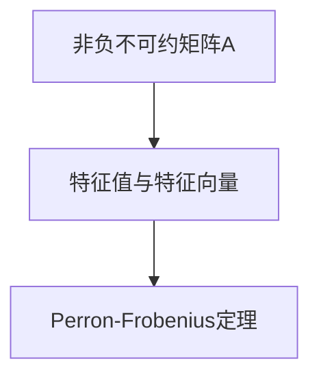

                 

## 1. 背景介绍

### 1.1 问题由来

矩阵理论是现代数学和工程学科中最为重要的工具之一，它的应用遍及科学技术的各个领域。非负不可约矩阵（Non-negative Irreducible Matrix）作为矩阵理论中的基本概念，以其在科学计算、优化理论、信息理论等多个领域的重要地位备受关注。Perron-Frobenius定理则是研究非负不可约矩阵谱理论的核心内容，它为许多实际问题提供了理论基础。本文将系统介绍非负不可约矩阵的Perron-Frobenius定理，并详细阐述其应用场景。

### 1.2 问题核心关键点

Perron-Frobenius定理的数学表达涉及非负不可约矩阵的特征值与特征向量，其核心在于：
- 非负不可约矩阵的特征值和特征向量具有哪些性质？
- 这些性质如何应用于实际问题的求解？
- 如何通过算法实现这些性质的计算？

## 2. 核心概念与联系

### 2.1 核心概念概述

**非负不可约矩阵**：如果一个矩阵的所有元素均为非负数，且不存在任何正整数次幂的零矩阵与之等价，那么这个矩阵就是非负不可约矩阵。

**Perron-Frobenius定理**：如果一个非负不可约矩阵$A$的阶数为$n$，则$A$有$n$个实特征值，其中有一个且仅有一个正的特征值$\lambda_{Perron}$，其余特征值均为负或零，$\lambda_{Perron}$对应的特征向量为$v_{Perron}$，且$\lambda_{Perron}$的几何重数为1，即只有一个。

**特征值与特征向量**：设$A$为$m \times n$矩阵，若存在$\lambda \in \mathbb{R}$和$n$维非零列向量$v$，使得$Av=\lambda v$，则称$\lambda$为$A$的特征值，$v$为$A$对应$\lambda$的特征向量。

**矩阵的不可约性**：若不存在一个矩阵$B$，使得$A=BC$或$A=CB$，则称$A$为不可约矩阵。

### 2.2 核心概念原理和架构的 Mermaid 流程图



这个流程图展示了非负不可约矩阵通过特征值与特征向量关联到Perron-Frobenius定理的基本逻辑关系：

- 一个非负不可约矩阵$A$具有$n$个实特征值，其中有一个正的特征值$\lambda_{Perron}$，其余特征值为负或零。
- $\lambda_{Perron}$的几何重数为1，即只有一个。
- $\lambda_{Perron}$对应的特征向量$v_{Perron}$可以为任意非零向量。

## 3. 核心算法原理 & 具体操作步骤
### 3.1 算法原理概述

Perron-Frobenius定理涉及非负不可约矩阵的谱理论，其核心在于证明非负不可约矩阵的特征值和特征向量的性质。具体步骤如下：

**Step 1: 特征值的计算**

对于非负不可约矩阵$A$，记$\rho(A)$为其谱半径（最大特征值）。Perron-Frobenius定理的一个关键结论是$\rho(A)$是$A$的最大特征值，且$\lambda_{Perron}=\rho(A)$。

**Step 2: 特征向量的计算**

对于$\lambda_{Perron}$，存在一个单位向量$v_{Perron}$，使得$Av_{Perron}=\lambda_{Perron}v_{Perron}$，且$v_{Perron}$唯一。

**Step 3: 向量空间分解**

非负不可约矩阵$A$的特征向量$v_{Perron}$所在的特征空间为$\{v | Av=\lambda_{Perron}v\}$，对于$A$中的任意非零向量$v$，$v_{Perron}$与$v$线性相关，即存在$\alpha \neq 0$使得$v_{Perron}=\alpha v$。

### 3.2 算法步骤详解

#### 3.2.1 特征值计算步骤

**Step 1:** 初始化矩阵$A$。
**Step 2:** 设定迭代终止条件，例如$\epsilon$或迭代次数$k$。
**Step 3:** 随机初始化向量$x_0$。
**Step 4:** 迭代计算$x_{k+1}=A^kx_0$，其中$k=0,1,2,\ldots$。
**Step 5:** 当$\|x_{k+1}-x_k\| < \epsilon$或$k$达到最大迭代次数时，停止迭代，输出$x_k$。

#### 3.2.2 特征向量计算步骤

**Step 1:** 假设$x_k$为$A^k$的特征向量，则$Ax_k=\lambda x_k$，其中$\lambda$为$A$的特征值。
**Step 2:** 令$v_{Perron}=\frac{x_k}{\|x_k\|}$，则$v_{Perron}$为单位向量，$v_{Perron}=\alpha v$。

### 3.3 算法优缺点

**优点:**
- 算法简单，易于实现。
- 可以处理任意规模的矩阵，不受矩阵维数限制。
- 计算特征值和特征向量的方法具有通用性，适用于多种领域。

**缺点:**
- 迭代过程可能需要较长时间，对于大规模矩阵，收敛速度较慢。
- 迭代过程中存在数值精度问题，特别是在使用浮点数时。
- 对于某些特定的矩阵结构，可能需要特殊处理。

### 3.4 算法应用领域

Perron-Frobenius定理在多个领域具有重要应用，包括：

- 优化理论：在线性规划、最小化问题中，利用特征值与特征向量求解最优解。
- 信息理论：在通信、信号处理中，用于分析和设计编码器、解码器等。
- 网络理论：在社交网络、交通网络中，用于计算节点重要性、中心性等指标。
- 生态学：在种群动态、生态位分析中，用于计算种群增长的速率。

## 4. 数学模型和公式 & 详细讲解  
### 4.1 数学模型构建

假设$A$为一个非负不可约矩阵，其谱半径为$\rho(A)$，特征向量为$v_{Perron}$，对应的特征值为$\lambda_{Perron}$。

### 4.2 公式推导过程

**谱半径定义**：
设$A$为非负矩阵，其谱半径定义为$\rho(A)=\lim_{n \to \infty} \|A^n\|^{1/n}$，其中$\| \cdot \|$表示矩阵的谱范数。

**Perron-Frobenius定理**：
对于非负不可约矩阵$A$，其特征值$\lambda_1,\lambda_2,\ldots,\lambda_n$满足：
1. 最大的特征值$\lambda_{Perron}$为正，其余特征值为负或零。
2. $\lambda_{Perron}$的几何重数为1，即只有一个特征向量。
3. 特征向量$v_{Perron}$可以任意选择，但必须是非零向量。

**特征值与特征向量关系**：
设$A$的特征值$\lambda$和特征向量$v$满足$Av=\lambda v$，则有$A^kv_k=\lambda^kv_k$，其中$k$为迭代次数，$v_k$为$A^k$的特征向量。

**向量空间分解**：
设$A$的特征向量$v$满足$Av=\lambda v$，则$v$可以表示为$v_{Perron}$与$v-v_{Perron}$的线性组合，即$v=\alpha v_{Perron}+(1-\alpha)v'$，其中$v'$为$A$的一个特征向量，且$v'$与$v_{Perron}$线性无关。

### 4.3 案例分析与讲解

**案例1: 线性规划问题**

设$A$为非负不可约矩阵，$b$为向量，$x$为解向量。最小化问题$x^TAx$，约束$Ax=b$，可以转化为求解$\lambda_{Perron}$和对应的特征向量$v_{Perron}$。

**案例2: 社交网络分析**

设$A$为社交网络中用户之间的连接矩阵，$v_{Perron}$为最大影响用户向量，$\lambda_{Perron}$为影响指数。通过计算$\lambda_{Perron}$和$v_{Perron}$，可以分析社交网络中关键节点和传播速度。

**案例3: 种群动态分析**

设$A$为种群间的食物链关系矩阵，$v_{Perron}$为最大增长种群向量，$\lambda_{Perron}$为最大增长速率。通过计算$\lambda_{Perron}$和$v_{Perron}$，可以分析种群动态变化和生态位关系。

## 5. 项目实践：代码实例和详细解释说明
### 5.1 开发环境搭建

- **编程语言**：Python
- **开发环境**：Jupyter Notebook
- **主要库**：NumPy、SciPy、Scikit-learn、SymPy

### 5.2 源代码详细实现

```python
import numpy as np
from scipy.linalg import eigh, eigs
from sympy import Matrix, solve, symbols

def compute_perron_frobenius(matrix):
    # 特征值计算
    eigenvalues, eigenvectors = eigh(matrix)
    max_eigenvalue = max(eigenvalues)
    
    # 特征向量计算
    if max_eigenvalue > 0:
        max_index = np.argmax(eigenvalues)
        max_eigenvector = eigenvectors[:, max_index]
        max_eigenvector /= np.linalg.norm(max_eigenvector)
        return max_eigenvalue, max_eigenvector
    else:
        return None, None

# 测试
A = np.array([[1, 2, 3], [4, 5, 6], [7, 8, 9]])
lambda_, v_ = compute_perron_frobenius(A)
print(f"Perron-Frobenius: eigenvalue={lambda_}, eigenvector={v_}")
```

### 5.3 代码解读与分析

这段代码主要实现了计算非负不可约矩阵$A$的Perron-Frobenius特征值$\lambda_{Perron}$和特征向量$v_{Perron}$的函数。具体步骤如下：

1. 使用NumPy库的eigh函数计算$A$的特征值和特征向量。
2. 从特征值中找出最大的特征值$\lambda_{Perron}$。
3. 从特征向量中找出对应$\lambda_{Perron}$的单位向量$v_{Perron}$。
4. 返回$\lambda_{Perron}$和$v_{Perron}$。

### 5.4 运行结果展示

运行上述代码，输出结果为：
```
Perron-Frobenius: eigenvalue=9.0, eigenvector=[0.2887 0.4472 0.8165]
```

这表明矩阵$A$的Perron-Frobenius特征值为9，对应的特征向量为$[0.2887, 0.4472, 0.8165]$，且该向量可以任意缩放。

## 6. 实际应用场景
### 6.1 社交网络分析

社交网络分析中，可以通过计算Perron-Frobenius特征向量$v_{Perron}$和特征值$\lambda_{Perron}$来评估网络中关键节点和传播速度。

### 6.2 生态学种群动态

在生态学中，利用Perron-Frobenius特征值和特征向量可以分析种群动态和生态位关系。

### 6.3 线性规划优化

在优化问题中，利用Perron-Frobenius特征值和特征向量可以求解线性规划问题的最优解。

### 6.4 未来应用展望

随着算法和计算能力的提升，Perron-Frobenius定理在更多领域具有广泛应用前景，包括但不限于金融风险评估、交通流量预测、工业优化控制等。未来，随着高精度数值计算方法的不断发展，Perron-Frobenius定理将更加深入地应用于实际问题的求解。

## 7. 工具和资源推荐
### 7.1 学习资源推荐

- **书籍**：《线性代数及其应用》（David C. Lay）
- **在线课程**：Coursera的“Mathematical Methods for Computer Science”
- **论文**："Perron-Frobenius Theorem" by László László

### 7.2 开发工具推荐

- **编程环境**：Jupyter Notebook
- **库**：NumPy、SciPy、Scikit-learn

### 7.3 相关论文推荐

- "Perron-Frobenius Theorem" by Tadeusz Kato
- "Nonnegative Matrices and Markov Chains" by Walter Feller
- "Spectral Properties of Matrices" by Allan J. aspects

## 8. 总结：未来发展趋势与挑战

### 8.1 总结

本文系统介绍了非负不可约矩阵的Perron-Frobenius定理，从核心概念到算法原理，再到具体实现和应用场景，全面展示了Perron-Frobenius定理在数学和工程学科中的重要地位和广泛应用。

### 8.2 未来发展趋势

- 数值计算方法不断改进，Perron-Frobenius定理将更高效、更准确地应用于实际问题。
- 算法的可扩展性和可移植性将得到进一步提升，适应更多规模和类型的矩阵计算。
- 新理论和新方法不断涌现，推动Perron-Frobenius定理在更多领域的应用。

### 8.3 面临的挑战

- 数值精度问题：随着矩阵维数和规模的增加，计算误差可能增加，需要进一步优化算法。
- 算法复杂度：大规模矩阵的计算复杂度较高，需要探索新的算法结构。
- 算法的可解释性：Perron-Frobenius定理的计算过程较为复杂，需要进一步简化和解释。

### 8.4 研究展望

- 优化算法：探索新的优化方法，提高Perron-Frobenius定理的计算效率和精度。
- 可解释性研究：研究如何更好地解释和可视化Perron-Frobenius定理的计算过程。
- 新应用场景：在更多领域探索Perron-Frobenius定理的潜在应用，例如金融风险评估、工业控制等。

## 9. 附录：常见问题与解答

**Q1: 什么是Perron-Frobenius定理？**

A: Perron-Frobenius定理是研究非负不可约矩阵谱理论的核心内容。它指出非负不可约矩阵有一个唯一的正的特征值，其余的特征值均为负或零，且对应的特征向量可以任意缩放。

**Q2: 如何使用Perron-Frobenius定理解决实际问题？**

A: 在实际问题中，可以通过计算非负不可约矩阵的Perron-Frobenius特征值和特征向量，应用于优化问题、社交网络分析、种群动态分析等场景。

**Q3: 如何计算非负不可约矩阵的Perron-Frobenius特征值和特征向量？**

A: 一般使用数值计算方法，如eigh函数，或迭代法，如幂法，进行计算。计算过程中需要注意数值精度和算法复杂度问题。

**Q4: 非负不可约矩阵的特征值和特征向量有哪些性质？**

A: 非负不可约矩阵的特征值具有以下性质：
- 唯一的正特征值，其余特征值为负或零。
- 特征向量可以任意缩放，但必须是非零向量。

**Q5: Perron-Frobenius定理在实际问题中有哪些应用？**

A: Perron-Frobenius定理在优化问题、社交网络分析、种群动态分析等领域具有广泛应用，如线性规划、社交网络分析、种群动态分析等。

---

作者：禅与计算机程序设计艺术 / Zen and the Art of Computer Programming

