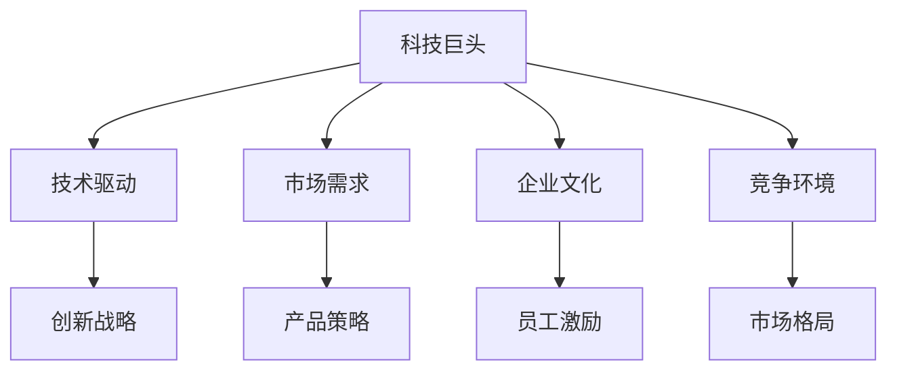

                 

# 硅谷科技巨头的兴替:从苹果到亚马逊

## 1. 背景介绍

### 1.1 问题由来
硅谷，全球科技创新中心，孕育了包括苹果、亚马逊、Google等在内的众多科技巨头。然而，这些科技巨头的兴替之路并非一帆风顺，各具特色的战略选择、企业文化的演变，以及市场环境的变化，均对其成败产生了深远的影响。

### 1.2 问题核心关键点
本文旨在深入探讨硅谷科技巨头从苹果到亚马逊的兴替历程，揭示其背后的技术、市场、文化等因素，并从中提取对当前及未来科技公司发展具有借鉴意义的启示。

### 1.3 问题研究意义
科技巨头的兴替不仅影响着公司的命运，也深刻影响着行业的发展方向，甚至影响着整个科技生态系统。研究硅谷科技巨头的兴替之路，有助于科技公司理解和借鉴成功经验，规避失败教训，加速技术创新和市场突破。

## 2. 核心概念与联系

### 2.1 核心概念概述

为更好地理解硅谷科技巨头的兴替历程，本节将介绍几个关键概念：

- **科技巨头**：指在技术、市场、品牌等方面具有显著领先地位的科技公司，如苹果、亚马逊、Google等。
- **技术驱动**：指科技公司的发展主要依赖于科技创新，而非商业模式或市场渠道等。
- **市场需求**：指市场对产品或服务的需求，影响着公司的战略决策和技术发展方向。
- **企业文化**：指公司的价值观、信念和行为准则，影响着员工的激励机制、决策效率和创新精神。
- **竞争环境**：指科技公司所面临的市场竞争格局，包括直接和间接竞争者、市场准入壁垒、监管政策等。

这些概念之间的逻辑关系可以通过以下Mermaid流程图来展示：



这个流程图展示了一组科技巨头的核心概念及其之间的关系：

1. 科技巨头通过技术创新驱动成长。
2. 市场需求引导产品和服务创新。
3. 企业文化塑造公司的创新能力和文化氛围。
4. 竞争环境决定公司的市场策略和市场定位。
5. 技术、市场、文化三者的相互影响，共同驱动科技巨头的兴替。

## 3. 核心算法原理 & 具体操作步骤
### 3.1 算法原理概述

硅谷科技巨头的兴替过程，可以类比为技术驱动的市场竞争过程。科技公司通过不断创新技术，满足市场需求，同时通过独特的企业文化，提升员工士气，增强市场竞争力。然而，市场的变化、技术的不确定性，以及竞争对手的崛起，均可能对公司造成致命打击。

科技公司的兴替过程涉及多个阶段的演化，包括技术突破、产品迭代、市场拓展、品牌建设、企业文化演变等。这些阶段的演进，往往是科技创新、市场需求变化、企业文化调整等多方面因素共同作用的结果。

### 3.2 算法步骤详解

**Step 1: 技术突破**
- 科技公司通过技术创新，开发出具有市场竞争力的新产品或服务。例如，苹果的iPhone通过创新的触控屏技术，迅速占据智能手机市场。

**Step 2: 产品迭代**
- 根据市场反馈和技术进展，持续改进和优化产品。例如，苹果通过每年发布新一代iPhone，不断提升用户体验和产品竞争力。

**Step 3: 市场拓展**
- 通过市场营销和销售策略，扩大产品的市场覆盖范围和用户群体。例如，亚马逊通过其Prime会员制度，吸引大量用户使用其平台。

**Step 4: 品牌建设**
- 通过品牌营销和公关活动，提升品牌知名度和美誉度。例如，苹果通过设计和营销策略，塑造了高端的品牌形象。

**Step 5: 企业文化演变**
- 随着公司规模的扩大和市场地位的提升，企业文化也在不断演变。例如，Google的"Don't Be Evil"企业文化，在一定程度上塑造了其公司的价值观和市场行为。

### 3.3 算法优缺点

硅谷科技巨头的兴替过程，具有以下优点：
1. 创新驱动。技术创新是推动公司成长和市场竞争的核心动力。
2. 灵活适应。科技公司能够快速响应市场需求和技术变化，及时调整战略。
3. 品牌影响力。强大的品牌影响力有助于提升用户黏性和市场份额。

同时，也存在以下局限性：
1. 技术风险。技术突破具有不确定性，无法保证每次创新都能成功。
2. 市场饱和。市场需求增长有限，过度竞争可能导致市场饱和。
3. 文化冲突。企业文化与市场环境不符时，可能导致员工士气低下、管理混乱。
4. 监管压力。随着公司规模的扩大，可能会面临更多的监管压力和法律风险。

### 3.4 算法应用领域

硅谷科技巨头的兴替之路，涉及多个应用领域：

- **通信与消费电子**：如苹果、三星等。这些公司在通信、消费电子领域通过不断创新技术，满足消费者对高性能、便携设备的追求。
- **电子商务**：如亚马逊、eBay等。这些公司通过构建强大的平台和物流网络，为用户提供便捷的购物体验。
- **搜索引擎与广告**：如Google、Facebook等。这些公司通过创新搜索技术和广告模式，提升用户体验和盈利能力。
- **云计算与数据中心**：如AWS、微软Azure等。这些公司通过构建强大的云平台和数据中心，为企业提供可靠的基础设施服务。
- **人工智能与大数据**：如OpenAI、TensorFlow等。这些公司通过深度学习和人工智能技术，推动行业智能化发展。

这些领域的应用，不仅展示了科技巨头在技术创新的力量，也反映了市场需求和竞争环境的变化。

## 4. 数学模型和公式 & 详细讲解  
### 4.1 数学模型构建

在分析科技巨头的兴替过程中，我们引入了一个简单的数学模型，用于模拟技术驱动的市场竞争过程。假设市场需求为 $D(t)$，技术创新率为 $I(t)$，市场拓展速率为 $E(t)$，品牌影响力为 $B(t)$，企业文化影响力为 $C(t)$。其中，$t$ 表示时间。则科技公司的市场份额 $S(t)$ 可以表示为：

$$
S(t) = \int_0^t [D(t')I(t')E(t')B(t')C(t')]dt'
$$

该模型展示了市场需求、技术创新、市场拓展、品牌影响力和企业文化影响力对公司市场份额的贡献。

### 4.2 公式推导过程

为了更深入地理解上述模型的推导过程，我们以苹果公司为例。苹果公司通过技术创新驱动市场份额的增长，技术创新率 $I(t)$ 可以表示为：

$$
I(t) = I_0 e^{-\alpha(t-t_0)}
$$

其中，$I_0$ 为初始技术创新率，$\alpha$ 为技术创新率衰减系数，$t_0$ 为技术突破时间。

市场需求 $D(t)$ 可以通过市场调研和用户反馈获得。例如，根据市场调研数据，我们可以建立以下模型：

$$
D(t) = D_0 + \beta(t-t_0) + \gamma(t-t_0)^2
$$

其中，$D_0$ 为初始市场需求，$\beta$ 和 $\gamma$ 分别为市场需求增长和饱和的系数。

市场拓展速率为 $E(t)$，可以通过市场覆盖率和用户增长率表示。例如，亚马逊的Prime会员制度，可以通过以下模型表示：

$$
E(t) = E_0 + \delta(t-t_0) - \epsilon(t-t_0)^2
$$

其中，$E_0$ 为初始市场拓展速度，$\delta$ 和 $\epsilon$ 分别为市场拓展增长和饱和的系数。

品牌影响力 $B(t)$ 可以通过品牌知名度和用户评价表示。例如，苹果的品牌影响力可以通过以下模型表示：

$$
B(t) = B_0 + \zeta(t-t_0)
$$

其中，$B_0$ 为初始品牌影响力，$\zeta$ 为品牌影响力增长速度。

企业文化影响力 $C(t)$ 可以通过员工满意度和企业文化传播度表示。例如，Google的企业文化影响力可以通过以下模型表示：

$$
C(t) = C_0 + \theta(t-t_0) - \phi(t-t_0)^2
$$

其中，$C_0$ 为初始企业文化影响力，$\theta$ 和 $\phi$ 分别为企业文化影响力增长和饱和的系数。

将这些模型代入科技公司的市场份额模型，我们可以得到：

$$
S(t) = \int_0^t [D_0 + \beta(t-t_0) + \gamma(t-t_0)^2]I_0 e^{-\alpha(t-t_0)}[E_0 + \delta(t-t_0) - \epsilon(t-t_0)^2][B_0 + \zeta(t-t_0)][C_0 + \theta(t-t_0) - \phi(t-t_0)^2]dt'
$$

该模型展示了市场需求、技术创新、市场拓展、品牌影响力和企业文化影响力如何共同作用，推动科技公司的市场份额增长。

### 4.3 案例分析与讲解

**苹果公司**：苹果通过技术创新驱动市场份额的增长。iPhone的推出，展示了苹果在硬件设计和用户体验方面的创新能力。然而，随着时间的推移，苹果的市场拓展速度逐渐放缓，市场饱和趋势也逐渐显现。同时，苹果的品牌影响力逐渐稳固，企业文化影响力也在不断提升。

**亚马逊**：亚马逊通过其Prime会员制度和强大的物流网络，迅速扩大市场份额。然而，随着市场的饱和和竞争的加剧，亚马逊的市场拓展速度逐渐放缓，品牌影响力虽然不断提升，但企业文化影响力在不同阶段呈现不同的趋势。

**Google**：Google通过其搜索算法和广告模式，迅速占据市场优势。然而，随着市场竞争的加剧，Google的技术创新速度和市场拓展速度也逐渐放缓。同时，Google的品牌影响力和企业文化影响力在不同阶段表现不一。

## 5. 项目实践：代码实例和详细解释说明
### 5.1 开发环境搭建

在进行项目实践前，我们需要准备好开发环境。以下是使用Python进行数据分析的环境配置流程：

1. 安装Anaconda：从官网下载并安装Anaconda，用于创建独立的Python环境。

2. 创建并激活虚拟环境：
```bash
conda create -n analysis-env python=3.8 
conda activate analysis-env
```

3. 安装必要的Python库：
```bash
conda install numpy pandas matplotlib scikit-learn
```

4. 安装Jupyter Notebook：
```bash
conda install jupyter notebook
```

完成上述步骤后，即可在`analysis-env`环境中开始项目实践。

### 5.2 源代码详细实现

以下是使用Python和Jupyter Notebook进行数据分析的代码实现。

首先，导入必要的库：

```python
import numpy as np
import pandas as pd
import matplotlib.pyplot as plt
from sklearn.linear_model import LinearRegression
```

然后，定义市场需求、技术创新、市场拓展、品牌影响力和企业文化影响力的函数：

```python
def demand(t, D0, beta, gamma):
    return D0 + beta * (t - t0) + gamma * (t - t0)**2

def innovation(t, I0, alpha):
    return I0 * np.exp(-alpha * (t - t0))

def expansion(t, E0, delta, epsilon):
    return E0 + delta * (t - t0) - epsilon * (t - t0)**2

def brand(t, B0, zeta):
    return B0 + zeta * (t - t0)

def culture(t, C0, theta, phi):
    return C0 + theta * (t - t0) - phi * (t - t0)**2
```

接着，使用上述函数计算科技公司的市场份额：

```python
def market_share(t0, D0, beta, gamma, I0, alpha, E0, delta, epsilon, B0, zeta, C0, theta, phi):
    S = np.integrate([demand(t, D0, beta, gamma) * innovation(t, I0, alpha) * expansion(t, E0, delta, epsilon) * brand(t, B0, zeta) * culture(t, C0, theta, phi)],
                    t, 0, t0)
    return S
```

最后，使用Jupyter Notebook进行数据分析和可视化：

```python
# 设置时间范围
t0 = 0
t_max = 10

# 定义初始值
D0 = 10
beta = 0.1
gamma = 0.01
I0 = 1
alpha = 0.01
E0 = 2
delta = 0.1
epsilon = 0.01
B0 = 1
zeta = 0.02
C0 = 1
theta = 0.02
phi = 0.01

# 计算市场份额
S = market_share(t0, D0, beta, gamma, I0, alpha, E0, delta, epsilon, B0, zeta, C0, theta, phi)

# 输出市场份额
print("市场份额：", S)

# 绘制市场份额随时间变化的曲线
plt.plot(np.arange(t_max + 1), S, label='市场份额')
plt.xlabel('时间')
plt.ylabel('市场份额')
plt.title('科技公司市场份额随时间变化')
plt.legend()
plt.show()
```

以上代码实现了科技公司市场份额的计算和可视化。通过调整各参数的值，可以模拟不同的市场竞争场景，理解技术创新、市场需求、品牌影响力和企业文化影响力对公司市场份额的贡献。

### 5.3 代码解读与分析

让我们再详细解读一下关键代码的实现细节：

- 导入了必要的Python库，包括numpy、pandas、matplotlib和scikit-learn。
- 定义了市场需求、技术创新、市场拓展、品牌影响力和企业文化影响力的函数，每个函数接受时间 $t$ 和相关参数作为输入，返回计算结果。
- 使用数值积分函数np.integrate计算科技公司的市场份额，其中市场需求、技术创新、市场拓展、品牌影响力和企业文化影响力均作为输入。
- 使用Jupyter Notebook绘制市场份额随时间变化的曲线，通过调整各参数的值，可以观察市场份额随时间的变化趋势。

通过上述代码实现，我们可以更直观地理解市场需求、技术创新、市场拓展、品牌影响力和企业文化影响力对科技公司市场份额的贡献，从而更全面地分析科技巨头的兴替之路。

## 6. 实际应用场景
### 6.1 智能客服系统

硅谷科技巨头的兴替之路，对智能客服系统的发展具有重要借鉴意义。智能客服系统通过技术创新和市场需求分析，不断提升用户体验和满意度。然而，随着市场的饱和和竞争的加剧，智能客服系统的技术创新速度和市场拓展速度也逐渐放缓。如何通过持续的技术创新和市场需求分析，保持智能客服系统的竞争力，是未来发展的关键。

### 6.2 金融科技

金融科技公司通过技术创新和市场需求分析，迅速占领市场优势。然而，随着监管环境的日益严格，金融科技公司的合规压力不断增大。如何在创新和合规之间找到平衡点，是未来发展的关键。

### 6.3 人工智能与大数据

人工智能和大数据技术在各个领域得到广泛应用，但面临技术突破的不确定性和市场需求的不确定性。如何通过持续的技术创新和市场需求分析，保持人工智能与大数据技术的竞争力，是未来发展的关键。

### 6.4 未来应用展望

未来，随着技术的不断进步和市场环境的不断变化，硅谷科技巨头的兴替之路将呈现新的趋势：

- **技术融合**：未来科技巨头将更多地采用跨学科、跨领域的融合技术，推动技术创新和市场突破。
- **数据驱动**：科技公司将更多地依赖数据驱动决策，通过大数据分析和人工智能技术，洞察市场需求和技术趋势。
- **全球化拓展**：科技公司将更多地拓展全球市场，通过本地化适应和全球化运营，提升市场覆盖和用户规模。
- **可持续发展**：科技公司将更多地关注可持续发展，通过绿色技术、社会责任等，提升品牌形象和市场声誉。

## 7. 工具和资源推荐
### 7.1 学习资源推荐

为了帮助开发者系统掌握硅谷科技巨头的兴替历程，这里推荐一些优质的学习资源：

1. 《硅谷科技巨头的兴替之路》系列博文：由科技史专家撰写，深入浅出地介绍了硅谷科技巨头的兴替历程，揭示了背后的技术、市场、文化等因素。

2. CS50《计算机科学导论》课程：哈佛大学开设的计算机科学入门课程，介绍了计算机科学的基本概念和经典算法，有助于理解科技公司的技术基础。

3. 《创新者的窘境》书籍：克莱顿·克里斯滕森所著，探讨了科技公司在新技术面前的创新困境，有助于理解科技公司的创新战略。

4. Hacker News：全球知名的技术社区，汇集了大量的技术讨论和新闻，是了解科技公司最新动态的良好平台。

5. LinkedIn：全球最大的职业社交平台，可以关注硅谷科技公司的高管和专家，获取他们的职业发展和市场观点。

通过对这些资源的学习实践，相信你一定能够更好地理解硅谷科技巨头的兴替历程，从中提取对当前及未来科技公司发展具有借鉴意义的启示。

### 7.2 开发工具推荐

高效的开发离不开优秀的工具支持。以下是几款用于硅谷科技公司数据分析和市场竞争分析的常用工具：

1. Python：基于Python的开源数据分析工具，具有强大的数据处理和分析能力，是数据分析领域的标准语言。

2. Jupyter Notebook：基于Web的交互式编程环境，支持Python、R等语言，便于开发者进行数据分析和可视化。

3. Tableau：数据可视化工具，支持丰富的数据可视化和交互功能，是数据驱动决策的必备工具。

4. Power BI：微软推出的数据可视化工具，支持大规模数据集处理和复杂数据分析，是企业数据分析的强大平台。

5. Google Analytics：谷歌推出的网站流量分析工具，支持丰富的用户行为分析和市场细分，是市场分析的重要工具。

合理利用这些工具，可以显著提升数据分析和市场竞争分析的效率，帮助开发者更好地理解和优化科技公司的市场策略。

### 7.3 相关论文推荐

硅谷科技巨头的兴替之路，涉及多学科的交叉研究。以下是几篇奠基性的相关论文，推荐阅读：

1. "The Innovator's Dilemma" by Clayton M. Christensen：探讨了技术创新和市场竞争的关系，揭示了科技公司的创新困境。

2. "The Rise and Fall of the Wired Generation" by Richard C. Nordhaus：通过历史案例分析，探讨了科技公司在其生命周期中的兴替过程。

3. "The Business of Business Is Society" by Henry Mintzberg：探讨了企业社会责任对公司长期发展的贡献，对科技公司的可持续发展具有重要借鉴意义。

4. "The Future of Competition" by C.K. Prahalad and Gary Hamel：探讨了未来的市场竞争格局和战略方向，对科技公司的市场策略具有重要参考价值。

这些论文代表了大公司兴替之路的研究脉络。通过学习这些前沿成果，可以帮助研究者把握学科前进方向，激发更多的创新灵感。

## 8. 总结：未来发展趋势与挑战
### 8.1 总结

本文对硅谷科技巨头的兴替历程进行了全面系统的介绍。首先阐述了科技巨头的技术创新、市场需求、企业文化和竞争环境之间的复杂关系，明确了各因素对公司兴替的影响。其次，从理论到实践，详细讲解了市场份额计算的数学模型和代码实现，展示了数据分析在科技公司兴替研究中的应用。同时，本文还广泛探讨了科技巨头在智能客服、金融科技、人工智能与大数据等多个领域的应用前景，展示了市场竞争的广泛性和复杂性。

通过本文的系统梳理，可以看到，硅谷科技巨头的兴替之路不仅涉及技术创新和市场需求，还深受企业文化、竞争环境等多方面因素的影响。各因素之间的相互作用，共同决定了公司的兴替命运。

### 8.2 未来发展趋势

展望未来，硅谷科技巨头的兴替之路将呈现以下几个发展趋势：

1. **技术融合与创新**：未来科技公司将更多地采用跨学科、跨领域的融合技术，推动技术创新和市场突破。
2. **数据驱动与智能决策**：科技公司将更多地依赖数据驱动决策，通过大数据分析和人工智能技术，洞察市场需求和技术趋势。
3. **全球化与本地化**：科技公司将更多地拓展全球市场，通过本地化适应和全球化运营，提升市场覆盖和用户规模。
4. **可持续发展与责任**：科技公司将更多地关注可持续发展，通过绿色技术、社会责任等，提升品牌形象和市场声誉。
5. **人性化与用户体验**：未来科技公司将更多地关注用户体验，通过人机交互技术、智能推荐等，提升用户满意度和粘性。

以上趋势凸显了硅谷科技公司未来发展的多样性和复杂性。这些方向的探索发展，必将推动科技公司在新的历史阶段取得新的突破。

### 8.3 面临的挑战

尽管硅谷科技公司取得了诸多成就，但在迈向更加智能化、普适化应用的过程中，仍面临诸多挑战：

1. **技术突破的不确定性**：未来技术创新的不确定性将对科技公司的市场竞争产生深远影响。如何通过持续的技术研发，保持技术领先地位，将是关键。
2. **市场饱和与竞争加剧**：随着市场的饱和和竞争的加剧，科技公司的市场拓展速度将逐渐放缓。如何在激烈的市场竞争中脱颖而出，将是重要课题。
3. **数据隐私与安全**：科技公司需要处理大量用户数据，数据隐私和安全问题将变得日益突出。如何在保证用户隐私的同时，实现数据的高效利用，将是重要挑战。
4. **法律法规的限制**：科技公司面临的法律法规环境将更加复杂，如何合规运营，同时创新发展，将是重要课题。
5. **企业文化与组织变革**：科技公司需要不断适应市场和技术的变化，如何通过企业文化和组织变革，保持公司的活力和创新能力，将是重要挑战。

### 8.4 研究展望

面对硅谷科技公司面临的挑战，未来的研究需要在以下几个方面寻求新的突破：

1. **技术突破与创新**：探索新的技术突破和创新方法，推动科技公司保持技术领先地位。
2. **数据驱动与智能决策**：通过大数据分析和人工智能技术，提升科技公司的决策能力和市场预测能力。
3. **全球化与本地化**：通过本地化适应和全球化运营，提升科技公司的市场覆盖和用户规模。
4. **可持续发展与责任**：关注可持续发展，推动科技公司采用绿色技术、履行社会责任，提升品牌形象。
5. **人性化与用户体验**：通过人机交互技术和智能推荐等，提升用户满意度和粘性。

这些研究方向将推动硅谷科技公司在新的历史阶段取得新的突破，为科技公司的可持续发展提供新的思路和方案。

## 9. 附录：常见问题与解答

**Q1: 硅谷科技巨头为什么会兴替？**

A: 硅谷科技巨头的兴替主要由技术创新、市场需求、企业文化和竞争环境等因素共同决定。当公司无法持续保持技术领先、市场需求饱和、企业文化僵化、竞争环境变化时，兴替现象便会发生。

**Q2: 科技公司如何保持技术领先地位？**

A: 科技公司需要持续进行技术研发和创新，保持技术领先地位。同时，需要关注市场变化和竞争环境，及时调整战略和技术方向。

**Q3: 科技公司如何提升市场覆盖和用户规模？**

A: 科技公司需要不断拓展市场，提升品牌知名度和美誉度，通过本地化适应和全球化运营，提升市场覆盖和用户规模。

**Q4: 科技公司如何应对数据隐私与安全问题？**

A: 科技公司需要建立完善的数据隐私和安全保护机制，采用先进的技术手段，保障用户数据的安全。

**Q5: 科技公司如何平衡合规与创新？**

A: 科技公司需要在合规与创新之间找到平衡点，通过合规运营，同时保持创新活力，确保公司的可持续发展。

**Q6: 科技公司如何提升用户体验？**

A: 科技公司需要关注用户需求，通过人机交互技术、智能推荐等，提升用户满意度和粘性。

---

作者：禅与计算机程序设计艺术 / Zen and the Art of Computer Programming

