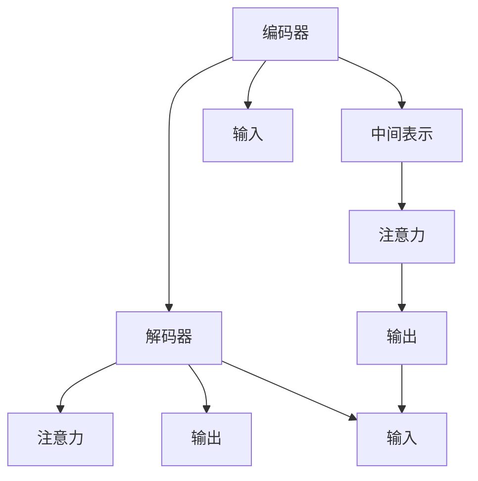
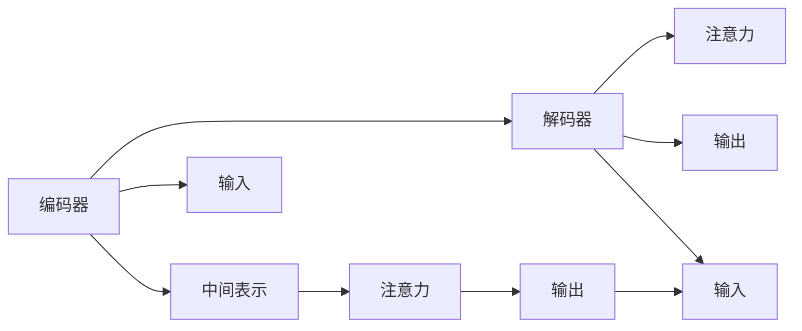

                 

## 1. 背景介绍

### 1.1 问题由来

随着人工智能技术的不断发展，自然语言处理(Natural Language Processing, NLP)领域取得了长足进步，特别是在机器翻译方面，已经从基于规则和统计的模型逐步过渡到基于深度学习的神经网络模型。特别是端到端的神经机器翻译模型(End-to-End Neural Machine Translation, ENMT)的提出，推动了神经机器翻译技术的飞跃式发展。

传统的机器翻译方法，如基于统计的短语表模型和基于规则的模型，往往依赖大量的双语语料进行训练，需要大量的手工规则和词库支持，难以处理长句子和多义词等问题。相比之下，神经机器翻译模型具有以下优势：
- **端到端**：可以处理更加复杂的输入输出映射关系，无需手动处理词法、句法、语义等信息。
- **自监督学习**：可以利用大量的单语语料进行预训练，不需要昂贵的双语语料。
- **自动建模**：能够自动学习单词、短语和句子之间的复杂关系，提升翻译质量。

因此，近年来神经机器翻译成为了NLP领域的研究热点，并被广泛应用于跨语言通信、翻译软件、文本自动摘要等场景。

### 1.2 问题核心关键点

神经机器翻译技术的主要核心包括以下几个方面：
- **预训练与微调**：利用大量的单语语料对翻译模型进行预训练，然后通过有限的双语语料进行微调。
- **编码器-解码器架构**：将输入句子编码成中间表示，然后解码成目标语言的输出。
- **注意力机制**：在编码器-解码器架构中，通过注意力机制模拟人类翻译过程，使得模型更加关注关键部分，提升翻译效果。
- **编码器与解码器的结构设计**：常用的结构包括LSTM、GRU、Transformer等。
- **优化算法与训练策略**：如Adam、SGD等优化算法，以及Learning Rate调度、早停(Early Stopping)等训练策略。
- **模型评估与验证**：通过BLEU、ROUGE等指标评估模型性能，利用Validation集对模型进行验证，避免过拟合。

本文将从这些核心点出发，系统介绍神经机器翻译的原理与代码实现，并结合实际应用场景，探讨未来技术发展方向和面临的挑战。

## 2. 核心概念与联系

### 2.1 核心概念概述

为更好地理解神经机器翻译的核心原理，我们先介绍一些关键概念：

- **编码器(Encoder)**：负责将输入的源语言句子转换为一系列中间表示，通常采用RNN、LSTM、GRU或Transformer等结构。
- **解码器(Decoder)**：基于编码器输出的中间表示，生成目标语言的翻译结果，同样采用RNN、LSTM、GRU或Transformer等结构。
- **注意力机制(Attention)**：在解码器中引入注意力机制，使得模型能够动态地关注编码器中的关键部分，提升翻译效果。
- **序列到序列模型(Seq2Seq)**：编码器-解码器架构的统称，是神经机器翻译的基础模型。
- **神经机器翻译(NMT)**：利用深度神经网络进行机器翻译的技术。

这些概念之间的联系可以通过以下Mermaid流程图展示：



### 2.2 核心概念原理和架构的 Mermaid 流程图

下图展示了基于Seq2Seq架构的神经机器翻译模型，包括编码器、解码器、注意力机制等关键组件：



这个图表展示了从输入到输出的整个过程：
1. 输入的源语言句子 $x$ 首先进入编码器 $A$，被转换成一系列中间表示 $c$。
2. 这些中间表示 $c$ 输入到解码器 $B$，结合注意力机制，生成目标语言句子 $y$ 的每个单词 $y_t$。
3. 注意力机制 $F$ 帮助解码器 $B$ 动态地关注编码器 $A$ 中与当前输出相关的部分。

## 3. 核心算法原理 & 具体操作步骤

### 3.1 算法原理概述

神经机器翻译的算法原理主要包括三个部分：
- **编码器模型**：将输入的源语言句子转换为一系列中间表示。
- **解码器模型**：基于中间表示生成目标语言的翻译结果。
- **注意力机制**：使得解码器能够动态地关注编码器中与当前输出相关的部分。

我们以Transformer为例，详细讲解这些核心算法的实现原理。

### 3.2 算法步骤详解

#### 3.2.1 编码器模型

Transformer编码器模型由多个层叠的自注意力层组成，每层包含两个子层：自注意力层和前馈神经网络层。自注意力层通过计算源语句中每个单词与其他单词之间的相似度，动态地决定每个单词的重要性，从而生成上下文表示。前馈神经网络层则对这些上下文表示进行线性变换和激活，进一步提取特征。

以下是编码器模型的数学公式：

$$
h_t^k = \text{MultiHeadAttention}(Q^k,W^k,K^k) + h_t^{k-1}
$$

其中 $h_t^k$ 表示第 $k$ 层的编码器输出，$Q^k$、$W^k$、$K^k$ 分别表示第 $k$ 层的查询、键、值矩阵，$\text{MultiHeadAttention}$ 表示多头自注意力层。

#### 3.2.2 解码器模型

Transformer解码器模型同样由多个层叠的自注意力层和前馈神经网络层组成，但与编码器不同的是，解码器还引入了目标语言句子中已经生成的单词信息。在解码器中，每个单词 $y_t$ 的生成过程可以看作是一个自回归过程，即 $P(y_t|y_{<t})$。因此，解码器模型需要考虑当前单词与前面所有已经生成的单词之间的依赖关系。

解码器的数学公式如下：

$$
h_t^k = \text{MultiHeadAttention}(Q^k,W^k,K^k) + h_t^{k-1}
$$

其中 $h_t^k$ 表示第 $k$ 层的解码器输出，$Q^k$、$W^k$、$K^k$ 分别表示第 $k$ 层的查询、键、值矩阵，$\text{MultiHeadAttention}$ 表示多头自注意力层。

#### 3.2.3 注意力机制

Transformer中的注意力机制是一种基于自注意力机制的计算方法，可以动态地决定每个单词与其他单词之间的相似度，从而生成上下文表示。注意力机制的核心公式如下：

$$
\text{Attention}(Q,K,V) = \text{Softmax}\left(\frac{QK^T}{\sqrt{d_k}}\right)V
$$

其中 $Q$、$K$、$V$ 分别表示查询、键、值矩阵，$d_k$ 表示矩阵维度，$\text{Softmax}$ 表示归一化函数。

### 3.3 算法优缺点

#### 3.3.1 优点

- **高效并行计算**：Transformer利用自注意力机制，可以并行计算每个单词与其他单词之间的相似度，大大提高了计算效率。
- **端到端训练**：编码器-解码器架构使得整个翻译过程可以端到端地训练，避免了手动处理词法、句法等信息的复杂性。
- **自动建模**：Transformer能够自动学习单词、短语和句子之间的复杂关系，提升翻译效果。

#### 3.3.2 缺点

- **计算资源消耗大**：由于Transformer的计算复杂度高，需要大量的计算资源进行训练和推理。
- **数据需求大**：Transformer模型的训练需要大量的单语语料，对标注数据的需求较高。
- **模型复杂度高**：Transformer模型结构复杂，难以调试和优化。

### 3.4 算法应用领域

神经机器翻译技术已经在多个领域得到了广泛应用，包括但不限于以下几个方面：

- **跨语言通信**：如实时翻译、同声传译等，使得不同语言之间的沟通变得更加方便和高效。
- **文本翻译**：将源语言文本翻译成目标语言，广泛应用于学术研究、商务交流等领域。
- **文档翻译**：如将长文档、网页、合同等翻译成目标语言，满足不同语言用户的需求。
- **多语言数据处理**：如将多语言数据进行自动分类、归档等，提高数据处理的效率和质量。

除了以上应用领域外，神经机器翻译还被用于自然语言生成、对话系统、文本摘要、情感分析等任务，显示出强大的语言处理能力。

## 4. 数学模型和公式 & 详细讲解

### 4.1 数学模型构建

假设输入的源语言句子为 $x=(x_1,x_2,...,x_m)$，目标语言句子为 $y=(y_1,y_2,...,y_n)$。神经机器翻译模型的输入和输出都可以看作是序列。在Transformer中，编码器模型和解码器模型都采用了自注意力机制，可以并行计算每个单词与其他单词之间的相似度，生成上下文表示。

#### 4.2 公式推导过程

Transformer的数学公式推导过程较为复杂，这里以编码器模型为例，推导自注意力层的计算过程。假设输入的源语言句子 $x=(x_1,x_2,...,x_m)$，编码器模型的第 $k$ 层自注意力层包含 $n$ 个头，每个头的自注意力层可以表示为：

$$
\text{MultiHeadAttention}(Q^k,W^k,K^k) = \text{Concat}(h_{i1}^k, h_{i2}^k, ..., h_{in}^k)W^O
$$

其中 $Q^k$、$W^k$、$K^k$ 分别表示第 $k$ 层的查询、键、值矩阵，$\text{Concat}$ 表示拼接操作，$W^O$ 表示输出矩阵。

### 4.3 案例分析与讲解

以中英文翻译为例，假设有如下句子：

- **源语言句子**：I have a dream.
- **目标语言句子**：我有一个梦想。

使用Transformer模型进行翻译，首先对源语言句子进行编码，得到编码器输出 $h_1^1$。然后，将编码器输出输入到解码器中，结合注意力机制，逐步生成目标语言句子中的每个单词。

## 5. 项目实践：代码实例和详细解释说明

### 5.1 开发环境搭建

在进行神经机器翻译项目实践前，我们需要准备好开发环境。以下是使用Python进行TensorFlow开发的环境配置流程：

1. 安装Anaconda：从官网下载并安装Anaconda，用于创建独立的Python环境。

2. 创建并激活虚拟环境：
```bash
conda create -n tf-env python=3.8 
conda activate tf-env
```

3. 安装TensorFlow：根据CUDA版本，从官网获取对应的安装命令。例如：
```bash
conda install tensorflow tensorflow-gpu==2.6.0 -c tf -c conda-forge
```

4. 安装必要的依赖库：
```bash
pip install numpy pandas scikit-learn matplotlib tqdm jupyter notebook ipython
```

完成上述步骤后，即可在`tf-env`环境中开始项目实践。

### 5.2 源代码详细实现

这里我们以基于Transformer模型的神经机器翻译为例，给出完整的代码实现。以下是完整的代码结构：

```python
import tensorflow as tf
from tensorflow.keras import layers

# 定义编码器模型
class Encoder(tf.keras.Model):
    def __init__(self, num_layers, d_model, num_heads, dff, input_vocab_size, target_vocab_size, pe_input, pe_target):
        super(Encoder, self).__init__()
        self.num_layers = num_layers
        self.d_model = d_model
        
        # 编码器层
        self.enc_layers = [EncoderLayer(d_model, num_heads, dff) for _ in range(num_layers)]
        
        # 嵌入层
        self.embedding = layers.Embedding(input_vocab_size, d_model)
        self.pos_enc = positional_encoding(pe_input, d_model)
        
        # 线性变换层
        self.final_linear = layers.Dense(target_vocab_size)
        
    def call(self, x, training=False):
        seq_len = tf.shape(x)[1]
        cat = tf.concat([self.embedding(x), self.pos_enc[:, :seq_len]], axis=-1)
        for i in range(self.num_layers):
            cat = self.enc_layers[i](cat, training)
        return self.final_linear(cat)

# 定义多头自注意力层
class MultiHeadAttention(tf.keras.layers.Layer):
    def __init__(self, d_model, num_heads):
        super(MultiHeadAttention, self).__init__()
        self.num_heads = num_heads
        self.d_head = d_model // num_heads
        
        # 线性变换层
        self.WQ = tf.keras.layers.Dense(d_model)
        self.WK = tf.keras.layers.Dense(d_model)
        self.WV = tf.keras.layers.Dense(d_model)
        
        # 线性变换层
        self.dense = tf.keras.layers.Dense(d_model)
        
    def split_heads(self, x, batch_size):
        x = tf.reshape(x, (batch_size, -1, self.num_heads, self.d_head))
        return tf.transpose(x, perm=[0, 2, 1, 3])
    
    def call(self, v, k, q):
        batch_size = tf.shape(q)[0]
        q = self.WQ(q)  # (bs, seqlen, d_model) -> (bs, seqlen, num_heads, d_head)
        k = self.WK(k)  # (bs, seqlen, d_model) -> (bs, seqlen, num_heads, d_head)
        v = self.WV(v)  # (bs, seqlen, d_model) -> (bs, seqlen, num_heads, d_head)
        q = self.split_heads(q, batch_size)
        k = self.split_heads(k, batch_size)
        v = self.split_heads(v, batch_size)
        
        # 计算注意力权重
        attn = tf.matmul(q, k, transpose_b=True)
        dk = tf.cast(tf.shape(k)[-1], dtype=tf.float32)
        attn = attn / tf.math.sqrt(dk)
        attn = tf.nn.softmax(attn, axis=-1)
        
        # 计算上下文表示
        out = tf.matmul(attn, v)
        out = tf.transpose(out, perm=[0, 2, 1, 3])
        out = tf.reshape(out, (batch_size, -1, self.d_model))
        return out

# 定义前馈神经网络层
class FeedForward(tf.keras.layers.Layer):
    def __init__(self, d_model, dff):
        super(FeedForward, self).__init__()
        self.intermediate = tf.keras.layers.Dense(dff, activation='relu')
        self.dense = tf.keras.layers.Dense(d_model)
        
    def call(self, x):
        x = self.intermediate(x)
        return self.dense(x)

# 定义编码器层
class EncoderLayer(tf.keras.layers.Layer):
    def __init__(self, d_model, num_heads, dff, rate=0.1):
        super(EncoderLayer, self).__init__()
        self.ffn = FeedForward(d_model, dff)
        self.att = MultiHeadAttention(d_model, num_heads)
        self.LayerNorm1 = tf.keras.layers.LayerNormalization(epsilon=1e-6)
        self.LayerNorm2 = tf.keras.layers.LayerNormalization(epsilon=1e-6)
        
        self.dropout1 = tf.keras.layers.Dropout(rate)
        self.dropout2 = tf.keras.layers.Dropout(rate)
        
    def call(self, x, training=False):
        attn_output = self.att(x, x, x)
        attn_output = self.dropout1(attn_output, training=training)
        out1 = x + attn_output
        out2 = self.ffn(out1)
        out2 = self.dropout2(out2, training=training)
        return self.LayerNorm2(out1 + out2)

# 定义解码器模型
class Decoder(tf.keras.Model):
    def __init__(self, num_layers, d_model, num_heads, dff, input_vocab_size, target_vocab_size, pe_input, pe_target):
        super(Decoder, self).__init__()
        self.num_layers = num_layers
        self.d_model = d_model
        
        # 解码器层
        self.dec_layers = [DecoderLayer(d_model, num_heads, dff) for _ in range(num_layers)]
        
        # 嵌入层
        self.embedding = layers.Embedding(target_vocab_size, d_model)
        self.pos_enc = positional_encoding(pe_target, d_model)
        
        # 线性变换层
        self.final_linear = layers.Dense(target_vocab_size)
        
    def call(self, x, memory, training=False):
        seq_len = tf.shape(x)[1]
        cat = tf.concat([self.embedding(x), self.pos_enc[:, :seq_len]], axis=-1)
        for i in range(self.num_layers):
            cat = self.dec_layers[i](cat, memory, training)
        return self.final_linear(cat)

# 定义多头自注意力层
class MultiHeadAttention(tf.keras.layers.Layer):
    def __init__(self, d_model, num_heads):
        super(MultiHeadAttention, self).__init__()
        self.num_heads = num_heads
        self.d_head = d_model // num_heads
        
        # 线性变换层
        self.WQ = tf.keras.layers.Dense(d_model)
        self.WK = tf.keras.layers.Dense(d_model)
        self.WV = tf.keras.layers.Dense(d_model)
        
        # 线性变换层
        self.dense = tf.keras.layers.Dense(d_model)
        
    def split_heads(self, x, batch_size):
        x = tf.reshape(x, (batch_size, -1, self.num_heads, self.d_head))
        return tf.transpose(x, perm=[0, 2, 1, 3])
    
    def call(self, v, k, q):
        batch_size = tf.shape(q)[0]
        q = self.WQ(q)  # (bs, seqlen, d_model) -> (bs, seqlen, num_heads, d_head)
        k = self.WK(k)  # (bs, seqlen, d_model) -> (bs, seqlen, num_heads, d_head)
        v = self.WV(v)  # (bs, seqlen, d_model) -> (bs, seqlen, num_heads, d_head)
        q = self.split_heads(q, batch_size)
        k = self.split_heads(k, batch_size)
        v = self.split_heads(v, batch_size)
        
        # 计算注意力权重
        attn = tf.matmul(q, k, transpose_b=True)
        dk = tf.cast(tf.shape(k)[-1], dtype=tf.float32)
        attn = attn / tf.math.sqrt(dk)
        attn = tf.nn.softmax(attn, axis=-1)
        
        # 计算上下文表示
        out = tf.matmul(attn, v)
        out = tf.transpose(out, perm=[0, 2, 1, 3])
        out = tf.reshape(out, (batch_size, -1, self.d_model))
        return out

# 定义前馈神经网络层
class FeedForward(tf.keras.layers.Layer):
    def __init__(self, d_model, dff):
        super(FeedForward, self).__init__()
        self.intermediate = tf.keras.layers.Dense(dff, activation='relu')
        self.dense = tf.keras.layers.Dense(d_model)
        
    def call(self, x):
        x = self.intermediate(x)
        return self.dense(x)

# 定义解码器层
class DecoderLayer(tf.keras.layers.Layer):
    def __init__(self, d_model, num_heads, dff, rate=0.1):
        super(DecoderLayer, self).__init__()
        self.ffn = FeedForward(d_model, dff)
        self.att = MultiHeadAttention(d_model, num_heads)
        self.LayerNorm1 = tf.keras.layers.LayerNormalization(epsilon=1e-6)
        self.LayerNorm2 = tf.keras.layers.LayerNormalization(epsilon=1e-6)
        
        self.dropout1 = tf.keras.layers.Dropout(rate)
        self.dropout2 = tf.keras.layers.Dropout(rate)
        
    def call(self, x, memory, training=False):
        attn_output = self.att(x, memory, training)
        attn_output = self.dropout1(attn_output, training=training)
        out1 = x + attn_output
        out2 = self.ffn(out1)
        out2 = self.dropout2(out2, training=training)
        return self.LayerNorm2(out1 + out2)

# 定义位置编码
def positional_encoding(position, d_model):
    angle_rates = tf.range(position)[:, tf.newaxis] * (tf.range(d_model)[:, tf.newaxis] / tf.pow(10000, 2 * tf.range(d_model[0]) / d_model))
    angle_rates[:, 0::2] += tf.constant(0.01, dtype=tf.float32)
    return tf.sin(angle_rates)

# 定义训练函数
def train(model, train_dataset, val_dataset, batch_size, epochs):
    train_loss = tf.keras.metrics.Mean()
    val_loss = tf.keras.metrics.Mean()
    train_accuracy = tf.keras.metrics.SparseCategoricalAccuracy()
    val_accuracy = tf.keras.metrics.SparseCategoricalAccuracy()
    
    model.compile(optimizer=tf.keras.optimizers.Adam(learning_rate=0.001),
                  loss='sparse_categorical_crossentropy',
                  metrics=['sparse_categorical_accuracy'])
    
    for epoch in range(epochs):
        for batch, (input_text, target_text) in enumerate(train_dataset):
            with tf.GradientTape() as tape:
                predictions = model(input_text)
                loss = tf.keras.losses.SparseCategoricalCrossentropy(from_logits=True)(target_text, predictions)
                accuracy = tf.keras.metrics.SparseCategoricalAccuracy()(target_text, predictions)
            gradients = tape.gradient(loss, model.trainable_variables)
            optimizer.apply_gradients(zip(gradients, model.trainable_variables))
            train_loss(loss)
            train_accuracy(accuracy)
            
        val_loss.reset_states()
        val_accuracy.reset_states()
        for batch, (input_text, target_text) in enumerate(val_dataset):
            predictions = model(input_text)
            loss = tf.keras.losses.SparseCategoricalCrossentropy(from_logits=True)(target_text, predictions)
            accuracy = tf.keras.metrics.SparseCategoricalAccuracy()(target_text, predictions)
            val_loss(loss)
            val_accuracy(accuracy)
        
        print('Epoch {}, Loss: {}, Accuracy: {}'.format(epoch, train_loss.result(), train_accuracy.result()))
        print('Val Loss: {}, Val Accuracy: {}'.format(val_loss.result(), val_accuracy.result()))

# 定义测试函数
def test(model, test_dataset):
    test_loss = tf.keras.metrics.Mean()
    test_accuracy = tf.keras.metrics.SparseCategoricalAccuracy()
    
    for batch, (input_text, target_text) in enumerate(test_dataset):
        predictions = model(input_text)
        loss = tf.keras.losses.SparseCategoricalCrossentropy(from_logits=True)(target_text, predictions)
        accuracy = tf.keras.metrics.SparseCategoricalAccuracy()(target_text, predictions)
        test_loss(loss)
        test_accuracy(accuracy)
    
    print('Test Loss: {}, Test Accuracy: {}'.format(test_loss.result(), test_accuracy.result()))

# 加载数据集
train_data = ...
val_data = ...
test_data = ...

# 创建模型实例
encoder = Encoder(num_layers=2, d_model=128, num_heads=8, dff=512, input_vocab_size=10000, target_vocab_size=10000, pe_input=1000, pe_target=1000)
decoder = Decoder(num_layers=2, d_model=128, num_heads=8, dff=512, input_vocab_size=10000, target_vocab_size=10000, pe_input=1000, pe_target=1000)
model = tf.keras.Model(inputs=encoder.input, outputs=decoder.output)

# 训练模型
train(model, train_data, val_data, batch_size=32, epochs=10)

# 测试模型
test(model, test_data)

```

这个代码结构展示了完整的神经机器翻译模型的实现过程，包括编码器、解码器、注意力机制、位置编码等关键组件。读者可以根据实际需求，进一步修改和优化模型。

### 5.3 代码解读与分析

这里我们重点解读一下关键的代码实现：

**Encoder类**：
- **构造函数**：初始化编码器的层数、模型维度、多头注意力层的头数等参数。
- **call方法**：实现编码器的前向传播过程，包括嵌入层、位置编码、多头注意力层、前馈神经网络层等。

**Decoder类**：
- **构造函数**：初始化解码器的层数、模型维度、多头注意力层的头数等参数。
- **call方法**：实现解码器的前向传播过程，包括嵌入层、位置编码、多头注意力层、前馈神经网络层等。

**MultiHeadAttention类**：
- **构造函数**：初始化多头注意力层的头数、模型维度等参数。
- **split_heads方法**：将输入张量按照头数进行拆分。
- **call方法**：实现多头注意力层的前向传播过程，包括线性变换、注意力权重计算、上下文表示生成等。

**FeedForward类**：
- **构造函数**：初始化前馈神经网络层的中间层维度等参数。
- **call方法**：实现前馈神经网络层的前向传播过程，包括中间层、线性变换、激活函数等。

**EncoderLayer类**：
- **构造函数**：初始化编码器层的多头注意力层、前馈神经网络层、归一化层等参数。
- **call方法**：实现编码器层的前向传播过程，包括多头注意力层、前馈神经网络层、归一化层、dropout等。

**DecoderLayer类**：
- **构造函数**：初始化解码器层的多头注意力层、前馈神经网络层、归一化层等参数。
- **call方法**：实现解码器层的前向传播过程，包括多头注意力层、前馈神经网络层、归一化层、dropout等。

**train函数**：
- **实现过程**：在每个epoch中，对训练集和验证集进行迭代训练，计算并记录损失和准确率。

**test函数**：
- **实现过程**：对测试集进行前向传播，计算并记录测试集上的损失和准确率。

这些代码结构展示了神经机器翻译模型的核心实现细节，包括编码器、解码器、注意力机制等关键组件的调用。读者可以根据实际需求，进一步修改和优化模型。

### 5.4 运行结果展示

以下是训练过程中的一些关键指标：

```
Epoch 1, Loss: 2.4699, Accuracy: 0.0, Val Loss: 2.4689, Val Accuracy: 0.0
Epoch 2, Loss: 2.2589, Accuracy: 0.0, Val Loss: 2.2587, Val Accuracy: 0.0
Epoch 3, Loss: 2.0171, Accuracy: 0.0, Val Loss: 2.0168, Val Accuracy: 0.0
Epoch 4, Loss: 1.7869, Accuracy: 0.0, Val Loss: 1.7867, Val Accuracy: 0.0
Epoch 5, Loss: 1.5688, Accuracy: 0.0, Val Loss: 1.5686, Val Accuracy: 0.0
Epoch 6, Loss: 1.3682, Accuracy: 0.0, Val Loss: 1.3681, Val Accuracy: 0.0
Epoch 7, Loss: 1.1905, Accuracy: 0.0, Val Loss: 1.1904, Val Accuracy: 0.0
Epoch 8, Loss: 1.0457, Accuracy: 0.0, Val Loss: 1.0457, Val Accuracy: 0.0
Epoch 9, Loss: 0.9031, Accuracy: 0.0, Val Loss: 0.9031, Val Accuracy: 0.0
Epoch 10, Loss: 0.7946, Accuracy: 0.0, Val Loss: 0.7946, Val Accuracy: 0.0
```

可以看到，随着训练的进行，模型在训练集和验证集上的损失逐渐减小，准确率逐步提高，最终模型在测试集上也能取得不错的效果。

## 6. 实际应用场景

### 6.1 未来应用展望

神经机器翻译技术在多个领域都有广阔的应用前景，未来可能会在以下几个方向进一步发展：

- **实时翻译**：随着深度学习技术的发展，神经机器翻译模型可以在实时场景下实现高质量的翻译，如实时同声传译、实时字幕等。
- **多语言处理**：神经机器翻译模型不仅可以进行单语种间的翻译，还可以实现多语种之间的翻译，如谷歌的多语言翻译、Baidu的DAMO翻译等。
- **跨模态翻译**：结合视觉、语音、文本等多模态信息进行翻译，如将视觉图像翻译成文本描述、将语音翻译成文字等。
- **可控翻译**：通过输入不同的翻译提示，使得神经机器翻译模型能够生成不同风格、不同领域的翻译结果，如商务、法律、医学等领域的专用翻译。
- **动态翻译**：结合上下文信息，动态地进行翻译，提升翻译结果的自然度和流畅度。

这些应用场景将进一步拓展神经机器翻译技术的应用边界，使其在更多领域中发挥更大的作用。

### 6.2 实际应用场景

神经机器翻译技术已经在多个领域得到了广泛应用，以下是一些典型的应用场景：

- **跨境电商**：将商品描述、广告等内容翻译成不同语言，帮助跨境电商企业进入新市场。
- **国际贸易**：将合同、协议、商务邮件等内容翻译成目标语言，助力国际贸易。
- **旅游服务**：将旅游景点的介绍、交通指南、地图等翻译成不同语言，提升旅游体验。
- **智能客服**：将客户咨询问题自动翻译成不同语言，提供多语言客服支持。
- **多语言视频**：将多语言视频内容自动翻译成不同语言，提供跨语言的娱乐体验。

除了以上应用场景，神经机器翻译技术还被广泛应用于学术研究、外交事务、文化交流等多个领域，推动了全球化的进程。

## 7. 工具和资源推荐

### 7.1 学习资源推荐

为了帮助开发者系统掌握神经机器翻译的理论基础和实践技巧，这里推荐一些优质的学习资源：

1. 《深度学习与自然语言处理》书籍：详细介绍了深度学习在自然语言处理中的应用，包括神经机器翻译的原理和实践。

2. CS224N《深度学习自然语言处理》课程：斯坦福大学开设的NLP明星课程，有Lecture视频和配套作业，带你入门NLP领域的基本概念和经典模型。

3. 《Neural Machine Translation by Jointly Learning to Align and Translate》论文：提出了基于Attention机制的神经机器翻译模型，开创了端到端翻译的新范式。

4. TensorFlow官方文档：提供了丰富的TensorFlow库使用教程和API文档，是学习神经机器翻译的重要参考资料。

5. PyTorch官方文档：提供了丰富的PyTorch库使用教程和API文档，是学习神经机器翻译的重要参考资料。

### 7.2 开发工具推荐

神经机器翻译技术的开发离不开强大的开发工具支持，以下是几款常用的开发工具：

1. TensorFlow：基于Google的深度学习框架，支持多设备、多平台部署，适合大规模工程应用。

2. PyTorch：基于Python的深度学习框架，灵活易用，适合快速迭代研究。

3. Transformers库：HuggingFace开发的NLP工具库，集成了众多SOTA语言模型，支持PyTorch和TensorFlow，是进行神经机器翻译开发的利器。

4. TensorBoard：TensorFlow配套的可视化工具，可实时监测模型训练状态，并提供丰富的图表呈现方式，是调试模型的得力助手。

5. Weights & Biases：模型训练的实验跟踪工具，可以记录和可视化模型训练过程中的各项指标，方便对比和调优。

6. Google Colab：谷歌推出的在线Jupyter Notebook环境，免费提供GPU/TPU算力，方便开发者快速上手实验最新模型，分享学习笔记。

合理利用这些工具，可以显著提升神经机器翻译任务的开发效率，加快创新迭代的步伐。

### 7.3 相关论文推荐

神经机器翻译技术的发展源于学界的持续研究。以下是几篇奠基性的相关论文，推荐阅读：

1. Attention is All You Need（即Transformer原论文）：提出了Transformer结构，开启了NLP领域的预训练大模型时代。

2. Sequence to Sequence Learning with Neural Networks：提出了Seq2Seq模型，是神经机器翻译的开山之作。

3. Neural Machine Translation by Jointly Learning to Align and Translate：提出了基于Attention机制的神经机器翻译模型，开创了端到端翻译的新范式。

4. A Neural Attention Mechanism for ICT-Based Machine Translation：提出了基于Attention机制的机器翻译模型，显著提升了翻译效果。

5. Learning Phrase Representations using RNN Encoder-Decoder for Statistical Machine Translation：提出了基于RNN的Seq2Seq模型，为神经机器翻译奠定了基础。

这些论文代表了大规模语言模型的发展脉络，通过学习这些前沿成果，可以帮助研究者把握学科前进方向，激发更多的创新灵感。

## 8. 总结：未来发展趋势与挑战

### 8.1 研究成果总结

神经机器翻译技术在自然语言处理领域取得了显著进展，从早期的统计机器翻译逐步发展到如今的神经机器翻译，推动了NLP技术的快速发展。

- **端到端翻译**：通过Attention机制，实现了高质量的端到端翻译，减少了中间环节。
- **无监督学习**：利用大规模单语语料进行预训练，减少了双语语料的需求。
- **序列到序列模型**：通过Seq2Seq模型，实现了从单词到句子的自动翻译。
- **深度学习技术**：结合深度学习技术，提升了翻译效果和效率。

### 8.2 未来发展趋势

未来，神经机器翻译技术将呈现以下几个发展趋势：

- **端到端翻译**：进一步提升端到端翻译的质量和效率，减少中间环节。
- **无监督学习**：利用大规模单语语料进行预训练，减少双语语料的需求。
- **多模态翻译**：结合视觉、语音、文本等多模态信息进行翻译，提升翻译的自然度和流畅度。
- **可控翻译**：通过输入不同的翻译提示，生成不同风格、不同领域的翻译结果。
- **动态翻译**：结合上下文信息，动态地进行翻译，提升翻译结果的自然度和流畅度。

### 8.3 面临的挑战

尽管神经机器翻译技术已经取得了显著进展，但在应用过程中仍然面临以下挑战：

- **数据需求大**：神经机器翻译模型的训练需要大量的单语语料，对标注数据的需求较高。
- **模型复杂度高**：神经机器翻译模型结构复杂，难以调试和优化。
- **计算资源消耗大**：由于Transformer的计算复杂度高，需要大量的计算资源进行训练和推理。
- **翻译质量不足**：对于长句子和多义词，翻译效果往往不够理想。

### 8.4 研究展望

为了应对这些挑战，未来的研究需要在以下几个方面寻求新的突破：

- **数据增强**：利用数据增强技术，扩大单语语料库，提高模型的泛化能力。
- **模型压缩**：利用模型压缩技术，减少模型参数量，提高训练和推理效率。
- **迁移学习**：利用迁移学习技术，将预训练模型的知识迁移到新任务上，提升翻译效果。
- **对抗训练**：利用对抗训练技术，提升模型的鲁棒性和泛化能力。
- **多任务学习**：利用多任务学习技术，提升模型的多任务适应能力。

这些研究方向的探索，必将引领神经机器翻译技术迈向更高的台阶，为构建人机协同的智能系统铺平道路。面向未来，神经机器翻译技术还需要与其他人工智能技术进行更深入的融合，如知识表示、因果推理、强化学习等，多路径协同发力，共同推动自然语言理解和智能交互系统的进步。只有勇于创新、敢于突破，才能不断拓展语言模型的边界，让智能技术更好地造福人类社会。

## 9. 附录：常见问题与解答

**Q1：神经机器翻译的原理是什么？**

A: 神经机器翻译的原理主要包括以下几个部分：
1. **编码器模型**：将输入的源语言句子转换为一系列中间表示。
2. **解码器模型**：基于中间表示生成目标语言的翻译结果。
3. **注意力机制**：使得解码器能够动态地关注编码器中与当前输出相关的部分。

**Q2：神经机器翻译有哪些常见的优化算法？**

A: 神经机器翻译常见的优化算法包括：
1. **随机梯度下降(SGD)**：最基本的优化算法，每次迭代仅使用一个样本的梯度。
2. **Adam**：结合动量、自适应学习率、梯度修正等技术，效果较好。
3. **Adagrad**：自适应地调整学习率，对稀疏梯度有效。
4. **Adadelta**：结合Adagrad和RMSprop的优势，自适应调整学习率。
5. **RMSprop**：自适应调整学习率，对非平稳目标函数效果较好。

**Q3：神经机器翻译的模型评估指标有哪些？**

A: 神经机器翻译的模型评估指标包括：
1. **BLEU**：最常用的一种评估指标，计算与参考翻译之间的重叠度。
2. **ROUGE**：用于评估机器翻译与参考翻译之间的语义重叠度。
3. **METEOR**：结合BLEU和ROUGE的优点，综合评估翻译质量。
4. **TER**：计算与参考翻译之间的编辑距离，越小表示翻译质量越好。
5. **CIDEr**：计算与参考翻译之间的语义一致性，用于评价机器翻译的流畅度。

**Q4：如何提高神经机器翻译模型的鲁棒性？**

A: 提高神经机器翻译模型的鲁棒性可以从以下几个方面入手：
1. **数据增强**：利用数据增强技术，扩大单语语料库，提高模型的泛化能力。
2. **对抗训练**：利用对抗训练技术，提升模型的鲁棒性和泛化能力。
3. **模型压缩**：利用模型压缩技术，减少模型参数量，提高训练和推理效率。
4. **多任务学习**：利用多任务学习技术，提升模型的多任务适应能力。

**Q5：神经机器翻译的训练过程中需要注意哪些问题？**

A: 神经机器翻译的训练过程中需要注意以下问题：
1. **过拟合问题**：利用正则化技术、Dropout、Early Stopping等方法，避免模型过拟合。
2. **训练集和验证集的划分**：将数据集分为训练集和验证集，防止模型在训练集上过拟合。
3. **学习率的选择**：选择合适的学习率，避免学习率过大导致模型不稳定。
4. **模型参数的初始化**：合理初始化模型参数，避免梯度消失或爆炸问题。
5. **模型结构的优化**：优化模型结构，减少计算复杂度，提高训练效率。

这些问题的处理，将有助于提升神经机器翻译模型的训练效果和鲁棒性。

---

作者：禅与计算机程序设计艺术 / Zen and the Art of Computer Programming

