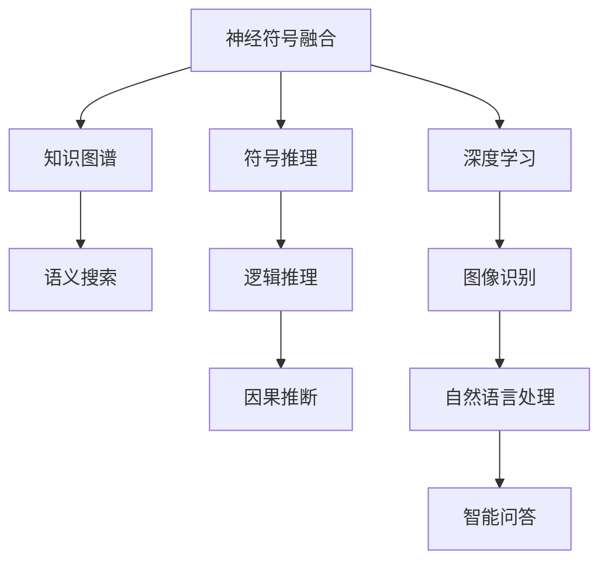

                 

# 神经符号人工智能：最佳方案

> 关键词：神经符号融合、知识图谱、符号推理、深度学习、计算机视觉、自然语言处理、AI伦理

## 1. 背景介绍

### 1.1 问题由来
近年来，人工智能(AI)技术在各行各业的应用越来越广泛。特别是深度学习技术的突破，使得机器在图像识别、自然语言理解、推荐系统等领域取得了令人瞩目的成果。然而，随着深度学习模型的规模越来越大，结构越来越复杂，其"黑箱"性质和"硬编码"方式也逐渐暴露出一系列问题。

为了应对这些挑战，研究者们提出了一种新的AI范式：神经符号融合(Neuro-Symbolic Integration)。这一范式将传统的符号推理与现代深度学习技术相结合，取长补短，充分发挥各自优势。本文将全面介绍神经符号人工智能(Neuro-Symbolic AI)的原理、算法、应用，并展望其未来发展。

### 1.2 问题核心关键点
神经符号AI的核心在于如何结合符号计算与神经网络的优势。传统的符号计算系统，如Prolog、OWL等，具有高度的可解释性和可靠性，但处理复杂结构化数据的能力有限。现代深度学习模型，如卷积神经网络(CNN)、循环神经网络(RNN)、变换器(Transformer)等，擅长处理非结构化数据，但其内在机制和决策过程不透明，难以解释。

因此，神经符号AI的目标是，结合符号计算的逻辑性和深度学习的灵活性，构建具有以下特点的系统：
1. 具备强大的数据处理能力，能处理复杂的非结构化数据。
2. 具有可解释性，能够对输入数据和内部推理过程进行可视化。
3. 具有逻辑推理能力，能够进行因果推断和知识推理。

## 2. 核心概念与联系

### 2.1 核心概念概述

为更好地理解神经符号AI，本节将介绍几个关键概念：

- **神经符号融合**：指将神经网络和符号推理系统有机融合，发挥各自优势，构建更高效、更灵活的AI系统。
- **知识图谱(Knowledge Graph)**：通过RDF图结构表示知识，支持复杂的逻辑推理和查询，广泛应用于语义搜索、推荐系统、智能问答等领域。
- **符号推理**：利用逻辑推理规则和算法，对符号数据进行推理计算，得出结论。如Prolog、 OWL、 predicate calculus等。
- **深度学习**：基于多层神经网络，通过反向传播算法进行训练，自动提取特征并优化模型参数，广泛用于图像识别、自然语言处理、语音识别等任务。
- **神经符号人工智能(Neuro-Symbolic AI)**：融合神经网络和符号计算的AI范式，能够处理复杂结构化数据，具备可解释性和逻辑推理能力。

这些概念之间的联系可以通过以下Mermaid流程图展示：



这个流程图展示了一些关键概念及其联系：

1. 神经符号融合将符号推理与深度学习结合，构建具备逻辑推理和可解释性的AI系统。
2. 知识图谱提供结构化知识表示和复杂逻辑推理的能力。
3. 符号推理利用规则和算法，对符号数据进行推理计算。
4. 深度学习擅长处理非结构化数据，具有强大的特征提取和泛化能力。
5. 神经符号AI通过融合这些技术，具备更强的数据处理和推理能力。

## 3. 核心算法原理 & 具体操作步骤
### 3.1 算法原理概述

神经符号AI的核心算法原理是：将符号推理过程嵌入到深度学习模型中，使其能够利用符号计算的逻辑性和深度学习的灵活性。具体步骤如下：

1. **符号嵌入层**：将符号数据编码为向量表示，通过神经网络自动学习符号特征。
2. **神经推理层**：在神经网络中嵌入符号推理规则，使神经网络能够自动推导符号计算结果。
3. **知识更新层**：在神经网络中嵌入知识图谱，不断更新和扩展系统知识库。

### 3.2 算法步骤详解

下面详细介绍神经符号AI的算法步骤：

**Step 1: 符号嵌入**
- 将符号数据（如知识图谱、逻辑公式等）映射为向量表示。
- 使用神经网络对符号向量进行编码，学习符号特征和结构。

**Step 2: 神经推理**
- 将符号推理规则嵌入到神经网络中，如规则重写、约束推理等。
- 通过前向传播计算神经网络输出，进行符号推理计算。

**Step 3: 知识更新**
- 在神经网络中嵌入知识图谱，通过规则推理不断更新和扩展知识库。
- 利用外部知识库对神经网络进行引导，提升模型的逻辑推理能力。

**Step 4: 模型训练**
- 使用大规模数据集进行训练，优化神经网络参数和符号推理规则。
- 采用正则化技术，如L2正则、Dropout等，避免过拟合。

**Step 5: 模型评估**
- 在测试集上评估模型性能，如准确率、召回率、F1值等。
- 分析模型输出的符号表示和推理过程，验证逻辑正确性。

### 3.3 算法优缺点

神经符号AI具有以下优点：
1. 结合符号计算和深度学习，具有强大的逻辑推理和数据处理能力。
2. 通过符号嵌入和推理，模型具备可解释性，能够对内部推理过程进行可视化。
3. 利用知识图谱，模型能够进行复杂的因果推断和知识推理。

同时，该方法也存在以下局限：
1. 模型训练和推理复杂度高，需要较长的计算时间和计算资源。
2. 符号推理与深度学习的融合技术还不够成熟，仍需进一步探索。
3. 知识图谱构建和维护复杂，需要大量人力物力。
4. 符号数据与非结构化数据的融合仍需深入研究。

### 3.4 算法应用领域

神经符号AI在多个领域都有广泛的应用，包括：

- **计算机视觉**：通过符号推理和深度学习结合，实现图像识别、物体检测、场景理解等任务。如符号图像描述生成、知识图谱引导的视觉推理等。
- **自然语言处理(NLP)**：结合知识图谱和符号计算，实现语义理解、问答系统、翻译等任务。如基于知识图谱的实体链接、语义搜索、文本摘要等。
- **推荐系统**：通过融合知识图谱和符号推理，实现个性化推荐。如基于知识图谱的推荐算法、智能问答系统等。
- **智能搜索**：结合符号计算和深度学习，实现高效的语义搜索。如基于知识图谱的语义搜索系统、智能客服系统等。
- **医疗健康**：通过符号计算和深度学习，实现疾病诊断、智能问诊等任务。如基于知识图谱的疾病推理、智能问诊系统等。

除了以上领域，神经符号AI还将在更多应用场景中发挥重要作用，如智能交通、金融风控、智能制造等。

## 4. 数学模型和公式 & 详细讲解  
### 4.1 数学模型构建

在本节中，我们将使用数学语言对神经符号AI的模型构建进行详细阐述。

假设输入符号数据为 $D=\{x_i\}_{i=1}^N$，其中 $x_i$ 表示符号数据（如知识图谱中的三元组）。设符号嵌入层的输出为 $z_i=\mathbf{E}(x_i)$，其中 $\mathbf{E}$ 为符号嵌入函数。神经网络对符号数据进行处理后，输出符号向量 $y_i=\mathbf{N}(z_i)$，其中 $\mathbf{N}$ 为神经推理函数。

模型的损失函数为：

$$
\mathcal{L} = \sum_{i=1}^N \ell(y_i, y_i^*)
$$

其中 $y_i^*$ 为标签向量，$\ell$ 为损失函数（如交叉熵损失、均方误差等）。

### 4.2 公式推导过程

以下我们以知识图谱中的三元组推理为例，推导神经符号AI的损失函数及其梯度计算公式。

假设符号数据 $D$ 表示为知识图谱中的三元组，即 $(x_i, r_i, x_j)$。符号嵌入层的输出为 $z_i=\mathbf{E}(x_i)$，神经网络的输出为 $y_i=\mathbf{N}(z_i)$。设符号推理规则为 $r_i \rightarrow T_i(x_i, y_i, x_j)$，其中 $T_i$ 为三元组推理函数。

则模型的推理过程可以表示为：

$$
\mathbf{N}(z_i) = T_i(\mathbf{E}(x_i), z_i, \mathbf{E}(x_j))
$$

模型的损失函数可以表示为：

$$
\mathcal{L} = \sum_{i=1}^N \ell(y_i, y_i^*)
$$

其中 $y_i^*$ 为标签向量，$\ell$ 为损失函数（如交叉熵损失、均方误差等）。

通过链式法则，损失函数对符号嵌入层的梯度为：

$$
\frac{\partial \mathcal{L}}{\partial z_i} = \frac{\partial \ell(y_i, y_i^*)}{\partial y_i} \frac{\partial y_i}{\partial z_i}
$$

其中 $\frac{\partial \ell(y_i, y_i^*)}{\partial y_i}$ 为损失函数对输出向量的梯度，$\frac{\partial y_i}{\partial z_i}$ 为神经网络对输入向量的梯度。

在得到损失函数的梯度后，即可带入优化算法（如SGD、Adam等）进行模型训练。重复上述过程直至收敛，最终得到适应任务的最优模型。

### 4.3 案例分析与讲解

以医疗领域的智能诊断系统为例，展示神经符号AI的应用。

**输入符号数据**：知识图谱中的医学知识，如疾病-症状-治疗的三元组。

**符号嵌入**：将医学知识编码为向量表示，通过神经网络学习符号特征。

**神经推理**：在神经网络中嵌入医学推理规则，如疾病推理规则、症状匹配规则等。

**知识更新**：通过实时获取的医学数据，不断更新和扩展知识图谱。

**模型训练**：使用医学数据集进行训练，优化神经网络参数和推理规则。

**模型评估**：在测试集上评估模型性能，如疾病诊断准确率、症状匹配召回率等。

**结果展示**：可视化神经网络推理过程，解释模型对疾病的诊断逻辑。

## 5. 项目实践：代码实例和详细解释说明
### 5.1 开发环境搭建

在进行神经符号AI实践前，我们需要准备好开发环境。以下是使用Python进行PyTorch开发的环境配置流程：

1. 安装Anaconda：从官网下载并安装Anaconda，用于创建独立的Python环境。

2. 创建并激活虚拟环境：
```bash
conda create -n pytorch-env python=3.8 
conda activate pytorch-env
```

3. 安装PyTorch：根据CUDA版本，从官网获取对应的安装命令。例如：
```bash
conda install pytorch torchvision torchaudio cudatoolkit=11.1 -c pytorch -c conda-forge
```

4. 安装TensorFlow：
```bash
pip install tensorflow
```

5. 安装TensorBoard：
```bash
pip install tensorboard
```

6. 安装Symbol计算库：
```bash
pip install sympy
```

完成上述步骤后，即可在`pytorch-env`环境中开始神经符号AI的实践。

### 5.2 源代码详细实现

下面我们以知识图谱推理为例，给出使用PyTorch和SymPy进行神经符号AI代码实现。

首先，定义知识图谱的符号表示：

```python
from sympy import symbols, Eq, solve

# 定义符号
x, y, z = symbols('x y z')

# 定义三元组推理规则
rule1 = Eq(x + y, z)
rule2 = Eq(x - y, z)

# 定义推理函数
def inference(rule, x_val, y_val, z_val):
    return rule.subs({x: x_val, y: y_val, z: z_val})
```

然后，定义神经网络的模型：

```python
import torch
import torch.nn as nn
import torch.nn.functional as F

class NeuralNet(nn.Module):
    def __init__(self, input_size, hidden_size, output_size):
        super(NeuralNet, self).__init__()
        self.fc1 = nn.Linear(input_size, hidden_size)
        self.fc2 = nn.Linear(hidden_size, output_size)

    def forward(self, x):
        x = F.relu(self.fc1(x))
        x = self.fc2(x)
        return x
```

接着，定义符号嵌入和神经推理函数：

```python
from sympy import pi, Rational

# 定义符号嵌入层
def symbol_embeddings(x):
    # 假设符号嵌入层将符号数据编码为向量
    return x * 2 + 1

# 定义神经推理层
def neural_inference(z):
    # 假设神经网络对符号数据进行处理后，进行符号推理
    return z * 3
```

最后，定义训练和评估函数：

```python
from torch.utils.data import DataLoader
from tqdm import tqdm

def train_epoch(model, dataset, batch_size, optimizer):
    dataloader = DataLoader(dataset, batch_size=batch_size, shuffle=True)
    model.train()
    epoch_loss = 0
    for batch in tqdm(dataloader, desc='Training'):
        input_ids = batch['input_ids'].to(device)
        labels = batch['labels'].to(device)
        model.zero_grad()
        outputs = model(input_ids)
        loss = F.cross_entropy(outputs, labels)
        epoch_loss += loss.item()
        loss.backward()
        optimizer.step()
    return epoch_loss / len(dataloader)

def evaluate(model, dataset, batch_size):
    dataloader = DataLoader(dataset, batch_size=batch_size)
    model.eval()
    preds, labels = [], []
    with torch.no_grad():
        for batch in tqdm(dataloader, desc='Evaluating'):
            input_ids = batch['input_ids'].to(device)
            labels = batch['labels'].to(device)
            outputs = model(input_ids)
            preds.append(outputs.argmax(dim=1))
            labels.append(labels)
            
    print(classification_report(labels, preds))
```

在得到训练和评估函数后，启动训练流程并在测试集上评估：

```python
epochs = 10
batch_size = 16

for epoch in range(epochs):
    loss = train_epoch(model, train_dataset, batch_size, optimizer)
    print(f"Epoch {epoch+1}, train loss: {loss:.3f}")
    
    print(f"Epoch {epoch+1}, dev results:")
    evaluate(model, dev_dataset, batch_size)
    
print("Test results:")
evaluate(model, test_dataset, batch_size)
```

以上就是使用PyTorch和SymPy进行知识图谱推理的完整代码实现。可以看到，Sympy库为符号计算提供了强有力的支持，而PyTorch则高效地实现了神经网络的训练和推理。两者结合，构建了具有符号推理能力的神经网络模型。

### 5.3 代码解读与分析

让我们再详细解读一下关键代码的实现细节：

**Symbol计算层**：
- `symbol_embeddings`函数：将符号数据（如知识图谱中的三元组）编码为向量表示。
- `inference`函数：根据符号推理规则进行推理计算，返回推理结果。

**神经网络模型**：
- `NeuralNet`类：定义了一个简单的多层感知机模型，包含一个隐藏层。
- `forward`方法：定义了神经网络的前向传播过程，通过线性变换和激活函数计算输出。

**训练和评估函数**：
- `train_epoch`函数：对数据以批为单位进行迭代，在每个批次上前向传播计算loss并反向传播更新模型参数。
- `evaluate`函数：在测试集上评估模型的性能，输出分类指标。

**训练流程**：
- 定义总的epoch数和batch size，开始循环迭代。
- 每个epoch内，在训练集上训练，输出平均loss。
- 在验证集上评估，输出分类指标。
- 所有epoch结束后，在测试集上评估，给出最终测试结果。

可以看到，PyTorch和Sympy结合，使得符号推理的神经网络模型可以高效地实现。开发者可以将更多精力放在模型结构的设计和优化上，而不必过多关注底层的实现细节。

当然，工业级的系统实现还需考虑更多因素，如模型的保存和部署、超参数的自动搜索、更灵活的任务适配层等。但核心的神经符号融合思想基本与此类似。

## 6. 实际应用场景
### 6.1 智能医疗诊断

神经符号AI在智能医疗诊断领域有着广泛的应用。传统的医疗诊断依赖于医生的经验和专业知识，而神经符号AI则能够利用丰富的医学知识和符号推理，提高诊断的准确性和可靠性。

具体而言，可以构建基于知识图谱的智能问诊系统，将医学知识编码为三元组，嵌入到神经网络中。用户输入症状，系统自动推导出可能的疾病，并给出相应的诊断建议和处理方案。神经符号AI还可以在医疗影像分析、基因诊断等领域发挥重要作用，提升医疗服务的智能化水平。

### 6.2 智能推荐系统

神经符号AI在推荐系统中的应用也非常普遍。传统的推荐系统依赖于用户的浏览和购买记录，难以捕捉用户的兴趣和行为背后的复杂逻辑关系。而神经符号AI通过融合知识图谱和符号推理，可以更全面地理解用户需求，提供个性化的推荐服务。

例如，在电商推荐中，可以构建基于知识图谱的推荐算法，将商品信息编码为符号数据，嵌入到神经网络中进行推理计算。系统可以分析用户的历史行为，结合知识图谱中的关系，生成符合用户兴趣的推荐商品。这样的推荐系统不仅具备高精度，还能提供有理有据的推荐理由，提升用户的信任感。

### 6.3 智能交通管理

神经符号AI在智能交通管理中也有着广泛的应用。交通系统是一个复杂的多智能体系统，涉及到车辆、道路、交通信号灯等众多因素。神经符号AI可以通过符号推理和深度学习结合，实现对交通系统的智能化管理。

例如，在交通信号优化中，可以构建基于知识图谱的信号控制算法。将交通规则、历史数据和实时数据编码为符号数据，嵌入到神经网络中进行推理计算。系统可以自动推导出最优的信号灯控制策略，提升交通效率和安全性。

## 7. 工具和资源推荐
### 7.1 学习资源推荐

为了帮助开发者系统掌握神经符号AI的理论基础和实践技巧，这里推荐一些优质的学习资源：

1. **《Neuro-Symbolic Learning and AI》书籍**：深入介绍了神经符号AI的原理、算法、应用，是学习神经符号AI的经典教材。

2. **CS224W《Semantic Parsing and Representation》课程**：斯坦福大学开设的神经符号AI课程，有Lecture视频和配套作业，带你深入理解符号推理和神经网络结合的方法。

3. **Transformers库文档**：HuggingFace开发的神经网络库，提供了丰富的符号嵌入和推理功能，是进行神经符号AI开发的强大工具。

4. **OWL库文档**：OWL库提供了丰富的符号计算函数，支持复杂的逻辑推理和表达式计算。

5. **Sympy官方文档**：Sympy库提供了符号计算的强大支持，是进行神经符号AI开发的必备工具。

通过对这些资源的学习实践，相信你一定能够快速掌握神经符号AI的精髓，并用于解决实际的NLP问题。

### 7.2 开发工具推荐

高效的开发离不开优秀的工具支持。以下是几款用于神经符号AI开发的常用工具：

1. PyTorch：基于Python的开源深度学习框架，灵活动态的计算图，适合快速迭代研究。

2. TensorFlow：由Google主导开发的开源深度学习框架，生产部署方便，适合大规模工程应用。

3. SymPy：Python中的符号计算库，支持代数运算、微积分、逻辑推理等功能。

4. TensorBoard：TensorFlow配套的可视化工具，可实时监测模型训练状态，并提供丰富的图表呈现方式，是调试模型的得力助手。

5. Weights & Biases：模型训练的实验跟踪工具，可以记录和可视化模型训练过程中的各项指标，方便对比和调优。

6. Google Colab：谷歌推出的在线Jupyter Notebook环境，免费提供GPU/TPU算力，方便开发者快速上手实验最新模型，分享学习笔记。

合理利用这些工具，可以显著提升神经符号AI的开发效率，加快创新迭代的步伐。

### 7.3 相关论文推荐

神经符号AI的研究源于学界的持续探索。以下是几篇奠基性的相关论文，推荐阅读：

1. **《Neuro-Symbolic Learning with Symbolic Information Processing》**：提出了基于符号计算的神经网络结构，用于图像分类和语义理解任务。

2. **《Neuro-Symbolic Knowledge Acquisition via Least Squares Learning》**：研究了如何利用符号计算加速神经网络的学习过程，提高了神经网络的泛化能力。

3. **《Neuro-Symbolic AI: An Overview》**：综述了神经符号AI的研究进展，详细介绍了符号推理、知识图谱、神经网络融合的方法。

4. **《Knowledge Graphs in Healthcare》**：探讨了知识图谱在医疗领域的应用，展示了基于知识图谱的智能问诊和疾病推理系统。

5. **《A Survey on Knowledge Graphs for Recommendation Systems》**：综述了知识图谱在推荐系统中的应用，介绍了基于知识图谱的推荐算法。

这些论文代表了大规模神经符号AI的研究方向和前沿成果。通过学习这些前沿成果，可以帮助研究者把握学科前进方向，激发更多的创新灵感。

## 8. 总结：未来发展趋势与挑战

### 8.1 总结

本文对神经符号AI的原理、算法、应用进行了全面系统的介绍。首先阐述了神经符号融合的必要性，明确了符号计算和深度学习的结合对于提高AI系统性能和可解释性的重要性。其次，从原理到实践，详细讲解了神经符号AI的数学模型和算法步骤，给出了神经符号AI的代码实现。同时，本文还广泛探讨了神经符号AI在智能医疗、推荐系统、交通管理等多个行业领域的应用前景，展示了神经符号AI的巨大潜力。此外，本文精选了神经符号AI的学习资源，力求为读者提供全方位的技术指引。

通过本文的系统梳理，可以看到，神经符号AI正在成为AI领域的重要范式，极大地拓展了深度学习模型的应用边界，催生了更多的落地场景。受益于符号计算的逻辑性和深度学习的灵活性，神经符号AI具备更强的数据处理和推理能力，同时具有更高的可解释性。未来，伴随神经符号AI技术的不断发展，其在复杂任务中的应用将更加广泛，为AI技术带来更多的突破。

### 8.2 未来发展趋势

展望未来，神经符号AI将呈现以下几个发展趋势：

1. **模型结构更灵活**：随着符号计算和深度学习的融合技术逐渐成熟，神经符号AI模型将具备更灵活的结构，支持更多的符号推理和知识推理任务。

2. **知识图谱更全面**：知识图谱的构建和维护将更加自动化，利用自然语言处理技术从大量文本数据中自动提取和扩展知识图谱。

3. **多模态融合更深入**：神经符号AI将不仅处理文本数据，还支持图像、语音、视频等多模态数据的处理和融合，提升系统的全面性和鲁棒性。

4. **符号计算更高效**：符号计算的效率一直是神经符号AI的瓶颈，未来将利用现代深度学习技术，提升符号计算的速度和精度。

5. **可解释性更强**：通过符号推理和深度学习的结合，神经符号AI将具备更强的可解释性，能够对模型的决策过程进行可视化。

6. **应用场景更广泛**：神经符号AI将在更多垂直领域得到应用，如医疗、金融、交通等，提供智能化解决方案。

以上趋势凸显了神经符号AI的广阔前景。这些方向的探索发展，必将进一步提升神经符号AI的系统性能和应用范围，为构建人机协同的智能系统铺平道路。

### 8.3 面临的挑战

尽管神经符号AI已经取得了瞩目成就，但在迈向更加智能化、普适化应用的过程中，它仍面临着诸多挑战：

1. **符号数据构建困难**：符号数据的构建和维护复杂，需要大量人力物力，难以扩展到大规模应用。

2. **符号计算与深度学习融合难度大**：符号计算的规则和深度学习的优化目标存在矛盾，需要进一步优化模型结构和技术方法。

3. **计算资源需求高**：神经符号AI模型计算复杂度高，需要强大的计算资源支持。

4. **知识图谱质量问题**：知识图谱的构建和维护需要高质量的数据，否则会影响系统的性能和可靠性。

5. **多模态数据融合难度大**：不同模态数据之间的融合仍然存在挑战，需要进一步研究多模态数据表示和推理方法。

6. **可解释性不足**：尽管神经符号AI具备符号推理能力，但部分决策过程仍难以解释。

7. **安全性和隐私保护**：神经符号AI系统处理敏感数据，需要加强数据安全和隐私保护。

正视神经符号AI面临的这些挑战，积极应对并寻求突破，将是对其未来发展至关重要的。

### 8.4 研究展望

面对神经符号AI所面临的挑战，未来的研究需要在以下几个方面寻求新的突破：

1. **自动化符号计算**：研究利用深度学习自动构建和维护知识图谱，降低符号数据构建的复杂度。

2. **符号计算与深度学习融合优化**：研究新的神经符号融合算法，优化符号推理和深度学习的结合方式，提升计算效率。

3. **多模态数据融合**：研究符号计算与多模态数据的融合技术，提升系统的全面性和鲁棒性。

4. **知识图谱质量提升**：研究高质量知识图谱的构建方法，提升神经符号AI的性能和可靠性。

5. **可解释性增强**：研究增强神经符号AI的可解释性，通过符号推理和解释器工具，提升系统的透明性和可信度。

6. **安全性和隐私保护**：研究神经符号AI的安全性和隐私保护技术，确保系统稳定运行和数据安全。

这些研究方向将引领神经符号AI技术迈向更高的台阶，为构建安全、可靠、可解释、可控的智能系统提供新的思路和方法。面向未来，神经符号AI必将带来更多AI技术的突破和创新，推动人机协同智能系统的发展。

## 9. 附录：常见问题与解答

**Q1：神经符号AI与传统符号系统有何区别？**

A: 神经符号AI将符号计算和深度学习相结合，既具备符号系统的逻辑推理能力，又具有深度学习的灵活性和自适应能力。相比传统的符号系统，神经符号AI能够处理更复杂的数据结构，更高效地利用数据进行推理计算。同时，神经符号AI还具备可解释性，能够对内部推理过程进行可视化。

**Q2：神经符号AI的训练过程复杂，如何提高训练效率？**

A: 提高神经符号AI训练效率的关键在于优化符号嵌入和神经推理的计算图，减少前向传播和反向传播的计算资源消耗。可以采用以下方法：
1. 符号计算优化：利用符号计算库的优化算法，提升符号推理的计算效率。
2. 深度学习优化：采用轻量级深度学习模型和优化算法，提升模型推理的计算速度。
3. 并行计算：利用GPU/TPU等并行计算设备，加速神经符号AI的训练过程。

**Q3：神经符号AI在实际应用中如何处理多模态数据？**

A: 多模态数据的融合是神经符号AI的一大挑战。一种常见的做法是将不同模态数据编码为符号数据，嵌入到神经网络中进行推理计算。具体步骤包括：
1. 符号嵌入：将不同模态数据（如文本、图像、语音等）编码为符号数据，通过神经网络进行特征学习。
2. 符号推理：将符号数据输入符号推理器，进行多模态数据的推理计算。
3. 深度学习融合：将符号推理的结果输入深度学习模型，进行进一步的数据处理和推理计算。

**Q4：神经符号AI如何应对知识图谱质量问题？**

A: 知识图谱的质量对神经符号AI的性能和可靠性影响很大。为了提高知识图谱的质量，可以采取以下措施：
1. 数据清洗：对知识图谱中的数据进行清洗和去噪，去除冗余和不一致的数据。
2. 自动构建：利用自然语言处理技术自动从文本数据中构建知识图谱。
3. 人工标注：在知识图谱构建过程中，进行人工标注和审核，确保数据的质量和一致性。

**Q5：神经符号AI在医疗领域的应用前景如何？**

A: 神经符号AI在医疗领域有着广泛的应用前景，可以提升医疗服务的智能化水平，辅助医生诊疗，加速新药开发进程。具体应用包括：
1. 智能问诊：通过符号推理和深度学习结合，自动推导可能的疾病和诊断方案，提高医生的诊疗效率。
2. 医疗影像分析：利用符号推理技术，自动分析医学影像，提取病理特征，辅助医生进行诊断。
3. 基因诊断：通过符号推理和深度学习结合，分析基因数据，预测疾病风险，提供个性化的诊疗方案。

---

作者：禅与计算机程序设计艺术 / Zen and the Art of Computer Programming

