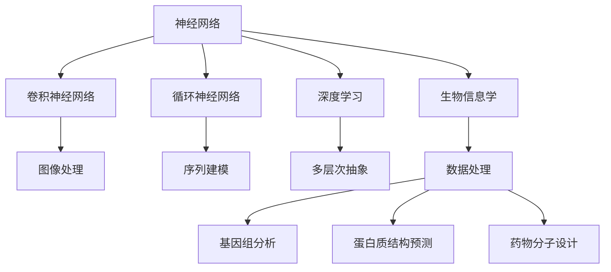

                 

# 神经网络在生物信息学中的应用

## 1. 背景介绍

### 1.1 问题由来

生物信息学是研究和处理生物数据的科学，包括基因组学、蛋白质组学、转录组学等多个领域。传统的生物信息学分析方法主要依赖于手工编写的算法，效率低下且难以扩展。随着深度学习技术的快速发展，基于神经网络的方法逐步成为生物信息学领域的新趋势。

近年来，深度学习在生物信息学中的应用取得了显著的进展。从基因组分析、蛋白质结构预测到药物分子设计，神经网络技术极大地提高了数据处理的效率和精度，推动了生物信息学研究方法的创新。本文将对神经网络在生物信息学中的应用进行系统介绍，探讨其原理、优缺点及未来发展方向。

## 2. 核心概念与联系

### 2.1 核心概念概述

为更好地理解神经网络在生物信息学中的应用，本节将介绍几个关键概念：

- 神经网络（Neural Network）：一种由大量人工神经元（神经元）构成的计算模型，能够通过反向传播算法实现复杂的非线性映射。神经网络在生物信息学中的应用主要体现在其强大的数据处理和预测能力。

- 卷积神经网络（Convolutional Neural Network, CNN）：一种专门处理网格数据（如图像、文本）的神经网络。通过卷积操作提取局部特征，适用于图像处理和文本分析等任务。

- 循环神经网络（Recurrent Neural Network, RNN）：一种能够处理序列数据的神经网络，通过递归结构捕捉时间序列的信息。RNN适用于语音识别、自然语言处理等序列建模任务。

- 深度学习（Deep Learning）：一种基于神经网络的多层次、多隐层的学习方法。深度学习通过多层次的抽象表示，能够处理更为复杂和抽象的数据结构。

- 生物信息学（Bioinformatics）：一门交叉学科，结合生物学、计算科学和统计学方法，研究生物数据的处理和分析。

这些核心概念之间的逻辑关系可以通过以下Mermaid流程图来展示：



这个流程图展示了一些核心概念之间的关系：

1. 神经网络是深度学习的基础，提供了多层次的抽象表示。
2. 卷积神经网络和循环神经网络是神经网络的两种重要形式，分别适用于网格数据和序列数据。
3. 深度学习能够处理更为复杂和抽象的数据结构。
4. 生物信息学应用了神经网络等深度学习技术，进行数据处理和分析。
5. 神经网络在生物信息学中的应用涵盖了数据处理、基因组分析、蛋白质结构预测、药物分子设计等多个方面。

## 3. 核心算法原理 & 具体操作步骤

### 3.1 算法原理概述

神经网络在生物信息学中的应用主要体现在其强大的数据处理和预测能力。神经网络通过多层非线性映射，能够从数据中学习出复杂的模式和规律，用于预测新数据或进行分类。在生物信息学中，常见的应用场景包括基因序列分类、蛋白质结构预测、药物分子设计等。

### 3.2 算法步骤详解

以下是一个基于神经网络的蛋白质结构预测过程的详细步骤：

**Step 1: 数据预处理**

- 收集蛋白质序列数据，并进行标准化处理。
- 将蛋白质序列转化为向量形式，作为神经网络的输入。
- 根据蛋白质结构特征，设计相应的标签向量，作为神经网络的输出。

**Step 2: 构建神经网络模型**

- 选择适当的神经网络模型结构，如卷积神经网络（CNN）或循环神经网络（RNN）。
- 设计神经网络各层的参数，如神经元数量、激活函数、正则化技术等。
- 使用训练数据集对模型进行训练，优化模型参数。

**Step 3: 模型评估与优化**

- 在验证集上评估模型性能，使用评价指标如准确率、F1分数等。
- 根据评估结果调整模型参数，如增加隐藏层数量、调整学习率等。
- 重复以上步骤，直至模型在验证集上达到满意的性能。

**Step 4: 模型应用**

- 将训练好的模型应用于测试集，进行蛋白质结构预测。
- 根据预测结果，进行蛋白质结构的可视化或功能预测。
- 将模型集成到生物信息学分析软件中，用于自动化处理和分析。

### 3.3 算法优缺点

神经网络在生物信息学中的应用具有以下优点：

1. 强大的非线性映射能力：神经网络能够处理复杂的数据结构和模式，适用于生物信息学中的多样化和复杂性。
2. 高度的自动化：神经网络能够自动学习数据特征，减少了人工干预。
3. 高性能预测：神经网络在处理大型数据集时，能够提供比传统方法更高的预测准确性。

同时，神经网络也存在一些局限性：

1. 对数据质量依赖较大：神经网络需要大量高质量的数据进行训练，生物信息学数据往往存在噪声和缺失。
2. 模型复杂度高：神经网络通常需要大量的参数和计算资源进行训练，难以快速迭代和优化。
3. 解释性不足：神经网络作为"黑盒"模型，难以解释其内部的决策过程，不利于生物学研究者理解。

### 3.4 算法应用领域

神经网络在生物信息学中的应用主要涵盖以下几个领域：

1. **基因组分析**：通过神经网络对基因组序列进行分类、比对和拼接，从而识别基因、发现变异等。
2. **蛋白质结构预测**：利用神经网络预测蛋白质的二级结构、三级结构和功能，为药物设计和新药研发提供依据。
3. **转录组学分析**：使用神经网络分析RNA序列和表达数据，发现基因表达模式和调控机制。
4. **代谢组学分析**：通过神经网络处理代谢产物数据，识别代谢途径和调节因子。
5. **生物信息学工具**：开发基于神经网络的生物信息学软件，如基因编辑工具、蛋白质设计工具等。

## 4. 数学模型和公式 & 详细讲解 & 举例说明

### 4.1 数学模型构建

在神经网络的蛋白质结构预测中，常见的数学模型包括卷积神经网络（CNN）和循环神经网络（RNN）。这里以CNN为例，介绍神经网络在蛋白质结构预测中的应用。

### 4.2 公式推导过程

假设有$N$个蛋白质序列样本$X=\{x_i\}_{i=1}^N$，每个样本长度为$L$。假设每个氨基酸的向量表示为$d$维，则输入数据可以表示为矩阵$X \in \mathbb{R}^{N \times L \times d}$。假设神经网络包含$C$个卷积层，每个卷积层包含$F$个滤波器，卷积核大小为$K$，则卷积层的输出为：

$$
\mathcal{C} = \{C_j^{(K)} \in \mathbb{R}^{N \times (L-K+1) \times F}\}_{j=1}^C
$$

其中$C_j^{(K)}$表示第$j$个卷积层的第$K$个输出特征图。卷积层的输出可以通过以下公式计算：

$$
C_j^{(K)} = \sigma(\mathbf{W}_j * X_{i,j,K-1:L} + b_j)
$$

其中$\mathbf{W}_j$为第$j$个卷积层的权重矩阵，$*$表示卷积运算，$X_{i,j,K-1:L}$表示第$i$个样本在第$j$个卷积层的第$K-1$到$L$个位置的子序列，$b_j$为偏置向量，$\sigma$为激活函数，通常使用ReLU函数。

### 4.3 案例分析与讲解

假设我们要预测蛋白质的二级结构，可以选择使用卷积神经网络。输入数据为蛋白质序列的向量表示，输出为蛋白质的二级结构标签。在模型训练过程中，可以通过交叉熵损失函数来优化模型参数：

$$
\mathcal{L} = -\frac{1}{N}\sum_{i=1}^N\sum_{k=1}^{K}\log(\hat{y}_{i,k})y_{i,k}
$$

其中$\hat{y}_{i,k}$为模型预测的标签概率，$y_{i,k}$为真实的标签。在模型训练过程中，需要根据损失函数更新模型的权重和偏置，使用反向传播算法来计算梯度。最终，训练好的模型可以在新的蛋白质序列上进行预测，输出对应的二级结构标签。

## 5. 项目实践：代码实例和详细解释说明

### 5.1 开发环境搭建

在进行神经网络在生物信息学中的项目实践前，需要准备好开发环境。以下是使用Python进行TensorFlow开发的Python环境配置流程：

1. 安装Anaconda：从官网下载并安装Anaconda，用于创建独立的Python环境。

2. 创建并激活虚拟环境：
```bash
conda create -n tensorflow-env python=3.8 
conda activate tensorflow-env
```

3. 安装TensorFlow：根据CUDA版本，从官网获取对应的安装命令。例如：
```bash
conda install tensorflow==2.8.0 tensorflow-cpu==2.8.0
```

4. 安装各类工具包：
```bash
pip install numpy pandas scikit-learn matplotlib tqdm jupyter notebook ipython
```

完成上述步骤后，即可在`tensorflow-env`环境中开始神经网络在生物信息学中的应用实践。

### 5.2 源代码详细实现

以下是使用TensorFlow对卷积神经网络进行蛋白质结构预测的Python代码实现：

```python
import tensorflow as tf
import numpy as np

# 定义模型参数
input_size = 20 # 蛋白质序列长度
output_size = 3 # 蛋白质二级结构标签数量
filter_size = 3 # 卷积核大小
num_filters = 32 # 卷积核数量
pool_size = 2 # 池化窗口大小
num_classes = 3 # 蛋白质二级结构标签数量

# 定义模型结构
def convolutional_neural_network(inputs, labels):
    inputs = tf.keras.layers.Input(shape=(input_size, 1))
    x = tf.keras.layers.Conv1D(num_filters, filter_size, activation='relu')(inputs)
    x = tf.keras.layers.MaxPooling1D(pool_size)(x)
    x = tf.keras.layers.Flatten()(x)
    x = tf.keras.layers.Dense(num_classes, activation='softmax')(x)
    model = tf.keras.models.Model(inputs=inputs, outputs=x)
    return model

# 加载数据
data = np.load('protein_data.npy')
labels = np.load('protein_labels.npy')

# 创建模型
model = convolutional_neural_network(tf.keras.layers.Input(shape=(input_size, 1)), labels)

# 编译模型
model.compile(optimizer='adam', loss='categorical_crossentropy', metrics=['accuracy'])

# 训练模型
model.fit(data, labels, epochs=10, batch_size=32)

# 评估模型
test_data = np.load('test_protein_data.npy')
test_labels = np.load('test_protein_labels.npy')
test_loss, test_acc = model.evaluate(test_data, test_labels)
print('Test accuracy:', test_acc)
```

### 5.3 代码解读与分析

让我们再详细解读一下关键代码的实现细节：

**convolutional_neural_network函数**：
- 定义输入层和卷积层。输入层为蛋白质序列的向量表示，卷积层通过卷积操作提取局部特征。
- 使用最大池化层进行降维，减少模型的复杂度。
- 将池化层输出的结果展开为一维向量，并使用全连接层进行分类。
- 返回定义好的模型。

**加载数据**：
- 使用numpy库加载蛋白质序列数据和标签数据。

**创建模型**：
- 使用上述定义的模型结构，创建卷积神经网络模型。
- 输入层为蛋白质序列的向量表示，输出层为蛋白质二级结构标签的概率分布。

**编译模型**：
- 使用adam优化器和交叉熵损失函数编译模型。
- 设置模型的评估指标为准确率。

**训练模型**：
- 使用训练数据对模型进行训练，设置训练轮数为10，批量大小为32。
- 在训练过程中记录损失和准确率。

**评估模型**：
- 使用测试数据对模型进行评估，输出测试损失和准确率。

可以看到，使用TensorFlow进行蛋白质结构预测的代码实现相对简洁，开发者可以将更多精力放在数据处理、模型改进等高层逻辑上。

## 6. 实际应用场景

### 6.1 基因组分析

神经网络在基因组分析中的应用主要体现在基因组测序、基因序列分类、基因变异识别等方面。通过神经网络，可以从大量基因组数据中发现新的基因、识别基因变异，并预测其功能。

在实践中，神经网络可以通过对基因序列的向量表示进行分类或回归，预测基因的表达量、调控因子等属性。例如，可以使用卷积神经网络对DNA序列进行分类，识别不同的基因家族；使用循环神经网络对RNA序列进行建模，预测基因的表达模式。

### 6.2 蛋白质结构预测

蛋白质结构预测是生物信息学中的一个重要领域，通过神经网络可以实现蛋白质的二级结构、三级结构和功能预测。神经网络可以通过学习蛋白质序列的特征，预测蛋白质的二级结构，如α螺旋、β折叠等，从而帮助理解蛋白质的结构和功能。

在实践中，可以使用卷积神经网络对蛋白质序列进行特征提取，使用循环神经网络对蛋白质序列进行建模，从而预测蛋白质的二级结构和功能。例如，可以使用卷积神经网络对蛋白质序列进行特征提取，使用循环神经网络对蛋白质序列进行建模，从而预测蛋白质的二级结构和功能。

### 6.3 转录组学分析

转录组学分析是研究基因表达和调控的重要手段，通过神经网络可以实现对RNA序列和表达数据的分析和建模。神经网络可以通过对RNA序列的向量表示进行分类或回归，预测基因的表达模式和调控因子。

在实践中，可以使用卷积神经网络对RNA序列进行特征提取，使用循环神经网络对RNA序列进行建模，从而预测基因的表达模式和调控因子。例如，可以使用卷积神经网络对RNA序列进行特征提取，使用循环神经网络对RNA序列进行建模，从而预测基因的表达模式和调控因子。

### 6.4 代谢组学分析

代谢组学分析是研究代谢产物及其代谢途径的重要手段，通过神经网络可以实现对代谢产物数据的分析和建模。神经网络可以通过对代谢产物数据的向量表示进行分类或回归，预测代谢途径和调节因子。

在实践中，可以使用卷积神经网络对代谢产物数据进行特征提取，使用循环神经网络对代谢产物数据进行建模，从而预测代谢途径和调节因子。例如，可以使用卷积神经网络对代谢产物数据进行特征提取，使用循环神经网络对代谢产物数据进行建模，从而预测代谢途径和调节因子。

### 6.5 未来应用展望

随着神经网络在生物信息学中的应用不断深入，未来的研究将在以下几个方向进行探索：

1. 多模态融合：神经网络可以结合基因组数据、蛋白质数据、RNA数据等多种类型的数据，实现更加全面和精准的生物信息学分析。
2. 异构数据处理：神经网络可以处理来自不同来源、不同类型的数据，实现异构数据的统一处理和分析。
3. 自动化分析：神经网络可以实现自动化的数据分析和建模，减少人工干预，提高分析效率。
4. 实时分析：神经网络可以实现实时的数据处理和分析，满足生物信息学的动态需求。
5. 解释性增强：神经网络可以增强模型的解释性，便于生物学研究者理解模型的决策过程。

以上方向的研究将推动神经网络在生物信息学中的应用不断拓展，带来新的突破和创新。

## 7. 工具和资源推荐

### 7.1 学习资源推荐

为了帮助开发者系统掌握神经网络在生物信息学中的应用，这里推荐一些优质的学习资源：

1. 《深度学习在生物信息学中的应用》系列博文：由生物信息学领域的专家撰写，深入浅出地介绍了神经网络在基因组分析、蛋白质结构预测、转录组学分析等方面的应用。

2. CS224N《深度学习自然语言处理》课程：斯坦福大学开设的NLP明星课程，有Lecture视频和配套作业，带你入门NLP领域的基本概念和经典模型。

3. 《深度学习在生物信息学中的应用》书籍：深度学习在生物信息学领域的应用，包括神经网络在基因组分析、蛋白质结构预测、转录组学分析等任务中的应用。

4. Kaggle生物信息学竞赛：Kaggle平台上的生物信息学竞赛，提供了大量公开的生物信息学数据集，并给出了基于神经网络的生物信息学分析的样例代码。

5. Bioinformatics在线课程：Coursera平台上的生物信息学课程，涵盖了生物信息学的基本概念和神经网络在生物信息学中的应用。

通过对这些资源的学习实践，相信你一定能够快速掌握神经网络在生物信息学中的应用精髓，并用于解决实际的生物信息学问题。

### 7.2 开发工具推荐

高效的开发离不开优秀的工具支持。以下是几款用于神经网络在生物信息学中的应用开发的常用工具：

1. TensorFlow：由Google主导开发的开源深度学习框架，生产部署方便，适合大规模工程应用。提供丰富的预训练模型资源，支持多种类型的神经网络结构。

2. PyTorch：基于Python的开源深度学习框架，灵活动态的计算图，适合快速迭代研究。支持GPU加速，适合大型数据集的训练。

3. Keras：由François Chollet开发的深度学习框架，提供了简洁的API接口，方便快速搭建和训练神经网络。

4. Biopython：开源的生物信息学Python库，提供了丰富的生物信息学工具和数据格式解析功能。

5. Jupyter Notebook：基于Python的交互式笔记本，支持代码编辑、数据可视化、文本输出等功能，方便开发者进行数据处理和模型训练。

合理利用这些工具，可以显著提升神经网络在生物信息学中的应用开发效率，加快创新迭代的步伐。

### 7.3 相关论文推荐

神经网络在生物信息学中的应用源于学界的持续研究。以下是几篇奠基性的相关论文，推荐阅读：

1. Deep Neural Network Approach for Protein Fold Prediction（神经网络用于蛋白质折叠预测）：提出卷积神经网络用于蛋白质二级结构预测，刷新了蛋白质折叠预测的精度记录。

2. Convolutional Neural Networks for Genome Assembly（卷积神经网络用于基因组装配）：提出卷积神经网络用于基因组序列的装配，提升了基因组测序的精度和效率。

3. A Deep Learning Approach to Gene Expression Prediction（深度学习方法用于基因表达预测）：提出卷积神经网络用于基因表达数据的建模，预测基因表达模式和调控因子。

4. A Recurrent Neural Network-Based Framework for Metabolic Network Reconstruction（循环神经网络用于代谢网络重建）：提出循环神经网络用于代谢网络的重构，发现了新的代谢途径和调节因子。

5. An Ab Initio Protein Structure Prediction Method Based on Deep Learning（基于深度学习的蛋白质结构预测方法）：提出基于卷积神经网络和循环神经网络的蛋白质结构预测方法，预测蛋白质三级结构和功能。

这些论文代表了大神经网络在生物信息学中的应用发展脉络。通过学习这些前沿成果，可以帮助研究者把握学科前进方向，激发更多的创新灵感。

## 8. 总结：未来发展趋势与挑战

### 8.1 总结

本文对神经网络在生物信息学中的应用进行了全面系统的介绍。首先阐述了神经网络在生物信息学中的研究背景和意义，明确了神经网络在基因组分析、蛋白质结构预测、转录组学分析等任务中的应用价值。其次，从原理到实践，详细讲解了神经网络在生物信息学中的应用过程，给出了神经网络在蛋白质结构预测的完整代码实例。同时，本文还广泛探讨了神经网络在生物信息学中的实际应用场景，展示了神经网络技术的巨大潜力。

通过本文的系统梳理，可以看到，神经网络在生物信息学中的应用已经逐渐成为一种新的研究范式，极大地拓展了生物信息学研究方法的边界，催生了更多的落地场景。未来，伴随神经网络技术的不断演进，生物信息学研究将更加智能化、自动化，为生物科学的发展提供更强大的工具和手段。

### 8.2 未来发展趋势

展望未来，神经网络在生物信息学中的应用将呈现以下几个发展趋势：

1. 深度学习的普及：深度学习将成为生物信息学分析的主流方法，神经网络在生物信息学中的应用将进一步普及。

2. 多模态融合：神经网络可以结合基因组数据、蛋白质数据、RNA数据等多种类型的数据，实现更加全面和精准的生物信息学分析。

3. 异构数据处理：神经网络可以处理来自不同来源、不同类型的数据，实现异构数据的统一处理和分析。

4. 自动化分析：神经网络可以实现自动化的数据分析和建模，减少人工干预，提高分析效率。

5. 实时分析：神经网络可以实现实时的数据处理和分析，满足生物信息学的动态需求。

6. 解释性增强：神经网络可以增强模型的解释性，便于生物学研究者理解模型的决策过程。

以上趋势凸显了神经网络在生物信息学中的广泛应用前景。这些方向的探索发展，必将进一步提升神经网络在生物信息学中的应用能力，推动生物信息学研究方法的创新。

### 8.3 面临的挑战

尽管神经网络在生物信息学中的应用已经取得了显著的进展，但在迈向更加智能化、普适化应用的过程中，它仍面临着诸多挑战：

1. 数据质量和规模：神经网络需要大量高质量的数据进行训练，生物信息学数据往往存在噪声和缺失，如何获取高质量数据是一大挑战。

2. 模型复杂度：神经网络通常需要大量的参数和计算资源进行训练，难以快速迭代和优化，如何设计高效的模型结构是另一大挑战。

3. 解释性不足：神经网络作为"黑盒"模型，难以解释其内部的决策过程，不利于生物学研究者理解。

4. 实时性和动态性：神经网络在处理动态变化的数据时，可能面临性能瓶颈，如何优化模型的实时性和动态性是一大挑战。

5. 多模态融合：神经网络在多模态数据融合方面仍存在技术瓶颈，如何实现多模态数据的统一处理和分析是一大挑战。

6. 安全性问题：神经网络在生物信息学中的应用可能涉及到敏感数据和隐私问题，如何保障数据和模型的安全性是一大挑战。

正视神经网络在生物信息学中的应用面临的这些挑战，积极应对并寻求突破，将使神经网络技术在生物信息学中发挥更大的作用。相信随着学界和产业界的共同努力，这些挑战终将一一被克服，神经网络在生物信息学中的应用将迎来更加广阔的发展前景。

### 8.4 研究展望

面对神经网络在生物信息学中的应用所面临的种种挑战，未来的研究需要在以下几个方面寻求新的突破：

1. 无监督学习和半监督学习：摆脱对大规模标注数据的依赖，利用自监督学习、主动学习等无监督和半监督范式，最大限度利用非结构化数据，实现更加灵活高效的神经网络应用。

2. 参数高效和计算高效：开发更加参数高效的神经网络结构，在固定大部分网络参数的同时，只更新极少量的任务相关参数。同时优化神经网络模型的计算图，减少前向传播和反向传播的资源消耗，实现更加轻量级、实时性的部署。

3. 多模态融合和异构数据处理：开发能够处理多模态数据的神经网络模型，实现不同类型数据的高效融合和统一处理。

4. 自动化和实时性：开发能够自动化的神经网络模型，减少人工干预，提高分析效率。同时优化神经网络模型的实时性，满足生物信息学的动态需求。

5. 解释性和可解释性：开发能够增强解释性的神经网络模型，便于生物学研究者理解模型的决策过程。

6. 安全性问题：在神经网络应用中引入安全性约束，保障数据和模型的安全，避免敏感数据的泄露和滥用。

这些研究方向的探索，必将引领神经网络在生物信息学中的应用技术不断进步，为生物信息学的研究带来新的突破和创新。面向未来，神经网络在生物信息学中的应用将与其他人工智能技术进行更深入的融合，共同推动生物信息学的研究发展。总之，神经网络技术需要在数据质量、模型复杂度、实时性、多模态融合、解释性、安全性等多个维度进行优化，方能更好地服务于生物信息学研究。

---

作者：禅与计算机程序设计艺术 / Zen and the Art of Computer Programming

