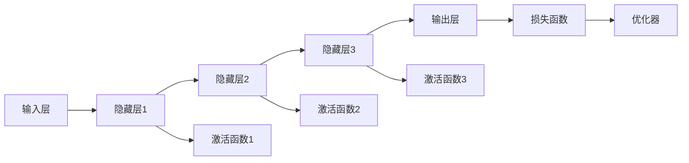

                 

## 1. 背景介绍

神经网络（Neural Networks）自1958年被首次提出以来，经历了多个发展阶段，从最初的感知机（Perceptron）到多层前馈神经网络（Multilayer Perceptron, MLP），再到卷积神经网络（Convolutional Neural Networks, CNN）、循环神经网络（Recurrent Neural Networks, RNN）以及最新的深度学习模型，如生成对抗网络（Generative Adversarial Networks, GANs）和变换器（Transformers）。神经网络在图像识别、语音识别、自然语言处理（Natural Language Processing, NLP）等诸多领域取得了突破性进展，被广泛应用于各种实际问题中。

尽管神经网络在分类、回归、生成等任务上表现优异，但其应用范围和潜力却远不止于此。本文将探讨神经网络的多样化应用场景，探讨其不仅作为一个分类器，更是强大的功能模块，能够处理更为复杂的数据模式和结构。

## 2. 核心概念与联系

### 2.1 核心概念概述

神经网络是一个由多个节点（或称神经元）构成的计算图，能够处理复杂数据模式和结构。一个典型的神经网络包括输入层、隐藏层和输出层，隐藏层数量可以根据任务复杂度进行调整。每个节点接收若干输入，经过一系列线性变换和非线性激活函数，最终生成输出。

以下是神经网络的主要组成部分和其核心概念：

- **输入层（Input Layer）**：接受原始数据输入。
- **隐藏层（Hidden Layer）**：包含多个中间层，用于数据特征的抽象和转换。
- **输出层（Output Layer）**：根据任务类型，生成分类、回归、概率分布等结果。
- **激活函数（Activation Function）**：用于非线性变换，如ReLU、Sigmoid、Tanh等。
- **损失函数（Loss Function）**：用于衡量模型预测结果与真实标签之间的差异，如交叉熵、均方误差等。
- **优化器（Optimizer）**：用于最小化损失函数，如梯度下降、Adam等。

这些核心概念相互联系，共同构成了一个完整的神经网络模型。

### 2.2 核心概念原理和架构的 Mermaid 流程图



## 3. 核心算法原理 & 具体操作步骤

### 3.1 算法原理概述

神经网络通过反向传播（Backpropagation）算法进行训练，通过前向传播（Forward Propagation）计算预测结果，再根据损失函数计算误差，通过反向传播更新模型参数。训练过程不断迭代，直到达到预设的停止条件。

### 3.2 算法步骤详解

1. **数据准备**：收集标注数据集，分为训练集、验证集和测试集，进行数据预处理和增强。
2. **模型搭建**：选择合适的神经网络结构和参数，如隐藏层数量、激活函数、损失函数等。
3. **模型训练**：使用训练集进行模型训练，设置合适的学习率和优化器，应用正则化技术，如L2正则、Dropout等。
4. **模型评估**：在验证集上评估模型性能，调整超参数，避免过拟合。
5. **模型测试**：在测试集上测试模型性能，进行预测和分析。

### 3.3 算法优缺点

**优点**：
- 强大的非线性拟合能力，适用于复杂的数据模式和结构。
- 自动学习特征表示，无需手工设计特征。
- 泛化能力强，适用于多种数据集和任务。

**缺点**：
- 计算复杂度高，需要大量计算资源。
- 模型复杂度高，可能存在过拟合风险。
- 参数调优困难，需要大量试验和经验。

### 3.4 算法应用领域

神经网络在计算机视觉、自然语言处理、语音识别、时间序列预测、推荐系统等诸多领域取得了成功应用。以下是几个主要应用场景：

- **图像识别**：如卷积神经网络（CNN）在图像分类、目标检测、语义分割等任务中表现优异。
- **自然语言处理**：如长短时记忆网络（LSTM）在语言模型、情感分析、机器翻译等任务中取得了突破。
- **语音识别**：如循环神经网络（RNN）和变分自编码器（VAE）在语音识别、语音合成等任务中应用广泛。
- **时间序列预测**：如LSTM在股票价格预测、天气预报、交通流量预测等任务中表现优异。
- **推荐系统**：如深度神经网络在协同过滤、物品推荐等任务中提高了推荐精度和多样性。

## 4. 数学模型和公式 & 详细讲解 & 举例说明

### 4.1 数学模型构建

神经网络的数学模型可以表示为：

$$
y = f(\theta(x))
$$

其中 $y$ 为输出，$\theta$ 为模型参数，$x$ 为输入，$f$ 为激活函数。

神经网络的优化目标是最小化损失函数 $L(y, y')$，其中 $y'$ 为模型预测输出。

### 4.2 公式推导过程

以二分类任务为例，假设模型输出为 $y = f(\theta(x))$，真实标签为 $y'$，损失函数为交叉熵损失函数，推导过程如下：

$$
L(y, y') = -(y \log y' + (1-y) \log (1-y'))
$$

前向传播计算预测输出：

$$
z = \theta(x) = Wz + b
$$

其中 $W$ 为权重矩阵，$b$ 为偏置向量。

激活函数通常采用ReLU：

$$
y' = f(z) = \max(0, z)
$$

反向传播计算梯度：

$$
\frac{\partial L}{\partial z} = -y \frac{1}{y'} + (1-y) \frac{1}{1-y'}
$$

通过链式法则，可以计算模型参数的梯度：

$$
\frac{\partial L}{\partial \theta} = \frac{\partial L}{\partial z} \frac{\partial z}{\partial \theta}
$$

### 4.3 案例分析与讲解

以手写数字识别为例，训练集包含样本和标签，使用卷积神经网络（CNN）进行训练。数据预处理包括归一化、数据增强等。搭建模型包括输入层、卷积层、池化层、全连接层等。设置优化器为Adam，学习率为0.001。训练过程中使用交叉熵损失函数，防止过拟合。最终在测试集上评估模型性能。

## 5. 项目实践：代码实例和详细解释说明

### 5.1 开发环境搭建

1. 安装Python和PyTorch：
```bash
pip install torch torchvision torchaudio
```

2. 安装TensorFlow和Keras：
```bash
pip install tensorflow keras
```

3. 安装MXNet和Gluon：
```bash
pip install mxnet gluon
```

### 5.2 源代码详细实现

以下是使用Keras框架实现手写数字识别的代码：

```python
import keras
from keras.datasets import mnist
from keras.models import Sequential
from keras.layers import Dense, Dropout, Flatten
from keras.layers import Conv2D, MaxPooling2D
from keras import backend as K

batch_size = 128
num_classes = 10
epochs = 12

# 加载数据集
(x_train, y_train), (x_test, y_test) = mnist.load_data()

# 数据预处理
x_train = x_train.reshape(x_train.shape[0], 28, 28, 1)
x_test = x_test.reshape(x_test.shape[0], 28, 28, 1)
x_train = x_train.astype('float32')
x_test = x_test.astype('float32')
x_train /= 255
x_test /= 255
y_train = keras.utils.to_categorical(y_train, num_classes)
y_test = keras.utils.to_categorical(y_test, num_classes)

# 搭建模型
model = Sequential()
model.add(Conv2D(32, kernel_size=(3, 3),
                 activation='relu',
                 input_shape=(28, 28, 1)))
model.add(Conv2D(64, (3, 3), activation='relu'))
model.add(MaxPooling2D(pool_size=(2, 2)))
model.add(Dropout(0.25))
model.add(Flatten())
model.add(Dense(128, activation='relu'))
model.add(Dropout(0.5))
model.add(Dense(num_classes, activation='softmax'))

# 编译模型
model.compile(loss=keras.losses.categorical_crossentropy,
              optimizer=keras.optimizers.Adadelta(),
              metrics=['accuracy'])

# 训练模型
model.fit(x_train, y_train,
          batch_size=batch_size,
          epochs=epochs,
          verbose=1,
          validation_data=(x_test, y_test))

# 评估模型
score = model.evaluate(x_test, y_test, verbose=0)
print('Test loss:', score[0])
print('Test accuracy:', score[1])
```

### 5.3 代码解读与分析

代码详细解释如下：
1. 导入必要的库和模块。
2. 加载MNIST数据集，并进行预处理。
3. 搭建卷积神经网络模型，包括卷积层、池化层、全连接层等。
4. 编译模型，设置损失函数和优化器。
5. 训练模型，设置训练轮数、批大小等。
6. 评估模型，计算测试集上的准确率。

## 6. 实际应用场景

### 6.4 未来应用展望

未来，神经网络将拓展到更多领域，发挥其强大的功能。以下是一些可能的应用方向：

1. **自动驾驶**：神经网络可用于图像识别、目标检测、路径规划等任务，助力自动驾驶技术的发展。
2. **医疗诊断**：神经网络可用于医学图像分析、疾病预测、治疗方案优化等任务，提高医疗诊断的准确性和效率。
3. **金融预测**：神经网络可用于股票价格预测、风险评估、信用评分等任务，为金融市场提供预测支持。
4. **能源管理**：神经网络可用于电力负荷预测、设备故障检测、能源优化等任务，提升能源管理水平。
5. **智能制造**：神经网络可用于质量检测、异常检测、生产调度等任务，推动智能制造的发展。

## 7. 工具和资源推荐

### 7.1 学习资源推荐

1. 《Deep Learning》 by Ian Goodfellow, Yoshua Bengio, and Aaron Courville：经典的深度学习教材，涵盖神经网络的基本概念和算法。
2. 《Hands-On Machine Learning with Scikit-Learn, Keras, and TensorFlow》 by Aurélien Géron：实用深度学习教程，适合初学者入门。
3. 《Neural Networks and Deep Learning》 by Michael Nielsen：通俗易懂的网络理论基础教材，适合自学。
4. Coursera上的《Deep Learning Specialization》 by Andrew Ng：由Coursera和斯坦福大学联合开设的深度学习课程，深入浅出地讲解神经网络。
5. arXiv.org上的最新研究论文：持续关注最新研究动态，了解前沿技术进展。

### 7.2 开发工具推荐

1. PyTorch：灵活易用的深度学习框架，适合研究和实验。
2. TensorFlow：强大的生产部署平台，适合工业应用。
3. Keras：简洁易用的深度学习框架，适合快速原型开发。
4. MXNet：高效易扩展的深度学习框架，适合分布式训练。
5. Gluon：基于MXNet的高层接口，适合快速实现深度学习模型。

### 7.3 相关论文推荐

1. Yann LeCun, Yoshua Bengio, Geoffrey Hinton. "Deep Learning" - Nature 2015
2. Ian Goodfellow, Yoshua Bengio, Aaron Courville. "Deep Learning" - MIT Press 2016
3. Geoffrey Hinton, Yoshua Bengio, and Yann LeCun. "Deep Learning" - NIPS 2012
4. Alex Krizhevsky, Ilya Sutskever, and Geoffrey Hinton. "ImageNet Classification with Deep Convolutional Neural Networks" - NIPS 2012
5. Andrej Karpathy, Justin Johnson, and Fei-Fei Li. "Visual Geometry Group" - arXiv 2014

## 8. 总结：未来发展趋势与挑战

### 8.1 研究成果总结

神经网络作为一种强大的计算模型，在过去几十年中取得了巨大的成功，并在多个领域实现了突破。未来，神经网络将继续拓展其应用范围，提升其性能和效率，同时解决其面临的挑战。

### 8.2 未来发展趋势

1. **更高效的神经网络结构**：未来的神经网络结构将更加灵活和高效，如Transformer、ResNet、Inception等。
2. **更强的自适应能力**：神经网络将能够更好地适应不同任务和数据集，如自适应学习、迁移学习等。
3. **更强的泛化能力**：神经网络将能够更好地泛化到新的数据和任务，如通用预训练、跨领域微调等。
4. **更强的可解释性**：神经网络将能够提供更可解释的模型决策过程，如可视化、解释器等。
5. **更强的鲁棒性**：神经网络将能够更好地抵御噪声和攻击，如对抗训练、鲁棒性测试等。

### 8.3 面临的挑战

尽管神经网络在多个领域取得了成功，但其应用也面临一些挑战：

1. **计算资源消耗**：神经网络的训练和推理需要大量的计算资源，如何提升效率是一个重要问题。
2. **模型复杂性**：神经网络的参数数量和计算复杂度较高，容易过拟合和出现梯度消失等问题。
3. **数据依赖性**：神经网络需要大量的标注数据进行训练，数据获取和标注成本较高。
4. **模型可解释性**：神经网络通常被视为"黑盒"模型，其决策过程难以解释，需要进一步提升可解释性。
5. **模型安全性**：神经网络可能受到攻击和误用，需要保证其安全性和伦理性。

### 8.4 研究展望

未来的研究将集中在以下几个方面：

1. **更高效的神经网络结构**：研究新的网络结构，如卷积神经网络、循环神经网络、自注意力机制等。
2. **更强的自适应能力**：研究自适应学习、迁移学习、元学习等技术，提升模型的适应性和泛化能力。
3. **更强的可解释性**：研究模型解释技术，如可视化、解释器、可解释性模型等。
4. **更强的鲁棒性**：研究对抗训练、鲁棒性测试等技术，提升模型的鲁棒性和安全性。
5. **更广泛的应用领域**：研究神经网络在更多领域的应用，如自动驾驶、医疗诊断、金融预测等。

## 9. 附录：常见问题与解答

**Q1: 神经网络是否适用于所有问题？**

A: 神经网络在处理具有高度非线性特征和复杂模式的数据时表现优异，但对于线性可分或模式简单的数据，可能不如其他模型。

**Q2: 神经网络在训练过程中如何避免过拟合？**

A: 常见的方法包括使用正则化技术（如L2正则、Dropout）、早停（Early Stopping）、数据增强、模型简化等。

**Q3: 神经网络在实际应用中如何处理噪声和异常值？**

A: 可以采用异常检测技术，如离群值检测、鲁棒性训练等，提升模型的鲁棒性。

**Q4: 神经网络在实际应用中如何提高模型的可解释性？**

A: 可以采用可视化技术，如梯度可视化、特征可视化等，解释模型的决策过程。

**Q5: 神经网络在实际应用中如何保证模型安全性？**

A: 可以采用模型加密、数据脱敏、访问控制等措施，保障数据和模型安全。

---

作者：禅与计算机程序设计艺术 / Zen and the Art of Computer Programming

