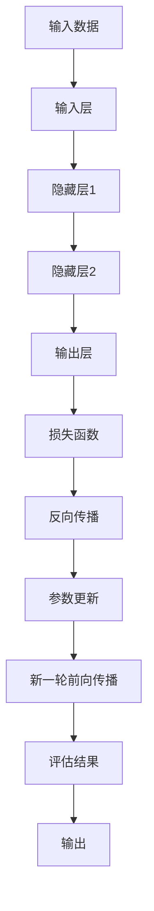
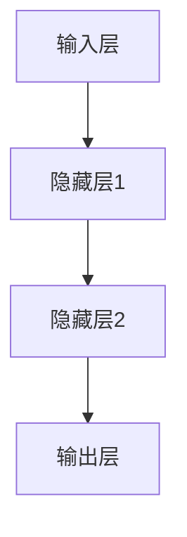

                 

## 1. 背景介绍

### 1.1 问题由来

人工智能（AI）领域在过去几十年中取得了令人瞩目的进展，尤其是在深度学习（Deep Learning）和机器学习（Machine Learning）领域。然而，传统的符号主义人工智能方法在处理大规模复杂问题时显得力不从心，难以充分发挥数据驱动的能力。为了应对这种挑战，神经网络（Neural Networks）应运而生，开启了一个智能的新纪元。

神经网络是模拟人脑神经元网络结构的计算模型，通过大量数据进行训练，自动发现数据中的模式和规律。它们在图像识别、自然语言处理、语音识别、推荐系统等多个领域展示了强大的性能，成为现代AI技术的核心。

### 1.2 问题核心关键点

神经网络之所以能够实现如此惊人的表现，其关键在于以下几个方面：

1. **并行处理能力**：神经网络的计算单元（神经元）可以并行处理大量数据，使得大规模深度学习任务成为可能。

2. **端到端学习**：神经网络能够直接从原始数据中学习特征表示，避免了人工特征工程的步骤，提升了模型的泛化能力。

3. **自适应学习**：通过反向传播算法，神经网络可以动态调整参数，适应数据分布的变化。

4. **丰富的表达能力**：多层神经网络可以表达非线性关系，捕捉复杂的数据结构。

5. **大规模数据利用**：深度学习模型通常需要大量数据进行训练，但随着数据量的增加，其性能也随之提升。

6. **泛化能力**：经过良好训练的神经网络能够在未见过的数据上表现良好，具有一定的泛化能力。

这些核心关键点使得神经网络在各种复杂问题上取得了显著的成就，成为现代AI技术的基石。

### 1.3 问题研究意义

神经网络的研究对于人工智能的发展具有深远意义：

1. **提升计算效率**：通过并行处理和端到端学习，神经网络能够显著提升计算效率，加速模型训练。

2. **降低模型复杂度**：神经网络能够自动发现数据中的特征表示，减少了人工特征工程的需求，使得模型更加简洁高效。

3. **增强模型泛化能力**：通过自适应学习和大规模数据利用，神经网络能够捕捉数据中的复杂模式，提升模型泛化能力。

4. **推动产业应用**：神经网络在图像识别、语音识别、自然语言处理等领域的应用，推动了人工智能技术的产业化进程，加速了智能应用落地。

5. **促进理论研究**：神经网络的广泛应用也推动了理论研究的深入，提升了对人工智能算法的理解和应用。

## 2. 核心概念与联系

### 2.1 核心概念概述

为了深入理解神经网络的工作原理，本节将介绍几个关键概念：

1. **神经网络**：由多个层次构成的计算模型，每个层次由多个神经元组成，通过权重连接，实现特征表示的层次化提取。

2. **前向传播**：神经网络的数据从输入层开始，通过层次化提取特征，最终输出结果的过程。

3. **反向传播**：通过误差回传，调整神经网络的权重，优化模型的过程。

4. **梯度下降**：优化算法的一种，通过计算损失函数的梯度，逐步更新模型参数，最小化损失函数。

5. **损失函数**：用于衡量模型预测与真实标签之间的差异，常见的有交叉熵、均方误差等。

6. **激活函数**：用于非线性变换，增强神经网络的表达能力。

7. **过拟合与正则化**：模型在训练集上过拟合，过度拟合训练数据，导致泛化能力不足，需要通过正则化技术进行缓解。

这些概念之间存在紧密的联系，构成了神经网络模型的核心框架，其交互作用使得神经网络能够高效地处理复杂数据，并实现泛化学习。

### 2.2 核心概念原理和架构的 Mermaid 流程图



这个流程图展示了神经网络的基本架构和流程：

1. **输入数据**：神经网络的数据源，可以是图像、文本、音频等多种形式。

2. **输入层**：将数据转换为模型可以处理的向量形式。

3. **隐藏层**：通过非线性变换，提取数据中的高级特征。

4. **输出层**：根据隐藏层的特征表示，输出模型的预测结果。

5. **损失函数**：衡量模型预测与真实标签之间的差异。

6. **反向传播**：通过误差回传，调整神经网络的权重，最小化损失函数。

7. **参数更新**：根据梯度下降等优化算法，更新模型参数。

8. **评估结果**：对模型在新数据上的表现进行评估，确保泛化能力。

9. **输出**：最终输出模型的预测结果。

通过这些组件的协同工作，神经网络能够高效地处理复杂数据，并实现高质量的预测。

## 3. 核心算法原理 & 具体操作步骤

### 3.1 算法原理概述

神经网络的核心算法包括前向传播、反向传播和梯度下降等。其基本原理是通过大量数据训练模型，自动发现数据中的模式和规律，从而实现高效的特征表示和预测。

### 3.2 算法步骤详解

神经网络模型的训练主要包括以下几个关键步骤：

1. **数据预处理**：将原始数据转换为模型可以处理的格式，如归一化、标准化等。

2. **模型初始化**：随机初始化神经网络的权重和偏置，开始训练过程。

3. **前向传播**：输入数据通过模型各层进行前向传播，计算输出结果。

4. **损失函数计算**：将模型输出与真实标签进行比较，计算损失函数。

5. **反向传播**：通过误差回传，计算每个神经元对损失函数的贡献，更新权重和偏置。

6. **参数更新**：根据梯度下降等优化算法，更新模型参数，最小化损失函数。

7. **评估结果**：在新数据上评估模型表现，确保泛化能力。

8. **重复训练**：重复以上步骤，直至模型收敛或达到预设的迭代次数。

### 3.3 算法优缺点

神经网络的优点：

1. **强大的特征提取能力**：通过多层非线性变换，神经网络能够自动提取数据中的高级特征，提升模型的泛化能力。

2. **高效的并行处理**：神经网络的计算单元可以并行处理大量数据，加速模型训练和推理。

3. **端到端学习**：通过反向传播算法，神经网络能够直接从原始数据中学习特征表示，避免了人工特征工程的步骤。

神经网络的缺点：

1. **计算资源需求高**：神经网络通常需要大量数据进行训练，需要高性能的计算资源，如GPU、TPU等。

2. **模型复杂度高**：深度学习模型通常结构复杂，参数量巨大，训练和推理效率较低。

3. **容易过拟合**：神经网络在训练集上表现良好，但在测试集上泛化能力不足，容易过拟合。

4. **可解释性不足**：神经网络通常是"黑盒"模型，难以解释其内部工作机制和决策逻辑。

5. **对数据质量敏感**：神经网络对训练数据的质量和数量敏感，需要大量的高质量数据进行训练。

### 3.4 算法应用领域

神经网络在多个领域都有广泛应用，以下是几个典型应用：

1. **计算机视觉**：图像识别、目标检测、图像生成等。

2. **自然语言处理**：机器翻译、语音识别、文本生成等。

3. **语音识别**：语音转文本、说话人识别等。

4. **推荐系统**：商品推荐、广告推荐等。

5. **金融分析**：股票预测、风险评估等。

6. **医学诊断**：疾病诊断、医学图像分析等。

7. **智能控制**：自动驾驶、机器人控制等。

## 4. 数学模型和公式 & 详细讲解 & 举例说明

### 4.1 数学模型构建

神经网络可以通过数学模型进行描述。一个典型的前馈神经网络包含输入层、隐藏层和输出层，如图1所示。



图1：典型前馈神经网络结构

其中，$x$ 表示输入向量，$h$ 表示隐藏层的特征表示，$y$ 表示输出向量。每个神经元可以表示为 $x \times w + b$，其中 $w$ 表示权重，$b$ 表示偏置。

### 4.2 公式推导过程

以最简单的单层神经网络为例，其前向传播和反向传播的公式推导如下：

**前向传播**：

$$
h = \sigma(x \times w + b)
$$

其中，$\sigma$ 表示激活函数。

**损失函数**：

$$
\mathcal{L} = \frac{1}{N} \sum_{i=1}^N \ell(y_i, \hat{y}_i)
$$

其中，$\ell$ 表示损失函数，$\hat{y}_i$ 表示模型预测结果。

**反向传播**：

$$
\frac{\partial \mathcal{L}}{\partial w} = \frac{\partial \mathcal{L}}{\partial h} \times \frac{\partial h}{\partial w} = \frac{\partial \mathcal{L}}{\partial h} \times \sigma'(x \times w + b) \times x
$$

其中，$\sigma'$ 表示激活函数的导数。

### 4.3 案例分析与讲解

以图像分类为例，神经网络可以通过卷积神经网络（CNN）进行处理。CNN通过卷积层、池化层和全连接层，自动提取图像特征，实现高效的图像分类。

假设我们有一个手写数字识别任务，数据集包含大量手写数字图片和其对应的标签。我们首先将图片转换为向量形式，输入到卷积神经网络中进行特征提取和分类。

**数据预处理**：将图片转换为向量，并进行归一化处理。

**模型初始化**：随机初始化卷积核、偏置和全连接层的权重。

**前向传播**：通过卷积层和池化层，提取图像特征。将特征向量输入到全连接层，进行分类。

**损失函数计算**：将模型预测结果与真实标签进行比较，计算交叉熵损失。

**反向传播**：通过误差回传，更新卷积核、偏置和全连接层的权重。

**参数更新**：根据梯度下降等优化算法，更新模型参数。

**评估结果**：在新数据上评估模型表现，确保泛化能力。

## 5. 项目实践：代码实例和详细解释说明

### 5.1 开发环境搭建

在进行神经网络项目开发前，我们需要准备好开发环境。以下是使用Python进行TensorFlow开发的快速搭建步骤：

1. 安装TensorFlow：通过pip安装TensorFlow库。

2. 安装相关依赖：安装numpy、matplotlib等必要的库。

3. 设置虚拟环境：创建虚拟环境，避免与其他项目冲突。

4. 安装GPU驱动：确保你的GPU驱动和CUDA版本与TensorFlow兼容。

完成以上步骤后，即可在虚拟环境中开始神经网络项目的开发。

### 5.2 源代码详细实现

以下是使用TensorFlow进行手写数字识别的完整代码实现：

```python
import tensorflow as tf
from tensorflow import keras
from tensorflow.keras import layers

# 加载数据集
(x_train, y_train), (x_test, y_test) = keras.datasets.mnist.load_data()

# 数据预处理
x_train = x_train.reshape(-1, 28, 28, 1) / 255.0
x_test = x_test.reshape(-1, 28, 28, 1) / 255.0

# 定义模型
model = keras.Sequential([
    layers.Conv2D(32, 3, activation='relu', input_shape=(28, 28, 1)),
    layers.MaxPooling2D(),
    layers.Flatten(),
    layers.Dense(64, activation='relu'),
    layers.Dense(10)
])

# 编译模型
model.compile(optimizer='adam', loss=tf.keras.losses.SparseCategoricalCrossentropy(from_logits=True), metrics=['accuracy'])

# 训练模型
model.fit(x_train, y_train, epochs=5, batch_size=64, validation_data=(x_test, y_test))

# 评估模型
model.evaluate(x_test, y_test, batch_size=64)
```

### 5.3 代码解读与分析

让我们再详细解读一下关键代码的实现细节：

1. **加载数据集**：使用Keras的`load_data`函数加载MNIST数据集，并划分为训练集和测试集。

2. **数据预处理**：将图像数据转换为模型可以处理的格式，并进行归一化处理。

3. **定义模型**：使用Keras的Sequential模型，定义卷积层、池化层和全连接层。

4. **编译模型**：指定优化器、损失函数和评估指标，准备模型训练。

5. **训练模型**：使用`fit`函数进行模型训练，设置训练轮数和批大小。

6. **评估模型**：使用`evaluate`函数在测试集上评估模型性能。

通过上述代码，我们构建了一个简单的卷积神经网络，用于手写数字识别。在训练过程中，TensorFlow自动计算梯度，并更新模型参数。最终，我们得到了一个具有较高准确率的数字识别模型。

## 6. 实际应用场景

### 6.1 智能客服系统

智能客服系统是神经网络应用的重要场景之一。通过神经网络，智能客服系统能够理解用户意图，自动回答用户问题，提升客户咨询体验。

以一个智能客服系统为例，我们可以使用神经网络模型对用户的提问进行分类和分析，从而自动匹配最合适的答案模板，实现智能客服。

**数据预处理**：收集用户的历史咨询记录，将问题进行分类。

**模型训练**：使用神经网络模型对分类问题进行训练，提升分类准确率。

**智能客服**：在用户咨询时，输入问题，使用训练好的模型进行分类和分析，自动匹配答案模板。

**系统优化**：根据用户反馈，不断优化模型，提升智能客服系统的性能。

### 6.2 金融舆情监测

金融舆情监测是神经网络应用的另一个重要场景。通过神经网络，金融舆情监测系统能够实时监测市场舆论动向，预警风险，提升金融决策的准确性。

以一个金融舆情监测系统为例，我们可以使用神经网络模型对新闻、评论等金融数据进行情感分析，从而实时监测市场情绪，预警风险。

**数据预处理**：收集金融领域的各类数据，进行文本清洗和情感标注。

**模型训练**：使用神经网络模型对情感分类问题进行训练，提升情感分类准确率。

**实时监测**：实时抓取网络金融数据，输入到训练好的模型中进行情感分析。

**预警系统**：根据情感分析结果，实时预警市场风险，提升金融决策的准确性。

### 6.3 个性化推荐系统

个性化推荐系统是神经网络应用的典型场景。通过神经网络，个性化推荐系统能够根据用户历史行为和偏好，推荐合适的商品或内容。

以一个个性化推荐系统为例，我们可以使用神经网络模型对用户行为和商品特征进行建模，从而实现个性化推荐。

**数据预处理**：收集用户的历史行为数据和商品特征数据，进行清洗和处理。

**模型训练**：使用神经网络模型对用户行为和商品特征进行建模，提升推荐精度。

**推荐系统**：根据用户输入的数据，使用训练好的模型进行预测，推荐合适的商品或内容。

**系统优化**：根据用户反馈，不断优化模型，提升推荐系统的性能。

## 7. 工具和资源推荐

### 7.1 学习资源推荐

为了帮助开发者系统掌握神经网络的理论基础和实践技巧，这里推荐一些优质的学习资源：

1. 《深度学习》系列书籍：由Ian Goodfellow等专家所著，深入浅出地介绍了深度学习的基本概念和算法。

2. 《神经网络与深度学习》系列课程：由斯坦福大学Andrew Ng教授主讲，系统讲解了神经网络的理论和实践。

3. TensorFlow官方文档：TensorFlow的官方文档，提供了丰富的示例代码和详细的API说明，是学习和实践神经网络的重要资源。

4. PyTorch官方文档：PyTorch的官方文档，提供了丰富的示例代码和详细的API说明，是学习和实践神经网络的重要资源。

5. Keras官方文档：Keras的官方文档，提供了简单易用的接口，适合初学者快速上手。

通过对这些资源的学习实践，相信你一定能够快速掌握神经网络的理论基础和实践技巧，并用于解决实际的NLP问题。

### 7.2 开发工具推荐

高效的开发离不开优秀的工具支持。以下是几款用于神经网络开发的常用工具：

1. TensorFlow：由Google主导开发的开源深度学习框架，支持GPU/TPU计算，适合大规模工程应用。

2. PyTorch：由Facebook主导开发的开源深度学习框架，灵活动态的计算图，适合快速迭代研究。

3. Keras：基于TensorFlow和Theano的高级API，提供简单易用的接口，适合初学者快速上手。

4. Weights & Biases：模型训练的实验跟踪工具，可以记录和可视化模型训练过程中的各项指标，方便对比和调优。

5. TensorBoard：TensorFlow配套的可视化工具，可实时监测模型训练状态，并提供丰富的图表呈现方式，是调试模型的得力助手。

合理利用这些工具，可以显著提升神经网络开发的效率，加快创新迭代的步伐。

### 7.3 相关论文推荐

神经网络的研究源于学界的持续研究。以下是几篇奠基性的相关论文，推荐阅读：

1. "Deep Learning" by Ian Goodfellow et al.：介绍了深度学习的原理和算法，是神经网络研究的重要教材。

2. "ImageNet Classification with Deep Convolutional Neural Networks" by Alex Krizhevsky et al.：提出了卷积神经网络（CNN），为图像识别奠定了基础。

3. "Natural Language Processing with Transformers" by Jacob Devlin et al.：介绍了Transformer模型，展示了其在自然语言处理中的卓越性能。

4. "Playing Atari with Deep Reinforcement Learning" by Volodymyr Mnih et al.：展示了神经网络在强化学习中的应用，推动了深度学习技术的发展。

5. "Attention is All You Need" by Ashish Vaswani et al.：提出了Transformer模型，改变了自然语言处理的研究范式。

这些论文代表了大神经网络微调技术的发展脉络。通过学习这些前沿成果，可以帮助研究者把握学科前进方向，激发更多的创新灵感。

## 8. 总结：未来发展趋势与挑战

### 8.1 总结

本文对神经网络的工作原理和实际应用进行了全面系统的介绍。首先阐述了神经网络的研究背景和意义，明确了神经网络在人工智能发展中的重要地位。其次，从原理到实践，详细讲解了神经网络的基本算法和操作步骤，给出了神经网络应用的完整代码实例。同时，本文还探讨了神经网络在智能客服、金融舆情、个性化推荐等多个行业领域的应用前景，展示了神经网络技术的应用潜力。

通过本文的系统梳理，可以看到，神经网络在多个领域展现了强大的性能和应用价值。其并行处理能力和端到端学习机制，使得神经网络能够高效地处理复杂数据，并实现泛化学习。未来，伴随神经网络模型的不断演进，其在各个领域的应用将更加广泛，推动人工智能技术的进一步发展。

### 8.2 未来发展趋势

展望未来，神经网络的发展趋势如下：

1. **模型规模继续增大**：随着算力成本的下降和数据规模的扩张，神经网络模型的参数量还将持续增长，超大规模模型将进一步提升特征表示能力。

2. **端到端学习优化**：未来神经网络将更加注重端到端学习的优化，通过自监督学习、主动学习等方法，减少人工干预，提升模型泛化能力。

3. **多模态神经网络**：神经网络将更好地融合视觉、语音、文本等多种模态信息，实现多模态信息的全方位感知。

4. **自适应学习**：神经网络将更加注重自适应学习，动态调整模型参数，适应数据分布的变化。

5. **知识图谱融合**：神经网络将更好地与知识图谱等专家知识结合，增强模型推理能力和泛化能力。

6. **跨领域应用**：神经网络将在更多领域得到应用，推动人工智能技术的产业化进程，提升社会生产力。

这些趋势将进一步推动神经网络技术的发展，使其在各个领域发挥更大的作用。

### 8.3 面临的挑战

尽管神经网络技术取得了显著进展，但在迈向更加智能化、普适化应用的过程中，仍面临诸多挑战：

1. **计算资源瓶颈**：神经网络模型通常需要大量数据进行训练，需要高性能的计算资源，如GPU/TPU等。计算资源的限制成为制约神经网络发展的重要因素。

2. **模型复杂度高**：神经网络模型的结构复杂，参数量巨大，训练和推理效率较低。模型压缩和优化技术成为研究的重点。

3. **可解释性不足**：神经网络模型通常是"黑盒"模型，难以解释其内部工作机制和决策逻辑。模型的可解释性亟需加强。

4. **数据质量敏感**：神经网络模型对训练数据的质量和数量敏感，需要大量的高质量数据进行训练。

5. **模型鲁棒性不足**：神经网络模型在训练集上过拟合，容易导致过拟合，降低泛化能力。

6. **安全性和可靠性**：神经网络模型在实际应用中可能存在安全隐患，如模型偏见、误导性输出等。

这些挑战需要研究者持续努力，通过优化模型结构和训练算法，提升神经网络的性能和可靠性。

### 8.4 研究展望

面对神经网络技术面临的挑战，未来的研究需要在以下几个方面寻求新的突破：

1. **优化模型结构**：开发更加简洁高效的神经网络结构，降低模型复杂度，提升训练和推理效率。

2. **改进训练算法**：开发更加高效的优化算法，如自适应学习、对抗训练等，提升模型泛化能力。

3. **增强模型可解释性**：开发可解释性较强的神经网络模型，增强模型的透明性和可信度。

4. **提升数据质量**：通过数据增强、数据清洗等方法，提升训练数据的质量和数量。

5. **改进模型鲁棒性**：通过正则化、对抗训练等方法，提升模型的鲁棒性和泛化能力。

6. **提升模型安全性**：开发安全性较高的神经网络模型，避免模型偏见和误导性输出，确保模型的可靠性。

通过这些研究方向的探索发展，相信神经网络技术将迎来更加广泛的应用，推动人工智能技术迈向更加智能化、普适化的方向。

## 9. 附录：常见问题与解答

**Q1：神经网络是否适用于所有机器学习任务？**

A: 神经网络适用于大多数机器学习任务，特别是需要处理非线性数据的任务。但对于一些特定的任务，如回归、分类等，传统的机器学习算法可能更适合。需要根据具体任务的特点进行选择。

**Q2：神经网络模型如何避免过拟合？**

A: 避免过拟合是神经网络训练的重要问题。常见的解决方法包括：

1. 数据增强：通过数据增强方法，扩充训练集。

2. 正则化：使用L2正则化、Dropout等方法，防止过拟合。

3. 早期停止：根据验证集的性能，提前终止训练。

4. 模型裁剪：通过裁剪模型的部分层或参数，减少模型的复杂度。

5. 学习率调优：通过学习率调度策略，逐渐减小学习率。

这些方法可以有效地缓解神经网络模型的过拟合问题，提升模型的泛化能力。

**Q3：神经网络在实际应用中需要注意哪些问题？**

A: 神经网络在实际应用中需要注意以下问题：

1. 模型部署：将训练好的模型部署到生产环境中，需要进行模型压缩、量化等优化，提升推理效率。

2. 模型监控：实时监控模型的运行状态，设置异常告警阈值，确保模型稳定性。

3. 数据安全：保护用户数据隐私，确保模型使用的数据符合法律法规。

4. 模型更新：根据新数据不断更新模型，保持模型性能和适应性。

5. 模型解释：提供模型解释，增强模型的透明性和可信度。

这些问题需要在模型部署和应用过程中综合考虑，以确保神经网络模型的性能和可靠性。

**Q4：神经网络模型如何提升性能？**

A: 提升神经网络模型性能的方法包括：

1. 增加数据量：增加训练数据量，提升模型的泛化能力。

2. 优化模型结构：优化模型结构，降低模型复杂度，提升训练和推理效率。

3. 改进训练算法：改进训练算法，如自适应学习、对抗训练等，提升模型泛化能力。

4. 引入先验知识：引入先验知识，如知识图谱、逻辑规则等，提升模型的推理能力和泛化能力。

5. 多模态融合：融合视觉、语音、文本等多种模态信息，实现多模态信息的全方位感知。

通过这些方法，可以有效提升神经网络模型的性能和可靠性，推动其在更多领域的广泛应用。

---

作者：禅与计算机程序设计艺术 / Zen and the Art of Computer Programming

