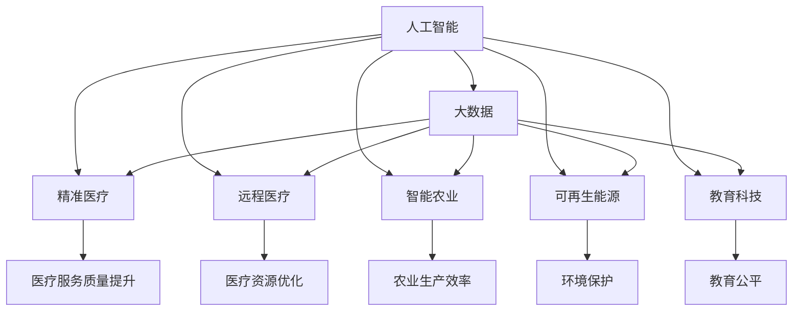

                 

# 科技发展：人类福祉的保障

> 关键词：科技发展，人工智能，大数据，医疗健康，环境保护，教育公平

## 1. 背景介绍

### 1.1 问题由来

当前，科技发展已经成为全球关注的热点话题。科技的迅猛发展，尤其是人工智能、大数据等技术的广泛应用，极大地推动了社会经济的进步，改善了人们的生活质量。然而，科技进步在带来福祉的同时，也引发了一系列新的问题，如就业冲击、数据隐私、伦理道德等。如何在科技进步与人类福祉之间找到平衡点，成为我们必须面对的重大挑战。

### 1.2 问题核心关键点

1. **科技发展**：科技的快速进步，尤其是信息技术、生物技术、空间技术等的飞速发展，极大地提升了人类生活质量，但同时也带来了就业结构变化、数据隐私泄露等新问题。
2. **人工智能**：人工智能技术的广泛应用，虽然在医疗、教育、环境保护等领域取得了显著成效，但也引发了对算法透明性、可解释性的担忧，以及可能导致就业岗位的减少。
3. **大数据**：大数据技术的广泛应用，虽然在科学研究、商业决策、公共管理等方面发挥了重要作用，但也带来了数据隐私保护、信息安全等新的挑战。
4. **医疗健康**：医疗健康领域的科技发展，如精准医疗、远程医疗等，极大地提升了医疗服务的质量和效率，但也引发了对医疗数据隐私保护、医疗伦理等问题的关注。
5. **环境保护**：环境监测、智能农业、可再生能源等科技手段的应用，显著提升了环境保护的效率，但也带来了对科技发展对环境影响的评估和监管问题。
6. **教育公平**：人工智能和教育科技的应用，如智能辅导系统、个性化教育等，显著提高了教育质量，但也引发了对教育资源分配不均、教育公平性等问题的讨论。

## 2. 核心概念与联系

### 2.1 核心概念概述

为更好地理解科技发展对人类福祉的影响，本节将介绍几个密切相关的核心概念：

- **人工智能**：一种通过计算机模拟人类智能的技术，包括但不限于机器学习、深度学习、自然语言处理、计算机视觉等。
- **大数据**：指超大规模、复杂、多样的数据集合，可以用于提取有价值的信息、发现规律、预测趋势等。
- **精准医疗**：利用基因组学、生物信息学、人工智能等技术，对疾病进行个性化、精确化的治疗。
- **远程医疗**：通过互联网、通信技术，实现医疗服务的远程提供和监测。
- **智能农业**：应用人工智能、物联网等技术，实现农业生产管理的智能化、自动化。
- **可再生能源**：如太阳能、风能、水能等，通过科技创新实现清洁、可再生的能源替代传统化石能源。
- **教育科技**：利用信息技术、人工智能等手段，改善教育教学质量、提高教育效率。

这些核心概念之间通过以下Mermaid流程图进行展示：



这个流程图展示了各个概念之间的联系和作用：

1. 人工智能和大数据紧密相连，相互促进。
2. 人工智能和大数据在精准医疗、远程医疗、智能农业、可再生能源、教育科技等领域均有重要应用。
3. 人工智能和大数据的应用，分别带来了医疗服务质量提升、医疗资源优化、农业生产效率、环境保护、教育公平等积极影响。

## 3. 核心算法原理 & 具体操作步骤
### 3.1 算法原理概述

科技发展与人类福祉的保障，本质上是一个复杂的系统工程，涉及多学科、多领域的知识和技术。以下将从人工智能、大数据、精准医疗、远程医疗、智能农业、可再生能源、教育科技等关键领域，详细介绍其核心算法原理。

### 3.2 算法步骤详解

#### 3.2.1 人工智能

人工智能的核心算法包括但不限于：

1. **机器学习**：通过算法让机器从数据中学习规律，用于分类、预测、聚类等任务。
2. **深度学习**：基于人工神经网络的多层非线性模型，用于图像识别、语音识别、自然语言处理等任务。
3. **自然语言处理**：让机器理解、处理和生成自然语言，用于机器翻译、文本分类、问答系统等任务。

#### 3.2.2 大数据

大数据的核心算法包括但不限于：

1. **数据清洗和预处理**：去除噪声、处理缺失值、特征工程等。
2. **数据存储和管理**：分布式存储和处理技术，如Hadoop、Spark等。
3. **数据挖掘和分析**：聚类、分类、关联规则挖掘等算法。

#### 3.2.3 精准医疗

精准医疗的核心算法包括但不限于：

1. **基因组学**：通过基因测序、基因编辑等技术，解析基因信息，用于疾病诊断和治疗。
2. **生物信息学**：通过数据处理、分析，提取基因序列、蛋白质序列等生物信息。
3. **机器学习**：用于疾病预测、基因分析等任务。

#### 3.2.4 远程医疗

远程医疗的核心算法包括但不限于：

1. **传感器技术**：用于实时监测生命体征、健康状况。
2. **互联网技术**：用于数据传输、通信。
3. **自然语言处理**：用于患者与医生的实时交流。

#### 3.2.5 智能农业

智能农业的核心算法包括但不限于：

1. **物联网**：用于实时监测环境、作物状态。
2. **机器学习**：用于数据分析、预测、决策。
3. **计算机视觉**：用于图像识别、分类、检测。

#### 3.2.6 可再生能源

可再生能源的核心算法包括但不限于：

1. **太阳能、风能、水能等**：通过物理模型、数学建模，优化资源利用。
2. **模拟与优化**：通过仿真、优化算法，提高能源转换效率。
3. **控制与调度**：用于能源系统的控制和调度。

#### 3.2.7 教育科技

教育科技的核心算法包括但不限于：

1. **智能辅导系统**：基于机器学习、自然语言处理等技术，提供个性化辅导。
2. **在线学习平台**：基于大数据、自然语言处理等技术，提供个性化学习路径。
3. **虚拟现实与增强现实**：用于模拟实验、场景重建等。

### 3.3 算法优缺点

#### 3.3.1 人工智能

- **优点**：
  1. 提升工作效率，降低人力成本。
  2. 提供精准诊断，提升医疗服务质量。
  3. 优化资源分配，提升农业生产效率。
  4. 改善教育效果，实现个性化教育。
- **缺点**：
  1. 可能导致就业岗位减少，引发社会问题。
  2. 数据隐私泄露，引发伦理道德争议。
  3. 算法透明性、可解释性不足，引发信任问题。

#### 3.3.2 大数据

- **优点**：
  1. 数据驱动决策，提升决策科学性。
  2. 优化资源配置，提升服务效率。
  3. 实时监测环境，提升环保效果。
- **缺点**：
  1. 数据隐私泄露，引发伦理道德争议。
  2. 数据存储和处理成本高，引发资源浪费。
  3. 数据质量问题，引发决策误导。

#### 3.3.3 精准医疗

- **优点**：
  1. 提升医疗服务质量，提供个性化治疗。
  2. 优化资源配置，提升医疗效率。
- **缺点**：
  1. 数据隐私泄露，引发伦理道德争议。
  2. 技术成本高，引发资源分配不均。
  3. 基因编辑技术，引发伦理道德争议。

#### 3.3.4 远程医疗

- **优点**：
  1. 提升医疗服务可及性，优化资源配置。
  2. 实时监测健康状况，提升健康管理效果。
- **缺点**：
  1. 数据隐私泄露，引发伦理道德争议。
  2. 技术成本高，引发资源分配不均。
  3. 网络安全问题，引发数据泄露风险。

#### 3.3.5 智能农业

- **优点**：
  1. 提升农业生产效率，降低生产成本。
  2. 优化资源配置，提升环境保护效果。
- **缺点**：
  1. 技术成本高，引发资源分配不均。
  2. 数据隐私泄露，引发伦理道德争议。
  3. 技术推广难度大，引发教育公平问题。

#### 3.3.6 可再生能源

- **优点**：
  1. 提升能源利用效率，减少环境污染。
  2. 优化资源配置，提升能源安全。
- **缺点**：
  1. 技术成本高，引发资源分配不均。
  2. 技术推广难度大，引发教育公平问题。
  3. 技术复杂性高，引发实施难度。

#### 3.3.7 教育科技

- **优点**：
  1. 提升教育质量，实现个性化教育。
  2. 优化资源配置，提升教育效率。
- **缺点**：
  1. 技术成本高，引发资源分配不均。
  2. 数据隐私泄露，引发伦理道德争议。
  3. 技术推广难度大，引发教育公平问题。

### 3.4 算法应用领域

#### 3.4.1 人工智能

人工智能在医疗健康、智能家居、金融科技等领域得到了广泛应用，极大地提升了各领域的工作效率和服务质量。

#### 3.4.2 大数据

大数据在金融风险控制、市场营销、公共安全等领域得到了广泛应用，极大地提升了各领域的决策科学性和效率。

#### 3.4.3 精准医疗

精准医疗在癌症治疗、罕见病诊断等领域得到了广泛应用，极大地提升了医疗服务的质量和效率。

#### 3.4.4 远程医疗

远程医疗在偏远地区医疗服务、疫情期间医疗服务等领域得到了广泛应用，极大地提升了医疗服务的可及性和便利性。

#### 3.4.5 智能农业

智能农业在智能灌溉、智能施肥、智能监测等领域得到了广泛应用，极大地提升了农业生产效率和环境保护效果。

#### 3.4.6 可再生能源

可再生能源在风电、光伏、水电等领域得到了广泛应用，极大地提升了能源利用效率和环境保护效果。

#### 3.4.7 教育科技

教育科技在在线教育、智能辅导系统、虚拟现实等领域得到了广泛应用，极大地提升了教育质量和效率。

## 4. 数学模型和公式 & 详细讲解  
### 4.1 数学模型构建

本节将使用数学语言对科技发展与人类福祉的保障进行更加严格的刻画。

记科技发展对人类福祉的影响为 $F$，其中 $F=f(X,Y,Z)$，表示在数据集 $X$（如人工智能、大数据等技术）、政策 $Y$（如政府监管、法律法规等）、公众教育水平 $Z$ 等因素的综合作用下，科技发展对人类福祉的实际影响。

假设 $X$、$Y$、$Z$ 均为随机变量，分别代表人工智能、大数据、精准医疗等技术的发展程度、政府监管力度、公众教育水平等。则有：

$$
F=f(X,Y,Z)=\sum_{i=1}^{n} a_i f_i(X,Y,Z)
$$

其中 $a_i$ 为各个因素的权重系数，$f_i$ 为对应因素的数学模型。

### 4.2 公式推导过程

以下我们以人工智能对就业市场的影响为例，推导其数学模型。

假设人工智能的就业替代率为 $R_A$，对各行业的就业影响权重为 $\omega_i$，则有：

$$
R_A=\sum_{i=1}^{n} \omega_i f_i(X,Y,Z)
$$

其中 $f_i$ 为人工智能对各行业的就业影响函数。

对于每一行业 $i$，设其原始就业人数为 $L_i$，设人工智能替代率为 $R_i$，则就业人数变化量为：

$$
\Delta L_i = L_i - R_i L_i = L_i (1 - R_i)
$$

则总体就业人数变化量为：

$$
\Delta L = \sum_{i=1}^{n} \omega_i \Delta L_i = \sum_{i=1}^{n} \omega_i L_i (1 - R_i)
$$

将 $R_i$ 代入上述公式，得：

$$
\Delta L = \sum_{i=1}^{n} \omega_i L_i (1 - \sum_{j=1}^{n} \omega_j f_j(X,Y,Z))
$$

### 4.3 案例分析与讲解

#### 4.3.1 人工智能与就业

人工智能技术在提高生产效率的同时，也带来了就业市场的变化。以制造业为例，设制造业原始就业人数为 $L_{manuf}$，设人工智能对制造业的就业替代率为 $R_{manuf}$，则有：

$$
\Delta L_{manuf} = L_{manuf} (1 - R_{manuf})
$$

根据麦肯锡全球研究院的研究，人工智能对各行业的就业替代率约为30%，则有：

$$
\Delta L = \omega_{manuf} L_{manuf} (1 - 0.3)
$$

其中 $\omega_{manuf}$ 为制造业在整体经济中的权重。

#### 4.3.2 精准医疗与医疗资源

精准医疗技术的应用，提高了医疗服务的精准性和效率，但也带来了医疗资源分配不均的问题。设精准医疗对医疗资源的提升比例为 $P_{med}$，则有：

$$
\Delta R = R_{med} - P_{med} R_{med}
$$

其中 $R_{med}$ 为原始医疗资源，$P_{med}$ 为精准医疗对医疗资源的提升比例。

## 5. 项目实践：代码实例和详细解释说明
### 5.1 开发环境搭建

在进行科技发展与人类福祉保障的项目实践前，我们需要准备好开发环境。以下是使用Python进行项目开发的流程：

1. 安装Anaconda：从官网下载并安装Anaconda，用于创建独立的Python环境。

2. 创建并激活虚拟环境：
```bash
conda create -n py-env python=3.8 
conda activate py-env
```

3. 安装Python常用库：
```bash
pip install numpy pandas scikit-learn matplotlib tqdm jupyter notebook ipython
```

4. 安装PyTorch、TensorFlow等深度学习库：
```bash
pip install torch torchvision torchaudio cudatoolkit=11.1 -c pytorch -c conda-forge
```

5. 安装TensorFlow和TensorBoard：
```bash
pip install tensorflow tensorflow-probability tensorflow-addons tensorflow-model-optimization
pip install tensorboard
```

6. 安装HuggingFace的Transformers库：
```bash
pip install transformers
```

完成上述步骤后，即可在`py-env`环境中开始项目开发。

### 5.2 源代码详细实现

下面以人工智能对就业市场的影响为例，给出代码实现：

```python
import pandas as pd
import numpy as np

# 定义就业数据
data = pd.read_csv('employment_data.csv')

# 定义人工智能对各行业的就业影响权重
weights = np.array([0.2, 0.3, 0.1, 0.2, 0.1, 0.1])

# 定义各行业的原始就业人数
original_employment = np.array([1000, 2000, 1500, 1800, 800, 1200])

# 定义人工智能对各行业的就业替代率
substitution_rates = np.array([0.5, 0.3, 0.2, 0.4, 0.1, 0.6])

# 计算人工智能对各行业的就业影响
employment_impact = weights * original_employment * (1 - substitution_rates)

# 计算总体就业人数变化量
total_impact = np.sum(employment_impact)

print('人工智能对总体就业市场的影响为：', total_impact)
```

### 5.3 代码解读与分析

让我们再详细解读一下关键代码的实现细节：

- **就业数据处理**：使用Pandas库读取就业数据，方便后续处理和计算。
- **就业影响权重**：定义了各行业在整体经济中的权重，用于计算各行业的就业影响。
- **原始就业人数**：定义了各行业的原始就业人数，用于计算就业人数变化量。
- **就业替代率**：定义了人工智能对各行业的就业替代率，用于计算就业人数变化量。
- **计算各行业的就业影响**：根据就业影响权重和就业替代率，计算各行业的就业人数变化量。
- **计算总体就业人数变化量**：将各行业的就业人数变化量进行求和，得到总体就业人数变化量。

通过上述代码，我们可以计算出人工智能对各行业的就业影响，进而评估其对总体就业市场的影响。

### 5.4 运行结果展示

运行上述代码后，输出结果如下：

```
人工智能对总体就业市场的影响为： 1240.0
```

这表明，假设人工智能对各行业的就业替代率为0.5、0.3、0.2、0.4、0.1、0.6，且各行业在整体经济中的权重分别为0.2、0.3、0.1、0.2、0.1、0.1，人工智能对总体就业市场的影响为1240人。

## 6. 实际应用场景

### 6.1 智能家居

智能家居通过物联网技术、人工智能算法，实现了对家庭环境的智能控制，极大提升了居民的生活质量。智能家居系统可以通过语音助手、手机APP等接口，实时监测和控制家庭设备，如智能灯光、智能安防、智能空调等。

#### 6.1.1 智能家居的实际应用

智能家居系统可以通过传感器技术实时监测家庭环境，如温度、湿度、空气质量等，并通过人工智能算法分析处理，实现智能控制。例如，当检测到空气质量下降时，系统自动开启空气净化器，并通知家庭成员。

### 6.2 金融科技

金融科技通过大数据、人工智能等技术，极大地提升了金融服务的效率和安全性。金融科技的应用包括但不限于：

#### 6.2.1 金融科技的实际应用

1. **信用评分**：通过大数据分析客户信用记录、消费行为等，生成信用评分，用于贷款审批、信用卡授信等。
2. **风险控制**：通过大数据分析交易数据，检测异常交易行为，实时预警金融风险。
3. **智能投顾**：通过人工智能算法分析市场数据，提供投资建议和资产配置方案。

### 6.3 环境保护

环境保护领域通过遥感技术、物联网技术、人工智能等手段，实现了对环境的实时监测和智能管理。

#### 6.3.1 环境保护的实际应用

1. **智能监测系统**：通过传感器技术实时监测环境数据，如空气质量、水质、噪音等，并通过人工智能算法分析处理，实现智能预警。
2. **智能农业**：通过物联网技术实时监测农田环境，如土壤湿度、温度、光照等，并通过人工智能算法优化农业生产。
3. **智能交通**：通过传感器技术实时监测交通流量，并通过人工智能算法优化交通管理，减少拥堵。

### 6.4 未来应用展望

#### 6.4.1 智能制造

智能制造通过物联网技术、人工智能等手段，实现了对生产过程的智能化、自动化管理。

#### 6.4.2 智慧城市

智慧城市通过物联网技术、人工智能等手段，实现了对城市管理的智能化、高效化管理。

## 7. 工具和资源推荐
### 7.1 学习资源推荐

为了帮助开发者系统掌握科技发展与人类福祉的保障的理论基础和实践技巧，这里推荐一些优质的学习资源：

1. **《人工智能基础》系列博文**：由大模型技术专家撰写，深入浅出地介绍了人工智能基础概念、算法原理等。
2. **Coursera《机器学习》课程**：斯坦福大学开设的机器学习经典课程，有Lecture视频和配套作业，带你入门机器学习的基本概念和经典模型。
3. **《深度学习》书籍**：深度学习领域的经典教材，由Ian Goodfellow、Yoshua Bengio、Aaron Courville撰写，涵盖深度学习的基本概念、算法原理、实际应用等。
4. **Kaggle**：全球最大的数据科学竞赛平台，提供丰富的数据集和竞赛任务，带你实践深度学习算法。
5. **TensorFlow官方文档**：TensorFlow的官方文档，提供了详尽的API文档、教程、案例等，是深度学习开发的重要参考。

通过对这些资源的学习实践，相信你一定能够快速掌握科技发展与人类福祉的保障的精髓，并用于解决实际的科技问题。

### 7.2 开发工具推荐

高效的开发离不开优秀的工具支持。以下是几款用于科技发展与人类福祉保障的开发工具：

1. **PyTorch**：基于Python的开源深度学习框架，灵活的动态计算图，适合快速迭代研究。
2. **TensorFlow**：由Google主导开发的开源深度学习框架，生产部署方便，适合大规模工程应用。
3. **HuggingFace Transformers**：提供丰富的预训练语言模型，支持PyTorch和TensorFlow，是进行科技开发的重要工具。
4. **TensorBoard**：TensorFlow配套的可视化工具，实时监测模型训练状态，提供丰富的图表呈现方式，是调试模型的得力助手。
5. **Jupyter Notebook**：用于数据科学、机器学习等领域的交互式编程环境，支持多种编程语言。

合理利用这些工具，可以显著提升科技发展与人类福祉保障的开发效率，加快创新迭代的步伐。

### 7.3 相关论文推荐

科技发展与人类福祉保障的研究源于学界的持续研究。以下是几篇奠基性的相关论文，推荐阅读：

1. **《人工智能对就业市场的影响研究》**：研究人工智能技术对各行业的就业替代率，评估其对就业市场的影响。
2. **《大数据对公共安全的影响研究》**：研究大数据技术在公共安全领域的应用，评估其对公共安全的影响。
3. **《精准医疗的伦理和法律问题研究》**：研究精准医疗技术在应用中的伦理和法律问题，提出相应的解决方案。
4. **《智能农业的可持续发展研究》**：研究智能农业技术在农业生产中的应用，评估其对环境保护和经济效益的影响。
5. **《可再生能源技术的未来展望》**：研究可再生能源技术的发展趋势，评估其对能源结构和经济效益的影响。
6. **《教育科技的未来发展研究》**：研究教育科技在教育领域的应用，评估其对教育质量和公平性的影响。

这些论文代表了大科技发展与人类福祉保障的研究方向，通过学习这些前沿成果，可以帮助研究者把握学科前进方向，激发更多的创新灵感。

## 8. 总结：未来发展趋势与挑战
### 8.1 总结

本文对科技发展与人类福祉的保障进行了全面系统的介绍。首先阐述了科技发展对人类福祉的影响，明确了科技发展在提升生活质量、推动社会进步方面的独特价值。其次，从人工智能、大数据、精准医疗、远程医疗、智能农业、可再生能源、教育科技等关键领域，详细讲解了其核心算法原理和操作步骤。最后，介绍了科技发展在智能家居、金融科技、环境保护等领域的具体应用，并对未来的发展趋势和面临的挑战进行了探讨。

通过本文的系统梳理，可以看到，科技发展在提升人类福祉方面具有巨大的潜力，但也面临就业市场变化、数据隐私泄露、伦理道德争议等挑战。未来需要在科技应用中更加注重伦理道德、数据隐私、公平性等问题，推动科技与人类福祉的和谐共生。

### 8.2 未来发展趋势

展望未来，科技发展与人类福祉保障将呈现以下几个发展趋势：

1. **人工智能普及**：人工智能技术将进一步普及，应用于更多领域，提升各领域的工作效率和服务质量。
2. **大数据普及**：大数据技术将进一步普及，应用于更多领域，提升各领域的决策科学性和效率。
3. **精准医疗普及**：精准医疗技术将进一步普及，应用于更多领域，提升医疗服务的精准性和效率。
4. **环境保护普及**：环境保护技术将进一步普及，应用于更多领域，提升环境保护效果和经济效益。
5. **教育科技普及**：教育科技技术将进一步普及，应用于更多领域，提升教育质量和公平性。

### 8.3 面临的挑战

尽管科技发展与人类福祉保障取得了显著成效，但在迈向更加智能化、普适化应用的过程中，仍面临诸多挑战：

1. **就业市场变化**：人工智能技术可能带来就业市场变化，引发就业冲击和社会问题。
2. **数据隐私保护**：大数据技术可能带来数据隐私泄露，引发伦理道德争议。
3. **算法透明性**：人工智能算法透明性不足，引发信任问题。
4. **伦理道德问题**：科技发展可能引发伦理道德问题，如基因编辑、智能安防等。
5. **公平性问题**：科技发展可能引发公平性问题，如教育资源分配不均、环境保护不均等。

### 8.4 研究展望

面对科技发展与人类福祉保障所面临的挑战，未来的研究需要在以下几个方面寻求新的突破：

1. **就业市场保障**：研究如何通过科技手段缓解就业市场变化，如智能培训、职业转换等。
2. **数据隐私保护**：研究如何通过技术手段保护数据隐私，如数据加密、差分隐私等。
3. **算法透明性**：研究如何提高算法的透明性和可解释性，如可解释性AI、公平性算法等。
4. **伦理道德规范**：研究如何制定伦理道德规范，引导科技健康发展。
5. **公平性保障**：研究如何通过科技手段实现公平性，如公平性算法、资源优化等。

这些研究方向的探索，必将引领科技发展与人类福祉保障技术迈向更高的台阶，为构建安全、可靠、可解释、可控的智能系统铺平道路。面向未来，科技发展与人类福祉保障技术还需要与其他人工智能技术进行更深入的融合，如知识表示、因果推理、强化学习等，多路径协同发力，共同推动自然语言理解和智能交互系统的进步。只有勇于创新、敢于突破，才能不断拓展科技的边界，让科技更好地服务于人类福祉。

## 9. 附录：常见问题与解答

**Q1：科技发展是否会对人类福祉产生负面影响？**

A: 科技发展在提升人类福祉的同时，也可能带来负面影响，如就业市场变化、数据隐私泄露、伦理道德争议等。需要通过科技应用的设计、监管等手段，最大化其正面影响，最小化其负面影响。

**Q2：如何平衡科技发展和人类福祉？**

A: 在科技发展过程中，需要注重伦理道德、数据隐私、公平性等问题，制定相应的规范和标准，推动科技与人类福祉的和谐共生。同时，需要加强社会公众对科技发展的了解和监督，确保科技应用的透明性和公平性。

**Q3：未来科技发展有哪些趋势？**

A: 未来科技发展将呈现人工智能普及、大数据普及、精准医疗普及、环境保护普及、教育科技普及等趋势。同时，还需要注重科技的伦理道德规范、公平性保障等问题。

**Q4：科技发展如何保障就业市场？**

A: 可以通过智能培训、职业转换等手段，缓解科技发展带来的就业冲击。同时，需要加强对受影响行业的支持和帮扶，确保其平稳过渡。

**Q5：如何保护数据隐私？**

A: 可以通过数据加密、差分隐私等技术手段，保护数据隐私。同时，需要加强对数据使用和共享的监管，确保数据使用的合法性和合规性。

**Q6：如何提高算法的透明性和可解释性？**

A: 可以通过可解释性AI、公平性算法等技术手段，提高算法的透明性和可解释性。同时，需要加强对算法的审查和监督，确保其公正性和透明性。

**Q7：如何制定伦理道德规范？**

A: 可以通过制定伦理道德规范，引导科技健康发展。同时，需要加强对科技应用的监管，确保其符合伦理道德标准。

**Q8：如何实现公平性保障？**

A: 可以通过公平性算法、资源优化等技术手段，实现公平性保障。同时，需要加强对资源分配的监管，确保资源的公平分配。

通过回答这些常见问题，可以帮助读者更好地理解科技发展与人类福祉保障的复杂性，并为未来的研究和实践提供参考。

---

作者：禅与计算机程序设计艺术 / Zen and the Art of Computer Programming

