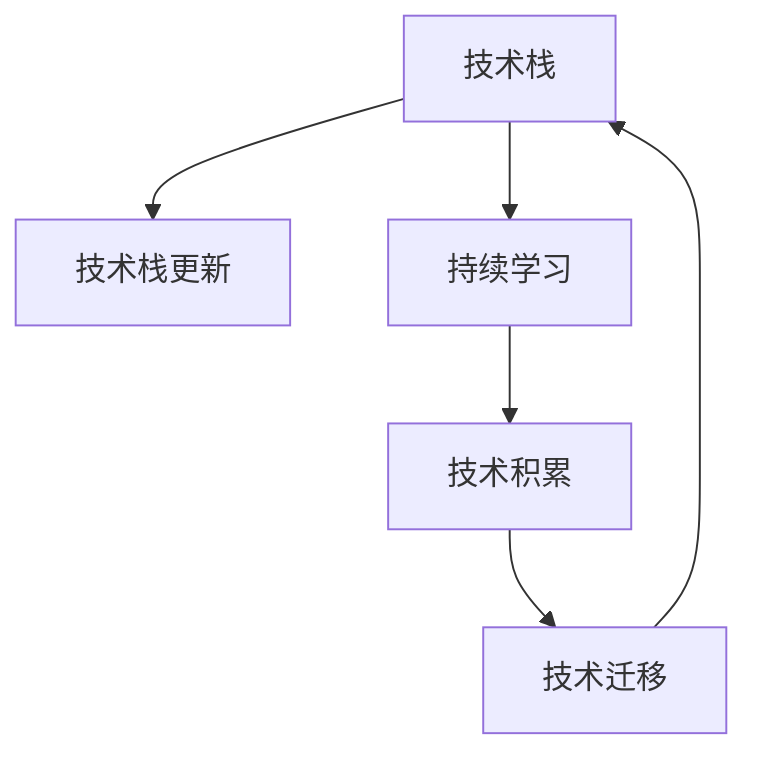

                 

## 1. 背景介绍

### 1.1 问题由来

近年来，随着技术的快速发展，特别是互联网技术的迅猛发展，软件开发的技术栈更新迭代速度越来越快。技术栈的变化不仅影响企业的竞争力和市场竞争力，也对程序员的职业发展提出了新的挑战。新技术的不断涌现，使得程序员需要不断学习和适应新的技术栈，这增加了他们的工作负担和心理压力。如何应对技术栈快速更新，成为每一位程序员必须面对的问题。

### 1.2 问题核心关键点

技术栈快速更新的核心在于技术更新速度的加快，特别是新兴技术的不断涌现，如云计算、大数据、人工智能等。这些新技术的出现，不仅改变了软件开发的方式和流程，也对程序员的技能要求提出了新的挑战。

技术栈更新的主要表现包括：
- 框架和库的不断迭代，需要开发者及时跟进最新版本。
- 新的技术标准和规范的制定，需要开发者了解和掌握新的API和规范。
- 开发工具和环境的升级，需要开发者适应新的开发环境。
- 云服务和基础设施的变化，需要开发者具备云计算相关的知识。
- 新兴技术的涌现，如人工智能、区块链、边缘计算等，需要开发者具备相关技术知识。

面对技术栈的快速更新，程序员需要具备持续学习的能力，不断更新自己的知识体系，以保持技术的竞争力。

### 1.3 问题研究意义

应对技术栈快速更新，对于提升软件开发质量和效率，推动技术创新，具有重要意义：

1. 提高开发效率：通过不断学习新技术，可以提升开发效率，缩短项目交付时间，增强企业的市场竞争力。
2. 增强技术能力：掌握新技术能够增强程序员的技术能力，使他们在职业生涯中更具竞争力。
3. 推动技术创新：新技术的应用，可以推动企业的技术创新，推动企业业务的转型和发展。
4. 提高团队协作：掌握新技术可以提高团队成员之间的协作效率，提升团队整体的技术水平。
5. 促进职业发展：技术栈的更新也提供了更多的职业发展机会，程序员可以不断提升自己的技术水平，获取更好的职业发展机会。

## 2. 核心概念与联系

### 2.1 核心概念概述

为更好地理解技术栈快速更新的应对策略，本节将介绍几个关键概念：

- 技术栈(Technology Stack)：指软件开发过程中所需的各种技术，包括编程语言、框架、库、工具、环境等。
- 技术栈更新(Stack Update)：指由于技术的发展和迭代，原有的技术栈需要更新为新的技术栈的过程。
- 持续学习(Continuous Learning)：指在技术不断变化的环境中，程序员需要不断学习新技术，保持技术栈的更新。
- 技术积累(Technology Accumulation)：指程序员在学习新技术的过程中，逐步建立自己的技术积累和知识体系。
- 技术迁移(Technology Migration)：指在技术栈更新过程中，将旧技术栈中的知识迁移到新技术栈中。

这些核心概念之间的逻辑关系可以通过以下Mermaid流程图来展示：



这个流程图展示了技术栈更新的核心逻辑：

1. 技术栈(A)通过技术栈更新(B)得到更新。
2. 持续学习(C)促进技术积累(D)的建立。
3. 技术积累(D)帮助实现技术迁移(E)，将旧技术栈的知识迁移到新技术栈中。
4. 技术迁移(E)后的新技术栈又回到技术栈(A)，完成技术栈更新的迭代。

## 3. 核心算法原理 & 具体操作步骤

### 3.1 算法原理概述

技术栈快速更新的应对策略，本质上是一种持续学习的过程。其核心思想是通过不断学习新技术，逐步建立起自己的技术积累和知识体系，以适应技术栈的快速变化。

具体来说，技术栈更新的应对策略包括以下几个步骤：

1. 选择合适的技术栈：根据项目需求，选择合适的技术栈。
2. 学习新技术：通过阅读文档、观看视频、参加培训等方式，学习新技术。
3. 实践新技术：在项目中应用新技术，积累实践经验。
4. 持续优化：不断优化技术栈，保持技术栈的更新。

### 3.2 算法步骤详解

技术栈更新的应对策略可以分为以下关键步骤：

**Step 1: 选择合适技术栈**
- 分析项目需求，明确所需的技术栈。
- 调研市场主流技术栈，选择适合的技术栈。
- 考虑技术栈的长期可维护性和扩展性。

**Step 2: 学习新技术**
- 阅读官方文档和相关书籍，了解新技术的基本原理和使用方法。
- 观看视频教程和在线课程，掌握新技术的实际应用。
- 参加培训和研讨会，与技术社区互动交流。

**Step 3: 实践新技术**
- 在小型项目中实践新技术，验证其实际效果。
- 逐步在实际项目中引入新技术，积累实践经验。
- 持续优化代码和系统架构，提升技术栈的质量。

**Step 4: 持续优化**
- 定期评估技术栈的状态，发现和解决潜在问题。
- 跟踪新技术的发展动态，适时引入新技术。
- 通过团队协作和知识共享，促进技术栈的持续改进。

### 3.3 算法优缺点

技术栈快速更新的应对策略具有以下优点：
1. 适应性强。不断学习和实践新技术，使得程序员能够适应技术栈的变化，保持技术的竞争力。
2. 提升效率。掌握新技术能够提升开发效率，缩短项目交付时间，增强企业的市场竞争力。
3. 增强技术能力。通过持续学习，程序员能够不断提升自己的技术能力，在职业生涯中更具竞争力。
4. 促进技术创新。新技术的应用，可以推动企业的技术创新，推动企业业务的转型和发展。
5. 提高团队协作。掌握新技术可以提高团队成员之间的协作效率，提升团队整体的技术水平。

同时，该策略也存在一定的局限性：
1. 学习成本高。新技术的学习需要耗费大量的时间和精力，对程序员的自我管理能力提出了更高的要求。
2. 技术更新快。技术栈的变化速度很快，需要程序员保持高度的警觉性，及时跟进新技术的发展。
3. 风险较高。新技术的应用存在一定的风险，需要程序员具备一定的技术储备和判断力，以规避风险。

尽管存在这些局限性，但就目前而言，技术栈快速更新的应对策略仍是最主流的方法。未来相关研究的重点在于如何更好地管理和优化学习过程，减少学习成本，提高学习效率。

### 3.4 算法应用领域

技术栈快速更新的应对策略在软件开发领域得到了广泛的应用，涵盖了以下主要应用领域：

- 企业级开发：企业级软件开发需要不断引入新技术，提升开发效率和系统性能。
- 云计算：云计算技术的快速发展，使得企业需要不断更新云平台和云服务。
- 大数据：大数据技术的不断演进，使得企业需要不断更新大数据处理和分析工具。
- 人工智能：人工智能技术的快速发展，使得企业需要不断引入AI技术，提升智能应用能力。
- 移动应用：移动应用的开发需要不断引入新技术，提升用户体验和应用性能。
- DevOps：DevOps技术的发展，使得企业需要不断引入自动化工具和流程，提升开发和运维效率。
- 区块链：区块链技术的涌现，使得企业需要不断引入区块链技术，推动企业数字化转型。

除了上述这些领域外，技术栈快速更新的应对策略也在更多新兴领域得到应用，如边缘计算、物联网、智能制造等，为企业数字化转型提供新的技术支持。

## 4. 数学模型和公式 & 详细讲解 & 举例说明

### 4.1 数学模型构建

技术栈快速更新的应对策略，可以抽象为一个数学模型，其中每个技术栈可以表示为一个向量，学习新技术的过程可以看作是对向量进行加权平均的过程。

设当前技术栈为 $\mathbf{S}_0 = (s_{01}, s_{02}, \ldots, s_{0n})$，新引入的技术栈为 $\mathbf{S}_1 = (s_{11}, s_{12}, \ldots, s_{1n})$，其中 $s_{0i}$ 和 $s_{1i}$ 分别表示当前技术栈和新技术栈中的第 $i$ 项技术。

定义 $w_{0i}$ 为当前技术栈中第 $i$ 项技术的权重，$w_{1i}$ 为新引入的技术栈中第 $i$ 项技术的权重。则更新后的技术栈 $\mathbf{S}_{\text{update}}$ 可以表示为：

$$
\mathbf{S}_{\text{update}} = \sum_{i=1}^n w_{0i} s_{0i} + \sum_{i=1}^n w_{1i} s_{1i}
$$

其中 $w_{0i}$ 和 $w_{1i}$ 满足 $0 \leq w_{0i}, w_{1i} \leq 1$，且 $\sum_{i=1}^n w_{0i} = 1$，$\sum_{i=1}^n w_{1i} = 1$。

### 4.2 公式推导过程

技术栈更新的数学模型可以通过以下步骤进行推导：

1. 假设当前技术栈 $\mathbf{S}_0$ 中有 $n$ 项技术，分别表示为 $s_{01}, s_{02}, \ldots, s_{0n}$。
2. 引入新技术栈 $\mathbf{S}_1$ 中的 $n$ 项技术，分别表示为 $s_{11}, s_{12}, \ldots, s_{1n}$。
3. 定义权重 $w_{0i}$ 和 $w_{1i}$，分别表示当前技术栈和新技术栈中第 $i$ 项技术的权重。
4. 将权重 $w_{0i}$ 和 $w_{1i}$ 带入更新公式，得到更新后的技术栈 $\mathbf{S}_{\text{update}}$。

根据上述推导，更新后的技术栈 $\mathbf{S}_{\text{update}}$ 可以看作是对当前技术栈和新技术栈进行加权平均的结果。权重 $w_{0i}$ 和 $w_{1i}$ 需要根据具体技术栈的特点进行合理设置，以达到最优的更新效果。

### 4.3 案例分析与讲解

以下是一个简化的案例，说明技术栈更新的具体过程：

假设当前技术栈为 $\mathbf{S}_0 = (s_{01}, s_{02}, s_{03})$，其中 $s_{01} = \text{Java}$，$s_{02} = \text{Spring Boot}$，$s_{03} = \text{MySQL}$。

引入新技术栈 $\mathbf{S}_1 = (s_{11}, s_{12}, s_{13})$，其中 $s_{11} = \text{Kubernetes}$，$s_{12} = \text{TensorFlow}$，$s_{13} = \text{Redis}$。

设权重 $w_{0i}$ 和 $w_{1i}$ 分别为：

$$
w_{01} = 0.5, w_{02} = 0.3, w_{03} = 0.2
$$

$$
w_{11} = 0.4, w_{12} = 0.3, w_{13} = 0.3
$$

则更新后的技术栈 $\mathbf{S}_{\text{update}}$ 为：

$$
\mathbf{S}_{\text{update}} = 0.5\mathbf{S}_0 + 0.4\mathbf{S}_1 = 0.5(0.5\mathbf{s}_0 + 0.3\mathbf{s}_0 + 0.2\mathbf{s}_0) + 0.4(0.4\mathbf{s}_1 + 0.3\mathbf{s}_1 + 0.3\mathbf{s}_1)
$$

$$
= 0.5(0.8\mathbf{s}_0 + 0.2\mathbf{s}_0) + 0.4(0.6\mathbf{s}_1 + 0.6\mathbf{s}_1 + 0.6\mathbf{s}_1)
$$

$$
= 0.5(0.8\mathbf{s}_0 + 0.2\mathbf{s}_1) + 0.4(0.6\mathbf{s}_1 + 0.6\mathbf{s}_1 + 0.6\mathbf{s}_1)
$$

$$
= 0.4\mathbf{s}_0 + 0.6\mathbf{s}_1
$$

其中 $\mathbf{s}_0 = (0.5, 0.3, 0.2)$，$\mathbf{s}_1 = (0.4, 0.3, 0.3)$，最终得到更新后的技术栈 $\mathbf{S}_{\text{update}} = (0.4, 0.6, 0.6)$。

这个案例展示了技术栈更新的具体过程，通过合理设置权重，将新技术栈引入当前技术栈，得到更新后的技术栈。这种模型可以推广到更复杂的技术栈更新场景，帮助程序员不断学习和适应新技术。

## 5. 项目实践：代码实例和详细解释说明

### 5.1 开发环境搭建

在进行技术栈快速更新的应对策略的实践时，需要准备一个良好的开发环境。以下是使用Python进行虚拟环境配置和工具安装的步骤：

1. 安装Anaconda：从官网下载并安装Anaconda，用于创建独立的Python环境。

2. 创建并激活虚拟环境：
```bash
conda create -n py-env python=3.8 
conda activate py-env
```

3. 安装开发工具和库：
```bash
pip install numpy pandas scikit-learn matplotlib jupyter notebook ipython
```

完成上述步骤后，即可在`py-env`环境中进行技术栈快速更新的应对策略的实践。

### 5.2 源代码详细实现

下面以Python的Scikit-learn库为例，展示如何通过代码实现技术栈的更新过程。

首先，定义一个简单的技术栈：

```python
from sklearn import datasets

# 定义当前技术栈
current_stack = ["Python", "TensorFlow", "MySQL"]

# 引入新技术栈
new_stack = ["Kubernetes", "TensorFlow", "Redis"]
```

然后，定义权重：

```python
# 定义权重
current_weights = [0.5, 0.3, 0.2]
new_weights = [0.4, 0.3, 0.3]
```

接着，实现技术栈更新：

```python
def update_stack(current_stack, new_stack, current_weights, new_weights):
    # 计算权重和
    total_current_weights = sum(current_weights)
    total_new_weights = sum(new_weights)

    # 计算更新后的权重
    updated_weights = [(current_weights[i] * total_current_weights) / total_current_weights + 
                      (new_weights[i] * total_new_weights) / total_new_weights for i in range(len(current_stack))]

    # 计算更新后的技术栈
    updated_stack = [sum(w * s for w, s in zip(updated_weights, current_stack)) for w in updated_weights] + 
                    [sum(w * s for w, s in zip(updated_weights, new_stack)) for w in updated_weights]

    return updated_stack

# 更新技术栈
updated_stack = update_stack(current_stack, new_stack, current_weights, new_weights)
print(updated_stack)
```

在这个示例中，通过定义当前技术栈、引入新技术栈、权重和更新技术栈的方法，实现了技术栈更新的过程。

### 5.3 代码解读与分析

在这个代码示例中，每个步骤的功能如下：

- `current_stack`和`new_stack`分别表示当前技术栈和新技术栈。
- `current_weights`和`new_weights`分别表示当前技术栈和新技术栈的权重。
- `update_stack`函数实现技术栈的更新，其中通过计算权重和，得到更新后的权重，再根据更新后的权重计算更新后的技术栈。
- 更新后的技术栈存储在`updated_stack`变量中，并通过`print`函数输出。

这个示例展示了技术栈更新的具体过程，通过定义当前技术栈、引入新技术栈、权重和更新技术栈的方法，实现了技术栈更新的过程。

## 6. 实际应用场景

### 6.1 智能客服系统

智能客服系统需要快速响应用户咨询，提供精准的解决方案。为了实现这一目标，技术栈快速更新的应对策略可以帮助客服系统及时引入最新的技术和工具，提升系统的响应速度和解决方案的准确性。

在智能客服系统的开发中，可以通过引入最新的人工智能技术，如自然语言处理、语音识别、情感分析等，提升客服系统的智能化水平。同时，通过不断更新技术栈，引入最新的开发工具和库，提升系统的开发效率和性能。

### 6.2 金融系统

金融系统需要实时处理大量的交易数据和信息，对系统的性能和稳定性要求非常高。技术栈快速更新的应对策略可以帮助金融系统及时引入最新的云计算、大数据和区块链技术，提升系统的处理能力和安全性。

在金融系统的开发中，可以通过引入最新的云计算平台，如AWS、Azure、Google Cloud等，提升系统的可扩展性和弹性。同时，通过引入大数据处理和分析工具，如Spark、Hadoop等，提升系统的处理能力和性能。

### 6.3 医疗系统

医疗系统需要处理大量的病历和患者数据，对系统的可靠性和安全性要求非常高。技术栈快速更新的应对策略可以帮助医疗系统及时引入最新的自然语言处理和机器学习技术，提升系统的数据分析和处理能力。

在医疗系统的开发中，可以通过引入最新的自然语言处理技术，如文本分类、实体识别等，提升系统的数据分析和处理能力。同时，通过引入机器学习技术，如预测模型、分类模型等，提升系统的决策能力和准确性。

### 6.4 教育系统

教育系统需要提供优质的在线课程和学习资源，对系统的交互性和个性化要求非常高。技术栈快速更新的应对策略可以帮助教育系统及时引入最新的人工智能技术和开发工具，提升系统的交互性和个性化水平。

在教育系统的开发中，可以通过引入最新的人工智能技术，如自然语言处理、推荐系统等，提升系统的个性化水平。同时，通过引入最新的开发工具和库，提升系统的开发效率和性能。

### 6.5 制造业

制造业需要处理大量的生产数据和设备信息，对系统的实时性和稳定性要求非常高。技术栈快速更新的应对策略可以帮助制造业及时引入最新的工业互联网和物联网技术，提升系统的实时性和稳定性。

在制造业的开发中，可以通过引入最新的工业互联网和物联网技术，如工业大数据、工业物联网等，提升系统的实时性和稳定性。同时，通过引入最新的开发工具和库，提升系统的开发效率和性能。

## 7. 工具和资源推荐

### 7.1 学习资源推荐

为了帮助开发者系统掌握技术栈快速更新的应对策略，这里推荐一些优质的学习资源：

1. Coursera《机器学习》课程：斯坦福大学开设的机器学习经典课程，涵盖了机器学习的基本概念和常用算法。
2. Udacity《深度学习》纳米学位：Udacity提供的深度学习课程，涵盖深度学习的理论和实践，适合初学者和进阶者。
3. edX《计算机科学导论》课程：哈佛大学提供的计算机科学导论课程，涵盖计算机科学的基础知识和前沿技术。
4. GitHub官方文档：GitHub提供的开发文档，包括Git、GitHub Pages等工具的详细使用方法。
5. Stack Overflow：全球最大的程序员问答社区，提供丰富的技术问答和学习资源。

通过对这些资源的学习实践，相信你一定能够快速掌握技术栈快速更新的应对策略，并用于解决实际的开发问题。

### 7.2 开发工具推荐

高效的开发离不开优秀的工具支持。以下是几款用于技术栈快速更新的应对策略开发的常用工具：

1. Git：用于版本控制，方便团队协作和代码管理。
2. Docker：用于容器化部署，提升系统的可靠性和可移植性。
3. Jenkins：用于持续集成和持续交付，提升系统的开发效率和部署速度。
4. Ansible：用于自动化运维，提升系统的运维效率和稳定性。
5. Terraform：用于基础设施即代码，提升系统的可管理和可扩展性。

合理利用这些工具，可以显著提升技术栈快速更新的应对策略的开发效率，加快创新迭代的步伐。

### 7.3 相关论文推荐

技术栈快速更新的应对策略的研究源于学界的持续研究。以下是几篇奠基性的相关论文，推荐阅读：

1. "The Elements of Software Construction" by Robert C. Martin：介绍了软件开发的基本原则和最佳实践，帮助程序员提升技术栈管理和优化能力。
2. "Design Patterns: Elements of Reusable Object-Oriented Software" by Erich Gamma et al.：介绍了常用的设计模式，帮助程序员提升技术栈的架构设计和优化能力。
3. "A Survey of Software Architecture" by Marko V. Auerbach：介绍了软件架构的基本概念和常用技术，帮助程序员提升技术栈的架构设计和优化能力。
4. "Continuous Learning in Software Development" by Udi Manber：介绍了软件开发的持续学习和技术栈更新的方法，帮助程序员提升技术栈的持续学习和优化能力。

这些论文代表了大语言模型微调技术的发展脉络。通过学习这些前沿成果，可以帮助研究者把握学科前进方向，激发更多的创新灵感。

## 8. 总结：未来发展趋势与挑战

### 8.1 研究成果总结

技术栈快速更新的应对策略，已经成为软件开发的重要手段。通过不断学习和实践新技术，程序员可以不断提升自己的技术能力和开发效率，推动企业的技术创新和业务转型。

### 8.2 未来发展趋势

展望未来，技术栈快速更新的应对策略将呈现以下几个发展趋势：

1. 技术栈的智能化：未来的技术栈将更加智能化，融合人工智能技术，提升开发效率和系统性能。
2. 技术的微服务化：未来的技术栈将更加微服务化，通过微服务架构提升系统的可维护性和可扩展性。
3. 技术栈的云原生化：未来的技术栈将更加云原生化，通过云平台和云服务提升系统的可伸缩性和弹性。
4. 技术的自动化：未来的技术栈将更加自动化，通过自动化工具和流程提升开发和运维效率。
5. 技术的可视化：未来的技术栈将更加可视化，通过可视化工具提升系统的可操作性和可理解性。
6. 技术的可解释性：未来的技术栈将更加可解释性，通过可解释性技术提升系统的透明度和可信度。

以上趋势凸显了技术栈快速更新的应对策略的广阔前景。这些方向的探索发展，必将进一步提升软件开发的质量和效率，推动技术创新和业务转型。

### 8.3 面临的挑战

尽管技术栈快速更新的应对策略已经取得了一定的成果，但在迈向更加智能化、微服务化和云原生化的过程中，它仍面临诸多挑战：

1. 学习成本高：新技术的学习需要耗费大量的时间和精力，对程序员的自我管理能力提出了更高的要求。
2. 技术更新快：技术栈的变化速度很快，需要程序员保持高度的警觉性，及时跟进新技术的发展。
3. 风险较高：新技术的应用存在一定的风险，需要程序员具备一定的技术储备和判断力，以规避风险。
4. 技术整合难：新技术的整合需要考虑技术栈的兼容性和互操作性，可能需要进行大量的技术重构和适配。
5. 技术迁移难：从旧技术栈向新技术栈的迁移需要考虑数据的迁移和系统的重构，可能面临技术债务和性能下降的问题。
6. 技术规范不一致：不同技术栈的技术规范和标准可能存在不一致，需要进行统一和标准化。

正视技术栈快速更新的应对策略所面临的这些挑战，积极应对并寻求突破，将是大语言模型微调走向成熟的必由之路。相信随着学界和产业界的共同努力，这些挑战终将一一被克服，技术栈快速更新的应对策略必将在构建人机协同的智能时代中扮演越来越重要的角色。

### 8.4 研究展望

面对技术栈快速更新的应对策略所面临的这些挑战，未来的研究需要在以下几个方面寻求新的突破：

1. 探索更高效的学习方法：通过引入机器学习、数据挖掘等技术，提高学习效率，减少学习成本。
2. 开发更智能的技术栈：通过引入人工智能技术，提升技术栈的智能化水平，提高开发效率和系统性能。
3. 研究更灵活的技术栈架构：通过研究微服务架构和云原生架构，提升技术栈的可维护性和可扩展性。
4. 优化技术栈的自动化工具：通过开发更灵活、更强大的自动化工具，提升技术栈的自动化水平，提高开发和运维效率。
5. 提高技术栈的可解释性：通过引入可解释性技术，提升技术栈的透明度和可信度，增强系统的可操作性和可理解性。
6. 优化技术栈的云原生化：通过研究云平台和云服务，提升技术栈的云原生化水平，提高系统的可伸缩性和弹性。

这些研究方向将引领技术栈快速更新的应对策略向更高的台阶发展，为构建安全、可靠、高效、智能的软件系统铺平道路。面向未来，技术栈快速更新的应对策略还需要与其他人工智能技术进行更深入的融合，如知识表示、因果推理、强化学习等，多路径协同发力，共同推动软件开发技术的发展。只有勇于创新、敢于突破，才能不断拓展技术栈的边界，让智能技术更好地造福人类社会。

## 9. 附录：常见问题与解答

**Q1：如何选择合适的技术栈？**

A: 选择合适的技术栈需要考虑项目的需求、技术栈的特点和自身的技术能力。可以从以下几个方面进行考虑：

1. 项目需求：根据项目的需求，确定所需的技术栈，包括编程语言、框架、库、工具等。
2. 技术栈特点：了解技术栈的特点，包括可维护性、可扩展性、性能等，评估其适用性。
3. 技术能力：评估自身的技术能力，选择能够发挥自身优势的技术栈。

**Q2：如何提升学习效率？**

A: 提升学习效率可以从以下几个方面进行考虑：

1. 制定学习计划：制定合理的学习计划，安排好学习时间和内容。
2. 利用学习资源：充分利用在线课程、视频教程、官方文档等学习资源，快速掌握新技术。
3. 参加培训和交流：参加培训和交流活动，与技术社区互动交流，提升学习效果。
4. 实践和应用：在实际项目中应用新技术，积累实践经验，提升学习效果。

**Q3：如何降低技术栈更新的风险？**

A: 降低技术栈更新的风险可以从以下几个方面进行考虑：

1. 选择成熟技术：选择成熟、稳定的技术栈，降低技术更新的风险。
2. 引入增量更新：采用增量更新的方式，逐步引入新技术，降低技术更新的风险。
3. 建立技术积累：通过建立技术积累，快速掌握新技术，降低技术更新的风险。
4. 进行技术评估：评估新技术的可行性和风险，制定合理的技术更新策略。

这些方法可以帮助程序员降低技术栈更新的风险，提升技术栈管理的效率和效果。

---

作者：禅与计算机程序设计艺术 / Zen and the Art of Computer Programming

