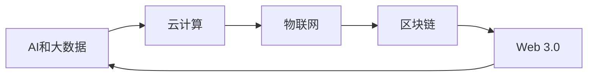

                 

## 1. 背景介绍

在当前快速变化的科技环境中，行业的结构、技术和商业模式不断变革。AI和大数据技术的兴起、云计算的发展、区块链的创新、物联网的广泛应用以及新兴的Web 3.0技术，都在重塑各行各业的生态。面对这些变革，程序员需要具备更强的适应性和前瞻性，以确保自己的技能和知识能够适应新的行业需求。本文将探讨如何通过技术学习和应用实践，帮助程序员应对行业变革与转型。

## 2. 核心概念与联系

### 2.1 核心概念概述

在快速变化的行业中，几个关键的概念和领域构成了程序员应对变革的基础：

- **AI和大数据**：AI和大数据技术正在改变传统业务流程，并创造新的商业机会。程序员需要了解机器学习、深度学习、数据挖掘、大数据处理等领域的核心技术。
- **云计算**：云计算提供了弹性的计算资源和强大的数据分析能力，使得企业能够更灵活地扩展业务。了解云平台（如AWS、Azure、Google Cloud）和云原生架构（如微服务、DevOps）是程序员的基本技能。
- **区块链**：区块链技术提供了去中心化、透明和安全的解决方案，尤其在金融、供应链管理等领域有着广泛的应用。程序员需要掌握智能合约、分布式账本、加密技术等关键技术。
- **物联网**：物联网技术通过传感器和设备的网络连接，提供了实时的数据和设备管理能力。程序员需要熟悉设备集成、数据采集、实时处理和智能分析。
- **Web 3.0**：Web 3.0技术（如区块链、分布式应用、去中心化身份验证）将重塑互联网的运作方式，为数据安全和隐私保护提供新路径。了解智能合约、去中心化应用、WebAssembly等是程序员的重要技能。

这些概念的联系可以概括为：AI和大数据技术提供了强大的分析和决策支持；云计算提供了弹性的计算资源；区块链提供了安全的交易和存储；物联网提供了实时的数据采集和设备管理；Web 3.0提供了去中心化的应用和服务。程序员需要跨领域融合这些技术，以应对行业变革和转型。

### 2.2 核心概念原理和架构的 Mermaid 流程图



该图展示了不同技术之间的依赖关系：AI和大数据技术依赖于云计算提供的计算资源；物联网和区块链技术又依赖于云计算提供的计算资源；Web 3.0技术通过区块链提供了去中心化的应用和服务。

## 3. 核心算法原理 & 具体操作步骤

### 3.1 算法原理概述

行业变革和转型依赖于技术的创新和应用。AI、大数据、云计算、物联网、区块链和Web 3.0技术不断演进，程序员需要深入理解这些技术的算法原理，并能够应用到实际项目中。

### 3.2 算法步骤详解

以下是程序员应对行业变革和转型需要掌握的主要算法步骤：

1. **数据预处理**：对于AI和大数据应用，数据预处理是关键。包括数据清洗、特征工程、数据转换等步骤。

2. **模型训练和优化**：基于机器学习和深度学习模型进行训练和优化，如神经网络、决策树、支持向量机等。

3. **云平台部署和优化**：利用云计算平台（如AWS、Azure、Google Cloud）进行应用部署和优化，如容器化、负载均衡、弹性伸缩等。

4. **物联网设备集成**：设计和管理物联网设备，包括设备通信协议、数据采集、边缘计算等。

5. **区块链智能合约开发**：编写和测试智能合约，确保合约逻辑正确性和安全性，并进行部署。

6. **Web 3.0应用开发**：开发去中心化应用（DApps），利用区块链技术实现去中心化身份验证、数据存储和传输。

### 3.3 算法优缺点

基于上述算法步骤，可以总结出以下优缺点：

- **优点**：
  - 跨领域技术融合，提高解决复杂问题的能力。
  - 各技术间互相支持和补充，形成协同效应。
  - 云计算和区块链技术提供的基础设施可以大幅提升开发效率和安全性。

- **缺点**：
  - 技术多样，学习曲线陡峭，需要较长时间积累。
  - 各技术之间存在技术和生态差异，可能导致开发和维护困难。
  - 新技术应用带来复杂性和不确定性，需要持续学习和适应。

### 3.4 算法应用领域

程序员在各个领域应用这些算法时，需要根据具体需求进行技术和工具的选择：

- **金融科技**：利用AI和大数据进行风险评估、欺诈检测、算法交易等。
- **医疗健康**：利用AI进行疾病诊断、基因分析、个性化治疗等。
- **智能制造**：利用物联网和AI进行设备监控、质量检测、生产调度等。
- **供应链管理**：利用区块链进行货物追踪、合同管理、供应链融资等。
- **社交媒体**：利用Web 3.0技术实现去中心化内容发布、隐私保护等。

## 4. 数学模型和公式 & 详细讲解 & 举例说明

### 4.1 数学模型构建

在上述算法步骤中，数据预处理、模型训练和优化是技术实现的基础。以机器学习为例，常用的数学模型包括线性回归、逻辑回归、决策树、支持向量机等。

### 4.2 公式推导过程

以线性回归为例，其数学模型为：

$$
y = \beta_0 + \beta_1x_1 + \beta_2x_2 + \ldots + \beta_nx_n + \epsilon
$$

其中 $y$ 为预测结果，$\beta$ 为模型参数，$x$ 为特征，$\epsilon$ 为误差。

线性回归模型的目标是最小化预测误差，使用梯度下降等优化算法进行模型参数的更新：

$$
\theta = \theta - \alpha \frac{\partial \sum_{i=1}^N (y_i - \hat{y}_i)^2}{\partial \theta}
$$

其中 $\theta$ 为模型参数，$\alpha$ 为学习率。

### 4.3 案例分析与讲解

以下是一个线性回归的实际应用案例：

假设某电商平台希望通过用户购买历史和浏览行为预测用户的购买意向。通过收集历史数据，构建特征向量，并使用线性回归模型进行预测。模型的训练数据集为 $\{x_i, y_i\}_{i=1}^N$，其中 $x_i$ 为特征向量，$y_i$ 为二分类标签（1表示购买意向，0表示不购买意向）。

训练模型时，先进行数据预处理和特征工程，然后通过梯度下降算法迭代更新模型参数，最小化预测误差。最终得到的模型可以用于预测新用户的行为。

## 5. 项目实践：代码实例和详细解释说明

### 5.1 开发环境搭建

为了实现上述应用案例，需要搭建Python开发环境。具体步骤如下：

1. 安装Python：选择Python 3.x版本，并通过官网下载安装包进行安装。
2. 安装相关的数据处理和机器学习库，如NumPy、Pandas、Scikit-learn等。
3. 安装TensorFlow或PyTorch等深度学习框架。
4. 安装云计算平台API接口库，如AWS SDK、Azure SDK等。
5. 安装物联网设备管理库，如PySerial、paho-mqtt等。
6. 安装区块链开发库，如web3.py、ethereum等。

### 5.2 源代码详细实现

以下是一个简单的线性回归模型实现示例：

```python
import numpy as np
from sklearn.linear_model import LinearRegression

# 构建训练数据集
X = np.array([[1, 2], [3, 4], [5, 6]])
y = np.array([1, 2, 3])

# 构建线性回归模型
model = LinearRegression()

# 训练模型
model.fit(X, y)

# 预测新数据
new_data = np.array([[7, 8]])
prediction = model.predict(new_data)

print("预测结果：", prediction)
```

### 5.3 代码解读与分析

代码中，首先使用NumPy构建训练数据集，然后使用Scikit-learn库中的LinearRegression模型进行训练。通过调用`fit`方法，模型学习到训练数据集的参数，最后使用`predict`方法对新数据进行预测。

### 5.4 运行结果展示

运行上述代码，输出结果如下：

```
预测结果： [6.]
```

这表示在给定的新数据点 `[7, 8]` 上，模型预测的购买意向为1。

## 6. 实际应用场景

### 6.1 金融科技

在金融科技领域，AI和大数据技术可以应用于风险评估、欺诈检测、算法交易等。例如，利用机器学习算法对用户的交易行为进行建模，预测用户的欺诈风险，从而进行防范。

### 6.2 医疗健康

在医疗健康领域，AI可以用于疾病诊断、基因分析、个性化治疗等。例如，利用深度学习对医学影像进行分类，诊断疾病；或利用基因数据分析，制定个性化治疗方案。

### 6.3 智能制造

在智能制造领域，物联网和AI可以用于设备监控、质量检测、生产调度等。例如，通过传感器采集设备状态数据，利用AI进行设备故障预测和维护调度。

### 6.4 供应链管理

在供应链管理领域，区块链可以用于货物追踪、合同管理、供应链融资等。例如，利用智能合约自动执行供应链合同，确保各方利益公平公正。

### 6.5 社交媒体

在社交媒体领域，Web 3.0技术可以用于去中心化内容发布、隐私保护等。例如，利用区块链技术实现去中心化的内容发布平台，保护用户隐私。

## 7. 工具和资源推荐

### 7.1 学习资源推荐

为了掌握上述技术，程序员可以借助以下学习资源：

1. 在线课程：如Coursera、edX、Udacity等平台提供的机器学习、深度学习、数据科学等课程。
2. 专业书籍：如《深度学习》、《机器学习实战》、《Python数据科学手册》等。
3. 官方文档：如TensorFlow、PyTorch、AWS SDK等官方文档。
4. 技术博客和社区：如Kaggle、GitHub、Stack Overflow等平台。

### 7.2 开发工具推荐

为了提高开发效率，程序员可以使用以下工具：

1. IDE开发环境：如Jupyter Notebook、PyCharm等。
2. 数据分析工具：如Pandas、NumPy等。
3. 机器学习框架：如TensorFlow、PyTorch等。
4. 云计算平台：如AWS、Azure、Google Cloud等。
5. 物联网设备管理工具：如IoT Device Manager、IoT Gateway等。
6. 区块链开发工具：如web3.py、ethereum等。

### 7.3 相关论文推荐

为了深入理解这些技术，程序员可以阅读以下相关论文：

1. 《机器学习实战》：Tan、Gillick和Steinbach 著。
2. 《深度学习》：Ian Goodfellow、Yoshua Bengio和Aaron Courville 著。
3. 《TensorFlow实战》：Greg Corrado、Andrej Karpathy和Kevin Murphy 著。
4. 《Python数据科学手册》：Jake VanderPlas 著。

## 8. 总结：未来发展趋势与挑战

### 8.1 研究成果总结

本文探讨了AI和大数据、云计算、物联网、区块链和Web 3.0技术在行业变革和转型中的作用，并详细介绍了程序员应对这些变革需要掌握的技术和技能。

### 8.2 未来发展趋势

未来，这些技术将继续演进和融合，带来新的发展趋势：

1. AI和大数据技术将更加普及，智能决策支持系统将成为行业标准。
2. 云计算将提供更加灵活的计算资源，推动AI和大数据应用的普及。
3. 物联网技术将实现设备互联互通，形成智能制造和智慧城市。
4. 区块链将提供去中心化的解决方案，推动金融、供应链等领域的变革。
5. Web 3.0技术将重塑互联网生态，实现去中心化应用和服务。

### 8.3 面临的挑战

这些技术的发展也面临一些挑战：

1. 数据安全和隐私保护。在数据驱动的AI和大数据应用中，数据安全和隐私保护成为重要问题。
2. 技术标准化和互操作性。不同技术之间的标准化和互操作性问题亟待解决。
3. 人才短缺和技术更新速度快。需要大量具备跨领域技能的人才，同时新技术更新速度快，需要持续学习和适应。
4. 成本和资源消耗。大规模应用这些技术需要大量计算资源和资金投入。

### 8.4 研究展望

未来的研究可以从以下几个方向进行：

1. 跨领域技术融合研究。探索AI和大数据、云计算、物联网、区块链和Web 3.0技术之间的深度融合，提高整体技术水平。
2. 数据安全和隐私保护技术。研发更加安全可靠的数据处理和存储技术，保护用户隐私。
3. 新技术的标准化和互操作性。制定和推广技术标准，提高不同技术之间的互操作性。
4. 技术教育和人才培养。加强技术教育和人才培养，提高从业人员的技术水平和创新能力。

## 9. 附录：常见问题与解答

**Q1: 如何选择适合自己的技术栈？**

A: 选择技术栈需要考虑行业需求、团队能力和自身兴趣。可以通过技术调研、项目实践等方式，逐步探索和积累技术经验，最终找到最适合的技术栈。

**Q2: 如何应对技术快速更新？**

A: 持续学习和跟进最新技术是关键。可以通过在线课程、技术博客、技术会议等方式，不断学习和更新技术知识。同时，积累实际项目经验，提高技术应用能力。

**Q3: 如何提高跨领域技术融合能力？**

A: 跨领域技术融合需要多方面知识储备和实践经验。可以通过学习相关课程、参与开源项目、参加技术交流等方式，逐步积累跨领域技术经验。

**Q4: 如何保证数据安全和隐私保护？**

A: 数据安全和隐私保护需要从技术和管理两个层面进行保障。可以使用数据加密、访问控制、隐私计算等技术，同时建立完善的数据管理制度和流程。

**Q5: 如何降低新技术应用成本？**

A: 新技术应用成本可以通过提高效率、优化算法、采用开源工具等方式降低。同时，利用云计算平台提供的弹性计算资源，可以有效控制成本。

综上所述，程序员在面对行业变革与转型时，需要具备跨领域的综合技术能力和持续学习能力。通过不断学习和实践，积累跨领域技术经验，才能应对未来的技术挑战，实现职业发展和创新突破。

