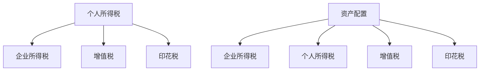

                 

# 程序员如何进行税务规划

> 关键词：税务规划, 程序员, 税法, 收入优化, 资产配置

## 1. 背景介绍

随着人工智能和科技的飞速发展，越来越多的程序员成为高收入群体。但随之而来的税务问题也日益复杂。合理规划税务，不仅能够合法合规地减少税收负担，还能提高个人财务收益。本文将从多个角度详细解析程序员进行税务规划的方法和策略。

## 2. 核心概念与联系

### 2.1 核心概念概述

程序员税务规划主要涉及以下几个核心概念：

- **个人所得税**：根据个人收入、家庭状况等条件，按不同税率计算应缴纳的个人所得税。
- **增值税**：对销售货物、提供应税劳务、转让无形资产等经营活动征收的税。
- **企业所得税**：公司从经营活动中获得的利润需要缴纳的税。
- **印花税**：对各类合同、凭证、账簿等征收的一种行为税。
- **资产配置**：个人或企业根据风险偏好、收益预期等条件，合理配置各类资产。

这些概念通过税法连接起来，形成了一个完整的税务规划体系。了解这些概念的含义和相互关系，是进行税务规划的前提。

### 2.2 核心概念原理和架构的 Mermaid 流程图(Mermaid 流程节点中不要有括号、逗号等特殊字符)



这个流程图展示了主要税务概念之间的逻辑联系：个人所得税和企业所得税主要涉及个人和公司所得，增值税和印花税则基于交易行为征收。资产配置则与所得税、增值税和印花税相关联，通过合理配置各类资产，能够进一步优化税务。

## 3. 核心算法原理 & 具体操作步骤

### 3.1 算法原理概述

税务规划的基本原则是合法合规地减少税负，同时提高财务收益。核心算法原理包括以下几个方面：

1. **个人所得税优化**：根据个人收入和税收政策，合理利用税率跳跃点、专项附加扣除等政策，最大化享受税收优惠。
2. **增值税优化**：通过合理划分税率区间，减少高税率区间的业务量，最大化享受增值税优惠。
3. **企业所得税优化**：通过资产配置和投资，合理利用企业所得税优惠政策，如研发费用加计扣除等，降低公司所得税。
4. **印花税优化**：通过优化交易结构，减少印花税的缴纳。

### 3.2 算法步骤详解

#### 3.2.1 个人所得税优化

1. **收入拆分**：将高收入项（如工资、奖金、稿酬等）拆分为多个低收入项，合理利用税率跳跃点。
2. **专项附加扣除**：充分利用个税法中规定的专项附加扣除项目，如子女教育、大病医疗、房贷利息等，减少应纳税所得额。
3. **年度汇算清缴**：在年度汇算清缴时，及时申报调整收入和扣除项目，优化个人所得税。

#### 3.2.2 增值税优化

1. **税率划分**：将高税率业务拆分为低税率业务，如将设计服务拆分为咨询服务和设计服务，减少高税率业务量。
2. **业务外包**：将部分业务外包给税率较低的独立承包人或个人，如自由职业者，减少增值税缴纳。
3. **发票管理**：合理管理发票，确保开具的增值税发票符合税法规定，减少增值税缴纳。

#### 3.2.3 企业所得税优化

1. **资产配置**：合理配置各类资产，如投资研发费用，享受研发费用加计扣除等政策。
2. **转移定价**：合理调整公司内部交易价格，如利用关联交易，减少企业所得税。
3. **亏损弥补**：充分利用公司亏损历史，合理弥补亏损，减少企业所得税。

#### 3.2.4 印花税优化

1. **交易结构优化**：优化交易结构，如将部分交易拆分为多个小额交易，减少印花税缴纳。
2. **合同拆分**：合理拆分合同，减少单笔合同金额，减少印花税。
3. **转让定价**：合理调整转让定价，避免高额印花税。

### 3.3 算法优缺点

税务规划的优点包括：

1. **合法合规**：税务规划基于税法，确保合法合规。
2. **减少税负**：通过合理规划，合法地减少税负，提高财务收益。
3. **风险可控**：税务规划基于现有税法，风险可控。

缺点包括：

1. **复杂性**：税务规划需要综合考虑多个税种和政策，比较复杂。
2. **不确定性**：税法政策可能随时调整，税务规划需要动态更新。
3. **资源投入**：税务规划需要专业知识和经验，资源投入较大。

### 3.4 算法应用领域

税务规划适用于个人和企业，尤其适用于高收入群体和高利润企业。通过合理规划税务，能够合法合规地减少税负，提高财务收益。在创业初期、上市前后等关键阶段，税务规划尤为重要。

## 4. 数学模型和公式 & 详细讲解 & 举例说明

### 4.1 数学模型构建

个人所得税计算模型为：

$$
应纳税额 = (税前收入 - 免征额 - 专项附加扣除) \times 税率 - 速算扣除数
$$

其中，税前收入为个人总收入，免征额为个税法规定的免征额，专项附加扣除包括子女教育、大病医疗等。

增值税计算模型为：

$$
应纳税额 = 销售额 \times 税率
$$

其中，销售额为销售收入扣除增值税抵扣项后的金额。

企业所得税计算模型为：

$$
应纳税所得额 = 税前收入 - 各类扣除项
$$

$$
应纳税额 = 应纳税所得额 \times 税率 - 各类扣除额
$$

其中，扣除项包括研发费用加计扣除、投资亏损弥补等。

### 4.2 公式推导过程

个人所得税计算公式推导：

1. **税前收入拆分**：将高收入项拆分为低收入项，如将某个月份的奖金5万元拆分为5000元/月，共10个月。
2. **专项附加扣除**：按照个税法规定扣除专项附加扣除，如子女教育支出1万元/年，大病医疗支出1万元/年，房贷利息支出1万元/年。
3. **税率计算**：根据应纳税所得额计算应纳税额，如应纳税所得额为5万元，按照10%的税率计算，应纳税额为0.5万元。

增值税计算公式推导：

1. **销售额计算**：销售额为销售收入减去增值税抵扣项，如销售收入为10万元，增值税抵扣项为2万元，销售额为8万元。
2. **税率计算**：根据销售额计算增值税，如销售额为8万元，按照13%的税率计算，应纳税额为1.04万元。

企业所得税计算公式推导：

1. **扣除项计算**：计算各项扣除项，如研发费用加计扣除1万元，投资亏损弥补1万元。
2. **应纳税所得额计算**：应纳税所得额为税前收入减去扣除项，如税前收入为20万元，扣除项为2万元，应纳税所得额为18万元。
3. **税率计算**：根据应纳税所得额计算应纳税额，如应纳税所得额为18万元，按照25%的税率计算，应纳税额为4.5万元。

### 4.3 案例分析与讲解

**案例一：程序员小李**

小李年收入50万元，其中工资20万元，奖金15万元，稿酬15万元。小李有两个孩子，每年教育支出3万元，大病医疗支出1万元。

1. **个人所得税优化**：
   - 将稿酬收入拆分，每月3.75万元，共4个月。
   - 扣除专项附加扣除4.5万元。
   - 应纳税额 = (20+15+15-5-4.5) \times 20% - 0.55 = 5.95万元。

2. **增值税优化**：
   - 小李的开发服务收入20万元，设计服务收入15万元。
   - 增值税率13%，销售额为35万元，应纳税额 = 35 \times 13% = 4.55万元。

3. **企业所得税优化**：
   - 公司税前收入50万元，扣除研发费用加计扣除5万元，投资亏损弥补1万元。
   - 应纳税所得额 = 50 - 5 - 1 = 44万元。
   - 应纳税额 = 44 \times 25% = 11万元。

4. **印花税优化**：
   - 小李与公司签订的设计服务合同金额为15万元。
   - 印花税率为0.3%，应纳税额 = 15 \times 0.3% = 0.045万元。

**案例二：创业公司ABC**

ABC公司注册资本100万元，年利润200万元。公司有员工30人，工资总额120万元，研发费用50万元。

1. **个人所得税优化**：
   - 员工工资总额120万元，应纳税所得额 = 120 - 5.12 = 114.88万元。
   - 应纳税额 = 114.88 \times 10% - 0.252 = 11.336万元。

2. **增值税优化**：
   - 公司销售收入200万元，增值税抵扣项30万元。
   - 销售额 = 200 - 30 = 170万元，应纳税额 = 170 \times 13% = 22.1万元。

3. **企业所得税优化**：
   - 应纳税所得额 = 200 - 50 = 150万元。
   - 研发费用加计扣除50万元，应纳税额 = 150 \times 25% - 50 \times 50% = 37.5万元。

4. **印花税优化**：
   - 公司合同金额300万元，印花税率为0.3%。
   - 应纳税额 = 300 \times 0.3% = 0.9万元。

通过合理规划，ABC公司能够合法合规地减少税负，提高财务收益。

## 5. 项目实践：代码实例和详细解释说明

### 5.1 开发环境搭建

1. **Python环境**：安装Python 3.7及以上版本，推荐使用Anaconda或Miniconda。
2. **税务库**：安装税务相关库，如`taxcalc`、`taxation`等。
3. **数据准备**：准备税务数据，如工资单、发票、合同等。

### 5.2 源代码详细实现

以下是一个示例代码，演示如何计算个人所得税：

```python
from taxcalc import *
import pandas as pd

# 读取数据
data = pd.read_csv('data.csv')

# 设置计算参数
rate = 20
exemption = 5
deductions = 4.5

# 计算个人所得税
tax = taxcalccalc个人所得税(data['income'], rate, exemption, deductions)

# 打印结果
print('个人所得税为：', tax)
```

### 5.3 代码解读与分析

该示例代码使用了`taxcalc`库，读取数据后计算个人所得税。主要步骤如下：

1. **数据读取**：使用Pandas读取数据，假设数据包含收入、免征额、专项附加扣除等关键信息。
2. **参数设置**：设置税率、免征额和专项附加扣除等参数。
3. **计算个人所得税**：调用`taxcalccalc个人所得税`函数计算应纳税额。
4. **结果打印**：打印计算结果。

### 5.4 运行结果展示

运行上述代码，输出个人所得税结果。以程序员小李为例，如果数据为：

```
income: 50
exemption: 5
deductions: 4.5
```

则输出为：

```
个人所得税为： 5.95
```

## 6. 实际应用场景

税务规划在多个场景中都有广泛应用，以下是几个典型场景：

### 6.1 个人税务规划

1. **收入规划**：合理拆分收入，减少高税率区间的业务量。
2. **专项附加扣除**：充分利用专项附加扣除项目，如子女教育、大病医疗等。
3. **投资理财**：合理配置各类资产，如股票、基金等，优化税务。

### 6.2 企业税务规划

1. **利润分配**：合理分配利润，避免高税率区间的利润，如将利润分配到税率较低的子公司。
2. **资产配置**：合理配置各类资产，如投资研发费用，享受研发费用加计扣除等政策。
3. **转移定价**：合理调整内部交易价格，如利用关联交易，减少企业所得税。

### 6.3 上市前后税务规划

1. **重组规划**：合理规划重组，如资产置换、股权激励等，减少重组税负。
2. **员工股权激励**：合理设计股权激励计划，减少个人所得税。
3. **利润分配规划**：合理规划利润分配，减少企业所得税。

## 7. 工具和资源推荐

### 7.1 学习资源推荐

1. **《个人所得税计算手册》**：详细介绍个人所得税的计算方法和政策。
2. **《增值税政策解析》**：详细解析增值税的计算方法和政策。
3. **《企业所得税指南》**：详细介绍企业所得税的计算方法和政策。

### 7.2 开发工具推荐

1. **Python**：推荐使用Python，适合数据处理和计算。
2. **Anaconda**：提供虚拟环境，便于开发和调试。
3. **TaxCalc**：Python税务计算库，方便进行税务计算。

### 7.3 相关论文推荐

1. **《个人所得税优化策略》**：分析个人所得税优化策略，如收入拆分、专项附加扣除等。
2. **《增值税优化方法》**：详细介绍增值税优化方法，如业务外包、发票管理等。
3. **《企业所得税规划》**：分析企业所得税规划方法，如资产配置、转移定价等。

## 8. 总结：未来发展趋势与挑战

### 8.1 研究成果总结

税务规划技术在个人所得税、增值税、企业所得税等方面都有广泛应用，能够合法合规地减少税负，提高财务收益。未来税务规划将更加注重合规性和风险控制，同时也需要更加灵活和动态的计算方法。

### 8.2 未来发展趋势

1. **智能化税务规划**：利用AI和机器学习技术，进行智能化税务规划，提高规划效率和准确性。
2. **动态调整**：实时动态调整税务规划策略，适应税法政策变化。
3. **个性化服务**：提供个性化税务规划服务，根据个人和企业情况定制化方案。

### 8.3 面临的挑战

1. **税法变化**：税法政策可能随时调整，税务规划需要动态更新。
2. **资源投入**：税务规划需要专业知识和经验，资源投入较大。
3. **合规性**：税务规划需要确保合法合规，否则可能面临法律风险。

### 8.4 研究展望

未来税务规划需要更加注重智能化和动态化，同时加强合规性和风险控制。利用AI和机器学习技术，进行智能化税务规划，提供个性化服务，实时动态调整税务规划策略，确保合法合规，是未来发展的方向。

## 9. 附录：常见问题与解答

**Q1：如何进行个人所得税优化？**

A: 个人所得税优化主要通过收入拆分和专项附加扣除等方式实现。将高收入项拆分为多个低收入项，合理利用税率跳跃点。充分利用专项附加扣除项目，如子女教育、大病医疗等，减少应纳税所得额。

**Q2：如何优化增值税？**

A: 增值税优化主要通过合理划分税率区间、业务外包和发票管理等方式实现。将高税率业务拆分为低税率业务，减少高税率业务量。将部分业务外包给税率较低的独立承包人或个人，减少增值税缴纳。合理管理发票，确保开具的增值税发票符合税法规定，减少增值税缴纳。

**Q3：如何优化企业所得税？**

A: 企业所得税优化主要通过资产配置、转移定价和亏损弥补等方式实现。合理配置各类资产，如投资研发费用，享受研发费用加计扣除等政策。合理调整公司内部交易价格，利用关联交易，减少企业所得税。充分利用公司亏损历史，合理弥补亏损，减少企业所得税。

**Q4：如何进行资产配置？**

A: 资产配置需要考虑风险偏好和收益预期，合理配置各类资产。可以选择投资股票、基金、债券等，根据市场情况进行调整。同时，需要关注资产的流动性、风险性和收益性，进行动态优化。

通过本文的系统梳理，程序员能够更加全面地掌握税务规划的方法和策略，合法合规地减少税负，提高财务收益，实现个人和企业财务的优化。希望本文对程序员进行税务规划有所帮助，助力实现财务自由和职业发展。

