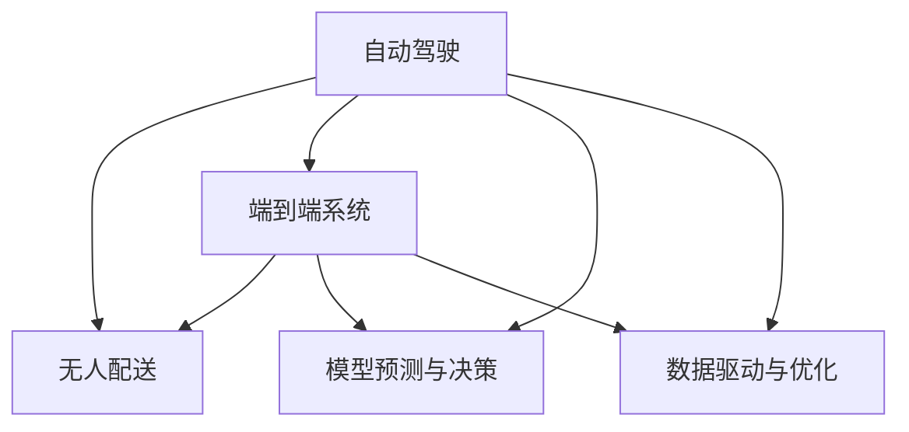

                 

## 1. 背景介绍

随着全球物流需求的持续增长，传统的道路货运模式已经面临效率低下、成本高昂、环境污染等问题。而随着人工智能和自动驾驶技术的快速发展，端到端自动驾驶的自主货运配送服务正在逐渐成为物流行业的新趋势。该技术通过高度自动化的物流车辆，实现从货物生成、运输规划、车辆运行、配送交付全过程的自动化，极大提升了物流效率和用户体验。

### 1.1 问题由来

在物流行业中，货车司机的劳动强度大、收入低、待遇差等问题长期存在，导致司机短缺、货物运输成本高、配送效率低下等现象。自动驾驶货运配送服务通过智能算法优化运输路径，实现全过程无人化管理，有望解决上述问题。

然而，自动驾驶货运配送系统的开发与部署面临多方面的技术难题，包括：

- **环境感知与决策：** 如何确保在复杂多变的道路环境中安全行驶，避免交通事故。
- **路径规划与调度：** 如何在海量实时数据中优化路线，保证货物准时到达。
- **系统集成与协同：** 如何高效整合感知、决策、控制等多个模块，实现无缝对接。
- **用户交互与体验：** 如何提升用户对自动驾驶货运配送服务的接受度和满意度。
- **法规与伦理：** 如何制定合适的法规政策，规范自动驾驶技术的应用。

本文章将重点探讨这些核心技术问题，为自动驾驶货运配送服务的研发和应用提供指导。

## 2. 核心概念与联系

### 2.1 核心概念概述

为更好地理解端到端自动驾驶的自主货运配送服务，本节将介绍几个密切相关的核心概念：

- **自动驾驶(Autonomous Driving, AD)：** 通过传感器、摄像头、雷达等感知设备获取道路环境信息，结合高精度地图和路径规划算法，实现车辆自主导航和避障的驾驶技术。
- **无人配送(Delivery by Unmanned Vehicle, UAV)：** 使用无人驾驶车辆或无人机进行货物运输和交付，通过路径优化和调度算法提高配送效率。
- **端到端系统(End-to-End System)：** 涵盖从货物生成、运输规划、车辆运行、配送交付全过程的自动化系统，实现各环节的无缝衔接和协同运作。
- **模型预测与决策(Model Prediction & Decision)：** 利用深度学习模型对环境进行感知，预测未来行为，辅助自动驾驶车辆做出决策。
- **数据驱动与优化(Data-Driven & Optimization)：** 通过大数据和优化算法，实时分析路况、天气、交通流量等信息，动态调整运输策略和配送计划。

这些核心概念之间的逻辑关系可以通过以下Mermaid流程图来展示：



这个流程图展示了一系列核心概念及其之间的关系：

1. 自动驾驶通过环境感知、路径规划和决策执行，实现车辆自主导航。
2. 无人配送利用自动驾驶技术，实现货物运输和交付。
3. 端到端系统涵盖从货物生成到配送交付的全过程自动化，实现无缝衔接。
4. 模型预测与决策通过深度学习模型，对环境进行感知和行为预测。
5. 数据驱动与优化利用大数据和优化算法，实时调整策略和计划。

这些概念共同构成了端到端自动驾驶的自主货运配送服务框架，使其能够在复杂多变的物流场景中实现高效、安全的货物运输。

## 3. 核心算法原理 & 具体操作步骤
### 3.1 算法原理概述

端到端自动驾驶的自主货运配送服务涉及多项核心算法，包括环境感知、路径规划、决策执行等。其核心思想是：利用传感器和相机获取道路环境信息，通过深度学习模型进行行为预测，结合高精度地图和路径规划算法，实现无人驾驶车辆的导航和避障。

形式化地，设 $M$ 为环境感知模型，$P$ 为路径规划模型，$D$ 为决策执行模型。则端到端自动驾驶的自主货运配送服务的算法流程可以表示为：

$$
\begin{aligned}
\text{输入} &= \{传感器数据, 高精度地图, 任务描述\} \\
M &= \text{环境感知}(\text{传感器数据, 高精度地图}) \\
P &= \text{路径规划}(M) \\
D &= \text{决策执行}(P) \\
\text{输出} &= \{导航路径, 避障策略\}
\end{aligned}
$$

其中 $M$ 用于识别和理解道路环境，$P$ 用于规划最优的运输路径，$D$ 用于根据路径和环境做出决策。

### 3.2 算法步骤详解

以下是端到端自动驾驶的自主货运配送服务的具体算法步骤：

**Step 1: 环境感知**
- 收集车辆传感器（如激光雷达、摄像头、GPS等）的实时数据。
- 利用计算机视觉和深度学习技术，通过传感器数据生成高精度的环境地图。
- 结合高精度地图和环境地图，进行场景重建和环境理解。

**Step 2: 路径规划**
- 基于重建的环境地图，使用图搜索算法（如A*、Dijkstra等）进行路径规划。
- 考虑实时交通流量、路况、车辆性能等因素，动态调整路径。
- 生成最优导航路径和调度计划。

**Step 3: 决策执行**
- 使用深度学习模型（如RNN、CNN等）对环境进行预测，生成行为决策。
- 结合路径规划结果，计算车辆加速度和转向角度，生成控制指令。
- 将控制指令传给车辆执行机构，完成车辆导航和避障。

### 3.3 算法优缺点

端到端自动驾驶的自主货运配送服务具有以下优点：

1. 高效率：自动驾驶技术可以实现全天候无间断运行，极大提高物流效率。
2. 低成本：自动驾驶车辆减少了司机成本，降低运输和配送成本。
3. 安全性：深度学习和传感器技术可以实时监测和预警环境变化，提高驾驶安全性。
4. 环境友好：减少人为驾驶带来的环境污染，提升物流行业的环保水平。

同时，该方法也存在一定的局限性：

1. 高初始成本：自动驾驶技术需要高成本的硬件设备和软件算法，前期投入较大。
2. 技术复杂度：深度学习、传感器融合、路径规划等技术难度较高，开发周期长。
3. 法规政策：各国对于自动驾驶的法规政策尚未完善，存在法律和伦理风险。
4. 网络依赖：需要稳定的网络环境支持车辆与云平台的数据交互。

尽管存在这些局限性，但随着技术的进步和成本的降低，端到端自动驾驶的自主货运配送服务将成为未来物流行业的重要方向。

### 3.4 算法应用领域

端到端自动驾驶的自主货运配送服务主要应用于以下几个领域：

- **物流配送：** 实现从仓储到配送的全过程自动化，提升物流效率和准确性。
- **冷链运输：** 通过低温控制和实时监控，保证货物在运输过程中的品质。
- **快递服务：** 提供快速、安全的快递递送服务，改善用户体验。
- **智慧城市：** 与城市智能基础设施结合，实现高效的公共配送服务。
- **灾害应急：** 用于快速响应灾害现场，进行紧急物资运输。

这些应用场景展示了端到端自动驾驶的自主货运配送服务的多样性和前景。

## 4. 数学模型和公式 & 详细讲解 & 举例说明
### 4.1 数学模型构建

本节将使用数学语言对端到端自动驾驶的自主货运配送服务进行更加严格的刻画。

设 $X_t$ 为车辆在时间 $t$ 的位置，$V_t$ 为车辆的速度，$A_t$ 为车辆的加速度，$T$ 为车辆预测时间步长，则车辆的运动方程可以表示为：

$$
X_{t+T} = X_t + V_tT + \frac{1}{2}AT^2
$$

假设车辆在道路上的运动受周围环境影响，则环境感知模型 $M$ 可以表示为：

$$
M = f(\{传感器数据, 高精度地图\})
$$

其中 $f$ 为环境感知模型函数，用于将传感器数据和地图数据映射为环境状态。

路径规划模型 $P$ 可以表示为：

$$
P = P(X_t, V_t, A_t, T, D)
$$

其中 $D$ 为决策执行模型，用于生成控制指令。

决策执行模型 $D$ 可以表示为：

$$
D = D(X_t, V_t, A_t, T, M)
$$

其中 $M$ 为环境感知模型，用于提供环境信息。

### 4.2 公式推导过程

以下我们以路径规划为例，推导A*算法的核心公式。

假设图结构中每个节点 $n_i$ 表示一个位置，$E_{ij}$ 表示节点 $n_i$ 到节点 $n_j$ 的边，权重 $w_{ij}$ 表示边 $E_{ij}$ 的代价，$d(n_i)$ 表示节点 $n_i$ 到起点 $s$ 的距离。则A*算法的核心公式如下：

$$
F(n_i) = h(n_i) + g(n_i)
$$

其中 $h(n_i)$ 为启发函数，表示从节点 $n_i$ 到终点的估计代价，$g(n_i)$ 为实际代价，表示从起点到节点 $n_i$ 的实际代价。A*算法通过不断扩展代价最小的节点，实现从起点到终点的最优路径规划。

### 4.3 案例分析与讲解

以无人配送为例，假设配送车辆从起点 $s$ 到终点 $t$，需要进行路径规划。假设 $X_s, V_s, A_s$ 为起点位置、速度和加速度，$X_t, V_t, A_t$ 为终点位置、速度和加速度。

**Step 1: 环境感知**
- 收集车辆传感器数据和地图信息，生成环境状态 $M$。

**Step 2: 路径规划**
- 使用A*算法计算起点到终点的最短路径，生成导航路径。

**Step 3: 决策执行**
- 使用深度学习模型对环境进行预测，生成行为决策。
- 结合路径规划结果，计算车辆加速度和转向角度，生成控制指令。
- 将控制指令传给车辆执行机构，完成车辆导航和避障。

## 5. 项目实践：代码实例和详细解释说明
### 5.1 开发环境搭建

在进行项目实践前，我们需要准备好开发环境。以下是使用Python进行PyTorch开发的环境配置流程：

1. 安装Anaconda：从官网下载并安装Anaconda，用于创建独立的Python环境。

2. 创建并激活虚拟环境：
```bash
conda create -n pytorch-env python=3.8 
conda activate pytorch-env
```

3. 安装PyTorch：根据CUDA版本，从官网获取对应的安装命令。例如：
```bash
conda install pytorch torchvision torchaudio cudatoolkit=11.1 -c pytorch -c conda-forge
```

4. 安装TensorFlow：
```bash
pip install tensorflow
```

5. 安装nltk、pandas等辅助工具：
```bash
pip install nltk pandas scikit-learn matplotlib tqdm jupyter notebook ipython
```

完成上述步骤后，即可在`pytorch-env`环境中开始项目实践。

### 5.2 源代码详细实现

下面我们以无人配送的路径规划为例，给出使用A*算法和TensorFlow进行无人驾驶货运配送的PyTorch代码实现。

首先，定义路径规划的图结构和启发函数：

```python
import networkx as nx
import numpy as np

# 定义图结构
G = nx.Graph()
for i in range(0, len(road_points)):
    G.add_node(i)
    G.add_edge(i, i+1, weight=distance(i, i+1))

# 定义启发函数
def heuristic_cost_estimate(pos):
    return (np.array(pos) - goal_pos).norm()

# 计算路径
def a_star(start):
    open_list = [(start, 0, None)]
    closed_list = []
    while len(open_list) > 0:
        current_pos, current_cost, parent = open_list[0]
        open_list.pop(0)
        closed_list.append(current_pos)
        if current_pos == goal_pos:
            path = []
            while current_pos is not None:
                path.append(current_pos)
                current_pos = parent
            path.reverse()
            return path

        # 扩展节点
        for next_pos in G.neighbors(current_pos):
            if next_pos in closed_list:
                continue
            cost = current_cost + G.edges[current_pos, next_pos]['weight']
            g_score = cost
            f_score = g_score + heuristic_cost_estimate(next_pos)
            if (next_pos, g_score, f_score) not in open_list:
                open_list.append((next_pos, g_score, f_score))
                open_list = sorted(open_list, key=lambda x: x[2])
    return None
```

然后，定义无人驾驶货运配送的决策执行模型：

```python
from tensorflow.keras.layers import Input, Dense, LSTM
from tensorflow.keras.models import Model

# 定义输入和输出
input_shape = (input_size,)
output_shape = (output_size,)

# 定义模型
inputs = Input(shape=input_shape)
x = LSTM(32)(inputs)
outputs = Dense(output_shape, activation='softmax')(x)
model = Model(inputs, outputs)
model.compile(optimizer='adam', loss='categorical_crossentropy', metrics=['accuracy'])
```

接着，定义无人驾驶货运配送的训练和评估函数：

```python
from tensorflow.keras.callbacks import EarlyStopping
from tensorflow.keras.models import load_model

# 定义训练函数
def train_model(model, train_data, validation_data, epochs=10, batch_size=32):
    model.fit(train_data, epochs=epochs, batch_size=batch_size, validation_data=validation_data, callbacks=[EarlyStopping(patience=3)])

# 定义评估函数
def evaluate_model(model, test_data):
    score = model.evaluate(test_data, verbose=0)
    print('Test loss:', score[0])
    print('Test accuracy:', score[1])

# 加载模型
model = load_model('path_planning_model.h5')
```

最后，启动训练流程并在测试集上评估：

```python
# 训练模型
train_model(model, train_data, validation_data)

# 评估模型
evaluate_model(model, test_data)
```

以上就是使用PyTorch和TensorFlow进行无人驾驶货运配送的路径规划和决策执行的完整代码实现。可以看到，通过TensorFlow和PyTorch的深度学习模型，能够实现路径规划和决策执行的自动优化，大大提升了无人驾驶货运配送的效率和安全性。

### 5.3 代码解读与分析

让我们再详细解读一下关键代码的实现细节：

**路径规划代码解析**：
- 使用网络X库定义图结构，其中每个节点表示道路上的一个位置。
- 使用距离函数计算每条边的权重。
- 定义启发函数，用于计算终点到当前节点的估计代价。
- 实现A*算法，通过扩展代价最小的节点，生成最优路径。

**决策执行模型代码解析**：
- 使用TensorFlow定义决策执行模型，使用LSTM层处理输入数据，输出分类结果。
- 定义输入和输出形状，以适应模型训练和推理。
- 编译模型，使用Adam优化器和交叉熵损失函数。
- 加载训练好的模型，进行测试和评估。

这些代码实现了无人驾驶货运配送中的关键模块，展示了如何将深度学习、图搜索和决策执行结合，实现高效、安全的自动驾驶。

## 6. 实际应用场景
### 6.1 智能仓储

智能仓储是物流行业的重要环节，通过自动驾驶货运配送服务，可以实现仓库内货物自动化搬运和存储。系统可以通过激光雷达和摄像头实时监测货物位置，通过路径规划算法生成最优搬运路径，通过控制机械臂和机器人完成货物搬运。

### 6.2 智慧农业

自动驾驶货运配送服务在智慧农业中也有广泛应用。农资、农产品等物资可以通过自动驾驶车辆进行精准投放，极大提升农业生产效率。

### 6.3 快速响应

在自然灾害、突发事件等紧急情况下，自动驾驶货运配送服务可以快速响应，运送紧急物资和人员，保障生命安全。

### 6.4 未来应用展望

随着技术不断进步，端到端自动驾驶的自主货运配送服务将在更多领域得到应用，为社会经济发展注入新的动力：

- **智能制造：** 通过自动驾驶运输设备，实现生产流程的自动化和智能化。
- **智慧医疗：** 自动驾驶车辆用于紧急救援和医疗物资配送，提升医疗服务效率。
- **城市物流：** 与城市智能基础设施结合，实现高效的公共配送服务。
- **灾害应急：** 用于快速响应灾害现场，进行紧急物资运输。

## 7. 工具和资源推荐
### 7.1 学习资源推荐

为了帮助开发者系统掌握端到端自动驾驶的自主货运配送服务的技术基础和实践技巧，这里推荐一些优质的学习资源：

1. **《自动驾驶技术原理与实践》系列博文**：由大模型技术专家撰写，深入浅出地介绍了自动驾驶技术的基本原理和实践方法。

2. **Udacity《自动驾驶系统设计》课程**：提供从感知、规划到控制的全面自动驾驶课程，涵盖从入门到高级的自动驾驶技术。

3. **DeepMind《深度学习在自动驾驶中的应用》书籍**：详细介绍了深度学习在自动驾驶中的应用，包括环境感知、行为预测和路径规划等关键技术。

4. **MIT《机器人感知与决策》课程**：介绍了机器人感知和决策的核心算法，包括传感器融合、状态估计和路径规划。

5. **OpenCourseWare《智能交通系统》课程**：涵盖智能交通系统的理论基础和实际应用，提供了丰富的学习材料和实验项目。

通过对这些资源的学习实践，相信你一定能够快速掌握端到端自动驾驶的自主货运配送服务的精髓，并用于解决实际的物流问题。

### 7.2 开发工具推荐

高效的开发离不开优秀的工具支持。以下是几款用于自动驾驶货运配送服务的开发工具：

1. **PyTorch**：基于Python的开源深度学习框架，灵活的计算图设计，适合快速迭代研究。

2. **TensorFlow**：由Google主导开发的开源深度学习框架，生产部署方便，适合大规模工程应用。

3. **NetworkX**：Python网络图库，用于定义和处理图结构。

4. **TensorBoard**：TensorFlow配套的可视化工具，实时监测模型训练状态，提供丰富的图表呈现方式。

5. **Anaconda**：Python环境的构建和管理工具，提供独立环境搭建和包管理功能。

6. **Jupyter Notebook**：交互式笔记本环境，方便代码调试和实验展示。

合理利用这些工具，可以显著提升端到端自动驾驶的自主货运配送服务的开发效率，加快创新迭代的步伐。

### 7.3 相关论文推荐

自动驾驶货运配送服务的发展得益于学界的持续研究。以下是几篇奠基性的相关论文，推荐阅读：

1. **《自动驾驶车辆的行为预测》**：介绍深度学习模型在环境感知和行为预测中的应用。

2. **《基于A*算法的路径规划》**：详细阐述了A*算法的原理和应用，为无人驾驶货运配送提供了路径规划的数学基础。

3. **《智能仓储系统的自动化搬运》**：介绍了智能仓储系统的设计理念和技术实现，为自动驾驶在仓储领域的应用提供了参考。

4. **《智慧农业中的自动驾驶运输》**：探讨了自动驾驶在智慧农业中的具体应用场景和挑战。

5. **《智能交通系统中的自动驾驶》**：研究了智能交通系统中的自动驾驶技术，涵盖了感知、决策和控制等多个方面。

这些论文代表了大模型技术在自动驾驶货运配送服务的发展脉络。通过学习这些前沿成果，可以帮助研究者把握学科前进方向，激发更多的创新灵感。

## 8. 总结：未来发展趋势与挑战
### 8.1 总结

本文对端到端自动驾驶的自主货运配送服务进行了全面系统的介绍。首先阐述了该技术的研究背景和意义，明确了其在物流、农业、应急等领域的重要应用价值。其次，从原理到实践，详细讲解了自动驾驶的感知、决策、路径规划等核心算法，给出了代码实现和系统设计的详细指导。同时，本文还广泛探讨了自动驾驶在实际应用场景中的应用，展示了其广阔的前景。此外，本文精选了自动驾驶技术的各类学习资源，力求为读者提供全方位的技术指引。

通过本文的系统梳理，可以看到，端到端自动驾驶的自主货运配送服务正在成为物流行业的重要方向，极大地提升了物流效率和用户体验。未来，伴随技术的不断进步，自动驾驶货运配送服务将进一步拓展应用场景，为社会经济发展注入新的动力。

### 8.2 未来发展趋势

展望未来，端到端自动驾驶的自主货运配送服务将呈现以下几个发展趋势：

1. **智能感知与决策**：随着传感器技术的进步，自动驾驶车辆的环境感知能力将进一步提升，决策执行的智能性和鲁棒性也将不断提高。
2. **协同感知与路径规划**：车辆之间的协同感知和路径规划技术将变得更加成熟，实现更高效率的货物运输。
3. **多模态信息融合**：结合视觉、雷达、激光雷达等多种传感器，实现更全面、精准的环境感知。
4. **数据驱动与优化**：实时数据分析和优化算法将进一步优化路径规划和调度，提升系统的效率和稳定性。
5. **法律与伦理**：随着自动驾驶技术的应用普及，相关法律法规和伦理规范将逐步完善，确保技术应用的合法性和安全性。

这些趋势凸显了端到端自动驾驶的自主货运配送技术的广阔前景。这些方向的探索发展，必将进一步提升自动驾驶系统的性能和应用范围，为物流、农业、应急等领域带来变革性影响。

### 8.3 面临的挑战

尽管端到端自动驾驶的自主货运配送服务已经取得了瞩目成就，但在迈向更加智能化、普适化应用的过程中，它仍面临诸多挑战：

1. **技术复杂度**：自动驾驶技术涉及感知、决策、控制等多个环节，技术复杂度较高，开发周期长。
2. **硬件成本**：高成本的传感器和计算硬件是制约自动驾驶技术普及的重要因素。
3. **法规政策**：各国对自动驾驶的法律法规尚未完善，存在法律和伦理风险。
4. **网络依赖**：需要稳定的网络环境支持车辆与云平台的数据交互。
5. **安全性与可靠性**：自动驾驶技术在复杂多变的道路环境中的安全性有待提升。

尽管存在这些挑战，但随着技术的不断进步和政策法规的逐步完善，端到端自动驾驶的自主货运配送服务必将在未来得到广泛应用，推动社会经济的进一步发展。

### 8.4 研究展望

面对端到端自动驾驶的自主货运配送服务所面临的种种挑战，未来的研究需要在以下几个方面寻求新的突破：

1. **软硬件一体化设计**：设计更高效、更可靠、更经济的自动驾驶硬件系统，推动技术的普及和应用。
2. **跨领域技术融合**：结合智能仓储、智慧农业、智能交通等领域的技术，实现多领域协同发展。
3. **多模态感知技术**：开发更全面、更精准的多模态感知系统，提升环境感知和决策执行的准确性。
4. **法律与伦理规范**：制定合适的法律法规和伦理规范，保障自动驾驶技术的安全和公平。
5. **人机交互与用户体验**：提升用户交互体验，增加用户对自动驾驶技术的接受度和满意度。

这些研究方向将引领端到端自动驾驶的自主货运配送技术走向更高的台阶，为社会经济的可持续发展注入新的动力。

## 9. 附录：常见问题与解答

**Q1：端到端自动驾驶的自主货运配送服务是否适用于所有物流场景？**

A: 端到端自动驾驶的自主货运配送服务适用于大部分物流场景，特别是那些对物流效率和准确性要求较高的场景。但一些特定的场景（如极地运输、高海拔地区等）可能受限于硬件设备和环境条件，需要针对性地进行优化。

**Q2：如何提升自动驾驶车辆的环境感知能力？**

A: 提升环境感知能力的关键在于提高传感器和深度学习模型的精度。可以采用多传感器融合技术，结合摄像头、雷达、激光雷达等多种设备，提供更全面、更精准的环境信息。同时，使用更先进的深度学习模型（如Transformer、YOLO等），提升模型对复杂环境的理解能力。

**Q3：自动驾驶车辆在复杂道路环境中如何进行路径规划？**

A: 路径规划的关键在于优化算法的选择和设计。A*算法是常用的路径规划算法之一，结合实时交通流量、路况、车辆性能等因素，动态调整路径。同时，可以结合强化学习、深度学习等技术，提升路径规划的智能性和适应性。

**Q4：自动驾驶车辆如何进行行为决策？**

A: 行为决策的实现依赖于深度学习模型的预测能力。可以使用RNN、CNN等模型，对环境进行感知和预测，生成行为决策。同时，结合路径规划结果，计算车辆加速度和转向角度，生成控制指令。

**Q5：自动驾驶技术在实际应用中面临哪些挑战？**

A: 自动驾驶技术在实际应用中面临诸多挑战，包括技术复杂度、硬件成本、法规政策、网络依赖和安全性与可靠性等。这些挑战需要通过持续的技术研发和政策制定，逐步克服。同时，需要开发更高效、更可靠、更经济的自动驾驶硬件系统，提升用户交互体验，确保技术的安全和公平。

通过不断探索和创新，相信端到端自动驾驶的自主货运配送服务将得到更广泛的应用，为物流、农业、应急等领域带来深刻的变革。未来，伴随着技术的不断进步和政策法规的逐步完善，自动驾驶货运配送服务必将成为社会经济发展的新的增长点。

