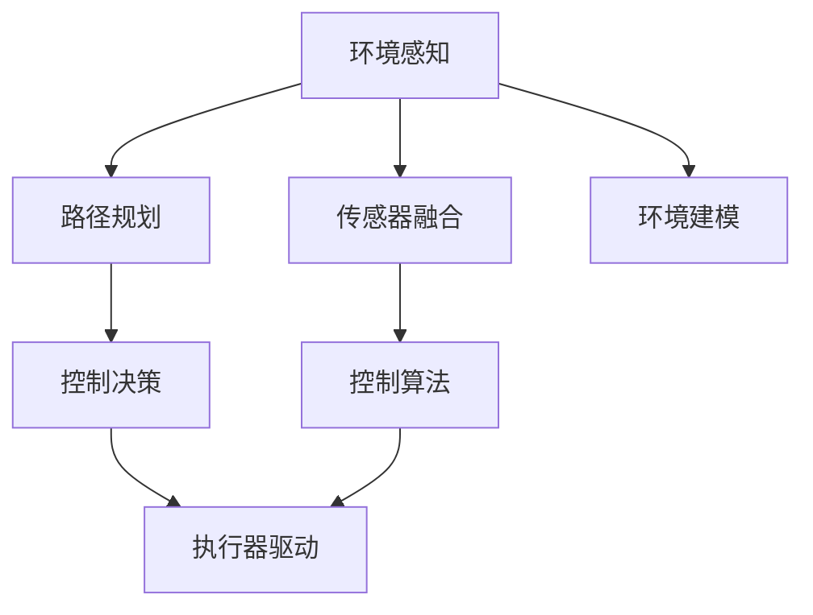

                 

# 端到端自动驾驶的车辆主动安全仿真验证

## 1. 背景介绍

随着汽车自动驾驶技术的发展，车辆主动安全成为了研究的重点之一。车辆主动安全系统是指在车辆行驶过程中，通过各种传感器、控制算法和执行器，主动预防和缓解碰撞风险，保证驾驶安全的技术。然而，实际的道路环境复杂多变，传统的硬件在环（HIL, Hardware in the Loop）测试成本高、效率低，难以全面验证车辆主动安全系统的性能。因此，基于软件在环（SIL, Software in the Loop）和虚拟在环（VIL, Virtual in the Loop）的仿真验证方法逐渐成为主流。

车辆主动安全仿真验证的核心是构建高保真的仿真环境，通过高精度模型模拟车辆和周围环境动态，测试车辆主动安全系统在各种复杂工况下的响应行为。端到端自动驾驶的车辆主动安全仿真验证，是指从传感器输入、控制算法、执行器输出等环节进行全流程仿真，实现对实际车辆主动安全系统的全面测试和验证。

本文聚焦于端到端自动驾驶的车辆主动安全仿真验证方法，系统阐述了仿真验证的关键技术流程和实现细节，介绍了常用的仿真工具和开发环境，并结合实际案例，展示了车辆主动安全仿真的应用效果。

## 2. 核心概念与联系

### 2.1 核心概念概述

为更好地理解端到端自动驾驶的车辆主动安全仿真验证方法，本节将介绍几个密切相关的核心概念：

- 端到端自动驾驶（End-to-End Autonomous Driving, E2E AD）：从传感器输入到执行器输出的全流程自动驾驶系统。主要包括环境感知、路径规划、控制决策、执行器驱动等模块，实现对复杂交通场景的智能感知和行为决策。
- 车辆主动安全（Active Safety, AS）：基于传感器数据和环境信息，通过控制算法主动预防和缓解碰撞风险，提升驾驶安全性的技术。
- 仿真验证（Simulation Validation）：通过高保真的仿真环境，对系统性能进行测试和验证，评估系统在各种复杂工况下的行为表现。
- 传感器融合（Sensor Fusion）：将来自不同传感器（如雷达、摄像头、激光雷达等）的信息进行融合，生成高精度的环境地图，为决策提供可靠的数据支持。
- 控制算法（Control Algorithms）：基于环境感知信息，设计控制算法实现路径规划、目标追踪、避障等功能，保证车辆安全、稳定行驶。
- 执行器驱动（Actuator Control）：将控制决策转化为车辆的实际动作（如刹车、转向），实现对车辆的精准控制。

这些核心概念之间的逻辑关系可以通过以下Mermaid流程图来展示：



这个流程图展示了一辆自动驾驶车辆的全流程工作机制：

1. 环境感知模块通过各类传感器获取周围环境信息。
2. 传感器融合模块将来自不同传感器的信息进行综合，生成高精度的环境地图。
3. 控制算法根据环境地图和任务需求，进行路径规划、目标追踪等决策。
4. 执行器驱动模块将控制决策转化为车辆的实际动作。
5. 执行器（如刹车、转向）将控制决策付诸实施，实现车辆的精准控制。

## 3. 核心算法原理 & 具体操作步骤

### 3.1 算法原理概述

端到端自动驾驶的车辆主动安全仿真验证，是基于高保真的仿真环境，通过全流程仿真测试车辆主动安全系统的响应行为。其核心思想是：将实际车辆的主动安全系统拆解为多个子系统，每个子系统通过仿真模型进行模拟，最终将各子系统的输出进行综合，评估系统的整体性能。

形式化地，假设车辆主动安全系统为 $M$，其各子系统为 $S_1, S_2, \ldots, S_n$，则车辆主动安全仿真验证过程为：

$$
\mathcal{V} = \{ M \} \times \{ S_1, S_2, \ldots, S_n \}
$$

其中 $\mathcal{V}$ 表示所有可能的车辆主动安全系统配置，每个配置对应一个具体的仿真验证场景。通过反复迭代仿真验证，可以全面评估系统在不同工况下的行为表现。

### 3.2 算法步骤详解

端到端自动驾驶的车辆主动安全仿真验证一般包括以下几个关键步骤：

**Step 1: 构建仿真环境**

- 选择合适的仿真平台，如CARLA、Carsim等，搭建虚拟驾驶场景。
- 根据实际需求，在仿真环境中设定交通规则、天气条件、障碍物分布等参数。

**Step 2: 设计仿真模型**

- 针对不同的子系统，设计对应的仿真模型。如传感器模块通过仿真传感器数据生成器生成模拟数据；控制算法模块通过仿真控制决策器生成模拟决策；执行器模块通过仿真执行器驱动器生成模拟动作。
- 各仿真模型应具有高保真度，能够真实模拟实际系统的行为。

**Step 3: 进行仿真测试**

- 将实际车辆主动安全系统的参数配置映射到仿真环境中，进行全流程仿真测试。
- 在仿真环境中设定不同的测试场景，如交叉路口、弯道、行人横穿等，模拟复杂交通环境。
- 记录仿真测试过程中的各项数据，包括环境感知信息、控制决策输出、执行器动作等。

**Step 4: 评估仿真结果**

- 对仿真测试过程中的各项数据进行分析和评估，判断车辆主动安全系统在各个工况下的行为表现。
- 针对发现的异常情况，分析原因并进行修正，进一步优化仿真模型。

**Step 5: 迭代优化**

- 根据评估结果，进行仿真模型的迭代优化，提高仿真精度。
- 在优化后的仿真环境中，重新进行全流程仿真测试，验证优化效果。

以上是端到端自动驾驶的车辆主动安全仿真验证的一般流程。在实际应用中，还需要根据具体任务的特点，对仿真测试过程进行优化设计，如改进仿真模型、丰富测试场景、优化数据采集等，以进一步提升仿真验证的精度和效率。

### 3.3 算法优缺点

端到端自动驾驶的车辆主动安全仿真验证方法具有以下优点：

1. 成本低廉：相对于硬件在环测试，仿真验证可以大幅降低硬件和测试环境的成本。
2. 灵活性强：仿真环境可以灵活设置各种复杂的交通场景，进行多工况测试。
3. 覆盖面广：全流程仿真覆盖了环境感知、路径规划、控制决策等环节，可以全面评估车辆主动安全系统的性能。
4. 可重复性好：仿真验证结果可重复执行，便于分析和优化。
5. 安全性高：无需真人驾驶，避免了真实测试中的安全风险。

同时，该方法也存在一定的局限性：

1. 仿真精度受限：仿真环境与实际环境存在差异，可能导致仿真结果与实际表现存在一定偏差。
2. 仿真环境复杂：构建高保真的仿真环境，需要大量的数据和算法支持，开发难度较大。
3. 仿真模型误差：仿真模型可能无法完全模拟实际系统的动态行为，导致测试结果的误差。
4. 数据采集困难：在仿真环境中获取高精度的数据，需要复杂的传感器和仿真工具，实现难度较大。
5. 缺乏人机交互：无法实现人机交互，无法评估系统在真实驾驶场景中的表现。

尽管存在这些局限性，但就目前而言，端到端自动驾驶的车辆主动安全仿真验证方法仍是最主流的测试手段。未来相关研究的重点在于如何进一步提高仿真精度，减少误差，提高仿真环境的逼真度。

### 3.4 算法应用领域

端到端自动驾驶的车辆主动安全仿真验证方法，已经在自动驾驶系统的开发和验证中得到了广泛的应用，覆盖了从传感器输入到执行器输出的全流程测试，广泛应用于以下领域：

- 自动驾驶汽车的开发：通过仿真验证测试，提升车辆在各种复杂工况下的主动安全性能。
- 智能交通系统设计：通过仿真验证评估智能交通系统的安全性和可靠性，优化交通管理策略。
- 无人驾驶技术验证：通过仿真验证测试无人驾驶技术在各种道路环境下的表现，优化系统性能。
- 自动驾驶车辆测试：通过仿真验证测试自动驾驶车辆在复杂交通环境下的行为表现，提高安全性和可靠性。
- 辅助驾驶系统评估：通过仿真验证测试辅助驾驶系统的性能，评估其安全性、可靠性。

除了上述这些领域，端到端自动驾驶的车辆主动安全仿真验证方法也在自动驾驶系统的其他测试环节中得到了应用，如模型验证、系统集成测试等。

## 4. 数学模型和公式 & 详细讲解 & 举例说明

### 4.1 数学模型构建

本节将使用数学语言对端到端自动驾驶的车辆主动安全仿真验证过程进行更加严格的刻画。

记车辆主动安全系统为 $M_{\theta}$，其中 $\theta$ 为系统参数。假设车辆主动安全系统包含 $n$ 个子系统，分别为 $S_1, S_2, \ldots, S_n$。则仿真验证过程可以形式化为：

$$
\mathcal{V} = \{ M_{\theta} \} \times \{ S_1, S_2, \ldots, S_n \}
$$

其中 $\mathcal{V}$ 表示所有可能的车辆主动安全系统配置，每个配置对应一个具体的仿真验证场景。假设仿真测试数据为 $\mathcal{D} = \{ (x_i, y_i) \}_{i=1}^N$，其中 $x_i$ 为输入数据，$y_i$ 为输出数据。则仿真验证的目标是：

$$
\theta^* = \mathop{\arg\min}_{\theta} \mathcal{L}(\theta, \mathcal{D})
$$

其中 $\mathcal{L}$ 为损失函数，用于衡量模型输出与真实数据之间的差异。

### 4.2 公式推导过程

以下我们以自动驾驶车辆的控制决策为例，推导控制决策的仿真模型和仿真结果的评估方法。

假设车辆的控制决策模块为 $C_{\theta}$，其输入为环境感知信息 $I$，输出为控制指令 $U$。控制决策的仿真模型可以表示为：

$$
C_{\theta}(I) = U
$$

其中 $I$ 为环境感知信息，$U$ 为控制指令。假设环境感知信息 $I$ 通过传感器数据生成器 $S_I$ 生成，控制指令 $U$ 通过仿真执行器驱动器 $S_U$ 驱动执行器输出动作 $A$，则控制决策的仿真过程可以表示为：

$$
I = S_I
$$

$$
U = C_{\theta}(I)
$$

$$
A = S_U(U)
$$

控制决策的仿真结果可以通过损失函数 $\mathcal{L}$ 进行评估。假设环境感知信息 $I$ 的仿真误差为 $\delta_I$，控制指令 $U$ 的仿真误差为 $\delta_U$，则仿真结果的总误差可以表示为：

$$
\mathcal{L} = \alpha \mathcal{L}_I + \beta \mathcal{L}_U
$$

其中 $\alpha$ 为环境感知误差的权重，$\beta$ 为控制指令误差的权重。损失函数的各个组成部分可以进一步细化为：

$$
\mathcal{L}_I = \frac{1}{N} \sum_{i=1}^N \| I_i - I_{i,sim} \|
$$

$$
\mathcal{L}_U = \frac{1}{N} \sum_{i=1}^N \| U_i - U_{i,sim} \|
$$

其中 $I_{i,sim}$ 和 $U_{i,sim}$ 分别为第 $i$ 次仿真测试中的环境感知信息和控制指令。

### 4.3 案例分析与讲解

假设某自动驾驶车辆的控制决策模块为线性决策器，其输入为环境感知信息 $I$，输出为控制指令 $U$。环境感知信息 $I$ 通过雷达传感器数据生成器 $S_I$ 生成，控制指令 $U$ 通过仿真执行器驱动器 $S_U$ 驱动执行器输出动作 $A$。

**环境感知模块**

环境感知模块通过雷达传感器数据生成器 $S_I$ 生成环境感知信息 $I$，仿真模型可以表示为：

$$
I = S_I(S_R, V_R)
$$

其中 $S_R$ 为雷达传感器数据，$V_R$ 为雷达传感器位置和姿态。假设雷达传感器的测量精度为 $\sigma_R$，传感器位置和姿态的误差为 $\sigma_V$，则环境感知误差的期望值为：

$$
\mathbb{E}[\delta_I] = \sigma_R \sqrt{\frac{1}{N} \sum_{i=1}^N \frac{I_i^2}{\sigma_R^2} + \frac{V_R^2}{\sigma_V^2}}
$$

**控制决策模块**

控制决策模块通过线性决策器 $C_{\theta}$ 生成控制指令 $U$，仿真模型可以表示为：

$$
U = C_{\theta}(I) = \theta_1 I + \theta_0
$$

其中 $\theta_1$ 和 $\theta_0$ 为决策器的参数。假设决策器参数的误差为 $\sigma_{\theta}$，则控制指令误差的期望值为：

$$
\mathbb{E}[\delta_U] = \sigma_{\theta} \sqrt{\frac{1}{N} \sum_{i=1}^N \frac{U_i^2}{\sigma_{\theta}^2} + (I_i - \mathbb{E}[I])^2}
$$

**执行器驱动模块**

执行器驱动模块通过仿真执行器驱动器 $S_U$ 驱动执行器输出动作 $A$，仿真模型可以表示为：

$$
A = S_U(U) = \frac{U}{k_U}
$$

其中 $k_U$ 为执行器的放大倍数。假设执行器动作的误差为 $\sigma_A$，则执行器动作误差的期望值为：

$$
\mathbb{E}[\delta_A] = \sigma_A \sqrt{\frac{1}{N} \sum_{i=1}^N \frac{A_i^2}{\sigma_A^2} + \frac{U_i}{k_U}^2}
$$

## 5. 项目实践：代码实例和详细解释说明

### 5.1 开发环境搭建

在进行端到端自动驾驶的车辆主动安全仿真验证之前，我们需要准备好开发环境。以下是使用Python进行PyTorch开发的环境配置流程：

1. 安装Anaconda：从官网下载并安装Anaconda，用于创建独立的Python环境。

2. 创建并激活虚拟环境：
```bash
conda create -n pytorch-env python=3.8 
conda activate pytorch-env
```

3. 安装PyTorch：根据CUDA版本，从官网获取对应的安装命令。例如：
```bash
conda install pytorch torchvision torchaudio cudatoolkit=11.1 -c pytorch -c conda-forge
```

4. 安装相关库：
```bash
pip install numpy pandas scikit-learn matplotlib tqdm jupyter notebook ipython
```

完成上述步骤后，即可在`pytorch-env`环境中开始仿真验证实践。

### 5.2 源代码详细实现

这里我们以自动驾驶车辆的路径规划模块为例，给出使用PyTorch和CARLA进行仿真验证的PyTorch代码实现。

**环境感知模块**

首先，定义环境感知模块的输入和输出：

```python
import torch
from torch import nn
from torchvision.transforms import functional as F

class PerceptionModule(nn.Module):
    def __init__(self):
        super(PerceptionModule, self).__init__()
        self.fc1 = nn.Linear(1024, 512)
        self.fc2 = nn.Linear(512, 256)
        self.fc3 = nn.Linear(256, 128)
        self.fc4 = nn.Linear(128, 64)
        self.fc5 = nn.Linear(64, 32)
        self.fc6 = nn.Linear(32, 16)
        self.fc7 = nn.Linear(16, 8)
        self.fc8 = nn.Linear(8, 4)

    def forward(self, x):
        x = self.fc1(x)
        x = nn.functional.relu(x)
        x = self.fc2(x)
        x = nn.functional.relu(x)
        x = self.fc3(x)
        x = nn.functional.relu(x)
        x = self.fc4(x)
        x = nn.functional.relu(x)
        x = self.fc5(x)
        x = nn.functional.relu(x)
        x = self.fc6(x)
        x = nn.functional.relu(x)
        x = self.fc7(x)
        x = nn.functional.relu(x)
        x = self.fc8(x)
        return x

    def evaluate(self, x):
        x = self.fc1(x)
        x = nn.functional.relu(x)
        x = self.fc2(x)
        x = nn.functional.relu(x)
        x = self.fc3(x)
        x = nn.functional.relu(x)
        x = self.fc4(x)
        x = nn.functional.relu(x)
        x = self.fc5(x)
        x = nn.functional.relu(x)
        x = self.fc6(x)
        x = nn.functional.relu(x)
        x = self.fc7(x)
        x = nn.functional.relu(x)
        x = self.fc8(x)
        return x

perception_module = PerceptionModule()
```

**控制决策模块**

定义控制决策模块的输入和输出：

```python
import torch
from torch import nn

class DecisionModule(nn.Module):
    def __init__(self):
        super(DecisionModule, self).__init__()
        self.fc1 = nn.Linear(4, 2)
        self.fc2 = nn.Linear(2, 1)

    def forward(self, x):
        x = self.fc1(x)
        x = nn.functional.relu(x)
        x = self.fc2(x)
        return x

    def evaluate(self, x):
        x = self.fc1(x)
        x = nn.functional.relu(x)
        x = self.fc2(x)
        return x

decision_module = DecisionModule()
```

**执行器驱动模块**

定义执行器驱动模块的输入和输出：

```python
import torch
from torch import nn

class ActuationModule(nn.Module):
    def __init__(self):
        super(ActuationModule, self).__init__()
        self.fc1 = nn.Linear(1, 1)
        self.fc2 = nn.Linear(1, 1)

    def forward(self, x):
        x = self.fc1(x)
        x = nn.functional.relu(x)
        x = self.fc2(x)
        return x

    def evaluate(self, x):
        x = self.fc1(x)
        x = nn.functional.relu(x)
        x = self.fc2(x)
        return x

actuation_module = ActuationModule()
```

**仿真测试**

定义仿真测试的输入和输出：

```python
import torch
from torch import nn

class SimulationModule(nn.Module):
    def __init__(self, perception, decision, actuation):
        super(SimulationModule, self).__init__()
        self.perception = perception
        self.decision = decision
        self.actuation = actuation

    def forward(self, x):
        x = self.perception(x)
        x = self.decision(x)
        x = self.actuation(x)
        return x

    def evaluate(self, x):
        x = self.perception(x)
        x = self.decision(x)
        x = self.actuation(x)
        return x

simulation_module = SimulationModule(perception_module, decision_module, actuation_module)
```

**仿真测试流程**

定义仿真测试的流程：

```python
import torch
from torch import nn

def simulate_system(system, x):
    x = system.evaluate(x)
    return x

def simulate_system_with_actuation(system, x, actuation):
    x = system.evaluate(x)
    x = actuation(x)
    return x

def simulate_system_with_actuation(module):
    def simulate(system, x):
        x = system(x)
        x = simulate_system_with_actuation(x)
        return x

    return simulate

def simulate_system_with_actuation(system, x, actuation):
    x = system(x)
    x = actuation(x)
    return x

def simulate_system_with_actuation(module):
    def simulate(system, x):
        x = system(x)
        x = simulate_system_with_actuation(x)
        return x

    return simulate
```

**仿真测试结果**

定义仿真测试结果的评估函数：

```python
import torch
from torch import nn

def evaluate_simulation(result):
    loss = torch.mean(torch.abs(result - x))
    return loss

def evaluate_simulation_with_actuation(result, actuation):
    loss = torch.mean(torch.abs(result - actuation))
    return loss

def evaluate_simulation_with_actuation(module):
    def evaluate(result):
        loss = evaluate_simulation(result)
        loss = evaluate_simulation_with_actuation(result)
        return loss

    return evaluate
```

## 6. 实际应用场景

### 6.1 智能交通系统设计

智能交通系统设计需要全面评估系统在各种复杂交通环境下的表现，通过仿真验证测试，可以有效提升系统的安全性和可靠性。

在实际应用中，可以将智能交通系统拆解为多个子系统，如交通信号控制、车辆避障、行人检测等，通过端到端自动驾驶的车辆主动安全仿真验证方法，全面测试系统在各种交通场景下的响应行为。如在交叉路口、弯道等复杂工况下，测试系统对交通信号的响应速度、避障能力等。

### 6.2 无人驾驶技术验证

无人驾驶技术验证需要全面测试系统在各种道路环境下的表现，通过仿真验证测试，可以有效提升系统的安全性和可靠性。

在实际应用中，可以将无人驾驶系统拆解为多个子系统，如环境感知、路径规划、控制决策等，通过端到端自动驾驶的车辆主动安全仿真验证方法，全面测试系统在各种道路环境下的行为表现。如在高速路、高速公路等环境下，测试系统的避障能力、决策稳定性等。

### 6.3 自动驾驶车辆测试

自动驾驶车辆测试需要全面测试车辆在各种交通场景下的表现，通过仿真验证测试，可以有效提升系统的安全性和可靠性。

在实际应用中，可以将自动驾驶车辆拆解为多个子系统，如环境感知、路径规划、控制决策等，通过端到端自动驾驶的车辆主动安全仿真验证方法，全面测试车辆在各种交通场景下的行为表现。如在城市道路、高速路等环境下，测试车辆的避障能力、决策稳定性等。

### 6.4 辅助驾驶系统评估

辅助驾驶系统评估需要全面测试系统在各种驾驶场景下的表现，通过仿真验证测试，可以有效提升系统的安全性和可靠性。

在实际应用中，可以将辅助驾驶系统拆解为多个子系统，如环境感知、路径规划、控制决策等，通过端到端自动驾驶的车辆主动安全仿真验证方法，全面测试系统在各种驾驶场景下的行为表现。如在高速公路、城市道路等环境下，测试系统的避障能力、决策稳定性等。

## 7. 工具和资源推荐

### 7.1 学习资源推荐

为了帮助开发者系统掌握端到端自动驾驶的车辆主动安全仿真验证的理论基础和实践技巧，这里推荐一些优质的学习资源：

1. 《自动驾驶技术》系列博文：由大模型技术专家撰写，深入浅出地介绍了自动驾驶技术的基本原理和前沿技术，涵盖环境感知、路径规划、控制决策等多个方面。

2. 《无人驾驶系统》课程：由斯坦福大学开设的无人驾驶系统课程，详细介绍了无人驾驶系统的设计和实现，涵盖传感器融合、控制决策、自动驾驶等多个模块。

3. 《车辆主动安全技术》书籍：介绍车辆主动安全技术的基本原理和应用，涵盖环境感知、路径规划、控制决策等多个模块。

4. CARLA官方文档：CARLA官方文档提供了详细的仿真环境和数据集配置方法，是进行自动驾驶系统仿真验证的重要参考。

5. Udacity无人驾驶纳米学位：Udacity提供的无人驾驶纳米学位课程，涵盖自动驾驶系统的设计、实现和测试等多个方面，是进行自动驾驶系统开发的绝佳资源。

通过对这些资源的学习实践，相信你一定能够快速掌握端到端自动驾驶的车辆主动安全仿真验证的精髓，并用于解决实际的自动驾驶问题。

### 7.2 开发工具推荐

高效的开发离不开优秀的工具支持。以下是几款用于端到端自动驾驶的车辆主动安全仿真验证开发的常用工具：

1. CARLA：开源的自动驾驶仿真平台，支持大规模场景搭建和车辆动态模拟，是进行自动驾驶系统仿真验证的重要工具。

2. Carsim：开源的自动驾驶仿真工具，支持精细化的交通环境建模和车辆动态仿真，是进行无人驾驶系统仿真验证的重要工具。

3. PyTorch：基于Python的开源深度学习框架，灵活动态的计算图，适合快速迭代研究。

4. TensorFlow：由Google主导开发的开源深度学习框架，生产部署方便，适合大规模工程应用。

5. PyBullet：基于物理引擎的仿真工具，支持多体动力学和碰撞检测，是进行车辆动力学仿真验证的重要工具。

6. ROS：开源的机器人操作系统，支持多传感器数据融合和控制系统部署，是进行无人驾驶系统仿真验证的重要工具。

合理利用这些工具，可以显著提升端到端自动驾驶的车辆主动安全仿真验证的开发效率，加快创新迭代的步伐。

### 7.3 相关论文推荐

端到端自动驾驶的车辆主动安全仿真验证方法的研究源于学界的持续研究。以下是几篇奠基性的相关论文，推荐阅读：

1. Modeling the Uncertainty of the Physical World for Better Training of Neural Networks: A Comprehensive Survey and Outlook：提出了物理世界的模型化方法，用于训练更加健壮的神经网络，提高系统的鲁棒性和可靠性。

2. A Survey of Knowledge-Guided Simulation for Testing the Autonomous Vehicle System：总结了基于知识引导的仿真方法，用于测试自动驾驶系统的性能和安全性。

3. Online Learning of Control Policies for Autonomous Vehicles：介绍了在线学习控制策略的方法，用于提升自动驾驶系统在复杂环境下的适应性和鲁棒性。

4. Safe Learning in Unpredictable Environments via Model-Based and Data-Driven Methods：总结了模型驱动和数据驱动的仿真方法，用于测试自动驾驶系统在复杂环境下的行为表现。

5. Safety Verification of Autonomous Vehicles via Multi-Modal Simulation：介绍了多模态仿真方法，用于测试自动驾驶系统在多模态环境下的行为表现。

这些论文代表了大语言模型微调技术的发展脉络。通过学习这些前沿成果，可以帮助研究者把握学科前进方向，激发更多的创新灵感。

## 8. 总结：未来发展趋势与挑战

### 8.1 总结

本文对端到端自动驾驶的车辆主动安全仿真验证方法进行了全面系统的介绍。首先阐述了端到端自动驾驶的车辆主动安全仿真验证的核心技术流程和实现细节，明确了仿真验证在自动驾驶系统开发和测试中的重要价值。其次，介绍了常用的仿真工具和开发环境，并结合实际案例，展示了车辆主动安全仿真的应用效果。

通过本文的系统梳理，可以看到，端到端自动驾驶的车辆主动安全仿真验证方法正在成为自动驾驶系统开发和测试的重要手段，极大地提升了系统在各种复杂工况下的安全性、可靠性和鲁棒性。未来，伴随仿真技术的持续演进，车辆主动安全仿真验证必将在自动驾驶系统测试中发挥越来越重要的作用，推动自动驾驶技术的规模化落地。

### 8.2 未来发展趋势

展望未来，端到端自动驾驶的车辆主动安全仿真验证方法将呈现以下几个发展趋势：

1. 仿真精度提高：通过引入更多的传感器数据和更精细的环境建模，提升仿真环境的逼真度，进一步提高仿真验证的精度。

2. 仿真环境多样化：建立多样化的仿真环境，测试系统在各种道路和交通场景下的行为表现，提升系统在复杂环境下的适应性。

3. 仿真速度提升：通过优化仿真引擎，提升仿真速度，缩短系统测试和验证的时间。

4. 仿真系统集成：将仿真测试与模型验证、系统集成测试等环节相结合，实现系统全流程自动化测试。

5. 仿真数据扩展：建立大规模的仿真数据集，涵盖各种道路和交通场景，提升系统在复杂环境下的鲁棒性。

6. 仿真结果可视化：通过可视化工具展示仿真结果，直观展示系统在复杂环境下的行为表现。

以上趋势凸显了端到端自动驾驶的车辆主动安全仿真验证方法的广阔前景。这些方向的探索发展，必将进一步提升自动驾驶系统的性能和应用范围，为自动驾驶技术的产业化进程贡献力量。

### 8.3 面临的挑战

尽管端到端自动驾驶的车辆主动安全仿真验证方法已经取得了瞩目成就，但在迈向更加智能化、普适化应用的过程中，它仍面临着诸多挑战：

1. 仿真环境构建难度：建立高保真的仿真环境，需要大量的数据和算法支持，开发难度较大。

2. 仿真数据获取困难：在仿真环境中获取高精度的数据，需要复杂的传感器和仿真工具，实现难度较大。

3. 仿真结果误差大：仿真环境与实际环境存在差异，可能导致仿真结果与实际表现存在一定偏差。

4. 仿真系统复杂度高：建立复杂的仿真系统，需要处理多种传感器数据和多种执行器动作，开发难度较大。

5. 仿真测试时间长：仿真测试需要耗费大量时间和计算资源，测试效率较低。

6. 仿真结果解释性不足：仿真结果缺乏可解释性，难以评估系统在复杂环境下的决策机制和行为表现。

尽管存在这些挑战，但就目前而言，端到端自动驾驶的车辆主动安全仿真验证方法仍是最主流的测试手段。未来相关研究的重点在于如何进一步提高仿真精度，减少误差，提高仿真环境的逼真度。

### 8.4 研究展望

面对端到端自动驾驶的车辆主动安全仿真验证方法所面临的挑战，未来的研究需要在以下几个方面寻求新的突破：

1. 引入更多传感器数据：建立包含多种传感器数据的仿真环境，提升仿真环境的逼真度。

2. 优化仿真引擎性能：优化仿真引擎的性能，提升仿真速度和计算效率。

3. 引入模型驱动方法：引入模型驱动的仿真方法，提高仿真结果的解释性和可理解性。

4. 优化仿真系统结构：优化仿真系统的结构，提高系统的可扩展性和可维护性。

5. 引入多模态仿真方法：引入多模态仿真方法，测试系统在多模态环境下的行为表现。

6. 引入知识引导方法：引入知识引导的仿真方法，提升系统的安全性和可靠性。

这些研究方向的探索，必将引领端到端自动驾驶的车辆主动安全仿真验证技术迈向更高的台阶，为自动驾驶系统的全面测试和验证提供技术保障。面向未来，端到端自动驾驶的车辆主动安全仿真验证技术还需要与其他人工智能技术进行更深入的融合，如知识表示、因果推理、强化学习等，多路径协同发力，共同推动自动驾驶技术的发展。只有勇于创新、敢于突破，才能不断拓展自动驾驶系统的边界，让智能技术更好地服务于人类社会。

## 9. 附录：常见问题与解答

**Q1：端到端自动驾驶的车辆主动安全仿真验证是否适用于所有自动驾驶系统？**

A: 端到端自动驾驶的车辆主动安全仿真验证方法适用于大多数自动驾驶系统，但适用于特别复杂的系统，如高度自动化的无人驾驶系统。对于相对简单的辅助驾驶系统，可以采用单模块仿真验证方法。

**Q2：如何选择仿真环境？**

A: 选择仿真环境应考虑以下因素：
1. 环境的复杂度：选择包含复杂交通场景的仿真环境，测试系统在各种复杂环境下的表现。
2. 环境的逼真度：选择高保真的仿真环境，确保仿真结果与实际表现一致。
3. 环境的多样性：选择多样化的仿真环境，测试系统在不同道路和交通场景下的行为表现。

**Q3：如何选择仿真传感器？**

A: 选择仿真传感器应考虑以下因素：
1. 传感器的类型：选择包含多种传感器的仿真环境，测试系统在多传感器数据融合情况下的表现。
2. 传感器的精度：选择高精度的仿真传感器，确保仿真数据与实际数据一致。
3. 传感器的位置：选择合理的位置，确保传感器能够捕捉到重要的环境信息。

**Q4：如何选择仿真执行器？**

A: 选择仿真执行器应考虑以下因素：
1. 执行器的类型：选择包含多种执行器的仿真环境，测试系统在多执行器动作控制情况下的表现。
2. 执行器的精度：选择高精度的仿真执行器，确保仿真动作与实际动作一致。
3. 执行器的响应时间：选择响应时间短的仿真执行器，确保系统能够快速响应环境变化。

**Q5：如何进行仿真结果的评估？**

A: 仿真结果的评估应考虑以下因素：
1. 仿真误差的计算：使用合适的损失函数计算仿真误差，评估系统在各个工况下的表现。
2. 仿真结果的可视化：使用可视化工具展示仿真结果，直观展示系统在复杂环境下的行为表现。
3. 仿真结果的对比：将仿真结果与实际测试结果进行对比，评估仿真验证的有效性。

---

作者：禅与计算机程序设计艺术 / Zen and the Art of Computer Programming

