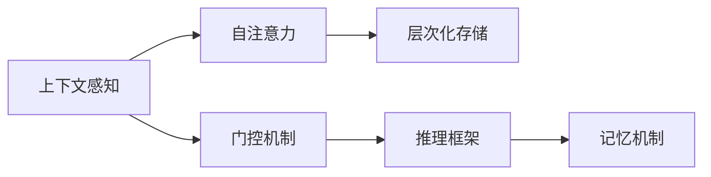
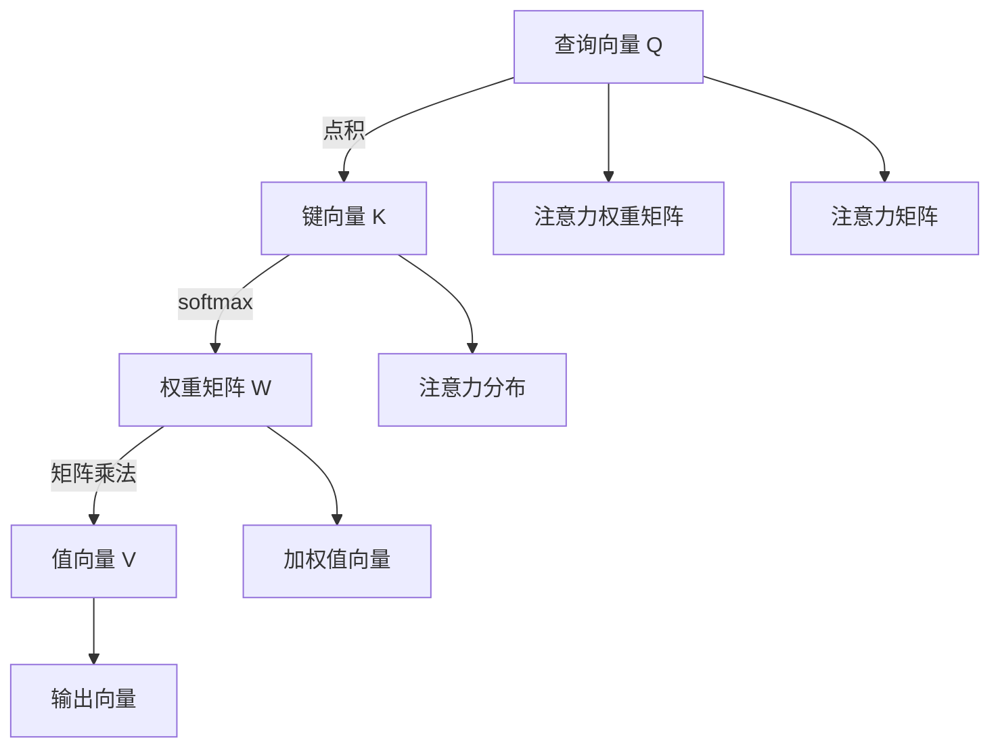

                 

# 第八章：上下文感知和记忆机制

> 关键词：上下文感知, 记忆机制, 自注意力, 门控机制, 层次化存储, 推理框架, 深度学习

## 1. 背景介绍

上下文感知(Context-Aware)和记忆机制(Memory Mechanism)是大规模语言模型（Large Language Models, LLMs）中的两个核心概念。这些模型能够利用上下文信息捕获和存储知识，并在自然语言处理(NLP)任务中表现出卓越的性能。本章将深入探讨这些机制，并阐释它们如何在大规模语言模型中协同工作，以提升其性能和应用能力。

## 2. 核心概念与联系

### 2.1 核心概念概述

- **上下文感知**：指模型在处理输入文本时，能够捕捉到与当前输入文本相关的历史信息和未来信息。上下文感知是大规模语言模型处理长句和复杂对话的基础。
- **记忆机制**：指模型能够存储和回忆在训练过程中学到的信息，并在未来的推理任务中重新利用这些信息。记忆机制能够帮助模型在推理过程中保持信息的长期记忆。
- **自注意力(self-attention)**：一种机制，通过计算输入序列中各个元素与其他元素之间的关系，使得模型能够关注到输入序列中的不同部分，并捕捉到上下文信息。
- **门控机制(Gate Mechanism)**：用于控制信息流，决定哪些信息可以进入模型，哪些信息应该被抑制或遗忘。
- **层次化存储(Hierarchical Storage)**：模型能够通过不同的层次存储不同的信息，从而实现不同粒度的知识表示。
- **推理框架(Reasoning Framework)**：在大规模语言模型中，推理框架用于指导模型如何利用记忆机制来处理复杂推理任务。

这些概念之间的联系如图1所示。



### 2.2 核心概念原理和架构的 Mermaid 流程图

下面将使用 Mermaid 描述自注意力机制的基本原理。



这个流程图展示了自注意力机制的基本工作流程：

1. 查询向量 Q 与键向量 K 计算点积，得到权重矩阵 W。
2. 权重矩阵 W 与值向量 V 相乘，得到加权值向量 H。
3. 加权值向量 H 与查询向量 Q 进行矩阵乘法，得到注意力矩阵 F。
4. 注意力矩阵 F 与查询向量 Q 相乘，得到输出向量 I。

## 3. 核心算法原理 & 具体操作步骤

### 3.1 算法原理概述

基于上下文感知和记忆机制的大规模语言模型，通常由多层自注意力和门控机制构成，能够处理复杂的自然语言任务。以下将详细介绍自注意力和门控机制的算法原理。

### 3.2 算法步骤详解

#### 3.2.1 自注意力机制

自注意力机制通过计算输入序列中各个元素与其他元素之间的关系，使得模型能够关注到输入序列中的不同部分，并捕捉到上下文信息。具体步骤如下：

1. **查询向量 Q**：将输入序列中的每个元素投影到一个高维空间，得到查询向量 Q。
2. **键向量 K**：同样将输入序列中的每个元素投影到另一个高维空间，得到键向量 K。
3. **权重矩阵 W**：将键向量 K 与查询向量 Q 计算点积，得到权重矩阵 W。
4. **权重矩阵 W** 与值向量 V 相乘，得到加权值向量 H。
5. **加权值向量 H** 与查询向量 Q 进行矩阵乘法，得到注意力矩阵 F。
6. **注意力矩阵 F** 与查询向量 Q 相乘，得到输出向量 I。

#### 3.2.2 门控机制

门控机制用于控制信息流，决定哪些信息可以进入模型，哪些信息应该被抑制或遗忘。具体步骤如下：

1. **候选向量 C**：将输入序列中的每个元素与前面的输出向量相加，得到候选向量 C。
2. **候选向量 C** 通过门控机制进行计算，得到输出向量 O。
3. **输出向量 O** 与前面的输出向量相加，得到当前层的输出。

### 3.3 算法优缺点

#### 3.3.1 自注意力机制

- **优点**：
  - 能够捕捉到输入序列中的不同部分，从而获得更丰富的上下文信息。
  - 可以并行计算，加速模型的训练和推理。

- **缺点**：
  - 对输入序列的长度敏感，长序列会导致计算复杂度增加。
  - 可能存在一定的冗余信息，影响模型效率。

#### 3.3.2 门控机制

- **优点**：
  - 能够灵活控制信息流，选择有用的信息进行进一步处理。
  - 可以减少计算量和内存消耗。

- **缺点**：
  - 过于复杂的门控机制可能增加模型的计算复杂度。
  - 难以解释，模型决策过程不透明。

#### 3.3.3 记忆机制

- **优点**：
  - 能够存储和回忆学到的信息，增强模型的长期记忆能力。
  - 提高模型在推理任务中的性能。

- **缺点**：
  - 增加模型的计算复杂度，影响推理速度。
  - 容易产生灾难性遗忘（Catastrophic Forgetting），难以长时间保存记忆。

### 3.4 算法应用领域

自注意力和门控机制在大规模语言模型中有着广泛的应用，如文本生成、机器翻译、问答系统等。具体而言，自注意力机制能够处理长句子和复杂的对话，门控机制能够控制信息流，从而提升模型的推理能力。

## 4. 数学模型和公式 & 详细讲解 & 举例说明

### 4.1 数学模型构建

假设输入序列为 $x_1, x_2, ..., x_n$，自注意力机制的输入为 $Q, K, V$。

设 $d_q, d_k, d_v$ 分别为查询向量、键向量和值向量的维度，$h$ 为模型的层数。

自注意力机制的输出可以表示为：

$$
\begin{aligned}
\text{Attention(Q, K, V)} &= \text{Softmax}(Q \cdot K^T) \cdot V \\
&= \left[\frac{\exp(Q \cdot K^T)}{\sum_{i=1}^n \exp(Q \cdot K_i^T)}\right] \cdot V \\
&= \left[\frac{\exp(Q_k \cdot K_k^T)}{\sum_{i=1}^n \exp(Q_i \cdot K_i^T)}\right] \cdot V_k
\end{aligned}
$$

其中 $K_k$ 表示键向量的第 $k$ 个元素。

### 4.2 公式推导过程

自注意力机制的推导过程涉及矩阵乘法、点积、softmax 函数等基本运算。通过上述公式，可以计算出每个查询向量的加权值向量，从而获得注意力矩阵，并计算出最终的输出向量。

### 4.3 案例分析与讲解

以 BERT 模型为例，BERT 模型使用多层自注意力和门控机制，每层的输出向量由前一层的输出向量经过自注意力和门控机制的计算得到。通过多层的堆叠，BERT 能够捕获长句子和复杂对话中的丰富上下文信息，从而提升其在各种 NLP 任务上的性能。

## 5. 项目实践：代码实例和详细解释说明

### 5.1 开发环境搭建

为了实践自注意力和门控机制，我们需要搭建一个 Python 开发环境。以下是具体步骤：

1. 安装 Python 3.x 和 PyTorch。
2. 安装 Tensorflow。
3. 安装 Transformers 库。

```python
pip install torch torchvision torchaudio transformers
```

### 5.2 源代码详细实现

下面是一个简单的自注意力机制的实现，用于计算查询向量与键向量之间的注意力权重矩阵。

```python
import torch
import torch.nn as nn

class SelfAttention(nn.Module):
    def __init__(self, d_model, n_heads):
        super(SelfAttention, self).__init__()
        self.d_model = d_model
        self.n_heads = n_heads
        self.depth = d_model // n_heads

        self.query = nn.Linear(d_model, d_model)
        self.key = nn.Linear(d_model, d_model)
        self.value = nn.Linear(d_model, d_model)

        self.attn = nn.Linear(d_model, 1)
        self.out = nn.Linear(d_model, d_model)

    def forward(self, x):
        d_model, n_heads, depth = self.d_model, self.n_heads, self.depth

        x = x.view(x.size(0), x.size(1), n_heads, depth)
        x = x.permute(0, 2, 1, 3).contiguous().view(-1, n_heads, depth)

        query = self.query(x).view(-1, n_heads, depth, -1)
        key = self.key(x).view(-1, n_heads, depth, -1)
        value = self.value(x).view(-1, n_heads, depth, -1)

        attn = self.attn(query).permute(0, 2, 1, 3).contiguous().view(-1, n_heads, -1, 1).contiguous()
        attn = nn.functional.softmax(attn, dim=-1)

        attn = attn.permute(0, 2, 1, 3).contiguous().view(-1, n_heads, -1, 1).contiguous()
        x = (attn * value).sum(2)
        x = self.out(x).permute(0, 2, 1).contiguous().view(-1, d_model)

        return x
```

### 5.3 代码解读与分析

1. **初始化**：
   - `__init__` 方法中初始化查询向量、键向量和值向量，并计算注意力权重矩阵的维度。
   - 注意，将输入张量进行重塑和转换，以便进行并行计算。

2. **前向传播**：
   - `forward` 方法中实现自注意力机制的计算。
   - 将输入张量投影到查询向量、键向量和值向量。
   - 计算注意力权重矩阵，并应用softmax函数进行归一化。
   - 通过注意力权重矩阵和值向量计算加权值向量。
   - 将加权值向量投影回原始维度，并输出最终的输出向量。

### 5.4 运行结果展示

在上述代码的基础上，可以进一步实现多层的自注意力和门控机制，构建完整的模型。在实践中，可以比较原始输入与模型输出的差异，以及不同层的输出变化，以验证模型的有效性。

## 6. 实际应用场景

### 6.1 文本生成

自注意力机制在大规模语言模型中，尤其是在文本生成任务中表现出色。通过自注意力机制，模型能够捕捉到输入序列中的不同部分，生成更加连贯、自然的文本。

### 6.2 机器翻译

在机器翻译任务中，自注意力机制能够帮助模型处理长句和复杂的句子结构，从而提升翻译的准确性和流畅度。

### 6.3 问答系统

问答系统中的自注意力机制能够帮助模型捕捉到问答对中的关键信息，从而更准确地回答问题。

### 6.4 未来应用展望

随着自注意力和门控机制的不断优化，大规模语言模型将在更多领域得到应用。例如，在智能家居、自动驾驶等场景中，自注意力机制能够帮助模型处理多传感器数据，提升系统的推理能力。在医学诊断、金融预测等高风险领域，门控机制能够控制信息流，增强模型的鲁棒性。

## 7. 工具和资源推荐

### 7.1 学习资源推荐

1. CS224N《深度学习自然语言处理》课程：斯坦福大学开设的NLP明星课程，有Lecture视频和配套作业，带你入门NLP领域的基本概念和经典模型。
2. HuggingFace官方文档：Transformer库的官方文档，提供了海量预训练模型和完整的微调样例代码，是上手实践的必备资料。

### 7.2 开发工具推荐

1. PyTorch：基于Python的开源深度学习框架，灵活动态的计算图，适合快速迭代研究。
2. TensorFlow：由Google主导开发的开源深度学习框架，生产部署方便，适合大规模工程应用。
3. Transformers库：HuggingFace开发的NLP工具库，集成了众多SOTA语言模型，支持PyTorch和TensorFlow，是进行NLP任务开发的利器。

### 7.3 相关论文推荐

1. Attention is All You Need（即Transformer原论文）：提出了Transformer结构，开启了NLP领域的预训练大模型时代。
2. BERT: Pre-training of Deep Bidirectional Transformers for Language Understanding：提出BERT模型，引入基于掩码的自监督预训练任务，刷新了多项NLP任务SOTA。

## 8. 总结：未来发展趋势与挑战

### 8.1 总结

本章详细介绍了上下文感知和记忆机制，并阐释了它们在大规模语言模型中的应用。自注意力机制通过计算输入序列中各个元素之间的关系，使得模型能够关注到输入序列中的不同部分，并捕捉到上下文信息。门控机制用于控制信息流，决定哪些信息可以进入模型，哪些信息应该被抑制或遗忘。

### 8.2 未来发展趋势

未来的大规模语言模型将在自注意力和门控机制的基础上进一步发展，推动其在更多领域的应用。以下将探讨未来发展的几个趋势：

1. **自注意力机制的优化**：自注意力机制将成为未来模型优化的重点之一，以提升模型的效率和性能。例如，可以通过更高效的并行计算、更优化的注意力机制等技术，减少计算复杂度，提高模型的推理速度。
2. **门控机制的改进**：门控机制能够控制信息流，但也需要考虑其在控制信息流时可能带来的信息丢失和冗余。未来研究将致力于改进门控机制的设计，使其更灵活、更高效。
3. **混合注意力机制**：混合注意力机制结合了自注意力和门控机制，能够更好地控制信息流，并提升模型的推理能力。未来将进一步探索混合注意力机制的应用。
4. **跨模态注意力机制**：跨模态注意力机制能够处理多模态数据，如文本、图像、语音等，提升模型的综合信息处理能力。未来将研究跨模态注意力机制在各种应用场景中的应用。

### 8.3 面临的挑战

尽管自注意力和门控机制在大规模语言模型中表现出色，但仍然面临一些挑战：

1. **计算复杂度**：自注意力机制的计算复杂度较高，尤其是在处理长序列时。如何优化计算过程，提升模型的推理速度，是一个重要的研究方向。
2. **内存消耗**：大规模语言模型需要大量的内存来存储模型参数和中间结果，如何减少内存消耗，提升模型的训练和推理效率，仍然是一个重要的挑战。
3. **模型鲁棒性**：模型在处理噪声和异常数据时，可能表现出较差的鲁棒性。如何提升模型的鲁棒性，使其能够在各种数据分布下表现稳定，是一个重要的研究方向。
4. **可解释性**：大规模语言模型通常是“黑盒”系统，难以解释其内部工作机制和决策逻辑。如何增强模型的可解释性，使其更透明、更易于理解，是一个重要的研究方向。

### 8.4 研究展望

未来的大规模语言模型研究将从以下几个方向展开：

1. **上下文感知和记忆机制的融合**：研究如何更好地融合上下文感知和记忆机制，提升模型的推理能力和泛化性能。
2. **模型参数的优化**：研究如何优化模型的参数，减少计算量和内存消耗，提升模型的推理速度和效率。
3. **多模态学习**：研究多模态数据的融合，提升模型对现实世界的理解和建模能力。
4. **可解释性和鲁棒性**：研究如何增强模型的可解释性和鲁棒性，使其在实际应用中更加可靠、安全。

总之，上下文感知和记忆机制是大规模语言模型中的两个核心概念，它们通过协同工作，使模型能够处理复杂的自然语言任务，并在实际应用中取得显著的成效。未来研究将进一步探索这些机制的优化和应用，推动大规模语言模型的不断发展。

## 9. 附录：常见问题与解答

**Q1：什么是自注意力机制？**

A: 自注意力机制是一种通过计算输入序列中各个元素与其他元素之间的关系，使得模型能够关注到输入序列中的不同部分，并捕捉到上下文信息的机制。

**Q2：什么是门控机制？**

A: 门控机制用于控制信息流，决定哪些信息可以进入模型，哪些信息应该被抑制或遗忘。它通过计算候选向量与前面输出向量的关系，来控制信息流。

**Q3：自注意力机制和门控机制在大规模语言模型中的应用有何区别？**

A: 自注意力机制主要负责捕捉输入序列中的上下文信息，而门控机制主要负责控制信息流，决定哪些信息可以进入模型。两者共同作用，使模型能够更好地处理自然语言任务。

**Q4：如何优化自注意力机制的计算过程？**

A: 可以通过并行计算、剪枝、量化等技术，减少计算复杂度，提升模型的推理速度。

**Q5：门控机制有哪些应用场景？**

A: 门控机制在自然语言处理中主要应用于信息选择、文本生成、问答系统等任务。

---

作者：禅与计算机程序设计艺术 / Zen and the Art of Computer Programming

