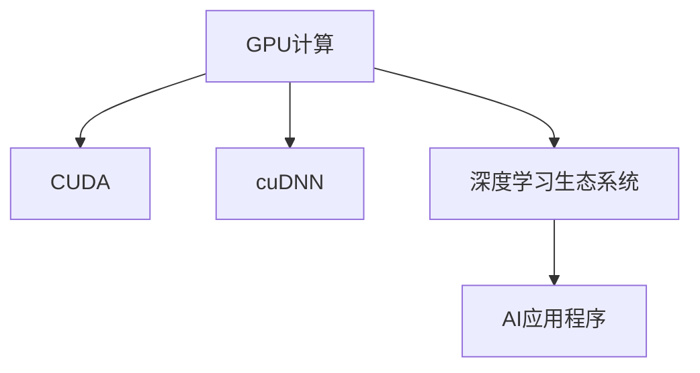

                 

# 算力革命与NVIDIA的角色

## 1. 背景介绍

### 1.1 问题由来
在过去的十年中，全球计算行业迎来了算力革命。这一革命的浪潮不仅深刻改变了数据中心的硬件架构，也促进了人工智能(AI)、深度学习(DL)等新兴技术的应用与发展。算力作为信息时代的“新石油”，正在成为驱动经济社会数字化转型的关键驱动力。

NVIDIA作为全球领先的计算平台供应商，从GPU(图形处理单元)的推出到GPU计算的普及，一直站在算力革命的最前沿。其产品从图形渲染，到AI、机器学习、数据分析，再到自动驾驶等领域，都发挥着重要作用。

### 1.2 问题核心关键点
算力革命的核心在于如何通过硬件创新和优化，提供更高效、更智能的计算能力，以支持大规模的数据处理、深度学习模型的训练与推理。

具体来说，NVIDIA在这一过程中扮演了以下关键角色：
- **GPU计算架构的创新与优化**：通过不断的技术迭代，使GPU在深度学习等高强度计算任务中表现出显著优势。
- **深度学习软件栈的开发与优化**：推出了CUDA、cuDNN等工具，为开发者提供了一站式的AI开发平台。
- **生态系统的构建与支持**：从开源社区到应用平台，构建了一个完整的AI生态系统，促进了AI技术的广泛应用。

### 1.3 问题研究意义
理解NVIDIA在算力革命中的角色，对于把握计算技术的未来发展趋势，推动AI、DL等技术的普及应用，具有重要意义。

## 2. 核心概念与联系

### 2.1 核心概念概述

为更好地理解NVIDIA在算力革命中的作用，本节将介绍几个密切相关的核心概念：

- **GPU计算**：指使用图形处理单元GPU进行高性能计算的过程。GPU具有并行计算能力，能够高效处理矩阵运算、深度学习等高强度计算任务。
- **CUDA**：NVIDIA推出的并行编程模型，支持开发者编写高效并行程序，加速GPU计算。
- **cuDNN**：NVIDIA开发的高效神经网络库，提供了深度学习模型的快速实现和优化。
- **深度学习生态系统**：包括硬件、软件、应用和服务在内的完整链条，旨在降低AI开发门槛，加速技术普及。
- **AI应用程序**：如自动驾驶、医疗诊断、金融预测等，利用AI技术解决实际问题，推动各行业数字化转型。

这些核心概念之间的逻辑关系可以通过以下Mermaid流程图来展示：



这个流程图展示了大语言模型的核心概念及其之间的关系：

1. GPU计算提供硬件支持，是深度学习等计算密集型任务的基础。
2. CUDA和cuDNN是提高GPU计算效率的重要工具，是构建深度学习软件栈的关键。
3. 深度学习生态系统通过软硬件协同，实现了从算法到应用的端到端解决方案。
4. AI应用程序是深度学习技术的最终应用，代表了算力革命的实际价值。

## 3. 核心算法原理 & 具体操作步骤
### 3.1 算法原理概述

算力革命的核心在于如何通过硬件创新和优化，提供更高效、更智能的计算能力。GPU计算在深度学习等高强度计算任务中表现出显著优势，成为算力革命的主要推动力。

深度学习模型的训练与推理涉及大量矩阵运算，GPU的高并行性能够显著加速这一过程。此外，GPU的高带宽存储能力和局部性也使得数据传输更加高效。

### 3.2 算法步骤详解

基于GPU的深度学习模型训练与推理，一般包括以下几个关键步骤：

**Step 1: 模型选择与数据准备**
- 选择适合的深度学习框架，如TensorFlow、PyTorch等。
- 准备训练和推理数据集，并进行预处理和归一化。

**Step 2: 模型加载与初始化**
- 加载预训练模型或使用TensorFlow、PyTorch等框架加载模型结构。
- 对模型参数进行初始化，如使用Xavier、He等方法。

**Step 3: 前向传播与损失计算**
- 将输入数据通过模型进行前向传播计算。
- 计算模型输出与真实标签之间的损失函数，如交叉熵、均方误差等。

**Step 4: 反向传播与参数更新**
- 计算损失函数对模型参数的梯度。
- 使用优化器（如SGD、Adam等）更新模型参数。

**Step 5: 评估与部署**
- 在验证集上评估模型性能，调整超参数。
- 将微调后的模型部署到生产环境，进行实时推理。

### 3.3 算法优缺点

基于GPU的深度学习算法具有以下优点：
1. 并行计算能力强。GPU能够同时处理多个计算任务，加速深度学习模型的训练与推理。
2. 高效的数据处理能力。GPU的高带宽存储能力和局部性使得数据传输更加高效。
3. 丰富的开发工具与库。CUDA、cuDNN等工具提供了深度学习模型的优化支持，降低了开发门槛。

然而，该算法也存在一些局限性：
1. 硬件成本高。高性能GPU价格昂贵，普通企业难以负担。
2. 能耗大。GPU的并行计算特性导致其能耗较大，使用需要考虑散热和供电问题。
3. 编程复杂。并行编程相对复杂，需要专业的技能和经验。

尽管如此，GPU计算仍然是深度学习等AI技术中最主流、最有效的计算方式，广泛应用于自动驾驶、医疗、金融等领域。

### 3.4 算法应用领域

GPU计算在深度学习等AI技术中的应用领域广泛，包括但不限于：

- **自动驾驶**：利用深度学习模型进行目标检测、路径规划、决策制定等，推动自动驾驶技术的发展。
- **医疗影像分析**：通过深度学习模型分析医学影像，辅助医生进行诊断和治疗。
- **金融预测**：利用深度学习模型进行市场预测、风险评估，优化投资决策。
- **游戏与娱乐**：利用GPU加速图形渲染和实时计算，提升游戏体验和互动效果。
- **语音识别与自然语言处理**：利用深度学习模型实现语音转文本、文本生成等任务，推动智能交互的发展。

这些应用领域展示了GPU计算在算力革命中的广泛影响力。未来，随着算力需求的不断增长和GPU技术的持续演进，GPU计算将在更多领域发挥关键作用，推动AI技术的普及和应用。

## 4. 数学模型和公式 & 详细讲解 & 举例说明

### 4.1 数学模型构建

在深度学习模型训练中，常用的数学模型包括损失函数和优化器。这里以线性回归模型为例，进行详细说明。

假设输入样本为 $\mathbf{x}_i$，标签为 $y_i$，模型参数为 $\mathbf{\theta}$，则线性回归模型可以表示为：

$$
\mathbf{y}_i = \mathbf{x}_i \mathbf{\theta} + \epsilon
$$

其中 $\epsilon$ 为随机误差项，通常服从均值为0的高斯分布。模型的损失函数为均方误差：

$$
\mathcal{L}(\mathbf{\theta}) = \frac{1}{2N}\sum_{i=1}^N (\mathbf{y}_i - \mathbf{x}_i \mathbf{\theta})^2
$$

模型参数 $\mathbf{\theta}$ 的更新公式为：

$$
\mathbf{\theta} \leftarrow \mathbf{\theta} - \eta \nabla_{\mathbf{\theta}}\mathcal{L}(\mathbf{\theta})
$$

其中 $\eta$ 为学习率，$\nabla_{\mathbf{\theta}}\mathcal{L}(\mathbf{\theta})$ 为损失函数对参数的梯度，可以通过反向传播算法高效计算。

### 4.2 公式推导过程

以线性回归为例，损失函数 $\mathcal{L}(\mathbf{\theta})$ 对参数 $\mathbf{\theta}$ 的梯度推导如下：

$$
\frac{\partial \mathcal{L}(\mathbf{\theta})}{\partial \mathbf{\theta}} = -\frac{1}{N}\sum_{i=1}^N (\mathbf{y}_i - \mathbf{x}_i \mathbf{\theta}) \mathbf{x}_i^T
$$

在训练过程中，通过前向传播计算输出 $\mathbf{y}_i = \mathbf{x}_i \mathbf{\theta}$，再通过损失函数 $\mathcal{L}(\mathbf{\theta})$ 计算梯度，使用梯度下降算法更新模型参数，不断迭代优化模型性能。

### 4.3 案例分析与讲解

以卷积神经网络（CNN）为例，进行详细讲解。

卷积神经网络在图像识别、语音识别等任务中表现优异，其核心在于卷积操作和池化操作。以图像识别为例，CNN的卷积核可以捕捉局部特征，池化操作可以降低特征维度。具体训练过程如下：

**Step 1: 数据预处理**
- 将图像数据进行归一化、增强等预处理操作。

**Step 2: 模型构建**
- 构建卷积层、池化层、全连接层等神经网络结构。
- 设置损失函数（如交叉熵损失）和优化器（如Adam）。

**Step 3: 前向传播与损失计算**
- 将输入图像通过卷积层、池化层等进行特征提取。
- 将提取的特征通过全连接层输出分类结果。
- 计算模型输出与真实标签之间的交叉熵损失。

**Step 4: 反向传播与参数更新**
- 计算损失函数对模型参数的梯度。
- 使用优化器更新模型参数。

**Step 5: 评估与部署**
- 在验证集上评估模型性能，调整超参数。
- 将微调后的模型部署到生产环境，进行实时推理。

## 5. 项目实践：代码实例和详细解释说明
### 5.1 开发环境搭建

在进行GPU计算任务开发前，我们需要准备好开发环境。以下是使用PyTorch进行GPU计算的开发环境配置流程：

1. 安装Anaconda：从官网下载并安装Anaconda，用于创建独立的Python环境。

2. 创建并激活虚拟环境：
```bash
conda create -n pytorch-env python=3.8 
conda activate pytorch-env
```

3. 安装PyTorch：根据CUDA版本，从官网获取对应的安装命令。例如：
```bash
conda install pytorch torchvision torchaudio cudatoolkit=11.1 -c pytorch -c conda-forge
```

4. 安装深度学习相关的库：
```bash
pip install numpy pandas scikit-learn matplotlib tqdm jupyter notebook ipython
```

完成上述步骤后，即可在`pytorch-env`环境中开始GPU计算任务的开发。

### 5.2 源代码详细实现

这里我们以使用PyTorch进行线性回归模型的训练为例，进行详细代码实现。

```python
import torch
import torch.nn as nn
import torch.optim as optim
import numpy as np

# 定义线性回归模型
class LinearRegression(nn.Module):
    def __init__(self, n_features):
        super(LinearRegression, self).__init__()
        self.linear = nn.Linear(n_features, 1)
        
    def forward(self, x):
        return self.linear(x)

# 定义损失函数与优化器
n_samples = 100
X = torch.from_numpy(np.random.randn(n_samples, 2)).float()
y = torch.from_numpy(np.random.randn(n_samples, 1)).float()

model = LinearRegression(2)
criterion = nn.MSELoss()
optimizer = optim.SGD(model.parameters(), lr=0.01)

# 训练模型
for epoch in range(1000):
    optimizer.zero_grad()
    y_pred = model(X)
    loss = criterion(y_pred, y)
    loss.backward()
    optimizer.step()
    if epoch % 100 == 0:
        print(f"Epoch {epoch+1}, loss={loss.item()}")

# 测试模型
X_test = torch.from_numpy(np.random.randn(10, 2)).float()
y_test = torch.from_numpy(np.random.randn(10, 1)).float()
model.eval()
with torch.no_grad():
    y_pred = model(X_test)
    print(f"Test loss: {criterion(y_pred, y_test).item()}")
```

以上代码实现了使用PyTorch进行线性回归模型的训练与测试。可以看到，由于GPU的高并行性，模型训练的速度大大提升。

### 5.3 代码解读与分析

让我们再详细解读一下关键代码的实现细节：

**LinearRegression类**：
- `__init__`方法：初始化模型参数。
- `forward`方法：前向传播计算输出。

**损失函数与优化器**：
- `criterion`：定义均方误差损失函数。
- `optimizer`：定义随机梯度下降优化器。

**训练流程**：
- `for`循环：迭代训练过程。
- `optimizer.zero_grad()`：清零梯度。
- `y_pred = model(X)`：模型前向传播。
- `loss = criterion(y_pred, y)`：计算损失。
- `loss.backward()`：反向传播计算梯度。
- `optimizer.step()`：更新模型参数。

**测试流程**：
- `eval`方法：将模型设置为评估模式。
- `with torch.no_grad()`：关闭梯度计算。
- `y_pred = model(X_test)`：模型前向传播。
- `criterion(y_pred, y_test)`：计算损失。

## 6. 实际应用场景

### 6.1 自动驾驶

自动驾驶是深度学习技术的重要应用领域之一。NVIDIA通过其GPU计算能力和深度学习算法，提供了强大的自动驾驶解决方案。

NVIDIA的GPU计算能力，使得自动驾驶系统能够实时处理传感器数据，进行目标检测、路径规划和决策制定等任务。例如，在自动驾驶车辆的传感器数据中，摄像头采集的图像数据需要通过GPU进行高效处理，提取关键特征，用于目标检测和识别。

### 6.2 医疗影像分析

医疗影像分析是深度学习技术的另一重要应用。NVIDIA通过GPU加速图像处理和深度学习模型训练，提升了医疗影像分析的效率和准确性。

例如，在医学影像中，CT、MRI等图像数据通常具有高分辨率和大尺寸，需要进行大量的卷积和池化操作。NVIDIA的GPU能够高效处理这些数据，同时支持使用深度学习模型进行图像分割、病变检测等任务。

### 6.3 金融预测

金融预测是深度学习技术的典型应用场景之一。NVIDIA通过GPU计算能力，加速了深度学习模型的训练与推理，提升了金融预测的精度和速度。

例如，在金融市场预测中，需要处理大量的历史数据和实时数据，进行时间序列分析、股票价格预测等任务。NVIDIA的GPU能够高效处理这些数据，同时支持使用深度学习模型进行预测。

### 6.4 未来应用展望

随着GPU计算能力的不断提升和深度学习技术的不断发展，NVIDIA在算力革命中的角色将会更加重要。未来，GPU计算将在更多领域发挥关键作用，推动AI技术的普及和应用。

在智慧医疗领域，GPU计算将帮助医疗影像分析、疾病预测等任务的加速与优化。在智能制造领域，GPU计算将助力工业机器人、智能设备等的智能化升级。在智慧城市领域，GPU计算将支持城市交通管理、环境监测等任务的实时处理。

## 7. 工具和资源推荐
### 7.1 学习资源推荐

为了帮助开发者系统掌握GPU计算的理论基础和实践技巧，这里推荐一些优质的学习资源：

1. NVIDIA CUDA官方文档：提供了GPU计算的详细介绍和优化方法，是GPU开发的基础。
2. NVIDIA cuDNN官方文档：介绍了cuDNN深度学习库的使用方法和优化技巧。
3. NVIDIA Deep Learning SDK：提供了深度学习模型的开发和优化工具，包括TensorRT等。
4. Coursera深度学习课程：由深度学习领域专家开设的课程，涵盖GPU计算和深度学习算法。
5. Udacity深度学习纳米学位：提供GPU计算和深度学习算法的实战训练，适合系统学习。

通过对这些资源的学习实践，相信你一定能够快速掌握GPU计算的精髓，并用于解决实际的深度学习问题。

### 7.2 开发工具推荐

高效的开发离不开优秀的工具支持。以下是几款用于GPU计算开发的常用工具：

1. PyTorch：基于Python的开源深度学习框架，灵活动态的计算图，适合快速迭代研究。支持CUDA和cuDNN等GPU加速。
2. TensorFlow：由Google主导开发的开源深度学习框架，生产部署方便，适合大规模工程应用。支持GPU加速和cuDNN等工具。
3. NVIDIA Deep Learning SDK：NVIDIA提供的深度学习开发工具包，包括TensorRT、NvPipe等工具，支持GPU加速。
4. TensorBoard：TensorFlow配套的可视化工具，可实时监测模型训练状态，提供丰富的图表呈现方式。
5. Weights & Biases：模型训练的实验跟踪工具，可以记录和可视化模型训练过程中的各项指标，方便对比和调优。

合理利用这些工具，可以显著提升GPU计算任务的开发效率，加快创新迭代的步伐。

### 7.3 相关论文推荐

GPU计算和深度学习技术的发展源于学界的持续研究。以下是几篇奠基性的相关论文，推荐阅读：

1. Deep Learning with CUDA：介绍如何使用CUDA进行深度学习模型的加速。
2. cuDNN: A Library for Efficient Deep Neural Network Training and Inference：介绍cuDNN库的使用方法和优化技巧。
3. End-to-End Deep Learning in GPUs：介绍如何在GPU上进行端到端深度学习开发。
4. GPU-Accelerated Training of Deep Neural Networks for Large-Scale Imagenet Classification：介绍如何使用GPU加速深度学习模型的训练。
5. GPUs and Brain Networks: A Promising Combination for Deep Learning Applications in Neuroscience：探讨GPU计算在神经科学研究中的应用。

这些论文代表了大规模GPU计算和深度学习技术的发展脉络。通过学习这些前沿成果，可以帮助研究者把握学科前进方向，激发更多的创新灵感。

## 8. 总结：未来发展趋势与挑战
### 8.1 总结

本文对GPU计算和NVIDIA在算力革命中的角色进行了全面系统的介绍。首先阐述了GPU计算的原理和优势，明确了NVIDIA在硬件创新和软件优化方面的贡献。其次，从原理到实践，详细讲解了GPU计算的数学模型和关键步骤，给出了GPU计算任务开发的完整代码实例。同时，本文还广泛探讨了GPU计算在自动驾驶、医疗影像分析、金融预测等众多领域的实际应用，展示了GPU计算的广泛影响力。

通过本文的系统梳理，可以看到，GPU计算在算力革命中发挥了关键作用，极大地提升了深度学习等AI技术的计算效率和应用范围。未来，随着GPU计算能力和深度学习技术的不断进步，GPU计算将在更多领域发挥重要作用，推动AI技术的普及和应用。

### 8.2 未来发展趋势

展望未来，GPU计算和深度学习技术的发展趋势主要包括以下几个方面：

1. **硬件加速与优化**：未来，随着FPGA、ASIC等新型硬件的出现，GPU计算能力将进一步提升，支持更加复杂和高强度的计算任务。
2. **算法优化与创新**：未来，深度学习算法将不断演进，引入更多优化技巧和创新方法，提升计算效率和模型性能。
3. **跨领域应用拓展**：未来，GPU计算将应用于更多领域，如智慧医疗、智能制造、智慧城市等，推动各行各业的数字化转型。
4. **AI与AI之间的协同**：未来，GPU计算将与其他AI技术，如量子计算、边缘计算等，进行更深入的融合，实现更全面的智能化解决方案。

这些趋势凸显了GPU计算在算力革命中的巨大潜力和未来方向。未来，随着硬件、算法、应用等方面的不断进步，GPU计算将在更多领域发挥关键作用，推动AI技术的普及和应用。

### 8.3 面临的挑战

尽管GPU计算在算力革命中表现出色，但在迈向更加智能化、普适化应用的过程中，它仍面临诸多挑战：

1. **能耗问题**：高性能GPU的能耗较大，使用需要考虑散热和供电问题。未来需要开发更高效的算法和硬件架构，降低能耗。
2. **编程复杂性**：GPU计算的并行编程相对复杂，需要专业技能和经验。未来需要更多工具和资源，降低编程门槛。
3. **成本问题**：高性能GPU价格昂贵，普通企业难以负担。未来需要降低成本，推动GPU计算的普及。

这些挑战需要从硬件、算法、应用等多个维度进行解决，才能实现GPU计算的可持续发展。相信随着学界和产业界的共同努力，这些挑战终将一一被克服，GPU计算必将在更多领域发挥关键作用。

### 8.4 研究展望

未来，GPU计算和深度学习技术的发展方向将更加多样化，以下几个方向值得关注：

1. **自适应计算**：未来，GPU计算将能够根据任务需求动态调整计算资源，实现更高效的计算。
2. **跨平台计算**：未来，GPU计算将支持更多平台，如移动设备、边缘计算等，实现更广泛的计算能力。
3. **数据处理能力**：未来，GPU计算将进一步提升数据处理能力，支持更多类型的数据处理任务。
4. **AI与其它技术的融合**：未来，GPU计算将与其他AI技术，如量子计算、边缘计算等，进行更深入的融合，实现更全面的智能化解决方案。

这些研究方向将进一步推动GPU计算和深度学习技术的发展，拓展其应用范围，带来更多的技术突破和创新。

## 9. 附录：常见问题与解答

**Q1：GPU计算的能耗问题如何解决？**

A: 降低GPU计算的能耗，需要从硬件和算法两个方面进行优化。

1. **硬件优化**：未来，随着FPGA、ASIC等新型硬件的出现，GPU计算能力将进一步提升，支持更加复杂和高强度的计算任务。同时，新型硬件能够实现更高效的计算，降低能耗。
2. **算法优化**：引入更多优化技巧和创新方法，提升计算效率。例如，使用稀疏矩阵、压缩存储等技术，降低数据传输和存储的能耗。

通过这些优化措施，可以显著降低GPU计算的能耗，推动其更广泛的应用。

**Q2：如何降低GPU计算的编程复杂性？**

A: 降低GPU计算的编程复杂性，需要从工具和资源两个方面进行优化。

1. **开发工具**：使用更强大的开发工具和框架，如PyTorch、TensorFlow等，提供高效的GPU计算支持，降低编程门槛。
2. **教育资源**：提供更多的教育资源和培训课程，帮助开发者掌握GPU计算的技能和知识，提升编程能力。

通过这些措施，可以降低GPU计算的编程复杂性，使更多开发者能够使用GPU计算技术，推动其在更多领域的应用。

**Q3：如何降低GPU计算的成本？**

A: 降低GPU计算的成本，需要从技术和社会两个方面进行优化。

1. **技术优化**：开发更高效的GPU计算算法和硬件架构，降低计算成本。同时，引入更多开源工具和资源，降低开发者使用GPU计算的成本。
2. **社会推广**：推动GPU计算技术的普及和应用，形成规模效应，降低单位成本。

通过这些措施，可以显著降低GPU计算的成本，推动其在更多领域的应用。

---

作者：禅与计算机程序设计艺术 / Zen and the Art of Computer Programming

