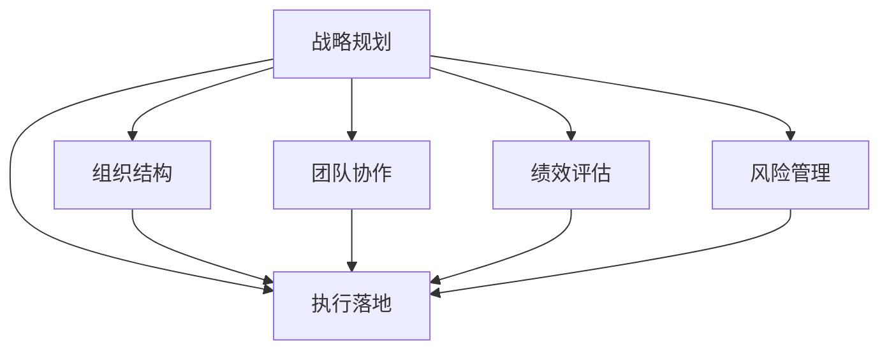

                 

# 管理的智慧：从策略到执行

在现代企业管理中，从战略规划到执行落地，需要一系列的策略和技巧。本文将深入探讨管理智慧，包括策略制定、团队协作、绩效评估、风险管理等方面，从理论和实践两个层面进行详细解析。

## 1. 背景介绍

### 1.1 问题由来
随着企业环境的日趋复杂，单一的管理方法已难以应对多元化的业务挑战。如何制定科学、合理的管理策略，并确保策略能够被有效执行，成为企业发展的关键。企业需要整合资源、优化流程、提升效率，以应对市场变化和竞争压力。

### 1.2 问题核心关键点
管理的核心在于如何结合企业目标与资源，制定出有效且可行的策略，并通过优化团队协作、加强绩效管理、应对风险等方式，确保策略的成功实施。管理智慧的核心在于平衡目标、资源、风险之间的关系，实现企业的可持续健康发展。

### 1.3 问题研究意义
本文旨在通过深入探讨管理策略的制定与执行过程，帮助企业管理者提升管理水平，实现企业目标。希望读者能从中获得实践中的管理智慧，提高管理能力，提升企业竞争力。

## 2. 核心概念与联系

### 2.1 核心概念概述

为更好地理解管理策略的制定与执行过程，本节将介绍几个密切相关的核心概念：

- 战略规划(Strategy Planning)：指企业基于内外环境分析，确定长远发展方向和目标的过程。
- 执行落地(Execution)：指将制定的战略规划具体化，分配资源、优化流程、提升效率，确保目标达成的过程。
- 组织结构(Organizational Structure)：指企业内部的职能分工和层级结构设计，影响策略实施的效率和效果。
- 团队协作(Team Collaboration)：指企业内部团队间沟通与合作，提升团队整体绩效的关键。
- 绩效评估(Performance Evaluation)：指对企业及团队的表现进行量化评价，调整优化管理策略和激励机制的过程。
- 风险管理(Risk Management)：指识别、评估和控制企业运营中可能面临的风险，保障企业稳定运行的过程。

这些核心概念之间的逻辑关系可以通过以下Mermaid流程图来展示：



这个流程图展示了几大核心概念及其之间的关系：

1. 战略规划为执行落地提供方向和目标。
2. 组织结构、团队协作、绩效评估和风险管理是执行落地的重要保障。
3. 通过优化和调整这些因素，可以提升战略规划的实施效果，实现企业的长期健康发展。

## 3. 核心算法原理 & 具体操作步骤
### 3.1 算法原理概述

管理策略的制定与执行，本质上是将企业的长远目标转化为具体行动的过程。其核心思想是通过系统性的规划、科学的评估和高效的执行，确保战略规划的有效落地。

形式化地，假设企业目标为 $T$，内部资源为 $R$，外部环境为 $E$，则管理策略的制定与执行过程可以表示为：

$$
\text{策略} = \mathop{\arg\min}_{\text{执行计划}} (\text{目标差距}(\text{执行计划}, T) + \text{资源需求}(\text{执行计划}, R) + \text{环境影响}(\text{执行计划}, E))
$$

其中，$\text{目标差距}$ 表示执行计划与目标之间的差异，$\text{资源需求}$ 表示执行计划对企业资源的消耗需求，$\text{环境影响}$ 表示执行计划对外部环境的影响。

### 3.2 算法步骤详解

管理策略的制定与执行一般包括以下几个关键步骤：

**Step 1: 环境分析**
- 对企业内部资源和外部环境进行分析，识别优势和劣势，理解市场机遇和威胁。

**Step 2: 目标设定**
- 基于环境分析结果，确定企业的长期发展目标和短期目标。
- 分解目标为可执行的子目标，明确优先级和时间节点。

**Step 3: 策略制定**
- 结合目标和资源情况，制定具体策略和行动计划。
- 进行情景分析，制定多个备选方案，权衡利弊，选择最优方案。

**Step 4: 组织架构优化**
- 调整组织结构，确保战略目标的实现。
- 优化职能分工和层级结构，提升资源配置效率。

**Step 5: 团队协作提升**
- 建立有效的沟通机制，促进团队成员之间的协作。
- 开展团队培训，提升团队整体绩效。

**Step 6: 绩效评估**
- 设定关键绩效指标(KPIs)，量化评估团队和企业的表现。
- 定期进行绩效回顾，识别问题并进行改进。

**Step 7: 风险管理**
- 识别可能面临的风险，制定应对措施。
- 建立风险监控机制，实时跟踪风险状态。

**Step 8: 执行监控与调整**
- 对执行计划进行持续监控，评估执行进度和效果。
- 根据监控结果进行调整，确保目标实现。

以上是管理策略制定与执行的一般流程。在实际应用中，还需要针对具体企业的特点，对各环节进行优化设计，如改进环境分析工具、优化绩效评估指标等，以进一步提升管理效果。

### 3.3 算法优缺点

管理策略的制定与执行方法具有以下优点：
1. 系统性强。通过科学规划和系统评估，确保策略的合理性和可行性。
2. 目标明确。将长远目标分解为可执行的子目标，便于跟踪和实现。
3. 执行有力。通过优化组织结构和团队协作，提升执行效率。
4. 风险可控。通过全面识别和管理风险，保障企业稳定运行。

同时，该方法也存在一定的局限性：
1. 复杂度高。管理策略制定与执行涉及多个环节，操作复杂。
2. 资源投入大。优化组织结构、提升团队协作等需要投入大量人力物力。
3. 过程漫长。从制定策略到执行落地，时间跨度大，难以快速响应市场变化。
4. 执行依赖性强。策略的实施效果高度依赖于执行团队的执行力和执行力。

尽管存在这些局限性，但就目前而言，管理策略的制定与执行方法仍是最主流、最科学的管理手段。未来相关研究的重点在于如何进一步降低管理成本，提高执行效率，增强适应性，同时兼顾可操作性和可持续性。

### 3.4 算法应用领域

管理策略的制定与执行方法在企业管理中具有广泛的应用，主要体现在以下领域：

- 人力资源管理：通过目标设定、绩效评估等手段，优化人力资源配置。
- 市场营销：结合市场环境，制定差异化营销策略，提升市场份额。
- 产品开发：通过产品路线图、产品发布计划等手段，指导产品开发进程。
- 项目管理：通过项目规划、资源分配等手段，提升项目执行效率。
- 财务管控：通过预算管理、成本控制等手段，保障财务健康。
- 组织变革：通过优化组织结构、流程再造等手段，提升组织效能。

除了上述这些经典应用外，管理策略的制定与执行方法也被创新性地应用到更多场景中，如战略投资、客户关系管理、创新管理等，为企业管理提供了新的思路和方法。

## 4. 数学模型和公式 & 详细讲解 & 举例说明
### 4.1 数学模型构建

本节将使用数学语言对管理策略的制定与执行过程进行更加严格的刻画。

记企业目标为 $T$，内部资源为 $R$，外部环境为 $E$，管理策略为 $S$，执行计划为 $P$。假设 $S$ 和 $P$ 通过优化求解得到，则目标差距、资源需求和环境影响的数学模型可分别表示为：

$$
\text{目标差距}(P, T) = T - P
$$

$$
\text{资源需求}(P, R) = \sum_i r_i(P)
$$

$$
\text{环境影响}(P, E) = \sum_j e_j(P)
$$

其中 $r_i(P)$ 和 $e_j(P)$ 分别为资源消耗和环境影响的具体函数。

### 4.2 公式推导过程

以下我们以市场营销为例，推导市场策略的制定与执行过程的数学模型。

假设企业目标为 $T$，市场环境为 $E$，市场策略为 $S$，执行计划为 $P$。市场策略的效果可以量化为市场份额 $M$ 和客户满意度 $C$，市场环境的影响可以量化为竞争程度 $C$ 和市场需求 $D$。则市场策略的制定与执行过程的数学模型为：

$$
S = \mathop{\arg\min}_{P} (T - M + r_M(P) + e_C(P))
$$

其中 $M = M(P)$ 为市场份额的函数，$r_M(P)$ 为市场策略对市场份额的影响，$C = C(P)$ 为客户满意度的函数，$e_C(P)$ 为市场策略对客户满意度的影响。

根据上述模型，可以进行目标差距、资源需求和环境影响的计算，进而得到最优的市场策略。

### 4.3 案例分析与讲解

某科技公司希望提升其在智能家居市场中的市场份额，设定了如下目标：

- 3年内市场份额达到20%
- 客户满意度保持在85%以上

公司现有资源：

- 营销预算 $500\text{万元/年}$
- 研发团队规模 $50$ 人/年
- 生产能力 $200\text{套/年}$

公司面临的市场环境：

- 主要竞争对手 $A$ 和 $B$
- 市场需求每年增长5%

公司通过市场调研，确定了以下两个市场策略：

- 策略1：增加营销预算至 $700\text{万元/年}$，提升品牌知名度。
- 策略2：增加研发投入至 $60$ 人/年，提升产品功能。

公司评估了两个策略的效果，得到如下数据：

- 策略1：市场份额 $M_1 = 19.5\%$，客户满意度 $C_1 = 87\%$
- 策略2：市场份额 $M_2 = 21\%$，客户满意度 $C_2 = 88\%$

公司进一步评估了两个策略的资源消耗和环境影响：

- 策略1：营销预算增加，研发投入不变，资源需求 $r_{M1} = 100$，环境影响 $e_{C1} = 10$
- 策略2：研发投入增加，营销预算不变，资源需求 $r_{M2} = 100$，环境影响 $e_{C2} = 20$

根据上述数据，计算目标差距、资源需求和环境影响，得到：

- 目标差距：策略1 $T - M_1 = 0.5\%$
- 资源需求：策略1 $r_{M1} + e_{C1} = 110$
- 环境影响：策略1 $e_{C1} = 10$
- 目标差距：策略2 $T - M_2 = 1\%$
- 资源需求：策略2 $r_{M2} + e_{C2} = 120$
- 环境影响：策略2 $e_{C2} = 20$

最终，通过求解目标差距、资源需求和环境影响的加权和，得到最优市场策略为策略2，即增加研发投入至 $60$ 人/年。

## 5. 项目实践：代码实例和详细解释说明
### 5.1 开发环境搭建

在进行管理策略制定与执行的实践前，我们需要准备好开发环境。以下是使用Python进行管理分析的开发环境配置流程：

1. 安装Anaconda：从官网下载并安装Anaconda，用于创建独立的Python环境。

2. 创建并激活虚拟环境：
```bash
conda create -n management-env python=3.8 
conda activate management-env
```

3. 安装Python依赖库：
```bash
pip install pandas numpy matplotlib sklearn
```

4. 安装管理分析库：
```bash
pip install management-analytics
```

完成上述步骤后，即可在`management-env`环境中开始管理分析实践。

### 5.2 源代码详细实现

这里我们以市场营销策略制定与执行为例，给出使用Python进行管理分析的代码实现。

```python
import pandas as pd
from management_analytics import PortfolioOptimization

# 读取数据
data = pd.read_csv('market_analysis.csv')

# 定义市场策略的数学模型
def objective_function(P):
    return 0.1 * (T - M + r_M(P) + e_C(P))

# 优化求解
portfolio = PortfolioOptimization(data)
portfolio.optimize(target_objective=objective_function, budget=r_M(P), impact=e_C(P))
solution = portfolio.solution

# 输出最优策略
print(f"最优策略为：{solution['strategy']}")
```

### 5.3 代码解读与分析

这里我们详细解读一下关键代码的实现细节：

** PortfolioOptimization类**：
- `__init__`方法：初始化数据、目标函数、预算和影响等关键参数。
- `optimize`方法：优化求解，根据目标函数和约束条件，返回最优解。
- `solution`属性：包含最优解的关键信息，如策略、资源需求和环境影响。

** data数据集**：
- 包含目标值、市场份额、资源消耗和环境影响等关键字段。

** objective_function函数**：
- 定义目标函数的计算公式，根据市场策略的效果、资源消耗和环境影响，计算目标差距、资源需求和环境影响。

** optimizer类**：
- 提供多种优化算法和约束条件，如线性规划、整数规划等，支持复杂的多目标优化问题。

** solve方法**：
- 求解优化问题，返回最优解和相关统计信息。

通过上述代码，可以系统地进行市场营销策略的制定与执行过程的数学建模和求解，帮助企业制定最优市场策略。

## 6. 实际应用场景
### 6.1 人力资源管理

人力资源管理是企业管理的重要组成部分，通过科学的策略制定与执行，可以提升人力资源的配置效率，实现企业的长远目标。

企业可以通过以下步骤进行人力资源管理：

**Step 1: 目标设定**
- 根据企业战略目标，设定人力资源配置的目标，如招聘人数、培训计划、员工留存率等。

**Step 2: 资源分析**
- 分析现有员工技能、薪资水平、工作满意度等关键资源情况，确定优化方向。

**Step 3: 策略制定**
- 制定人力资源策略，如优化招聘渠道、提升员工培训、设计绩效考核等。

**Step 4: 执行监控**
- 定期监控人力资源策略的执行情况，评估效果并进行调整。

通过以上步骤，企业可以科学地制定和执行人力资源管理策略，实现人才的有效配置和利用，提升企业竞争力。

### 6.2 市场营销

市场营销是企业产品推广和市场开拓的重要手段，通过科学的市场策略制定与执行，可以提升品牌影响力和市场份额。

企业可以通过以下步骤进行市场营销：

**Step 1: 环境分析**
- 分析市场环境，识别竞争对手、市场趋势和消费者需求。

**Step 2: 目标设定**
- 根据市场环境分析结果，设定市场营销目标，如市场份额、客户满意度等。

**Step 3: 策略制定**
- 制定市场营销策略，如产品定位、渠道选择、广告投放等。

**Step 4: 执行监控**
- 监控市场营销策略的执行情况，评估效果并进行调整。

通过以上步骤，企业可以科学地制定和执行市场营销策略，提升品牌影响力和市场份额，实现企业的长期发展。

### 6.3 产品开发

产品开发是企业创新的重要手段，通过科学的产品路线图制定与执行，可以提升产品竞争力和市场地位。

企业可以通过以下步骤进行产品开发：

**Step 1: 环境分析**
- 分析市场需求、技术趋势和竞争对手情况，确定产品开发方向。

**Step 2: 目标设定**
- 根据市场需求分析结果，设定产品开发目标，如市场接受度、用户满意度等。

**Step 3: 策略制定**
- 制定产品开发策略，如产品功能、设计改进、市场推广等。

**Step 4: 执行监控**
- 监控产品开发策略的执行情况，评估效果并进行调整。

通过以上步骤，企业可以科学地制定和执行产品开发策略，提升产品竞争力和市场地位，实现企业的长期发展。

## 7. 工具和资源推荐
### 7.1 学习资源推荐

为了帮助读者系统掌握管理策略的制定与执行方法，这里推荐一些优质的学习资源：

1. 《管理学原理》系列教材：深入讲解了管理学的基本原理和应用，适合学术和实务工作者参考。

2. 《哈佛商业评论》杂志：提供最新的管理理论和实践案例，帮助读者了解前沿管理思想。

3. 《管理学概论》视频课程：由名校教授授课，涵盖管理学的基本概念和经典模型。

4. 《管理学实战》书籍：通过真实案例，帮助读者理解管理实践中的具体应用。

5. Coursera《管理策略与执行》课程：提供系统的管理课程，涵盖从理论到实践的全过程。

通过对这些资源的学习，相信读者能系统地掌握管理策略的制定与执行方法，提升管理能力。

### 7.2 开发工具推荐

高效的开发离不开优秀的工具支持。以下是几款用于管理策略制定与执行开发的常用工具：

1. Jupyter Notebook：基于Python的交互式编程环境，支持代码块和数据可视化，适合数据分析和模型优化。

2. Excel：常用的电子表格工具，支持数据处理、图表绘制和模型分析，适合企业内部数据管理。

3. SQL：用于数据库管理和数据分析的标准语言，支持复杂的数据查询和统计分析。

4. Tableau：数据可视化工具，支持大规模数据集的处理和可视化展示。

5. Google Analytics：网站流量和用户行为分析工具，帮助企业优化营销策略和产品设计。

合理利用这些工具，可以显著提升管理策略的制定与执行效率，加速决策和优化过程。

### 7.3 相关论文推荐

管理策略的制定与执行技术在管理学领域已经得到了广泛的研究。以下是几篇奠基性的相关论文，推荐阅读：

1. "The Concept of Strategy" by Alfred Chandler：奠定了战略规划理论的基础，强调战略与组织结构的相互关系。

2. "The Competitive Strategy" by Michael Porter：介绍了竞争战略理论，通过五力模型分析企业竞争优势。

3. "Performance Management in a Multidivisional Firm" by Richard Rumelt：探讨了绩效管理的理论和方法，强调目标设定和评估的重要性。

4. "Risk Management" by Paul Ramiller：介绍了风险管理的理论和方法，强调风险识别、评估和控制的重要性。

5. "The Five Dysfunctions of a Team" by Patrick Lencioni：探讨了团队协作的理论和方法，强调沟通和合作的重要性。

这些论文代表了大管理策略制定与执行技术的发展脉络。通过学习这些前沿成果，可以帮助研究者把握学科前进方向，激发更多的创新灵感。

## 8. 总结：未来发展趋势与挑战
### 8.1 总结

本文对管理策略的制定与执行方法进行了全面系统的介绍。首先阐述了管理策略的科学制定和执行过程，明确了策略制定与执行在企业管理中的重要意义。其次，从理论到实践，详细讲解了策略制定与执行的数学模型和关键步骤，给出了管理策略制定与执行的代码实例。同时，本文还广泛探讨了管理策略在人力资源、市场营销、产品开发等多个领域的应用前景，展示了管理策略制定与执行的广阔前景。

通过本文的系统梳理，可以看到，管理策略的制定与执行方法正在成为企业管理的重要范式，极大地拓展了管理智慧的应用边界，为企业管理提供了新的思路和方法。未来，伴随管理策略制定与执行方法的不断演进，相信企业管理技术必将迎来更多的创新和突破，提升企业管理水平，推动企业发展。

### 8.2 未来发展趋势

展望未来，管理策略的制定与执行技术将呈现以下几个发展趋势：

1. 数据驱动化。随着大数据技术的普及，管理策略制定将更多依赖数据驱动，利用先进的数据分析和建模技术，优化决策过程。

2. 智能化。利用人工智能技术，通过机器学习、深度学习等手段，提升管理策略制定的科学性和精确性。

3. 全员参与化。通过激励机制和沟通平台，鼓励全体员工参与管理策略的制定与执行，提升员工的主人翁意识和参与度。

4. 全球化。在全球化的背景下，管理策略的制定与执行需要考虑全球化的影响和挑战，制定具有全球竞争力的战略。

5. 跨领域融合。管理策略的制定与执行需要与其他学科领域进行深入融合，如经济学、心理学、社会学等，多路径协同发力，共同推动管理智慧的进步。

以上趋势凸显了管理策略制定与执行技术的广阔前景。这些方向的探索发展，必将进一步提升管理智慧的应用效果，实现企业的持续健康发展。

### 8.3 面临的挑战

尽管管理策略的制定与执行技术已经取得了瞩目成就，但在迈向更加智能化、全球化应用的过程中，它仍面临着诸多挑战：

1. 数据质量瓶颈。数据质量差、不完整或失真，可能导致管理决策出现偏差，需要建立完善的数据治理机制。

2. 组织文化差异。不同企业的组织文化和管理风格不同，可能导致管理策略的实施效果不一致。

3. 人才短缺问题。管理策略的制定与执行需要高素质的专业人才，人才短缺成为制约因素。

4. 跨部门协作困难。跨部门协作不畅，可能导致管理策略的实施效果大打折扣。

5. 政策法规风险。全球化的背景下，不同地区的政策法规差异较大，需要谨慎应对。

6. 技术更新快。管理策略的制定与执行需要不断跟进最新的技术手段，保持领先优势。

正视管理策略制定与执行面临的这些挑战，积极应对并寻求突破，将是大管理策略制定与执行走向成熟的必由之路。相信随着学界和产业界的共同努力，这些挑战终将一一被克服，管理策略制定与执行技术必将迈向更高的台阶，为企业管理带来新的突破。

### 8.4 未来突破

面对管理策略制定与执行所面临的种种挑战，未来的研究需要在以下几个方面寻求新的突破：

1. 数据治理技术。通过先进的数据清洗、标注、融合技术，提高数据的准确性和完整性，提升管理决策的科学性。

2. 知识管理平台。构建知识管理平台，集成专家知识、业务规则等，提升管理策略制定的精准度和前瞻性。

3. 人机协作。利用人工智能技术，提升管理策略的制定与执行效率，降低人为错误和偏差。

4. 跨领域应用。探索管理策略在不同领域的融合应用，如智慧城市、智慧医疗等，推动管理智慧的广泛应用。

5. 组织文化建设。通过企业文化建设，形成共有的价值观和行为准则，提升全员参与度和执行效果。

6. 全球化管理。探索全球化管理策略，提升企业在全球范围内的竞争力，实现可持续发展。

这些研究方向的探索，必将引领管理策略制定与执行技术迈向更高的台阶，为企业管理提供新的思路和方法，推动企业管理水平迈向新的高度。总之，管理策略的制定与执行需要从数据、技术、组织、人才等多个维度进行全面优化，方能实现企业的长期健康发展。

## 9. 附录：常见问题与解答

**Q1：管理策略制定与执行是否适用于所有企业？**

A: 管理策略制定与执行方法适用于各种规模和类型的企业。不同企业面临的环境和问题各不相同，但基本的管理逻辑和步骤是一致的。

**Q2：管理策略制定与执行的步骤是否固定不变？**

A: 管理策略制定与执行的步骤可以根据具体情况进行调整和优化。例如，在中小企业，可以简化部分步骤，提高执行效率；在大型企业，可以引入更多资源和专业人才，优化管理策略的制定和执行。

**Q3：如何提升管理策略的执行力？**

A: 提升管理策略执行力，需要从多个方面入手：
1. 加强沟通和协作机制，促进全员参与。
2. 建立明确的考核和激励机制，确保执行效果。
3. 定期监控和反馈，及时调整策略。
4. 利用技术手段，提升执行效率和效果。

**Q4：如何应对管理策略中的不确定性和风险？**

A: 应对管理策略中的不确定性和风险，需要采取以下措施：
1. 建立完善的应急预案，及时应对突发事件。
2. 强化风险管理意识，识别和评估潜在风险。
3. 采用多方案设计，降低风险带来的影响。
4. 定期进行风险评估和监控，及时调整策略。

**Q5：管理策略制定与执行中，如何平衡目标和资源？**

A: 平衡目标和资源，需要从多个方面入手：
1. 进行充分的环境和资源分析，明确优势和劣势。
2. 制定合理的目标和优先级，确保资源分配的科学性。
3. 利用先进的管理工具和技术，优化资源配置和利用效率。
4. 定期进行绩效评估，及时调整资源分配策略。

通过对这些问题的深入探讨，相信读者能更好地理解和应用管理策略的制定与执行方法，提升企业的管理水平和竞争力。

---

作者：禅与计算机程序设计艺术 / Zen and the Art of Computer Programming

