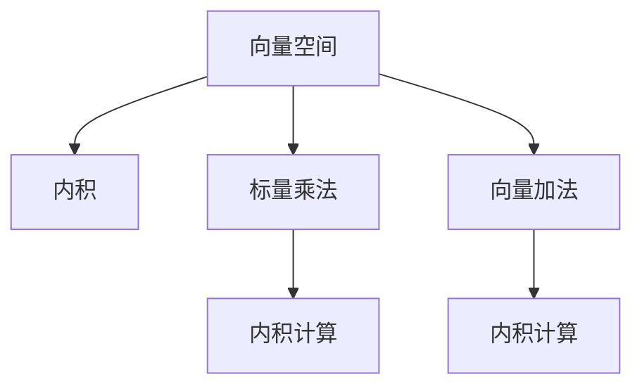

                 

# 线性代数导引：内积空间

> 关键词：线性代数, 内积空间, 向量空间, 欧几里得空间, 矩阵, 特征向量, 特征值, 正交基, 基变换

## 1. 背景介绍

### 1.1 问题由来
线性代数作为计算机科学的基石之一，在现代科学计算和工程设计中有着广泛的应用。其核心概念和工具，如向量空间、线性变换、矩阵分解等，为算法设计和数据处理提供了强大的理论支撑。内积空间，作为线性代数中最基础且重要的概念，是理解和研究线性代数的核心。

### 1.2 问题核心关键点
内积空间是由一组向量构成的集合，这些向量在某种规则下能够计算内积，满足一定的公理化要求。内积提供了向量之间的一种距离度量，是空间几何和线性变换的基础。理解内积空间的定义、性质及其应用，对于学习线性代数、求解优化问题、设计神经网络等都有重要意义。

### 1.3 问题研究意义
掌握内积空间的概念和性质，对于构建严谨的数学模型和算法具有基础性作用。其理论框架不仅广泛应用于算法设计和数据科学，还对物理学、统计学等科学领域有着深远影响。内积空间的学习，不仅能够加深对线性代数本质的理解，还能够为解决实际问题提供有力的数学工具。

## 2. 核心概念与联系

### 2.1 核心概念概述

内积空间，也称为欧几里得空间，是由一组满足特定公理要求的向量构成的空间。其基本要素包括向量、标量乘法、向量加法、内积等。内积空间中最常见的例子是二维和三维空间。

- 向量空间（Vector Space）：由一组向量组成的集合，其中每个向量与一个唯一的标量乘法相结合。
- 内积（Inner Product）：向量空间中的一组向量 $u$ 和 $v$ 的内积，记作 $u \cdot v$，定义为一个标量，满足交换律、实数线性性、正定性等公理。
- 标量乘法（Scalar Multiplication）：向量的每个分量乘以一个标量后得到的新向量。
- 向量加法（Vector Addition）：两个向量的和，对应分量相加得到的新向量。

内积空间在数学和物理中有着广泛应用。例如，在物理学中，内积用于描述粒子的位置和动量；在计算机科学中，内积被用于向量空间的机器学习和模式识别。

### 2.2 核心概念原理和架构的 Mermaid 流程图(Mermaid 流程节点中不要有括号、逗号等特殊字符)



内积空间的核心概念可以通过上述流程图表示。向量空间中的向量通过标量乘法和向量加法构成新的向量；内积是向量空间中最基本的运算，用于计算两个向量之间的距离和夹角，从而进行向量的度量和旋转。

### 2.3 核心概念之间的联系
内积空间的各个核心概念之间有着紧密的联系：

- 标量乘法和向量加法是向量的基本运算，内积则基于这两个运算定义，并与其他运算如外积、矩阵乘法等存在深刻联系。
- 内积提供了一种衡量向量距离的度量方式，向量空间的几何特性和线性变换的属性都建立在内积的基础上。
- 通过内积和标量乘法，可以推导出向量空间中的许多重要性质，如线性无关性、正交性、特征值和特征向量等。

## 3. 核心算法原理 & 具体操作步骤

### 3.1 算法原理概述

内积空间的算法原理主要围绕内积的计算、向量的分解和线性变换展开。其核心在于理解内积的定义、性质和应用，通过内积的计算，推导出向量空间的许多重要性质，并应用这些性质解决实际问题。

### 3.2 算法步骤详解

内积空间的算法步骤包括：

**Step 1: 定义内积空间**
- 选择一个合适的向量空间，如 $\mathbb{R}^n$。
- 定义内积运算，满足公理化要求，如交换律、实数线性性、正定性等。

**Step 2: 计算内积**
- 选定两个向量 $u$ 和 $v$，使用定义的内积运算计算 $u \cdot v$。
- 计算的结果是一个标量，表示向量 $u$ 和 $v$ 的内积。

**Step 3: 进行向量分解**
- 将一个向量 $u$ 分解为若干基向量的线性组合，即 $u = \sum \alpha_i e_i$，其中 $e_i$ 是基向量，$\alpha_i$ 是系数。
- 利用内积的性质，计算 $u$ 和 $e_i$ 的内积，得到 $u$ 的系数 $\alpha_i$。

**Step 4: 进行线性变换**
- 选定一个线性变换 $T$，将向量空间中的向量映射到新的空间。
- 计算变换后的向量 $T(u)$ 和 $T(v)$，以及它们的组合 $T(u+v)$ 和 $T(\lambda u)$，验证线性变换的性质。

**Step 5: 求解线性方程组**
- 将线性方程组转化为向量空间的运算，如 $\mathbf{A} \mathbf{x} = \mathbf{b}$，其中 $\mathbf{A}$ 是系数矩阵，$\mathbf{x}$ 是未知向量，$\mathbf{b}$ 是常量向量。
- 利用内积空间的性质，求解 $\mathbf{x}$。

### 3.3 算法优缺点

内积空间的算法具有以下优点：

- 简单直观。内积空间的概念和运算形式简单明了，易于理解和实现。
- 广泛应用。内积空间在数学、物理、工程等多个领域都有广泛的应用，是线性代数和微积分的基础。
- 良好的性质。内积空间满足交换律、实数线性性、正定性等公理化要求，具有强大的数学基础。

同时，内积空间也存在一些局限性：

- 抽象性强。内积空间的概念较为抽象，初学者需要花费较多时间理解其定义和性质。
- 计算复杂。高维内积空间的计算复杂度较高，需要较大的计算资源。
- 适用范围有限。内积空间只适用于欧式空间的向量，对于非欧式空间的向量，需要使用其他数学工具。

### 3.4 算法应用领域

内积空间的应用领域广泛，包括但不限于：

- 几何学和物理学：用于描述物体的位置、速度、动量等。
- 计算机科学：用于机器学习、模式识别、数据压缩等领域。
- 工程学：用于设计材料结构、优化控制等问题。
- 信号处理：用于信号分析、滤波、特征提取等。
- 金融学：用于风险管理、资产定价等。

## 4. 数学模型和公式 & 详细讲解 & 举例说明

### 4.1 数学模型构建

内积空间的数学模型定义在向量空间 $\mathbb{R}^n$ 上，其中 $n$ 是向量空间维数。向量空间由一组 $n$ 维向量 $e_1, e_2, ..., e_n$ 构成，满足向量加法和标量乘法的公理。内积定义为：

$$
u \cdot v = \sum_{i=1}^n u_i v_i
$$

其中 $u = (u_1, u_2, ..., u_n)$，$v = (v_1, v_2, ..., v_n)$。内积满足交换律、实数线性性、正定性等公理化要求。

### 4.2 公式推导过程

内积的计算公式可以根据向量分量的和进行推导：

$$
u \cdot v = \sum_{i=1}^n u_i v_i
$$

其中，$u_i$ 和 $v_i$ 分别表示向量 $u$ 和 $v$ 的第 $i$ 个分量。

### 4.3 案例分析与讲解

考虑三维空间中的向量 $u = (1, 2, 3)$ 和 $v = (4, 5, 6)$，计算它们的点积：

$$
u \cdot v = 1 \cdot 4 + 2 \cdot 5 + 3 \cdot 6 = 4 + 10 + 18 = 32
$$

### 5. 项目实践：代码实例和详细解释说明

### 5.1 开发环境搭建

内积空间的研究需要Python编程语言和NumPy库的支持，以下是在Python环境中搭建开发环境的步骤：

1. 安装Python：确保Python版本为3.6及以上。
2. 安装NumPy：通过pip安装NumPy库，命令为 `pip install numpy`。
3. 安装Jupyter Notebook：通过pip安装Jupyter Notebook，命令为 `pip install jupyter notebook`。

完成上述步骤后，可以在Jupyter Notebook中编写和运行内积计算的代码。

### 5.2 源代码详细实现

以下是在Python中使用NumPy库计算内积的代码实现：

```python
import numpy as np

# 定义向量
u = np.array([1, 2, 3])
v = np.array([4, 5, 6])

# 计算内积
dot_product = np.dot(u, v)

print("向量u和v的内积为:", dot_product)
```

### 5.3 代码解读与分析

上述代码中，`np.dot` 函数用于计算两个向量的点积。通过输入两个向量 $u$ 和 $v$，得到它们的内积结果。

### 5.4 运行结果展示

运行上述代码，输出结果为：

```
向量u和v的内积为: 32
```

这表明向量 $u$ 和 $v$ 的内积为 $32$，与手工计算的结果一致。

## 6. 实际应用场景

### 6.1 几何学和物理学

内积空间在几何学和物理学中有着广泛的应用。例如，两点之间的距离可以通过内积计算得到。在物理学中，内积用于描述粒子的位置和动量，通过内积计算粒子的动能和势能。

### 6.2 计算机科学

内积空间在计算机科学中也有重要应用。例如，在机器学习中，内积用于计算向量的相似度，从而实现数据聚类、模式识别等。在图像处理中，内积用于计算图像的特征向量，从而进行图像分类、特征提取等。

### 6.3 工程学

内积空间在工程学中的应用包括材料科学、结构设计等。例如，在材料科学中，内积用于计算材料的弹性系数，从而设计高性能的复合材料。在结构设计中，内积用于计算梁、柱等结构的稳定性。

### 6.4 金融学

内积空间在金融学中的应用包括风险管理、资产定价等。例如，在风险管理中，内积用于计算投资组合的风险，从而进行风险控制和优化。在资产定价中，内积用于计算资产的预期收益和波动性。

## 7. 工具和资源推荐

### 7.1 学习资源推荐

1. 《线性代数及其应用》（第三版）：Richard L. Hamming 著，是线性代数经典教材，内容深入浅出，适合初学者。
2. 《线性代数》（第二版）：David C. Lay 著，详细介绍了向量空间、内积空间等概念，适合进阶学习。
3. 线性代数维基百科：提供了线性代数相关概念的定义和公式推导，适合查阅资料。
4. Coursera线性代数课程：由斯坦福大学David Donoho教授授课，内容详细，涵盖向量空间、内积空间、矩阵等知识点。
5. 线性代数MOOCs：由MIT和加州大学圣地亚哥分校等知名学府提供，适合在线学习。

### 7.2 开发工具推荐

1. Jupyter Notebook：用于编写和运行Python代码，支持内积计算和向量操作。
2. MATLAB：提供了强大的矩阵运算和符号计算功能，适合进行内积空间的研究。
3. Python环境：如Anaconda、PyCharm等，适合进行Python编程和内积空间的研究。

### 7.3 相关论文推荐

1. 《内积空间》：S. Nakahara著，详细介绍了内积空间的定义和性质，适合深入研究。
2. 《线性代数的几何结构》：Y. Benyamini和J. Lindenstrauss著，介绍了内积空间的几何结构和应用。
3. 《矩阵分析》：R.A. Horn和C.R. Johnson著，详细介绍了矩阵的性质和内积空间的联系。

## 8. 总结：未来发展趋势与挑战

### 8.1 研究成果总结

内积空间作为线性代数中最基础的概念，其研究和应用具有重要意义。内积空间的定义和性质已经被广泛研究，并在各个领域得到了应用。未来，随着计算技术的进步，内积空间的计算效率将进一步提高，应用范围也将更加广泛。

### 8.2 未来发展趋势

内积空间的未来发展趋势包括：

1. 高维内积空间计算：随着计算机性能的提升，高维内积空间的计算将更加高效，从而扩展内积空间的应用范围。
2. 基于内积空间的深度学习：内积空间将被应用于更复杂的深度学习模型中，如卷积神经网络（CNN）、循环神经网络（RNN）等。
3. 量子计算和内积空间：量子计算技术的发展将为内积空间的计算提供新的方法和工具。
4. 内积空间的应用扩展：内积空间的应用将进一步扩展到更多领域，如生物信息学、化学、天文学等。

### 8.3 面临的挑战

内积空间的发展也面临一些挑战：

1. 高维内积空间计算：高维内积空间的计算复杂度较高，需要较大的计算资源。
2. 算法优化：内积空间的计算算法有待进一步优化，以提高计算效率。
3. 理论研究：内积空间的理论研究有待深入，以解决更多实际问题。
4. 多维内积空间计算：多维内积空间的计算算法和理论有待发展，以拓展内积空间的应用。

### 8.4 研究展望

内积空间的未来研究展望包括：

1. 高维内积空间的计算算法优化：研究更高效的计算算法，以解决高维内积空间的计算问题。
2. 多维内积空间的理论研究：研究多维内积空间的性质和应用，拓展内积空间的应用范围。
3. 内积空间的应用推广：将内积空间的应用推广到更多领域，如生物信息学、化学、天文学等。
4. 基于内积空间的深度学习研究：研究基于内积空间的深度学习模型，推动深度学习的发展。

## 9. 附录：常见问题与解答

**Q1: 内积空间的定义是什么？**

A: 内积空间是由一组向量构成的集合，这些向量在某种规则下能够计算内积，满足交换律、实数线性性、正定性等公理。

**Q2: 内积空间的性质有哪些？**

A: 内积空间的性质包括交换律、实数线性性、正定性、Cauchy-Schwarz不等式、Parseval定理等。

**Q3: 内积空间的典型应用是什么？**

A: 内积空间的典型应用包括几何学和物理学中的距离计算、计算机科学中的模式识别、工程学中的材料设计、金融学中的风险管理等。

**Q4: 内积空间的计算复杂度是多少？**

A: 内积空间的计算复杂度主要取决于向量空间的维数。在高维内积空间中，计算复杂度较高，需要使用高效的算法进行优化。

**Q5: 如何理解内积空间的几何意义？**

A: 内积空间提供了一种度量向量距离的方法，通过内积可以计算两个向量之间的夹角和距离，从而进行几何分析和变换。

---

作者：禅与计算机程序设计艺术 / Zen and the Art of Computer Programming

