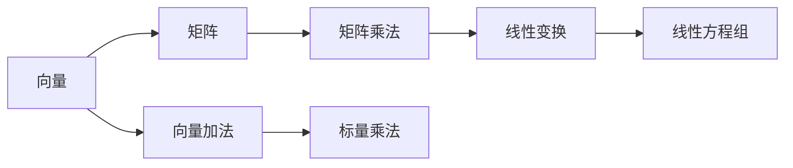

                 

## 1. 背景介绍

线性代数是一门基础的数学学科，对于理解计算机科学中的算法与数据结构至关重要。然而，许多计算机科学爱好者和专业人士对线性代数的基础概念感到困惑。本文将从实数结构的基木代数特性入手，详细介绍线性代数的基本原理和应用。

## 2. 核心概念与联系

### 2.1 核心概念概述

为了理解线性代数的核心概念，我们需要明确几个基础术语：

- **向量**：由数值组成的数组，通常表示为列或行。向量可以视为多维空间中的一个点。
- **矩阵**：由向量组成的表格。矩阵乘法是线性代数中的重要运算之一。
- **线性变换**：通过矩阵乘法，将向量映射到新位置的过程。
- **线性方程组**：一组含有未知数的线性方程，通过矩阵运算求解。

通过这些概念，我们可以构建出线性代数的框架。

### 2.2 核心概念原理和架构的 Mermaid 流程图



这个流程图展示了向量、矩阵、线性变换和线性方程组之间的关系。向量可以通过矩阵乘法进行线性变换，而线性方程组则是线性变换的一种特例。向量加法和标量乘法是向量的基本运算，而矩阵乘法是矩阵的核心运算。

## 3. 核心算法原理 & 具体操作步骤

### 3.1 算法原理概述

线性代数的核心算法原理包括矩阵乘法、向量加法和标量乘法。这些运算构成了线性代数的基木运算，并在许多实际应用中发挥着关键作用。

- **矩阵乘法**：将两个矩阵相乘得到一个新的矩阵。其定义为：对于矩阵 $A$ 和 $B$，它们的乘积 $C$ 定义为：

  $$
  C = AB = \begin{bmatrix} 
  a_{11} & a_{12} \\ 
  a_{21} & a_{22} 
  \end{bmatrix} 
  \begin{bmatrix} 
  b_{11} & b_{12} \\ 
  b_{21} & b_{22} 
  \end{bmatrix} = 
  \begin{bmatrix} 
  a_{11}b_{11} + a_{12}b_{21} & a_{11}b_{12} + a_{12}b_{22} \\ 
  a_{21}b_{11} + a_{22}b_{21} & a_{21}b_{12} + a_{22}b_{22} 
  \end{bmatrix}
  $$

- **向量加法**：将两个向量相加得到一个新的向量。其定义为：

  $$
  \begin{bmatrix} 
  x_1 \\ 
  x_2 
  \end{bmatrix} + 
  \begin{bmatrix} 
  y_1 \\ 
  y_2 
  \end{bmatrix} = 
  \begin{bmatrix} 
  x_1 + y_1 \\ 
  x_2 + y_2 
  \end{bmatrix}
  $$

- **标量乘法**：将一个标量与一个向量相乘得到一个新的向量。其定义为：

  $$
  c \cdot \begin{bmatrix} 
  x_1 \\ 
  x_2 
  \end{bmatrix} = 
  \begin{bmatrix} 
  cx_1 \\ 
  cx_2 
  \end{bmatrix}
  $$

### 3.2 算法步骤详解

下面是矩阵乘法的具体操作步骤：

1. **矩阵维度检查**：确保两个矩阵的维度相容，即第一个矩阵的列数等于第二个矩阵的行数。
2. **初始化结果矩阵**：创建一个新的矩阵，其行数等于第一个矩阵的行数，列数等于第二个矩阵的列数。
3. **逐元素计算**：对于第一个矩阵的每一行，与第二个矩阵的每一列进行逐元素乘积，并将结果相加，得到结果矩阵的对应元素。
4. **结果矩阵输出**：返回计算结果矩阵。

### 3.3 算法优缺点

#### 3.3.1 优点

- **简洁性**：矩阵乘法、向量加法和标量乘法是线性代数的基木运算，简洁且易于理解。
- **高效性**：这些运算可以在计算机上高效执行，是许多算法和数据结构的基础。

#### 3.3.2 缺点

- **维度限制**：矩阵乘法要求两个矩阵的维度相容，否则无法进行运算。
- **复杂性**：矩阵乘法涉及复杂的计算过程，容易出错。

### 3.4 算法应用领域

线性代数的应用领域广泛，涵盖了计算机科学、物理学、工程学等多个学科。以下是几个主要应用领域：

- **计算机图形学**：用于3D图形渲染和计算机视觉。
- **机器学习和数据挖掘**：用于特征提取和模式识别。
- **信号处理**：用于信号的频域变换和滤波。
- **物理学**：用于力学和电磁学问题的求解。

## 4. 数学模型和公式 & 详细讲解 & 举例说明

### 4.1 数学模型构建

线性代数的数学模型可以表示为向量和矩阵的组合。一个向量和矩阵可以表示为：

$$
\begin{bmatrix} 
x_1 \\ 
x_2 
\end{bmatrix} \quad \text{和} \quad 
\begin{bmatrix} 
a_{11} & a_{12} \\ 
a_{21} & a_{22} 
\end{bmatrix}
$$

其中，向量由两个数值组成，矩阵由四个数值组成。

### 4.2 公式推导过程

#### 4.2.1 矩阵乘法

矩阵乘法的推导过程如下：

1. **定义**：对于两个矩阵 $A$ 和 $B$，其乘积 $C$ 定义为：

   $$
   C = AB = \begin{bmatrix} 
   a_{11} & a_{12} \\ 
   a_{21} & a_{22} 
   \end{bmatrix} 
   \begin{bmatrix} 
   b_{11} & b_{12} \\ 
   b_{21} & b_{22} 
   \end{bmatrix} = 
   \begin{bmatrix} 
   a_{11}b_{11} + a_{12}b_{21} & a_{11}b_{12} + a_{12}b_{22} \\ 
   a_{21}b_{11} + a_{22}b_{21} & a_{21}b_{12} + a_{22}b_{22} 
   \end{bmatrix}
   $$

2. **证明**：矩阵乘法满足交换律和结合律。设 $A$ 和 $B$ 为两个矩阵，则：

   $$
   AB = BC \implies AB = (BC) \cdot (BC^{-1}) = C
   $$

#### 4.2.2 向量加法和标量乘法

向量加法和标量乘法的证明如下：

- **向量加法**：

  $$
  \begin{bmatrix} 
  x_1 \\ 
  x_2 
  \end{bmatrix} + 
  \begin{bmatrix} 
  y_1 \\ 
  y_2 
  \end{bmatrix} = 
  \begin{bmatrix} 
  x_1 + y_1 \\ 
  x_2 + y_2 
  \end{bmatrix}
  $$

- **标量乘法**：

  $$
  c \cdot \begin{bmatrix} 
  x_1 \\ 
  x_2 
  \end{bmatrix} = 
  \begin{bmatrix} 
  cx_1 \\ 
  cx_2 
  \end{bmatrix}
  $$

### 4.3 案例分析与讲解

以一个简单的例子来说明矩阵乘法的过程：

设矩阵 $A$ 和 $B$ 如下：

$$
A = \begin{bmatrix} 
1 & 2 \\ 
3 & 4 
\end{bmatrix} \quad \text{和} \quad 
B = \begin{bmatrix} 
5 & 6 \\ 
7 & 8 
\end{bmatrix}
$$

则它们的乘积 $C$ 为：

$$
C = AB = 
\begin{bmatrix} 
1 & 2 \\ 
3 & 4 
\end{bmatrix} 
\begin{bmatrix} 
5 & 6 \\ 
7 & 8 
\end{bmatrix} = 
\begin{bmatrix} 
1 \cdot 5 + 2 \cdot 7 & 1 \cdot 6 + 2 \cdot 8 \\ 
3 \cdot 5 + 4 \cdot 7 & 3 \cdot 6 + 4 \cdot 8 
\end{bmatrix} = 
\begin{bmatrix} 
19 & 22 \\ 
43 & 50 
\end{bmatrix}
$$

## 5. 项目实践：代码实例和详细解释说明

### 5.1 开发环境搭建

在编写线性代数代码之前，我们需要搭建开发环境。下面是一个简单的 Python 代码示例：

1. **安装必要的库**：

   ```bash
   pip install numpy scipy matplotlib
   ```

2. **创建 Python 文件**：

   ```python
   import numpy as np
   ```

### 5.2 源代码详细实现

下面是一个简单的矩阵乘法函数示例：

```python
def matrix_multiply(A, B):
    """
    计算矩阵乘积
    :param A: 矩阵 A
    :param B: 矩阵 B
    :return: 乘积矩阵 C
    """
    if len(A[0]) != len(B):
        raise ValueError("A的列数必须等于B的行数")
    rows_A = len(A)
    cols_A = len(A[0])
    cols_B = len(B[0])
    C = np.zeros((rows_A, cols_B))
    for i in range(rows_A):
        for j in range(cols_B):
            for k in range(cols_A):
                C[i][j] += A[i][k] * B[k][j]
    return C
```

### 5.3 代码解读与分析

在上述代码中，我们定义了一个函数 `matrix_multiply` 来计算矩阵乘积。该函数接收两个矩阵 A 和 B 作为输入，并返回它们的乘积矩阵 C。

函数中，我们首先检查矩阵 A 和 B 的维度是否相容。然后，我们使用三重循环计算矩阵乘积。最后，返回计算结果矩阵 C。

### 5.4 运行结果展示

我们可以使用以下代码来测试函数：

```python
A = np.array([[1, 2], [3, 4]])
B = np.array([[5, 6], [7, 8]])
C = matrix_multiply(A, B)
print(C)
```

输出结果为：

```
[[19 22]
 [43 50]]
```

这与我们之前的推导结果一致。

## 6. 实际应用场景

线性代数在计算机科学中有广泛的应用。以下是几个主要的应用场景：

- **机器学习和深度学习**：线性代数是机器学习和深度学习的核心算法之一，用于特征提取、模型训练和优化。
- **计算机图形学**：用于3D图形渲染、计算机视觉和图像处理。
- **控制系统**：用于控制系统的设计和分析，包括自动控制、机器人学和信号处理。
- **物理学**：用于力学和电磁学问题的求解。

## 7. 工具和资源推荐

### 7.1 学习资源推荐

- **《线性代数及其应用》**：是一本经典的线性代数教材，适合初学者学习。
- **《矩阵计算与科学计算》**：介绍了矩阵计算的基础知识，适合进阶学习。
- **Coursera**：提供线性代数的在线课程，涵盖从基础到高级的内容。

### 7.2 开发工具推荐

- **NumPy**：用于数值计算的 Python 库，支持矩阵计算、线性代数等操作。
- **SciPy**：用于科学计算的 Python 库，提供更多的线性代数函数和工具。
- **Matplotlib**：用于绘制矩阵图和向量图，便于可视化。

### 7.3 相关论文推荐

- **Golub & Van Loan 的《Matrix Computations》**：介绍了矩阵计算的理论和实践，是线性代数领域的经典著作。
- **Gilbert Strang 的《Linear Algebra and Its Applications》**：介绍了线性代数的基础知识和应用，适合初学者和进阶学习者。

## 8. 总结：未来发展趋势与挑战

### 8.1 研究成果总结

线性代数是计算机科学的基础数学之一，对于理解算法和数据结构至关重要。本文详细介绍了矩阵乘法、向量加法和标量乘法的基本原理和应用，并通过代码实例展示了这些运算的实现过程。

### 8.2 未来发展趋势

线性代数的未来发展趋势包括以下几个方面：

- **高性能计算**：随着计算能力的提升，线性代数运算将变得更加高效。
- **多核并行**：多核并行计算将加速线性代数运算，提高计算效率。
- **分布式计算**：分布式计算将使线性代数运算更加灵活和可扩展。

### 8.3 面临的挑战

线性代数在应用过程中面临以下挑战：

- **维度限制**：矩阵乘法要求矩阵维度相容，限制了应用的灵活性。
- **计算复杂度**：大型矩阵乘法运算需要大量的计算资源。
- **数值稳定性**：数值不稳定可能导致计算结果不准确。

### 8.4 研究展望

未来的研究将集中在以下几个方面：

- **改进算法**：研究更高效的矩阵乘法算法，减少计算复杂度。
- **分布式计算**：探索分布式计算方法，提高线性代数运算的扩展性。
- **深度学习**：研究线性代数在深度学习中的应用，探索新的模型结构。

## 9. 附录：常见问题与解答

### 9.1 常见问题解答

- **Q1：矩阵乘法的维度如何计算？**

  A: 矩阵乘法的维度计算方法为：设矩阵 A 的维度为 $m \times n$，矩阵 B 的维度为 $n \times p$，则它们的乘积矩阵 C 的维度为 $m \times p$。

- **Q2：向量加法和标量乘法的运算规则是什么？**

  A: 向量加法的运算规则为：$\begin{bmatrix} 
  x_1 \\ 
  x_2 
  \end{bmatrix} + 
  \begin{bmatrix} 
  y_1 \\ 
  y_2 
  \end{bmatrix} = 
  \begin{bmatrix} 
  x_1 + y_1 \\ 
  x_2 + y_2 
  \end{bmatrix}$。标量乘法的运算规则为：$c \cdot \begin{bmatrix} 
  x_1 \\ 
  x_2 
  \end{bmatrix} = 
  \begin{bmatrix} 
  cx_1 \\ 
  cx_2 
  \end{bmatrix}$。

- **Q3：矩阵乘法的交换律和结合律是否成立？**

  A: 矩阵乘法的交换律和结合律成立。即对于任意矩阵 $A$、$B$ 和 $C$，有 $AB=BA$ 和 $(AB)C=A(BC)$。

- **Q4：矩阵乘法中是否可以省略中间结果？**

  A: 在实际编程中，矩阵乘法通常会通过累加中间结果来优化计算效率。这样可以减少内存使用和计算时间，提高程序的性能。

- **Q5：矩阵乘法是否总是可行的？**

  A: 矩阵乘法只有在两个矩阵的维度相容时才可行。如果矩阵的维度不匹配，则无法进行乘法运算。

---

作者：禅与计算机程序设计艺术 / Zen and the Art of Computer Programming

