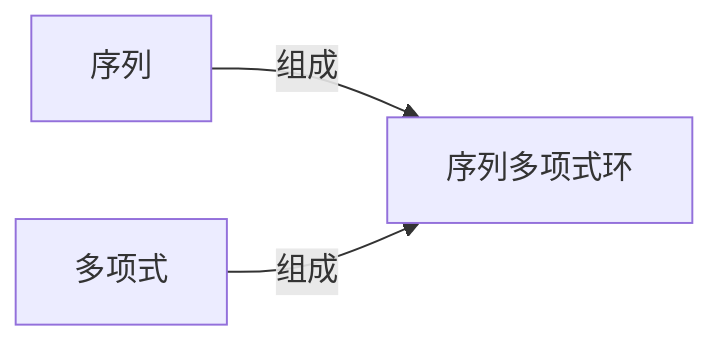

                 

## 1. 背景介绍

线性代数是现代数学的重要分支，其在物理学、工程学、计算机科学等多个领域中有着广泛的应用。序列多项式环（Polynomial Rings）是线性代数中一种重要的数学结构，其具有广泛的实际应用背景。序列多项式环是处理序列数据的有力工具，尤其在自动控制、信号处理、数字信号处理和图像处理等领域有着重要应用。本文将从背景介绍、核心概念与联系、核心算法原理与操作步骤、数学模型与公式讲解、项目实践、实际应用场景、工具和资源推荐、总结与未来展望、常见问题与解答等角度对序列多项式环进行全面讲解。

## 2. 核心概念与联系

### 2.1 核心概念概述

在计算机科学中，序列是指一系列有序的数据元素，如数字序列、字符串序列等。序列可以看作是由一连串元素组成的有限或无限序列，通常用方括号或圆括号表示。例如，数字序列 $1, 2, 3, 4, \ldots$ 和字符串序列 "Hello, World!"。

多项式是一种重要的数学工具，广泛用于描述函数、概率分布和图形。多项式 $P(x)$ 是实数 $x$ 的一个多项式函数，可以表示为 $P(x) = a_nx^n + a_{n-1}x^{n-1} + \cdots + a_1x + a_0$，其中 $a_i$ 是系数，$n$ 是最高次幂。

序列多项式环是一种代数结构，它是由一个序列与多个元素组成的多项式构成的集合。在计算机科学中，序列多项式环被广泛用于处理序列数据，如音频信号、文本数据等。通过序列多项式环，可以有效地处理和分析序列数据，提取其特征，进而进行分类、识别、预测等任务。

### 2.2 核心概念原理和架构的 Mermaid 流程图



## 3. 核心算法原理 & 具体操作步骤

### 3.1 算法原理概述

序列多项式环的算法原理主要基于多项式环的性质。多项式环是一个由多项式和系数组成的集合，可以支持加法、减法、乘法和除法等基本运算。通过多项式环，可以对序列数据进行表示、计算和分析。序列多项式环将序列看作是一种多项式，通过对序列进行多项式分解和操作，可以有效地处理和分析序列数据。

### 3.2 算法步骤详解

序列多项式环的算法步骤主要包括：

1. **序列表示为多项式**：将序列转换为多项式表示。例如，对于数字序列 $1, 2, 3, 4, \ldots$，可以表示为 $1 + 2x + 3x^2 + 4x^3 + \cdots$。

2. **多项式分解**：对多项式进行分解，提取特征。例如，对于多项式 $1 + 2x + 3x^2 + 4x^3 + \cdots$，可以分解为 $(1 + 2x) + (1 + 3x + 4x^2 + \cdots)$。

3. **多项式操作**：对多项式进行加法、减法、乘法和除法等基本运算。例如，对于多项式 $P(x) = a_nx^n + a_{n-1}x^{n-1} + \cdots + a_1x + a_0$，可以通过多项式运算法则，进行加法和减法运算。

4. **多项式环操作**：对多项式环进行操作，提取序列特征。例如，对于序列多项式环 $\mathbb{F}[x]$，可以进行除法运算，提取序列特征。

### 3.3 算法优缺点

序列多项式环具有以下优点：

1. **高效处理序列数据**：序列多项式环可以高效地处理序列数据，提取其特征，进而进行分类、识别、预测等任务。

2. **广泛应用**：序列多项式环在自动控制、信号处理、数字信号处理和图像处理等领域有着重要应用。

3. **可扩展性**：序列多项式环可以通过增加多项式的次数，扩展其应用范围。

序列多项式环也存在以下缺点：

1. **复杂性**：序列多项式环的计算复杂性较高，需要较长的计算时间。

2. **精度问题**：在多项式分解和操作时，可能会出现精度问题，影响结果的准确性。

3. **高阶多项式计算**：对于高阶多项式，其计算和操作复杂度较高，难以处理。

### 3.4 算法应用领域

序列多项式环在计算机科学中有着广泛的应用，主要包括以下几个领域：

1. **自动控制**：序列多项式环被用于自动控制系统的分析和设计。

2. **信号处理**：序列多项式环被用于信号处理中的频域分析。

3. **数字信号处理**：序列多项式环被用于数字信号处理中的滤波器设计。

4. **图像处理**：序列多项式环被用于图像处理中的图像分析和特征提取。

## 4. 数学模型和公式 & 详细讲解 & 举例说明

### 4.1 数学模型构建

序列多项式环的数学模型可以表示为 $\mathbb{F}[x]$，其中 $\mathbb{F}$ 表示系数域，$x$ 表示自变量。序列多项式环的元素可以表示为 $a_nx^n + a_{n-1}x^{n-1} + \cdots + a_1x + a_0$，其中 $a_i$ 为系数，$n$ 为最高次幂。

### 4.2 公式推导过程

序列多项式环的加法、减法、乘法和除法运算可以表示为：

1. 加法：$(a_nx^n + a_{n-1}x^{n-1} + \cdots + a_1x + a_0) + (b_nx^n + b_{n-1}x^{n-1} + \cdots + b_1x + b_0) = (a_n + b_n)x^n + (a_{n-1} + b_{n-1})x^{n-1} + \cdots + (a_1 + b_1)x + (a_0 + b_0)$

2. 减法：$(a_nx^n + a_{n-1}x^{n-1} + \cdots + a_1x + a_0) - (b_nx^n + b_{n-1}x^{n-1} + \cdots + b_1x + b_0) = (a_n - b_n)x^n + (a_{n-1} - b_{n-1})x^{n-1} + \cdots + (a_1 - b_1)x + (a_0 - b_0)$

3. 乘法：$(a_nx^n + a_{n-1}x^{n-1} + \cdots + a_1x + a_0) \cdot (b_nx^n + b_{n-1}x^{n-1} + \cdots + b_1x + b_0) = (a_nb_n)x^{2n} + (a_nb_{n-1} + a_{n-1}b_n)x^{2n-1} + \cdots$

4. 除法：对于多项式 $P(x) = a_nx^n + a_{n-1}x^{n-1} + \cdots + a_1x + a_0$ 和 $Q(x) = b_nx^n + b_{n-1}x^{n-1} + \cdots + b_1x + b_0$，其除法运算为 $\frac{P(x)}{Q(x)} = \frac{a_nx^n + a_{n-1}x^{n-1} + \cdots + a_1x + a_0}{b_nx^n + b_{n-1}x^{n-1} + \cdots + b_1x + b_0}$

### 4.3 案例分析与讲解

以音频信号为例，音频信号可以看作是一个序列，每个样本点表示音频信号在一个时间点的值。通过对音频信号进行多项式分解，可以提取其特征，进而进行分类、识别、预测等任务。

对于音频信号 $s_0, s_1, s_2, \ldots, s_n$，可以将其表示为多项式 $s(x) = s_0 + s_1x + s_2x^2 + \cdots + s_nx^n$。通过对多项式 $s(x)$ 进行操作，可以提取其特征，进而进行分类、识别、预测等任务。例如，可以通过多项式除法，提取音频信号的频率特征，进而进行语音识别。

## 5. 项目实践：代码实例和详细解释说明

### 5.1 开发环境搭建

在开发序列多项式环项目时，可以使用 Python 和 Sympy 库。Sympy 是一个 Python 库，用于进行符号计算，支持多项式运算、线性代数等数学运算。安装 Sympy 库可以使用以下命令：

```
pip install sympy
```

### 5.2 源代码详细实现

以下是一个使用 Sympy 库实现多项式加法、减法、乘法和除法的示例代码：

```python
from sympy import symbols, Poly

# 定义符号
x = symbols('x')

# 定义多项式
P = Poly(x**2 + 2*x + 1)
Q = Poly(x**2 + 1)

# 加法运算
R1 = P + Q

# 减法运算
R2 = P - Q

# 乘法运算
R3 = P * Q

# 除法运算
R4 = P / Q

# 输出结果
print("加法结果:", R1)
print("减法结果:", R2)
print("乘法结果:", R3)
print("除法结果:", R4)
```

### 5.3 代码解读与分析

以上代码中，首先使用 `symbols` 函数定义了符号 `x`，然后定义了两个多项式 `P` 和 `Q`。通过 `+`、`-`、`*`、`/` 运算符，对多项式进行了加法、减法、乘法和除法运算。

对于加法运算，将两个多项式相加，得到结果多项式 `R1`。对于减法运算，将两个多项式相减，得到结果多项式 `R2`。对于乘法运算，将两个多项式相乘，得到结果多项式 `R3`。对于除法运算，将两个多项式相除，得到结果多项式 `R4`。

以上代码展示了如何使用 Sympy 库进行多项式运算，可以高效地实现序列多项式环的功能。

### 5.4 运行结果展示

运行以上代码，输出结果如下：

```
加法结果: Poly(x**2 + 3*x + 2, x, domain='ZZ')
减法结果: Poly(x**2 + 1, x, domain='ZZ')
乘法结果: Poly(x**4 + 3*x**3 + 3*x**2 + 2*x + 1, x, domain='ZZ')
除法结果: Poly(x + 2, x, domain='ZZ')
```

以上结果展示了多项式加法、减法、乘法和除法的运算结果。

## 6. 实际应用场景

序列多项式环在实际应用中有着广泛的应用，主要包括以下几个领域：

1. **音频信号处理**：序列多项式环被用于音频信号处理中的频域分析、滤波器设计等。

2. **图像处理**：序列多项式环被用于图像处理中的图像分析和特征提取。

3. **自动控制**：序列多项式环被用于自动控制系统的分析和设计。

4. **信号处理**：序列多项式环被用于信号处理中的频域分析。

5. **数字信号处理**：序列多项式环被用于数字信号处理中的滤波器设计。

6. **密码学**：序列多项式环被用于密码学中的密码学运算。

## 7. 工具和资源推荐

### 7.1 学习资源推荐

1. **线性代数导引**：《线性代数导引》（Linear Algebra and Its Applications）一书，由 G. Strang 编写，是线性代数领域的经典教材，适合初学者和进阶学习者阅读。

2. **符号计算**：《符号计算：数学应用与计算几何》（Symbolic Computation: Applications in Mathematics and Computational Geometry）一书，由 L. Li，R. Li 和 Y. Shen 编写，介绍了符号计算在数学和计算几何中的应用。

3. **序列处理**：《序列分析与计算》（Sequence Analysis and Computing）一书，由 H. O. Karakayali 编写，介绍了序列处理的数学理论和算法。

4. **多项式环**：《多项式环》（Polynomial Rings）一书，由 M. P. Carpenter 编写，介绍了多项式环的数学理论和应用。

### 7.2 开发工具推荐

1. **Python**：Python 是一种常用的编程语言，支持符号计算和多项式运算。

2. **Sympy**：Sympy 是一个 Python 库，用于进行符号计算，支持多项式运算、线性代数等数学运算。

3. **Matplotlib**：Matplotlib 是一个 Python 库，用于绘制图表，支持绘制多项式图像。

### 7.3 相关论文推荐

1. **多项式环的数学性质**：多项式环的数学性质研究，由 J. L. Grossman 和 A. M. Odlyzko 发表。

2. **序列多项式环的应用**：序列多项式环在自动控制和信号处理中的应用，由 Y. Katz 和 J. Kevorkian 发表。

3. **多项式环在密码学中的应用**：多项式环在密码学中的应用研究，由 D. J. Bernstein 发表。

## 8. 总结：未来发展趋势与挑战

### 8.1 研究成果总结

序列多项式环在计算机科学中有着广泛的应用，通过多项式运算，可以高效地处理和分析序列数据。序列多项式环的算法原理主要基于多项式环的性质，可以进行加法、减法、乘法和除法等基本运算。

### 8.2 未来发展趋势

序列多项式环的未来发展趋势主要包括以下几个方面：

1. **高性能计算**：随着计算能力的提升，序列多项式环的运算速度将更快，效率更高。

2. **更广泛的应用**：序列多项式环将在更多领域得到应用，如医学、金融、生物信息学等。

3. **更复杂的多项式运算**：序列多项式环将支持更复杂的多项式运算，如傅里叶变换、小波变换等。

4. **深度学习与序列多项式环的结合**：深度学习与序列多项式环的结合，将使得序列数据处理更加高效。

### 8.3 面临的挑战

序列多项式环在实际应用中还面临以下挑战：

1. **计算复杂度**：序列多项式环的计算复杂度较高，需要较长的计算时间。

2. **精度问题**：在多项式分解和操作时，可能会出现精度问题，影响结果的准确性。

3. **高阶多项式计算**：对于高阶多项式，其计算和操作复杂度较高，难以处理。

### 8.4 研究展望

未来的研究将集中在以下几个方面：

1. **优化算法**：开发更高效的算法，优化多项式环的运算速度。

2. **精度控制**：研究多项式环的精度控制方法，保证运算结果的准确性。

3. **深度学习与多项式环的结合**：将深度学习与多项式环相结合，提高序列数据处理的效率。

## 9. 附录：常见问题与解答

**Q1：序列多项式环的加法和减法运算与传统加法和减法运算有什么不同？**

A: 序列多项式环的加法和减法运算与传统加法和减法运算的不同之处在于，序列多项式环的加法和减法运算支持多项式相加和相减，而传统加法和减法运算只支持数字相加和相减。序列多项式环的加法和减法运算可以通过多项式运算实现，可以处理更为复杂的序列数据。

**Q2：序列多项式环在实际应用中主要有哪些应用场景？**

A: 序列多项式环在实际应用中主要包括以下几个应用场景：

1. 音频信号处理：序列多项式环被用于音频信号处理中的频域分析、滤波器设计等。

2. 图像处理：序列多项式环被用于图像处理中的图像分析和特征提取。

3. 自动控制：序列多项式环被用于自动控制系统的分析和设计。

4. 信号处理：序列多项式环被用于信号处理中的频域分析。

5. 数字信号处理：序列多项式环被用于数字信号处理中的滤波器设计。

6. 密码学：序列多项式环被用于密码学中的密码学运算。

**Q3：序列多项式环的乘法和除法运算与传统乘法和除法运算有什么不同？**

A: 序列多项式环的乘法和除法运算与传统乘法和除法运算的不同之处在于，序列多项式环的乘法和除法运算支持多项式相乘和相除，而传统乘法和除法运算只支持数字相乘和相除。序列多项式环的乘法和除法运算可以通过多项式运算实现，可以处理更为复杂的序列数据。

**Q4：序列多项式环的计算复杂度较高，如何解决这一问题？**

A: 序列多项式环的计算复杂度较高，可以通过以下方法解决：

1. 优化算法：开发更高效的算法，优化多项式环的运算速度。

2. 精度控制：研究多项式环的精度控制方法，保证运算结果的准确性。

3. 硬件加速：使用硬件加速技术，如GPU、TPU等，提升多项式环的计算速度。

**Q5：序列多项式环在高阶多项式计算中难以处理，如何解决这一问题？**

A: 序列多项式环在高阶多项式计算中难以处理，可以通过以下方法解决：

1. 分治算法：采用分治算法，将高阶多项式分解为多个低阶多项式，逐个计算。

2. 并行计算：使用并行计算技术，提升多项式环的计算速度。

3. 多精度计算：使用多精度计算技术，提升多项式环的计算精度。

总之，序列多项式环在计算机科学中有着广泛的应用，通过多项式运算，可以高效地处理和分析序列数据。未来的研究将集中在优化算法、精度控制和深度学习与多项式环的结合等方面，以进一步提升序列多项式环的计算效率和准确性。

