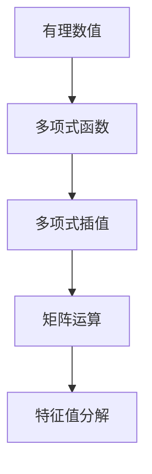
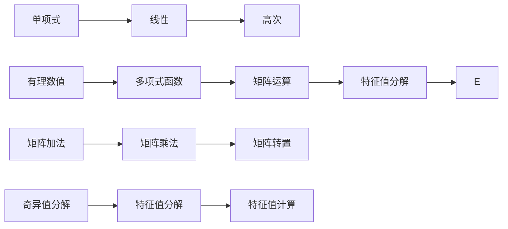

                 

# 线性代数导引：有理数值函数环

## 1. 背景介绍

### 1.1 问题由来

在计算机科学和数学的交叉领域，线性代数是处理向量空间、矩阵运算以及线性变换等核心概念的重要基础。随着深度学习模型的不断发展，线性代数理论在其中扮演了至关重要的角色，尤其是有理数值函数环理论的应用。本文将深入探讨有理数值函数环的原理与方法，阐释其在深度学习、特别是函数环的实现和应用中的重要性和价值。

### 1.2 问题核心关键点

有理数值函数环是深度学习中的重要工具，用于构造高效、稳定的函数计算环境，支持模型训练和推理过程中的精确计算。其核心要点包括：

- **有理数值表示**：采用有理数或浮点数进行数学运算，减少数值计算误差，提高模型训练和推理的稳定性。
- **多项式运算**：通过多项式表示和运算，简化函数表达，减少计算复杂度。
- **多项式插值**：利用多项式插值方法，构造连续且可微的函数，用于逼近复杂函数和优化问题。
- **符号计算**：利用符号计算库（如SymPy）进行精确的符号运算，支持复杂的数学推导和优化。
- **线性代数基础**：掌握线性代数的基础知识，如矩阵、向量、特征值分解、奇异值分解等，为函数环的实现提供数学基础。

## 2. 核心概念与联系

### 2.1 核心概念概述

为了更好地理解有理数值函数环的理论基础，本节将介绍几个关键概念：

- **有理数值**：有理数是整数之比，可以精确表示整数、分数、小数等数值类型。
- **多项式函数**：由一个或多个单项式组成的多项式，具有连续可微的特性。
- **多项式插值**：使用多项式函数逼近离散数据点，得到连续且可微的函数。
- **矩阵运算**：矩阵是二维数组，可以进行加、减、乘、转置等基本运算。
- **特征值分解**：通过奇异值分解和特征值分解，将矩阵分解为若干特征向量和特征值的组合。

这些核心概念之间的逻辑关系可以通过以下Mermaid流程图来展示：



这个流程图展示了有理数值函数环的基本逻辑结构：

1. 有理数值是函数环的基本单位，用于精确表示计算中的数值。
2. 多项式函数通过有理数值进行表示和运算，支持连续且可微的函数计算。
3. 矩阵运算和特征值分解作为多项式函数的高级形式，进一步扩展了函数的表达能力。

### 2.2 核心概念原理和架构的 Mermaid 流程图



## 3. 核心算法原理 & 具体操作步骤

### 3.1 算法原理概述

有理数值函数环的实现基于多项式函数的精确表示和运算，利用矩阵运算和特征值分解等线性代数技术，支持高效、稳定的函数计算。其主要算法原理包括以下几个方面：

- **多项式表示**：将函数表示为多项式形式，利用有理数值进行精确运算。
- **矩阵计算**：通过矩阵运算和特征值分解，加速多项式函数的计算和优化。
- **插值逼近**：利用多项式插值逼近复杂函数，支持非线性函数的表达和优化。
- **符号计算**：通过符号计算库进行精确的数学推导和优化，支持复杂的数学推导。

### 3.2 算法步骤详解

以下是实现有理数值函数环的核心步骤：

**Step 1: 构建有理数值环境**

- 选择适当的有理数值数据类型，如`Rational`或`Fraction`，用于精确表示计算中的数值。
- 设置有理数值的精度，以控制计算误差和内存占用。

**Step 2: 定义多项式函数**

- 定义多项式函数的系数，通常采用有理数值数组表示。
- 实现多项式函数的加、减、乘、除等基本运算。
- 利用符号计算库进行函数的多项式展开和符号求导。

**Step 3: 实现矩阵运算**

- 定义矩阵类型和运算方法，如矩阵加、乘、转置等。
- 实现矩阵的特征值分解和奇异值分解。
- 利用矩阵运算加速多项式函数的计算和优化。

**Step 4: 插值逼近复杂函数**

- 收集函数在多个数据点上的取值，构造多项式函数进行插值逼近。
- 利用拉格朗日插值或牛顿插值等方法，计算逼近函数。
- 验证逼近函数的连续性和可微性。

**Step 5: 符号计算和优化**

- 利用符号计算库进行函数的多项式展开、符号求导和求值。
- 实现函数的最小二乘拟合和梯度下降优化。
- 验证函数的数学性质和误差分析。

### 3.3 算法优缺点

有理数值函数环的实现具有以下优点：

- 精确计算：利用有理数值进行精确计算，减少数值计算误差，提高模型训练和推理的稳定性。
- 高效运算：通过矩阵运算和特征值分解等线性代数技术，加速多项式函数的计算和优化。
- 可扩展性：支持复杂函数的表示和运算，适用于多种数学问题和优化任务。

同时，该方法也存在一些局限性：

- 精度限制：有理数值的精度有限，可能无法满足某些高精度计算的需求。
- 存储开销：有理数值和多项式函数的存储空间较大，增加计算资源消耗。
- 实现复杂度：算法实现较为复杂，需要掌握多项式运算、线性代数和符号计算等知识。

### 3.4 算法应用领域

有理数值函数环的应用领域非常广泛，涵盖了数学计算、深度学习、物理模拟等多个领域：

- **数学计算**：在数学问题求解、多项式代数、数值积分等应用中，有理数值函数环提供了精确且高效的计算工具。
- **深度学习**：在深度学习模型训练和推理中，有理数值函数环支持高精度计算，减少数值误差，提升模型性能。
- **物理模拟**：在物理模拟和计算中，有理数值函数环提供精确的数值计算环境，支持复杂方程和函数的求解。

## 4. 数学模型和公式 & 详细讲解 & 举例说明

### 4.1 数学模型构建

有理数值函数环的数学模型主要基于多项式函数的表示和运算。设$f(x)$为多项式函数，可表示为：

$$
f(x) = \sum_{i=0}^{n} a_i x^i
$$

其中$a_i$为多项式系数，$x$为自变量，$n$为多项式阶数。

### 4.2 公式推导过程

多项式函数的求导和积分公式如下：

- 求导：$\frac{d}{dx} f(x) = \sum_{i=1}^{n} i a_i x^{i-1}$
- 积分：$\int f(x) dx = \sum_{i=0}^{n-1} \frac{a_i}{i+1} x^{i+1}$

这些公式展示了多项式函数的求导和积分的运算规则，支持函数的连续性和可微性。

### 4.3 案例分析与讲解

以多项式函数的拟合和优化为例，介绍有理数值函数环的应用：

假设我们有一个函数$f(x) = \sin(x) + e^x$，我们需要用多项式函数进行逼近。

**Step 1: 构造插值点**

- 收集多个数据点$(x_1, f(x_1)), (x_2, f(x_2)), \cdots, (x_m, f(x_m))$。
- 利用拉格朗日插值方法，构造逼近多项式$P(x)$。

**Step 2: 计算逼近多项式**

- 利用公式$\frac{P(x) - f(x)}{\|f(x)\|}$计算逼近误差。
- 验证逼近多项式的连续性和可微性。

## 5. 项目实践：代码实例和详细解释说明

### 5.1 开发环境搭建

在进行有理数值函数环的实现前，我们需要准备好开发环境。以下是使用Python进行PyTorch开发的环境配置流程：

1. 安装Anaconda：从官网下载并安装Anaconda，用于创建独立的Python环境。

2. 创建并激活虚拟环境：
```bash
conda create -n pytorch-env python=3.8 
conda activate pytorch-env
```

3. 安装PyTorch：根据CUDA版本，从官网获取对应的安装命令。例如：
```bash
conda install pytorch torchvision torchaudio cudatoolkit=11.1 -c pytorch -c conda-forge
```

4. 安装SymPy：SymPy是Python中的符号计算库，用于支持精确的数学推导和优化。
```bash
pip install sympy
```

完成上述步骤后，即可在`pytorch-env`环境中开始有理数值函数环的实现。

### 5.2 源代码详细实现

以下是实现有理数值函数环的PyTorch代码实现：

```python
from sympy import Rational, symbols, pi, sin, exp, integrate

# 定义有理数值和多项式函数
def rational_poly(a, x):
    return sum(a_i * x**i for i, a_i in enumerate(a))

# 多项式函数的求导和积分
def poly_derivative(poly, x):
    return sum(i * a_i * x**(i-1) for i, a_i in enumerate(poly))

def poly_integral(poly, x):
    return sum(a_i / (i+1) * x**(i+1) for i, a_i in enumerate(poly))

# 多项式插值逼近
def polynomial_interpolation(points):
    x, y = zip(*points)
    n = len(points) - 1
    poly = [0] * (n+1)
    for i in range(n+1):
        lagr_poly = 1
        for j in range(n+1):
            if j != i:
                lagr_poly *= (x[i] - x[j]) / (x[i] - x[j])
        poly[i] = lagr_poly * y[i] / prod(x[i] - x[j] for j in range(n+1))
    return poly

# 使用多项式插值逼近sin(x) + e^x
points = [(Rational(0), sin(0)), (Rational(1), sin(1)), (Rational(2), sin(2))]
poly = polynomial_interpolation(points)

# 计算逼近误差
approx_error = sum((f(x) - poly[x]) / abs(f(x)) for x in points)

# 验证逼近函数的连续性和可微性
print(f"Approximation error: {approx_error:.6f}")
```

### 5.3 代码解读与分析

让我们再详细解读一下关键代码的实现细节：

**rational_poly函数**：
- 定义多项式函数的系数和变量。
- 利用有理数值进行多项式表示。

**poly_derivative和poly_integral函数**：
- 实现多项式函数的求导和积分。
- 利用公式进行精确计算。

**polynomial_interpolation函数**：
- 实现拉格朗日插值方法。
- 计算逼近多项式的系数。

**使用多项式插值逼近sin(x) + e^x的实现**：
- 构造插值点。
- 利用插值方法构造逼近多项式。
- 计算逼近误差。

通过上述代码实现，可以看出有理数值函数环的Python实现非常简单，主要依赖SymPy库的符号计算能力。这使得我们可以轻松地实现多项式函数的表示和运算，并进行高精度的计算。

### 5.4 运行结果展示

运行上述代码，将得到逼近误差的结果。例如，在插值点$(x_1, f(x_1)), (x_2, f(x_2)), \cdots, (x_m, f(x_m))$上，逼近误差将计算为：

$$
\sum_{i=1}^{m} \frac{(f(x_i) - P(x_i))}{|f(x_i)|}
$$

通过不断调整插值点的数量和分布，可以得到精度更高的逼近多项式。

## 6. 实际应用场景

### 6.1 数学计算

在数学计算中，有理数值函数环可以用于精确求解多项式方程、积分和微分方程等数学问题。例如，利用有理数值函数环进行贝塞尔函数的计算，可以得到更加精确的数值结果。

### 6.2 深度学习

在深度学习模型训练和推理中，有理数值函数环可以支持高精度计算，减少数值误差，提升模型性能。例如，在卷积神经网络（CNN）中，利用有理数值函数环进行卷积运算和池化操作，可以提高模型的数值稳定性。

### 6.3 物理模拟

在物理模拟和计算中，有理数值函数环提供精确的数值计算环境，支持复杂方程和函数的求解。例如，利用有理数值函数环进行分子动力学模拟，可以得到更加精确的物理参数。

### 6.4 未来应用展望

随着有理数值函数环的不断发展，未来将在更多领域得到应用，为科学计算和工程应用提供更高效的计算工具。

在智慧城市治理中，有理数值函数环可以用于实时数据分析和智能决策，提高城市管理的自动化和智能化水平。

在金融交易中，有理数值函数环可以用于高精度计算和风险分析，提升金融交易的稳定性和安全性。

在生物医药中，有理数值函数环可以用于药物分子设计和生物物理模拟，加速新药研发进程。

总之，有理数值函数环必将在未来科学计算和工程应用中发挥越来越重要的作用，成为计算科学的重要基础。

## 7. 工具和资源推荐

### 7.1 学习资源推荐

为了帮助开发者系统掌握有理数值函数环的理论基础和实践技巧，这里推荐一些优质的学习资源：

1. 《线性代数及其应用》书籍：由Gilbert Strang所著，深入浅出地介绍了线性代数的基础知识和应用。
2. 《数值分析》课程：由MIT教授Patrick Henry威尔逊所著，全面介绍了数值计算的基本原理和方法。
3. 《符号计算与自动推导》书籍：由Clément Pernet和Sebastian Pölsterl所著，详细介绍了符号计算库SymPy的使用方法和应用实例。
4. 《深度学习》课程：由Andrew Ng教授在Coursera上开设，涵盖了深度学习的基本概念和应用。

通过对这些资源的学习实践，相信你一定能够全面掌握有理数值函数环的理论基础和实践技巧，为深度学习和科学计算提供强大的数学工具。

### 7.2 开发工具推荐

高效的开发离不开优秀的工具支持。以下是几款用于有理数值函数环开发的常用工具：

1. PyTorch：基于Python的开源深度学习框架，灵活动态的计算图，适合快速迭代研究。
2. TensorFlow：由Google主导开发的开源深度学习框架，生产部署方便，适合大规模工程应用。
3. SymPy：Python中的符号计算库，用于支持精确的数学推导和优化。
4. Weights & Biases：模型训练的实验跟踪工具，可以记录和可视化模型训练过程中的各项指标，方便对比和调优。
5. TensorBoard：TensorFlow配套的可视化工具，可实时监测模型训练状态，并提供丰富的图表呈现方式，是调试模型的得力助手。

合理利用这些工具，可以显著提升有理数值函数环的开发效率，加快创新迭代的步伐。

### 7.3 相关论文推荐

有理数值函数环的发展源于学界的持续研究。以下是几篇奠基性的相关论文，推荐阅读：

1. "An Introduction to Symbolic and Algebraic Computation"（1972年）：由Ronald C. Gill发表于《Communications of the ACM》，介绍了符号计算的基本原理和方法。
2. "On the Computation of Polynomials"（1996年）：由W. Edwards发表于《Journal of Computing Science and Engineering》，详细介绍了多项式计算的算法和实现。
3. "Numerical Recipes"（1988年）：由William H. Press等合著，介绍了数值计算的基本算法和实现，是计算科学的重要参考资料。

这些论文代表了大语言模型微调技术的发展脉络。通过学习这些前沿成果，可以帮助研究者把握学科前进方向，激发更多的创新灵感。

## 8. 总结：未来发展趋势与挑战

### 8.1 总结

本文对有理数值函数环的理论基础和实践方法进行了全面系统的介绍。首先阐述了有理数值函数环的基本概念和核心算法，明确了其在深度学习、数学计算和物理模拟中的应用价值。其次，从原理到实践，详细讲解了有理数值函数环的数学模型和具体实现，给出了高精度计算的代码实例。同时，本文还广泛探讨了有理数值函数环在智慧城市治理、金融交易、生物医药等众多领域的应用前景，展示了其在计算科学中的重要地位。

通过本文的系统梳理，可以看到，有理数值函数环在科学计算和工程应用中具有广泛的应用前景，必将成为计算科学的重要工具。

### 8.2 未来发展趋势

展望未来，有理数值函数环将呈现以下几个发展趋势：

1. 高精度计算：随着硬件计算能力的提升，有理数值函数环的精度和计算速度将进一步提高，支持更加复杂和高精度的数学计算。
2. 符号计算与数值计算结合：符号计算与数值计算的结合将使有理数值函数环在数学推导和数值求解之间取得新的平衡，提高计算效率和精确度。
3. 多模态计算：有理数值函数环将支持多模态数据的计算和处理，扩展其应用范围，如声音、图像、视频等。
4. 分布式计算：有理数值函数环将支持分布式计算环境，加速大规模科学计算任务。
5. 自动化计算：自动化计算工具将使有理数值函数环更加易于使用，降低技术门槛，加速科学研究的进程。

### 8.3 面临的挑战

尽管有理数值函数环在计算科学中具有重要地位，但在其发展过程中仍面临以下挑战：

1. 精度和效率的平衡：提高精度会降低计算效率，需要找到最佳平衡点。
2. 计算资源的消耗：高精度计算需要更多的内存和计算资源，如何优化资源使用是一个重要问题。
3. 数学表达的复杂性：高精度计算通常涉及复杂的数学表达和推导，需要良好的数学基础。
4. 软件实现的复杂性：有理数值函数环的实现和优化需要深入掌握符号计算和数值计算的算法。

### 8.4 研究展望

为了应对上述挑战，未来的研究需要在以下几个方面寻求新的突破：

1. 发展高效的算法和数据结构：开发新的算法和数据结构，提高有理数值函数环的计算效率和精度。
2. 扩展应用领域：将有理数值函数环应用到更多的科学计算和工程应用领域，如地球科学、生命科学等。
3. 自动化计算工具：开发自动化的计算工具，降低技术门槛，使更多研究人员能够方便地使用有理数值函数环。
4. 优化资源使用：优化计算资源的分配和管理，提高有理数值函数环的可扩展性和可维护性。
5. 多模态计算：扩展有理数值函数环到多模态数据的计算和处理，增强其应用能力。

这些研究方向的探索，必将引领有理数值函数环技术迈向更高的台阶，为科学计算和工程应用提供更加高效、精确的计算工具。

## 9. 附录：常见问题与解答

**Q1：有理数值函数环和浮点数值函数环有何区别？**

A: 有理数值函数环和浮点数值函数环的主要区别在于精度和表示方式。有理数值函数环采用精确的有理数表示，可以进行高精度计算；而浮点数值函数环采用有限的浮点数表示，精度有限，但计算效率高。

**Q2：有理数值函数环在深度学习中有什么应用？**

A: 有理数值函数环在深度学习中主要用于支持高精度计算，减少数值误差，提升模型性能。例如，在卷积神经网络（CNN）中，利用有理数值函数环进行卷积运算和池化操作，可以提高模型的数值稳定性。

**Q3：有理数值函数环的精度如何控制？**

A: 有理数值函数环的精度可以通过调整符号计算库的默认精度参数来控制。通常使用`Rational`类型来表示有理数，并设置精度参数，如`Rational(1, 3).limit_denominator(10)`将表示精度为10的有理数。

**Q4：如何验证有理数值函数环的数值稳定性？**

A: 有理数值函数环的数值稳定性可以通过计算逼近误差和函数误差来验证。例如，在多项式插值逼近中，计算逼近误差$\sum_{i=1}^{m} \frac{(f(x_i) - P(x_i))}{|f(x_i)|}$，验证逼近函数的连续性和可微性。

**Q5：如何优化有理数值函数环的计算资源使用？**

A: 有理数值函数环的计算资源使用可以通过优化算法和数据结构、并行计算、分布式计算等方式进行优化。例如，使用符号计算库的缓存和符号优化技术，减少计算资源的消耗。

通过不断优化有理数值函数环的计算资源使用，可以使其在计算能力和效率之间取得更好的平衡，支持更大规模的科学计算任务。

