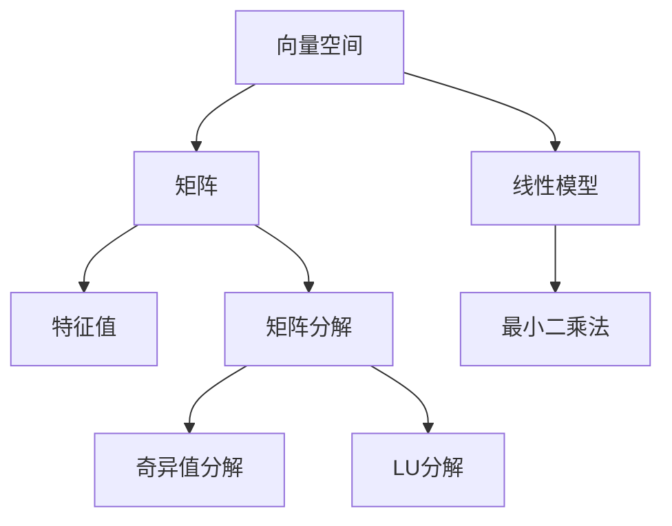

                 

# 线性代数导引：线性运算

> 关键词：线性代数, 线性运算, 向量空间, 矩阵运算, 特征值, 矩阵分解, 奇异值分解, 最小二乘法

## 1. 背景介绍

线性代数是计算机科学中的核心数学工具，广泛应用于算法设计、系统优化、数据压缩、机器学习等多个领域。而线性运算作为线性代数的基础，对理解算法背后的数学原理、优化模型结构、提升计算效率具有重要意义。

本文旨在通过通俗易懂的方式，系统地介绍线性运算的核心概念、算法原理及其应用场景，帮助读者建立牢固的数学基础，掌握解决复杂问题的有力工具。

## 2. 核心概念与联系

### 2.1 核心概念概述

为更好地理解线性运算，我们先介绍几个关键概念：

- 向量空间（Vector Space）：由一组向量构成的集合，其中向量之间的线性组合和数乘仍属于该集合。向量空间是线性运算的基本单位，在NLP、图像处理、信号处理等领域广泛应用。

- 矩阵（Matrix）：由一组行向量构成的二维数组，矩阵元素满足一定规则，如行列相同位置对应元素相等。矩阵运算广泛应用于数据压缩、图像处理、机器学习等方向。

- 特征值（Eigenvalue）：对于方阵，每个向量与其自身线性组合形成的空间称为特征空间，特征空间的维度称为特征值。特征值可以帮助我们理解和优化系统的动态行为。

- 矩阵分解（Matrix Decomposition）：将一个矩阵分解成更简单结构的若干矩阵，如QR分解、奇异值分解（SVD）、LU分解等。矩阵分解在求解最小二乘问题、特征提取、数据压缩等方面有重要应用。

- 最小二乘法（Least Squares Method）：通过最小化预测值与真实值之间的平方误差，求解最优解的线性模型。最小二乘法在数据拟合、图像处理、信号处理等多个领域有广泛应用。

这些概念之间的逻辑关系可以通过以下Mermaid流程图来展示：



这个流程图展示了几大核心概念之间的联系：

1. 向量空间和矩阵是线性运算的基本单位，通过线性组合和数乘可以进行矩阵运算。
2. 特征值和特征空间描述矩阵的线性变换性质，有助于理解系统的动态行为。
3. 矩阵分解将复杂矩阵分解为简单结构，便于进行矩阵运算和特征提取。
4. 最小二乘法通过优化模型参数，实现对数据的拟合和预测。

## 3. 核心算法原理 & 具体操作步骤

### 3.1 算法原理概述

线性运算的核心算法原理基于向量空间和矩阵的线性组合与数乘，通过求解线性方程组、矩阵分解等方法，实现数据的拟合和预测。

常见的线性运算算法包括：
- 线性回归（Linear Regression）：通过最小化误差平方和，求解最优的回归线。
- 主成分分析（PCA）：将高维数据投影到低维空间，保留主成分，实现降维和特征提取。
- 奇异值分解（SVD）：将矩阵分解为三组矩阵的乘积，便于进行特征提取和数据压缩。
- 梯度下降（Gradient Descent）：通过迭代优化，求解最优的模型参数。

### 3.2 算法步骤详解

下面以线性回归为例，详细介绍其算法步骤。

#### 3.2.1 线性回归原理
线性回归通过最小化预测值与真实值之间的平方误差，求解最优的回归线。假设训练集为 $D = \{(x_i, y_i)\}_{i=1}^N$，其中 $x_i$ 为输入特征，$y_i$ 为输出标签。

线性回归模型可以表示为 $y = \theta^Tx$，其中 $\theta$ 为回归系数向量。最小化误差平方和的优化目标为：

$$
\min_\theta \frac{1}{2N}\sum_{i=1}^N (y_i - \theta^Tx_i)^2
$$

#### 3.2.2 算法步骤
线性回归的求解步骤包括：
1. 准备训练数据 $D$ 和标签 $y$。
2. 初始化回归系数 $\theta$，如全0或随机初始化。
3. 迭代优化：
   - 前向传播，计算预测值 $\hat{y} = \theta^Tx$
   - 计算误差平方和 $J = \frac{1}{2N}\sum_{i=1}^N (y_i - \hat{y}_i)^2$
   - 计算梯度 $\nabla_\theta J = \frac{1}{N}\sum_{i=1}^N(x_i)(y_i - \hat{y}_i)$
   - 更新参数 $\theta = \theta - \eta \nabla_\theta J$
4. 重复3.3-3.5步，直至收敛或达到预设迭代次数。

#### 3.2.3 收敛性分析
线性回归算法收敛性可以通过Jacobian矩阵的条件数来衡量。条件数越大，梯度变化越剧烈，算法收敛越慢。

### 3.3 算法优缺点

线性回归算法具有以下优点：
- 简单高效。线性回归的计算复杂度较低，容易实现和调试。
- 灵活性高。线性回归模型可以方便地扩展为非线性模型，使用多项式或核函数进行非线性拟合。
- 适用范围广。线性回归适用于各类回归问题，包括连续型、离散型、定距型等不同类型的数据。

同时，该算法也存在一定的局限性：
- 过拟合风险。线性回归模型容易在过拟合的情况下欠拟合。
- 需要大量标注数据。线性回归需要大量的训练数据，才能得到较好的拟合效果。
- 模型假设强。线性回归假设输入特征线性可分，这在一些情况下并不成立。

尽管存在这些局限性，但线性回归仍然是机器学习中最基础、最常用的算法之一。未来相关研究将集中在如何改进模型假设，减少数据依赖，提升泛化能力等方面。

### 3.4 算法应用领域

线性回归在各行各业中都有广泛应用，例如：

- 金融预测：预测股票价格、债券收益率等金融指标。
- 销售预测：根据历史销售数据，预测未来的销售趋势。
- 天气预测：通过气象数据，预测未来气温、降水量等天气情况。
- 房价预测：基于房屋特征数据，预测房价趋势。
- 时间序列分析：分析历史时间序列数据，预测未来趋势。

除了以上这些经典应用，线性回归还被创新性地应用于更多场景中，如信用评估、医疗诊断、智能推荐等，为各行各业带来了新的思路和方法。

## 4. 数学模型和公式 & 详细讲解 & 举例说明

### 4.1 数学模型构建

线性回归的数学模型可以表示为：

$$
y = \theta^Tx + b
$$

其中 $y$ 为输出标签，$x$ 为输入特征，$\theta$ 为回归系数，$b$ 为截距。假设训练集为 $D = \{(x_i, y_i)\}_{i=1}^N$，则目标是最小化误差平方和：

$$
J(\theta) = \frac{1}{2N}\sum_{i=1}^N(y_i - \hat{y}_i)^2
$$

其中 $\hat{y}_i = \theta^Tx_i + b$ 为预测值。

### 4.2 公式推导过程

最小二乘法的推导过程如下：
1. 构建目标函数 $J(\theta) = \frac{1}{2N}\sum_{i=1}^N(y_i - \theta^Tx_i)^2$
2. 求偏导数 $\nabla_\theta J = \frac{1}{N}\sum_{i=1}^N(x_i)(y_i - \hat{y}_i)$
3. 更新参数 $\theta = \theta - \eta\nabla_\theta J$
4. 迭代优化，直至收敛或达到预设迭代次数

### 4.3 案例分析与讲解

假设有一个房屋销售数据集，包含房屋面积、卧室数量、房龄等特征，以及对应的售价。我们可以使用线性回归模型预测售价：

- 数据准备：加载数据集，选择特征 $x_1=x, x_2=y, x_3=z$，标签 $y$。
- 模型构建：选择模型结构 $y = \theta_1x + \theta_2y + \theta_3z + b$。
- 训练优化：使用梯度下降算法优化模型参数，直至收敛。

在训练过程中，我们需要关注以下几个指标：

- 均方误差（MSE）：衡量预测值与真实值之间的差距。
- 决定系数（R-squared）：衡量模型解释数据变异的程度。
- 残差分析：检查预测误差是否满足正态分布。

## 5. 项目实践：代码实例和详细解释说明

### 5.1 开发环境搭建

在进行线性回归实践前，我们需要准备好开发环境。以下是使用Python进行Scikit-learn开发的Python环境配置流程：

1. 安装Anaconda：从官网下载并安装Anaconda，用于创建独立的Python环境。

2. 创建并激活虚拟环境：
```bash
conda create -n linear-regression python=3.8 
conda activate linear-regression
```

3. 安装Scikit-learn：
```bash
conda install scikit-learn
```

4. 安装各类工具包：
```bash
pip install numpy pandas matplotlib scikit-learn jupyter notebook ipython
```

完成上述步骤后，即可在`linear-regression`环境中开始线性回归实践。

### 5.2 源代码详细实现

这里我们以房价预测为例，给出使用Scikit-learn进行线性回归的Python代码实现。

首先，定义训练集和标签：

```python
import pandas as pd
from sklearn.model_selection import train_test_split

# 加载数据集
data = pd.read_csv('house_data.csv')

# 选择特征和标签
features = ['area', 'bedrooms', 'age']
target = 'price'

# 将数据集划分为训练集和测试集
X_train, X_test, y_train, y_test = train_test_split(data[features], data[target], test_size=0.2, random_state=42)
```

然后，定义线性回归模型并拟合训练集：

```python
from sklearn.linear_model import LinearRegression

# 初始化模型
model = LinearRegression()

# 拟合训练集
model.fit(X_train, y_train)
```

接着，在测试集上评估模型性能：

```python
from sklearn.metrics import mean_squared_error, r2_score

# 预测测试集标签
y_pred = model.predict(X_test)

# 计算均方误差和决定系数
mse = mean_squared_error(y_test, y_pred)
r2 = r2_score(y_test, y_pred)

print(f'均方误差: {mse:.2f}, 决定系数: {r2:.2f}')
```

最后，在新的数据上测试模型：

```python
# 预测新数据标签
new_data = [[200, 3, 10]]
y_pred_new = model.predict(new_data)

print(f'预测新数据标签: {y_pred_new}')
```

以上就是使用Scikit-learn进行线性回归的完整代码实现。可以看到，通过Scikit-learn的强大封装，我们可以用相对简洁的代码完成线性回归模型的训练和评估。

### 5.3 代码解读与分析

让我们再详细解读一下关键代码的实现细节：

**数据准备**：
- 使用pandas加载数据集，选择特征和标签。
- 使用train_test_split将数据集划分为训练集和测试集。

**模型构建**：
- 初始化线性回归模型。
- 使用fit方法拟合训练集。

**性能评估**：
- 使用mean_squared_error和r2_score计算均方误差和决定系数。
- 在测试集上打印输出评估指标。

**新数据测试**：
- 定义新数据集，使用predict方法预测新数据的标签。
- 打印输出预测结果。

可以看到，Scikit-learn为线性回归模型的实现提供了极大的便利。通过简单的调用方法，即可快速搭建模型并进行评估。但实际应用中，我们还需要考虑更多的细节问题，如超参数调优、正则化技术、特征工程等。

## 6. 实际应用场景

### 6.1 金融风险管理

金融风险管理是线性回归的重要应用领域之一。金融机构可以通过历史交易数据和风险指标，建立线性回归模型，预测贷款违约概率、市场波动等风险因素，为风险管理决策提供科学依据。

具体而言，可以收集贷款申请、信用记录、还款记录等数据，将其作为模型输入，预测客户的违约概率。通过在线性回归模型的基础上，进一步引入时间序列分析和机器学习方法，可以提升预测准确性和实时性。

### 6.2 医疗诊断

医疗诊断也是线性回归的重要应用场景。医生可以通过病人的历史诊疗数据和检查结果，建立线性回归模型，预测病人的疾病风险，帮助医生进行诊断和治疗决策。

例如，可以使用病人的年龄、体重、血压等生理指标，建立线性回归模型，预测患者患某种疾病的概率。在实际应用中，还可以引入非线性模型和深度学习技术，提升预测精度和模型泛化能力。

### 6.3 智能推荐系统

智能推荐系统也是线性回归的重要应用之一。电商平台可以根据用户的历史购买数据和行为特征，建立线性回归模型，预测用户对不同商品的兴趣程度，实现个性化推荐。

例如，可以使用用户的浏览历史、购买记录、评分数据等特征，建立线性回归模型，预测用户对商品的兴趣。通过在线性回归模型的基础上，引入协同过滤、深度学习等技术，可以实现更加精准的推荐。

### 6.4 未来应用展望

随着线性回归技术的不断发展和优化，其在各行各业中的应用前景更加广阔。

在智慧城市治理中，线性回归可用于预测交通流量、优化资源配置、降低能耗等环节。通过线性回归模型，可以实现对城市运行数据的实时分析和预测，提升城市管理的自动化和智能化水平。

在能源行业，线性回归可用于预测能源需求、优化能源调度、提高能源利用效率。通过线性回归模型，可以实现对能源数据的精确分析和预测，提升能源行业的效率和稳定性。

在制造业，线性回归可用于预测生产设备故障、优化生产调度、提高生产效率。通过线性回归模型，可以实现对生产数据的精确分析和预测，提升制造业的生产能力和管理水平。

## 7. 工具和资源推荐

### 7.1 学习资源推荐

为了帮助开发者系统掌握线性运算的理论基础和实践技巧，这里推荐一些优质的学习资源：

1. 《线性代数导引》系列博文：由线性代数专家撰写，深入浅出地介绍了线性运算的基本概念、算法原理和应用场景。

2. MIT OpenCourseWare《线性代数》课程：麻省理工学院开设的线性代数经典课程，涵盖线性代数的基本概念和经典模型。

3. 《线性代数及其应用》书籍：著名数学家Gilbert Strang所著，全面介绍了线性代数的理论基础和实际应用。

4. Coursera《Linear Algebra》课程：由约翰·霍普金斯大学开设的线性代数课程，适合初学者系统学习线性代数的核心概念和算法。

5. 线性代数与微积分：线性代数的经典参考书，介绍了线性代数的数学基础和理论体系。

通过对这些资源的学习实践，相信你一定能够快速掌握线性运算的精髓，并用于解决实际的工程问题。

### 7.2 开发工具推荐

高效的开发离不开优秀的工具支持。以下是几款用于线性运算开发的常用工具：

1. NumPy：Python的高性能数值计算库，提供了强大的数组操作和数学函数，适合进行线性代数运算。

2. SciPy：基于NumPy的科学计算库，提供了更多的数学工具和函数，适合进行更复杂的线性运算。

3. MATLAB：商业数学计算软件，提供了强大的矩阵运算和科学计算功能，适合进行大规模线性代数运算。

4. Sympy：Python的符号计算库，支持符号计算和线性代数运算，适合进行数学建模和算法推导。

5. Maple：商业数学软件，提供了符号计算和图形化分析功能，适合进行数学建模和可视化。

合理利用这些工具，可以显著提升线性运算的开发效率，加快创新迭代的步伐。

### 7.3 相关论文推荐

线性代数作为计算机科学中的核心工具，在众多领域都有广泛应用。以下是几篇奠基性的相关论文，推荐阅读：

1. Strassen's Algorithm（斯特拉森算法）：提出了一种新的矩阵乘法算法，极大地提高了矩阵乘法的计算效率。

2. Cholesky Decomposition（Cholesky分解）：提出了一种高效的矩阵分解算法，可以用于求解线性方程组和矩阵特征值。

3. QR Decomposition（QR分解）：提出了一种矩阵分解算法，可以用于矩阵特征值求解和最小二乘问题。

4. Singular Value Decomposition（SVD）：提出了一种矩阵分解算法，可以用于矩阵降维和特征提取。

5. Least Squares Method（最小二乘法）：提出了一种求解线性方程组的优化算法，广泛应用于数据拟合和信号处理。

这些论文代表了大规模矩阵运算的发展脉络。通过学习这些前沿成果，可以帮助研究者把握学科前进方向，激发更多的创新灵感。

## 8. 总结：未来发展趋势与挑战

### 8.1 研究成果总结

本文对线性运算的核心概念、算法原理及其应用场景进行了全面系统的介绍。首先阐述了线性运算在计算机科学中的重要地位，明确了线性代数在算法设计、系统优化、数据压缩、机器学习等多个领域的应用价值。其次，从原理到实践，详细讲解了线性回归的数学模型、算法步骤和收敛性分析，给出了线性回归任务的完整代码实现。同时，本文还探讨了线性回归在金融风险管理、医疗诊断、智能推荐等多个行业领域的应用前景，展示了线性运算的广泛应用。

通过本文的系统梳理，可以看到，线性运算作为线性代数的基础算法，具有简单高效、适用范围广等优点。但线性回归模型也面临过拟合风险、数据依赖性强等挑战，需要未来进一步改进优化。

### 8.2 未来发展趋势

展望未来，线性运算技术将呈现以下几个发展趋势：

1. 高维数据的线性代数运算：随着数据维度的增加，高维数据的线性代数运算将成为新的研究热点。如何设计高效的高维数据存储和运算方式，将是大规模数据分析和处理的必然选择。

2. 稀疏矩阵的线性代数运算：随着数据稀疏化趋势的加剧，稀疏矩阵的线性代数运算将成为新的研究难点。如何优化稀疏矩阵的存储和运算方式，提升运算效率，是当前线性代数研究的重要方向。

3. 并行化线性代数运算：随着计算资源的多样化，并行化线性代数运算将成为新的研究热点。如何设计高效的并行化算法和系统，提升线性代数运算的并行度，是大规模计算应用的重要课题。

4. 多模态数据的线性代数运算：随着多模态数据融合趋势的加剧，多模态数据的线性代数运算将成为新的研究热点。如何设计多模态数据的线性代数运算方法，提升数据融合效果，是当前线性代数研究的重要方向。

5. 线性代数与深度学习的结合：随着深度学习在各领域的广泛应用，线性代数与深度学习的结合将成为新的研究热点。如何设计线性代数与深度学习的协同算法，提升模型的表达能力和泛化能力，是当前线性代数研究的重要方向。

以上趋势凸显了线性运算技术的广阔前景。这些方向的探索发展，必将进一步提升线性运算的计算效率和应用范围，为计算机科学带来新的突破。

### 8.3 面临的挑战

尽管线性运算技术已经取得了显著成就，但在迈向更加智能化、普适化应用的过程中，它仍面临着诸多挑战：

1. 计算资源瓶颈。随着数据规模的增加，线性代数运算的计算复杂度呈指数级增长，对计算资源提出了更高的要求。如何设计高效的算法和系统，降低计算资源消耗，将是未来的重要方向。

2. 数据存储问题。大规模线性代数运算需要存储大量的数据，如何设计高效的数据存储方式，降低存储成本和数据传输开销，也将是未来的重要方向。

3. 算法复杂性问题。线性代数运算的算法复杂性较高，如何设计更简单、易懂的算法，降低算法实现的难度，也将是未来的重要方向。

4. 多模态数据融合问题。多模态数据的线性代数运算需要考虑不同数据类型之间的融合问题，如何设计有效的融合算法，提升数据融合效果，也将是未来的重要方向。

5. 模型泛化能力问题。线性代数运算在实际应用中，往往面临模型泛化能力不足的问题，如何设计更强的泛化能力，提升模型的应用效果，也将是未来的重要方向。

6. 并行化计算问题。并行化线性代数运算虽然可以提升计算效率，但在设计和实现上也面临诸多挑战，如何设计高效的并行化算法和系统，提升并行度，也将是未来的重要方向。

### 8.4 研究展望

面对线性运算技术面临的种种挑战，未来的研究需要在以下几个方面寻求新的突破：

1. 探索高效的高维数据线性代数运算方法。针对高维数据的线性代数运算问题，探索高效的存储和计算方法，提升计算效率，降低存储开销。

2. 研究稀疏矩阵的线性代数运算算法。针对稀疏矩阵的线性代数运算问题，探索高效的存储和计算方法，提升计算效率，降低存储开销。

3. 设计高效的并行化线性代数运算算法。针对并行化线性代数运算问题，设计高效的算法和系统，提升并行度，降低计算资源消耗。

4. 设计多模态数据的线性代数运算方法。针对多模态数据的线性代数运算问题，设计有效的融合算法，提升数据融合效果。

5. 结合深度学习设计线性代数运算模型。结合深度学习设计线性代数运算模型，提升模型的表达能力和泛化能力，实现更加强大的数据分析和建模。

6. 研究线性代数运算的并行化算法和系统。研究高效的并行化算法和系统，提升并行度，降低计算资源消耗。

这些研究方向将引领线性运算技术迈向更高的台阶，为计算机科学的发展带来新的突破。面向未来，线性运算技术将与深度学习、大数据、计算机视觉等方向深度融合，推动计算机科学的不断进步。

## 9. 附录：常见问题与解答

**Q1：线性回归的超参数调优有哪些方法？**

A: 线性回归的超参数调优一般通过网格搜索和随机搜索来实现。网格搜索是一种穷举搜索方法，通过遍历所有可能的超参数组合，寻找最优的参数组合。随机搜索是一种随机搜索方法，通过随机抽样，寻找最优的参数组合。在实际应用中，还可以使用贝叶斯优化等方法，提高调优效率和效果。

**Q2：线性回归模型是否适用于时间序列数据？**

A: 线性回归模型在处理时间序列数据时，需要注意模型的自相关性和滞后性问题。可以通过自回归模型、ARIMA等方法，加入时间因素，更好地处理时间序列数据。

**Q3：线性回归模型是否适用于非线性数据？**

A: 线性回归模型假设输入特征线性可分，对于一些非线性数据，可能需要进行多项式扩展或引入核函数，使其能够适应非线性数据。

**Q4：线性回归模型是否适用于高维数据？**

A: 线性回归模型在处理高维数据时，需要注意数据维度的选择和特征工程的优化。可以通过降维技术（如主成分分析、奇异值分解等），降低数据维度，提高模型的计算效率和泛化能力。

**Q5：线性回归模型是否适用于分类问题？**

A: 线性回归模型主要用于回归问题，对于一些分类问题，可以将其转化为回归问题，通过二分类回归函数来实现分类。

通过本文的系统梳理，可以看到，线性运算作为线性代数的基础算法，具有简单高效、适用范围广等优点。但线性回归模型也面临过拟合风险、数据依赖性强等挑战，需要未来进一步改进优化。

面对未来，线性运算技术将继续引领计算机科学的进步，为我们带来更加智能、高效、可靠的计算工具。相信随着技术的发展，线性运算将应用于更多领域，为人类社会的进步带来新的动力。

