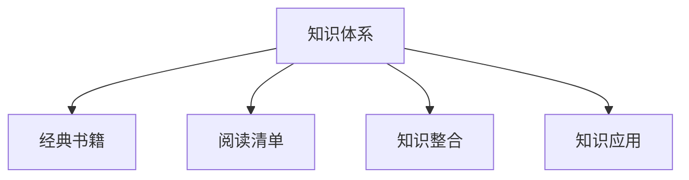

                 

# 经典书籍:管理者构建知识体系的基石

> 关键词：管理书籍,知识体系构建,企业管理,商业思维,阅读清单

## 1. 背景介绍

### 1.1 问题由来
在当今这个信息爆炸的时代，知识更新换代的速度越来越快，管理者面临着前所未有的挑战。如何构建一个高效的知识体系，快速适应环境变化，是每一个管理者必须面对的问题。经典书籍作为人类智慧的结晶，提供了一种经过时间考验的知识获取和思维训练的方式。然而，如何高效阅读和管理这些书籍，让知识真正转化为管理实践，是一个需要深入探讨的话题。

### 1.2 问题核心关键点
本文聚焦于管理者如何构建知识体系，通过经典书籍作为知识载体，实现个人和团队的持续成长。在构建知识体系的过程中，需要考虑以下几个核心关键点：

1. **选择合适的书籍**：不是所有的书籍都适合作为知识体系的构建材料，管理者需要根据自身和团队的需要，选择高质量、有价值的书籍。
2. **有效的阅读方法**：阅读效率和深度是知识体系构建的关键因素，管理者需要掌握有效的阅读技巧和工具。
3. **知识整合与应用**：将知识体系转化为实际的管理实践，需要系统化的思考和应用，管理者需要学会如何将知识落地。
4. **持续更新与反馈**：知识体系不是一成不变的，管理者需要定期回顾和更新，同时获取反馈以优化知识体系。

### 1.3 问题研究意义
构建知识体系对于管理者的成长和团队的进步具有重要意义：

1. **提升决策质量**：基于高质量知识体系的决策，更能适应环境变化，减少决策失误。
2. **加速团队成长**：通过分享和应用知识体系，加速团队成员的成长，提升团队的整体能力。
3. **增强竞争力**：掌握先进的商业思维和企业管理方法，提升企业在市场中的竞争力。
4. **促进创新**：知识体系中的新思想和实践，能激发创新，推动组织变革。

## 2. 核心概念与联系

### 2.1 核心概念概述

为了更好地理解如何构建知识体系，本文将介绍几个密切相关的核心概念：

- **知识体系**：指的是由多个知识点和知识间联系组成的系统，用于解决特定问题或提升特定能力。
- **经典书籍**：经过时间验证，具有深远影响的书籍，提供了系统的知识框架和思维方法。
- **阅读清单**：根据知识体系构建的需要，精心筛选的书籍列表。
- **知识整合**：将分散的知识点通过某种逻辑结构关联起来，形成完整的知识体系。
- **知识应用**：将知识体系中的理论和方法，应用于实际的管理实践中，解决实际问题。

这些核心概念之间的逻辑关系可以通过以下Mermaid流程图来展示：



这个流程图展示了这个逻辑链条，即通过经典书籍构建知识体系，通过阅读清单选择合适的书籍，通过知识整合形成完整的体系，最终应用于实际管理中。

## 3. 核心算法原理 & 具体操作步骤
### 3.1 算法原理概述

管理者构建知识体系的过程，本质上是通过经典书籍作为载体，系统性地学习、整合和应用知识的过程。其核心思想是：

1. **选择与精读**：根据知识体系构建的需要，选择合适的经典书籍，并进行深度阅读。
2. **知识整合**：将书籍中的知识通过逻辑结构关联起来，形成完整的知识体系。
3. **应用实践**：将知识体系中的理论和方法，应用于实际的管理实践中，解决实际问题。

### 3.2 算法步骤详解

构建知识体系的主要步骤包括：

**Step 1: 选择与精读经典书籍**
- 根据知识体系构建的需要，筛选高质量的经典书籍。
- 制定阅读计划，设定每次阅读的目标和重点。
- 深度阅读书籍，记录重点内容和思考。

**Step 2: 设计知识架构**
- 根据阅读的内容，设计知识架构，如树状结构、图状结构等。
- 确定各个知识点的关联关系，如因果关系、上下位关系等。
- 定义知识点的关键概念和术语，确保一致性和规范性。

**Step 3: 知识整合与系统化**
- 将零散的知识点通过逻辑结构关联起来，形成完整的知识体系。
- 使用思维导图、概念图等工具，帮助可视化知识结构。
- 确保知识体系的逻辑连贯性，避免冗余和冲突。

**Step 4: 知识应用与实践**
- 将知识体系中的理论和方法，应用于实际的管理实践中。
- 定期回顾和反思，评估知识体系的有效性。
- 根据实际反馈，调整和优化知识体系。

### 3.3 算法优缺点

构建知识体系的方法具有以下优点：
1. 系统化学习：通过系统化的阅读和整合，提高学习的效率和深度。
2. 结构化思考：有助于形成结构化的思维模式，提升决策质量。
3. 应用导向：通过实际应用，提升知识的实用性和落地能力。

同时，该方法也存在一定的局限性：
1. 需要大量时间和精力：构建知识体系是一个耗时耗力的过程，需要管理者有较强的自律和耐心。
2. 知识体系容易过时：环境变化快，知识体系需要定期更新以保持时效性。
3. 应用复杂度较高：将知识体系应用于实际管理中，需要高度的抽象和实践能力。
4. 实践难度较大：有些知识可能难以直接应用于实际管理中，需要更多的创新和实践。

尽管存在这些局限性，但就目前而言，构建知识体系仍然是管理者提升个人和团队能力的重要手段。未来相关研究的重点在于如何进一步降低构建知识体系的时间和成本，提高知识的实时性和实用性，同时兼顾应用复杂度和创新性等因素。

### 3.4 算法应用领域

构建知识体系的方法在企业管理中具有广泛的应用，覆盖了从战略规划、人力资源管理、市场营销到财务管理等多个领域，具体如下：

- **战略规划**：通过构建知识体系，理解行业趋势和竞争格局，制定科学合理的战略规划。
- **人力资源管理**：通过知识体系提升团队成员的能力和素质，优化人才结构和培养机制。
- **市场营销**：通过知识体系掌握市场分析方法和消费者行为规律，制定有效的市场策略。
- **财务管理**：通过知识体系掌握财务分析方法和管理工具，提升财务决策水平。
- **运营管理**：通过知识体系提升运营效率和流程优化，实现精益管理。

## 4. 数学模型和公式 & 详细讲解 & 举例说明

### 4.1 数学模型构建

本节将使用数学语言对管理者构建知识体系的过程进行更加严格的刻画。

假设管理者构建的知识体系由 $N$ 个知识点 $K_1, K_2, ..., K_N$ 组成，每个知识点 $K_i$ 包含 $n_i$ 个知识子点 $k_{i1}, k_{i2}, ..., k_{in_i}$。知识体系中的每个知识点 $K_i$ 通过 $m_i$ 个关系 $R_{ij}$ 与其他知识点相连，形成一个图状结构 $G=(K, R)$，其中 $K$ 是知识点集合，$R$ 是关系集合。

### 4.2 公式推导过程

以下我们以一个简单的例子来说明知识体系构建的数学模型：

假设管理者正在构建一个关于“领导力”的知识体系，其中包括以下几个知识点：

- 知识点1：愿景与战略
  - 子知识点1.1：愿景设定
  - 子知识点1.2：战略规划
  - 关系1：愿景与战略关系

- 知识点2：人力资源
  - 子知识点2.1：人才招聘
  - 子知识点2.2：员工培训
  - 关系2：人力资源与领导力关系

- 知识点3：市场营销
  - 子知识点3.1：市场分析
  - 子知识点3.2：品牌建设
  - 关系3：市场营销与领导力关系

根据上述知识点和关系，可以构建一个图状知识体系：

$$
G = (K, R)
$$

其中 $K$ 为知识点集合：

$$
K = \{K_1, K_2, K_3\}
$$

$R$ 为关系集合：

$$
R = \{R_{11}, R_{12}, R_{21}, R_{22}, R_{31}, R_{32}\}
$$

每个关系 $R_{ij}$ 可以表示为：

$$
R_{ij} = \{K_i, K_j\}
$$

例如，愿景与战略关系可以表示为：

$$
R_{11} = \{K_1, K_2\}
$$

### 4.3 案例分析与讲解

接下来，我们通过一个实际案例来展示如何使用数学模型进行知识体系的构建和应用。

假设某企业正在构建“客户关系管理(CRM)”的知识体系，包括以下几个知识点：

- 知识点1：CRM概述
  - 子知识点1.1：CRM概念
  - 子知识点1.2：CRM功能
  - 关系1：CRM概述与概念关系
  - 关系2：CRM概述与功能关系

- 知识点2：CRM实施
  - 子知识点2.1：CRM平台选择
  - 子知识点2.2：CRM流程设计
  - 关系3：CRM概述与实施关系
  - 关系4：CRM实施与功能关系

- 知识点3：CRM优化
  - 子知识点3.1：CRM数据分析
  - 子知识点3.2：CRM反馈机制
  - 关系5：CRM概述与优化关系
  - 关系6：CRM优化与功能关系

构建的知识体系可以表示为：

$$
G = (K, R)
$$

其中 $K$ 为知识点集合：

$$
K = \{K_1, K_2, K_3\}
$$

$R$ 为关系集合：

$$
R = \{R_{11}, R_{12}, R_{13}, R_{21}, R_{22}, R_{23}, R_{31}, R_{32}, R_{33}\}
$$

例如，CRM概述与概念关系可以表示为：

$$
R_{11} = \{K_1, K_1.1\}
$$

构建的知识体系可以通过逻辑结构图或思维导图进行可视化展示，帮助管理者清晰地理解各个知识点和关系。

## 5. 项目实践：代码实例和详细解释说明

### 5.1 开发环境搭建

在进行知识体系构建的实践前，我们需要准备好开发环境。以下是使用Python进行知识图谱构建的环境配置流程：

1. 安装Anaconda：从官网下载并安装Anaconda，用于创建独立的Python环境。

2. 创建并激活虚拟环境：
```bash
conda create -n knowledge-env python=3.8 
conda activate knowledge-env
```

3. 安装相关库：
```bash
pip install networkx matplotlib
```

完成上述步骤后，即可在`knowledge-env`环境中开始知识体系构建的实践。

### 5.2 源代码详细实现

下面我们将展示如何使用Python的NetworkX库构建知识图谱。

```python
import networkx as nx
import matplotlib.pyplot as plt

# 创建知识图谱
G = nx.Graph()
G.add_node('愿景与战略', label='愿景与战略')
G.add_node('人力资源', label='人力资源')
G.add_node('市场营销', label='市场营销')
G.add_edge('愿景与战略', '人力资源', label='愿景与战略关系')
G.add_edge('愿景与战略', '市场营销', label='市场营销关系')
G.add_edge('人力资源', '市场营销', label='人力资源关系')

# 可视化知识图谱
nx.draw(G, with_labels=True, node_size=2000, node_color='skyblue', edge_color='k')
plt.show()
```

在上述代码中，我们使用NetworkX库创建了一个简单的知识图谱，并使用Matplotlib库进行了可视化展示。

### 5.3 代码解读与分析

让我们再详细解读一下关键代码的实现细节：

**创建知识图谱**：
- 使用`nx.Graph()`创建知识图谱对象。
- 使用`G.add_node()`添加节点，并指定节点标签。
- 使用`G.add_edge()`添加边，并指定边标签。

**可视化知识图谱**：
- 使用`nx.draw()`函数将知识图谱可视化。
- 使用`with_labels=True`添加节点标签。
- 使用`node_size=2000`指定节点大小。
- 使用`node_color='skyblue'`指定节点颜色。
- 使用`edge_color='k'`指定边颜色。

可以看到，通过Python的NetworkX库，我们可以轻松构建和可视化知识图谱。开发者可以将更多精力放在知识图谱的设计和应用上，而不必过多关注底层的实现细节。

当然，工业级的系统实现还需考虑更多因素，如节点和边的属性存储、图谱的动态更新、图谱的查询与分析等。但核心的知识体系构建过程基本与此类似。

## 6. 实际应用场景

### 6.1 企业战略规划

企业战略规划是管理者构建知识体系的重要应用场景之一。通过构建“战略规划”知识体系，管理者可以系统性地理解行业趋势、竞争格局和市场机会，制定科学合理的战略规划。

在实践中，可以收集行业报告、市场调研、竞争对手分析等数据，提取关键战略要素和指标，构建“战略规划”知识体系。将知识体系应用于实际战略规划时，可以根据市场变化和内部资源，动态调整战略规划，确保战略的适应性和有效性。

### 6.2 人力资源管理

人力资源管理是管理者构建知识体系的另一重要应用场景。通过构建“人力资源管理”知识体系，管理者可以系统性地理解人才管理、招聘、培训、绩效等关键环节，提升人力资源管理的效率和质量。

在实践中，可以收集员工反馈、绩效数据、培训记录等，提取关键人力资源管理要素和流程，构建“人力资源管理”知识体系。将知识体系应用于实际人力资源管理时，可以根据反馈和绩效数据，动态调整人力资源管理策略，提升团队成员的满意度和工作效率。

### 6.3 市场营销

市场营销是管理者构建知识体系的典型应用场景之一。通过构建“市场营销”知识体系，管理者可以系统性地理解市场分析、消费者行为、品牌建设等关键环节，制定有效的市场策略。

在实践中，可以收集市场调研数据、消费者行为数据、品牌建设记录等，提取关键市场营销要素和策略，构建“市场营销”知识体系。将知识体系应用于实际市场营销时，可以根据市场变化和消费者反馈，动态调整市场营销策略，提升市场响应速度和效果。

### 6.4 财务管理

财务管理是管理者构建知识体系的重要应用场景之一。通过构建“财务管理”知识体系，管理者可以系统性地理解财务分析、成本控制、预算管理等关键环节，提升财务决策水平。

在实践中，可以收集财务报表、成本数据、预算记录等，提取关键财务管理要素和工具，构建“财务管理”知识体系。将知识体系应用于实际财务管理时，可以根据财务数据和市场变化，动态调整财务策略，提升财务决策的科学性和准确性。

### 6.5 未来应用展望

随着知识体系的不断完善和应用，管理者将在更多领域实现数字化和智能化管理，具体如下：

1. **智能决策**：通过知识体系的支持，管理者可以更快地进行决策分析，减少决策失误。
2. **数据驱动**：知识体系中的数据和分析方法，可以更好地驱动管理决策，提升决策效率和质量。
3. **知识共享**：知识体系的构建和应用，可以提升团队的知识共享水平，促进团队的协同合作。
4. **组织变革**：通过知识体系的持续优化，推动组织变革，提升组织的核心竞争力。

## 7. 工具和资源推荐

### 7.1 学习资源推荐

为了帮助管理者系统掌握知识体系的构建方法，这里推荐一些优质的学习资源：

1. **《深度学习》课程**：斯坦福大学开设的深度学习课程，全面介绍深度学习的理论和实践，涵盖计算机视觉、自然语言处理等多个领域。

2. **《管理学》教材**：经典的管理学教材，如《管理学原理》、《组织行为学》等，提供系统的管理理论和实践方法。

3. **《数据科学入门》课程**：Coursera上的数据科学入门课程，涵盖数据收集、数据处理、数据分析等多个环节，提供全面的数据科学知识体系。

4. **《知识管理》教材**：介绍知识管理的基本概念、方法和工具的书籍，如《知识管理的艺术与科学》等。

5. **《知识图谱》教材**：介绍知识图谱的基本概念、构建方法和应用场景的书籍，如《知识图谱：构建与运用》等。

通过这些资源的学习实践，相信你一定能够系统掌握知识体系的构建方法和技巧，并将这些知识应用于实际的管理实践中。

### 7.2 开发工具推荐

高效的开发离不开优秀的工具支持。以下是几款用于知识体系构建开发的常用工具：

1. **Jupyter Notebook**：免费的在线Jupyter Notebook环境，方便开发者快速迭代和共享学习笔记。

2. **Python代码编辑器**：如PyCharm、VS Code等，支持代码调试和自动化测试。

3. **项目管理工具**：如Trello、Jira等，支持任务管理和进度跟踪。

4. **可视化工具**：如Tableau、Power BI等，支持数据可视化和报表生成。

5. **知识管理软件**：如Confluence、Notion等，支持知识文档的共享和协作。

合理利用这些工具，可以显著提升知识体系构建的开发效率，加快创新迭代的步伐。

### 7.3 相关论文推荐

知识体系的构建和应用源于学界的持续研究。以下是几篇奠基性的相关论文，推荐阅读：

1. **《知识图谱的构建与演化》**：介绍知识图谱的基本概念、构建方法和应用场景的论文。

2. **《基于知识图谱的企业战略管理》**：探讨知识图谱在企业战略管理中的应用，提升战略决策的科学性和系统性。

3. **《数据驱动的组织变革》**：介绍数据科学在组织变革中的应用，提升组织的数据驱动能力和决策水平。

4. **《知识图谱在人力资源管理中的应用》**：探讨知识图谱在人力资源管理中的应用，提升人力资源管理的效率和质量。

5. **《基于知识图谱的市场营销管理》**：介绍知识图谱在市场营销中的应用，提升市场营销的精准性和效果。

这些论文代表了大数据和人工智能技术在知识体系构建中的应用方向，为知识体系的构建提供了理论和方法支持。

## 8. 总结：未来发展趋势与挑战

### 8.1 研究成果总结

本文对管理者构建知识体系的过程进行了全面系统的介绍。首先阐述了知识体系构建的背景和意义，明确了知识体系构建在提升决策质量、加速团队成长、增强竞争力等方面的重要作用。其次，从原理到实践，详细讲解了知识体系构建的数学模型和操作步骤，给出了知识体系构建的完整代码实例。同时，本文还广泛探讨了知识体系在企业管理中的应用前景，展示了知识体系构建的广阔前景。最后，精选了知识体系的各类学习资源，力求为管理者提供全方位的技术指引。

通过本文的系统梳理，可以看到，管理者构建知识体系对于提升个人和团队能力具有重要意义。知识体系的构建不仅需要系统的理论和方法，还需要实际应用中的不断优化和更新。未来，伴随大数据和人工智能技术的发展，知识体系构建将更加智能化、系统化，为管理者的成长和团队的进步提供更加坚实的保障。

### 8.2 未来发展趋势

展望未来，知识体系构建将呈现以下几个发展趋势：

1. **智能化知识管理**：随着大数据和人工智能技术的发展，知识体系构建将更加智能化，通过自然语言处理、机器学习等技术，实现知识自动生成和推荐。

2. **实时化知识更新**：知识体系构建将更加实时化，通过数据流和知识流技术，实现知识体系的动态更新和演化。

3. **多模态知识整合**：知识体系构建将更加多模态化，通过图像、视频、语音等多模态数据的整合，提升知识的表达和应用能力。

4. **协作化知识共享**：知识体系构建将更加协作化，通过社交网络和协作平台，实现知识的共享和协作。

5. **情境化知识应用**：知识体系构建将更加情境化，通过情境感知和情境推理技术，实现知识在特定情境下的灵活应用。

以上趋势凸显了知识体系构建技术的广阔前景。这些方向的探索发展，必将进一步提升知识体系的效率和实用性，为管理者的成长和团队的进步提供更加坚实的保障。

### 8.3 面临的挑战

尽管知识体系构建已经取得了瞩目成就，但在迈向更加智能化、系统化应用的过程中，它仍面临着诸多挑战：

1. **知识体系构建的复杂性**：构建知识体系需要系统化的理论和方法，涉及多个领域和多个环节，具有较高的复杂性和难度。

2. **知识体系的动态性**：环境变化快，知识体系需要动态更新以保持时效性，这需要大量的资源和时间投入。

3. **知识体系的实用性和落地性**：知识体系需要实际应用中的不断优化和更新，但实际应用中的复杂性和变化性，可能影响知识体系的实用性和落地性。

4. **知识体系的可扩展性**：知识体系需要支持多领域、多层次、多模态的知识整合和应用，这需要更高的可扩展性和灵活性。

5. **知识体系的共享与协作**：知识体系需要支持团队成员的共享与协作，但不同成员的知识水平和理解能力可能存在差异，影响知识体系的共享效果。

正视知识体系构建面临的这些挑战，积极应对并寻求突破，将是大数据和人工智能技术走向成熟的必由之路。相信随着学界和产业界的共同努力，这些挑战终将一一被克服，知识体系构建必将在构建知识型组织、推动组织变革中扮演越来越重要的角色。

### 8.4 研究展望

面对知识体系构建所面临的种种挑战，未来的研究需要在以下几个方面寻求新的突破：

1. **智能化知识图谱**：引入人工智能技术，提升知识图谱的自动生成和推荐能力，降低知识体系构建的复杂性。

2. **实时化知识流**：引入实时数据流技术，实现知识体系的动态更新和演化，提升知识体系的实时性和实用性。

3. **多模态知识整合**：引入多模态数据融合技术，提升知识的表达和应用能力，提升知识体系的丰富性和多样性。

4. **协作化知识共享**：引入社交网络和协作平台技术，提升知识的共享和协作能力，提升知识体系的协作性和效率。

5. **情境化知识应用**：引入情境感知和情境推理技术，提升知识在特定情境下的灵活应用能力，提升知识体系的实用性和落地性。

6. **知识体系的伦理与安全**：引入知识体系的伦理和安全机制，确保知识体系的公平、公正和安全，提升知识体系的可信性和可控性。

这些研究方向的探索，必将引领知识体系构建技术迈向更高的台阶，为管理者的成长和团队的进步提供更加坚实的保障。面向未来，知识体系构建技术还需要与其他人工智能技术进行更深入的融合，如知识表示、因果推理、强化学习等，多路径协同发力，共同推动知识型组织的进步和组织变革的发展。

## 9. 附录：常见问题与解答

**Q1：构建知识体系是否需要大量时间和精力？**

A: 是的，构建知识体系是一个耗时耗力的过程，需要管理者有较强的自律和耐心。但是，通过系统化的学习和应用，可以显著提升管理者的工作效率和决策质量，长远来看，时间上的投入是值得的。

**Q2：如何选择合适的经典书籍？**

A: 根据知识体系构建的需要，选择高质量的经典书籍。可以参考其他专家的推荐，如管理领域的《管理学》、金融领域的《证券分析》等。同时，可以通过阅读书籍的摘要和目录，评估其内容是否符合知识体系构建的需要。

**Q3：如何设计知识架构？**

A: 根据阅读的内容，设计知识架构，如树状结构、图状结构等。可以使用思维导图、概念图等工具，帮助可视化知识结构。确保知识结构的逻辑连贯性，避免冗余和冲突。

**Q4：如何将知识体系应用于实际管理中？**

A: 将知识体系中的理论和方法，应用于实际的管理实践中，解决实际问题。可以根据反馈和绩效数据，动态调整知识体系，提升知识体系的实用性和落地性。

**Q5：如何应对知识体系的动态性？**

A: 知识体系需要动态更新以保持时效性，可以通过持续学习、定期回顾和反馈机制，确保知识体系的实时性和实用性。同时，引入数据流和知识流技术，实现知识体系的动态更新和演化。

---

作者：禅与计算机程序设计艺术 / Zen and the Art of Computer Programming

