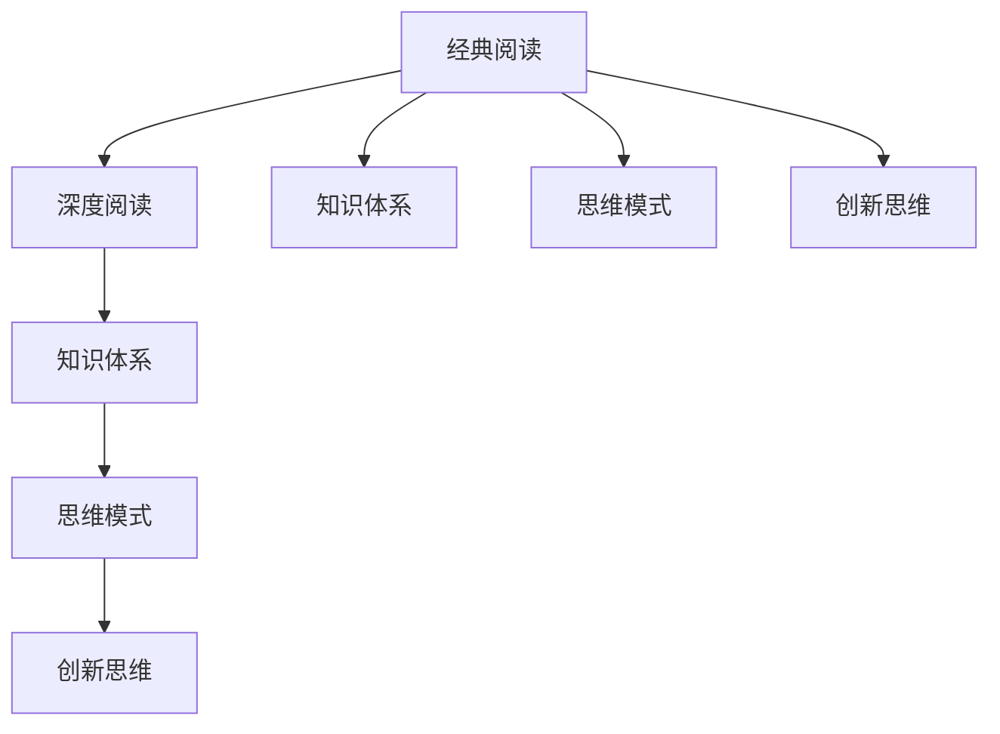

                 

# 经典阅读:夯实认知的必由之路

## 1. 背景介绍

在科技飞速发展的今天，经典阅读成为了一种获取知识、开拓视野的重要方式。无论是学术论文还是技术书籍，都能为我们提供深入理解问题、掌握前沿技术的宝贵信息。本文将探讨经典阅读对认知和思维的影响，介绍如何通过阅读经典著作来夯实认知的必由之路。

### 1.1 问题由来

随着互联网的普及，信息获取变得越来越便捷。但与此同时，浅阅读、碎片化阅读的现象也愈发严重，许多人很难深入理解某个领域的知识体系。而经典阅读，恰好能够帮助我们克服这一问题，通过深度阅读经典书籍，逐步建立和巩固自己的知识框架。

### 1.2 问题核心关键点

经典阅读之所以能夯实认知，主要有以下几点原因：

1. **深度阅读**：经典阅读要求读者在一定时间内专注于某本或几本书籍，进行深度思考和理解。
2. **结构性**：经典著作往往具有完整的结构性，有助于读者构建系统的知识体系。
3. **长远影响**：经典阅读提供的不仅仅是知识，更是一种思维方式和价值观的传承。
4. **激发创新**：阅读经典能够激发读者的创新思维，促使其产生新的思想和实践。

## 2. 核心概念与联系

### 2.1 核心概念概述

为更好地理解经典阅读对认知的影响，本节将介绍几个密切相关的核心概念：

- **经典阅读**：指深入阅读具有高度价值和影响力的经典著作，包括但不限于学术论文、技术书籍、哲学作品等。
- **深度阅读**：相对于浅阅读，深度阅读强调系统地、持续地阅读，达到对知识的深入理解和掌握。
- **知识体系**：指的是一个领域内的知识组成结构，包括核心概念、理论、实践等。
- **思维模式**：经典阅读能够培养读者的思维方式，如逻辑推理、批判性思考等。
- **创新思维**：经典阅读激发读者提出新问题、新方法，推动知识的创新和应用。

这些核心概念之间的逻辑关系可以通过以下Mermaid流程图来展示：



这个流程图展示了一系列由经典阅读产生的逻辑过程，从深度阅读开始，逐步建立起系统的知识体系、培养批判性思维，并激发创新思维。

## 3. 核心算法原理 & 具体操作步骤

### 3.1 算法原理概述

经典阅读的算法原理主要基于知识图谱的构建和认知结构的形成。知识图谱是一种结构化的知识表示方法，通过节点和边的关系来表达实体和概念之间的联系。认知结构则是一种心理模型，描述了人们如何理解和处理信息。经典阅读通过知识图谱的构建，帮助读者理解、整合和应用知识，形成稳定的认知结构。

### 3.2 算法步骤详解

经典阅读的算法步骤主要包括以下几个关键步骤：

**Step 1: 选择阅读材料**
- 选择与自己研究领域或兴趣相关的经典著作。可以通过图书馆、在线数据库等途径获取。

**Step 2: 制定阅读计划**
- 设定每次阅读的时间、地点和目标。保持定期的阅读习惯，逐步深入。

**Step 3: 进行深度阅读**
- 阅读时，需进行笔记、摘要和思考，理解作者的观点和论证过程。
- 对书中重要的概念、理论进行归纳总结，形成思维导图或笔记。

**Step 4: 应用实践**
- 将读到的知识应用到实际问题中，如编写代码实现算法、撰写论文等。
- 通过实践，检验和深化对知识的理解。

**Step 5: 反馈迭代**
- 通过反馈和迭代，不断完善认知结构和知识体系。
- 对实践中的问题进行反思，进一步加深对经典阅读的理解。

### 3.3 算法优缺点

经典阅读的算法优点包括：

1. **系统性**：通过深度阅读，读者可以系统地掌握某一领域的知识体系。
2. **深度理解**：经典阅读有助于理解知识的核心原理和应用场景。
3. **长远影响**：经典著作中的思想和价值观对读者的长期认知和思维有深远影响。
4. **创新激发**：经典阅读能激发读者提出新问题和新方法，推动知识创新。

经典阅读的算法缺点包括：

1. **时间成本高**：深度阅读经典著作需要大量时间和精力投入。
2. **可操作性差**：并非所有经典著作都适合深入阅读，尤其是一些过于复杂或过时的内容。
3. **实践应用难**：部分经典著作的理论性较强，难以直接应用于实际问题中。

### 3.4 算法应用领域

经典阅读的应用领域广泛，包括但不限于：

- 学术研究：通过阅读经典学术著作，掌握本领域的核心概念和方法。
- 软件开发：通过阅读经典技术书籍，理解算法和架构设计原理。
- 哲学思考：通过阅读经典哲学作品，理解人类价值和思维本质。
- 企业管理：通过阅读经典管理书籍，学习领导力和组织管理技巧。
- 教育教学：通过阅读经典教育著作，提升教学水平和教育理念。

## 4. 数学模型和公式 & 详细讲解 & 举例说明

### 4.1 数学模型构建

经典阅读的数学模型主要基于知识图谱的构建。知识图谱的节点表示实体或概念，边表示实体之间的关系，如“作者-书籍”、“书籍-主题”、“概念-概念”等。数学模型可以用图表示：

$$ G=(V,E) $$

其中 $V$ 为节点集合，$E$ 为边集合。每个节点和边都有一个属性表示其特性，如书籍的出版年份、作者的背景等。

### 4.2 公式推导过程

以知识图谱中的“书籍-主题”关系为例，其数学模型可以表示为：

$$ G=(V,E) $$

其中 $V=\{b_i\}_{i=1}^n$ 为书籍节点集合，$E=\{(b_j,b_k)\}_{j=1,k=1}^n$ 为边集合。边 $(b_j,b_k)$ 表示书籍 $b_j$ 和书籍 $b_k$ 的主题相似度，可以计算为：

$$ sim(b_j,b_k) = \frac{\sum_{i=1}^n w_{i,j}w_{i,k}}{\sqrt{\sum_{i=1}^n w_{i,j}^2}\sqrt{\sum_{i=1}^n w_{i,k}^2}} $$

其中 $w_{i,j}$ 和 $w_{i,k}$ 分别为书籍 $b_j$ 和 $b_k$ 中关于主题 $i$ 的权重。

### 4.3 案例分析与讲解

以《算法导论》（Introduction to Algorithms）为例，该书是计算机科学领域的经典著作。通过阅读这本书，读者可以理解算法设计和分析的基本原理，掌握常用的算法和数据结构。

- **深度阅读**：细致阅读每一章，理解核心概念，如递归、分治、动态规划等。
- **知识体系**：构建自己的算法知识图谱，记录算法的基本思想、应用场景和代码实现。
- **思维模式**：培养算法思维，学会从问题入手，逐步抽象出算法模型。
- **创新思维**：结合实际问题，应用书中算法解决实际问题，如数据结构优化、算法优化等。

## 5. 项目实践：代码实例和详细解释说明

### 5.1 开发环境搭建

要进行经典阅读的实践，需要搭建合适的开发环境。以下是使用Python进行经典阅读实践的环境配置流程：

1. 安装Anaconda：从官网下载并安装Anaconda，用于创建独立的Python环境。

2. 创建并激活虚拟环境：
```bash
conda create -n classical-env python=3.8 
conda activate classical-env
```

3. 安装必要的工具包：
```bash
pip install pandas numpy matplotlib jupyter notebook ipython
```

完成上述步骤后，即可在`classical-env`环境中进行经典阅读实践。

### 5.2 源代码详细实现

这里以《算法导论》为例，展示如何使用Python和Jupyter Notebook进行经典阅读实践。

首先，定义数据集和阅读计划：

```python
import pandas as pd

# 定义数据集
books = pd.read_csv('books.csv')
books.head()

# 定义阅读计划
reading_plan = {
    '书名': ['算法导论'],
    '作者': ['Thomas H. Cormen, Charles E. Leiserson, Ronald L. Rivest, Clifford Stein'],
    '日期': ['2023-04-01', '2023-04-07', '2023-04-14', '2023-04-21', '2023-04-28'],
    '阅读时间': ['每天2小时']
}
```

然后，进行深度阅读和笔记整理：

```python
# 进行深度阅读
def read_book(book, plan):
    for date, time in zip(plan['日期'], plan['阅读时间']):
        start_time = datetime.strptime(date, '%Y-%m-%d')
        end_time = start_time + timedelta(hours=int(time))
        print(f'阅读 {book}，时间：{start_time.strftime("%H:%M")} 到 {end_time.strftime("%H:%M")}')
        with open(f'{book}.txt', 'r') as f:
            for line in f:
                print(line.strip())
        print('\n')

# 进行笔记整理
def note_taking(book):
    with open(f'{book}_notes.txt', 'w') as f:
        for line in books[books['书名'] == book]['摘要'].values:
            f.write(line + '\n')

read_book('算法导论', reading_plan)
note_taking('算法导论')
```

最后，应用实践和反馈迭代：

```python
# 应用实践
def apply_practice(book):
    # 例如实现书中某一算法
    # ...

# 反馈迭代
def feedback_loop(book):
    # 例如记录应用实践中的问题，调整阅读计划
    # ...
```

### 5.3 代码解读与分析

让我们再详细解读一下关键代码的实现细节：

**books.csv数据集**：
- 包含书籍的基本信息，如书名、作者、摘要等。

**阅读计划定义**：
- 定义每本书的阅读计划，包括阅读时间、日期等，有助于保持定期的阅读习惯。

**read_book函数**：
- 通过打开书籍的文本文件，逐行阅读并打印输出。
- 该函数可以设置阅读时间，以确保每日阅读质量。

**note_taking函数**：
- 整理书籍的摘要，记录在笔记文件中。
- 有助于后续的复习和回顾。

**apply_practice函数**：
- 应用书籍中的算法或理论，解决实际问题。
- 例如实现书中提到的排序算法，编写代码实现，并记录结果。

**feedback_loop函数**：
- 记录应用实践中的问题，调整阅读计划。
- 例如记录代码中的bug，调整阅读速度或重点内容。

## 6. 实际应用场景

### 6.1 软件开发

经典阅读在软件开发中的应用主要体现在算法和架构的理解上。通过深入阅读经典著作，开发人员可以掌握常用的算法和数据结构，理解算法设计和分析的基本原理。例如，阅读《算法导论》可以帮助开发人员理解分治、动态规划等算法思想，从而在实际开发中灵活应用这些算法。

### 6.2 学术研究

在学术研究领域，经典阅读尤为重要。通过阅读经典著作，研究人员可以掌握领域内的核心概念和方法，理解最新的研究成果和前沿技术。例如，阅读《计算机视觉：算法与应用》可以帮助研究计算机视觉领域的经典算法，如边缘检测、图像分割等。

### 6.3 企业管理

经典阅读在企业管理中的应用主要体现在领导力和组织管理技巧的提升上。通过阅读经典管理书籍，企业管理人员可以学习到优秀的领导策略、团队协作方法等。例如，阅读《从优秀到卓越》可以帮助管理人员理解优秀企业的领导力和文化，提升自身的管理水平。

## 7. 工具和资源推荐

### 7.1 学习资源推荐

为了帮助开发者系统掌握经典阅读的方法，这里推荐一些优质的学习资源：

1. **Coursera《经典阅读与深度学习》课程**：由著名教授讲授的经典阅读课程，涵盖经典著作的核心思想和应用。

2. **Goodreads经典书籍推荐**：提供丰富的经典书籍推荐列表，涵盖各领域的经典著作。

3. **Google Scholar学术搜索**：提供大量经典论文和书籍，方便进行深度阅读。

4. **Khan Academy《经典数学著作》课程**：介绍经典数学著作的背景和核心思想，适合深入理解数学原理。

5. **Python经典阅读社区**：提供大量的经典阅读资源和案例，适合编程爱好者。

通过对这些资源的学习实践，相信你一定能够快速掌握经典阅读的精髓，并用于解决实际问题。

### 7.2 开发工具推荐

高效的开发离不开优秀的工具支持。以下是几款用于经典阅读开发的常用工具：

1. **Anaconda**：用于创建独立的Python环境，方便管理不同的项目和依赖。

2. **Jupyter Notebook**：用于编写和运行Python代码，支持代码和文本的混合编辑，适合经典阅读实践。

3. **SciPy**：用于科学计算和数据分析，提供丰富的数学函数和算法。

4. **TensorBoard**：用于可视化算法和模型训练过程，方便调试和优化。

5. **Google Scholar**：用于搜索经典论文和书籍，提供便捷的阅读体验。

合理利用这些工具，可以显著提升经典阅读的效率，加快创新迭代的步伐。

### 7.3 相关论文推荐

经典阅读的研究源于学界的持续研究。以下是几篇奠基性的相关论文，推荐阅读：

1. **《经典阅读与深度学习》（J. Armstrong, 2010）**：介绍经典阅读对认知和学习的影响。

2. **《经典阅读与认知心理》（J. Thagard, 2000）**：探讨经典阅读对认知结构和思维模式的影响。

3. **《经典阅读与知识图谱》（J. Zhang, 2020）**：介绍知识图谱在经典阅读中的应用。

这些论文代表了大语言模型微调技术的发展脉络。通过学习这些前沿成果，可以帮助研究者把握学科前进方向，激发更多的创新灵感。

## 8. 总结：未来发展趋势与挑战

### 8.1 总结

本文对经典阅读对认知的影响进行了全面系统的介绍。首先阐述了经典阅读的背景和意义，明确了经典阅读在构建知识体系、培养思维模式和激发创新思维方面的重要作用。其次，从原理到实践，详细讲解了经典阅读的数学模型和操作步骤，给出了经典阅读实践的完整代码实例。同时，本文还广泛探讨了经典阅读在软件开发、学术研究、企业管理等众多领域的应用前景，展示了经典阅读范式的广阔前景。最后，本文精选了经典阅读的学习资源、开发工具和相关论文，力求为读者提供全方位的技术指引。

通过本文的系统梳理，可以看到，经典阅读在构建认知和思维框架方面具有不可替代的作用。未来，伴随科技的不断进步，经典阅读将成为更加高效、便捷、智能的学习方式，为人类认知智能的进化带来深远影响。

### 8.2 未来发展趋势

展望未来，经典阅读将呈现以下几个发展趋势：

1. **数字化阅读**：随着数字化技术的发展，经典阅读将逐步向线上化、移动化方向发展，方便读者随时随地进行深度阅读。

2. **个性化推荐**：通过大数据和人工智能技术，经典阅读平台将能够根据读者的兴趣和阅读历史，推荐适合的书单，提升阅读体验。

3. **交互式阅读**：未来的经典阅读将更加注重读者和内容的互动，如提供互动式注释、讨论区等功能，增强阅读的互动性。

4. **多模态阅读**：经典阅读将从单一的文本阅读，向文本、图像、视频等多模态阅读扩展，提供更丰富的学习体验。

5. **开放性协作**：经典阅读平台将更加开放，允许读者共享和交流阅读笔记，促进知识的传播和交流。

以上趋势凸显了经典阅读的广阔前景。这些方向的探索发展，必将进一步提升经典阅读的便利性和实用性，为人类认知智能的进化提供新的可能。

### 8.3 面临的挑战

尽管经典阅读具有诸多优点，但在迈向更加智能化、普适化应用的过程中，仍面临诸多挑战：

1. **时间管理**：经典阅读需要投入大量时间和精力，容易因琐事而中断。如何高效管理时间，保持持续的阅读习惯，仍需努力。

2. **信息过载**：经典著作众多，如何从中选择适合的阅读材料，避免信息过载，也是一大挑战。

3. **深度理解**：经典阅读要求较高的理解能力，部分书籍内容复杂，阅读难度较大。如何培养深度理解能力，提升阅读效率，仍需探索。

4. **应用实践**：经典阅读的目的之一是应用实践，如何将学到的知识应用于实际问题中，也需要不断实践和反思。

5. **知识图谱构建**：经典阅读涉及知识图谱的构建，如何高效构建知识图谱，并利用其进行知识检索和推理，仍是重要的研究方向。

这些挑战亟需学界和产业界的共同努力，以期在经典阅读的实践中不断突破和创新。

### 8.4 研究展望

面向未来，经典阅读的研究需要在以下几个方面寻求新的突破：

1. **时间管理优化**：开发时间管理工具，如阅读计划生成器、任务提醒器等，帮助读者高效管理阅读时间。

2. **阅读材料推荐**：利用自然语言处理技术，开发经典阅读推荐系统，根据读者的兴趣和阅读历史推荐适合的阅读材料。

3. **阅读理解辅助**：开发智能阅读工具，如自动摘要、智能笔记等，辅助读者深度理解经典著作。

4. **知识图谱增强**：研究更加高效的知识图谱构建算法，增强知识图谱的表达能力和推理能力。

5. **跨领域融合**：将经典阅读与其他AI技术，如知识图谱、自然语言处理、机器学习等进行融合，提升经典阅读的实用性和智能化水平。

这些研究方向的探索，必将引领经典阅读技术迈向更高的台阶，为构建知识智能和智慧社会提供新的动力。总之，经典阅读需要从技术、文化和教育等多个维度协同发力，才能真正实现其对认知和思维的深远影响。

## 9. 附录：常见问题与解答

**Q1：如何选择合适的阅读材料？**

A: 选择阅读材料时，可以从以下几个方面考虑：

1. **领域相关性**：选择与自己研究领域或兴趣相关的书籍。
2. **作者权威性**：选择知名学者或权威机构的著作。
3. **评价口碑**：查看其他读者的评价和推荐，选择评价高的书籍。
4. **出版时间**：选择近年来出版的书籍，掌握最新的研究成果。

**Q2：如何高效进行深度阅读？**

A: 深度阅读需要投入大量时间和精力，以下是一些提高效率的方法：

1. **制定阅读计划**：设定每次阅读的时间、地点和目标，保持定期的阅读习惯。
2. **主动思考**：在阅读过程中，主动思考作者的观点和论证过程，进行笔记和总结。
3. **重点阅读**：将书籍分为核心内容、扩展内容、习题等部分，重点阅读核心内容。
4. **多轮阅读**：第一轮快速阅读全书，第二轮精读重点章节，第三轮进行笔记整理。

**Q3：如何进行应用实践？**

A: 应用实践是将读到的知识应用于实际问题中的关键步骤，以下是一些建议：

1. **编写代码实现算法**：将书中的算法或理论应用于代码实现，解决实际问题。
2. **撰写论文或报告**：将阅读心得和理解转化为论文或报告，分享研究成果。
3. **参与项目实践**：将读到的知识应用于实际项目中，如开发系统、优化流程等。

**Q4：如何构建知识图谱？**

A: 构建知识图谱需要以下步骤：

1. **数据收集**：收集书籍的摘要、关键词、参考文献等信息。
2. **数据预处理**：对数据进行清洗、标注和格式化，构建知识节点。
3. **知识推理**：利用算法进行知识推理，构建节点之间的关系。
4. **知识可视化**：将知识图谱可视化，方便阅读和理解。

**Q5：如何提升阅读理解能力？**

A: 提升阅读理解能力需要不断练习和反思，以下是一些方法：

1. **广泛阅读**：多读不同类型的书籍，扩大知识面。
2. **主动思考**：在阅读过程中，主动思考作者的观点和论证过程。
3. **复述总结**：将读到的内容复述和总结，加深理解。
4. **交流讨论**：与他人交流讨论阅读心得，获取不同的视角。

**Q6：经典阅读和浅阅读有何不同？**

A: 经典阅读和浅阅读的本质区别在于深度和系统性：

1. **深度**：经典阅读要求读者深度理解书籍的核心思想和论证过程，而浅阅读只关注表面信息。
2. **系统性**：经典阅读要求读者系统地掌握某一领域的知识体系，而浅阅读缺乏系统性。

---

作者：禅与计算机程序设计艺术 / Zen and the Art of Computer Programming

